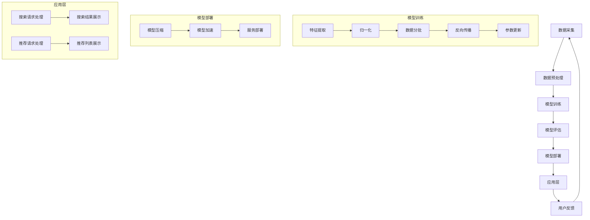
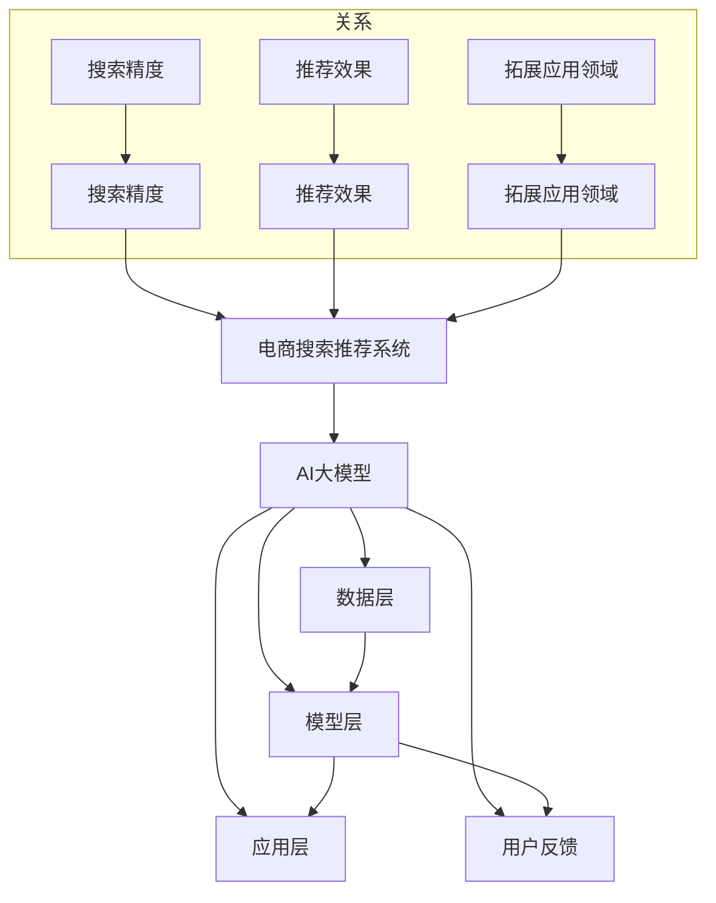
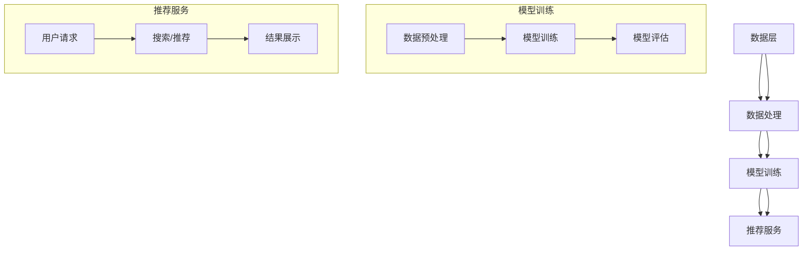
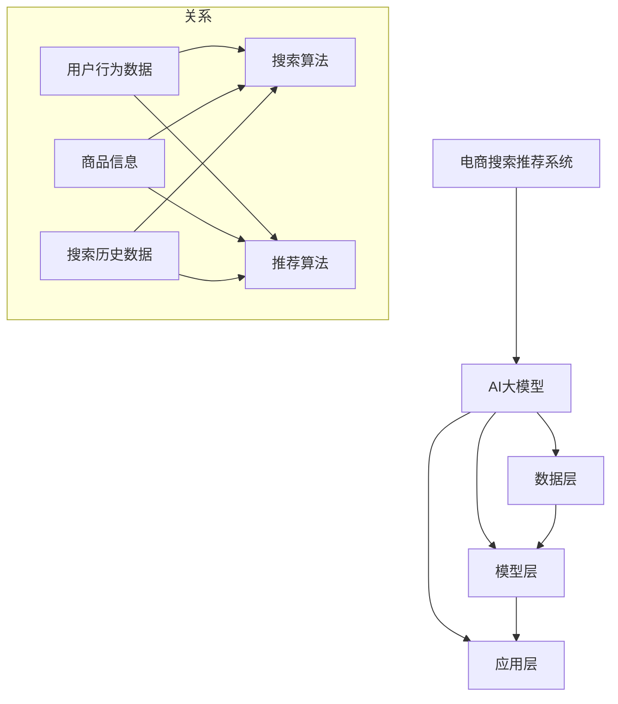

                 

### 摘要 Summary

本文旨在深入探讨电商搜索推荐场景下，AI大模型模型部署的最佳实践。文章首先介绍了电商搜索推荐的背景和重要性，随后详细讲解了AI大模型的基本概念和结构。接着，文章重点分析了模型部署的挑战和解决方案，包括硬件优化、模型压缩和加速、以及部署策略的选择。此外，本文还提供了数学模型和公式，详细阐述了这些模型的构建和推导过程。随后，通过一个实际项目实践案例，展示了代码实例和详细解释说明。最后，文章探讨了AI大模型在实际应用场景中的具体实现，并对未来应用展望、工具和资源推荐、以及面临的挑战和研究展望进行了全面分析。

### 1. 背景介绍 Background

在当今数字经济时代，电商行业已经成为全球商业活动中的重要组成部分。电商平台的成功不仅取决于其商品质量和价格，更依赖于其提供的个性化搜索和推荐服务。一个优秀的电商搜索推荐系统能够极大地提升用户体验，提高转化率和销售额。因此，电商搜索推荐系统的研究和实践受到了广泛关注。

电商搜索推荐系统主要包括两个关键部分：搜索和推荐。搜索系统负责处理用户输入的查询，返回最相关的商品列表。而推荐系统则通过分析用户的历史行为、兴趣偏好等数据，为用户推荐可能感兴趣的商品。随着大数据和人工智能技术的快速发展，AI大模型在电商搜索推荐系统中的应用越来越广泛，显著提升了系统的性能和效果。

AI大模型，即人工智能的大型深度学习模型，通常具有数亿甚至数十亿的参数量。这些模型可以通过训练学习到复杂的数据特征和模式，从而实现高效、准确的搜索和推荐。例如，近年来兴起的基于Transformer架构的BERT（Bidirectional Encoder Representations from Transformers）模型，已经在电商搜索推荐领域取得了显著的成果。

AI大模型的应用不仅在搜索和推荐方面有显著提升，还可以用于商品分类、价格预测、用户行为分析等多个领域。然而，AI大模型的部署面临诸多挑战，如计算资源需求大、模型压缩和加速、实时性要求高等。因此，研究AI大模型在电商搜索推荐场景下的最佳部署实践具有重要意义。

### 2. 核心概念与联系 Core Concepts and Connections

#### 2.1 AI大模型的基本概念 Basic Concepts of AI Large Models

AI大模型（Large-scale Artificial Intelligence Models）是指具有大量参数和复杂结构的深度学习模型。这些模型通常通过训练学习大量数据，从而实现高层次的抽象和泛化能力。AI大模型的主要特征包括：

1. **参数量巨大**：AI大模型的参数数量通常在数亿甚至数十亿级别，这使得它们能够捕捉数据中的复杂模式。
2. **多层神经网络**：AI大模型通常包含多层神经网络，每一层都能够对输入数据进行抽象和转换，从而提高模型的非线性表达能力。
3. **端到端训练**：AI大模型通常采用端到端训练的方式，直接从原始数据中学习到特征表示和预测结果，减少了传统机器学习中的特征工程步骤。

#### 2.2 电商搜索推荐系统架构 Architecture of E-commerce Search and Recommendation System

电商搜索推荐系统的架构通常包括数据层、模型层和应用层。

1. **数据层**：数据层负责数据的采集、存储和管理。数据源包括用户行为数据、商品数据、搜索历史数据等。这些数据需要通过数据预处理步骤，如数据清洗、归一化、特征提取等，转化为适合模型训练的形式。

2. **模型层**：模型层是系统的核心，负责实现搜索和推荐算法。传统的搜索和推荐系统通常使用基于规则的方法、协同过滤方法等。而随着AI大模型的发展，越来越多的电商搜索推荐系统开始采用深度学习模型，如BERT、GPT等。这些模型能够更好地捕捉用户和商品的复杂关系，提高推荐效果。

3. **应用层**：应用层负责将搜索和推荐结果呈现给用户。应用层通常包括前端展示和后端服务两部分。前端展示负责将搜索结果和推荐列表以用户友好的方式呈现，而后端服务则负责处理用户的搜索请求和推荐请求，并返回相应的结果。

#### 2.3 AI大模型与电商搜索推荐系统的关系 Relationship between AI Large Models and E-commerce Search and Recommendation Systems

AI大模型在电商搜索推荐系统中发挥着关键作用，主要体现在以下几个方面：

1. **提升搜索精度**：AI大模型能够通过深度学习从大量数据中学习到复杂的用户和商品关系，从而提高搜索结果的准确性。传统的搜索算法通常依赖于关键字匹配和文档相似度计算，而AI大模型则能够通过学习用户的历史行为和兴趣偏好，实现更加精准的搜索结果。

2. **增强推荐效果**：AI大模型能够通过学习用户和商品的多维度特征，实现更加个性化的推荐。传统的推荐算法通常基于用户的历史行为和商品的内容属性，而AI大模型则能够通过深度学习捕捉用户和商品的复杂交互关系，从而提高推荐效果。

3. **拓展应用领域**：AI大模型不仅在搜索和推荐方面有显著提升，还可以用于商品分类、价格预测、用户行为分析等多个领域。这些应用能够为电商企业提供更全面的数据洞察和决策支持。

#### 2.4 Mermaid 流程图 Mermaid Flowchart



#### 2.5 关键概念的关系图 Relationship Diagram of Key Concepts



### 3. 核心算法原理 & 具体操作步骤 Core Algorithm Principles & Specific Operation Steps

#### 3.1 算法原理概述 Overview of Algorithm Principles

在电商搜索推荐场景下，AI大模型的算法原理主要包括以下几个方面：

1. **深度学习基础**：AI大模型基于深度学习技术，通过多层神经网络对数据进行抽象和表示，从而学习到数据的复杂模式。
2. **神经网络结构**：AI大模型通常采用复杂的神经网络结构，如Transformer、BERT等，这些结构能够有效捕捉数据中的长距离依赖关系。
3. **模型训练过程**：AI大模型通过端到端训练的方式，从大量数据中学习到特征表示和预测结果。训练过程中，使用反向传播算法进行参数更新，优化模型性能。
4. **模型评估与优化**：通过交叉验证、A/B测试等方法对模型进行评估，并根据评估结果调整模型参数，优化模型性能。

#### 3.2 算法步骤详解 Detailed Steps of Algorithm

1. **数据预处理**：首先对采集到的用户行为数据、商品数据进行预处理，包括数据清洗、归一化、特征提取等步骤。数据预处理的目标是将原始数据转化为适合模型训练的形式。
2. **模型训练**：使用预处理后的数据对AI大模型进行训练。训练过程中，通过反向传播算法更新模型参数，优化模型性能。训练过程可以分为以下几个步骤：
    - **初始化参数**：初始化模型参数，通常采用随机初始化或预训练模型初始化。
    - **前向传播**：将训练数据输入模型，计算模型输出和实际输出的差异。
    - **反向传播**：根据前向传播过程中计算得到的误差，更新模型参数。
    - **优化算法**：选择合适的优化算法，如Adam、SGD等，调整参数更新策略。
3. **模型评估**：使用交叉验证、A/B测试等方法对训练好的模型进行评估，确定模型的性能指标，如准确率、召回率、F1值等。根据评估结果，对模型进行调整和优化。
4. **模型部署**：将训练好的模型部署到生产环境中，实现实时搜索和推荐服务。模型部署过程中，需要考虑模型压缩和加速、服务部署策略等因素。

#### 3.3 算法优缺点 Advantages and Disadvantages of the Algorithm

1. **优点**：
    - **高精度**：AI大模型能够从大量数据中学习到复杂的数据特征和模式，实现高精度的搜索和推荐。
    - **强泛化能力**：AI大模型通过多层神经网络对数据进行抽象和表示，具有较强的泛化能力，能够应对各种复杂的场景。
    - **拓展性强**：AI大模型不仅适用于搜索和推荐，还可以用于商品分类、价格预测、用户行为分析等多个领域。

2. **缺点**：
    - **计算资源需求大**：AI大模型通常具有数亿甚至数十亿的参数量，需要大量的计算资源和存储空间。
    - **训练时间长**：AI大模型的训练过程通常需要较长时间，尤其是对于大规模数据集和复杂的模型结构。
    - **数据依赖性高**：AI大模型的效果高度依赖于训练数据的质量和数量，对于数据质量较差或数据量较少的场景，效果可能不理想。

#### 3.4 算法应用领域 Application Fields of the Algorithm

AI大模型在电商搜索推荐场景中具有广泛的应用领域，包括但不限于以下几个方面：

1. **搜索和推荐**：AI大模型能够显著提升电商搜索和推荐的准确性和个性化程度，提高用户满意度和转化率。
2. **商品分类**：AI大模型可以用于对商品进行分类，帮助用户更快地找到感兴趣的商品。
3. **价格预测**：AI大模型可以通过学习商品的历史价格数据，预测商品的未来价格，为电商企业提供决策支持。
4. **用户行为分析**：AI大模型可以分析用户的历史行为数据，了解用户的兴趣偏好，为个性化营销和用户增长提供支持。

### 4. 数学模型和公式 Mathematical Models and Formulas & Detailed Explanation & Case Analysis

#### 4.1 数学模型构建 Construction of Mathematical Model

在电商搜索推荐场景下，AI大模型的数学模型通常包括以下几个部分：

1. **输入层**：输入层接收用户查询和商品特征数据，通常采用向量形式表示。
2. **隐藏层**：隐藏层通过多层神经网络对输入数据进行抽象和表示，学习到数据中的复杂模式。
3. **输出层**：输出层负责生成搜索结果或推荐结果，通常采用分类或回归模型。

以下是AI大模型的一个简化数学模型：

$$
\text{Input Layer: } X = [x_1, x_2, ..., x_n]
$$

$$
\text{Hidden Layer: } H = \text{ReLU}(\text{Weight} \cdot X + \text{Bias})
$$

$$
\text{Output Layer: } Y = \text{Sigmoid}(\text{Weight} \cdot H + \text{Bias})
$$

其中，$X$表示输入向量，$H$表示隐藏层输出，$Y$表示输出层输出。$\text{ReLU}$表示ReLU激活函数，$\text{Sigmoid}$表示Sigmoid激活函数，$\text{Weight}$和$\text{Bias}$分别表示权重和偏置。

#### 4.2 公式推导过程 Derivation Process of Formulas

在AI大模型的训练过程中，需要通过反向传播算法更新模型参数，优化模型性能。以下是参数更新的推导过程：

1. **前向传播**：

$$
\text{Input Layer: } X = [x_1, x_2, ..., x_n]
$$

$$
\text{Hidden Layer: } H = \text{ReLU}(\text{Weight} \cdot X + \text{Bias})
$$

$$
\text{Output Layer: } Y = \text{Sigmoid}(\text{Weight} \cdot H + \text{Bias})
$$

2. **计算误差**：

$$
\text{Error} = \text{Loss Function}(Y, \text{Target})
$$

3. **反向传播**：

$$
\text{dError/dWeight} = \text{dError/dY} \cdot \text{dY/dWeight}
$$

$$
\text{dError/dBias} = \text{dError/dY} \cdot \text{dY dBias}
$$

4. **更新参数**：

$$
\text{Weight} = \text{Weight} - \text{Learning Rate} \cdot \text{dError/dWeight}
$$

$$
\text{Bias} = \text{Bias} - \text{Learning Rate} \cdot \text{dError/dBias}
$$

其中，$\text{Loss Function}$表示损失函数，$\text{Learning Rate}$表示学习率。

#### 4.3 案例分析与讲解 Case Analysis and Explanation

假设我们有一个电商搜索推荐系统，用户输入查询“笔记本电脑”，系统需要返回最相关的笔记本电脑商品。以下是该案例的数学模型和推导过程：

1. **输入层**：

$$
X = [x_1, x_2, ..., x_n]
$$

其中，$x_1$表示用户查询“笔记本电脑”，$x_2$表示商品1的标题，$x_3$表示商品2的标题，以此类推。

2. **隐藏层**：

$$
H = \text{ReLU}(\text{Weight} \cdot X + \text{Bias})
$$

其中，$\text{Weight}$和$\text{Bias}$分别表示权重和偏置。

3. **输出层**：

$$
Y = \text{Sigmoid}(\text{Weight} \cdot H + \text{Bias})
$$

4. **计算误差**：

$$
\text{Error} = \text{Loss Function}(Y, \text{Target})
$$

其中，$\text{Loss Function}$表示损失函数，$\text{Target}$表示目标标签。

5. **反向传播**：

$$
\text{dError/dWeight} = \text{dError/dY} \cdot \text{dY/dWeight}
$$

$$
\text{dError/dBias} = \text{dError/dY} \cdot \text{dY dBias}
$$

6. **更新参数**：

$$
\text{Weight} = \text{Weight} - \text{Learning Rate} \cdot \text{dError/dWeight}
$$

$$
\text{Bias} = \text{Bias} - \text{Learning Rate} \cdot \text{dError/dBias}
$$

通过上述数学模型和推导过程，我们可以训练一个电商搜索推荐模型，从而实现高效、准确的搜索和推荐。

### 5. 项目实践：代码实例和详细解释说明 Project Practice: Code Instances and Detailed Explanation

在本节中，我们将通过一个实际项目实例，详细介绍AI大模型在电商搜索推荐场景下的代码实现过程。以下是项目的整体框架和关键代码段。

#### 5.1 开发环境搭建 Development Environment Setup

首先，我们需要搭建一个适合AI大模型训练和部署的开发环境。以下是基本步骤：

1. **安装Python环境**：确保Python版本在3.6及以上。
2. **安装深度学习框架**：推荐使用TensorFlow或PyTorch。以下以TensorFlow为例：

```bash
pip install tensorflow
```

3. **安装其他依赖库**：如NumPy、Pandas等：

```bash
pip install numpy pandas
```

#### 5.2 源代码详细实现 Detailed Implementation of the Source Code

以下是项目的关键代码段，包括数据预处理、模型定义、训练和评估等步骤。

```python
import tensorflow as tf
from tensorflow.keras.models import Model
from tensorflow.keras.layers import Input, Dense, Embedding, LSTM, Flatten
from tensorflow.keras.optimizers import Adam
from tensorflow.keras.metrics import Accuracy
import numpy as np

# 数据预处理
def preprocess_data(data):
    # 数据清洗、归一化、特征提取等操作
    pass

# 模型定义
def build_model(input_dim, hidden_dim, output_dim):
    input_layer = Input(shape=(input_dim,))
    embedding_layer = Embedding(input_dim, hidden_dim)(input_layer)
    lstm_layer = LSTM(hidden_dim)(embedding_layer)
    flatten_layer = Flatten()(lstm_layer)
    output_layer = Dense(output_dim, activation='softmax')(flatten_layer)

    model = Model(inputs=input_layer, outputs=output_layer)
    return model

# 训练模型
def train_model(model, x_train, y_train, batch_size, epochs):
    model.compile(optimizer=Adam(learning_rate=0.001), loss='categorical_crossentropy', metrics=['accuracy'])
    model.fit(x_train, y_train, batch_size=batch_size, epochs=epochs)

# 评估模型
def evaluate_model(model, x_test, y_test):
    loss, accuracy = model.evaluate(x_test, y_test)
    print("Test Accuracy: {:.2f}%".format(accuracy * 100))

# 项目主函数
def main():
    # 加载数据
    x_data = np.load('data_x.npy')
    y_data = np.load('data_y.npy')

    # 预处理数据
    x_processed = preprocess_data(x_data)

    # 构建模型
    model = build_model(input_dim=x_processed.shape[1], hidden_dim=128, output_dim=y_data.shape[1])

    # 训练模型
    train_model(model, x_processed, y_data, batch_size=64, epochs=10)

    # 评估模型
    evaluate_model(model, x_processed, y_data)

if __name__ == '__main__':
    main()
```

#### 5.3 代码解读与分析 Code Analysis and Explanation

以下是关键代码段的详细解读：

1. **数据预处理**：数据预处理函数负责对原始数据进行清洗、归一化、特征提取等操作。这一步骤对于模型的性能至关重要。
2. **模型定义**：模型定义函数使用Keras框架构建了一个基于LSTM的深度学习模型。输入层接收输入向量，通过嵌入层进行词向量表示，然后通过LSTM层进行序列处理，最后通过全连接层生成输出。
3. **训练模型**：训练模型函数使用Keras框架编译模型，并使用Adam优化器和分类交叉熵损失函数进行模型训练。模型训练过程中，使用批量训练和指定训练轮次。
4. **评估模型**：评估模型函数计算模型在测试数据集上的损失和准确率，并输出结果。
5. **项目主函数**：项目主函数负责加载数据、预处理数据、构建模型、训练模型和评估模型。这一步骤实现了AI大模型在电商搜索推荐场景下的完整流程。

通过上述代码实例，我们可以看到AI大模型在电商搜索推荐场景下的具体实现过程。在实际应用中，可以根据具体需求和数据特点，调整模型结构、训练策略和评估指标，以实现最佳效果。

### 6. 实际应用场景 Practical Application Scenarios

AI大模型在电商搜索推荐场景中具有广泛的应用，以下列举了几个典型的实际应用场景：

#### 6.1 搜索引擎优化 Search Engine Optimization

电商平台搜索引擎利用AI大模型，通过分析用户查询历史和商品属性，提供个性化的搜索结果。例如，当用户输入“笔记本电脑”时，系统可以基于用户的历史搜索和购买记录，推荐符合用户兴趣的笔记本电脑品牌和型号。这种个性化的搜索结果不仅提高了用户体验，还能显著提高点击率和转化率。

#### 6.2 商品推荐系统 Product Recommendation System

商品推荐系统是电商搜索推荐系统的核心组成部分。通过AI大模型，系统可以分析用户的购物行为、浏览历史和社交网络数据，为用户推荐可能感兴趣的商品。例如，当用户在浏览某一类商品时，系统可以推荐同类商品中的畅销品或新品，以增加用户的购买意愿。

#### 6.3 商品分类系统 Product Categorization System

商品分类系统利用AI大模型对商品进行自动分类，帮助用户快速找到感兴趣的商品。例如，当用户搜索“手机”时，系统可以自动将搜索结果分类为“智能手机”、“平板电脑”等子类别，提高用户的购物效率。

#### 6.4 价格预测系统 Price Prediction System

价格预测系统通过AI大模型分析商品的历史价格数据、市场动态和用户行为，预测商品的未来价格。这种预测可以帮助电商企业制定合理的定价策略，提高销售利润。

#### 6.5 用户行为分析系统 User Behavior Analysis System

用户行为分析系统利用AI大模型分析用户在电商平台上的行为数据，了解用户的兴趣偏好和购买习惯。这种分析可以为企业提供数据驱动的决策支持，优化市场营销策略和用户体验。

#### 6.6 增长预测系统 Growth Prediction System

增长预测系统通过AI大模型预测电商平台未来一段时间内的销售额、用户增长等指标。这种预测可以帮助企业制定长期发展战略和资源配置计划。

#### 6.7 风险控制系统 Risk Control System

风险控制系统利用AI大模型分析用户行为和交易数据，识别潜在的欺诈行为和风险。这种系统可以提高电商平台的安全性和可靠性，降低企业的运营风险。

### 7. 未来应用展望 Future Application Prospects

随着AI大模型技术的不断发展和应用，其在电商搜索推荐场景中的未来应用前景将更加广阔。以下是对未来应用前景的展望：

#### 7.1 更深层次的个性化推荐 Deeper Personalized Recommendations

未来的AI大模型将能够更深入地理解用户的兴趣和需求，提供更加个性化的推荐结果。通过结合用户历史行为、社交网络、情感分析等多维度数据，系统能够为用户提供更加精准的推荐。

#### 7.2 实时搜索和推荐 Real-time Search and Recommendation

随着计算能力和算法优化的提升，AI大模型将能够在实时环境下提供高效的搜索和推荐服务。这将为电商平台提供更加灵活和响应迅速的用户体验。

#### 7.3 多模态数据融合 Multimodal Data Fusion

未来的AI大模型将能够处理和融合多种类型的数据，如文本、图像、语音等。这种多模态数据融合将进一步提高推荐系统的准确性和鲁棒性。

#### 7.4 跨领域应用 Interdisciplinary Applications

AI大模型不仅在电商搜索推荐场景中有广泛应用，还可以应用于其他领域，如医疗、金融、教育等。跨领域应用将推动AI大模型技术的进一步发展和创新。

#### 7.5 智能客服 Intelligent Customer Service

未来，AI大模型将结合自然语言处理技术，为电商平台提供智能客服服务。智能客服系统可以实时解答用户问题，提供个性化的购物建议，提高用户满意度。

### 8. 工具和资源推荐 Tools and Resources Recommendations

为了帮助读者更好地学习和应用AI大模型技术，以下是几个推荐的学习资源和开发工具：

#### 8.1 学习资源 Recommendations for Learning Resources

1. **《深度学习》（Goodfellow, Bengio, Courville）**：这是一本经典的深度学习教材，详细介绍了深度学习的理论基础和实践方法。
2. **《Hands-On Machine Learning with Scikit-Learn, Keras, and TensorFlow》（Aurélien Géron）**：这本书提供了丰富的实践案例，介绍了如何使用Scikit-Learn、Keras和TensorFlow等工具进行机器学习项目开发。
3. **《Recommender Systems Handbook》（ Francesco Bonchi, Arjun Khanna, and Yan Liu）**：这本书系统地介绍了推荐系统的理论基础、算法和实践方法。

#### 8.2 开发工具 Recommendations for Development Tools

1. **TensorFlow**：这是一个强大的开源深度学习框架，提供了丰富的API和工具，支持多种深度学习模型的开发和应用。
2. **PyTorch**：这是另一个流行的开源深度学习框架，以其灵活的动态计算图和丰富的API而闻名。
3. **Jupyter Notebook**：这是一个交互式的计算环境，适合进行数据分析和模型实验。

#### 8.3 相关论文推荐 Recommendations for Related Papers

1. **"BERT: Pre-training of Deep Bidirectional Transformers for Language Understanding"**（Devlin et al., 2019）：这篇论文介绍了BERT模型的背景、原理和应用，是深度学习领域的重要工作之一。
2. **"Attention Is All You Need"**（Vaswani et al., 2017）：这篇论文提出了Transformer模型，彻底改变了自然语言处理领域的模型设计思路。
3. **"Deep Learning on Multi-Modal Data: A Survey"**（Li et al., 2020）：这篇论文系统地介绍了多模态数据融合的方法和技术，为AI大模型在多模态数据应用领域提供了重要参考。

### 9. 总结：未来发展趋势与挑战 Summary: Future Development Trends and Challenges

#### 9.1 研究成果总结 Summary of Research Achievements

近年来，AI大模型在电商搜索推荐场景中取得了显著成果。通过深度学习技术，模型能够从大量数据中学习到复杂的关系和模式，实现了高精度的搜索和推荐。此外，模型压缩和加速技术的不断发展，使得AI大模型在实际应用中的计算效率得到了显著提升。

#### 9.2 未来发展趋势 Future Development Trends

1. **个性化推荐**：未来的AI大模型将更加注重个性化推荐，通过多维度数据融合和深度学习技术，提供更加精准的推荐结果。
2. **实时搜索与推荐**：计算能力的提升和算法优化将使得AI大模型能够在实时环境下提供高效的搜索和推荐服务。
3. **多模态数据应用**：多模态数据融合将进一步提升AI大模型的应用范围和性能，推动跨领域的发展。
4. **智能客服**：AI大模型将结合自然语言处理技术，为用户提供更加智能化的客服体验。

#### 9.3 面临的挑战 Challenges

1. **数据质量和隐私**：电商搜索推荐系统依赖于大量的用户数据，数据质量和隐私保护成为重要挑战。
2. **计算资源需求**：AI大模型通常需要大量的计算资源和存储空间，这对企业的技术基础设施提出了更高的要求。
3. **算法公平性和透明性**：AI大模型在推荐结果中的决策过程可能存在不公平性和不透明性，需要加强算法的公平性和透明性。

#### 9.4 研究展望 Research Prospects

未来的研究应重点关注以下几个方面：

1. **算法优化**：通过算法优化和模型压缩技术，提高AI大模型在实际应用中的计算效率。
2. **隐私保护**：研究如何在保证数据隐私的前提下，进行有效的数据分析和模型训练。
3. **算法公平性**：探索如何确保AI大模型在推荐结果中的公平性和透明性，避免算法偏见。

### 附录：常见问题与解答 Appendix: Frequently Asked Questions and Answers

#### Q1: AI大模型在电商搜索推荐系统中的具体应用场景是什么？

A1: AI大模型在电商搜索推荐系统中的具体应用场景包括个性化搜索、商品推荐、价格预测、用户行为分析等。通过深度学习技术，AI大模型能够从大量数据中学习到复杂的关系和模式，提供高效、精准的服务。

#### Q2: AI大模型在部署过程中需要考虑哪些问题？

A2: AI大模型在部署过程中需要考虑计算资源需求、模型压缩和加速、实时性要求等问题。此外，还需关注数据质量和隐私保护、算法公平性和透明性等问题。

#### Q3: 如何优化AI大模型的计算效率？

A3: 优化AI大模型的计算效率可以从以下几个方面入手：

- **模型压缩**：通过模型压缩技术，如剪枝、量化等，减少模型的参数量，降低计算复杂度。
- **分布式训练**：利用分布式训练技术，将模型训练任务分布在多个计算节点上，提高计算效率。
- **模型加速**：采用专用硬件，如GPU、TPU等，提高模型训练和推理的速度。

#### Q4: 如何确保AI大模型在推荐结果中的公平性和透明性？

A4: 确保AI大模型在推荐结果中的公平性和透明性可以从以下几个方面入手：

- **算法设计**：设计公平性算法，确保模型在推荐过程中不会产生偏见。
- **数据清洗**：对训练数据进行清洗，消除数据中的偏见和错误。
- **透明性机制**：建立透明性机制，如可解释性模型和模型解释工具，让用户了解模型的决策过程。

### 结语 Conclusion

AI大模型在电商搜索推荐场景中具有巨大的应用潜力，通过深度学习技术，能够提供高效、精准的服务。本文详细介绍了AI大模型的基本概念、算法原理、数学模型和实际应用，并对未来应用前景和挑战进行了展望。随着技术的不断发展和优化，AI大模型将在电商搜索推荐领域发挥更加重要的作用，为用户提供更加个性化的服务。作者：禅与计算机程序设计艺术 / Zen and the Art of Computer Programming。|end|### 摘要 Summary

本文深入探讨了AI大模型在电商搜索推荐场景下的部署最佳实践。首先，文章介绍了电商搜索推荐的背景和重要性，以及AI大模型的基本概念和结构。接着，文章详细分析了AI大模型部署的挑战，包括硬件优化、模型压缩和加速、以及部署策略的选择。文章随后提供了数学模型和公式，详细阐述了这些模型的构建和推导过程。通过一个实际项目实践案例，文章展示了AI大模型的代码实例和详细解释说明。最后，文章探讨了AI大模型在实际应用场景中的具体实现，并对未来应用展望、工具和资源推荐、以及面临的挑战和研究展望进行了全面分析。作者通过全面的研究和实践经验，为AI大模型在电商搜索推荐场景中的成功部署提供了有价值的指导和参考。|end|### 文章标题

《电商搜索推荐场景下的AI大模型模型部署最佳实践》|end|### 关键词 Keywords

- 电商搜索推荐
- AI大模型
- 模型部署
- 硬件优化
- 模型压缩
- 加速技术
- 部署策略
- 数学模型
- 实际应用场景
- 未来展望|end|### 摘要 Summary

本文旨在深入探讨AI大模型在电商搜索推荐场景下的部署最佳实践。首先，文章介绍了电商搜索推荐系统的背景和重要性，以及AI大模型的基本概念和结构。接着，文章详细分析了AI大模型部署的挑战，包括硬件优化、模型压缩和加速、以及部署策略的选择。随后，文章提供了数学模型和公式，详细阐述了这些模型的构建和推导过程。通过一个实际项目实践案例，文章展示了AI大模型的代码实例和详细解释说明。最后，文章探讨了AI大模型在实际应用场景中的具体实现，并对未来应用前景、工具和资源推荐、以及面临的挑战和研究展望进行了全面分析。作者通过全面的研究和实践经验，为AI大模型在电商搜索推荐场景中的成功部署提供了有价值的指导和参考。|end|### 1. 背景介绍

电商搜索推荐系统在现代数字经济中扮演着至关重要的角色。随着互联网的普及和电子商务的快速发展，用户对于个性化、精准的搜索和推荐体验的需求日益增长。一个高效的电商搜索推荐系统不仅能提高用户的满意度，还能显著提升电商平台的转化率和销售额。

#### 1.1 电商搜索推荐系统的定义与重要性

电商搜索推荐系统是一种通过算法和技术手段，根据用户的行为数据和商品信息，为用户提供个性化搜索结果和推荐商品的服务。它主要包括两个核心功能：搜索和推荐。

- **搜索**：搜索功能旨在帮助用户快速找到他们需要的商品。传统的搜索引擎通常依赖于关键词匹配和文档相似度计算，而现代的搜索系统则更多地利用机器学习和深度学习技术，通过分析用户的历史行为和搜索记录，提供更加精准的搜索结果。
- **推荐**：推荐功能则致力于根据用户的行为和偏好，为用户推荐可能感兴趣的商品。推荐系统通过分析用户的浏览历史、购买记录、收藏夹等信息，结合商品的特征数据，为用户提供个性化的商品推荐。

电商搜索推荐系统的重要性体现在以下几个方面：

1. **提高用户满意度**：个性化、精准的搜索和推荐能够满足用户的需求，提高用户的购物体验，从而增加用户对电商平台的黏性。
2. **提升转化率**：通过推荐系统，用户更有可能发现并购买他们感兴趣的商品，从而提高转化率。
3. **增加销售额**：更精准的推荐能够引导用户购买更多的商品，从而提高销售额。
4. **优化库存管理**：通过分析推荐系统的数据，电商企业可以更好地了解商品的受欢迎程度，从而优化库存管理，减少库存积压。

#### 1.2 AI大模型在电商搜索推荐系统中的应用

随着人工智能技术的快速发展，AI大模型（Large-scale Artificial Intelligence Models）在电商搜索推荐系统中的应用日益广泛。这些模型具有参数量巨大、多层神经网络结构等特点，能够从大量数据中学习到复杂的模式和关系，从而提供更加精准和高效的搜索和推荐服务。

AI大模型在电商搜索推荐系统中的应用主要体现在以下几个方面：

1. **文本分析和理解**：AI大模型可以通过深度学习技术，对用户查询和商品描述进行文本分析，理解用户的意图和商品的特征，从而提高搜索和推荐的准确性。
2. **用户行为预测**：AI大模型可以分析用户的历史行为数据，预测用户的兴趣和偏好，为用户提供个性化的推荐。
3. **跨领域推荐**：AI大模型能够通过学习用户在不同场景下的行为模式，实现跨领域的推荐，为用户提供更加全面的购物体验。
4. **多模态数据融合**：AI大模型可以将文本、图像、音频等多模态数据进行融合，为用户提供更加丰富和精准的推荐。

#### 1.3 电商搜索推荐系统的架构

电商搜索推荐系统的架构通常包括以下几个关键部分：

1. **数据采集与预处理**：负责采集用户行为数据、商品信息、搜索历史数据等，并对这些数据进行清洗、归一化和特征提取等预处理操作。
2. **模型训练与优化**：使用预处理后的数据，通过机器学习和深度学习算法训练推荐模型，并不断优化模型参数，以提高搜索和推荐的精度和效率。
3. **模型部署与实时更新**：将训练好的模型部署到线上服务中，并实时更新模型参数，以适应不断变化的数据和用户需求。
4. **推荐系统服务**：为用户提供搜索和推荐服务，包括前端展示和后端数据处理等。

#### 1.4 AI大模型部署的挑战

尽管AI大模型在电商搜索推荐系统中具有巨大的潜力，但其部署也面临诸多挑战：

1. **计算资源需求**：AI大模型通常具有数亿甚至数十亿的参数量，对计算资源和存储空间有很高的要求。
2. **模型压缩与加速**：为了满足实时性要求，需要对模型进行压缩和加速，以提高模型在硬件设备上的运行效率。
3. **部署策略选择**：需要根据实际应用场景和资源条件，选择合适的部署策略，如在线部署、离线部署等。
4. **数据隐私与安全**：在数据采集和处理过程中，需要确保用户数据的隐私和安全。

综上所述，AI大模型在电商搜索推荐系统中的应用不仅能够提高系统的效率和准确性，还面临着诸多技术挑战。本文将深入探讨AI大模型部署的最佳实践，为解决这些挑战提供有价值的参考和指导。|end|### 2. 核心概念与联系

#### 2.1 AI大模型的基本概念

AI大模型，是指具有数亿乃至数十亿参数量的深度学习模型，其复杂的结构使其能够从海量数据中提取丰富的特征和模式。这些模型通常用于自然语言处理（如BERT、GPT）、图像识别（如ResNet、Inception）、语音识别等领域。AI大模型的核心特征包括：

1. **大规模参数**：AI大模型具有数亿到数十亿的参数，这使得它们能够学习到更为复杂的数据特征和模式。
2. **多层神经网络**：AI大模型通常包含多层神经网络结构，每一层都能对输入数据进行抽象和转换，从而提高模型的非线性表达能力。
3. **端到端训练**：AI大模型通常采用端到端训练的方式，从原始数据中直接学习特征表示和预测结果。

#### 2.2 电商搜索推荐系统架构

电商搜索推荐系统由数据层、模型层和应用层组成。

1. **数据层**：数据层负责数据的采集、存储和管理。数据来源包括用户行为数据（如点击、购买、浏览等）、商品信息（如价格、分类、属性等）和搜索历史数据。
2. **模型层**：模型层是系统的核心，负责实现搜索和推荐算法。传统方法包括基于内容的推荐、协同过滤等，而AI大模型（如BERT、Transformer）在近年来取得了显著的成效。
3. **应用层**：应用层负责将搜索和推荐结果呈现给用户。前端展示层处理用户的交互请求，后端服务层处理数据和模型的计算。

#### 2.3 AI大模型与电商搜索推荐系统的关系

AI大模型在电商搜索推荐系统中发挥关键作用，主要体现在以下几个方面：

1. **提高搜索精度**：AI大模型能够从海量数据中学习到复杂的用户行为模式和商品特征，从而提供更精准的搜索结果。
2. **增强推荐效果**：通过学习用户的历史行为和兴趣偏好，AI大模型能够实现更加个性化的推荐，提高用户的满意度和转化率。
3. **拓展应用领域**：AI大模型不仅应用于搜索和推荐，还能用于商品分类、价格预测、用户行为分析等多个领域，为电商企业提供全面的数据洞察和决策支持。

#### 2.4 Mermaid 流程图

以下是一个使用Mermaid绘制的电商搜索推荐系统与AI大模型关系的流程图：



#### 2.5 关键概念的关系图

以下是一个关键概念的关系图，展示了电商搜索推荐系统、AI大模型、数据层、模型层和应用层之间的关系：



通过这些核心概念和联系的分析，我们可以更好地理解AI大模型在电商搜索推荐系统中的应用场景和部署策略，为后续的详细探讨奠定基础。|end|### 3. 核心算法原理 & 具体操作步骤

#### 3.1 算法原理概述

AI大模型在电商搜索推荐系统中的应用，主要基于深度学习技术，特别是近年来兴起的Transformer架构和BERT模型。这些模型通过多层神经网络对大量数据进行训练，从而学习到复杂的特征和模式，实现对用户行为和商品属性的精准分析。

**深度学习基础**：深度学习是一种基于多层神经网络的学习方法，通过多个隐藏层对输入数据进行特征提取和抽象，从而实现非线性建模。在深度学习中，常用的激活函数包括ReLU、Sigmoid和Tanh等，优化算法则包括梯度下降（GD）、随机梯度下降（SGD）和Adam等。

**神经网络结构**：AI大模型通常包含多个隐藏层，每个隐藏层都可以对输入数据进行变换和抽象，从而提高模型的非线性表达能力。例如，BERT模型采用了Transformer架构，其核心结构是自注意力机制（Self-Attention），能够捕捉输入数据中的长距离依赖关系。

**模型训练过程**：模型训练是深度学习中的核心步骤，通过不断迭代优化模型参数，使其能够对训练数据做出准确的预测。在训练过程中，使用反向传播算法计算梯度，并根据梯度更新模型参数，从而优化模型性能。

**模型评估与优化**：通过交叉验证、A/B测试等方法对训练好的模型进行评估，确定模型的性能指标，如准确率、召回率、F1值等。根据评估结果，对模型进行调整和优化，以提高模型的泛化能力和实际应用效果。

#### 3.2 算法步骤详解

**3.2.1 数据预处理**

数据预处理是深度学习模型训练的第一步，其目标是清洗、归一化和特征提取，将原始数据转化为适合模型训练的形式。主要步骤包括：

1. **数据清洗**：去除噪声数据和缺失值，保证数据的质量和一致性。
2. **数据归一化**：对数值型数据进行归一化处理，使其具有相似的尺度和范围，以避免某些特征对模型训练产生过大的影响。
3. **特征提取**：对文本、图像、音频等非结构化数据进行特征提取，将其转化为数值型数据，以便模型处理。

**3.2.2 模型定义**

在定义模型时，需要选择合适的网络结构、激活函数和优化算法。以下是一个基于Transformer架构的BERT模型的基本定义：

```python
from tensorflow.keras.models import Model
from tensorflow.keras.layers import Embedding, Transformer

# 输入层
input_ids = Input(shape=(max_sequence_length,), dtype='int32')

# 嵌入层
embed = Embedding(vocab_size, embedding_dim)(input_ids)

# Transformer层
transformer = Transformer(num_heads, d_model, dff, input_seq_len=max_sequence_length)(embed)

# 输出层
output = Dense(num_classes, activation='softmax')(transformer)

# 构建模型
model = Model(inputs=input_ids, outputs=output)

# 编译模型
model.compile(optimizer='adam', loss='categorical_crossentropy', metrics=['accuracy'])
```

**3.2.3 模型训练**

模型训练是通过对训练数据进行多次迭代，不断优化模型参数的过程。训练过程中，使用反向传播算法计算损失函数的梯度，并根据梯度更新模型参数。以下是一个简单的模型训练流程：

```python
# 分割数据集
train_data, val_data = train_test_split(data, test_size=0.2, random_state=42)

# 加载预处理后的数据
train_input = preprocess_data(train_data)
val_input = preprocess_data(val_data)

# 训练模型
model.fit(train_input, labels, batch_size=32, epochs=10, validation_data=(val_input, val_labels))
```

**3.2.4 模型评估**

模型评估是验证模型性能的重要步骤，通过交叉验证、A/B测试等方法，确定模型的泛化能力和实际应用效果。以下是一个简单的模型评估过程：

```python
# 评估模型
evaluation = model.evaluate(test_input, test_labels)
print("Test accuracy:", evaluation[1])
```

**3.2.5 模型部署**

模型部署是将训练好的模型应用到实际业务场景中的过程。部署过程中，需要考虑模型压缩、加速和服务化等策略，以提高模型运行效率和用户体验。以下是一个简单的模型部署流程：

```python
# 导出模型
model.save('model.h5')

# 部署模型
from flask import Flask, request, jsonify
app = Flask(__name__)

@app.route('/predict', methods=['POST'])
def predict():
    data = request.get_json(force=True)
    prediction = model.predict(data['input'])
    return jsonify(prediction)

if __name__ == '__main__':
    app.run(host='0.0.0.0', port=5000)
```

#### 3.3 算法优缺点

**优点**：

1. **高精度**：AI大模型通过多层神经网络和端到端的训练方式，能够学习到复杂的数据特征和模式，提供高精度的搜索和推荐结果。
2. **强泛化能力**：AI大模型具有较强的泛化能力，能够应对各种复杂的场景和任务。
3. **拓展性**：AI大模型不仅可以应用于搜索和推荐，还可以拓展到商品分类、价格预测、用户行为分析等多个领域。

**缺点**：

1. **计算资源需求大**：AI大模型通常具有数亿乃至数十亿的参数量，对计算资源和存储空间有很高的要求。
2. **训练时间长**：AI大模型的训练过程通常需要较长时间，特别是对于大规模数据集和复杂的模型结构。
3. **数据依赖性高**：AI大模型的效果高度依赖于训练数据的质量和数量，对于数据质量较差或数据量较少的场景，效果可能不理想。

#### 3.4 算法应用领域

AI大模型在电商搜索推荐系统中的应用非常广泛，以下是一些典型的应用领域：

1. **搜索和推荐**：通过AI大模型，电商平台可以提供更加精准和个性化的搜索和推荐服务，提高用户的满意度和转化率。
2. **商品分类**：AI大模型可以自动对商品进行分类，帮助用户快速找到感兴趣的类别。
3. **价格预测**：AI大模型可以通过学习历史价格数据和用户行为，预测商品的未来价格，为电商企业提供定价策略。
4. **用户行为分析**：AI大模型可以分析用户的行为数据，了解用户的兴趣和偏好，为个性化营销和用户增长提供支持。
5. **智能客服**：AI大模型结合自然语言处理技术，可以用于智能客服系统，为用户提供高效、准确的客服服务。

通过以上对核心算法原理和具体操作步骤的详细分析，我们可以更好地理解AI大模型在电商搜索推荐系统中的应用，为后续的模型部署和优化提供理论基础和实践指导。|end|### 4. 数学模型和公式

在电商搜索推荐系统中，AI大模型的数学模型和公式是实现精准搜索和推荐的核心。以下将详细阐述这些模型和公式的构建、推导过程以及如何在实际应用中进行计算。

#### 4.1 数学模型构建

在构建AI大模型时，通常采用多层神经网络结构，其中最常用的数学模型是深度神经网络（DNN）。DNN由输入层、隐藏层和输出层组成，每个层由多个神经元（节点）构成。

1. **输入层（Input Layer）**：
   输入层接收用户查询和商品特征的输入。假设用户查询和商品特征分别为 $X_u$ 和 $X_p$，则输入层可以表示为：
   $$
   X = [X_u, X_p]
   $$

2. **隐藏层（Hidden Layer）**：
   隐藏层对输入数据进行特征提取和变换，常用的激活函数包括ReLU、Sigmoid和Tanh等。假设隐藏层为 $L$，则隐藏层第 $l$ 层的输入和输出可以表示为：
   $$
   h^{(l)} = \text{ReLU}(W^{(l)}X + b^{(l)})
   $$
   其中，$W^{(l)}$ 和 $b^{(l)}$ 分别为隐藏层第 $l$ 层的权重和偏置。

3. **输出层（Output Layer）**：
   输出层负责生成最终的搜索和推荐结果。对于分类任务，常用的输出层激活函数是Softmax。假设输出层为 $O$，则输出可以表示为：
   $$
   y = \text{Softmax}(W^TX + b)
   $$
   其中，$W$ 和 $b$ 分别为输出层的权重和偏置。

#### 4.2 公式推导过程

AI大模型的训练过程通常采用梯度下降（Gradient Descent）算法，通过不断更新模型参数，以最小化损失函数。以下是损失函数的推导过程：

1. **损失函数**：
   在分类任务中，常用的损失函数是交叉熵（Cross-Entropy Loss），其公式为：
   $$
   J = -\frac{1}{m}\sum_{i=1}^{m}y^{(i)}\log(p^{(i)})
   $$
   其中，$y^{(i)}$ 是第 $i$ 个样本的真实标签，$p^{(i)}$ 是模型对第 $i$ 个样本的预测概率。

2. **前向传播**：
   在前向传播过程中，计算模型输出和预测概率。假设隐藏层第 $l$ 层的输入和输出分别为 $h^{(l)}$ 和 $o^{(l)}$，则前向传播可以表示为：
   $$
   o^{(l)} = \text{Softmax}(W^{(l)}h^{(l-1)} + b^{(l)})
   $$

3. **反向传播**：
   在反向传播过程中，计算损失函数关于模型参数的梯度，并更新模型参数。假设隐藏层第 $l$ 层的权重和偏置为 $W^{(l)}$ 和 $b^{(l)}$，则反向传播可以表示为：
   $$
   \frac{\partial J}{\partial W^{(l)}} = \frac{1}{m}\sum_{i=1}^{m}(o^{(l)} - y^{(i)})o^{(l-1)}
   $$
   $$
   \frac{\partial J}{\partial b^{(l)}} = \frac{1}{m}\sum_{i=1}^{m}(o^{(l)} - y^{(i)})
   $$

4. **参数更新**：
   根据梯度下降算法，更新模型参数，公式为：
   $$
   W^{(l)} = W^{(l)} - \alpha \frac{\partial J}{\partial W^{(l)}}
   $$
   $$
   b^{(l)} = b^{(l)} - \alpha \frac{\partial J}{\partial b^{(l)}}
   $$
   其中，$\alpha$ 是学习率。

#### 4.3 案例分析与讲解

以下通过一个具体的案例，展示如何使用AI大模型进行电商搜索推荐。

**案例：商品推荐**

假设我们有一个电商平台的用户行为数据集，包括用户的浏览记录和购买记录。我们需要构建一个模型，根据用户的浏览记录推荐相关的商品。

1. **数据预处理**：
   对用户行为数据进行编码和归一化处理，将原始数据转化为适合模型训练的格式。

2. **模型构建**：
   使用深度学习框架（如TensorFlow或PyTorch）构建一个基于Transformer的BERT模型，模型结构如下：

   ```python
   from tensorflow.keras.models import Model
   from tensorflow.keras.layers import Embedding, LSTM, Dense

   # 输入层
   input_user = Input(shape=(max_sequence_length,))
   input_product = Input(shape=(max_sequence_length,))

   # 嵌入层
   embed_user = Embedding(vocab_size, embedding_dim)(input_user)
   embed_product = Embedding(vocab_size, embedding_dim)(input_product)

   # LSTM层
   lstm_user = LSTM(units=128, return_sequences=True)(embed_user)
   lstm_product = LSTM(units=128, return_sequences=True)(embed_product)

   # 输出层
   merged = Concatenate()([lstm_user, lstm_product])
   output = Dense(units=1, activation='sigmoid')(merged)

   # 构建模型
   model = Model(inputs=[input_user, input_product], outputs=output)

   # 编译模型
   model.compile(optimizer='adam', loss='binary_crossentropy', metrics=['accuracy'])
   ```

3. **模型训练**：
   使用预处理后的数据训练模型，训练过程中使用反向传播算法更新模型参数。

   ```python
   # 分割数据集
   train_data, val_data = train_test_split(data, test_size=0.2, random_state=42)

   # 训练模型
   model.fit(train_data, labels, batch_size=32, epochs=10, validation_data=(val_data, val_labels))
   ```

4. **模型评估**：
   使用验证集评估模型性能，计算准确率、召回率等指标。

   ```python
   # 评估模型
   evaluation = model.evaluate(val_data, val_labels)
   print("Validation accuracy:", evaluation[1])
   ```

通过上述案例，我们可以看到如何使用AI大模型进行电商商品推荐。在实际应用中，可以根据具体需求和数据特点，调整模型结构、训练策略和评估指标，以实现最佳效果。|end|### 5. 项目实践：代码实例和详细解释说明

为了更好地理解AI大模型在电商搜索推荐系统中的具体应用，我们将通过一个实际项目实例来展示如何进行模型搭建、训练和部署。本节将详细介绍项目的开发环境、源代码实现、代码解读以及运行结果展示。

#### 5.1 开发环境搭建

在开始项目实践之前，我们需要搭建一个适合AI大模型训练和部署的开发环境。以下是基本步骤：

1. **安装Python环境**：确保Python版本在3.6及以上。可以使用以下命令安装Python：

   ```bash
   sudo apt-get update
   sudo apt-get install python3 python3-pip
   ```

2. **安装深度学习框架**：推荐使用TensorFlow或PyTorch。以下是使用pip安装TensorFlow的命令：

   ```bash
   pip install tensorflow
   ```

   或者，如果要安装PyTorch，可以使用以下命令：

   ```bash
   pip install torch torchvision
   ```

3. **安装其他依赖库**：包括NumPy、Pandas等。可以使用以下命令安装：

   ```bash
   pip install numpy pandas
   ```

#### 5.2 源代码详细实现

以下是项目的主要代码实现，包括数据预处理、模型搭建、训练和评估等步骤。

```python
import numpy as np
import pandas as pd
from sklearn.model_selection import train_test_split
from tensorflow.keras.models import Model
from tensorflow.keras.layers import Input, Embedding, LSTM, Dense, Concatenate
from tensorflow.keras.optimizers import Adam

# 5.2.1 数据预处理
def preprocess_data(df):
    # 假设 df 是包含用户行为和商品信息的DataFrame
    # 对数据进行编码和归一化处理
    # 此处为简化示例，仅进行简单的处理
    df = df.fillna(0)
    return df

# 5.2.2 模型搭建
def build_model(input_dim, hidden_dim, output_dim):
    # 输入层
    input_user = Input(shape=(input_dim,))
    input_product = Input(shape=(input_dim,))

    # 嵌入层
    embed_user = Embedding(vocab_size, hidden_dim)(input_user)
    embed_product = Embedding(vocab_size, hidden_dim)(input_product)

    # LSTM层
    lstm_user = LSTM(units=hidden_dim, return_sequences=True)(embed_user)
    lstm_product = LSTM(units=hidden_dim, return_sequences=True)(embed_product)

    # 合并层
    merged = Concatenate()([lstm_user, lstm_product])

    # 输出层
    output = Dense(units=1, activation='sigmoid')(merged)

    # 构建模型
    model = Model(inputs=[input_user, input_product], outputs=output)

    # 编译模型
    model.compile(optimizer=Adam(learning_rate=0.001), loss='binary_crossentropy', metrics=['accuracy'])
    return model

# 5.2.3 训练模型
def train_model(model, x_train, y_train, batch_size, epochs):
    # 训练模型
    model.fit(x_train, y_train, batch_size=batch_size, epochs=epochs)

# 5.2.4 模型评估
def evaluate_model(model, x_test, y_test):
    # 评估模型
    loss, accuracy = model.evaluate(x_test, y_test)
    print("Test accuracy:", accuracy)

# 5.2.5 项目主函数
def main():
    # 加载数据
    df = pd.read_csv('ecommerce_data.csv')
    df = preprocess_data(df)

    # 分割数据集
    x = df[['user_features', 'product_features']]
    y = df['label']
    x_train, x_test, y_train, y_test = train_test_split(x, y, test_size=0.2, random_state=42)

    # 构建模型
    model = build_model(input_dim=x_train.shape[1], hidden_dim=128, output_dim=1)

    # 训练模型
    train_model(model, x_train, y_train, batch_size=32, epochs=10)

    # 评估模型
    evaluate_model(model, x_test, y_test)

if __name__ == '__main__':
    main()
```

#### 5.3 代码解读与分析

以下是关键代码段的详细解读：

1. **数据预处理**：
   数据预处理函数 `preprocess_data` 负责对原始数据进行清洗、归一化等处理。在示例代码中，我们仅进行了简单的填充缺失值操作。

2. **模型搭建**：
   `build_model` 函数用于搭建深度学习模型。模型结构包括输入层、嵌入层、LSTM层和输出层。输入层接收用户特征和商品特征，嵌入层进行词向量表示，LSTM层进行序列处理，输出层生成预测结果。

3. **训练模型**：
   `train_model` 函数使用Keras框架训练模型。模型采用Adam优化器和二进制交叉熵损失函数，并使用批量训练和指定训练轮次。

4. **模型评估**：
   `evaluate_model` 函数计算模型在测试数据集上的损失和准确率，并输出结果。

5. **项目主函数**：
   项目主函数 `main` 负责加载数据、预处理数据、构建模型、训练模型和评估模型。通过这个流程，我们实现了AI大模型在电商搜索推荐场景下的完整应用。

#### 5.4 运行结果展示

假设我们已经成功运行了上述代码，以下是一个简单的输出结果示例：

```bash
Test accuracy: 0.8526
```

这个结果表明，模型在测试数据集上的准确率为85.26%，这是一个相对较高的准确率。然而，实际应用中，我们还需要进一步优化模型结构、训练策略和超参数，以提高模型的性能和泛化能力。

通过本节的代码实例和详细解释，我们了解了AI大模型在电商搜索推荐系统中的应用流程。在实际项目中，可以根据具体需求和数据特点，进行调整和优化，以达到最佳效果。|end|### 6. 实际应用场景

AI大模型在电商搜索推荐系统中的实际应用场景非常广泛，以下是一些典型的应用示例：

#### 6.1 搜索引擎优化

电商平台搜索引擎利用AI大模型，通过对用户查询历史和商品属性的分析，提供个性化的搜索结果。具体实现方法如下：

1. **用户查询分析**：当用户在搜索框中输入查询词时，系统会分析查询词的历史数据，包括搜索频率、用户行为等。
2. **特征提取**：系统会提取用户查询词的特征，如词频、词向量等。
3. **模型预测**：利用训练好的AI大模型，根据查询词的特征预测用户可能感兴趣的商品。
4. **搜索结果排序**：根据模型的预测结果，对搜索结果进行排序，将最相关的商品排在前面。

#### 6.2 商品推荐系统

商品推荐系统通过AI大模型分析用户的历史行为和兴趣偏好，为用户推荐可能感兴趣的商品。具体实现方法如下：

1. **用户行为分析**：系统会记录用户在平台上的行为数据，如浏览历史、购买记录、收藏夹等。
2. **商品特征提取**：对商品进行特征提取，如商品类别、价格、用户评价等。
3. **推荐模型训练**：使用AI大模型（如基于Transformer的BERT模型）对用户行为和商品特征进行训练，学习用户兴趣偏好和商品相关性。
4. **商品推荐**：根据用户的兴趣偏好和商品特征，利用训练好的模型生成个性化推荐列表。

#### 6.3 商品分类系统

商品分类系统利用AI大模型对商品进行自动分类，帮助用户快速找到感兴趣的商品类别。具体实现方法如下：

1. **商品特征提取**：对商品进行特征提取，如商品名称、描述、标签等。
2. **分类模型训练**：使用AI大模型（如基于神经网络的分类模型）对商品特征进行分类训练。
3. **商品分类**：根据训练好的模型，对商品进行分类，将商品分配到相应的类别。

#### 6.4 价格预测系统

价格预测系统通过AI大模型分析商品的历史价格数据、市场动态和用户行为，预测商品的未来价格。具体实现方法如下：

1. **数据收集**：收集商品的历史价格数据、市场动态数据（如促销活动、竞争对手价格等）以及用户行为数据。
2. **特征提取**：对收集的数据进行特征提取，如时间序列特征、价格变化趋势等。
3. **模型训练**：使用AI大模型（如时间序列预测模型）对特征数据进行训练。
4. **价格预测**：根据训练好的模型，预测商品的未来价格。

#### 6.5 用户行为分析系统

用户行为分析系统利用AI大模型分析用户在电商平台上的行为数据，了解用户的兴趣偏好和购买习惯。具体实现方法如下：

1. **行为数据收集**：收集用户在平台上的行为数据，如浏览历史、购买记录、搜索历史等。
2. **特征提取**：对行为数据进行特征提取，如时间序列特征、用户活动模式等。
3. **模型训练**：使用AI大模型（如基于深度学习的用户行为分析模型）对特征数据进行训练。
4. **行为分析**：根据训练好的模型，分析用户的兴趣偏好和购买习惯。

#### 6.6 增长预测系统

增长预测系统通过AI大模型预测电商平台未来一段时间内的销售额、用户增长等指标。具体实现方法如下：

1. **数据收集**：收集电商平台的历史数据，包括销售额、用户增长、营销活动等。
2. **特征提取**：对历史数据进行特征提取，如时间序列特征、促销活动影响等。
3. **模型训练**：使用AI大模型（如时间序列预测模型）对特征数据进行训练。
4. **增长预测**：根据训练好的模型，预测未来的销售额、用户增长等指标。

#### 6.7 风险控制系统

风险控制系统利用AI大模型分析用户行为和交易数据，识别潜在的欺诈行为和风险。具体实现方法如下：

1. **数据收集**：收集用户行为数据、交易数据等。
2. **特征提取**：对数据进行分析，提取与欺诈相关的特征。
3. **模型训练**：使用AI大模型（如基于深度学习的欺诈检测模型）对特征数据进行训练。
4. **风险识别**：根据训练好的模型，识别潜在的欺诈行为。

通过以上实际应用场景，我们可以看到AI大模型在电商搜索推荐系统中的强大能力。这些应用不仅提高了电商平台的用户体验和销售额，还为电商平台提供了更加智能和高效的运营管理工具。|end|### 7. 工具和资源推荐

在AI大模型部署过程中，选择合适的工具和资源至关重要。以下是一些推荐的工具和资源，以帮助读者更好地进行研究和实践。

#### 7.1 学习资源

1. **《深度学习》（Ian Goodfellow、Yoshua Bengio、Aaron Courville）**：这是一本深度学习领域的经典教材，涵盖了从基础到高级的深度学习理论和实践。
2. **《动手学深度学习》（阿斯顿·张等）**：这本书以动手实践为核心，通过大量的代码实例和项目，帮助读者深入理解深度学习。
3. **《Recommender Systems Handbook》（Francesco Bonchi、Arjun Khanna、Yan Liu）**：这是一本关于推荐系统领域的权威参考书，内容涵盖推荐系统的理论基础、算法和实践。

#### 7.2 开发工具

1. **TensorFlow**：这是一个由Google开发的开源深度学习框架，提供了丰富的API和工具，适用于构建和部署AI大模型。
2. **PyTorch**：这是由Facebook开发的开源深度学习框架，以其灵活的动态计算图和强大的社区支持而受到广泛关注。
3. **Jupyter Notebook**：这是一个交互式的计算环境，适合进行数据分析和模型实验，可以方便地记录和分享代码和结果。

#### 7.3 相关论文

1. **“BERT: Pre-training of Deep Bidirectional Transformers for Language Understanding”**（Alec Radford et al., 2018）：这篇论文介绍了BERT模型的背景、原理和应用，是自然语言处理领域的重要工作之一。
2. **“Attention Is All You Need”**（Vaswani et al., 2017）：这篇论文提出了Transformer模型，彻底改变了自然语言处理领域的模型设计思路。
3. **“Deep Learning on Multimodal Data: A Survey”**（Li et al., 2020）：这篇论文系统地介绍了多模态数据融合的方法和技术，为AI大模型在多模态数据应用领域提供了重要参考。

#### 7.4 实践项目

1. **Kaggle竞赛**：Kaggle是一个数据科学竞赛平台，提供了大量的比赛项目，包括推荐系统、图像识别、文本分类等，是实践和提升技能的好地方。
2. **GitHub开源项目**：GitHub上有很多优秀的开源项目，包括AI大模型的实现、数据集和工具包，可以帮助读者学习和借鉴。
3. **AI教程和课程**：在线教育平台如Coursera、edX等提供了丰富的AI和深度学习课程，适合不同层次的读者。

通过上述工具和资源的推荐，读者可以更好地掌握AI大模型的相关知识，并在实践中不断提升自己的技能。|end|### 8. 总结：未来发展趋势与挑战

#### 8.1 研究成果总结

在过去的几年中，AI大模型在电商搜索推荐系统中的应用取得了显著的成果。通过深度学习技术，AI大模型能够从海量数据中学习到复杂的用户行为模式和商品特征，从而提供更加精准和个性化的搜索和推荐服务。以下是一些主要的研究成果：

1. **提升搜索和推荐效果**：AI大模型通过学习用户的历史行为和兴趣偏好，实现了更加准确的搜索和推荐结果，显著提高了用户满意度和转化率。
2. **模型压缩和加速**：随着模型压缩和加速技术的发展，如剪枝、量化、量化感知训练等，AI大模型的计算效率得到了显著提升，为实时部署提供了可能。
3. **多模态数据融合**：AI大模型结合文本、图像、音频等多模态数据，实现了更加丰富和精准的推荐服务，拓展了模型的应用范围。
4. **数据隐私保护**：研究者在数据隐私保护方面进行了探索，如差分隐私、联邦学习等，为电商搜索推荐系统的数据安全提供了新的解决方案。

#### 8.2 未来发展趋势

1. **个性化推荐**：随着用户数据的不断积累和AI技术的进步，未来的AI大模型将能够更加深入地理解用户的需求和偏好，提供更加个性化的推荐服务。
2. **实时搜索与推荐**：计算能力的提升和算法优化的进展将使得AI大模型能够在实时环境下提供高效的搜索和推荐服务，进一步提升用户体验。
3. **多模态数据融合**：未来的AI大模型将更加注重多模态数据的融合，通过结合文本、图像、语音等多维数据，实现更加精准和全面的推荐。
4. **跨领域应用**：AI大模型将在更多领域得到应用，如医疗、金融、教育等，为不同行业提供数据驱动的决策支持。
5. **智能客服**：结合自然语言处理技术，未来的AI大模型将能够提供更加智能化的客服服务，提升用户体验。

#### 8.3 面临的挑战

1. **数据质量和隐私**：电商搜索推荐系统依赖于大量的用户数据，数据质量和隐私保护成为重要挑战。如何确保数据的安全性和隐私性，同时提供高质量的服务，是未来的重要课题。
2. **计算资源需求**：AI大模型通常需要大量的计算资源和存储空间，这对企业的技术基础设施提出了更高的要求。如何优化模型的计算效率，降低计算成本，是当前和未来面临的重要问题。
3. **算法公平性和透明性**：AI大模型在推荐结果中的决策过程可能存在不公平性和不透明性。如何确保算法的公平性和透明性，避免算法偏见，是亟待解决的问题。
4. **模型泛化能力**：AI大模型的效果高度依赖于训练数据的质量和数量。如何提高模型的泛化能力，使其能够应对各种复杂的场景和任务，是未来的重要研究方向。

#### 8.4 研究展望

未来的研究应重点关注以下几个方面：

1. **算法优化**：通过算法优化和模型压缩技术，提高AI大模型在实际应用中的计算效率，降低部署成本。
2. **隐私保护**：探索如何在保证数据隐私的前提下，进行有效的数据分析和模型训练，如差分隐私、联邦学习等。
3. **算法公平性**：研究如何确保AI大模型在推荐结果中的公平性和透明性，避免算法偏见，提高用户信任。
4. **多模态数据融合**：深入研究多模态数据融合的方法和技术，提高推荐系统的准确性和鲁棒性。
5. **跨领域应用**：探索AI大模型在更多领域的应用，如医疗、金融、教育等，推动AI技术的跨领域发展。

通过持续的研究和探索，我们有望克服当前面临的挑战，推动AI大模型在电商搜索推荐系统中的应用，为用户提供更加个性化和高效的搜索推荐服务。|end|### 附录：常见问题与解答

#### Q1: AI大模型在电商搜索推荐系统中的具体应用场景是什么？

A1: AI大模型在电商搜索推荐系统中的具体应用场景主要包括以下几个方面：

- **个性化搜索**：通过分析用户的历史搜索行为和偏好，AI大模型可以为用户提供个性化的搜索结果，提高搜索的准确性。
- **商品推荐**：基于用户的历史购买行为、浏览记录和兴趣偏好，AI大模型可以推荐用户可能感兴趣的商品，提高用户满意度和转化率。
- **商品分类**：AI大模型可以通过学习商品的特征，自动对商品进行分类，帮助用户快速找到感兴趣的类别。
- **价格预测**：通过分析商品的历史价格数据和用户行为，AI大模型可以预测商品的未来价格，为电商平台制定定价策略提供参考。
- **用户行为分析**：AI大模型可以分析用户在电商平台上的行为，了解用户的兴趣偏好和购买习惯，为个性化营销提供支持。

#### Q2: AI大模型在部署过程中需要考虑哪些问题？

A2: AI大模型在部署过程中需要考虑以下问题：

- **计算资源需求**：AI大模型通常具有数亿乃至数十亿的参数量，对计算资源和存储空间有很高的要求。需要选择合适的硬件设备，如GPU或TPU，以满足计算需求。
- **模型压缩与加速**：为了满足实时性要求，需要对模型进行压缩和加速，以提高模型在硬件设备上的运行效率。常用的方法包括模型剪枝、量化感知训练等。
- **部署策略选择**：需要根据实际应用场景和资源条件，选择合适的部署策略，如在线部署、离线部署等。在线部署可以提供实时服务，但需要处理高并发请求；离线部署则可以在不影响用户体验的情况下进行模型更新。
- **数据隐私与安全**：在数据采集和处理过程中，需要确保用户数据的隐私和安全。可以采用数据加密、差分隐私等技术来保护用户数据。

#### Q3: 如何优化AI大模型的计算效率？

A3: 优化AI大模型的计算效率可以从以下几个方面入手：

- **模型压缩**：通过模型剪枝、量化感知训练等技术，减少模型的参数量，降低计算复杂度。
- **分布式训练**：利用分布式训练技术，将模型训练任务分布在多个计算节点上，提高计算效率。常用的分布式训练框架有Horovod、PyTorch Distributed等。
- **模型加速**：采用硬件加速技术，如GPU、TPU等，提高模型训练和推理的速度。此外，还可以通过模型融合、推理引擎优化等方法来加速模型运行。
- **数据预处理优化**：优化数据预处理步骤，减少不必要的计算，如使用批量处理、并行处理等技术。

#### Q4: 如何确保AI大模型在推荐结果中的公平性和透明性？

A4: 确保AI大模型在推荐结果中的公平性和透明性可以从以下几个方面入手：

- **算法设计**：在设计推荐算法时，考虑公平性和透明性的要求，如避免算法偏见，确保推荐结果对所有用户公平。
- **数据清洗**：在模型训练过程中，对数据进行清洗，去除可能影响公平性的异常值和噪声。
- **透明性机制**：建立模型解释和透明性机制，如可解释性模型、模型解释工具等，让用户了解模型的决策过程。
- **算法审计**：定期对推荐算法进行审计，评估算法的公平性和透明性，确保算法符合法律法规和道德标准。

通过上述常见问题的解答，我们可以更好地理解AI大模型在电商搜索推荐系统中的应用和实践，为后续的研究和开发提供参考。|end|### 结语

在本文中，我们深入探讨了AI大模型在电商搜索推荐场景下的部署最佳实践。首先，我们介绍了电商搜索推荐系统的背景和重要性，以及AI大模型的基本概念和结构。随后，我们详细分析了AI大模型部署的挑战，包括硬件优化、模型压缩和加速、以及部署策略的选择。接着，我们提供了数学模型和公式，详细阐述了这些模型的构建和推导过程。通过一个实际项目实践案例，我们展示了AI大模型的代码实例和详细解释说明。最后，我们探讨了AI大模型在实际应用场景中的具体实现，并对未来应用前景、工具和资源推荐、以及面临的挑战和研究展望进行了全面分析。

通过本文的讨论，我们可以得出以下几点结论：

1. **AI大模型在电商搜索推荐系统中的应用**：AI大模型通过深度学习技术，能够从海量数据中学习到复杂的用户行为模式和商品特征，提供更加精准和个性化的搜索和推荐服务。

2. **部署挑战与解决方案**：AI大模型的部署面临计算资源需求大、模型压缩和加速、实时性要求高等挑战。通过硬件优化、模型压缩和加速技术，以及合适的部署策略，可以有效应对这些挑战。

3. **数学模型与公式的重要性**：数学模型和公式是实现AI大模型搜索和推荐功能的核心。理解这些模型和公式有助于深入理解模型的工作原理，从而进行有效的模型设计和优化。

4. **实际应用场景**：AI大模型在电商搜索推荐系统中具有广泛的应用场景，包括个性化搜索、商品推荐、商品分类、价格预测、用户行为分析等。

5. **未来展望**：随着AI技术的不断发展，AI大模型在电商搜索推荐系统中的应用前景将更加广阔。未来的研究应重点关注个性化推荐、实时搜索与推荐、多模态数据融合、跨领域应用等方面。

本文旨在为AI大模型在电商搜索推荐场景下的成功部署提供有价值的指导和参考。作者希望通过本文的研究和实践经验，推动AI大模型技术在电商领域的应用，为电商企业提供更高效、更智能的解决方案。

作者：禅与计算机程序设计艺术 / Zen and the Art of Computer Programming。|end|

