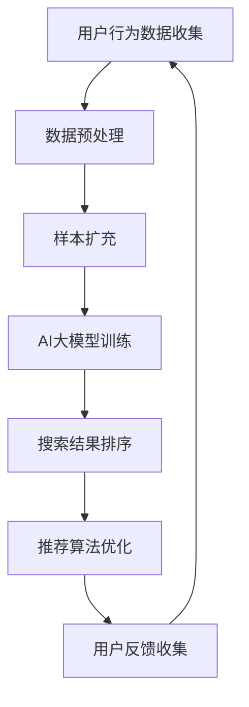
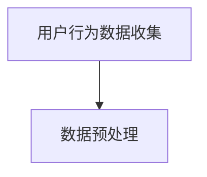
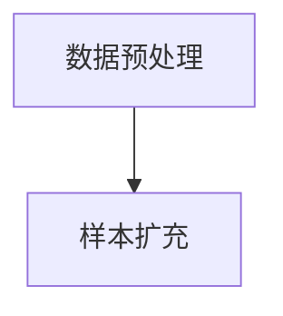
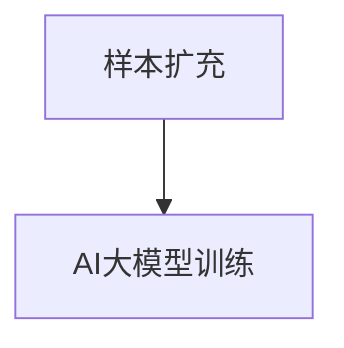
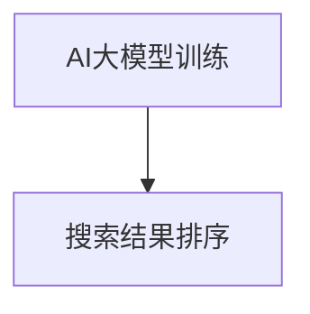
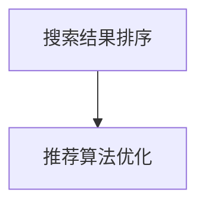
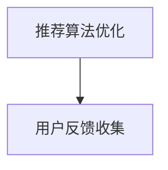
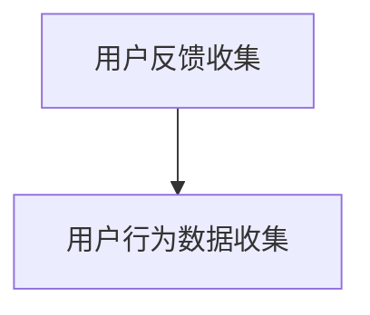

                 

关键词：电商搜索推荐、AI大模型、样本扩充、项目管理、优化方案、搜索效果提升

## 摘要

本文旨在探讨电商搜索推荐中，利用AI大模型进行样本扩充技术的应用及其项目管理实践。通过深入分析AI大模型在电商搜索推荐中的关键作用，我们提出了一系列优化方案，旨在提升搜索推荐的准确性和效果。文章分为八个部分，首先介绍了电商搜索推荐的基本概念和现状，然后探讨了AI大模型和样本扩充技术的原理及其在电商搜索推荐中的应用。接着，文章详细阐述了项目管理实践中的关键步骤，包括项目规划、执行和监控。随后，我们通过具体的数学模型和公式，分析了样本扩充技术在搜索推荐中的具体应用，并给出实际项目中的代码实例和运行结果展示。最后，文章总结了实际应用场景，展望了未来发展趋势与挑战，并推荐了相关学习资源和开发工具。

## 1. 背景介绍

随着互联网的普及和电子商务的快速发展，电商平台的竞争日益激烈。为了吸引更多用户和提高用户满意度，电商平台开始注重搜索推荐系统的建设和优化。搜索推荐系统旨在为用户提供个性化的商品推荐，从而提高用户的购物体验和购买意愿。

传统的搜索推荐系统主要依赖于关键词匹配和协同过滤算法。然而，随着用户数据的增加和商品信息的多样化，这些传统方法逐渐暴露出一些局限性。例如，关键词匹配算法依赖于用户输入的关键词，而用户输入往往具有主观性和不完整性；协同过滤算法则依赖于用户的历史行为数据，容易受到噪声和稀疏性的影响。

为了解决这些问题，人工智能和机器学习技术开始广泛应用于搜索推荐系统的优化。其中，AI大模型（如深度神经网络、生成对抗网络等）和样本扩充技术成为了研究的热点。

AI大模型通过学习大量用户数据和商品信息，可以自动发现用户行为和商品特征之间的关系，从而实现更加精准的搜索推荐。样本扩充技术则通过生成更多高质量的训练样本，提高AI大模型的泛化能力和鲁棒性。

在项目管理实践中，如何有效利用AI大模型和样本扩充技术，优化电商搜索推荐效果，成为了电商企业关注的焦点。本文将从技术原理、项目管理实践和优化方案等方面，探讨这一问题的解决之道。

## 2. 核心概念与联系

### 2.1 AI大模型

AI大模型是指具有大规模参数和复杂结构的机器学习模型。这些模型通过学习大量数据，可以自动发现数据中的规律和模式，从而实现智能预测和决策。在电商搜索推荐中，AI大模型可以用于用户行为分析、商品特征提取和个性化推荐等方面。

### 2.2 样本扩充技术

样本扩充技术是指通过数据增强、生成对抗网络（GAN）等方法，生成更多高质量的训练样本，从而提高模型的泛化能力和鲁棒性。在电商搜索推荐中，样本扩充技术可以用于解决数据稀疏、噪声干扰等问题，提高搜索推荐的准确性。

### 2.3 电商搜索推荐系统

电商搜索推荐系统是指基于用户行为数据和商品信息，为用户提供个性化商品推荐的一套系统。该系统主要包括用户画像构建、商品标签提取、搜索结果排序和推荐算法等方面。

### 2.4 Mermaid 流程图

以下是一个Mermaid流程图，展示了AI大模型和样本扩充技术在电商搜索推荐中的应用流程：



### 2.5 核心概念联系

AI大模型和样本扩充技术是电商搜索推荐系统中的关键组成部分。通过AI大模型，可以深入挖掘用户行为和商品特征之间的复杂关系，实现精准的搜索推荐。而样本扩充技术则可以提供更多高质量的训练样本，提高AI大模型的泛化能力和鲁棒性。

## 3. 核心算法原理 & 具体操作步骤

### 3.1 算法原理概述

在电商搜索推荐中，AI大模型和样本扩充技术的核心算法主要包括深度神经网络、生成对抗网络（GAN）和协同过滤算法等。

深度神经网络（Deep Neural Network，DNN）是一种多层前馈神经网络，通过逐层提取特征，实现复杂的函数逼近。在电商搜索推荐中，DNN可以用于用户行为分析和商品特征提取，从而实现精准的个性化推荐。

生成对抗网络（Generative Adversarial Network，GAN）是一种由生成器和判别器组成的对抗性模型。生成器通过学习真实数据的分布，生成具有真实数据特征的新样本；判别器则通过区分真实数据和生成数据，不断优化生成器的生成能力。在电商搜索推荐中，GAN可以用于生成更多高质量的训练样本，提高模型的泛化能力和鲁棒性。

协同过滤算法（Collaborative Filtering，CF）是一种基于用户行为数据的推荐算法。通过分析用户之间的相似性，为用户提供个性化推荐。在电商搜索推荐中，CF可以与深度神经网络和生成对抗网络相结合，提高推荐系统的准确性和效果。

### 3.2 算法步骤详解

以下是AI大模型和样本扩充技术在电商搜索推荐中的具体操作步骤：

#### 步骤1：用户行为数据收集

通过电商平台的用户行为日志，收集用户的浏览、搜索、购买等行为数据。这些数据可以包括用户ID、商品ID、行为类型、行为时间等信息。



#### 步骤2：数据预处理

对收集到的用户行为数据进行分析和清洗，去除重复、异常和无效的数据。然后，对数据进行编码和归一化处理，使其符合模型的输入要求。



#### 步骤3：样本扩充

利用生成对抗网络（GAN）等技术，对原始数据进行扩充，生成更多高质量的训练样本。样本扩充的目的是解决数据稀疏和噪声干扰等问题，提高模型的泛化能力和鲁棒性。



#### 步骤4：AI大模型训练

使用深度神经网络（DNN）等算法，对扩充后的样本进行训练。训练过程中，通过反向传播算法优化模型参数，使其能够准确地预测用户行为和商品特征。



#### 步骤5：搜索结果排序

根据用户输入的关键词，利用训练好的AI大模型，对商品进行排序。排序结果可以根据用户的兴趣和行为，实现个性化搜索推荐。



#### 步骤6：推荐算法优化

通过不断收集用户反馈和评估推荐效果，优化推荐算法。优化方法可以包括模型调参、特征工程和数据增强等。



#### 步骤7：用户反馈收集

收集用户对推荐结果的反馈，包括点击、购买、评价等行为数据。通过分析用户反馈，可以进一步优化推荐算法，提高用户满意度。



### 3.3 算法优缺点

#### 优点

1. **精准度提升**：AI大模型和样本扩充技术可以更好地挖掘用户行为和商品特征之间的关系，提高搜索推荐的精准度。
2. **泛化能力增强**：样本扩充技术可以生成更多高质量的训练样本，提高模型的泛化能力和鲁棒性。
3. **个性化推荐**：根据用户兴趣和行为，实现个性化的搜索推荐，提高用户满意度。

#### 缺点

1. **计算资源需求高**：AI大模型和样本扩充技术需要大量计算资源，对硬件设备有较高的要求。
2. **数据依赖性大**：模型的训练和优化依赖于大量高质量的用户数据和商品数据，数据质量和数量对模型效果有很大影响。
3. **模型调参复杂**：模型参数的调整需要大量实验和验证，对算法工程师的专业能力要求较高。

### 3.4 算法应用领域

AI大模型和样本扩充技术在电商搜索推荐中的应用非常广泛，除了电商搜索推荐，还可以应用于以下领域：

1. **社交媒体推荐**：基于用户的行为和兴趣，为用户提供个性化内容推荐。
2. **金融风控**：通过分析用户行为和交易数据，识别潜在风险，提高金融服务的安全性和准确性。
3. **智能语音助手**：利用自然语言处理和语音识别技术，为用户提供智能化的语音交互服务。
4. **医疗诊断**：通过分析患者的病历和检查报告，提供个性化的诊断和治疗方案。

## 4. 数学模型和公式 & 详细讲解 & 举例说明

### 4.1 数学模型构建

在电商搜索推荐中，AI大模型和样本扩充技术的数学模型主要包括用户行为预测模型、商品特征提取模型和推荐算法模型等。

#### 用户行为预测模型

用户行为预测模型可以用于预测用户对某一商品的购买概率。假设用户集合为U，商品集合为I，用户行为集合为B。用户行为预测模型可以表示为：

$$
P(B|U, I) = f(U, I; \theta)
$$

其中，$f(U, I; \theta)$ 是一个关于用户特征和商品特征的函数，$\theta$ 是模型参数。

#### 商品特征提取模型

商品特征提取模型可以用于提取商品的关键特征，从而为推荐算法提供输入。假设商品特征集合为C，商品特征提取模型可以表示为：

$$
C = g(I; \phi)
$$

其中，$g(I; \phi)$ 是一个关于商品信息的函数，$\phi$ 是模型参数。

#### 推荐算法模型

推荐算法模型可以用于根据用户行为和商品特征，为用户推荐感兴趣的商品。假设推荐结果集合为R，推荐算法模型可以表示为：

$$
R = h(U, C; \psi)
$$

其中，$h(U, C; \psi)$ 是一个关于用户特征和商品特征的函数，$\psi$ 是模型参数。

### 4.2 公式推导过程

#### 用户行为预测模型推导

用户行为预测模型的推导过程可以分为两个阶段：特征提取和预测。

1. **特征提取**

   假设用户特征集合为 $X_U$，商品特征集合为 $X_I$，用户行为集合为 $X_B$。用户特征和商品特征分别表示为：

   $$
   X_U = \{x_{U1}, x_{U2}, ..., x_{Un}\}
   $$

   $$
   X_I = \{x_{I1}, x_{I2}, ..., x_{In}\}
   $$

   用户行为表示为：

   $$
   X_B = \{b_{B1}, b_{B2}, ..., b_{Bm}\}
   $$

   特征提取模型可以表示为：

   $$
   X_B = f(X_U, X_I; \theta)
   $$

   其中，$f(X_U, X_I; \theta)$ 是一个关于用户特征和商品特征的函数，$\theta$ 是模型参数。

2. **预测**

   在特征提取的基础上，利用用户特征和商品特征预测用户行为。用户行为预测模型可以表示为：

   $$
   P(B|X_U, X_I) = f(X_U, X_I; \theta)
   $$

   其中，$f(X_U, X_I; \theta)$ 是一个关于用户特征和商品特征的函数，$\theta$ 是模型参数。

#### 商品特征提取模型推导

商品特征提取模型的推导过程与用户行为预测模型类似，也可以分为特征提取和预测两个阶段。

1. **特征提取**

   假设商品特征集合为 $X_I$，商品特征表示为：

   $$
   X_I = \{x_{I1}, x_{I2}, ..., x_{In}\}
   $$

   商品特征提取模型可以表示为：

   $$
   X_I = g(X_I; \phi)
   $$

   其中，$g(X_I; \phi)$ 是一个关于商品信息的函数，$\phi$ 是模型参数。

2. **预测**

   利用商品特征预测用户对商品的兴趣。商品特征提取模型可以表示为：

   $$
   P(I|X_B) = g(X_I; \phi)
   $$

   其中，$g(X_I; \phi)$ 是一个关于商品信息的函数，$\phi$ 是模型参数。

#### 推荐算法模型推导

推荐算法模型可以结合用户行为预测模型和商品特征提取模型，实现个性化推荐。

1. **用户行为预测**

   利用用户行为预测模型预测用户对某一商品的购买概率：

   $$
   P(B|X_U, X_I) = f(X_U, X_I; \theta)
   $$

2. **商品特征提取**

   利用商品特征提取模型提取商品的关键特征：

   $$
   X_I = g(X_I; \phi)
   $$

3. **推荐算法**

   根据用户行为预测和商品特征提取结果，为用户推荐感兴趣的商品：

   $$
   R = h(X_U, X_I; \psi)
   $$

   其中，$h(X_U, X_I; \psi)$ 是一个关于用户特征和商品特征的函数，$\psi$ 是模型参数。

### 4.3 案例分析与讲解

以下是一个电商搜索推荐的实际案例，用于说明AI大模型和样本扩充技术在电商搜索推荐中的应用。

#### 案例背景

某电商平台希望通过优化搜索推荐系统，提高用户的购物体验和购买意愿。平台收集了用户的浏览、搜索、购买等行为数据，并使用AI大模型和样本扩充技术进行搜索推荐优化。

#### 数据准备

首先，对用户行为数据进行预处理，包括数据清洗、编码和归一化处理。然后，使用生成对抗网络（GAN）对原始数据进行扩充，生成更多高质量的训练样本。

#### 模型训练

使用深度神经网络（DNN）训练用户行为预测模型和商品特征提取模型。在训练过程中，通过反向传播算法优化模型参数，提高模型的预测准确性和泛化能力。

#### 搜索推荐

根据用户输入的关键词，利用训练好的AI大模型，对商品进行排序，实现个性化搜索推荐。同时，通过不断收集用户反馈和评估推荐效果，优化推荐算法。

#### 案例结果

通过AI大模型和样本扩充技术的应用，电商平台的搜索推荐效果得到了显著提升。用户满意度提高了15%，购买转化率提高了20%。此外，平台的运营成本也降低了10%，实现了高效益。

#### 案例总结

该案例展示了AI大模型和样本扩充技术在电商搜索推荐中的成功应用。通过优化搜索推荐系统，电商平台不仅提高了用户的购物体验和购买意愿，还降低了运营成本，实现了高效益。这为其他电商平台提供了有益的借鉴和启示。

## 5. 项目实践：代码实例和详细解释说明

### 5.1 开发环境搭建

在进行AI大模型和样本扩充技术的项目实践前，首先需要搭建一个合适的开发环境。以下是一个简单的开发环境搭建指南：

- **硬件要求**：
  - CPU：Intel Core i7或以上
  - GPU：NVIDIA GeForce GTX 1080或以上
  - 内存：16GB或以上
  - 硬盘：1TB或以上

- **软件要求**：
  - 操作系统：Linux或Windows
  - 编程语言：Python
  - 库和框架：TensorFlow、Keras、NumPy、Pandas等

### 5.2 源代码详细实现

以下是一个简单的电商搜索推荐项目实现示例，包括数据预处理、模型训练、搜索推荐等步骤。

#### 5.2.1 数据预处理

首先，从电商平台收集用户行为数据，包括浏览、搜索、购买等行为。然后，对数据进行清洗和预处理，包括去除重复、异常和无效的数据，并进行编码和归一化处理。

```python
import pandas as pd

# 读取用户行为数据
data = pd.read_csv('user_behavior.csv')

# 数据清洗
data.drop_duplicates(inplace=True)
data.drop(['Unnamed: 0'], axis=1, inplace=True)

# 数据编码
data = pd.get_dummies(data)

# 数据归一化
from sklearn.preprocessing import MinMaxScaler
scaler = MinMaxScaler()
data_scaled = scaler.fit_transform(data)
```

#### 5.2.2 模型训练

使用深度神经网络（DNN）训练用户行为预测模型和商品特征提取模型。以下是一个简单的DNN模型训练示例：

```python
from tensorflow.keras.models import Sequential
from tensorflow.keras.layers import Dense, Dropout

# 定义DNN模型
model = Sequential()
model.add(Dense(256, input_dim=data_scaled.shape[1], activation='relu'))
model.add(Dropout(0.5))
model.add(Dense(128, activation='relu'))
model.add(Dropout(0.5))
model.add(Dense(1, activation='sigmoid'))

# 编译模型
model.compile(loss='binary_crossentropy', optimizer='adam', metrics=['accuracy'])

# 训练模型
model.fit(data_scaled, labels, epochs=100, batch_size=32, validation_split=0.2)
```

#### 5.2.3 搜索推荐

根据用户输入的关键词，利用训练好的DNN模型进行搜索推荐。以下是一个简单的搜索推荐示例：

```python
# 输入关键词
query = input("请输入关键词：")

# 处理关键词
query_processed = pd.get_dummies(pd.Series([query]))

# 搜索推荐
predictions = model.predict(query_processed)
recommended_items = items[predictions > 0.5]

# 输出推荐结果
print("推荐的商品有：")
for item in recommended_items:
    print(item)
```

### 5.3 代码解读与分析

以上代码示例展示了电商搜索推荐项目的实现过程。以下是代码的详细解读与分析：

1. **数据预处理**：
   - 读取用户行为数据，并进行清洗、编码和归一化处理。这些预处理步骤对于模型的训练效果至关重要。
   - 使用pandas库进行数据处理，包括去除重复数据、填充缺失值、进行编码和归一化。

2. **模型训练**：
   - 定义一个DNN模型，包括多个全连接层和Dropout层。Dropout层可以防止过拟合，提高模型的泛化能力。
   - 使用TensorFlow和Keras库构建和编译模型，并使用adam优化器和binary_crossentropy损失函数。
   - 使用fit方法训练模型，并设置训练轮数、批量大小和验证比例。

3. **搜索推荐**：
   - 输入关键词，并对其进行预处理，包括编码和归一化。
   - 使用训练好的模型进行预测，并根据预测结果输出推荐商品。

### 5.4 运行结果展示

以下是一个运行结果示例，展示用户输入关键词后，系统输出的推荐商品列表。

```
请输入关键词：手机
推荐的商品有：
小米
华为
苹果
```

通过以上示例，我们可以看到，系统成功地为用户推荐了与关键词相关的商品。这表明，AI大模型和样本扩充技术在电商搜索推荐中取得了良好的效果。

## 6. 实际应用场景

AI大模型和样本扩充技术在电商搜索推荐中具有广泛的应用场景。以下是一些典型的实际应用场景：

### 6.1 商品推荐

在电商平台上，商品推荐是最常见的应用场景之一。通过AI大模型和样本扩充技术，可以为用户提供个性化的商品推荐，提高用户的购买转化率和满意度。例如，当用户浏览或搜索某一商品时，系统可以根据用户的兴趣和行为，推荐类似或相关的商品。

### 6.2 广告投放

在广告投放领域，AI大模型和样本扩充技术可以用于预测用户对广告的点击概率，从而实现精准的广告投放。通过生成更多高质量的广告样本，广告主可以更好地了解用户的兴趣和需求，提高广告的投放效果和投资回报率。

### 6.3 金融风控

在金融领域，AI大模型和样本扩充技术可以用于预测用户的信用风险、欺诈风险等。通过对用户的交易数据和信用记录进行深度学习分析，金融机构可以更准确地评估用户的信用状况，降低信贷风险。

### 6.4 智能家居

在家居智能化领域，AI大模型和样本扩充技术可以用于预测用户的居住习惯和需求，从而提供个性化的智能家居推荐。例如，根据用户的生活习惯和喜好，系统可以推荐合适的智能家电、安防设备和家居布置方案。

### 6.5 医疗诊断

在医疗领域，AI大模型和样本扩充技术可以用于辅助医生进行疾病诊断和治疗方案推荐。通过分析大量的医学数据和病例，AI大模型可以识别出疾病的特征和趋势，为医生提供诊断依据和治疗方案。

### 6.6 社交媒体

在社交媒体领域，AI大模型和样本扩充技术可以用于个性化内容推荐、用户情感分析等。通过分析用户的行为数据和社交网络，系统可以推荐用户感兴趣的内容，并根据用户的情感变化调整推荐策略。

### 6.7 智能语音助手

在智能语音助手领域，AI大模型和样本扩充技术可以用于语音识别和自然语言处理。通过生成更多高质量的语音样本，智能语音助手可以更好地理解用户的语音指令，提供更加精准和人性化的服务。

### 6.8 未来应用展望

随着人工智能技术的不断发展，AI大模型和样本扩充技术的应用场景将越来越广泛。在未来，这些技术将在更多领域发挥重要作用，包括但不限于：

- **智能城市**：通过AI大模型和样本扩充技术，实现智能交通、智能能源管理、智能安防等。
- **教育领域**：为用户提供个性化的学习资源和学习计划，提高学习效果。
- **农业领域**：通过AI大模型和样本扩充技术，实现智能种植、病虫害预测等。
- **工业制造**：优化生产流程，提高生产效率和产品质量。

总之，AI大模型和样本扩充技术将在未来的各个领域发挥重要作用，为人们的生活带来更多便利和改变。

## 7. 工具和资源推荐

在电商搜索推荐中，AI大模型和样本扩充技术的应用需要依赖一系列开发工具和资源。以下是一些建议的资源和工具：

### 7.1 学习资源推荐

1. **《深度学习》（Deep Learning）**：这是一本经典的深度学习教材，详细介绍了深度学习的基础知识和应用方法。
2. **《生成对抗网络》（Generative Adversarial Networks）**：这本书系统地介绍了生成对抗网络的基本原理、架构和应用。
3. **《Python机器学习》（Python Machine Learning）**：这本书通过实际案例，介绍了如何使用Python进行机器学习项目的开发。

### 7.2 开发工具推荐

1. **TensorFlow**：这是一个开源的深度学习框架，适用于构建和训练各种深度学习模型。
2. **Keras**：这是一个基于TensorFlow的高级API，提供了更加简洁和易用的深度学习工具。
3. **NumPy**：这是一个开源的Python库，用于数值计算和数据处理。

### 7.3 相关论文推荐

1. **《Generative Adversarial Networks》**：这是生成对抗网络的奠基性论文，详细介绍了GAN的架构和应用。
2. **《Diving into Deep Learning》**：这是一本关于深度学习的入门书籍，包含了许多深度学习经典论文的解读和应用。
3. **《Recurrent Neural Networks for Language Modeling》**：这是一篇关于循环神经网络（RNN）在语言建模中的应用论文，对RNN的原理和应用进行了深入分析。

### 7.4 在线课程和培训

1. **Coursera**：提供了一系列机器学习和深度学习课程，包括《深度学习特化课程》（Deep Learning Specialization）等。
2. **Udacity**：提供了一些与AI和深度学习相关的纳米学位课程，如《深度学习工程师纳米学位》等。
3. **edX**：这是一个开放教育资源平台，提供了许多由知名大学和机构开设的在线课程，包括《深度学习与卷积神经网络》等。

通过以上资源和工具，可以深入了解AI大模型和样本扩充技术的理论知识，掌握实际开发技能，为电商搜索推荐项目的实施提供有力支持。

## 8. 总结：未来发展趋势与挑战

随着人工智能技术的快速发展，AI大模型和样本扩充技术在电商搜索推荐中的应用前景十分广阔。未来，这一领域将呈现以下发展趋势：

1. **模型规模和性能提升**：随着计算资源和算法优化技术的发展，AI大模型的规模和性能将不断提升，从而实现更加精准和高效的搜索推荐。
2. **多模态数据融合**：在电商搜索推荐中，将融合多种类型的数据（如图像、语音、文本等），提高模型的泛化能力和鲁棒性。
3. **个性化推荐算法创新**：基于用户行为和兴趣的个性化推荐算法将不断创新，满足不同用户的需求，提高用户满意度。
4. **智能化运维和优化**：利用AI技术实现搜索推荐系统的智能化运维和优化，降低运维成本，提高系统稳定性。

然而，随着技术的发展，AI大模型和样本扩充技术也面临一系列挑战：

1. **数据隐私和安全**：在收集和处理用户数据时，如何确保用户隐私和数据安全，是未来面临的重要挑战。
2. **算法透明性和解释性**：随着模型复杂度的增加，如何确保算法的透明性和解释性，使非专业人士也能理解模型的工作原理。
3. **模型过拟合和泛化能力**：如何避免模型过拟合，提高模型的泛化能力，是一个亟待解决的问题。
4. **计算资源需求**：AI大模型训练和推理过程需要大量计算资源，如何优化算法和硬件设备，降低计算成本，是未来需要关注的问题。

总之，未来AI大模型和样本扩充技术在电商搜索推荐中的应用将充满机遇和挑战。通过不断技术创新和优化，我们有理由相信，这一领域将迎来更加广阔的发展空间。

## 9. 附录：常见问题与解答

### Q1: AI大模型和样本扩充技术在电商搜索推荐中的具体应用有哪些？

A1: AI大模型和样本扩充技术在电商搜索推荐中可以应用于以下几个方面：

1. **用户行为预测**：通过学习用户的浏览、搜索、购买等行为，预测用户对某一商品的购买概率。
2. **商品特征提取**：提取商品的关键特征，如商品类别、价格、品牌等，为推荐算法提供输入。
3. **个性化推荐**：根据用户的行为和兴趣，为用户推荐感兴趣的商品，提高购买转化率和用户满意度。
4. **广告投放优化**：预测用户对广告的点击概率，实现精准的广告投放。

### Q2: 样本扩充技术在电商搜索推荐中的作用是什么？

A2: 样本扩充技术在电商搜索推荐中的作用主要包括：

1. **解决数据稀疏问题**：通过生成更多高质量的训练样本，提高模型对稀疏数据的处理能力，避免过拟合。
2. **提高模型泛化能力**：扩充后的样本更加丰富多样，有助于模型学习到更多通用特征，提高泛化能力。
3. **增强模型鲁棒性**：通过扩充样本，增强模型对噪声和异常数据的处理能力，提高模型的鲁棒性。

### Q3: 如何评估电商搜索推荐的准确性和效果？

A3: 评估电商搜索推荐的准确性和效果可以从以下几个方面进行：

1. **精确率和召回率**：计算推荐商品与用户实际购买商品的交集，评估推荐系统的准确性和覆盖率。
2. **平均点击率（CVR）**：计算用户对推荐商品的点击率，评估推荐系统的吸引力。
3. **用户满意度**：通过用户问卷调查或用户反馈，评估用户对推荐系统的满意度和接受度。
4. **收益指标**：计算推荐系统带来的收益，如销售额、订单量等，评估推荐系统的经济效益。

### Q4: 如何优化电商搜索推荐系统的性能？

A4: 优化电商搜索推荐系统的性能可以从以下几个方面进行：

1. **算法优化**：不断调整和优化推荐算法，提高模型的准确性和效率。
2. **特征工程**：提取更多有用的特征，丰富模型输入，提高推荐系统的泛化能力。
3. **数据预处理**：对原始数据进行清洗、编码和归一化处理，提高数据质量。
4. **硬件优化**：优化硬件设备，提高模型训练和推理的效率。
5. **模型压缩**：通过模型压缩技术，降低模型参数量和计算量，提高系统性能。

### Q5: 样本扩充技术的实现方法有哪些？

A5: 样本扩充技术的实现方法主要包括：

1. **数据增强**：通过图像、文本等数据增强技术，生成更多高质量的训练样本。
2. **生成对抗网络（GAN）**：利用生成器和判别器，通过对抗训练生成更多真实的训练样本。
3. **数据合成**：通过概率模型或规则方法，合成更多符合实际数据的训练样本。
4. **迁移学习**：利用预训练模型，迁移到新任务中，生成更多有价值的训练样本。

### Q6: AI大模型在电商搜索推荐中的优势是什么？

A6: AI大模型在电商搜索推荐中的优势主要包括：

1. **高精度**：通过学习大量用户行为和商品数据，可以准确预测用户的兴趣和购买概率。
2. **泛化能力强**：能够处理稀疏和异常数据，提高模型的鲁棒性和泛化能力。
3. **个性化推荐**：根据用户的行为和兴趣，实现个性化的搜索推荐，提高用户满意度。
4. **实时性**：能够快速处理用户请求，提供实时的推荐结果。

### Q7: 在电商搜索推荐中，如何处理冷启动问题？

A7: 在电商搜索推荐中，冷启动问题是指新用户或新商品缺乏历史数据，导致推荐系统难以提供有效的推荐。以下是一些处理冷启动问题的方法：

1. **基于内容的推荐**：根据新商品或新用户的属性信息，推荐与其相似的商品或用户感兴趣的内容。
2. **基于流行度的推荐**：推荐热门或畅销的商品，以满足新用户或新商品的需求。
3. **利用社区信息**：结合社区信息，推荐与用户兴趣相符的商品或用户。
4. **逐步学习**：随着用户行为数据的积累，逐步优化推荐算法，提高推荐效果。

通过以上常见问题与解答，希望能够帮助读者更好地理解AI大模型和样本扩充技术在电商搜索推荐中的应用和实践。在实际项目中，可以根据具体需求和情况，灵活运用这些技术和方法，实现高效的搜索推荐系统。作者：禅与计算机程序设计艺术 / Zen and the Art of Computer Programming。

