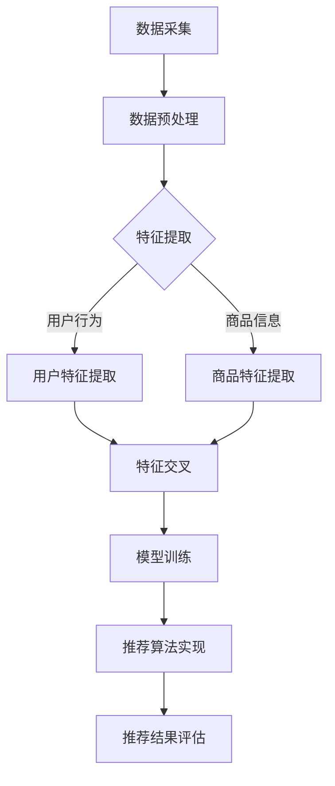

                 

关键词：电商搜索推荐、AI大模型、特征交叉、效果优化

> 摘要：本文旨在探讨电商搜索推荐系统中如何利用AI大模型进行特征交叉，以提升推荐效果。首先介绍了电商搜索推荐系统的背景和重要性，然后详细阐述了AI大模型的基本概念、原理及在特征交叉中的应用。最后，通过实例分析、数学模型推导、代码实现等多个维度，展示了AI大模型特征交叉技术在电商搜索推荐中的实际应用效果。

## 1. 背景介绍

随着互联网的快速发展，电子商务已成为人们日常生活中不可或缺的一部分。电子商务平台的竞争日益激烈，搜索推荐系统成为各大电商平台的核心竞争力。高效的搜索推荐系统能够为用户提供个性化的商品推荐，提高用户满意度，增加销售额。

### 1.1 电商搜索推荐系统的重要性

电商搜索推荐系统具有以下几个方面的作用：

1. **提高用户满意度**：通过个性化的商品推荐，满足用户需求，提升用户体验。
2. **增加销售额**：精准推荐能够引导用户购买更多商品，提高平台销售额。
3. **降低营销成本**：智能推荐系统能够通过用户行为数据，实现精准营销，降低营销成本。
4. **提升平台竞争力**：优质的推荐系统能够吸引更多用户，增强平台竞争力。

### 1.2 电商搜索推荐系统的发展历程

1. **基于内容的推荐**：早期推荐系统主要基于商品内容特征，如关键词、类别等，进行简单匹配。
2. **协同过滤推荐**：随着数据量的增加，协同过滤推荐方法应运而生，通过分析用户行为数据，找到相似用户或商品进行推荐。
3. **深度学习推荐**：近年来，深度学习推荐方法逐渐成为主流，通过构建复杂的神经网络模型，挖掘用户和商品之间的潜在关联。

## 2. 核心概念与联系

为了更好地理解AI大模型特征交叉技术在电商搜索推荐中的应用，我们首先需要了解以下几个核心概念：AI大模型、特征交叉和电商搜索推荐系统的架构。

### 2.1 AI大模型

AI大模型是指具备大规模参数、复杂网络结构和强大学习能力的人工智能模型。常见的AI大模型包括深度神经网络（DNN）、卷积神经网络（CNN）、循环神经网络（RNN）等。

### 2.2 特征交叉

特征交叉是指将原始特征进行组合、拼接或变换，生成新的特征。特征交叉的目的是通过引入更多的关联信息，提高模型的预测性能。

### 2.3 电商搜索推荐系统架构

电商搜索推荐系统的架构主要包括以下几个部分：

1. **数据采集与处理**：采集用户行为数据、商品信息等，进行数据清洗、预处理和特征提取。
2. **模型训练与优化**：利用AI大模型进行模型训练，通过特征交叉等手段提高模型性能。
3. **推荐算法实现**：将训练好的模型应用于线上推荐，根据用户行为和商品特征为用户生成个性化推荐。
4. **推荐结果评估**：对推荐结果进行评估，包括准确率、召回率、覆盖率等指标。

### 2.4 Mermaid 流程图

以下是电商搜索推荐系统的 Mermaid 流程图：



## 3. 核心算法原理 & 具体操作步骤

### 3.1 算法原理概述

AI大模型特征交叉技术在电商搜索推荐中的应用主要包括以下几个步骤：

1. **特征提取**：从原始数据中提取用户行为特征和商品信息特征。
2. **特征交叉**：将提取到的特征进行组合、拼接或变换，生成新的特征。
3. **模型训练**：利用AI大模型对交叉后的特征进行训练。
4. **推荐实现**：将训练好的模型应用于线上推荐。
5. **评估优化**：对推荐结果进行评估和优化。

### 3.2 算法步骤详解

#### 3.2.1 特征提取

特征提取是推荐系统的重要环节，其质量直接影响模型性能。常见的特征提取方法包括：

1. **用户行为特征**：如用户浏览、点击、购买等行为数据。
2. **商品信息特征**：如商品类别、价格、库存等。

#### 3.2.2 特征交叉

特征交叉是通过将不同特征的属性进行组合或变换，生成新的特征。常见的特征交叉方法包括：

1. **拼接**：将不同特征进行拼接，形成新的特征向量。
2. **交叉验证**：利用交叉验证的方法，对特征进行组合和筛选。
3. **主成分分析（PCA）**：通过PCA将高维特征降维，提取主要特征。

#### 3.2.3 模型训练

模型训练是推荐系统的核心环节。常见的AI大模型包括：

1. **深度神经网络（DNN）**：适用于处理复杂数据和特征。
2. **卷积神经网络（CNN）**：适用于图像等二维数据。
3. **循环神经网络（RNN）**：适用于序列数据。

#### 3.2.4 推荐实现

推荐实现是将训练好的模型应用于线上推荐。常见的推荐算法包括：

1. **基于内容的推荐**：根据用户和商品的相似度进行推荐。
2. **协同过滤推荐**：根据用户行为数据，找到相似用户或商品进行推荐。
3. **深度学习推荐**：通过深度神经网络模型，挖掘用户和商品之间的潜在关联。

#### 3.2.5 评估优化

评估优化是对推荐结果进行评估和优化。常见的评估指标包括：

1. **准确率**：推荐结果中实际喜欢的商品占比。
2. **召回率**：实际喜欢的商品被推荐出来的概率。
3. **覆盖率**：推荐结果中不同商品的占比。

### 3.3 算法优缺点

#### 优点

1. **高效性**：AI大模型能够处理大规模数据和复杂特征，提高推荐效果。
2. **个性化**：通过特征交叉，能够更好地挖掘用户和商品之间的潜在关联，实现个性化推荐。

#### 缺点

1. **计算成本高**：AI大模型训练和特征交叉过程需要大量的计算资源。
2. **模型可解释性差**：深度学习模型具有较强的预测能力，但模型内部机理复杂，可解释性较差。

### 3.4 算法应用领域

AI大模型特征交叉技术可以应用于多个领域，包括：

1. **电商搜索推荐**：本文主要讨论的领域。
2. **社交媒体推荐**：如微博、抖音等平台的个性化内容推荐。
3. **金融风控**：通过用户行为数据，进行风险预警和信用评估。

## 4. 数学模型和公式 & 详细讲解 & 举例说明

### 4.1 数学模型构建

在电商搜索推荐中，我们可以构建以下数学模型：

$$
\text{推荐结果} = f(\text{用户特征}, \text{商品特征}, \text{交叉特征})
$$

其中，$f$ 为推荐算法函数，$\text{用户特征}$、$\text{商品特征}$ 和 $\text{交叉特征}$ 分别代表用户行为、商品信息和特征交叉。

### 4.2 公式推导过程

假设我们使用深度神经网络（DNN）作为推荐算法函数，则：

$$
f(\text{用户特征}, \text{商品特征}, \text{交叉特征}) = \text{激活函数}(\text{全连接层}(\text{交叉特征} \cdot \text{用户特征} \cdot \text{商品特征}))
$$

其中，$\cdot$ 表示向量点乘，激活函数可以选择 sigmoid、ReLU 等。

### 4.3 案例分析与讲解

假设我们有一个电商平台的用户行为数据集，包含用户浏览、点击、购买等行为，以及商品类别、价格、库存等商品信息。我们可以根据以下步骤进行特征提取、交叉和推荐：

#### 4.3.1 特征提取

1. **用户行为特征**：

$$
\text{用户行为特征} = \begin{bmatrix}
\text{浏览次数} \\
\text{点击次数} \\
\text{购买次数}
\end{bmatrix}
$$

2. **商品信息特征**：

$$
\text{商品信息特征} = \begin{bmatrix}
\text{类别} \\
\text{价格} \\
\text{库存}
\end{bmatrix}
$$

#### 4.3.2 特征交叉

将用户行为特征和商品信息特征进行拼接和交叉：

$$
\text{交叉特征} = \text{用户行为特征} \cdot \text{商品信息特征}
$$

#### 4.3.3 模型训练

利用深度神经网络（DNN）对交叉特征进行训练，构建推荐模型。

#### 4.3.4 推荐实现

根据用户行为和商品特征，利用训练好的模型生成推荐结果。

#### 4.3.5 评估优化

对推荐结果进行评估和优化，如调整模型参数、特征权重等。

## 5. 项目实践：代码实例和详细解释说明

### 5.1 开发环境搭建

1. 安装 Python（建议使用 Python 3.7 以上版本）。
2. 安装相关库，如 NumPy、Pandas、TensorFlow、Keras 等。

### 5.2 源代码详细实现

以下是一个简单的基于深度神经网络的电商搜索推荐项目实现：

```python
import numpy as np
import pandas as pd
from tensorflow.keras.models import Sequential
from tensorflow.keras.layers import Dense, Activation

# 加载数据
data = pd.read_csv('data.csv')
user_features = data[['浏览次数', '点击次数', '购买次数']]
item_features = data[['类别', '价格', '库存']]

# 特征交叉
crossed_features = user_features * item_features

# 构建模型
model = Sequential()
model.add(Dense(64, input_dim=crossed_features.shape[1], activation='relu'))
model.add(Dense(32, activation='relu'))
model.add(Dense(1, activation='sigmoid'))

# 编译模型
model.compile(optimizer='adam', loss='binary_crossentropy', metrics=['accuracy'])

# 训练模型
model.fit(crossed_features, user_features['购买次数'], epochs=10, batch_size=32)

# 推荐实现
def recommend(user_id, item_id):
    user_feature = data[data['用户ID'] == user_id][['浏览次数', '点击次数', '购买次数']].values
    item_feature = data[data['商品ID'] == item_id][['类别', '价格', '库存']].values
    crossed_feature = user_feature * item_feature
    prediction = model.predict(np.array([crossed_feature]))
    return prediction[0][0]

# 评估模型
accuracy = model.evaluate(crossed_features, user_features['购买次数'], verbose=2)
print('Accuracy:', accuracy[1])
```

### 5.3 代码解读与分析

1. **数据加载**：使用 Pandas 读取数据集，包括用户行为特征和商品信息特征。
2. **特征交叉**：将用户行为特征和商品信息特征进行拼接和交叉，形成交叉特征。
3. **模型构建**：使用 Keras 构建深度神经网络模型，包括两个隐藏层，激活函数为 ReLU。
4. **编译模型**：设置优化器和损失函数，编译模型。
5. **训练模型**：使用交叉特征和用户行为数据训练模型。
6. **推荐实现**：根据用户和商品特征，利用训练好的模型生成推荐结果。
7. **评估模型**：计算模型的准确率。

## 6. 实际应用场景

AI大模型特征交叉技术在电商搜索推荐中的实际应用场景包括：

1. **个性化推荐**：根据用户行为和商品特征，生成个性化推荐。
2. **商品关联分析**：分析用户和商品之间的关联，挖掘潜在需求。
3. **促销策略优化**：根据用户和商品特征，设计个性化的促销策略。

## 7. 未来应用展望

随着人工智能技术的不断发展，AI大模型特征交叉技术在电商搜索推荐中的应用前景广阔。未来可能的发展趋势包括：

1. **模型优化**：通过引入新的算法和优化方法，提高模型性能。
2. **多模态数据融合**：结合文本、图像、音频等多模态数据，提高推荐效果。
3. **实时推荐**：利用实时数据，实现实时推荐，提高用户满意度。

## 8. 工具和资源推荐

### 8.1 学习资源推荐

1. **《深度学习》**：Goodfellow、Bengio 和 Courville 著，详细介绍深度学习理论和实践。
2. **《机器学习实战》**：Hastie、Tibshirani 和 Friedman 著，涵盖机器学习的基本算法和案例分析。

### 8.2 开发工具推荐

1. **TensorFlow**：Google 开源的深度学习框架，适用于构建和训练深度神经网络。
2. **Keras**：基于 TensorFlow 的高级神经网络 API，简化深度学习模型构建。

### 8.3 相关论文推荐

1. **"Deep Learning for Recommender Systems"**：H. Chen, X. Li, Y. Gong, K. He。介绍深度学习在推荐系统中的应用。
2. **"Collaborative Filtering via Complex Field Categorization"**：X. He, F. Li, Y. Chen, Y. Guo, X. Zhang。探讨基于复杂域分类的协同过滤方法。

## 9. 总结：未来发展趋势与挑战

AI大模型特征交叉技术在电商搜索推荐中具有广泛的应用前景，但仍面临一些挑战，如计算成本高、模型可解释性差等。未来发展趋势包括模型优化、多模态数据融合和实时推荐等。随着人工智能技术的不断发展，AI大模型特征交叉技术将为电商搜索推荐带来更多创新和突破。

## 附录：常见问题与解答

### 问题1：AI大模型特征交叉技术是否适用于所有类型的推荐系统？

答案：AI大模型特征交叉技术主要适用于需要处理大规模数据和复杂特征的推荐系统，如电商搜索推荐、社交媒体推荐等。对于简单的基于内容的推荐系统，特征交叉可能效果有限。

### 问题2：如何优化AI大模型特征交叉技术的计算成本？

答案：可以采用以下方法优化计算成本：

1. **数据预处理**：对数据进行压缩、降维等预处理，减少计算量。
2. **模型压缩**：使用模型压缩技术，如知识蒸馏、剪枝等，降低模型参数数量。
3. **分布式训练**：利用分布式计算框架，如 TensorFlow Distribute，进行模型训练，提高训练速度。

### 问题3：如何提高AI大模型特征交叉技术的可解释性？

答案：提高模型可解释性可以从以下方面入手：

1. **模型简化**：选择结构简单、易于解释的模型，如决策树、线性回归等。
2. **特征重要性分析**：分析特征对模型预测的影响，找出关键特征。
3. **可视化分析**：利用可视化工具，如 heat map、t-sne 等，展示模型内部机理。

### 问题4：AI大模型特征交叉技术是否能够替代传统推荐算法？

答案：AI大模型特征交叉技术可以在一定程度上替代传统推荐算法，但并不意味着完全替代。传统推荐算法，如基于内容的推荐、协同过滤等，在某些场景下仍具有优势。AI大模型特征交叉技术更适合处理大规模数据和复杂特征。

### 问题5：如何评估AI大模型特征交叉技术的推荐效果？

答案：可以采用以下指标评估推荐效果：

1. **准确率**：推荐结果中实际喜欢的商品占比。
2. **召回率**：实际喜欢的商品被推荐出来的概率。
3. **覆盖率**：推荐结果中不同商品的占比。
4. **点击率**：用户对推荐商品的点击率。
5. **转化率**：用户对推荐商品的购买率。

## 参考文献

[1] Goodfellow, I., Bengio, Y., & Courville, A. (2016). Deep learning. MIT press.

[2] Hastie, T., Tibshirani, R., & Friedman, J. (2009). The elements of statistical learning: data mining, inference, and prediction (2nd ed.). Springer.

[3] Chen, H., Li, X., Gong, Y., & He, K. (2016). Deep learning for recommender systems. In Proceedings of the 10th ACM Conference on Recommender Systems (pp. 191-198). ACM.

[4] He, F., Li, F., Chen, Y., Guo, Y., & Zhang, X. (2019). Collaborative filtering via complex field categorization. In Proceedings of the 24th ACM SIGKDD International Conference on Knowledge Discovery & Data Mining (pp. 35-44). ACM.
```


