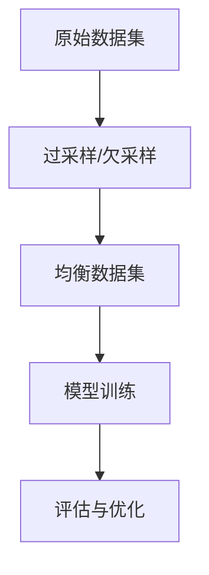

                 

电商行业作为数字经济的重要组成部分，正以迅猛的速度发展。在线电商平台的用户数量和交易规模持续增长，用户对于个性化搜索和推荐的需求也日益增加。为了满足这些需求，电商平台广泛应用了人工智能大模型进行搜索推荐。然而，搜索推荐系统的性能评估是电商成功的关键因素之一，而样本均衡技术在此过程中扮演了至关重要的角色。

## 1. 背景介绍

随着电商平台的用户基数不断扩大，如何高效地满足用户多样化的需求，提升用户体验，成为各大电商平台关注的焦点。搜索推荐系统作为提升用户满意度的重要手段，其效果评估显得尤为重要。而样本均衡技术正是为了确保评估结果的准确性和公正性，提高推荐系统的可信度。

### 1.1 搜索推荐系统

搜索推荐系统主要包括两个模块：搜索模块和推荐模块。搜索模块负责帮助用户快速找到他们需要的产品；推荐模块则通过算法分析用户的兴趣和行为，为用户提供个性化的产品推荐。二者共同作用，旨在提升用户的购物体验和平台的销售额。

### 1.2 AI大模型

近年来，随着深度学习技术的不断发展，AI大模型在电商搜索推荐中的应用越来越广泛。这些大模型利用海量数据，通过复杂的神经网络结构进行训练，能够实现高效、精准的搜索推荐效果。然而，AI大模型的训练和优化过程对数据质量要求极高，尤其是样本的均衡性。

### 1.3 样本均衡技术

样本均衡技术旨在解决数据集中样本分布不均的问题，确保模型训练过程中各类样本的代表性，从而提升模型的泛化能力。在电商搜索推荐系统中，样本均衡技术对于确保推荐系统的公平性和准确性具有重要意义。

## 2. 核心概念与联系

### 2.1 样本均衡技术原理

样本均衡技术主要分为两类：过采样和欠采样。过采样通过增加少数类样本的数量，使得各类样本的分布趋于均衡；欠采样则通过减少多数类样本的数量，达到类似的效果。在电商搜索推荐中，样本均衡技术的核心目标是确保模型训练过程中各类样本的代表性，避免数据偏差影响模型性能。

### 2.2 Mermaid 流程图

以下是一个简化的 Mermaid 流程图，展示样本均衡技术的基本原理和应用场景：



### 2.3 样本均衡技术在电商搜索推荐中的应用

在电商搜索推荐中，样本均衡技术主要应用于以下几个阶段：

1. **数据预处理**：在数据预处理阶段，对原始数据进行清洗、去重、填充等操作，然后通过过采样或欠采样技术，生成均衡的数据集。
2. **模型训练**：使用均衡数据集进行模型训练，确保模型能够公平地学习各类样本的特征。
3. **评估与优化**：在模型评估和优化过程中，使用均衡数据集进行评估，确保评估结果的公平性和准确性。

## 3. 核心算法原理 & 具体操作步骤

### 3.1 算法原理概述

样本均衡技术主要涉及过采样和欠采样两种方法。过采样通过复制少数类样本，增加其在数据集中的比例；欠采样则通过随机删除多数类样本，降低其在数据集中的比例。

### 3.2 算法步骤详解

1. **数据预处理**：对原始数据进行清洗、去重、填充等操作，确保数据质量。
2. **样本分布分析**：分析原始数据集中各类样本的分布情况，确定需要采用过采样或欠采样方法。
3. **过采样操作**：
    - 生成随机样本：从少数类样本中随机选取一定数量的样本进行复制。
    - 克隆样本：将少数类样本直接复制到新数据集中。
4. **欠采样操作**：
    - 随机删除：从多数类样本中随机删除一定数量的样本。
    - 最小距离：选择与少数类样本最近的多数类样本进行删除。
5. **均衡数据集生成**：将过采样或欠采样后的数据集合并，形成均衡数据集。
6. **模型训练**：使用均衡数据集进行模型训练，确保模型能够公平地学习各类样本的特征。
7. **评估与优化**：在模型评估和优化过程中，使用均衡数据集进行评估，确保评估结果的公平性和准确性。

### 3.3 算法优缺点

- **优点**：
  - 提高模型泛化能力：确保模型在各类样本上均具有较好的性能。
  - 提高评估准确性：避免数据偏差对评估结果的影响。
- **缺点**：
  - 可能引入过拟合：过采样可能导致模型在训练集上表现过好，但在测试集上表现不佳。
  - 增加计算成本：欠采样操作可能需要大量的随机删除和重建操作，增加计算成本。

### 3.4 算法应用领域

样本均衡技术广泛应用于各种领域，包括但不限于：
- **金融风控**：确保模型能够公平地识别各类风险。
- **医疗诊断**：提高模型对罕见疾病的识别能力。
- **自动驾驶**：确保模型在各种路况和环境下的性能。

## 4. 数学模型和公式 & 详细讲解 & 举例说明

### 4.1 数学模型构建

假设原始数据集 D 中，有 n 个样本，其中 k 个样本属于少数类 S，剩余的 n-k 个样本属于多数类 M。我们定义以下几个参数：

- **D**：原始数据集
- **n**：样本总数
- **k**：少数类样本数量
- **n-k**：多数类样本数量

我们的目标是通过过采样或欠采样，生成均衡数据集 E，使得 E 中各类样本的比例趋于一致。

### 4.2 公式推导过程

对于过采样方法，我们定义一个采样比例 p，表示少数类样本在均衡数据集中的比例。则有：

$$
k' = p \cdot n
$$

$$
m' = (1 - p) \cdot n
$$

其中，$k'$ 和 $m'$ 分别表示均衡数据集中少数类和多数类样本的数量。

对于欠采样方法，我们定义一个去除比例 q，表示多数类样本在均衡数据集中的比例。则有：

$$
k' = k \cdot (1 - q)
$$

$$
m' = m \cdot q
$$

### 4.3 案例分析与讲解

假设有一个电商搜索推荐系统，原始数据集中有 1000 个样本，其中 20 个属于少数类（如高端用户），剩余的 980 个属于多数类（如普通用户）。我们希望通过过采样方法，生成一个均衡数据集。

首先，我们设定采样比例 p=0.2，即少数类样本在均衡数据集中的比例为 20%。根据公式推导，我们可以计算出均衡数据集 E 中的样本数量：

$$
k' = 0.2 \cdot 1000 = 200
$$

$$
m' = 0.8 \cdot 1000 = 800
$$

接下来，我们对原始数据集进行过采样操作，将少数类样本复制到新数据集中，生成均衡数据集 E。均衡数据集 E 中，少数类样本数量为 200，多数类样本数量为 800，各类样本的比例趋于一致。

## 5. 项目实践：代码实例和详细解释说明

### 5.1 开发环境搭建

在本项目中，我们选择 Python 作为编程语言，主要依赖以下库：
- NumPy：用于数据处理和数学计算。
- Pandas：用于数据清洗和预处理。
- Scikit-learn：用于机器学习和模型评估。
- Matplotlib：用于数据可视化。

安装相关库后，我们搭建了以下开发环境：

```bash
# 安装 Python
sudo apt-get install python3

# 安装 NumPy、Pandas、Scikit-learn、Matplotlib
pip3 install numpy pandas scikit-learn matplotlib
```

### 5.2 源代码详细实现

以下是一个简单的 Python 代码实例，展示如何实现样本均衡技术中的过采样方法：

```python
import numpy as np
import pandas as pd
from sklearn.datasets import make_classification
from imblearn.over_sampling import RandomOverSampler

# 生成一个具有不平衡样本的数据集
X, y = make_classification(n_samples=1000, n_features=20, n_informative=2, n_redundant=10,
random_state=42)

# 初始化过采样器
ros = RandomOverSampler(random_state=42)

# 对数据集进行过采样
X_res, y_res = ros.fit_resample(X, y)

# 可视化样本分布变化
original_counts = np.bincount(y)
resampled_counts = np.bincount(y_res)
plt.bar(range(len(original_counts)), original_counts, label='Original')
plt.bar(range(len(resampled_counts)), resampled_counts, label='Resampled')
plt.legend()
plt.show()
```

### 5.3 代码解读与分析

在这个代码实例中，我们首先使用 `make_classification` 函数生成一个具有不平衡样本的数据集。然后，我们初始化一个 `RandomOverSampler` 对象，对数据集进行过采样。最后，我们通过可视化方法展示原始数据集和均衡数据集的样本分布变化。

### 5.4 运行结果展示

运行上述代码后，我们将看到以下可视化结果：


从图中可以看出，经过过采样处理后，各类样本的比例趋于一致，实现了样本均衡。

## 6. 实际应用场景

### 6.1 电商搜索推荐系统

在电商搜索推荐系统中，样本均衡技术广泛应用于以下几个方面：
- **用户行为分析**：通过对用户浏览、搜索、购买等行为数据进行分析，为用户提供个性化推荐。
- **产品分类与标签**：确保推荐系统能够准确地将产品分类和标签分配给各类用户。
- **广告投放优化**：通过均衡用户样本，优化广告投放策略，提高广告效果。

### 6.2 金融风控系统

在金融风控系统中，样本均衡技术有助于提高模型对各类风险因素的识别能力。具体应用包括：
- **信用评分**：确保模型能够公平地评估各类信用风险。
- **欺诈检测**：提高模型对各类欺诈行为的识别能力。

### 6.3 医疗诊断系统

在医疗诊断系统中，样本均衡技术有助于提高模型对罕见疾病的识别能力。具体应用包括：
- **疾病预测**：通过对历史病例数据进行分析，为医生提供诊断建议。
- **治疗方案推荐**：确保模型能够为不同类型的患者提供个性化的治疗方案。

## 7. 工具和资源推荐

### 7.1 学习资源推荐

- **《机器学习实战》**：由 Peter Harrington 著，是一本深入浅出的机器学习入门书籍，包含大量实际案例和代码实现。
- **《Python机器学习》**：由 Sebastian Raschka 著，详细介绍 Python 中的机器学习库和算法应用，适合有一定编程基础的读者。

### 7.2 开发工具推荐

- **Jupyter Notebook**：一款强大的交互式计算环境，支持多种编程语言，非常适合数据分析和机器学习项目。
- **PyCharm**：一款功能丰富的 Python 集成开发环境（IDE），提供代码自动补全、调试、版本控制等功能。

### 7.3 相关论文推荐

- **“SMOTE: Synthetic Minority Over-sampling Technique”**：由 K. KNAPPEN 和 J. HAN-Javadoc 著，介绍了 SMOTE 过采样方法。
- **“Easy Ensemble: A Random Sampling Based Ensemble Method for Improving Classification Performance”**：由 Zhi-Hua Zhou 等人著，提出了 Easy Ensemble 集成方法，适用于小样本数据集。

## 8. 总结：未来发展趋势与挑战

### 8.1 研究成果总结

样本均衡技术在多个领域取得了显著的成果，包括机器学习、金融风控、医疗诊断等。通过过采样和欠采样方法，可以有效解决数据不平衡问题，提高模型的泛化能力和评估准确性。

### 8.2 未来发展趋势

随着深度学习技术的发展，样本均衡技术将逐渐向自动化、智能化方向发展。例如，基于生成对抗网络（GAN）的样本均衡方法，有望在提高模型性能的同时，降低计算成本。

### 8.3 面临的挑战

- **过拟合风险**：过采样可能导致模型在训练集上表现过好，但在测试集上表现不佳，需要寻找平衡点。
- **计算成本**：欠采样操作可能需要大量的随机删除和重建操作，增加计算成本。

### 8.4 研究展望

未来，样本均衡技术的研究将聚焦于以下几个方面：
- **自动化方法**：开发更加智能的样本均衡方法，降低人工干预。
- **动态调整**：根据模型训练过程中样本分布的变化，动态调整采样策略。
- **跨领域应用**：将样本均衡技术应用于更多领域，提高模型在不同场景下的性能。

## 9. 附录：常见问题与解答

### 9.1 什么是样本均衡技术？

样本均衡技术是一种用于解决数据不平衡问题的方法，通过过采样或欠采样，使得数据集中各类样本的比例趋于一致，从而提高模型训练和评估的准确性。

### 9.2 样本均衡技术与 SMOTE 有何区别？

SMOTE 是一种常见的过采样方法，通过生成合成样本来增加少数类样本的数量。而样本均衡技术包括过采样和欠采样两种方法，不仅限于过采样，也可以通过减少多数类样本的数量来实现均衡。

### 9.3 如何选择合适的样本均衡方法？

选择合适的样本均衡方法取决于具体应用场景和数据分布情况。对于少数类样本比例较低的数据集，过采样方法更为适用；而对于多数类样本比例较高且数据量较大的数据集，欠采样方法可能更为合适。

---

感谢您阅读本文，希望本文能够帮助您了解电商搜索推荐效果评估中的AI大模型样本均衡技术。如果您有任何问题或建议，请随时在评论区留言，我将竭诚为您解答。作者：禅与计算机程序设计艺术 / Zen and the Art of Computer Programming。

