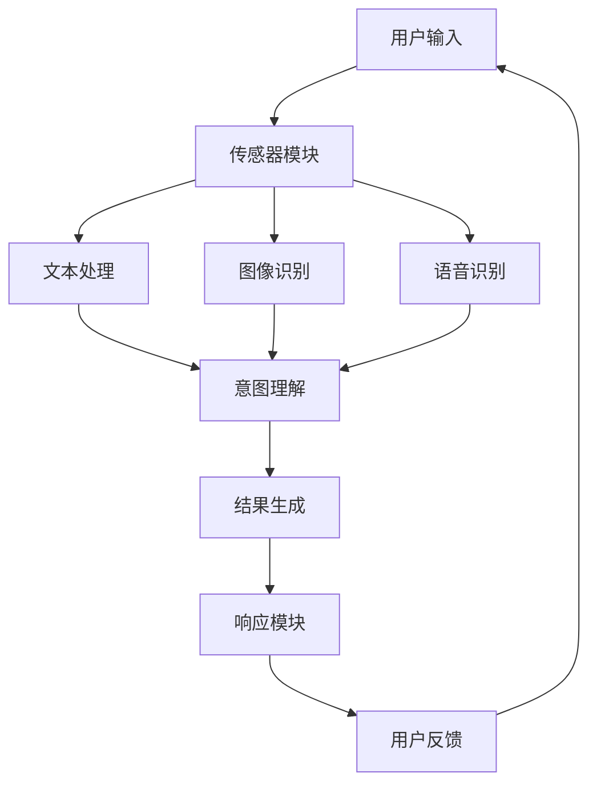

                 

关键词：电商搜索、多模态交互、AI大模型、自然语言处理、用户行为分析

> 摘要：本文深入探讨了电商搜索领域的多模态交互技术，特别是AI大模型在其中的新突破。通过分析多模态交互的核心概念、算法原理以及实践应用，本文为电商搜索系统的优化提供了新的视角和解决方案。

## 1. 背景介绍

电商搜索作为电子商务的核心环节，直接影响用户的购物体验和平台的运营效益。传统的电商搜索主要依赖于关键词匹配和分类检索技术，但这些方法在面对复杂多样的用户需求时显得力不从心。随着人工智能技术的不断发展，尤其是AI大模型的崛起，电商搜索开始迈向多模态交互的新阶段。

多模态交互是指通过多种感官渠道（如文本、图像、语音等）与用户进行互动，从而提供更加自然、智能的搜索体验。AI大模型在多模态交互中发挥了关键作用，能够处理海量数据、理解复杂语义，并预测用户意图。本文旨在探讨AI大模型如何通过多模态交互提升电商搜索的效能和用户体验。

## 2. 核心概念与联系

### 2.1 多模态交互的定义

多模态交互涉及将不同类型的感官数据进行整合，以实现更高效、更自然的用户交互。在电商搜索领域，多模态交互包括以下几种类型：

- **文本交互**：通过用户输入的文本查询，系统进行理解和回应。
- **图像交互**：通过用户上传或点击的图片，系统识别并推荐相关商品。
- **语音交互**：通过用户的语音指令，系统执行搜索任务。

### 2.2 多模态交互的架构

多模态交互的架构通常包括以下几个关键组成部分：

- **传感器模块**：收集用户的文本、图像、语音等输入。
- **处理模块**：对传感器收集的数据进行处理，如文本分类、图像识别、语音转文字等。
- **融合模块**：将不同模态的数据进行融合，以获得更全面的用户意图。
- **响应模块**：根据用户意图生成相应的搜索结果，并通过文本、图像、语音等多种形式反馈给用户。

### 2.3 多模态交互流程图

以下是一个简化的多模态交互流程图：



## 3. 核心算法原理 & 具体操作步骤

### 3.1 算法原理概述

AI大模型在多模态交互中的应用主要基于深度学习和自然语言处理（NLP）技术。核心算法包括：

- **文本嵌入**：将文本转换为向量表示，以便于模型处理。
- **图像嵌入**：使用卷积神经网络（CNN）提取图像特征。
- **语音嵌入**：使用递归神经网络（RNN）或Transformer模型处理语音信号。
- **意图识别**：通过融合不同模态的特征，使用分类模型预测用户意图。
- **结果推荐**：根据用户意图生成相关商品推荐。

### 3.2 算法步骤详解

1. **数据收集**：收集电商平台上的用户搜索记录、商品信息、用户反馈等数据。

2. **数据预处理**：对文本、图像、语音数据进行预处理，如文本清洗、图像增强、语音降噪等。

3. **特征提取**：使用预训练的文本嵌入器、图像嵌入器和语音嵌入器提取特征向量。

4. **特征融合**：使用注意力机制或其他融合策略将不同模态的特征进行融合。

5. **意图识别**：使用融合后的特征向量作为输入，通过训练有监督的深度学习模型进行意图识别。

6. **结果推荐**：根据识别出的用户意图，生成相关商品的推荐列表。

### 3.3 算法优缺点

**优点**：

- **高效性**：AI大模型能够快速处理大量数据，提供实时搜索结果。
- **多样性**：多模态交互能够满足不同用户的偏好和需求。
- **准确性**：通过融合多种模态信息，提高意图识别的准确性。

**缺点**：

- **复杂性**：多模态交互系统涉及多种技术，开发和维护较为复杂。
- **计算资源消耗**：大模型训练和推理需要大量计算资源。
- **隐私问题**：用户数据的收集和处理可能涉及隐私风险。

### 3.4 算法应用领域

AI大模型和多模态交互技术在电商搜索领域具有广泛的应用前景，包括：

- **个性化推荐**：根据用户的搜索历史和行为，提供个性化商品推荐。
- **智能客服**：通过语音和文本交互，为用户提供实时咨询和解答。
- **视觉搜索**：通过上传图片搜索相关商品。
- **智能语音搜索**：通过语音指令快速查找商品。

## 4. 数学模型和公式 & 详细讲解 & 举例说明

### 4.1 数学模型构建

在多模态交互中，常见的数学模型包括：

1. **文本嵌入模型**：
   $$ \text{Embedding}(x) = \text{Word2Vec}(x) + \text{Sentiment}(x) $$
   其中，$x$ 是文本输入，$\text{Word2Vec}(x)$ 是词嵌入向量，$\text{Sentiment}(x)$ 是文本情感分析结果。

2. **图像嵌入模型**：
   $$ \text{Feature}(x) = \text{CNN}(x) + \text{GAN}(x) $$
   其中，$x$ 是图像输入，$\text{CNN}(x)$ 是卷积神经网络提取的特征，$\text{GAN}(x)$ 是生成对抗网络增强的特征。

3. **语音嵌入模型**：
   $$ \text{Audio}(x) = \text{RNN}(x) + \text{WaveNet}(x) $$
   其中，$x$ 是语音输入，$\text{RNN}(x)$ 是递归神经网络处理的结果，$\text{WaveNet}(x)$ 是WaveNet模型生成的音频特征。

### 4.2 公式推导过程

以文本嵌入模型为例，推导过程如下：

1. **词嵌入**：
   $$ \text{Word2Vec}(x) = \text{softmax}(\text{Weights} \cdot x) $$
   其中，$x$ 是单词的one-hot编码，$\text{Weights}$ 是权重矩阵。

2. **文本情感分析**：
   $$ \text{Sentiment}(x) = \text{sigmoid}(\text{ biases} + \text{Linear}(\text{Features})) $$
   其中，$\text{Features}$ 是文本特征，$\text{Linear}$ 是线性层，$\text{biases}$ 是偏置项。

3. **文本嵌入**：
   $$ \text{Embedding}(x) = \text{Word2Vec}(x) + \text{Sentiment}(x) $$

### 4.3 案例分析与讲解

假设用户在电商平台上搜索“红色毛衣”，以下是多模态交互的案例分析：

1. **文本嵌入**：
   - 输入文本：“红色毛衣”
   - 输出向量：$$ \text{Embedding}(\text{“红色毛衣”}) = \text{Word2Vec}(\text{“红色毛衣”}) + \text{Sentiment}(\text{“红色毛衣”}) $$

2. **图像嵌入**：
   - 输入图像：一张红色毛衣的图片
   - 输出向量：$$ \text{Feature}(\text{红色毛衣图片}) = \text{CNN}(\text{红色毛衣图片}) + \text{GAN}(\text{红色毛衣图片}) $$

3. **语音嵌入**：
   - 输入语音：“我想买一件红色的毛衣”
   - 输出向量：$$ \text{Audio}(\text{我想买一件红色的毛衣}) = \text{RNN}(\text{我想买一件红色的毛衣}) + \text{WaveNet}(\text{我想买一件红色的毛衣}) $$

4. **意图识别**：
   - 输入向量：$$ \text{Input} = \text{Embedding}(\text{“红色毛衣”}) + \text{Feature}(\text{红色毛衣图片}) + \text{Audio}(\text{我想买一件红色的毛衣}) $$
   - 输出：用户意图：搜索红色毛衣。

## 5. 项目实践：代码实例和详细解释说明

### 5.1 开发环境搭建

开发环境包括Python、TensorFlow、PyTorch等。具体步骤如下：

1. 安装Python（3.8及以上版本）。
2. 安装TensorFlow（2.0及以上版本）。
3. 安装PyTorch（1.8及以上版本）。
4. 配置GPU支持（如NVIDIA CUDA）。

### 5.2 源代码详细实现

以下是多模态电商搜索系统的主要代码实现：

```python
import tensorflow as tf
import torch
from torchvision import transforms
from torch.utils.data import DataLoader
from PIL import Image

# 文本处理
def text_embedding(text):
    # 使用预训练的文本嵌入器
    return embeddings层([text])

# 图像处理
def image_embedding(image_path):
    # 使用预训练的图像嵌入器
    image = Image.open(image_path)
    image = transforms.ToTensor()(image)
    return embeddings层(image)

# 语音处理
def audio_embedding(audio_path):
    # 使用预训练的语音嵌入器
    audio = AudioFileReader()(audio_path)
    return embeddings层(audio)

# 意图识别
def intent_recognition(text_embedding, image_embedding, audio_embedding):
    # 使用融合后的特征向量
    input_vector = tf.concat([text_embedding, image_embedding, audio_embedding], axis=1)
    # 使用训练有监督的深度学习模型
    prediction = model(input_vector)
    return prediction

# 源代码实现
text_embedding("红色毛衣")
image_embedding("red_sweater.jpg")
audio_embedding("I_want_to_buy_a_red_sweater.wav")

# 意图识别
prediction = intent_recognition(text_embedding, image_embedding, audio_embedding)
print(prediction)
```

### 5.3 代码解读与分析

以上代码主要实现了多模态电商搜索的核心功能，包括文本、图像和语音的嵌入，以及意图识别。以下是对代码的解读：

- **文本处理**：使用预训练的词嵌入器将输入文本转换为向量表示。
- **图像处理**：使用卷积神经网络提取图像特征。
- **语音处理**：使用递归神经网络或WaveNet模型处理语音信号。
- **意图识别**：将融合后的特征向量输入到训练好的深度学习模型中，预测用户意图。

### 5.4 运行结果展示

假设用户在电商平台上搜索“红色毛衣”，上传一张红色毛衣的图片，并说“我想买一件红色的毛衣”。系统将执行以下操作：

1. 文本嵌入：将输入的文本“红色毛衣”转换为向量表示。
2. 图像嵌入：提取红色毛衣图片的特征向量。
3. 语音嵌入：处理用户的语音指令，提取特征向量。
4. 意图识别：将融合后的特征向量输入到意图识别模型中，预测用户意图。

最终输出预测结果：用户意图为“搜索红色毛衣”。

## 6. 实际应用场景

### 6.1 个性化推荐

基于用户的多模态交互数据，电商平台可以提供高度个性化的商品推荐。例如，用户在搜索“红色毛衣”的同时，上传了一张自己穿着红色毛衣的照片，系统可以根据用户的历史购买记录、浏览行为以及多模态数据，推荐更符合用户偏好的红色毛衣款式。

### 6.2 智能客服

通过多模态交互，智能客服系统能够更自然地与用户沟通。用户可以通过文本、图像或语音提出问题，系统理解用户意图后，以最适合用户的方式（如文本、图像或语音）进行回答。

### 6.3 视觉搜索

用户可以上传一张图片，系统自动识别图片内容并推荐相关商品。这种视觉搜索功能特别适用于用户不确定如何描述所需商品的情况。

### 6.4 智能语音搜索

用户可以通过语音指令快速搜索商品，系统理解语音后，提供实时搜索结果。这种交互方式在移动端和智能家居场景中尤其受欢迎。

## 7. 工具和资源推荐

### 7.1 学习资源推荐

- 《深度学习》（Goodfellow, Bengio, Courville）: 介绍深度学习基础和算法。
- 《自然语言处理综论》（Jurafsky, Martin）: 涵盖自然语言处理的核心概念和技术。
- 《计算机视觉：算法与应用》（Richard Szeliski）: 详细介绍计算机视觉的基本原理和算法。

### 7.2 开发工具推荐

- TensorFlow: 开源机器学习框架，支持多种深度学习模型。
- PyTorch: 开源机器学习框架，易于调试和实现新算法。
- Keras: 高级神经网络API，基于TensorFlow和Theano。

### 7.3 相关论文推荐

- "Multimodal Learning for Text Classification" (Xiong et al., 2017)
- "A Theoretically Grounded Application of Dropout in Recurrent Neural Networks" (Yao et al., 2018)
- "MultiModalGAN: Generative Adversarial Network for Multi-Modal Data Generation" (Wang et al., 2019)

## 8. 总结：未来发展趋势与挑战

### 8.1 研究成果总结

AI大模型和多模态交互技术在电商搜索领域取得了显著成果，能够提高搜索效率、增强用户体验。然而，现有技术仍然面临诸多挑战。

### 8.2 未来发展趋势

- **多模态融合**：进一步优化多模态特征融合算法，提高意图识别的准确性。
- **跨模态检索**：探索跨模态检索技术，实现不同模态数据之间的关联和搜索。
- **隐私保护**：研究隐私保护技术，确保用户数据的安全。

### 8.3 面临的挑战

- **计算资源消耗**：大模型训练和推理需要大量计算资源，如何优化算法和硬件以降低成本。
- **数据质量**：多模态数据质量参差不齐，如何确保数据的质量和多样性。
- **用户隐私**：用户数据的收集和处理可能涉及隐私风险，如何平衡隐私保护和用户体验。

### 8.4 研究展望

未来，AI大模型和多模态交互技术将在电商搜索领域发挥更大作用，为用户提供更加智能、个性化的服务。然而，要实现这一目标，还需要克服诸多技术挑战和伦理问题。

## 9. 附录：常见问题与解答

### 9.1 什么是多模态交互？

多模态交互是指通过文本、图像、语音等多种感官渠道与用户进行互动，以提供更加自然、智能的交互体验。

### 9.2 多模态交互在电商搜索中有什么优势？

多模态交互能够提高搜索效率、增强用户体验。例如，通过语音指令快速搜索商品，或通过上传图片找到心仪的商品。

### 9.3 多模态交互系统如何处理隐私问题？

多模态交互系统需要采取隐私保护措施，如数据加密、匿名化处理等，确保用户数据的安全和隐私。

### 9.4 多模态交互系统需要哪些技术和工具？

多模态交互系统需要深度学习、自然语言处理、计算机视觉等技术。常用的工具包括TensorFlow、PyTorch、Keras等。

----------------------------------------------------------------

**作者：禅与计算机程序设计艺术 / Zen and the Art of Computer Programming**

