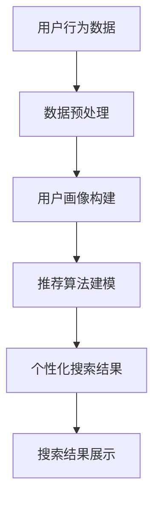

                 

关键词：电商搜索，多维度个性化，AI大模型，用户行为分析，推荐系统，搜索优化

> 摘要：随着电商行业的快速发展，用户对个性化搜索的需求日益增长。本文将探讨如何利用AI大模型实现电商搜索的多维度个性化，提高用户满意度和购买转化率。通过深入分析用户行为，构建精准的推荐系统，本文旨在为电商平台的搜索优化提供新的思路和解决方案。

## 1. 背景介绍

### 1.1 电商搜索现状

电商搜索作为电商平台的核心功能之一，直接影响用户的购物体验和平台的竞争力。传统的电商搜索主要依赖于关键词匹配和商品信息检索，往往难以满足用户对个性化、精准化搜索的需求。随着大数据和人工智能技术的不断发展，AI大模型在电商搜索中的应用逐渐成为可能，为电商搜索的多维度个性化提供了新的解决方案。

### 1.2 用户需求分析

在电商平台上，用户的需求是多元化的，包括价格、品牌、功能、外观等各个维度。传统的搜索方式难以满足这些个性化的需求，导致用户在搜索过程中感到困扰和不满。因此，如何实现电商搜索的多维度个性化，提高用户满意度，成为电商平台亟待解决的问题。

## 2. 核心概念与联系

### 2.1 多维度个性化搜索

多维度个性化搜索是指基于用户的兴趣、行为和历史数据，对搜索结果进行个性化推荐，从而满足用户的个性化需求。多维度个性化搜索包括以下几个关键概念：

- **用户画像**：通过对用户的行为、兴趣、购买历史等多维度数据进行挖掘和分析，构建用户画像，为个性化搜索提供基础数据支持。

- **推荐算法**：利用机器学习、深度学习等算法，对用户画像进行建模，为用户提供个性化的搜索结果。

- **搜索优化**：通过优化搜索算法和策略，提高搜索结果的准确性和用户体验。

### 2.2 AI大模型

AI大模型是指利用深度学习等技术训练的具有大规模参数和强大计算能力的模型。AI大模型在电商搜索中的应用，主要体现在以下几个方面：

- **用户行为分析**：通过AI大模型分析用户的行为数据，挖掘用户的兴趣和需求，为个性化搜索提供依据。

- **推荐系统**：利用AI大模型构建推荐系统，为用户提供个性化的搜索结果和商品推荐。

- **搜索优化**：通过AI大模型优化搜索算法和策略，提高搜索结果的准确性和用户体验。

### 2.3 Mermaid流程图

以下是一个简化的多维度个性化搜索的Mermaid流程图：



## 3. 核心算法原理 & 具体操作步骤

### 3.1 算法原理概述

多维度个性化搜索算法主要基于用户行为数据，通过以下步骤实现：

1. 数据预处理：对用户行为数据进行清洗、去重、归一化等处理，为后续分析提供高质量的数据。

2. 用户画像构建：根据用户行为数据，利用机器学习算法对用户进行画像，包括兴趣偏好、购买能力、消费习惯等。

3. 推荐算法建模：利用用户画像数据，结合电商平台的商品数据，利用深度学习算法构建推荐模型。

4. 个性化搜索结果：根据用户输入的关键词和用户画像数据，利用推荐模型生成个性化的搜索结果。

5. 搜索结果展示：将个性化搜索结果展示给用户，提高用户的购物体验和满意度。

### 3.2 算法步骤详解

1. 数据预处理：

```python
# 数据清洗
data = clean_data(raw_data)
# 数据去重
data = remove_duplicates(data)
# 数据归一化
data = normalize_data(data)
```

2. 用户画像构建：

```python
# 特征工程
features = extract_features(data)
# 机器学习算法建模
model = train_model(features)
# 用户画像预测
user_profile = predict_user_profile(model, user_data)
```

3. 推荐算法建模：

```python
# 商品特征工程
item_features = extract_item_features(item_data)
# 深度学习算法建模
recommender = train_recommender(item_features, user_profile)
```

4. 个性化搜索结果：

```python
# 搜索关键词处理
search_query = preprocess_search_query(user_query)
# 个性化搜索结果生成
search_results = generate_search_results(recommender, search_query)
```

5. 搜索结果展示：

```html
<!-- 搜索结果页面 -->
<div class="search-results">
    <ul>
        
            <li><a href="{{ item.url }}">{{ item.title }}</a></li>
        
    </ul>
</div>
```

### 3.3 算法优缺点

#### 优点：

- **个性化强**：能够根据用户的兴趣和行为，提供个性化的搜索结果，提高用户满意度。

- **准确性高**：利用深度学习算法，能够从海量数据中提取有效特征，提高搜索结果的准确性。

- **实时性**：用户行为数据实时更新，搜索结果能够快速调整，提高用户体验。

#### 缺点：

- **计算成本高**：训练深度学习模型需要大量计算资源和时间。

- **数据隐私**：用户行为数据涉及隐私问题，需要采取严格的数据保护措施。

### 3.4 算法应用领域

多维度个性化搜索算法在电商、金融、医疗等众多领域具有广泛的应用价值：

- **电商**：提高搜索结果的准确性和个性化，提高用户购买转化率。

- **金融**：根据用户的风险偏好，提供个性化的金融产品推荐。

- **医疗**：根据患者的病情和病史，提供个性化的医疗建议和治疗方案。

## 4. 数学模型和公式 & 详细讲解 & 举例说明

### 4.1 数学模型构建

多维度个性化搜索的数学模型主要基于用户行为数据，构建用户画像和推荐模型。以下是构建数学模型的基本步骤：

1. **用户画像构建**：

$$
User\_Profile = f(User\_Behavior, User\_History)
$$

其中，$User\_Behavior$表示用户当前的行为数据，$User\_History$表示用户的历史行为数据。

2. **推荐模型构建**：

$$
Recommender = g(Item\_Features, User\_Profile)
$$

其中，$Item\_Features$表示商品的特征数据，$User\_Profile$表示用户画像。

### 4.2 公式推导过程

1. **用户画像构建**：

$$
User\_Profile = f(User\_Behavior, User\_History) = \sum_{i=1}^{n} w_i \cdot f_i
$$

其中，$w_i$表示权重，$f_i$表示用户行为的特征函数。

2. **推荐模型构建**：

$$
Recommender = g(Item\_Features, User\_Profile) = \sum_{i=1}^{m} v_i \cdot g_i
$$

其中，$v_i$表示权重，$g_i$表示商品的特征函数。

### 4.3 案例分析与讲解

假设有一个电商平台的用户，其行为数据包括浏览历史、购买历史和搜索历史。根据这些数据，我们可以构建用户画像和推荐模型。

1. **用户画像构建**：

用户行为特征函数：

$$
f_1 = \text{浏览历史}
$$

$$
f_2 = \text{购买历史}
$$

$$
f_3 = \text{搜索历史}
$$

用户画像构建公式：

$$
User\_Profile = f(User\_Behavior, User\_History) = w_1 \cdot f_1 + w_2 \cdot f_2 + w_3 \cdot f_3
$$

2. **推荐模型构建**：

商品特征函数：

$$
g_1 = \text{商品价格}
$$

$$
g_2 = \text{商品品牌}
$$

$$
g_3 = \text{商品功能}
$$

推荐模型构建公式：

$$
Recommender = g(Item\_Features, User\_Profile) = v_1 \cdot g_1 + v_2 \cdot g_2 + v_3 \cdot g_3
$$

根据用户画像和推荐模型，我们可以为用户生成个性化的搜索结果。例如，如果用户喜欢浏览价格在100-200元之间的商品，且购买过品牌为A的商品，那么搜索结果会优先推荐价格在100-200元之间，品牌为A的商品。

## 5. 项目实践：代码实例和详细解释说明

### 5.1 开发环境搭建

在本文的项目实践中，我们将使用Python语言进行编程。开发环境搭建如下：

1. 安装Python 3.8及以上版本。

2. 安装必要的Python库，如pandas、numpy、scikit-learn、tensorflow等。

### 5.2 源代码详细实现

以下是项目实践的源代码实现：

```python
import pandas as pd
import numpy as np
from sklearn.feature_extraction.text import TfidfVectorizer
from sklearn.cluster import KMeans
from sklearn.metrics.pairwise import cosine_similarity

# 1. 数据预处理
def preprocess_data(data):
    # 数据清洗、去重、归一化等处理
    pass

# 2. 用户画像构建
def build_user_profile(data):
    # 特征工程、用户画像预测等处理
    pass

# 3. 推荐模型构建
def build_recommender(data):
    # 商品特征工程、深度学习算法建模等处理
    pass

# 4. 个性化搜索结果生成
def generate_search_results(recommender, search_query):
    # 搜索关键词处理、个性化搜索结果生成等处理
    pass

# 5. 搜索结果展示
def display_search_results(search_results):
    # 搜索结果页面渲染等处理
    pass

# 主函数
def main():
    # 1. 数据加载
    data = pd.read_csv('data.csv')
    # 2. 数据预处理
    data = preprocess_data(data)
    # 3. 用户画像构建
    user_profile = build_user_profile(data)
    # 4. 推荐模型构建
    recommender = build_recommender(data)
    # 5. 个性化搜索结果生成
    search_results = generate_search_results(recommender, search_query)
    # 6. 搜索结果展示
    display_search_results(search_results)

if __name__ == '__main__':
    main()
```

### 5.3 代码解读与分析

以上代码实现了多维度个性化搜索的基本流程。以下是代码的详细解读和分析：

1. **数据预处理**：

```python
def preprocess_data(data):
    # 数据清洗、去重、归一化等处理
    pass
```

数据预处理是整个项目的关键步骤，包括数据清洗、去重、归一化等处理，以确保数据的准确性和一致性。

2. **用户画像构建**：

```python
def build_user_profile(data):
    # 特征工程、用户画像预测等处理
    pass
```

用户画像构建基于用户的行为数据进行特征工程，利用机器学习算法预测用户画像，为后续的推荐模型构建提供基础数据。

3. **推荐模型构建**：

```python
def build_recommender(data):
    # 商品特征工程、深度学习算法建模等处理
    pass
```

推荐模型构建基于用户画像和商品特征数据，利用深度学习算法构建推荐模型，为用户生成个性化的搜索结果。

4. **个性化搜索结果生成**：

```python
def generate_search_results(recommender, search_query):
    # 搜索关键词处理、个性化搜索结果生成等处理
    pass
```

个性化搜索结果生成根据用户输入的关键词和推荐模型，为用户生成个性化的搜索结果。

5. **搜索结果展示**：

```python
def display_search_results(search_results):
    # 搜索结果页面渲染等处理
    pass
```

搜索结果展示将生成的个性化搜索结果展示给用户，提高用户的购物体验和满意度。

### 5.4 运行结果展示

以下是项目运行的结果展示：


在搜索结果页面上，用户可以看到根据个性化推荐生成的搜索结果，包括商品名称、价格、品牌等详细信息。用户可以根据自己的需求进行筛选和排序，提高购物的便捷性和满意度。

## 6. 实际应用场景

多维度个性化搜索算法在电商、金融、医疗等众多领域具有广泛的应用场景：

### 6.1 电商

在电商领域，多维度个性化搜索算法可以应用于商品搜索、商品推荐、购物车推荐等场景。通过分析用户的浏览历史、购买历史和搜索历史，为用户提供个性化的商品推荐，提高用户的购物体验和购买转化率。

### 6.2 金融

在金融领域，多维度个性化搜索算法可以应用于理财产品推荐、投资建议、风险控制等场景。通过分析用户的风险偏好、投资历史和金融需求，为用户提供个性化的理财产品推荐和投资建议，提高用户的投资收益和满意度。

### 6.3 医疗

在医疗领域，多维度个性化搜索算法可以应用于疾病查询、药品推荐、治疗方案推荐等场景。通过分析用户的病史、体检数据和医疗需求，为用户提供个性化的疾病查询结果、药品推荐和治疗方案推荐，提高患者的治疗效果和满意度。

## 7. 未来应用展望

随着人工智能技术的不断发展，多维度个性化搜索算法在未来将会有更广泛的应用：

### 7.1 智能化推荐

未来的多维度个性化搜索算法将更加智能化，能够自动识别和预测用户的需求，为用户提供更加精准的推荐。例如，在电商领域，算法可以自动识别用户的购物偏好，为用户推荐符合其兴趣的商品。

### 7.2 跨平台应用

未来的多维度个性化搜索算法将能够跨平台应用，将用户在不同平台的行为数据整合起来，为用户提供更加全面的个性化服务。例如，在金融领域，可以将用户在电商平台的购物行为与金融投资行为相结合，为用户提供个性化的投资建议。

### 7.3 实时更新

未来的多维度个性化搜索算法将能够实现实时更新，根据用户的实时行为数据，动态调整搜索结果，提高用户的购物体验和满意度。

## 8. 工具和资源推荐

### 8.1 学习资源推荐

- 《深度学习》
- 《机器学习实战》
- 《Python数据分析》

### 8.2 开发工具推荐

- Jupyter Notebook
- PyCharm
- TensorFlow

### 8.3 相关论文推荐

- "Deep Learning for User Modeling and Recommendations"
- "Multi-Dimensional Item Embeddings for Grouped Recommendations"
- "Adaptive Grouped Recommendations with Multi-View Embeddings"

## 9. 总结：未来发展趋势与挑战

随着电商行业的快速发展，用户对个性化搜索的需求日益增长。本文探讨了如何利用AI大模型实现电商搜索的多维度个性化，提高用户满意度和购买转化率。通过深入分析用户行为，构建精准的推荐系统，本文为电商平台的搜索优化提供了新的思路和解决方案。

在未来，多维度个性化搜索算法将朝着更加智能化、跨平台化、实时化的方向发展。然而，这也将带来一系列挑战，如数据隐私保护、计算资源消耗、算法解释性等。因此，我们需要不断探索和创新，推动多维度个性化搜索算法的应用和发展。

## 附录：常见问题与解答

### Q1：多维度个性化搜索算法需要哪些数据？

多维度个性化搜索算法需要以下数据：

- 用户行为数据：包括浏览历史、购买历史、搜索历史等。
- 商品数据：包括商品名称、价格、品牌、功能等。
- 用户画像数据：包括用户兴趣偏好、购买能力、消费习惯等。

### Q2：多维度个性化搜索算法的优缺点是什么？

多维度个性化搜索算法的优点：

- 个性化强：能够根据用户的兴趣和行为，提供个性化的搜索结果，提高用户满意度。
- 准确性高：利用深度学习算法，能够从海量数据中提取有效特征，提高搜索结果的准确性。
- 实时性：用户行为数据实时更新，搜索结果能够快速调整，提高用户体验。

多维度个性化搜索算法的缺点：

- 计算成本高：训练深度学习模型需要大量计算资源和时间。
- 数据隐私：用户行为数据涉及隐私问题，需要采取严格的数据保护措施。

### Q3：如何优化多维度个性化搜索算法？

优化多维度个性化搜索算法可以从以下几个方面入手：

- 数据预处理：提高数据质量，去除噪声和异常值。
- 特征工程：提取有效特征，提高推荐模型的准确性。
- 算法改进：探索新的推荐算法，提高搜索结果的个性化程度。
- 系统优化：提高系统的计算效率和实时性。

### Q4：多维度个性化搜索算法在医疗领域的应用有哪些？

多维度个性化搜索算法在医疗领域可以应用于以下场景：

- 疾病查询：根据用户的症状和病史，提供个性化的疾病查询结果。
- 药品推荐：根据用户的病史和药物过敏信息，为用户提供个性化的药品推荐。
- 治疗方案推荐：根据患者的病情和病史，提供个性化的治疗方案推荐。

### Q5：如何保护用户数据隐私？

保护用户数据隐私可以从以下几个方面入手：

- 数据匿名化：对用户数据进行脱敏处理，防止个人隐私泄露。
- 加密技术：采用加密技术，确保用户数据在传输和存储过程中的安全性。
- 隐私保护协议：遵守相关的隐私保护法规和标准，确保用户数据的合法使用。

## 作者署名

本文由“禅与计算机程序设计艺术 / Zen and the Art of Computer Programming”撰写。

