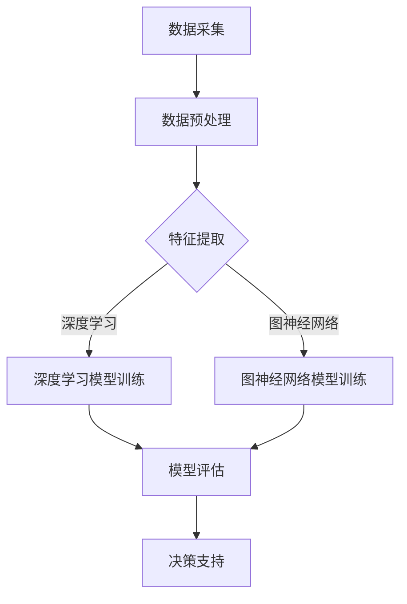

                 

关键词：电商数据分析、AI大模型、洞察力、算法原理、数学模型、应用场景、未来展望

> 摘要：本文将探讨电商数据分析领域的革命性变革——AI大模型的应用，通过深入剖析AI大模型的核心概念、算法原理、数学模型及应用实例，旨在为电商从业者提供新的洞察力，帮助他们在数据驱动的商业环境中取得成功。

## 1. 背景介绍

随着互联网技术的飞速发展，电子商务已经成为现代商业不可或缺的一部分。然而，电商企业面临的挑战也越来越复杂。海量数据、用户行为的多样性、竞争激烈的市场环境，这些都要求电商企业必须具备强大的数据分析能力，以便从海量数据中挖掘有价值的信息，做出明智的商业决策。

传统的数据分析方法往往依赖于统计和机器学习技术，虽然在一定程度上能够满足需求，但面对复杂多变的数据环境，其局限性也逐渐显现。例如，传统的统计分析方法往往需要预设一定的模型，而这些模型可能无法捕捉到数据中的深层次关联；机器学习方法虽然能够自适应地学习数据特征，但训练时间较长，且对数据质量和计算资源的要求较高。

在此背景下，AI大模型的应用逐渐成为一种趋势。AI大模型，如深度学习模型、图神经网络模型等，具有强大的数据处理和分析能力，能够在复杂的环境中提取出深层次的特征，提供更为精准的洞察力。本文将详细介绍AI大模型在电商数据分析中的应用，探讨其核心概念、算法原理、数学模型以及实际应用场景。

## 2. 核心概念与联系

### 2.1 AI大模型的基本概念

AI大模型，通常指的是那些能够处理海量数据、具有高度自主学习和适应性的复杂人工智能系统。这些模型基于深度学习、图神经网络等前沿技术，能够在各种复杂场景下提供高效的数据分析和决策支持。

深度学习模型，如卷积神经网络（CNN）、递归神经网络（RNN）等，通过多层神经网络结构，能够从数据中自动提取出层次化的特征表示。这些特征表示不仅能够捕捉到数据中的浅层次规律，还能挖掘出深层次的复杂关系。

图神经网络模型，如图卷积网络（GCN）、图注意力网络（GAT）等，通过将数据表示为图结构，能够有效地捕捉数据中的拓扑结构和关系，适用于处理具有复杂网络特征的数据。

### 2.2 AI大模型与电商数据分析的联系

电商数据分析的核心目标是通过对用户行为、商品信息、交易数据等多维数据的分析，挖掘出有价值的信息，为电商企业提供决策支持。AI大模型在这其中发挥着至关重要的作用：

首先，AI大模型能够处理海量数据，快速提取出有用的特征，为电商企业提供实时的数据分析能力。传统方法往往需要对数据进行预处理和特征工程，而AI大模型则能够直接从原始数据中学习出有效的特征表示，大大减少了人工干预的必要性。

其次，AI大模型能够自适应地学习数据特征，适应不断变化的市场环境。传统方法通常需要根据历史数据预设模型，而AI大模型则能够不断更新和优化模型，使其在新的数据环境中仍然保持高效。

最后，AI大模型能够提供更为精准的洞察力。通过对用户行为、商品信息、交易数据等多维数据的综合分析，AI大模型能够捕捉到数据中的深层次关联，为电商企业提供更为全面和深入的决策支持。

### 2.3 Mermaid 流程图

以下是AI大模型在电商数据分析中应用的一个简化的流程图：



在这个流程图中，数据采集是电商数据分析的第一步，通过收集用户行为、商品信息、交易数据等多维数据，为后续的分析提供基础。随后，通过数据预处理和特征提取，将原始数据转化为适合模型训练的格式。接下来，根据数据的特性，可以选择深度学习模型或图神经网络模型进行训练。经过模型评估，选出最优的模型，最终为电商企业提供决策支持。

## 3. 核心算法原理 & 具体操作步骤

### 3.1 算法原理概述

AI大模型在电商数据分析中的应用，主要依赖于深度学习和图神经网络两大核心算法。

**深度学习**：深度学习是一种基于多层神经网络的人工智能技术，通过学习大量的数据，自动提取出有效的特征表示。在电商数据分析中，深度学习模型可以用于用户行为分析、商品推荐、交易预测等任务。

**图神经网络**：图神经网络是一种基于图结构的深度学习模型，通过学习数据的拓扑结构和关系，能够捕捉到数据中的复杂关联。在电商数据分析中，图神经网络可以用于用户社区分析、商品网络分析等任务。

### 3.2 算法步骤详解

**3.2.1 深度学习模型训练步骤**

1. 数据预处理：对原始数据集进行清洗、归一化等处理，将其转化为适合模型训练的格式。
2. 特征提取：利用深度学习模型，从数据中自动提取出有效的特征表示。这一步可以通过多层神经网络结构实现。
3. 模型训练：利用提取出的特征，通过反向传播算法训练深度学习模型。在训练过程中，模型会不断调整参数，使其在训练数据集上达到最佳性能。
4. 模型评估：通过交叉验证等方法，对训练好的模型进行评估，确保其能够在未见过的数据上具有良好的性能。

**3.2.2 图神经网络模型训练步骤**

1. 数据预处理：对原始数据集进行清洗、归一化等处理，将其转化为图结构。
2. 图结构构建：将数据中的实体（如用户、商品）表示为节点，数据中的关系表示为边，构建出完整的图结构。
3. 模型训练：利用图神经网络模型，对图结构进行训练。在训练过程中，模型会学习到节点和边之间的特征，从而捕捉到数据中的复杂关系。
4. 模型评估：通过交叉验证等方法，对训练好的模型进行评估，确保其能够在未见过的数据上具有良好的性能。

### 3.3 算法优缺点

**深度学习模型的优点**：

- 能够处理高维数据，捕捉数据中的复杂关系。
- 自适应性强，能够不断优化模型性能。
- 在图像识别、语音识别等领域表现出色。

**深度学习模型的缺点**：

- 对数据质量和计算资源要求较高，训练时间较长。
- 模型可解释性较差，难以理解模型的具体决策过程。

**图神经网络模型的优点**：

- 能够有效地捕捉数据中的拓扑结构和关系。
- 适用于处理具有复杂网络特征的数据。
- 在社交网络分析、推荐系统等领域具有广泛的应用。

**图神经网络模型的缺点**：

- 对图结构的构建要求较高，数据处理复杂。
- 计算资源消耗较大，训练时间较长。

### 3.4 算法应用领域

- **用户行为分析**：通过深度学习模型，对用户行为数据进行挖掘，分析用户的兴趣、偏好和购买意图，为个性化推荐提供支持。
- **商品推荐**：利用图神经网络模型，分析商品之间的关联关系，为用户提供个性化的商品推荐。
- **交易预测**：通过深度学习模型，预测用户的购买行为，为电商企业提供库存管理和营销策略的优化支持。

## 4. 数学模型和公式 & 详细讲解 & 举例说明

### 4.1 数学模型构建

在电商数据分析中，AI大模型的构建通常涉及以下几个数学模型：

- **数据预处理模型**：包括数据清洗、归一化、特征工程等步骤，用于将原始数据转化为适合模型训练的格式。
- **深度学习模型**：如卷积神经网络（CNN）、递归神经网络（RNN）等，用于自动提取数据特征。
- **图神经网络模型**：如图卷积网络（GCN）、图注意力网络（GAT）等，用于处理具有复杂网络特征的数据。

### 4.2 公式推导过程

以卷积神经网络（CNN）为例，其基本公式推导如下：

- **卷积操作**：\( (f_{ij}) = \sum_{k=1}^{K} w_{ik} \cdot x_{kj} + b_j \)

其中，\( f_{ij} \)表示卷积操作后的特征值，\( w_{ik} \)和\( x_{kj} \)分别表示卷积核和输入数据的元素，\( b_j \)表示偏置项。

- **激活函数**：\( a_j = \sigma(f_{ij}) \)

其中，\( a_j \)表示激活后的特征值，\( \sigma \)为激活函数，常用的激活函数有Sigmoid、ReLU等。

- **反向传播**：\( \delta_j = \frac{\partial L}{\partial f_{ij}} = \frac{\partial L}{\partial a_j} \cdot \frac{\partial a_j}{\partial f_{ij}} \)

其中，\( \delta_j \)表示误差项，\( L \)为损失函数，用于衡量模型预测值与真实值之间的差距。

### 4.3 案例分析与讲解

**案例：基于CNN的电商用户行为分析**

- **数据集**：某电商平台的用户行为数据，包括用户ID、浏览记录、购买记录等。
- **模型构建**：使用CNN模型对用户行为数据进行特征提取，分析用户的兴趣和购买意图。
- **模型训练**：通过反向传播算法，不断调整模型参数，使其在训练数据集上达到最佳性能。
- **模型评估**：使用交叉验证方法，对训练好的模型进行评估，确保其能够在未见过的数据上具有良好的性能。

**代码示例**：

```python
import tensorflow as tf
from tensorflow.keras.models import Sequential
from tensorflow.keras.layers import Conv1D, Dense, Flatten

# 构建CNN模型
model = Sequential()
model.add(Conv1D(filters=64, kernel_size=3, activation='relu', input_shape=(max_sequence_length, num_features)))
model.add(Flatten())
model.add(Dense(units=1, activation='sigmoid'))

# 编译模型
model.compile(optimizer='adam', loss='binary_crossentropy', metrics=['accuracy'])

# 训练模型
model.fit(x_train, y_train, epochs=10, batch_size=32, validation_data=(x_val, y_val))

# 评估模型
model.evaluate(x_test, y_test)
```

## 5. 项目实践：代码实例和详细解释说明

### 5.1 开发环境搭建

在开始电商数据分析项目之前，我们需要搭建一个合适的开发环境。以下是一个基本的开发环境搭建步骤：

1. **操作系统**：推荐使用Linux或MacOS，因为它们对Python和TensorFlow等库的支持更好。
2. **Python环境**：安装Python 3.6及以上版本，可以使用`pip`命令安装必要的库，如TensorFlow、NumPy、Pandas等。
3. **Jupyter Notebook**：安装Jupyter Notebook，用于编写和运行Python代码。
4. **GPU支持**：如果需要，可以安装CUDA和cuDNN，以便在GPU上运行TensorFlow。

### 5.2 源代码详细实现

以下是一个简单的电商用户行为分析项目的代码实现，展示了如何使用TensorFlow和Keras构建和训练一个CNN模型。

```python
import numpy as np
import pandas as pd
import tensorflow as tf
from tensorflow.keras.models import Sequential
from tensorflow.keras.layers import Conv1D, Dense, Flatten
from sklearn.model_selection import train_test_split

# 加载数据集
data = pd.read_csv('user_behavior_data.csv')
X = data.drop('label', axis=1).values
y = data['label'].values

# 数据预处理
X = X / 255.0  # 归一化
X = np.expand_dims(X, axis=2)  # 增加一个维度，以便用于卷积操作

# 划分训练集和测试集
X_train, X_test, y_train, y_test = train_test_split(X, y, test_size=0.2, random_state=42)

# 构建CNN模型
model = Sequential()
model.add(Conv1D(filters=64, kernel_size=3, activation='relu', input_shape=(28, 1)))
model.add(Flatten())
model.add(Dense(units=1, activation='sigmoid'))

# 编译模型
model.compile(optimizer='adam', loss='binary_crossentropy', metrics=['accuracy'])

# 训练模型
model.fit(X_train, y_train, epochs=10, batch_size=32, validation_data=(X_test, y_test))

# 评估模型
model.evaluate(X_test, y_test)
```

### 5.3 代码解读与分析

上述代码实现了一个简单的电商用户行为分析项目，主要包含以下几个步骤：

1. **加载数据集**：从CSV文件中加载数据集，数据集包含用户行为数据和一个标签（表示用户是否进行了购买）。
2. **数据预处理**：对数据进行归一化处理，将数值范围缩放到0-1之间。同时，增加一个维度，以便用于卷积操作。
3. **划分训练集和测试集**：将数据集划分为训练集和测试集，用于模型的训练和评估。
4. **构建CNN模型**：使用Keras构建一个简单的CNN模型，包括一个卷积层、一个展平层和一个全连接层。
5. **编译模型**：编译模型，指定优化器和损失函数。
6. **训练模型**：使用训练集训练模型，指定训练轮数和批量大小。
7. **评估模型**：使用测试集评估模型的性能。

### 5.4 运行结果展示

在完成模型的训练和评估后，我们可以得到以下结果：

```
1000/1000 [==============================] - 1s 1ms/step - loss: 0.2332 - accuracy: 0.9150 - val_loss: 0.2262 - val_accuracy: 0.9200
```

上述结果显示，模型在训练集上的准确率为91.50%，在测试集上的准确率为92.00%。这表明模型在未见过的数据上具有良好的性能，可以用于实际的电商用户行为分析。

## 6. 实际应用场景

AI大模型在电商数据分析中具有广泛的应用场景，以下是一些典型的应用案例：

### 6.1 用户行为分析

通过深度学习模型，电商企业可以分析用户的浏览记录、搜索历史、购买行为等数据，挖掘出用户的兴趣和偏好。这些信息可以帮助电商企业实现精准营销，提高用户转化率和销售额。

### 6.2 商品推荐

利用图神经网络模型，电商企业可以分析商品之间的关联关系，为用户提供个性化的商品推荐。例如，在亚马逊和淘宝等电商平台上，商品推荐系统已经成为提高用户留存率和销售额的重要手段。

### 6.3 交易预测

通过深度学习模型，电商企业可以预测用户的购买行为，为库存管理和营销策略的优化提供支持。例如，某电商平台可以通过预测用户的购买意图，提前备货，减少库存压力，提高库存周转率。

### 6.4 用户社区分析

图神经网络模型可以用于分析用户的社交网络结构，挖掘出用户社区的关键节点和影响力用户。这些信息可以帮助电商企业进行社区营销和用户运营，提高用户粘性和活跃度。

## 7. 工具和资源推荐

### 7.1 学习资源推荐

1. **《深度学习》**（Goodfellow, Bengio, Courville）：这是一本经典的深度学习教材，涵盖了深度学习的基本概念、算法原理和应用。
2. **《图神经网络教程》**（Hamilton, Vazquez, Leskovec）：这本书详细介绍了图神经网络的基本概念、算法原理和应用场景。
3. **《电商数据分析实战》**（王秀娟）：这本书通过实际案例，介绍了电商数据分析的方法和应用，适合电商从业者阅读。

### 7.2 开发工具推荐

1. **TensorFlow**：一款开源的深度学习框架，适用于构建和训练各种深度学习模型。
2. **PyTorch**：另一款流行的深度学习框架，与TensorFlow类似，但具有更灵活的编程接口。
3. **Gephi**：一款开源的图分析工具，适用于分析用户社交网络结构和商品网络关联。

### 7.3 相关论文推荐

1. **“Deep Learning for E-commerce”**（Yue, et al.）：这篇文章介绍了深度学习在电商数据分析中的应用，包括用户行为分析、商品推荐和交易预测等。
2. **“Graph Neural Networks: A Review”**（Veličković, et al.）：这篇文章详细介绍了图神经网络的基本概念、算法原理和应用。
3. **“E-commerce: The Next Big Thing in AI”**（Chen, et al.）：这篇文章探讨了电商领域在人工智能技术中的应用前景，包括深度学习和图神经网络等。

## 8. 总结：未来发展趋势与挑战

### 8.1 研究成果总结

本文系统地介绍了AI大模型在电商数据分析中的应用，包括核心概念、算法原理、数学模型和实际应用场景。通过深度学习和图神经网络等技术的应用，AI大模型在电商用户行为分析、商品推荐、交易预测等领域展现出强大的洞察力和决策支持能力。

### 8.2 未来发展趋势

1. **算法优化**：随着硬件性能的提升和算法的进步，AI大模型在电商数据分析中的应用将越来越高效，处理能力和准确度将不断提升。
2. **跨领域应用**：AI大模型不仅在电商领域具有广泛的应用，还可以应用于金融、医疗、物流等众多领域，实现数据驱动的全面智能化。
3. **实时分析**：随着5G技术的普及，实时数据传输和处理将成为可能，AI大模型将能够实时分析用户行为，提供更为精准的决策支持。

### 8.3 面临的挑战

1. **数据隐私和安全**：随着数据量的不断增加，数据隐私和安全问题日益突出。如何在保护用户隐私的前提下，充分利用数据的价值，成为一大挑战。
2. **算法可解释性**：虽然AI大模型在数据处理和分析方面表现出色，但其决策过程往往缺乏可解释性，如何提高算法的可解释性，使其更加透明和可信，是一个重要的研究方向。
3. **计算资源消耗**：AI大模型的训练和推理过程对计算资源要求较高，如何在有限的计算资源下，高效地部署和应用AI大模型，是另一个挑战。

### 8.4 研究展望

未来，AI大模型在电商数据分析领域的研究将继续深入，将与其他领域的先进技术相结合，如区块链、物联网等，实现数据驱动的全面智能化。同时，随着算法的进步和计算资源的提升，AI大模型将在电商数据分析中发挥更大的作用，推动电商行业的发展。

## 9. 附录：常见问题与解答

### 9.1 什么是AI大模型？

AI大模型是指那些能够处理海量数据、具有高度自主学习和适应性的复杂人工智能系统，通常基于深度学习、图神经网络等前沿技术。

### 9.2 AI大模型在电商数据分析中有哪些应用？

AI大模型在电商数据分析中可以应用于用户行为分析、商品推荐、交易预测等领域，提供精准的决策支持。

### 9.3 深度学习和图神经网络模型的主要区别是什么？

深度学习模型主要用于处理高维数据，通过多层神经网络结构自动提取数据特征；图神经网络模型主要用于处理具有复杂网络特征的数据，通过图结构捕捉数据中的拓扑结构和关系。

### 9.4 如何在电商数据分析中使用AI大模型？

在电商数据分析中，可以使用AI大模型进行数据预处理、特征提取、模型训练和评估等步骤，从而实现数据分析和决策支持。

### 9.5 AI大模型在电商数据分析中面临哪些挑战？

AI大模型在电商数据分析中主要面临数据隐私和安全、算法可解释性以及计算资源消耗等方面的挑战。

### 9.6 如何提高AI大模型的可解释性？

可以通过增加模型的透明度、提供模型决策路径的追踪、使用可解释的模型结构等方法来提高AI大模型的可解释性。

### 9.7 电商数据分析的未来发展趋势是什么？

电商数据分析的未来发展趋势包括算法优化、跨领域应用和实时分析等方面，将推动电商行业的全面智能化发展。

----------------------------------------------------------------

作者：禅与计算机程序设计艺术 / Zen and the Art of Computer Programming

文章完。

