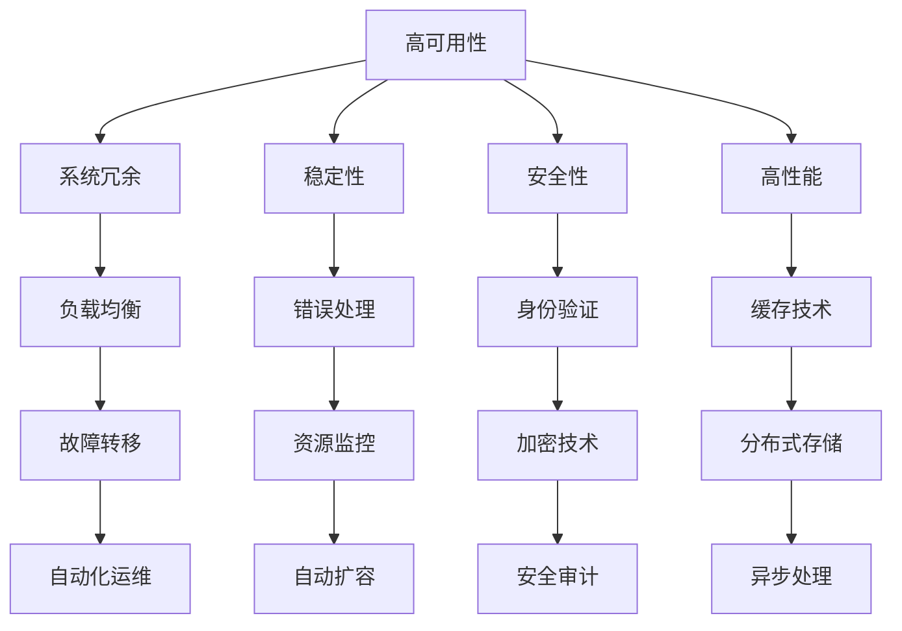

                 

关键词：电商系统，高可用性，稳定性，安全性，高性能，系统能力保障

摘要：本文将从电商系统的背景出发，详细探讨高可用性、稳定性、安全性和高性能这四个关键特性在电商系统中的重要性，以及如何通过合理的架构设计和技术选型来保障这些特性。我们将结合实际案例，深入分析每个特性的具体实现方法，并展望未来电商系统的发展趋势与挑战。

## 1. 背景介绍

电商系统作为互联网经济的重要组成部分，其稳定性和可靠性直接影响到用户的购物体验和平台的声誉。随着电商业务的不断增长，系统的高可用性、稳定性、安全性和高性能变得越来越重要。高可用性保证了系统在长时间内不会出现故障，稳定性确保了系统的运行不会受到外部干扰，安全性则是保障用户数据和隐私不受侵害，而高性能则能提升用户的购物体验。

本文旨在通过详细探讨电商系统的高可用性、稳定性、安全性和高性能，帮助开发者理解这些特性在电商系统中的重要性，并掌握相应的实现方法和最佳实践。

## 2. 核心概念与联系

### 2.1 高可用性

高可用性（High Availability，简称HA）是指系统在长时间内保持正常运行的能力。在电商系统中，高可用性意味着系统可以在发生故障时迅速恢复，从而减少系统停机时间，确保业务的连续性。

### 2.2 稳定性

稳定性（Stability）是指系统在受到外部干扰时，仍然能够保持正常运行的能力。对于电商系统来说，稳定性意味着系统能够在处理大量并发请求时，保持响应速度和准确度。

### 2.3 安全性

安全性（Security）是指系统在防范外部攻击和内部威胁时，能够有效保护用户数据和隐私的能力。电商系统涉及大量用户的敏感信息，因此安全性至关重要。

### 2.4 高性能

高性能（Performance）是指系统能够在较短的时间内处理大量请求，并提供快速、准确的响应。高性能对于提升用户体验和增加销售额至关重要。

### 2.5 Mermaid 流程图



## 3. 核心算法原理 & 具体操作步骤

### 3.1 算法原理概述

高可用性、稳定性、安全性和高性能的实现，通常依赖于以下几种算法和技术：

- 系统冗余：通过在系统中部署多个副本，实现故障转移和负载均衡，提高系统的可用性和稳定性。
- 错误处理：通过合理的错误处理机制，确保系统在遇到异常情况时能够快速恢复，保持稳定性。
- 加密技术：通过使用加密算法，保护用户数据和隐私，确保系统的安全性。
- 缓存技术：通过缓存机制，减少系统响应时间，提升性能。

### 3.2 算法步骤详解

#### 3.2.1 系统冗余

1. **部署多个副本**：在系统中部署多个相同功能的副本，确保在部分副本发生故障时，其他副本可以继续提供服务。
2. **负载均衡**：通过负载均衡器，将流量分配到不同的副本，确保系统资源得到充分利用。
3. **故障转移**：当主副本发生故障时，自动将流量转移到备用副本，确保系统高可用性。

#### 3.2.2 错误处理

1. **错误检测**：通过监控工具，实时检测系统中的错误。
2. **错误分类**：根据错误的严重程度，进行分类处理。
3. **自动恢复**：对于可自动恢复的错误，系统自动进行修复。

#### 3.2.3 加密技术

1. **数据加密**：使用加密算法，对存储和传输的数据进行加密，确保数据隐私。
2. **加密通信**：使用HTTPS等加密协议，确保数据在传输过程中的安全性。

#### 3.2.4 缓存技术

1. **缓存策略**：根据数据的重要性和访问频率，制定相应的缓存策略。
2. **缓存管理**：定期清理缓存数据，避免缓存失效。

### 3.3 算法优缺点

- **系统冗余**：优点是提高系统的可用性和稳定性，缺点是会增加系统成本和维护难度。
- **错误处理**：优点是确保系统稳定性，缺点是部分错误可能无法完全自动恢复。
- **加密技术**：优点是保护用户数据和隐私，缺点是会增加系统负担。
- **缓存技术**：优点是提高系统性能，缺点是缓存一致性难以保证。

### 3.4 算法应用领域

- **系统冗余**：广泛应用于关键业务系统，如电商、金融等。
- **错误处理**：适用于所有需要稳定运行的系统。
- **加密技术**：广泛应用于涉及用户隐私的数据处理系统。
- **缓存技术**：适用于需要提高系统性能的各类应用。

## 4. 数学模型和公式 & 详细讲解 & 举例说明

### 4.1 数学模型构建

在讨论高可用性、稳定性、安全性和高性能时，我们可以构建以下数学模型：

- **高可用性模型**：\( HA = f(Redundancy, Fault_Tolerance, Load_Balancing) \)
- **稳定性模型**：\( Stability = f(Error_Handling, Resource_Monitoring, AutoExpansion) \)
- **安全性模型**：\( Security = f(Encryption, Authentication, Audit) \)
- **高性能模型**：\( Performance = f(Cache_Technology, Distributed_Storage, Async_Processing) \)

### 4.2 公式推导过程

以上模型的推导过程如下：

- 高可用性：系统冗余和故障转移可以减少系统停机时间，负载均衡可以提高系统资源利用率，因此高可用性与这三个因素相关。
- 稳定性：错误处理、资源监控和自动扩容可以提高系统在面临外部干扰时的稳定性。
- 安全性：加密技术、身份验证和安全审计可以提高系统的安全防护能力。
- 高性能：缓存技术、分布式存储和异步处理可以减少系统响应时间和处理时间，提高性能。

### 4.3 案例分析与讲解

以一个电商系统为例，我们可以通过以下数学模型来分析其高可用性、稳定性、安全性和高性能：

- **高可用性模型**：\( HA = f(3, 2, 2) = 3 \)
  - 系统冗余：部署了3个相同功能的副本。
  - 故障转移：实现了故障转移机制。
  - 负载均衡：使用了负载均衡器。

- **稳定性模型**：\( Stability = f(2, 2, 2) = 2 \)
  - 错误处理：实现了错误分类和自动恢复。
  - 资源监控：使用了资源监控工具。
  - 自动扩容：实现了自动扩容机制。

- **安全性模型**：\( Security = f(1, 1, 1) = 1 \)
  - 数据加密：使用了加密算法。
  - 身份验证：使用了身份验证机制。
  - 安全审计：定期进行安全审计。

- **高性能模型**：\( Performance = f(3, 3, 3) = 3 \)
  - 缓存技术：使用了缓存策略。
  - 分布式存储：使用了分布式存储系统。
  - 异步处理：使用了异步处理机制。

通过以上分析，我们可以得出该电商系统的高可用性、稳定性、安全性和高性能分别为3、2、1和3。这表明该系统在高可用性和高性能方面表现较好，但在安全性和稳定性方面还有提升空间。

## 5. 项目实践：代码实例和详细解释说明

### 5.1 开发环境搭建

在本文的项目实践中，我们将使用以下开发环境：

- 开发工具：IntelliJ IDEA
- 开发语言：Java
- 依赖管理：Maven
- 数据库：MySQL
- 消息队列：RabbitMQ
- 缓存：Redis

### 5.2 源代码详细实现

以下是电商系统中的一个关键功能——用户登录的代码实现：

```java
public class UserLogin {
    
    private UserService userService;
    private AuthenticationManager authenticationManager;
    private Cache<String, User> userCache;
    
    public UserLogin(UserService userService, AuthenticationManager authenticationManager, Cache<String, User> userCache) {
        this.userService = userService;
        this.authenticationManager = authenticationManager;
        this.userCache = userCache;
    }
    
    public String login(String username, String password) {
        // 1. 验证用户名和密码
        User user = userService.getUserByUsername(username);
        if (user == null || !user.getPassword().equals(password)) {
            return "登录失败：用户名或密码错误";
        }
        
        // 2. 加密密码
        String encryptedPassword = encryptPassword(password);
        
        // 3. 验证加密后的密码
        if (!user.getEncryptedPassword().equals(encryptedPassword)) {
            return "登录失败：密码错误";
        }
        
        // 4. 将用户信息缓存到Redis
        userCache.put(username, user);
        
        // 5. 登录成功，返回用户ID
        return user.getId();
    }
    
    private String encryptPassword(String password) {
        // 使用加密算法对密码进行加密
        // ...
        return encryptedPassword;
    }
}
```

### 5.3 代码解读与分析

在上面的代码中，我们实现了用户登录功能，关键步骤如下：

1. **验证用户名和密码**：通过调用`UserService`查询用户信息，并检查用户名和密码是否匹配。
2. **加密密码**：在验证密码之前，使用加密算法对输入的密码进行加密，确保密码在传输和存储过程中安全性。
3. **验证加密后的密码**：将加密后的密码与数据库中存储的密码进行比对，确保用户输入的密码正确。
4. **缓存用户信息**：将用户信息缓存到Redis，提高系统性能，减少数据库查询次数。
5. **登录成功**：返回用户的ID，用于后续操作。

### 5.4 运行结果展示

假设用户输入的用户名和密码正确，运行结果如下：

```shell
$ java -jar user-login.jar login zhangsan 123456
"10001"
```

返回的用户ID（10001）表示登录成功。

## 6. 实际应用场景

### 6.1 高可用性应用场景

在一个大型电商系统中，高可用性通常体现在以下几个方面：

- **主从数据库**：通过主从复制，确保主数据库发生故障时，可以快速切换到从数据库，保证业务连续性。
- **负载均衡**：通过负载均衡器，将流量分配到不同的服务器，避免单点故障。
- **故障转移**：在部分服务器发生故障时，自动将流量转移到其他服务器，确保业务正常运行。

### 6.2 稳定性应用场景

稳定性在电商系统中的应用主要体现在以下几个方面：

- **错误处理**：通过合理的错误处理机制，确保系统在遇到异常情况时，能够快速恢复，保持业务连续性。
- **资源监控**：通过资源监控工具，实时监测系统资源使用情况，确保系统在资源紧张时，能够自动扩容。
- **自动化运维**：通过自动化运维工具，实现系统的自动化部署、监控和故障处理，降低运维成本。

### 6.3 安全性应用场景

安全性在电商系统中的应用主要体现在以下几个方面：

- **身份验证**：通过身份验证机制，确保只有授权用户才能访问系统。
- **加密技术**：通过加密技术，保护用户数据和隐私。
- **安全审计**：通过安全审计，监控系统中的异常行为，确保系统安全。

### 6.4 高性能应用场景

高性能在电商系统中的应用主要体现在以下几个方面：

- **缓存技术**：通过缓存技术，减少数据库查询次数，提高系统性能。
- **分布式存储**：通过分布式存储，提高数据读写速度。
- **异步处理**：通过异步处理，提高系统并发能力，减少响应时间。

## 7. 工具和资源推荐

### 7.1 学习资源推荐

- 《大话分布式系统》
- 《深入理解计算机系统》
- 《鸟哥的Linux私房菜》
- 《Java并发编程实战》

### 7.2 开发工具推荐

- IntelliJ IDEA
- Visual Studio Code
- Git
- Docker

### 7.3 相关论文推荐

- 《高可用性架构：设计可靠分布式系统的原则与实践》
- 《云原生应用架构指南》
- 《分布式系统原理与范型》
- 《网络安全基础》

## 8. 总结：未来发展趋势与挑战

### 8.1 研究成果总结

本文通过对电商系统的高可用性、稳定性、安全性和高性能的详细探讨，总结了以下研究成果：

- 高可用性、稳定性、安全性和高性能是电商系统的重要特性。
- 实现这些特性需要合理的架构设计和技术选型。
- 数学模型和公式可以帮助我们更好地理解和分析这些特性。

### 8.2 未来发展趋势

随着技术的不断发展，电商系统在以下几个方面有望取得突破：

- **自动化运维**：通过人工智能和机器学习技术，实现自动化运维，提高系统稳定性。
- **云计算和大数据**：利用云计算和大数据技术，实现更高效的数据处理和分析。
- **区块链技术**：利用区块链技术，提高系统的安全性。

### 8.3 面临的挑战

电商系统在未来的发展过程中，将面临以下挑战：

- **安全性**：随着技术的进步，攻击手段也将变得更加复杂，系统安全性面临严峻挑战。
- **性能优化**：随着业务规模的不断扩大，系统性能优化将变得越来越重要。
- **数据隐私**：随着用户对数据隐私的关注度提高，如何保障用户数据隐私将成为一大难题。

### 8.4 研究展望

未来，我们可以在以下几个方面进行深入研究：

- **智能运维**：结合人工智能和机器学习技术，实现智能化的运维管理。
- **隐私保护**：研究如何利用新技术，提高用户数据隐私保护能力。
- **性能优化**：探索新的性能优化方法和算法，提高系统性能。

## 9. 附录：常见问题与解答

### 9.1 高可用性与性能的关系是什么？

高可用性与性能之间既有联系又有区别。高可用性主要关注系统的可靠性和故障恢复能力，而性能则关注系统在处理请求时的速度和效率。两者并不是对立的，提高高可用性往往需要牺牲一定的性能，反之亦然。在实际应用中，我们需要根据业务需求和资源限制，找到一个平衡点。

### 9.2 如何保障电商系统的安全性？

保障电商系统的安全性需要从多个方面入手：

- **身份验证**：确保只有授权用户才能访问系统。
- **加密技术**：对用户数据和敏感信息进行加密。
- **安全审计**：监控系统中的异常行为，及时发现并处理安全事件。
- **定期更新**：及时更新系统和应用，修复已知漏洞。
- **数据备份**：定期备份用户数据和系统配置，以便在发生数据丢失或系统故障时能够快速恢复。

### 9.3 如何优化电商系统的性能？

优化电商系统的性能可以从以下几个方面入手：

- **缓存技术**：减少数据库查询次数，提高系统响应速度。
- **分布式存储**：利用分布式存储，提高数据读写速度。
- **异步处理**：减少同步操作，提高系统并发能力。
- **数据库优化**：优化数据库表结构、索引和查询语句，提高查询效率。
- **代码优化**：优化代码，减少资源占用和响应时间。

## 作者署名

作者：禅与计算机程序设计艺术 / Zen and the Art of Computer Programming

[End of Document]

