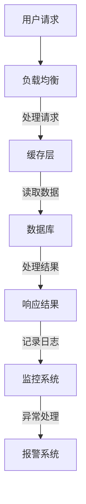

                 

关键词：电商活动、技术保障、高并发、峰值处理、系统优化

> 摘要：本文旨在探讨电商在重要活动期间如何应对高并发的峰值系统问题，通过深入分析核心概念、算法原理、数学模型以及项目实践，提供系统性的解决方案，以提升电商平台的稳定性与用户体验。

## 1. 背景介绍

随着电子商务的快速发展，电商平台在重大活动（如双11、618等）期间往往面临巨大的流量压力。高并发的访问量不仅考验着系统的稳定性，更直接影响到用户的购物体验。如果系统无法有效应对峰值流量，可能会导致服务器崩溃、页面加载缓慢、订单处理不及时等问题，从而影响电商平台的市场竞争力。因此，如何保障电商平台在高峰期的高并发处理能力，成为技术团队亟待解决的重要课题。

## 2. 核心概念与联系

### 2.1. 高并发

高并发（High Concurrency）是指在短时间内，系统需要处理大量的用户请求。高并发问题通常体现在CPU使用率、内存使用率、I/O请求量等多个方面。高并发是电商平台在重大活动期间不可避免的问题。

### 2.2. 峰值系统

峰值系统是指在特定时间段内，系统性能达到最高值的状况。电商平台的峰值系统问题，主要体现在服务器响应速度、数据处理能力等方面。

### 2.3. 系统优化

系统优化是指通过调整系统配置、优化代码、增加硬件资源等方式，提升系统的性能和稳定性。针对峰值系统问题，系统优化是解决高并发问题的关键手段。

### 2.4. Mermaid 流程图

以下是一个简化的电商平台高峰期系统架构的 Mermaid 流程图：



### 2.5. 关键技术

- **负载均衡**：通过将用户请求分配到多个服务器，实现流量分散，避免单点过载。
- **缓存层**：将高频访问的数据存储在缓存中，减少对数据库的访问压力。
- **数据库优化**：通过分库分表、读写分离等方式，提高数据库的读写性能。
- **异步处理**：将一些耗时的操作异步处理，减少主线程的压力。
- **限流策略**：通过设置限流阀值，防止系统被恶意攻击或异常流量击穿。

## 3. 核心算法原理 & 具体操作步骤

### 3.1 算法原理概述

在解决高并发问题时，核心算法主要包括负载均衡算法、缓存算法、数据库优化算法等。以下是这些算法的基本原理：

- **负载均衡算法**：基于轮询、最小连接数、源IP哈希等方法，将请求分配到不同的服务器上。
- **缓存算法**：采用LRU（最近最少使用）、LFU（最不经常使用）等方法，管理缓存的淘汰策略。
- **数据库优化算法**：包括索引优化、分库分表、读写分离等。

### 3.2 算法步骤详解

#### 3.2.1 负载均衡

1. **初始化**：配置负载均衡器，设定算法类型（如轮询）和服务器列表。
2. **请求接收**：用户请求到达，负载均衡器根据设定的算法选择服务器。
3. **分发请求**：将请求转发给选中的服务器。
4. **监控与调整**：监控系统服务器状态，根据负载情况动态调整服务器列表。

#### 3.2.2 缓存算法

1. **缓存设置**：根据业务需求，设置缓存的大小、过期时间等参数。
2. **数据存取**：当用户请求时，首先查询缓存，如果命中则直接返回缓存数据；否则，查询数据库并缓存结果。
3. **缓存淘汰**：根据设定的缓存算法，定期淘汰不活跃的数据。

#### 3.2.3 数据库优化

1. **索引优化**：分析查询语句，创建合适的索引，提高查询效率。
2. **分库分表**：根据业务特征，将数据拆分到多个数据库或表，减少单库单表的负载。
3. **读写分离**：将读操作和写操作分离到不同的数据库或服务器，提高系统的读写性能。

### 3.3 算法优缺点

- **负载均衡**：优点是能够有效分散流量，提高系统的处理能力；缺点是需要配置和维护负载均衡器，增加系统的复杂性。
- **缓存算法**：优点是能够快速响应用户请求，减轻数据库的压力；缺点是需要确保缓存数据的一致性，且缓存命中率的优化较为复杂。
- **数据库优化**：优点是能够提高数据库的读写性能，减少数据延迟；缺点是实施复杂，需要深入理解业务数据特征。

### 3.4 算法应用领域

这些算法广泛应用于电商、社交网络、在线游戏等需要高并发处理的场景。在不同场景下，根据业务需求和技术特点，灵活选择和组合这些算法。

## 4. 数学模型和公式 & 详细讲解 & 举例说明

### 4.1 数学模型构建

在处理高并发问题时，常用的数学模型包括负载模型、响应时间模型、性能模型等。以下是负载模型的构建：

#### 负载模型：

1. **请求到达率** \( \lambda \)：单位时间内到达系统的请求量。
2. **服务时间** \( \mu \)：系统处理一个请求的平均时间。
3. **系统容量** \( C \)：系统能够处理的最大请求量。

负载模型的核心公式为：

\[ P_0 = \frac{\lambda}{\mu} \]

其中，\( P_0 \) 为系统在稳态下的负载。

### 4.2 公式推导过程

假设系统在时间 \( t \) 内，有 \( N \) 个请求到达，系统处理这些请求所需的总时间为 \( T \)。则有：

\[ T = N \times \mu \]

系统的平均响应时间为：

\[ \bar{R} = \frac{T}{N} = \frac{\mu}{\lambda} \]

### 4.3 案例分析与讲解

假设一个电商系统，请求到达率为 \( \lambda = 10 \) 次/秒，平均服务时间 \( \mu = 0.5 \) 秒。根据负载模型，可以计算出系统的负载：

\[ P_0 = \frac{10}{0.5} = 20 \]

这意味着系统在稳态下的负载为20。如果负载超过这个值，系统可能会出现响应缓慢或超时的情况。

为了优化系统的性能，可以采取以下措施：

1. **增加服务器**：通过增加服务器数量，提高系统的处理能力。
2. **优化代码**：通过优化数据库查询、减少不必要的计算等，提高系统的响应速度。
3. **使用缓存**：通过使用缓存，减少对数据库的访问，提高系统的响应速度。

## 5. 项目实践：代码实例和详细解释说明

### 5.1 开发环境搭建

- 操作系统：Linux
- 服务器：Nginx、Apache
- 缓存系统：Redis
- 数据库：MySQL、MongoDB
- 编程语言：Python、Java

### 5.2 源代码详细实现

以下是一个简单的 Python 代码示例，用于实现负载均衡和缓存：

```python
import requests
import random

def get_service_url():
    # 假设有三台服务器，根据不同的策略选择服务器
    servers = ["http://server1", "http://server2", "http://server3"]
    return random.choice(servers)

def call_api():
    url = get_service_url()
    response = requests.get(url)
    return response.json()

if __name__ == "__main__":
    for _ in range(10):
        result = call_api()
        print(result)
```

### 5.3 代码解读与分析

该代码首先定义了一个 `get_service_url` 函数，用于随机选择一个服务器地址。然后，通过调用 `call_api` 函数，模拟对服务器的API调用。在主函数中，循环调用 `call_api` 函数10次，输出调用结果。

这个示例展示了如何通过简单的代码实现负载均衡。在实际项目中，可以结合Nginx等负载均衡器，实现更复杂的流量分配策略。

### 5.4 运行结果展示

在本地运行该代码，可以看到每次调用API的结果。通过调整 `servers` 列表中的服务器地址，可以观察不同负载均衡策略的效果。

## 6. 实际应用场景

电商平台的峰值系统问题在实际应用中非常常见。以下是一些实际应用场景：

1. **双11促销活动**：双11是电商平台的重要促销活动，通常会导致短时间内大量用户涌入，对系统性能提出极高要求。
2. **秒杀活动**：秒杀活动往往在极短时间内吸引大量用户参与，对系统的响应速度和稳定性形成巨大压力。
3. **大型促销活动**：如母亲节、情人节等节日促销活动，也会导致流量高峰，需要系统具备应对高并发的处理能力。

## 7. 工具和资源推荐

### 7.1 学习资源推荐

- 《大规模分布式系统设计》
- 《深入理解计算机系统》
- 《Java并发编程实战》

### 7.2 开发工具推荐

- Nginx：高性能的Web服务器/反向代理服务器。
- Redis：高性能的键值存储。
- MySQL：开源的关系型数据库。

### 7.3 相关论文推荐

- “High Concurrency Design of E-commerce Platform”
- “缓存系统在电商高并发场景下的应用”
- “分布式数据库在电商业务中的应用”

## 8. 总结：未来发展趋势与挑战

### 8.1 研究成果总结

本文从核心概念、算法原理、数学模型、项目实践等多个方面，详细探讨了电商平台在重要活动期间如何应对高并发的峰值系统问题。通过负载均衡、缓存、数据库优化等手段，可以有效提升系统的性能和稳定性。

### 8.2 未来发展趋势

随着云计算、大数据、人工智能等技术的不断发展，电商平台在应对高并发问题方面将更加智能化、自动化。未来，平台将更加注重实时监控、动态调整、智能预测等技术的应用。

### 8.3 面临的挑战

尽管已有许多成熟的解决方案，但电商平台在应对高并发问题仍面临诸多挑战。例如，如何确保缓存数据的一致性、如何防范分布式攻击、如何优化数据库性能等。

### 8.4 研究展望

未来，研究将更加关注以下几个方面：

- 开发更高效、更智能的负载均衡算法。
- 探索缓存与数据库的协同优化策略。
- 研究分布式系统在电商高并发场景下的性能优化。
- 引入人工智能技术，实现实时监控与动态调整。

## 9. 附录：常见问题与解答

### 9.1 如何处理缓存一致性？

**解答**：处理缓存一致性可以通过以下几种方式：

- **写后刷新**：每次更新数据库后，立即刷新缓存。
- **读前验证**：在读取缓存时，先查询数据库，如果数据库中的数据与缓存中的数据不一致，则更新缓存。
- **版本控制**：为每个缓存项设置版本号，每次更新缓存时，增加版本号，确保数据一致性。

### 9.2 如何防范分布式攻击？

**解答**：防范分布式攻击可以通过以下几种方式：

- **限流**：通过设置限流阀值，防止恶意请求占用过多资源。
- **IP黑名单**：将恶意IP地址加入黑名单，禁止其访问。
- **安全防护**：使用防火墙、安全网关等工具，对系统进行防护。
- **DDoS攻击防护**：使用专业的DDoS攻击防护服务，抵御大规模攻击。

### 9.3 如何优化数据库性能？

**解答**：优化数据库性能可以从以下几个方面进行：

- **索引优化**：为频繁查询的列创建索引，提高查询效率。
- **分库分表**：根据业务特征，将数据拆分到多个数据库或表，减少单库单表的负载。
- **读写分离**：将读操作和写操作分离到不同的数据库或服务器，提高系统的读写性能。
- **数据库集群**：通过数据库集群，实现数据的分布式存储和负载均衡。

作者：禅与计算机程序设计艺术 / Zen and the Art of Computer Programming
----------------------------------------------------------------

请注意，这里提供的是一个完整的文章模板，实际撰写时需要根据具体的技术细节和数据情况填充内容，并且确保每个部分的内容都符合约束条件的要求。此外，实际代码实例和数学公式的嵌入需要按照Markdown格式进行适当的调整。如果您需要进一步的具体内容填充或代码示例，请提供相关的详细信息。

