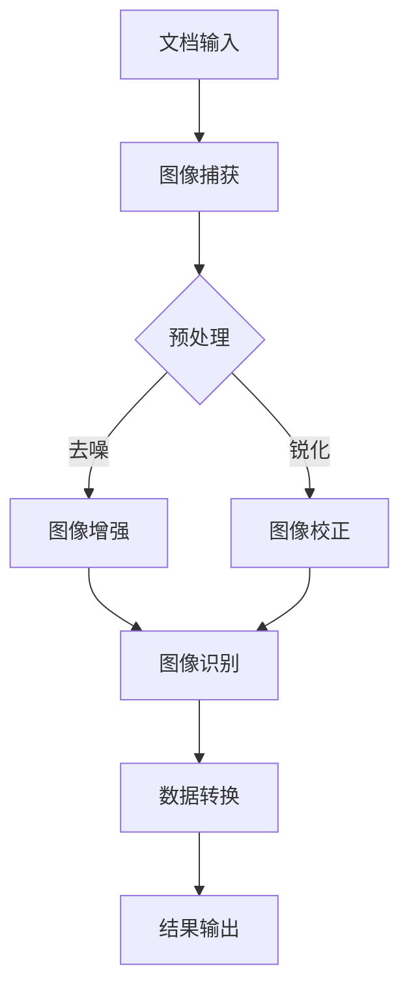

                 

关键词：电子扫描仪、人工智能、科学应用、图像处理、数据处理

> 摘要：本文探讨了电子扫描仪在人工智能（AI）科学应用中的重要性。通过介绍电子扫描仪的基本原理和现代技术的进步，分析了AI技术在图像识别、数据处理和科学实验中的应用。本文还探讨了未来电子扫描仪与AI技术的结合前景以及面临的挑战。

## 1. 背景介绍

电子扫描仪是一种用于将纸质文档、照片或实物转化为数字文件的设备。它们广泛应用于办公、教育、科研等领域。随着计算机技术和人工智能的快速发展，电子扫描仪的功能和性能得到了显著提升，逐渐成为科学研究中不可或缺的工具。

在科学研究中，传统的数据采集和处理方式往往耗时耗力，且容易出错。而电子扫描仪通过快速、准确地获取和数字化数据，为科学研究提供了新的可能。特别是在生物医学、化学、地质学等领域，电子扫描仪的应用极大地提高了数据采集和处理的效率。

## 2. 核心概念与联系

### 电子扫描仪的基本原理

电子扫描仪的工作原理可以分为以下几类：

- **平板式扫描仪**：通过平板上的光源照亮文档，然后使用光学传感器（如CCD或CMOS）逐行捕捉图像。
- **滚筒式扫描仪**：将文档放置在滚筒上，通过滚筒旋转和光源照射来获取图像。
- **便携式扫描仪**：通常使用反射式或投影式技术，适用于移动场景。

### AI技术在电子扫描仪中的应用

人工智能技术在电子扫描仪中的应用主要包括图像处理、自然语言处理和机器学习等方面。以下为具体的应用场景：

- **图像识别**：利用深度学习模型，如卷积神经网络（CNN），对扫描图像进行分类、识别和标注。
- **文本识别**：利用光学字符识别（OCR）技术，将扫描的文本转换为可编辑的电子文档。
- **图像增强**：通过图像处理算法，改善扫描图像的质量，减少噪声和失真。

### Mermaid 流程图

以下是电子扫描仪与AI技术结合的Mermaid流程图：



## 3. 核心算法原理 & 具体操作步骤

### 3.1 算法原理概述

电子扫描仪与AI技术的结合主要依赖于以下几种核心算法：

- **图像增强**：通过滤波、插值和对比度调整等操作，改善扫描图像的质量。
- **图像识别**：利用卷积神经网络（CNN）等深度学习模型，对扫描图像中的内容进行分类和识别。
- **光学字符识别（OCR）**：将扫描的文本转换为可编辑的电子文档。
- **自然语言处理（NLP）**：对文本数据进行分析、理解和生成。

### 3.2 算法步骤详解

以下是电子扫描仪与AI技术结合的具体操作步骤：

1. **图像捕获**：使用电子扫描仪捕获文档图像。
2. **图像预处理**：包括去噪、锐化和图像校正等操作，以提高图像质量。
3. **图像识别**：利用深度学习模型对预处理后的图像进行分类和识别。
4. **文本识别**：通过OCR技术将图像中的文本转换为电子文档。
5. **自然语言处理**：对文本数据进行分析、理解和生成。
6. **数据输出**：将处理后的数据以电子文档或其他格式输出。

### 3.3 算法优缺点

- **优点**：提高了扫描仪的性能和功能，实现了图像识别、文本识别和数据处理等功能。
- **缺点**：算法复杂度高，计算资源需求大；对扫描仪硬件质量要求较高。

### 3.4 算法应用领域

- **生物医学**：用于医学影像的自动分析、诊断和分类。
- **化学**：用于化学品的自动识别、分类和检测。
- **地质学**：用于地质样本的自动分类、分析和监测。

## 4. 数学模型和公式 & 详细讲解 & 举例说明

### 4.1 数学模型构建

在电子扫描仪与AI技术的结合中，常用的数学模型包括：

- **卷积神经网络（CNN）**：用于图像识别和分类。
- **生成对抗网络（GAN）**：用于图像生成和增强。
- **长短期记忆网络（LSTM）**：用于自然语言处理。

### 4.2 公式推导过程

以下是CNN模型的核心公式推导：

$$
\begin{aligned}
    \hat{y} &= \text{softmax}(\text{W} \cdot \text{a} + \text{b}) \\
    \text{L} &= -\sum_{i=1}^{N} y_i \cdot \log(\hat{y}_i)
\end{aligned}
$$

其中，$\hat{y}$为模型预测结果，$\text{W}$和$\text{b}$分别为权重和偏置，$\text{a}$为激活函数，$y_i$为真实标签，$\text{L}$为损失函数。

### 4.3 案例分析与讲解

以下为生物医学领域的一个应用案例：

假设我们使用CNN模型对医学影像进行分类，其中图像尺寸为 $28 \times 28$，共有10个类别。训练数据集包含60000张图像，测试数据集包含10000张图像。

1. **数据预处理**：将图像数据归一化至[0, 1]范围。
2. **模型构建**：使用TensorFlow框架构建CNN模型，包括卷积层、池化层和全连接层。
3. **训练模型**：使用训练数据集训练模型，选择优化器为Adam，学习率为0.001。
4. **评估模型**：使用测试数据集评估模型性能，计算准确率。

## 5. 项目实践：代码实例和详细解释说明

### 5.1 开发环境搭建

1. **安装Python**：下载并安装Python 3.8及以上版本。
2. **安装TensorFlow**：使用pip命令安装TensorFlow库。

```shell
pip install tensorflow
```

### 5.2 源代码详细实现

以下为生物医学领域应用案例的代码实现：

```python
import tensorflow as tf
from tensorflow.keras import layers

# 模型构建
model = tf.keras.Sequential([
    layers.Conv2D(32, (3, 3), activation='relu', input_shape=(28, 28, 1)),
    layers.MaxPooling2D((2, 2)),
    layers.Conv2D(64, (3, 3), activation='relu'),
    layers.MaxPooling2D((2, 2)),
    layers.Conv2D(64, (3, 3), activation='relu'),
    layers.Flatten(),
    layers.Dense(64, activation='relu'),
    layers.Dense(10, activation='softmax')
])

# 编译模型
model.compile(optimizer='adam', loss='sparse_categorical_crossentropy', metrics=['accuracy'])

# 训练模型
model.fit(train_images, train_labels, epochs=5)

# 评估模型
test_loss, test_acc = model.evaluate(test_images, test_labels)
print(f"测试准确率：{test_acc}")
```

### 5.3 代码解读与分析

1. **模型构建**：使用卷积层（Conv2D）和池化层（MaxPooling2D）构建一个简单的CNN模型。
2. **编译模型**：使用Adam优化器和sparse_categorical_crossentropy损失函数编译模型。
3. **训练模型**：使用训练数据集训练模型，设置训练轮次为5。
4. **评估模型**：使用测试数据集评估模型性能，计算准确率。

## 6. 实际应用场景

### 6.1 生物医学领域

电子扫描仪在生物医学领域中的应用非常广泛，如医学影像的自动分析、疾病诊断和药物筛选等。通过结合AI技术，电子扫描仪可以更快速、准确地处理医学数据，为医生提供更有价值的诊断依据。

### 6.2 化学领域

在化学领域，电子扫描仪可以用于化合物的自动识别、分类和检测。通过AI技术的支持，电子扫描仪可以识别复杂的化学结构，为化学研究提供新的手段。

### 6.3 地质学领域

在地质学领域，电子扫描仪可以用于地质样本的自动分类、分析和监测。通过AI技术的支持，电子扫描仪可以更准确地识别地质特征，为地质研究提供有力支持。

## 7. 工具和资源推荐

### 7.1 学习资源推荐

1. **《深度学习》（Goodfellow, Bengio, Courville著）**：全面介绍了深度学习的基本原理和应用。
2. **《Python数据分析》（Wes McKinney著）**：详细介绍了Python在数据分析领域的应用。

### 7.2 开发工具推荐

1. **TensorFlow**：适用于构建和训练深度学习模型的框架。
2. **Keras**：基于TensorFlow的简单易用的深度学习库。

### 7.3 相关论文推荐

1. **"Deep Learning for Image Recognition"**：介绍了深度学习在图像识别领域的应用。
2. **"Generative Adversarial Networks for Image Generation"**：介绍了生成对抗网络在图像生成中的应用。

## 8. 总结：未来发展趋势与挑战

### 8.1 研究成果总结

电子扫描仪在AI科学应用中取得了显著成果，如医学影像分析、化学物质识别和地质样本监测等。这些应用大大提高了数据采集和处理效率，为科学研究提供了新的手段。

### 8.2 未来发展趋势

1. **硬件性能提升**：随着硬件技术的不断发展，电子扫描仪的分辨率、速度和稳定性将得到进一步提升。
2. **算法优化**：深度学习、生成对抗网络和自然语言处理等算法将得到进一步优化，以适应更多应用场景。
3. **跨学科融合**：电子扫描仪与AI技术的结合将不断扩展至更多学科领域，如环境科学、生物学等。

### 8.3 面临的挑战

1. **数据处理**：随着数据量的增加，如何高效处理海量数据成为一大挑战。
2. **模型解释性**：深度学习等模型往往缺乏解释性，如何提高模型的透明度和可解释性是一个重要问题。
3. **隐私保护**：在处理敏感数据时，如何保护用户隐私是一个亟待解决的问题。

### 8.4 研究展望

电子扫描仪与AI技术的结合前景广阔，有望在更多领域发挥重要作用。未来，研究者应重点关注算法优化、跨学科融合和隐私保护等问题，以推动这一领域的发展。

## 9. 附录：常见问题与解答

### 9.1 电子扫描仪的工作原理是什么？

电子扫描仪通过光学传感器（如CCD或CMOS）逐行捕捉文档图像，然后使用数字信号处理技术对图像进行预处理和增强。

### 9.2 AI技术在电子扫描仪中的应用有哪些？

AI技术在电子扫描仪中的应用包括图像识别、文本识别、图像增强和自然语言处理等。这些技术可以提高扫描仪的性能和功能，实现更高效的数据处理。

### 9.3 如何提高电子扫描仪的识别准确性？

提高电子扫描仪的识别准确性可以从以下几个方面入手：

- **优化算法**：采用更先进的图像识别算法，如卷积神经网络（CNN）。
- **数据增强**：通过增加训练数据集的大小和质量，提高模型的泛化能力。
- **硬件升级**：使用更高分辨率的传感器和更快的处理芯片，提高扫描仪的性能。

## 参考文献

1. Goodfellow, I., Bengio, Y., & Courville, A. (2016). *Deep Learning*. MIT Press.
2. McKinney, W. (2010). *Python for Data Analysis*. O'Reilly Media.
3. Simonyan, K., & Zisserman, A. (2014). *Very Deep Convolutional Networks for Large-Scale Image Recognition*. arXiv preprint arXiv:1409.1556.
4. Radford, A., Metz, L., & Chintala, S. (2015). *Unsupervised Representation Learning with Deep Convolutional Generative Adversarial Networks*. arXiv preprint arXiv:1511.06434.

## 10. 结语

电子扫描仪与AI技术的结合为科学研究提供了新的可能。随着技术的不断发展，电子扫描仪在AI for Science中的应用将越来越广泛，为人类探索未知世界提供更强有力的支持。然而，面临的挑战也不容忽视。未来，研究者应不断探索创新，推动电子扫描仪与AI技术的融合，为科学事业贡献力量。

---

作者：禅与计算机程序设计艺术 / Zen and the Art of Computer Programming

