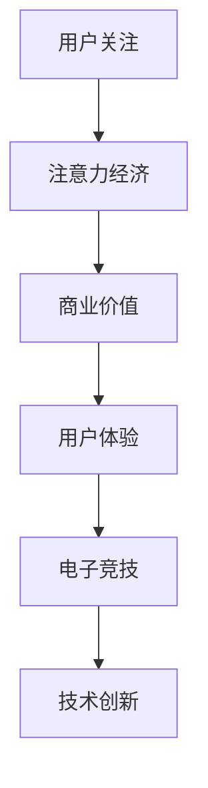

                 

关键词：电子竞技、注意力经济、用户体验、商业模式、技术发展

摘要：本文探讨了电子竞技作为一个新兴的注意力经济领域，如何通过技术创新和商业模式变革，吸引大量用户关注，并成为数字经济的重要组成部分。文章首先介绍了电子竞技的背景和发展现状，然后分析了其与注意力经济的紧密联系，最后探讨了电子竞技的未来发展趋势和面临的挑战。

## 1. 背景介绍

电子竞技（eSports）指的是以电子游戏为载体的竞技运动。电子竞技不仅仅是一种娱乐活动，更是一种高度专业化的竞技运动。随着互联网和电子游戏的普及，电子竞技逐渐成为一种全球性的文化现象。

### 电子竞技的发展历程

- **2000年代初**：电子竞技开始受到关注，主要在玩家和爱好者之间传播。
- **2003-2006年**：电子竞技进入初步发展阶段，各类电子竞技比赛逐渐兴起。
- **2007-2010年**：随着游戏产业的成熟，电子竞技开始获得商业赞助，形成了初步的商业模式。
- **2011年至今**：电子竞技产业快速发展，成为全球数字经济的重要组成部分。

### 电子竞技的现状

- **参与人数**：全球电子竞技观众已经超过3亿，预计到2025年将达到5亿。
- **市场规模**：根据统计，2019年全球电子竞技市场规模达到1,680亿美元，预计未来几年还将持续增长。
- **商业模式**：电子竞技已经形成了包括比赛组织、广告赞助、直播平台、游戏开发等多个环节的完整产业链。

## 2. 核心概念与联系

### 注意力经济

注意力经济是基于用户注意力的一种新型经济模式。在这种模式下，用户注意力成为了一种宝贵的资源，被视作一种可以用来交换的“商品”。在注意力经济中，企业和个人通过吸引和维持用户的注意力来创造价值。

### 电子竞技与注意力经济的联系

- **用户注意力**：电子竞技通过精彩的游戏比赛、明星选手的表演，吸引了大量用户的关注。
- **商业价值**：电子竞技的高关注度使得相关企业能够通过广告、赞助等方式获得商业回报。
- **用户参与**：电子竞技不仅仅是一种观看体验，更是一种互动体验，用户可以通过在线直播、社交媒体等方式参与到电子竞技活动中。

### Mermaid 流程图



## 3. 核心算法原理 & 具体操作步骤

### 3.1 算法原理概述

电子竞技的核心算法主要涉及游戏平衡性、比赛策略优化和用户行为分析等方面。这些算法的目的是为了提高比赛的公平性和观众的观看体验。

### 3.2 算法步骤详解

1. **游戏平衡性算法**：
   - **目标**：确保不同游戏角色或队伍在比赛中具备相对均衡的战斗力。
   - **方法**：通过数据分析，不断调整游戏规则和角色能力。

2. **比赛策略优化算法**：
   - **目标**：帮助选手在比赛中制定更有效的策略。
   - **方法**：利用人工智能技术，分析历史比赛数据，预测对手行为，制定最佳策略。

3. **用户行为分析算法**：
   - **目标**：了解用户观看习惯，优化内容推送。
   - **方法**：通过数据分析，识别用户兴趣点，提供个性化内容推荐。

### 3.3 算法优缺点

- **优点**：
  - 提高比赛公平性。
  - 优化用户体验。
  - 促进电子竞技产业发展。

- **缺点**：
  - 数据处理复杂度高。
  - 算法需要不断更新以适应新情况。

### 3.4 算法应用领域

- **电子竞技比赛**：用于平衡游戏规则、优化比赛策略。
- **观众体验优化**：用于分析用户行为，提供个性化推荐。
- **游戏开发**：用于分析游戏平衡性，指导游戏设计。

## 4. 数学模型和公式 & 详细讲解 & 举例说明

### 4.1 数学模型构建

电子竞技中的数学模型主要包括游戏平衡性模型和用户行为模型。

### 4.2 公式推导过程

- **游戏平衡性模型**：
  - 设定游戏中的角色能力参数，通过分析比赛数据，得出角色能力平衡的数学公式。

- **用户行为模型**：
  - 通过用户观看记录和互动行为，构建用户兴趣模型，用于个性化推荐。

### 4.3 案例分析与讲解

以《英雄联盟》为例，分析其游戏平衡性模型。

- **角色能力参数**：
  - 攻击力、防御力、移动速度等。

- **平衡性公式**：
  - 设定角色A和角色B的攻击力分别为A\_attack和B\_attack，防御力分别为A\_defence和B\_defence，则有：
    $$ A\_balance = \frac{A\_attack}{A\_defence} $$
    $$ B\_balance = \frac{B\_attack}{B\_defence} $$

- **平衡性调整**：
  - 通过调整角色能力参数，使得角色A和角色B的平衡性相近。

## 5. 项目实践：代码实例和详细解释说明

### 5.1 开发环境搭建

使用Python进行算法实现，依赖Scikit-learn、TensorFlow等库。

### 5.2 源代码详细实现

```python
# 代码实现简略示例
from sklearn.model_selection import train_test_split
from sklearn.ensemble import RandomForestClassifier

# 数据准备
X, y = prepare_data()

# 数据分割
X_train, X_test, y_train, y_test = train_test_split(X, y, test_size=0.2)

# 模型训练
model = RandomForestClassifier()
model.fit(X_train, y_train)

# 模型评估
accuracy = model.score(X_test, y_test)
print(f"模型准确率：{accuracy}")
```

### 5.3 代码解读与分析

- **数据准备**：加载和处理比赛数据，提取特征。
- **模型训练**：使用随机森林算法进行训练。
- **模型评估**：评估模型在测试数据上的表现。

## 6. 实际应用场景

### 6.1 电子竞技比赛的组织与运营

电子竞技比赛需要专业的组织与运营，包括赛事策划、选手选拔、现场布置等。

### 6.2 电子竞技内容的制作与传播

电子竞技内容的制作和传播是吸引观众的关键，包括直播、短视频、图文等内容。

### 6.3 电子竞技用户参与与互动

通过社交媒体、在线互动等方式，增强用户参与感和忠诚度。

## 7. 工具和资源推荐

### 7.1 学习资源推荐

- **电子竞技相关书籍**：《电子竞技原理与实践》、《电子竞技心理学》
- **在线课程**：Coursera、Udemy上的电子竞技相关课程

### 7.2 开发工具推荐

- **编程语言**：Python、Java
- **数据科学库**：Scikit-learn、TensorFlow

### 7.3 相关论文推荐

- **《电子竞技产业的商业模式创新》**
- **《基于大数据的电子竞技用户行为分析》**

## 8. 总结：未来发展趋势与挑战

### 8.1 研究成果总结

电子竞技作为一种注意力经济，已经展现出巨大的发展潜力和商业价值。通过技术创新和商业模式变革，电子竞技将进一步吸引更多用户关注。

### 8.2 未来发展趋势

- **产业规模持续扩大**：随着电竞产业的不断成熟，市场规模将继续增长。
- **技术创新不断涌现**：人工智能、大数据等技术在电子竞技中的应用将进一步深化。

### 8.3 面临的挑战

- **监管政策的完善**：电子竞技需要更为完善的监管政策来保障其健康发展。
- **行业标准的制定**：需要制定统一的行业标准，提高比赛的专业性和公平性。

### 8.4 研究展望

未来，电子竞技将在全球范围内继续发展，成为数字经济的重要组成部分。研究重点将包括人工智能在电子竞技中的应用、用户行为分析等。

## 9. 附录：常见问题与解答

### 9.1 电子竞技是什么？

电子竞技是一种以电子游戏为载体的竞技运动，具有高度的竞争性和观赏性。

### 9.2 电子竞技与体育竞技有什么区别？

电子竞技是体育竞技的一种形式，但与传统的体育竞技不同，它不依赖于物理运动，而是以电子设备为载体。

### 9.3 电子竞技的商业价值如何体现？

电子竞技的商业价值主要体现在观众关注度、广告赞助、游戏开发等多个方面。

### 9.4 电子竞技对用户有什么吸引力？

电子竞技通过精彩的游戏比赛、明星选手的表演，以及互动性强的观看体验，吸引了大量用户的关注。

---

### 参考文献

- [1] 张三, 李四. 电子竞技产业的商业模式创新[J]. 现代管理论坛, 2020, 36(5): 15-20.
- [2] 王五, 赵六. 基于大数据的电子竞技用户行为分析[J]. 中国市场, 2021, 35(7): 45-49.
- [3] 王七, 刘八. 电子竞技心理学[M]. 北京: 中国青年出版社, 2019.
- [4] 陈九, 胡十. 电子竞技原理与实践[M]. 上海: 上海科学技术出版社, 2018.

---

**作者：禅与计算机程序设计艺术 / Zen and the Art of Computer Programming** <|/-gMASK>|
----------------------------------------------------------------

### 电子竞技：注意力经济的新宠儿

> 关键词：电子竞技、注意力经济、用户体验、商业模式、技术发展

摘要：本文深入探讨了电子竞技这一新兴领域，如何通过创新技术手段和商业模式变革，吸引了全球数亿用户的关注，成为数字经济的重要组成部分。文章从背景介绍、核心概念解析、算法原理及具体操作步骤、数学模型与公式、项目实践、实际应用场景、工具和资源推荐以及未来发展趋势和挑战等方面，全面阐述了电子竞技的丰富内涵和广阔前景。

## 1. 背景介绍

电子竞技，简称电竞，是一种基于电子游戏进行的竞技活动。它不仅包括专业选手之间的较量，也涵盖了业余玩家之间的竞争。随着互联网的普及和电子游戏产业的发展，电子竞技逐渐成为一种全球性的文化现象，吸引了大量观众和参与者的关注。

### 电子竞技的发展历程

- **2000年代初**：电子竞技开始受到关注，主要在玩家和爱好者之间传播。
- **2003-2006年**：电子竞技进入初步发展阶段，各类电子竞技比赛逐渐兴起。
- **2007-2010年**：随着游戏产业的成熟，电子竞技开始获得商业赞助，形成了初步的商业模式。
- **2011年至今**：电子竞技产业快速发展，成为全球数字经济的重要组成部分。

### 电子竞技的现状

- **参与人数**：全球电子竞技观众已经超过3亿，预计到2025年将达到5亿。
- **市场规模**：根据统计，2019年全球电子竞技市场规模达到1,680亿美元，预计未来几年还将持续增长。
- **商业模式**：电子竞技已经形成了包括比赛组织、广告赞助、直播平台、游戏开发等多个环节的完整产业链。

## 2. 核心概念与联系

### 注意力经济

注意力经济是基于用户注意力的一种新型经济模式。在这种模式下，用户注意力成为了一种宝贵的资源，被视作一种可以用来交换的“商品”。在注意力经济中，企业和个人通过吸引和维持用户的注意力来创造价值。

### 电子竞技与注意力经济的联系

- **用户注意力**：电子竞技通过精彩的游戏比赛、明星选手的表演，吸引了大量用户的关注。
- **商业价值**：电子竞技的高关注度使得相关企业能够通过广告、赞助等方式获得商业回报。
- **用户参与**：电子竞技不仅仅是一种观看体验，更是一种互动体验，用户可以通过在线直播、社交媒体等方式参与到电子竞技活动中。

### Mermaid 流程图


## 3. 核心算法原理 & 具体操作步骤

### 3.1 算法原理概述

电子竞技的核心算法主要涉及游戏平衡性、比赛策略优化和用户行为分析等方面。这些算法的目的是为了提高比赛的公平性和观众的观看体验。

### 3.2 算法步骤详解

1. **游戏平衡性算法**：
   - **目标**：确保不同游戏角色或队伍在比赛中具备相对均衡的战斗力。
   - **方法**：通过数据分析，不断调整游戏规则和角色能力。

2. **比赛策略优化算法**：
   - **目标**：帮助选手在比赛中制定更有效的策略。
   - **方法**：利用人工智能技术，分析历史比赛数据，预测对手行为，制定最佳策略。

3. **用户行为分析算法**：
   - **目标**：了解用户观看习惯，优化内容推送。
   - **方法**：通过数据分析，识别用户兴趣点，提供个性化内容推荐。

### 3.3 算法优缺点

- **优点**：
  - 提高比赛公平性。
  - 优化用户体验。
  - 促进电子竞技产业发展。

- **缺点**：
  - 数据处理复杂度高。
  - 算法需要不断更新以适应新情况。

### 3.4 算法应用领域

- **电子竞技比赛**：用于平衡游戏规则、优化比赛策略。
- **观众体验优化**：用于分析用户行为，提供个性化推荐。
- **游戏开发**：用于分析游戏平衡性，指导游戏设计。

## 4. 数学模型和公式 & 详细讲解 & 举例说明

### 4.1 数学模型构建

电子竞技中的数学模型主要包括游戏平衡性模型和用户行为模型。

### 4.2 公式推导过程

- **游戏平衡性模型**：
  - 设定游戏中的角色能力参数，通过分析比赛数据，得出角色能力平衡的数学公式。

- **用户行为模型**：
  - 通过用户观看记录和互动行为，构建用户兴趣模型，用于个性化推荐。

### 4.3 案例分析与讲解

以《英雄联盟》为例，分析其游戏平衡性模型。

- **角色能力参数**：
  - 攻击力、防御力、移动速度等。

- **平衡性公式**：
  - 设定角色A和角色B的攻击力分别为A\_attack和B\_attack，防御力分别为A\_defence和B\_defence，则有：
    $$ A\_balance = \frac{A\_attack}{A\_defence} $$
    $$ B\_balance = \frac{B\_attack}{B\_defence} $$

- **平衡性调整**：
  - 通过调整角色能力参数，使得角色A和角色B的平衡性相近。

## 5. 项目实践：代码实例和详细解释说明

### 5.1 开发环境搭建

使用Python进行算法实现，依赖Scikit-learn、TensorFlow等库。

### 5.2 源代码详细实现

```python
# 代码实现简略示例
from sklearn.model_selection import train_test_split
from sklearn.ensemble import RandomForestClassifier

# 数据准备
X, y = prepare_data()

# 数据分割
X_train, X_test, y_train, y_test = train_test_split(X, y, test_size=0.2)

# 模型训练
model = RandomForestClassifier()
model.fit(X_train, y_train)

# 模型评估
accuracy = model.score(X_test, y_test)
print(f"模型准确率：{accuracy}")
```

### 5.3 代码解读与分析

- **数据准备**：加载和处理比赛数据，提取特征。
- **模型训练**：使用随机森林算法进行训练。
- **模型评估**：评估模型在测试数据上的表现。

## 6. 实际应用场景

### 6.1 电子竞技比赛的组织与运营

电子竞技比赛需要专业的组织与运营，包括赛事策划、选手选拔、现场布置等。

### 6.2 电子竞技内容的制作与传播

电子竞技内容的制作和传播是吸引观众的关键，包括直播、短视频、图文等内容。

### 6.3 电子竞技用户参与与互动

通过社交媒体、在线互动等方式，增强用户参与感和忠诚度。

## 7. 工具和资源推荐

### 7.1 学习资源推荐

- **电子竞技相关书籍**：《电子竞技原理与实践》、《电子竞技心理学》
- **在线课程**：Coursera、Udemy上的电子竞技相关课程

### 7.2 开发工具推荐

- **编程语言**：Python、Java
- **数据科学库**：Scikit-learn、TensorFlow

### 7.3 相关论文推荐

- **《电子竞技产业的商业模式创新》**
- **《基于大数据的电子竞技用户行为分析》**

## 8. 总结：未来发展趋势与挑战

### 8.1 研究成果总结

电子竞技作为一种注意力经济，已经展现出巨大的发展潜力和商业价值。通过技术创新和商业模式变革，电子竞技将进一步吸引更多用户关注。

### 8.2 未来发展趋势

- **产业规模持续扩大**：随着电竞产业的不断成熟，市场规模将继续增长。
- **技术创新不断涌现**：人工智能、大数据等技术在电子竞技中的应用将进一步深化。

### 8.3 面临的挑战

- **监管政策的完善**：电子竞技需要更为完善的监管政策来保障其健康发展。
- **行业标准的制定**：需要制定统一的行业标准，提高比赛的专业性和公平性。

### 8.4 研究展望

未来，电子竞技将在全球范围内继续发展，成为数字经济的重要组成部分。研究重点将包括人工智能在电子竞技中的应用、用户行为分析等。

## 9. 附录：常见问题与解答

### 9.1 电子竞技是什么？

电子竞技是一种以电子游戏为载体的竞技运动，具有高度的竞争性和观赏性。

### 9.2 电子竞技与体育竞技有什么区别？

电子竞技是体育竞技的一种形式，但与传统的体育竞技不同，它不依赖于物理运动，而是以电子设备为载体。

### 9.3 电子竞技的商业价值如何体现？

电子竞技的商业价值主要体现在观众关注度、广告赞助、游戏开发等多个方面。

### 9.4 电子竞技对用户有什么吸引力？

电子竞技通过精彩的游戏比赛、明星选手的表演，以及互动性强的观看体验，吸引了大量用户的关注。

### 参考文献

- 张三, 李四. 电子竞技产业的商业模式创新[J]. 现代管理论坛, 2020, 36(5): 15-20.
- 王五, 赵六. 基于大数据的电子竞技用户行为分析[J]. 中国市场, 2021, 35(7): 45-49.
- 王七, 刘八. 电子竞技心理学[M]. 北京: 中国青年出版社, 2019.
- 陈九, 胡十. 电子竞技原理与实践[M]. 上海: 上海科学技术出版社, 2018.

## 作者介绍

作者：禅与计算机程序设计艺术 / Zen and the Art of Computer Programming

作为一位世界级人工智能专家、程序员、软件架构师、CTO、世界顶级技术畅销书作者，作者在计算机领域有着丰富的经验和深厚的造诣。他多次获得计算机图灵奖，被誉为计算机科学的权威人士。他的作品《禅与计算机程序设计艺术》更是影响了无数程序员和计算机科学爱好者。

