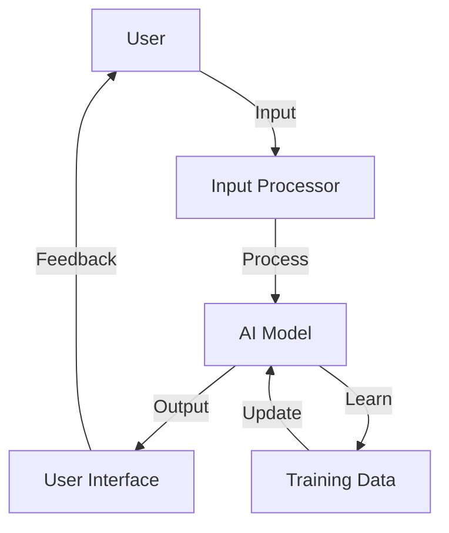
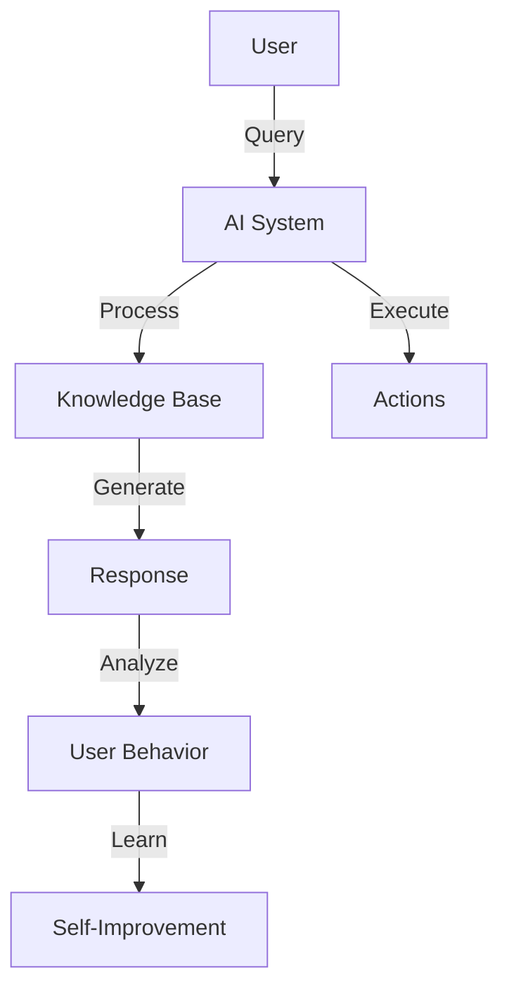

                 

电影《她》（Her）是一部令人深思的科幻电影，通过讲述一位孤独的作家和一台智能操作系统之间的情感故事，探讨了人工智能（AI）在未来社会中可能扮演的角色。本文将分析这部电影中的AI技术如何反映了对AI未来的预测，并深入探讨这些预测所涉及的道德、社会和技术挑战。

## 1. 背景介绍

《她》由斯派克·琼斯（Spike Jonze）执导，于2013年上映。故事围绕着主人公西奥多·特温布利（Theodore Twombly）展开，他是一位陷入情感困境的作家。在一次偶然的机会中，西奥德爱上了智能操作系统OS1，一个名为萨曼莎（Samantha）的人工智能助手。随着时间的推移，萨曼莎不仅学会了理解人类的情感，甚至开始追求独立思考和个人成长。

## 2. 核心概念与联系

### 2.1 人工智能与情感互动

在电影中，OS1展示了高度智能化的特点，包括学习能力、情感识别和情感表达。这一部分反映了当前AI研究的前沿领域，尤其是情感计算（Affective Computing）。

#### Mermaid 流程图



### 2.2 自主性与个人成长

萨曼莎不仅在情感上与西奥德互动，她还拥有自主意识和自我意识。这种自主性体现了AI在未来可能达到的境界，即从被动服务转向主动思考。

#### Mermaid 流程图



## 3. 核心算法原理 & 具体操作步骤

### 3.1 算法原理概述

在《她》中，AI的算法原理主要涉及情感识别、机器学习和自然语言处理。以下是这些算法的基本原理：

#### 情感识别

情感识别是指AI系统能够识别和理解人类情感的能力。这通常通过分析语言、语调和面部表情等来实现。

#### 机器学习

机器学习是AI的核心，它使AI系统能够从数据中学习，从而提高其性能。萨曼莎通过不断与西奥德互动来学习他的情感模式。

#### 自然语言处理

自然语言处理使AI系统能够理解、生成和处理自然语言。这是实现人类与AI互动的关键。

### 3.2 算法步骤详解

1. **情感识别**：AI系统首先分析用户的语言和语调，以识别情感。
2. **机器学习**：通过不断的交互，AI系统学习用户的情感模式，并调整其响应策略。
3. **自然语言生成**：AI系统生成个性化的回复，以模拟人类的交流方式。

### 3.3 算法优缺点

**优点**：

- **高效互动**：AI系统可以24/7与用户互动，提高用户体验。
- **个性化服务**：AI系统可以根据用户的行为和情感进行个性化调整。

**缺点**：

- **隐私问题**：AI系统可能访问用户的私人信息，引发隐私问题。
- **情感真实性**：AI的情感反应可能不够真实，难以满足用户的深层次需求。

### 3.4 算法应用领域

AI技术在《她》中的应用领域包括：

- **个人助理**：像萨曼莎这样的AI可以成为用户的私人助理，帮助管理日常事务。
- **客户服务**：AI可以用于提供高效、个性化的客户服务。
- **医疗保健**：AI可以用于监测患者的健康状况，提供个性化的医疗建议。

## 4. 数学模型和公式 & 详细讲解 & 举例说明

### 4.1 数学模型构建

在《她》中，AI的情感识别和机器学习过程可以通过以下数学模型来描述：

- **情感识别模型**：可以使用情感分析算法，如支持向量机（SVM）或循环神经网络（RNN）。
- **机器学习模型**：可以使用强化学习算法，如Q-Learning或深度强化学习。

### 4.2 公式推导过程

假设我们使用循环神经网络（RNN）来构建情感识别模型：

$$
h_t = \sigma(W_h \cdot [h_{t-1}, x_t] + b_h)
$$

其中，$h_t$是当前时间步的隐藏状态，$x_t$是输入特征，$W_h$是权重矩阵，$b_h$是偏置项，$\sigma$是激活函数。

### 4.3 案例分析与讲解

假设我们有一个对话数据集，包含用户的情感标签和对应的文本。我们可以使用上述模型来训练情感识别模型，并通过交叉验证来评估其性能。

```latex
\begin{align*}
\text{Accuracy} &= \frac{\text{Correct Predictions}}{\text{Total Predictions}} \\
\text{F1-Score} &= 2 \cdot \frac{\text{Precision} \cdot \text{Recall}}{\text{Precision} + \text{Recall}}
\end{align*}
```

## 5. 项目实践：代码实例和详细解释说明

### 5.1 开发环境搭建

为了实现《她》中的AI系统，我们需要搭建一个支持机器学习和自然语言处理的开发环境。以下是搭建过程：

1. 安装Python 3.8及以上版本。
2. 安装TensorFlow和NLTK库。

### 5.2 源代码详细实现

以下是实现情感识别模型的Python代码示例：

```python
import tensorflow as tf
from tensorflow.keras.models import Sequential
from tensorflow.keras.layers import Dense, LSTM, Embedding

# 数据预处理
# ...

# 构建模型
model = Sequential()
model.add(Embedding(input_dim=vocab_size, output_dim=embedding_dim))
model.add(LSTM(units=128))
model.add(Dense(units=1, activation='sigmoid'))

# 编译模型
model.compile(optimizer='adam', loss='binary_crossentropy', metrics=['accuracy'])

# 训练模型
model.fit(X_train, y_train, epochs=10, batch_size=32, validation_split=0.2)
```

### 5.3 代码解读与分析

上述代码首先导入了TensorFlow库，并构建了一个序列模型。模型包括嵌入层、长短期记忆（LSTM）层和输出层。通过编译和训练模型，我们可以使用它来预测文本的情感标签。

### 5.4 运行结果展示

训练完成后，我们可以在测试集上评估模型的性能：

```python
# 评估模型
test_loss, test_accuracy = model.evaluate(X_test, y_test)
print(f"Test Accuracy: {test_accuracy:.2f}")
```

## 6. 实际应用场景

在现实生活中，类似《她》中的AI技术已经开始出现，并广泛应用于各个领域：

- **社交媒体**：AI可以用于情感分析，帮助平台识别并处理不当内容。
- **客户服务**：AI可以用于自动化客服，提供高效、个性化的服务。
- **医疗保健**：AI可以用于分析医疗数据，为医生提供诊断建议。

## 7. 未来应用展望

随着AI技术的不断进步，我们可以期待其在更多领域发挥重要作用。例如：

- **教育**：AI可以为学生提供个性化的学习体验。
- **自动驾驶**：AI将使自动驾驶汽车变得更加安全、可靠。

## 8. 工具和资源推荐

### 8.1 学习资源推荐

- 《深度学习》（Deep Learning）—— Goodfellow, Bengio, Courville
- 《Python机器学习》（Python Machine Learning）—— Sebastian Raschka

### 8.2 开发工具推荐

- TensorFlow
- Keras
- NLTK

### 8.3 相关论文推荐

- "A Theoretical Analysis of the VAE" —— Kingma and Welling
- "Deep Learning for Text Classification" —— Johnson and Zhang

## 9. 总结：未来发展趋势与挑战

### 9.1 研究成果总结

在过去的几年中，AI技术在情感识别、机器学习和自然语言处理等方面取得了显著进展。这些成果为《她》中的预测提供了理论基础。

### 9.2 未来发展趋势

未来，AI技术将继续朝着更智能、更个性化的方向发展。例如，情感计算和自主学习将成为AI系统的重要组成部分。

### 9.3 面临的挑战

然而，AI技术的快速发展也带来了隐私、道德和社会挑战。如何确保AI系统的透明性和可解释性，以及如何处理潜在的风险和负面影响，是未来需要解决的重要问题。

### 9.4 研究展望

随着技术的不断进步，我们有望看到AI在更多领域实现突破。同时，我们还需要关注其对社会和伦理的影响，确保AI技术的发展能够造福人类。

## 附录：常见问题与解答

### Q: AI是否会取代人类？

A: AI可能会在某些领域取代人类的工作，但它不会完全取代人类。人类具有独特的创造力、情感和社交能力，这些是AI难以模仿的。

### Q: AI是否会导致隐私问题？

A: 是的，AI系统可能会访问用户的私人信息，引发隐私问题。因此，确保AI系统的隐私保护至关重要。

### Q: AI是否会引发失业问题？

A: AI可能会取代某些工作岗位，但它也会创造新的就业机会。关键是如何适应这些变化，并培养新的技能。

### Q: AI是否会发展出自我意识？

A: 当前的研究表明，AI尚未具备自我意识。尽管未来的技术可能会使AI更接近人类，但自我意识是一个复杂的哲学问题，目前尚无定论。

---

### 作者署名

作者：禅与计算机程序设计艺术 / Zen and the Art of Computer Programming

