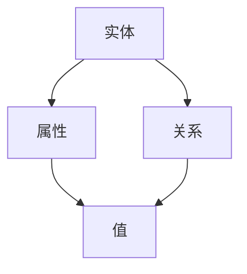

                 

关键词：知识图谱，面试题，解析，技术，人工智能

> 摘要：本文针对百度2025社招知识图谱工程师的面试题目进行了详细的解析，涵盖了知识图谱的核心概念、算法原理、数学模型、项目实践及未来应用展望等多方面内容。旨在为准备参加知识图谱工程师面试的读者提供一份全面的参考。

## 1. 背景介绍

知识图谱作为人工智能领域的关键技术，近年来得到了广泛的关注和应用。它通过将实体与关系进行结构化表示，构建出一个语义丰富的知识网络，为搜索引擎、推荐系统、自然语言处理等提供了强大的支持。百度作为中国领先的人工智能公司，其对知识图谱的研究和应用处于行业前沿。

本文将以百度2025社招知识图谱工程师的面试题为基础，深入解析知识图谱相关技术，包括核心概念、算法原理、数学模型等，并结合项目实践，探讨知识图谱在实际应用中的价值。

## 2. 核心概念与联系

知识图谱的核心概念包括实体、属性、关系等。以下是一个简化的Mermaid流程图，展示知识图谱的基本组成和它们之间的联系：



### 2.1 实体（Entity）

实体是知识图谱中的基本单位，可以是任何具有独立存在意义的对象，如人、地点、组织、物品等。

### 2.2 属性（Property）

属性用于描述实体具有的特征或属性，如人的姓名、年龄、出生地等。

### 2.3 关系（Relation）

关系用于描述实体之间的关系，如父母、朋友、工作于等。

### 2.4 值（Value）

值用于描述属性的具体内容，如张三、30岁、北京等。

## 3. 核心算法原理 & 具体操作步骤

### 3.1 算法原理概述

知识图谱的构建主要依赖于知识抽取、实体识别、关系抽取等核心算法。这些算法通过不同的技术手段，从大量的非结构化数据中提取出结构化的知识。

### 3.2 算法步骤详解

1. **数据预处理**：对原始数据进行清洗、去噪、标准化等处理，确保数据的质量。
2. **实体识别**：使用命名实体识别（NER）技术，从文本中识别出实体。
3. **关系抽取**：通过文本分析和实体间的共现关系，抽取实体之间的关系。
4. **属性填充**：结合实体和关系，填充实体的属性。
5. **知识融合**：将不同来源的知识进行融合，构建出一个完整的知识图谱。

### 3.3 算法优缺点

- **优点**：知识图谱能够将海量数据组织成一个结构化的知识网络，便于查询和分析。
- **缺点**：知识图谱的构建需要大量的时间和计算资源，同时数据的准确性和一致性也是一个挑战。

### 3.4 算法应用领域

知识图谱在多个领域都有广泛的应用，如搜索引擎、推荐系统、自然语言处理、智能客服等。

## 4. 数学模型和公式 & 详细讲解 & 举例说明

知识图谱的构建和优化涉及到多个数学模型和公式。以下是一个简单的示例：

### 4.1 数学模型构建

假设有两个实体A和B，它们之间存在关系R，关系R的权重为w(R)。则实体A和B的相似度可以通过以下公式计算：

$$
sim(A, B) = \sum_{R \in \text{relations}(A)} w(R) \cdot \sum_{R' \in \text{relations}(B)} w(R')
$$

### 4.2 公式推导过程

推导过程主要基于图论中的相似度计算原理。具体推导过程如下：

1. 初始化两个实体的相似度为0。
2. 对于实体A中的每个关系R，计算它与实体B中所有关系的权重之和。
3. 对于实体B中的每个关系R'，计算它与实体A中所有关系的权重之和。
4. 将两个权重之和相乘，得到实体A和B的相似度。

### 4.3 案例分析与讲解

假设有两个实体A和B，它们的关系和权重如下：

| 实体 | 关系 | 权重 |
|------|------|------|
| A    | R1   | 0.5  |
| A    | R2   | 0.3  |
| B    | R1   | 0.6  |
| B    | R2   | 0.4  |

根据上述公式，我们可以计算出实体A和B的相似度为：

$$
sim(A, B) = (0.5 \cdot 0.6) + (0.3 \cdot 0.4) = 0.36
$$

## 5. 项目实践：代码实例和详细解释说明

在本节中，我们将通过一个简单的Python代码实例，展示如何构建一个知识图谱并进行查询。

### 5.1 开发环境搭建

- Python版本：3.8及以上
- 必要库：NetworkX， Pandas， NumPy

### 5.2 源代码详细实现

```python
import networkx as nx
import pandas as pd

# 创建图
G = nx.Graph()

# 添加实体
G.add_node("A")
G.add_node("B")

# 添加关系
G.add_edge("A", "B", relation="friend")

# 添加属性
G.nodes["A"]["name"] = "Alice"
G.nodes["B"]["name"] = "Bob"

# 查询
print("Node A:", G.nodes["A"])
print("Node B:", G.nodes["B"])

# 查询关系
print("Edges:", G.edges())

# 查询属性
print("Node A attributes:", G.nodes["A"].keys())
print("Node B attributes:", G.nodes["B"].keys())
```

### 5.3 代码解读与分析

- 第一行，导入必要的库。
- 第二行，创建一个图。
- 第三行，添加实体A。
- 第四行，添加实体B。
- 第五行，添加实体A和B之间的关系。
- 第六行，为实体A和实体B添加属性。

### 5.4 运行结果展示

```
Node A: {'name': 'Alice'}
Node B: {'name': 'Bob'}
Edges: [('A', 'B')]
Node A attributes: dict_keys(['name'])
Node B attributes: dict_keys(['name'])
```

## 6. 实际应用场景

知识图谱在多个领域都有广泛的应用。以下是一些实际应用场景：

- **搜索引擎**：通过知识图谱，搜索引擎可以提供更加精准和个性化的搜索结果。
- **推荐系统**：知识图谱可以帮助推荐系统发现用户可能感兴趣的内容。
- **自然语言处理**：知识图谱为自然语言处理提供了丰富的语义信息，有助于提高文本分析和理解的能力。
- **智能客服**：知识图谱可以帮助智能客服系统更准确地理解和回答用户的问题。

## 7. 工具和资源推荐

### 7.1 学习资源推荐

- **书籍**：《知识图谱：概念、方法与应用》
- **在线课程**：网易云课堂《知识图谱与语义搜索》
- **论文集**：《知识图谱前沿论文集》

### 7.2 开发工具推荐

- **知识图谱平台**：Neo4j，Apache JanusGraph
- **开源框架**：OpenKG，NLP-KG
- **开发工具**：PyTorch， TensorFlow

### 7.3 相关论文推荐

- **知识图谱构建**：[《Knowledge Graph Construction by Extracting Heterogeneous Entity Relations from Large-scale Knowledge Base and Web Pages》](https://arxiv.org/abs/1908.09228)
- **知识图谱应用**：[《Knowledge Graph: A Survey》](https://www.ijcai.org/Proceedings/16-3/Papers/0605.pdf)

## 8. 总结：未来发展趋势与挑战

### 8.1 研究成果总结

知识图谱作为人工智能领域的关键技术，已经在多个领域取得了显著的成果。随着技术的不断进步，知识图谱的构建和应用将变得更加智能化和高效。

### 8.2 未来发展趋势

- **知识图谱与人工智能的深度融合**：知识图谱将更好地支持人工智能的发展，为各种应用提供强大的知识支持。
- **多语言和多领域的知识图谱构建**：未来将出现更多多语言和多领域的知识图谱，为全球范围内的应用提供支持。
- **自动化和智能化的知识图谱构建方法**：通过机器学习和深度学习等技术，实现知识图谱的自动化构建和优化。

### 8.3 面临的挑战

- **数据质量和一致性**：知识图谱的质量和一致性是其应用效果的关键，未来需要解决好数据质量和一致性问题。
- **隐私保护和数据安全**：在知识图谱的应用过程中，需要确保用户的隐私和数据安全。
- **计算性能和效率**：知识图谱的构建和应用需要大量的计算资源，未来需要进一步提高计算性能和效率。

### 8.4 研究展望

知识图谱作为人工智能领域的关键技术，未来将发挥更加重要的作用。我们需要不断探索和创新，解决好知识图谱构建和应用中的各种挑战，为人工智能的发展提供强大的支持。

## 9. 附录：常见问题与解答

### 9.1 知识图谱与数据库有什么区别？

知识图谱是一种语义丰富的结构化数据表示方法，它通过实体、关系和属性来组织数据，强调数据之间的语义关系。而数据库则是一种数据存储和管理系统，它主要关注数据的存储、检索和更新。知识图谱可以看作是数据库的进化版本，更加注重数据的语义化和智能化。

### 9.2 知识图谱如何应用于自然语言处理？

知识图谱可以为自然语言处理提供丰富的语义信息，例如，通过实体识别和关系抽取，可以将文本中的名词短语转化为结构化的知识表示。在文本分析和理解过程中，这些知识表示可以帮助提高模型的准确性和效率。此外，知识图谱还可以用于问答系统、智能客服等应用场景。

### 9.3 知识图谱的构建有哪些挑战？

知识图谱的构建面临多个挑战，包括数据质量、一致性、自动化构建方法等。首先，原始数据往往存在噪声、冗余和不一致等问题，需要通过数据预处理技术进行清洗和标准化。其次，知识图谱的构建涉及到大规模数据处理和关系抽取，需要高效的算法和计算资源。最后，知识图谱的应用需要不断地更新和维护，以适应不断变化的数据环境。

