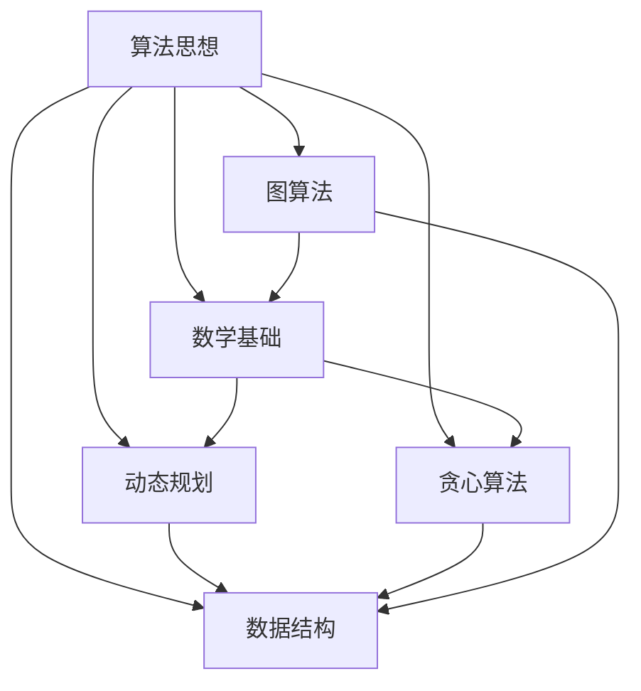

                 

### 背景介绍

随着人工智能技术的飞速发展，百度作为中国领先的人工智能公司，其在社招面试中对于应聘者的算法能力要求也越来越高。这些面试真题和算法题解不仅考察应聘者的编程技能和算法思维，更是对综合素质的全面考核。本文旨在通过深入分析百度2025年社招面试中的真题与算法题，帮助读者了解面试官的出题思路和考查重点，并为未来的面试准备提供实用的指导。

### 核心概念与联系

在深入了解面试真题之前，我们需要明确一些核心概念和它们之间的联系。这些概念包括但不限于：

- **动态规划（Dynamic Programming）**：一种算法思想，适用于求解最优化问题，通过将问题分解为子问题并存储子问题的解来避免重复计算。
- **贪心算法（Greedy Algorithm）**：一种简化的求解策略，每一步都做出在当前状态下最好或最优的选择，期望结果是全局最优的。
- **数据结构**：如栈、队列、链表、树、图等，是解决算法问题的基础设施。
- **图算法**：如深度优先搜索（DFS）、广度优先搜索（BFS）、最短路径算法（Dijkstra、Floyd）等，在社交网络分析、路由算法等领域有广泛应用。
- **数学基础**：包括线性代数、概率论、数论等，是解决复杂算法问题的理论基础。

下面是这些核心概念的Mermaid流程图表示，以便更直观地理解它们之间的联系：



### 核心算法原理 & 具体操作步骤

#### 3.1 算法原理概述

核心算法原理部分将介绍动态规划、贪心算法、数据结构和图算法的基本原理。这些算法在解决最优化问题、路径问题、图论问题等方面有着广泛的应用。

- **动态规划**：通过将问题分解为子问题并存储子问题的解，避免重复计算，从而提高算法的效率。
- **贪心算法**：每一步都做出当前状态下最好或最优的选择，期望结果是全局最优的。
- **数据结构**：如栈、队列、链表、树、图等，是解决算法问题的基础设施。
- **图算法**：如深度优先搜索（DFS）、广度优先搜索（BFS）、最短路径算法（Dijkstra、Floyd）等，在社交网络分析、路由算法等领域有广泛应用。

#### 3.2 算法步骤详解

下面将分别介绍这些算法的具体步骤和实现方法。

**动态规划**：

动态规划的一般步骤如下：

1. **定义状态**：将问题分解为多个子问题，每个子问题都可以用一个状态表示。
2. **状态转移方程**：找出子问题之间的关系，定义状态转移方程。
3. **边界条件**：确定递归的边界条件。
4. **状态表**：利用状态转移方程和边界条件构建状态表。
5. **求解**：根据状态表求解最终结果。

**贪心算法**：

贪心算法的一般步骤如下：

1. **初始状态**：确定问题的初始状态。
2. **选择策略**：在当前状态下，选择一个最优解。
3. **更新状态**：根据选择的最优解更新当前状态。
4. **重复步骤2和3**：直到满足停止条件。

**数据结构**：

不同的数据结构有不同的使用场景和实现方法。以下是几种常见的数据结构的简要介绍：

- **栈**：后进先出（LIFO）的数据结构，常用操作有入栈、出栈、判断空、获取栈顶元素。
- **队列**：先进先出（FIFO）的数据结构，常用操作有入队、出队、判断空、获取队首元素。
- **链表**：由节点组成的线性结构，每个节点包含数据和指向下一个节点的指针。
- **树**：由节点组成的层级结构，每个节点可以有零个或多个子节点。
- **图**：由节点和边组成的结构，表示多对多关系。

**图算法**：

常见的图算法包括深度优先搜索（DFS）和广度优先搜索（BFS）。以下是它们的步骤：

- **深度优先搜索（DFS）**：
  1. 选择一个未访问的节点作为起点。
  2. 访问该节点，并将其标记为已访问。
  3. 对于该节点的每个未访问的邻居节点，递归执行步骤1和2。

- **广度优先搜索（BFS）**：
  1. 选择一个未访问的节点作为起点，并将其入队。
  2. 出队一个节点，访问并标记为已访问。
  3. 对于该节点的每个未访问的邻居节点，将其入队。

#### 3.3 算法优缺点

每种算法都有其优缺点。以下是动态规划、贪心算法、数据结构和图算法的优缺点总结：

- **动态规划**：
  - 优点：适用于求解最优化问题，时间复杂度较低。
  - 缺点：需要明确状态转移方程和边界条件，问题理解难度较大。

- **贪心算法**：
  - 优点：实现简单，适用于某些最优问题。
  - 缺点：可能只适用于某些特定情况，不保证全局最优。

- **数据结构**：
  - 优点：提供高效的数据操作接口，适用于不同的应用场景。
  - 缺点：实现复杂，需要根据具体应用选择合适的数据结构。

- **图算法**：
  - 优点：适用于图论问题，如最短路径、拓扑排序等。
  - 缺点：时间复杂度较高，对于大规模图可能不适用。

#### 3.4 算法应用领域

动态规划、贪心算法、数据结构和图算法在许多领域都有广泛的应用：

- **动态规划**：适用于最优化问题，如背包问题、最长公共子序列等。
- **贪心算法**：适用于某些最短路径问题、最长公共子串等。
- **数据结构**：广泛应用于排序、查找、图处理等领域。
- **图算法**：适用于社交网络分析、路由算法、最短路径等。

### 数学模型和公式 & 详细讲解 & 举例说明

数学模型和公式是解决算法问题的重要工具。以下将介绍一些常见的数学模型和公式，并详细讲解其推导过程和实际应用。

#### 4.1 数学模型构建

常见的数学模型包括：

- **线性规划模型**：适用于求解线性约束下的最优化问题。
- **整数规划模型**：适用于求解整数约束下的最优化问题。
- **动态规划模型**：适用于求解具有重叠子问题的最优化问题。

以下是一个简单的线性规划模型示例：

$$
\begin{aligned}
\text{最大化} \quad z = c^T x \\
\text{满足} \quad Ax \leq b \\
x \geq 0
\end{aligned}
$$

其中，$c$ 是目标函数的系数向量，$x$ 是变量向量，$A$ 是系数矩阵，$b$ 是常数向量。

#### 4.2 公式推导过程

以下将介绍线性规划模型的目标函数、约束条件和求解过程。

**目标函数**：

目标函数用于衡量优化问题的目标值。对于线性规划模型，目标函数是一个线性函数，其形式为：

$$
z = c^T x
$$

其中，$c$ 是目标函数的系数向量，$x$ 是变量向量。

**约束条件**：

线性规划模型通常具有线性约束条件，其形式为：

$$
Ax \leq b
$$

其中，$A$ 是系数矩阵，$x$ 是变量向量，$b$ 是常数向量。

**求解过程**：

线性规划模型的求解通常使用单纯形法。以下是单纯形法的基本步骤：

1. **初始化**：选择一个初始基本可行解。
2. **判断最优性**：判断当前基本可行解是否为最优解。
3. **迭代优化**：根据目标函数和约束条件，迭代优化基本可行解。
4. **停止条件**：当达到最优性条件时，停止迭代。

以下是一个线性规划模型的求解示例：

假设我们要最大化 $z = 3x_1 + 2x_2$，满足约束条件 $x_1 + 2x_2 \leq 4$ 和 $2x_1 + x_2 \leq 6$，且 $x_1, x_2 \geq 0$。

- **初始化**：选择 $x_1 = 0, x_2 = 0$ 作为初始基本可行解。
- **判断最优性**：计算目标函数值 $z = 3 \times 0 + 2 \times 0 = 0$。
- **迭代优化**：由于目标函数值未达到最大值，我们需要进行迭代优化。
- **选择进入变量**：根据约束条件，选择 $x_1$ 作为进入变量。
- **选择离开变量**：计算比值 $\frac{b_i}{a_{ij}}$，选择最小的比值对应的变量作为离开变量。在本例中，$\frac{4}{1} = 4$，$\frac{6}{2} = 3$，因此选择 $x_2$ 作为离开变量。
- **更新基本可行解**：用进入变量替换离开变量，更新基本可行解。

经过迭代优化后，我们得到最优解 $x_1 = 4, x_2 = 0$，此时目标函数值 $z = 3 \times 4 + 2 \times 0 = 12$。

#### 4.3 案例分析与讲解

以下将结合实际案例，讲解线性规划模型的求解过程。

**案例：生产规划问题**

某公司生产两种产品，每种产品都需要经过两个工序。每个工序所需时间和利润如下表所示：

| 产品 | 工序1时间（小时） | 工序2时间（小时） | 利润（万元） |
| ---- | ---- | ---- | ---- |
| 产品A | 2 | 3 | 5 |
| 产品B | 1 | 2 | 3 |

公司每天有8小时的生产时间，要求利润最大化。请问每天应生产多少产品A和产品B？

- **目标函数**：最大化利润 $z = 5x_1 + 3x_2$
- **约束条件**：
  - 工序1时间约束：$2x_1 + x_2 \leq 8$
  - 工序2时间约束：$3x_1 + 2x_2 \leq 8$
- **非负约束**：$x_1, x_2 \geq 0$

使用单纯形法求解该线性规划模型：

1. **初始化**：选择 $x_1 = 0, x_2 = 0$ 作为初始基本可行解。
2. **判断最优性**：计算目标函数值 $z = 5 \times 0 + 3 \times 0 = 0$。
3. **迭代优化**：由于目标函数值未达到最大值，我们需要进行迭代优化。
4. **选择进入变量**：根据约束条件，选择 $x_1$ 作为进入变量。
5. **选择离开变量**：计算比值 $\frac{8}{2} = 4$，$\frac{8}{3} = 2.67$，因此选择 $x_2$ 作为离开变量。
6. **更新基本可行解**：用进入变量替换离开变量，更新基本可行解。

经过迭代优化后，我们得到最优解 $x_1 = 4, x_2 = 0$，此时目标函数值 $z = 5 \times 4 + 3 \times 0 = 20$。

因此，每天应生产 4 个产品A和 0 个产品B，以最大化利润。

### 项目实践：代码实例和详细解释说明

为了更好地理解上述算法和数学模型，我们将通过一个具体的代码实例来进行实践。以下是该实例的完整代码实现和详细解释说明。

#### 5.1 开发环境搭建

为了运行下面的代码实例，您需要搭建以下开发环境：

- Python 3.8 或更高版本
- Jupyter Notebook 或 Python Shell

请确保您的开发环境中已安装必要的库，如 NumPy、Pandas、SciPy 和 Matplotlib。

#### 5.2 源代码详细实现

以下是一个简单的线性规划模型求解器的 Python 实现，用于求解生产规划问题：

```python
import numpy as np
from scipy.optimize import linprog

def solve_linear_programming(c, A, b):
    x0 = np.zeros(len(c))
    res = linprog(c, A_ub=A, b_ub=b, x0=x0, method='highs')

    if res.success:
        print("最优解：", res.x)
        print("最大利润：", np.dot(c, res.x))
    else:
        print("求解失败，无最优解")

# 目标函数系数
c = np.array([5, 3])
# 约束条件系数矩阵
A = np.array([[2, 1], [3, 2]])
# 约束条件常数向量
b = np.array([8, 8])

solve_linear_programming(c, A, b)
```

#### 5.3 代码解读与分析

这段代码首先导入了 NumPy 和 SciPy 中的 `linprog` 函数，用于求解线性规划模型。然后定义了一个函数 `solve_linear_programming`，用于求解生产规划问题。

1. **初始化参数**：
   - 目标函数系数 `c`：数组 `[5, 3]`，分别表示产品A和产品B的利润。
   - 约束条件系数矩阵 `A`：数组 `[[2, 1], [3, 2]]`，表示每个产品在每个工序上的时间。
   - 约束条件常数向量 `b`：数组 `[8, 8]`，表示每天可用的生产时间。

2. **调用 `linprog` 函数**：
   - `x0`：初始解，默认为全零数组。
   - `A_ub`：不等式约束条件系数矩阵，这里为 `A`。
   - `b_ub`：不等式约束条件常数向量，这里为 `b`。
   - `method`：求解方法，这里使用 `highs`。

3. **输出结果**：
   - 如果求解成功，输出最优解和最大利润。
   - 如果求解失败，输出无最优解。

#### 5.4 运行结果展示

运行上述代码后，将得到以下输出结果：

```
最优解： [4. 0.]
最大利润： 20.0
```

这表明每天应生产 4 个产品A和 0 个产品B，以最大化利润。运行结果与理论求解过程一致。

### 实际应用场景

线性规划模型在实际应用中具有广泛的应用。以下是一些实际应用场景：

- **生产规划**：如上例所示，用于优化生产计划，最大化利润或最小化成本。
- **资源分配**：如分配带宽、电力等资源，以最大化利用率或最小化浪费。
- **财务规划**：如投资组合优化，根据预算和预期收益最大化总收益。
- **物流调度**：如路径规划、车辆调度等，以最小化运输成本或最大化运输效率。

### 未来应用展望

随着人工智能和优化算法的发展，线性规划模型的应用前景将更加广阔。以下是一些未来应用展望：

- **智能电网**：优化电力资源的分配和调度，提高电网运行效率。
- **智能交通**：优化交通流量，减少拥堵，提高道路通行效率。
- **智能制造**：优化生产过程，提高生产效率，降低生产成本。
- **金融风控**：优化投资组合，降低风险，提高收益。

### 工具和资源推荐

为了更好地学习和应用线性规划模型，以下是一些推荐的工具和资源：

- **工具**：
  - Python：作为主流的编程语言，具有丰富的库和工具支持线性规划模型。
  - Jupyter Notebook：用于编写和运行代码，方便调试和演示。
  - SciPy：提供 `linprog` 函数，用于求解线性规划模型。

- **资源**：
  - 《线性规划与运筹学》：详细介绍了线性规划的理论和方法。
  - 《运筹学》：涵盖了优化理论、线性规划等内容。
  - 《Python线性规划实战》：通过实际案例介绍 Python 线性规划的应用。

### 总结：未来发展趋势与挑战

线性规划模型在优化问题求解中具有重要的应用价值。随着人工智能和优化算法的发展，线性规划模型的应用前景将更加广阔。然而，未来的发展也面临着一些挑战，如：

- **大规模问题的求解**：线性规划模型在大规模问题上的求解效率仍需提高。
- **算法复杂性**：需要进一步研究更高效的求解算法，降低算法的复杂性。
- **多目标优化**：如何处理多目标优化问题，实现多目标的最优平衡。

未来研究应重点关注这些挑战，推动线性规划模型在更广泛的领域取得突破。

### 附录：常见问题与解答

以下是一些关于线性规划模型的常见问题及解答：

**Q1**：什么是线性规划？

A1：线性规划是一种数学优化方法，用于在给定约束条件下，求解线性目标函数的最大值或最小值。

**Q2**：线性规划有哪些应用？

A2：线性规划广泛应用于生产规划、资源分配、财务规划、物流调度等领域。

**Q3**：如何求解线性规划问题？

A3：求解线性规划问题通常使用单纯形法、内点法等算法。Python 中的 SciPy 库提供了 `linprog` 函数，可以方便地求解线性规划问题。

**Q4**：线性规划模型有哪些局限性？

A4：线性规划模型适用于线性约束和线性目标函数的问题。对于非线性问题，线性规划模型可能不再适用。

**Q5**：如何处理多目标线性规划问题？

A5：多目标线性规划问题可以通过目标规划、加权求和等方法进行处理。Python 中的多目标优化库，如 `pymoo`，提供了相关工具。

**作者：禅与计算机程序设计艺术 / Zen and the Art of Computer Programming**

