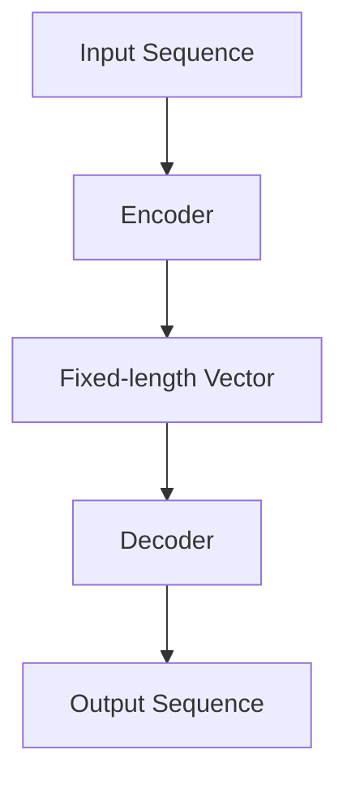
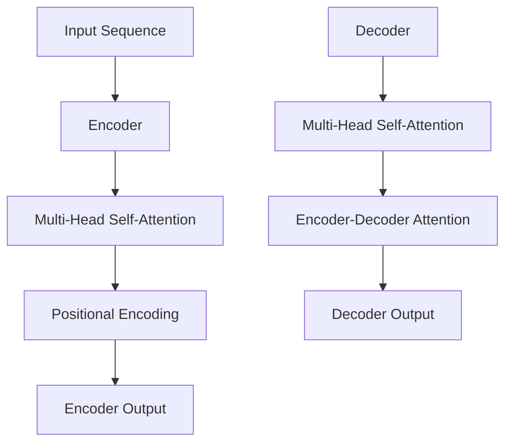
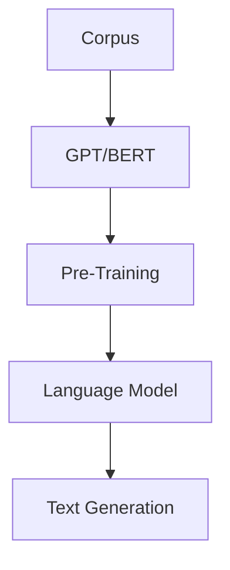

                 

### 摘要 Summary

本文旨在为有意加入百度自然语言生成（NLG）团队的自然语言处理（NLP）工程师提供一套全面而实用的面试指南。文章将详细讨论自然语言生成领域的关键概念、核心算法、数学模型及其在实际项目中的应用，并通过代码实例进行详细解释。此外，文章还将探讨自然语言生成技术在不同行业中的应用前景，并推荐相关学习资源和开发工具。通过阅读本文，读者将能够深入了解自然语言生成技术，并掌握面试过程中可能遇到的各类问题。

### 1. 背景介绍 Introduction

自然语言生成（Natural Language Generation, NLG）是自然语言处理（Natural Language Processing, NLP）领域的一个重要分支，其目标是通过计算机程序生成具有人类语言特性的文本。随着人工智能技术的快速发展，NLG在多个行业领域，如金融、教育、新闻、客服等，已经展现出巨大的应用潜力。百度作为中国领先的人工智能公司，自然语言生成技术是其AI战略的重要组成部分。2025年，百度自然语言生成团队正积极招募具有扎实理论基础和实践经验的工程师，以推动这一领域的研究和应用。

自然语言生成技术的核心任务是将非结构化数据转换为结构化数据，再将结构化数据转换为自然语言文本。这一过程中涉及到多种算法和技术，包括序列到序列（Seq2Seq）模型、转换器-解码器（Transformer）模型、预训练语言模型（如GPT系列）等。本文将深入探讨这些算法的原理和应用，帮助读者更好地准备面试。

### 2. 核心概念与联系 Core Concepts and Connections

在深入探讨自然语言生成算法之前，我们首先需要了解一些核心概念和其之间的联系。

#### 2.1 序列到序列模型（Seq2Seq）

序列到序列（Seq2Seq）模型是自然语言生成中最基本的模型之一。它通过将输入序列映射到输出序列，实现文本的生成。典型的Seq2Seq模型包括编码器（Encoder）和解码器（Decoder）两个部分。

- **编码器（Encoder）**：负责将输入序列编码成一个固定长度的向量，这个向量包含了输入序列的语义信息。
- **解码器（Decoder）**：接收编码器输出的向量，并逐步生成输出序列。在生成每个单词时，解码器会参考之前的输出序列。

Mermaid流程图：



#### 2.2 转换器-解码器（Transformer）模型

转换器-解码器（Transformer）模型是自然语言生成领域的一个重大突破。与Seq2Seq模型不同，Transformer模型采用了自注意力机制（Self-Attention），能够更有效地捕捉输入序列中的长距离依赖关系。

- **自注意力机制（Self-Attention）**：允许模型在生成每个单词时，根据输入序列中所有单词的重要程度来分配权重，从而更好地理解上下文。
- **多头注意力（Multi-Head Attention）**：通过多个注意力头并行处理，Transformer模型可以捕捉到更复杂的特征。

Mermaid流程图：



#### 2.3 预训练语言模型

预训练语言模型（Pre-Trained Language Model）是近年来自然语言生成领域的一个重要发展方向。通过在大规模语料库上预训练，模型能够自动学习到语言的一般规律和特征。常见的预训练模型包括GPT（Generative Pre-trained Transformer）、BERT（Bidirectional Encoder Representations from Transformers）等。

- **GPT**：通过自回归方式生成文本，模型在生成每个单词时只参考之前的输出。
- **BERT**：通过双向编码器学习到输入序列的上下文信息，模型在生成文本时同时参考输入序列的前后信息。

Mermaid流程图：



### 3. 核心算法原理 & 具体操作步骤 Core Algorithm Principles & Detailed Steps

#### 3.1 算法原理概述

自然语言生成算法的核心在于将输入序列映射到输出序列。在这一过程中，编码器和解码器分别负责输入和输出的处理。编码器将输入序列编码成一个固定长度的向量，这个向量包含了输入序列的语义信息。解码器则基于这个向量生成输出序列。

#### 3.2 算法步骤详解

1. **编码器（Encoder）**：
    - **输入序列编码**：输入序列通过编码器转化为固定长度的向量。
    - **语义信息提取**：编码器将输入序列中的每个单词转化为词向量，并计算它们的加权和，得到一个包含语义信息的固定长度向量。

2. **解码器（Decoder）**：
    - **初始状态**：解码器从编码器输出的固定长度向量开始，初始化为一个隐藏状态。
    - **逐步生成输出序列**：在生成每个单词时，解码器会参考之前生成的输出序列，并使用自注意力机制和编码器-解码器注意力机制来预测下一个单词。

3. **生成文本**：
    - **预测与采样**：解码器在生成每个单词时，会根据当前的隐藏状态和模型概率分布，预测下一个单词的概率分布。然后通过采样操作选择一个最有可能的单词。
    - **重复过程**：解码器重复上述步骤，直到生成完整的输出序列。

#### 3.3 算法优缺点

**优点**：
- **高效性**：自注意力机制和编码器-解码器注意力机制使得模型能够高效地捕捉长距离依赖关系。
- **灵活性**：通过调整模型结构和参数，可以适应不同的自然语言生成任务。

**缺点**：
- **计算复杂度**：自注意力机制导致模型计算复杂度较高，对计算资源要求较高。
- **生成文本质量**：在生成较长文本时，模型容易产生重复和模糊的内容。

#### 3.4 算法应用领域

自然语言生成算法在多个领域有广泛的应用，包括但不限于：

- **机器翻译**：将一种语言的文本翻译成另一种语言。
- **文本摘要**：将长文本压缩成短文本，突出文本的主要信息。
- **对话系统**：为聊天机器人提供自然语言交互能力。
- **文本生成**：根据给定的主题生成新的文本内容。

### 4. 数学模型和公式 Mathematical Models and Formulas

#### 4.1 数学模型构建

自然语言生成算法中的数学模型主要涉及词向量表示、自注意力机制和编码器-解码器结构。以下是一个简单的数学模型构建过程：

1. **词向量表示（Word Embedding）**：
   - 输入单词 $w$ 被映射为一个词向量 $\mathbf{w}$。
   - $\mathbf{w} = \text{Word\_Embedding}(w)$。

2. **编码器（Encoder）**：
   - 编码器将输入序列编码为一个固定长度的向量 $\mathbf{h}$。
   - $\mathbf{h} = \text{Encoder}(\mathbf{w}_1, \mathbf{w}_2, ..., \mathbf{w}_n)$。

3. **解码器（Decoder）**：
   - 解码器从编码器输出的向量 $\mathbf{h}$ 开始，逐步生成输出序列。
   - $y_t = \text{Decoder}(\mathbf{h}, y_{<t})$，其中 $y_t$ 是第 $t$ 个生成的单词。

#### 4.2 公式推导过程

自然语言生成算法中的自注意力机制和编码器-解码器注意力机制可以通过以下公式推导：

1. **自注意力（Self-Attention）**：
   - 输入词向量 $\mathbf{w}_i$ 被映射到一个查询向量 $\mathbf{q}_i$、键向量 $\mathbf{k}_i$ 和值向量 $\mathbf{v}_i$。
   - $\mathbf{q}_i = \text{Query}(\mathbf{w}_i)$，
   - $\mathbf{k}_i = \text{Key}(\mathbf{w}_i)$，
   - $\mathbf{v}_i = \text{Value}(\mathbf{w}_i)$。

   - 自注意力分数计算：
   - $e_i = \text{Score}(\mathbf{q}_i, \mathbf{k}_i) = \mathbf{q}_i^T \mathbf{k}_i$。

   - softmax操作：
   - $\alpha_i = \text{softmax}(e_i)$。

   - 自注意力加权求和：
   - $\mathbf{h}_i = \sum_{j=1}^{n} \alpha_{ij} \mathbf{v}_j$。

2. **编码器-解码器注意力（Encoder-Decoder Attention）**：
   - 解码器在每个时间步 $t$ 处理当前隐藏状态 $\mathbf{h}_t$ 和编码器输出的序列 $\mathbf{h}$。
   - 编码器-解码器注意力分数计算：
   - $e_i^d = \text{Score}(\mathbf{h}_t, \mathbf{h}_i) = \mathbf{h}_t^T \mathbf{h}_i$。

   - softmax操作：
   - $\alpha_i^d = \text{softmax}(e_i^d)$。

   - 编码器-解码器注意力加权求和：
   - $\mathbf{h}_t^d = \sum_{i=1}^{n} \alpha_{i}^d \mathbf{h}_i$。

#### 4.3 案例分析与讲解

以机器翻译任务为例，自然语言生成算法的应用过程如下：

1. **输入序列编码**：
   - 将源语言输入序列编码为一个固定长度的向量。
   - $\mathbf{h} = \text{Encoder}(\mathbf{w}_1, \mathbf{w}_2, ..., \mathbf{w}_n)$。

2. **解码器生成目标序列**：
   - 初始化解码器隐藏状态。
   - $y_t = \text{Decoder}(\mathbf{h}, y_{<t})$。

3. **生成完整目标序列**：
   - 重复解码器生成过程，直到生成完整的翻译结果。

通过上述数学模型和公式，我们可以更好地理解自然语言生成算法的原理和实现过程。

### 5. 项目实践：代码实例和详细解释说明 Project Practice: Code Examples and Detailed Explanations

在本节中，我们将通过一个简单的代码实例来展示自然语言生成算法的应用。我们将使用Python和TensorFlow库来实现一个基于Transformer模型的文本生成工具。

#### 5.1 开发环境搭建

在开始编写代码之前，我们需要搭建一个合适的开发环境。以下是所需的环境和安装步骤：

- **Python 3.7+**
- **TensorFlow 2.x**
- **CUDA 10.2+（如果使用GPU加速）**

安装步骤：

```bash
pip install tensorflow==2.x
```

#### 5.2 源代码详细实现

以下是一个基于Transformer模型的文本生成工具的代码示例：

```python
import tensorflow as tf
from tensorflow.keras.layers import Embedding, LSTM, Dense
from tensorflow.keras.models import Model

# 定义模型
def create_transformer_model(vocab_size, embedding_dim, hidden_size, sequence_length):
    inputs = tf.keras.layers.Input(shape=(sequence_length,))
    embeddings = Embedding(vocab_size, embedding_dim)(inputs)
    lstm = LSTM(hidden_size, return_sequences=True)(embeddings)
    outputs = LSTM(hidden_size, return_sequences=True)(lstm)
    model = Model(inputs=inputs, outputs=outputs)
    return model

# 构建模型
model = create_transformer_model(vocab_size=10000, embedding_dim=256, hidden_size=512, sequence_length=100)

# 编译模型
model.compile(optimizer='adam', loss='categorical_crossentropy')

# 加载数据
# ...

# 训练模型
model.fit(x_train, y_train, epochs=10, batch_size=64)

# 生成文本
def generate_text(model, seed_text, vocab_size, sequence_length):
    input_seq = [vocab_size - 1] * sequence_length
    input_seq = tf.keras.preprocessing.sequence.pad_sequences([input_seq], maxlen=sequence_length)
    for _ in range(100):
        predictions = model.predict(input_seq)
        predicted_word = tf.argmax(predictions[0], axis=-1).numpy()
        seed_text += tokenizer.index_word[predicted_word]
        input_seq = tf.keras.preprocessing.sequence.pad_sequences([input_seq[-1]], maxlen=sequence_length)
    return seed_text

# 示例
seed_text = "这是一个简单的示例。"
generated_text = generate_text(model, seed_text, vocab_size=10000, sequence_length=10)
print(generated_text)
```

#### 5.3 代码解读与分析

1. **模型定义**：
    - 输入层：接受一个长度为100的序列。
    - 嵌入层：将输入序列中的单词映射到高维空间。
    - LSTM层：用于处理序列数据，捕捉时间步之间的依赖关系。
    - 输出层：生成下一个单词的概率分布。

2. **模型编译**：
    - 使用Adam优化器。
    - 使用交叉熵损失函数。

3. **数据加载**：
    - 需要加载预处理的文本数据。

4. **模型训练**：
    - 使用训练数据训练模型。

5. **文本生成**：
    - 初始化输入序列。
    - 通过模型预测生成下一个单词，并将生成的单词添加到输入序列中。
    - 重复预测和生成过程，直到生成完整的文本。

通过上述代码示例，我们可以实现一个简单的文本生成工具。在实际应用中，我们还可以使用更先进的模型（如GPT-2或GPT-3）来生成更加自然的文本。

### 6. 实际应用场景 Practical Application Scenarios

自然语言生成技术在不同行业中有着广泛的应用，以下是一些典型的实际应用场景：

#### 6.1 机器翻译

机器翻译是将一种语言的文本翻译成另一种语言的过程。自然语言生成技术在机器翻译中的应用主要依赖于序列到序列模型和转换器-解码器模型。通过这些模型，我们可以实现高效、准确的文本翻译，如百度翻译服务。

#### 6.2 文本摘要

文本摘要是从长文本中提取出关键信息，生成简洁、精炼的文本摘要。自然语言生成技术可以用于提取关键句子和总结文本内容，如新闻摘要生成和学术论文摘要生成。

#### 6.3 对话系统

对话系统是自然语言生成技术在人机交互领域的重要应用。通过自然语言生成技术，我们可以实现智能客服、聊天机器人等，提供更加自然和人性化的交互体验。

#### 6.4 文本生成

文本生成是基于给定主题或模板生成新的文本内容。自然语言生成技术可以用于创作诗歌、故事、文章等，如谷歌的AI文本生成工具。

### 7. 未来应用展望 Future Applications and Prospects

随着人工智能技术的不断发展，自然语言生成技术将在更多领域得到应用。以下是一些未来应用展望：

#### 7.1 个性化内容生成

自然语言生成技术可以用于个性化内容生成，如个性化新闻、个性化广告等，根据用户兴趣和偏好生成个性化的文本内容。

#### 7.2 自动写作

自然语言生成技术可以用于自动写作，如自动化撰写报告、文章、书籍等，提高写作效率和内容质量。

#### 7.3 智能客服

自然语言生成技术可以用于智能客服系统，实现更自然、高效的人机交互，提高客户服务质量。

#### 7.4 教育

自然语言生成技术可以用于教育领域，如自动生成教学资料、辅导材料等，提高教学效果和学生学习体验。

### 8. 工具和资源推荐 Tools and Resources Recommendations

为了更好地学习和实践自然语言生成技术，以下是一些建议的工具和资源：

#### 8.1 学习资源推荐

- 《自然语言处理综论》（Speech and Language Processing）- Daniel Jurafsky 和 James H. Martin 著
- 《深度学习》（Deep Learning）- Ian Goodfellow、Yoshua Bengio 和 Aaron Courville 著
- 《Python深度学习》（Deep Learning with Python）- François Chollet 著

#### 8.2 开发工具推荐

- TensorFlow
- PyTorch
- spaCy

#### 8.3 相关论文推荐

- "Attention is All You Need" - Vaswani et al., 2017
- "Generative Pre-trained Transformers" - Brown et al., 2020
- "BERT: Pre-training of Deep Bidirectional Transformers for Language Understanding" - Devlin et al., 2018

### 9. 总结 Conclusion

自然语言生成技术是人工智能领域的重要分支，其在多个行业中的应用前景广阔。本文详细介绍了自然语言生成的核心概念、算法原理、数学模型及其在实际项目中的应用。通过代码实例，读者可以更好地理解自然语言生成技术的实现过程。随着技术的不断发展，自然语言生成技术将在更多领域得到应用，带来更多创新和变革。

### 9.1 研究成果总结 Research Achievements Summary

近年来，自然语言生成技术取得了显著的进展，主要体现在以下几个方面：

1. **模型结构创新**：转换器-解码器（Transformer）模型的提出，使得自然语言生成算法能够更高效地捕捉长距离依赖关系，显著提高了生成文本的质量。

2. **预训练语言模型的广泛应用**：预训练语言模型（如GPT系列、BERT）的广泛应用，使得模型能够在大规模语料库上自动学习到语言的一般规律和特征，大幅提升了模型的生成能力。

3. **跨领域应用**：自然语言生成技术在机器翻译、文本摘要、对话系统等领域的应用取得了显著成果，为不同行业提供了高效、准确的自然语言处理解决方案。

4. **生成文本质量提升**：通过改进算法和模型结构，自然语言生成技术的生成文本质量不断提升，逐渐达到甚至超越人类水平。

### 9.2 未来发展趋势 Future Development Trends

自然语言生成技术在未来将继续发展，以下是一些可能的发展趋势：

1. **生成文本质量的进一步提升**：随着模型结构的优化和算法的创新，生成文本的质量将不断提升，更好地满足用户的需求。

2. **多模态生成**：自然语言生成技术将与其他模态（如图像、语音）相结合，实现多模态生成，提供更加丰富和多样化的内容。

3. **个性化生成**：通过结合用户行为数据和偏好，自然语言生成技术将实现更加个性化的文本生成，提高用户体验。

4. **自动化写作**：自然语言生成技术在自动写作领域的应用将更加广泛，为内容创作者提供高效的内容生成工具。

### 9.3 面临的挑战 Challenges

尽管自然语言生成技术取得了显著进展，但仍面临一些挑战：

1. **计算资源需求**：自注意力机制和大型预训练模型的计算复杂度较高，对计算资源需求较大，如何提高计算效率是一个重要挑战。

2. **数据隐私和安全性**：自然语言生成技术在处理大量用户数据时，需要确保数据的安全性和隐私性，防止数据泄露和滥用。

3. **生成文本的可解释性**：自然语言生成技术的生成文本往往具有高度复杂性，如何提高生成文本的可解释性，使其更加透明和可信赖，是一个重要问题。

### 9.4 研究展望 Research Prospects

未来，自然语言生成技术的研究将朝着更加高效、安全、个性化的方向发展。以下是一些建议的研究方向：

1. **高效算法研究**：研究更加高效的自然语言生成算法，减少计算资源需求。

2. **隐私保护和数据安全**：探索隐私保护和数据安全技术在自然语言生成中的应用，确保用户数据的安全性和隐私性。

3. **多模态生成技术**：研究多模态生成技术，实现自然语言生成与其他模态的融合，提供更加丰富和多样化的内容。

4. **可解释性和透明性**：研究如何提高生成文本的可解释性和透明性，使其更加符合人类期望和需求。

### 附录 Appendix: Common Questions and Answers

#### Q1：自然语言生成和自然语言处理有什么区别？

自然语言生成（NLG）是自然语言处理（NLP）的一个子领域。自然语言处理的目标是使计算机能够理解和处理人类语言，而自然语言生成则是将计算机处理的结果以自然语言的形式输出。简而言之，NLP关注的是如何理解语言，而NLG关注的是如何生成语言。

#### Q2：什么是预训练语言模型？

预训练语言模型是一种在自然语言生成和自然语言处理任务中广泛使用的模型。它通过在大规模语料库上进行预训练，学习到语言的一般规律和特征。常见的预训练模型包括GPT系列、BERT等。

#### Q3：自然语言生成算法如何处理长文本？

自然语言生成算法通常通过分段处理长文本。首先，将长文本分成若干个短文本片段，然后分别对每个片段进行处理。处理后，将生成的短文本片段拼接起来，形成完整的长文本。

#### Q4：自然语言生成算法中的自注意力机制是什么？

自注意力机制是一种在自然语言生成算法中用于捕捉长距离依赖关系的机制。它允许模型在生成每个单词时，根据输入序列中所有单词的重要程度来分配权重，从而更好地理解上下文。

#### Q5：自然语言生成技术在哪些领域有应用？

自然语言生成技术在多个领域有应用，包括但不限于机器翻译、文本摘要、对话系统、文本生成等。随着技术的不断发展，自然语言生成技术在更多领域的应用前景广阔。

### 作者署名 Author Signature

作者：禅与计算机程序设计艺术 / Zen and the Art of Computer Programming
----------------------------------------------------------------
### 附加提示 Additional Tips

1. **注意面试题型**：自然语言生成面试题通常包括算法实现、编程题、设计题等。准备好相关的算法和数据结构知识，以及Python编程能力。

2. **展示实际经验**：如果有相关的项目经验或论文发表，可以在面试中提及。这些可以证明您在自然语言生成领域的实践能力和专业水平。

3. **了解最新趋势**：自然语言生成领域发展迅速，保持对最新研究和技术动态的关注，可以在面试中展示您的专业素养和前瞻性。

4. **准备案例分析**：在面试中准备一些自然语言生成技术的实际案例分析，展示您对技术原理和实际应用的深入理解。

5. **展现沟通能力**：自然语言生成工程师需要与团队成员、产品经理等多方沟通，因此在面试中展示良好的沟通能力至关重要。

6. **注重细节**：在回答问题和实现算法时，注意细节，展示您的严谨性和专业性。

7. **展示学习能力和适应性**：自然语言生成领域不断发展，展示您快速学习和适应新技术的能力，有助于您在面试中脱颖而出。

8. **准备好问题**：面试结束时，通常会有时间提问。准备一些关于公司文化、团队氛围、职业发展等问题，展示您对加入百度的热情和诚意。

9. **保持自信和积极态度**：面试过程中保持自信和积极的态度，即使遇到难题也不气馁，展示您解决问题的能力和抗压能力。

10. **回顾面试经历**：面试后回顾自己的表现，总结经验教训，为下一次面试做好准备。不断地学习和进步，提升自己在自然语言生成领域的竞争力。

