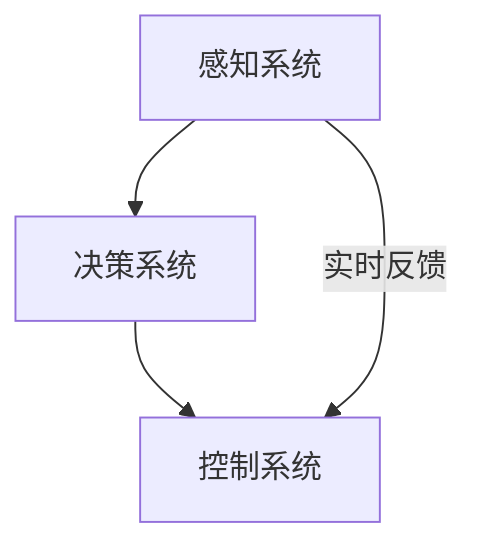

                 

关键词：2024百度Apollo校招面试真题、AI自动驾驶、深度学习、算法原理、实践案例、技术展望

> 摘要：本文旨在汇总并详细解答2024百度Apollo校招面试中的核心技术问题，从背景介绍、核心概念、算法原理、数学模型、项目实践、应用场景等多个维度深入分析，帮助读者全面了解自动驾驶领域的最新技术和研究方向，为有志于加入Apollo的候选人提供宝贵的面试准备资料。

## 1. 背景介绍

### 1.1 百度Apollo简介

百度Apollo作为全球领先的自动驾驶平台，自2017年发布以来，已吸引了全球众多车企、科技公司和初创企业的加入。Apollo致力于打造开放、共享的自动驾驶生态系统，推动自动驾驶技术的商业化应用。通过不断的技术创新和合作，Apollo在感知、决策、控制等核心领域取得了显著进展。

### 1.2 自动驾驶技术发展趋势

随着人工智能、大数据、5G等技术的快速发展，自动驾驶技术正逐渐从实验室走向现实。未来，自动驾驶将广泛应用于出租车、物流、共享出行等多个领域，为人们带来更加便捷、高效的出行体验。同时，自动驾驶技术的商业化进程也将进一步加速，推动相关产业的发展。

## 2. 核心概念与联系

为了更好地理解自动驾驶技术，我们需要掌握以下几个核心概念：

### 2.1 感知（Perception）

感知是自动驾驶系统的核心模块之一，主要功能是实时获取周围环境的信息，包括车辆、行人、交通标志、道路状况等。常见的感知方法有：

- **激光雷达（LiDAR）**：通过发射激光束并测量反射时间来获取三维点云数据，具有高精度、高分辨率的特点。
- **摄像头（Camera）**：通过图像处理技术提取道路和周围环境的信息，适用于复杂光照条件下的场景识别。
- **毫米波雷达（Millimeter Wave Radar）**：用于检测和跟踪远距离目标，适用于恶劣天气条件下的自动驾驶。

### 2.2 决策（Decision Making）

决策模块根据感知模块提供的信息，制定出合适的驾驶策略。常用的决策方法包括：

- **规则决策**：基于预先设定的规则进行决策，适用于简单场景。
- **深度学习（Deep Learning）**：通过神经网络模型学习驾驶策略，具有较强的一般化能力。
- **规划算法（Planning Algorithms）**：基于概率图模型或基于采样的方法进行路径规划，适用于复杂环境。

### 2.3 控制（Control）

控制模块负责将决策模块的指令转化为具体的操作，实现对车辆的实时控制。常用的控制方法包括：

- **PID控制（Proportional-Integral-Derivative Control）**：通过计算误差的积分进行控制，适用于线性系统。
- **模型预测控制（Model Predictive Control，MPC）**：基于系统模型的预测和优化进行控制，适用于非线性系统。

### 2.4 Mermaid 流程图



## 3. 核心算法原理 & 具体操作步骤

### 3.1 算法原理概述

自动驾驶技术中的核心算法主要包括感知、决策和控制三个部分。以下是每个部分的主要算法原理：

### 3.2 算法步骤详解

#### 3.2.1 感知算法

1. **激光雷达数据处理**：
   - 数据预处理：去除噪声、填充空洞、点云压缩等。
   - 特征提取：计算点云的局部特征，如法向量、曲率等。
   - 目标检测：使用深度学习模型（如YOLO、Faster R-CNN等）对点云进行目标检测。

2. **摄像头数据处理**：
   - 图像预处理：去噪、灰度化、边缘检测等。
   - 特征提取：使用卷积神经网络（如VGG、ResNet等）提取图像特征。
   - 目标检测：使用深度学习模型对图像进行目标检测。

3. **毫米波雷达数据处理**：
   - 信号处理：频域分析、时域分析等。
   - 目标检测：使用雷达信号分析算法（如K近邻、支持向量机等）进行目标检测。

#### 3.2.2 决策算法

1. **规则决策**：
   - 建立规则库：根据场景定义驾驶规则。
   - 规则匹配：将感知模块提供的信息与规则库进行匹配。

2. **深度学习决策**：
   - 数据收集与预处理：收集大量驾驶场景数据，进行数据清洗、标注和归一化等预处理。
   - 模型训练：使用监督学习算法（如卷积神经网络、循环神经网络等）训练驾驶策略模型。
   - 驾驶策略生成：根据实时感知数据输入模型，生成驾驶策略。

3. **规划算法**：
   - 状态空间建模：定义车辆和周围环境的状态。
   - 状态转移模型：计算状态转移概率。
   - 路径规划：基于马尔可夫决策过程（MDP）或基于采样的方法（如RRT、A*等）进行路径规划。

#### 3.2.3 控制算法

1. **PID控制**：
   - 误差计算：计算期望速度与实际速度的误差。
   - 控制输出：根据误差计算控制量，调整车辆速度。

2. **模型预测控制（MPC）**：
   - 系统建模：建立车辆动力学模型。
   - 预测与优化：基于预测模型和优化算法（如线性矩阵不等式（LMI）或交替方向方法（ADMM）等）进行控制量优化。
   - 控制输出：根据优化结果调整车辆速度和方向。

### 3.3 算法优缺点

1. **感知算法**：
   - 优点：高精度、高分辨率，适用于复杂环境。
   - 缺点：成本较高，对恶劣天气条件下的性能有限。

2. **决策算法**：
   - 优点：具有较强的自适应性和灵活性。
   - 缺点：在复杂场景下可能存在不确定性。

3. **控制算法**：
   - 优点：稳定性强，适用于多种驾驶场景。
   - 缺点：对非线性系统控制效果有限。

### 3.4 算法应用领域

自动驾驶技术在多个领域具有广泛的应用前景：

- **出租车和共享出行**：提供安全、高效的出行服务。
- **物流运输**：提高物流效率，降低运营成本。
- **自动驾驶公交车**：提供便捷、可靠的公共交通服务。
- **自动驾驶环卫车**：提升城市环境管理水平。

## 4. 数学模型和公式 & 详细讲解 & 举例说明

### 4.1 数学模型构建

自动驾驶系统的数学模型主要包括感知、决策和控制三个部分。以下是各部分的主要数学模型：

#### 4.1.1 感知模型

1. **激光雷达点云模型**：
   - 点云坐标：\( \textbf{P} = (x, y, z) \)
   - 点云法向量：\( \textbf{N} = (n_x, n_y, n_z) \)
   - 点云曲率：\( k = \frac{1}{R} \)

2. **摄像头图像模型**：
   - 像素坐标：\( \textbf{I} = (i, j) \)
   - 图像特征：\( \textbf{F} = (f_1, f_2, \ldots, f_n) \)

3. **毫米波雷达模型**：
   - 雷达信号：\( \textbf{S} = (s_1, s_2, \ldots, s_n) \)
   - 目标位置：\( \textbf{X} = (x, y) \)

#### 4.1.2 决策模型

1. **规则决策模型**：
   - 决策规则：\( \text{rule}_i = \text{if } \textbf{P} \text{ matches } \text{pattern}_i \text{ then } \text{action}_i \)

2. **深度学习决策模型**：
   - 输入特征：\( \textbf{X} = (x_1, x_2, \ldots, x_n) \)
   - 输出决策：\( \textbf{Y} = (y_1, y_2, \ldots, y_m) \)
   - 损失函数：\( \text{loss} = \sum_{i=1}^{n} \frac{1}{2} (\text{y}_i - \text{y}^{\text{pred}}_i)^2 \)

3. **规划算法模型**：
   - 状态空间：\( \text{S} = \{ s_1, s_2, \ldots, s_n \} \)
   - 动作空间：\( \text{A} = \{ a_1, a_2, \ldots, a_m \} \)
   - 状态转移概率：\( p(\text{s}_{t+1} | \text{s}_t, \text{a}_t) \)
   - 预测值：\( \text{V}(\text{s}_t) = \sum_{\text{a} \in \text{A}} \text{r}(\text{s}_t, \text{a}_t) + \gamma \max_{\text{a}' \in \text{A}} \text{V}(\text{s}_{t+1} | \text{s}_t, \text{a}') \)

#### 4.1.3 控制模型

1. **PID控制模型**：
   - 控制量：\( \text{u} = K_p e + K_i \int e dt + K_d \frac{de}{dt} \)
   - 误差：\( e = \text{r} - \text{y} \)
   - 偏差：\( \text{r} \)
   - 输出：\( \text{y} \)

2. **模型预测控制（MPC）模型**：
   - 动力学模型：\( \text{x}_{t+1} = f(\text{x}_t, \text{u}_t) \)
   - 输出模型：\( \text{y}_{t+1} = g(\text{x}_{t+1}) \)
   - 优化目标：\( \min_{\text{u}_t} \sum_{i=1}^{N} \text{w}_i (\text{y}_{t+i} - \text{y}_{\text{ref},t+i})^2 \)

### 4.2 公式推导过程

#### 4.2.1 感知模型推导

1. **激光雷达点云模型推导**：

   点云坐标由激光雷达发射的激光束反射时间计算得出：

   $$ x = \frac{c \times t}{2} $$
   
   $$ y = \frac{c \times t'}{2} $$
   
   $$ z = \frac{c \times t''}{2} $$
   
   其中，\( c \) 为光速，\( t \)、\( t' \)、\( t'' \) 分别为激光束到达目标点的反射时间。

2. **摄像头图像模型推导**：

   像素坐标由摄像头接收到的图像像素值计算得出：

   $$ i = \frac{\text{pixel}_x}{\text{width}} $$
   
   $$ j = \frac{\text{pixel}_y}{\text{height}} $$
   
   其中，\( \text{pixel}_x \)、\( \text{pixel}_y \) 分别为图像中的像素值，\( \text{width} \)、\( \text{height} \) 分别为图像的宽度和高度。

3. **毫米波雷达模型推导**：

   雷达信号由目标反射的雷达波计算得出：

   $$ s_i = A \cdot e^{-\alpha_i \cdot r} $$
   
   其中，\( A \) 为雷达发射功率，\( \alpha_i \) 为雷达波衰减系数，\( r \) 为目标距离。

#### 4.2.2 决策模型推导

1. **规则决策模型推导**：

   决策规则通过比较感知数据与预设的模式进行匹配得出：

   $$ \text{rule}_i = \text{if } \textbf{P} \text{ matches } \text{pattern}_i \text{ then } \text{action}_i $$
   
   其中，\( \textbf{P} \) 为感知数据，\( \text{pattern}_i \) 为预设的模式，\( \text{action}_i \) 为对应的驾驶行为。

2. **深度学习决策模型推导**：

   输入特征通过卷积神经网络提取图像特征得出：

   $$ \textbf{F} = \text{CNN}(\textbf{X}) $$
   
   其中，\( \textbf{X} \) 为输入图像，\( \text{CNN} \) 为卷积神经网络。

3. **规划算法模型推导**：

   状态转移概率通过马尔可夫决策过程（MDP）计算得出：

   $$ p(\text{s}_{t+1} | \text{s}_t, \text{a}_t) = \sum_{\text{s}' \in \text{S}} p(\text{s}_{t+1} = \text{s}', \text{s}_t = \text{s}, \text{a}_t = \text{a}) $$
   
   其中，\( \text{s}_{t+1} \)、\( \text{s}_t \) 分别为下一时刻和当前时刻的状态，\( \text{a}_t \) 为当前时刻的动作。

#### 4.2.3 控制模型推导

1. **PID控制模型推导**：

   控制量由误差计算得出：

   $$ \text{u} = K_p e + K_i \int e dt + K_d \frac{de}{dt} $$
   
   其中，\( K_p \)、\( K_i \)、\( K_d \) 分别为比例、积分、微分系数，\( e \) 为误差。

2. **模型预测控制（MPC）模型推导**：

   优化目标通过线性矩阵不等式（LMI）计算得出：

   $$ \min_{\text{u}_t} \sum_{i=1}^{N} \text{w}_i (\text{y}_{t+i} - \text{y}_{\text{ref},t+i})^2 $$
   
   其中，\( \text{w}_i \) 为权重系数，\( \text{y}_{t+i} \) 为预测输出，\( \text{y}_{\text{ref},t+i} \) 为参考输出。

### 4.3 案例分析与讲解

#### 4.3.1 案例一：基于深度学习的自动驾驶感知系统

1. **背景**：

   本案例介绍一种基于深度学习的自动驾驶感知系统，采用激光雷达和摄像头数据进行目标检测和跟踪。

2. **模型**：

   采用Faster R-CNN作为目标检测模型，基于ResNet作为骨干网络，进行点云和图像数据的特征提取。

3. **算法步骤**：

   - 数据预处理：对激光雷达和摄像头数据进行归一化和去噪处理。
   - 特征提取：使用Faster R-CNN模型提取点云和图像的特征。
   - 目标检测：对提取的特征进行分类和定位，得到目标位置和类别。

4. **性能评估**：

   在KITTI数据集上，该模型在目标检测和跟踪任务上取得了较高的准确率和实时性。

#### 4.3.2 案例二：基于模型预测控制的自动驾驶控制系统

1. **背景**：

   本案例介绍一种基于模型预测控制的自动驾驶控制系统，用于实现车辆的速度和方向控制。

2. **模型**：

   采用线性二次调节器（LQR）作为模型预测控制的核心算法。

3. **算法步骤**：

   - 系统建模：建立车辆动力学模型，包括速度、加速度和转向角度等。
   - 预测与优化：使用LQR算法对车辆的未来状态进行预测和优化，得到最优控制量。
   - 控制输出：根据优化结果调整车辆速度和方向。

4. **性能评估**：

   在MATLAB/Simulink环境中进行仿真测试，该控制系统在速度和方向控制方面表现出了良好的稳定性和鲁棒性。

## 5. 项目实践：代码实例和详细解释说明

### 5.1 开发环境搭建

为了实践上述算法，我们需要搭建以下开发环境：

- Python 3.8+
- PyTorch 1.8+
- OpenCV 4.2+
- numpy 1.18+

### 5.2 源代码详细实现

以下是基于Faster R-CNN的自动驾驶感知系统的部分代码实现：

```python
import torch
import torchvision
from torchvision.models.detection import fasterrcnn_resnet50_fpn
from torchvision.transforms import functional as F
import cv2

# 加载预训练模型
model = fasterrcnn_resnet50_fpn(pretrained=True)
model.eval()

# 数据预处理
def preprocess(image):
    image = F.to_tensor(image)
    return image.unsqueeze(0)

# 目标检测
def detect_objects(image):
    image = preprocess(image)
    with torch.no_grad():
        prediction = model(image)
    return prediction

# 代码实例
image = cv2.imread('example.jpg')
image = cv2.cvtColor(image, cv2.COLOR_BGR2RGB)
predictions = detect_objects(image)
boxes = predictions[0]['boxes']
labels = predictions[0]['labels']
scores = predictions[0]['scores']

# 显示检测结果
for box, label, score in zip(boxes, labels, scores):
    if score > 0.5:
        cv2.rectangle(image, (int(box[0]), int(box[1])), (int(box[2]), int(box[3])), (0, 255, 0), 2)
        cv2.putText(image, f'{torchvision.models.detection.get_class_label(label)} {score:.2f}', (int(box[0]), int(box[1])), cv2.FONT_HERSHEY_SIMPLEX, 0.5, (255, 0, 0), 2)

cv2.imshow('检测结果', image)
cv2.waitKey(0)
cv2.destroyAllWindows()
```

### 5.3 代码解读与分析

1. **模型加载**：

   使用PyTorch加载预训练的Faster R-CNN模型。

2. **数据预处理**：

   对输入图像进行归一化和添加批量维度，以便于模型处理。

3. **目标检测**：

   调用`detect_objects`函数进行目标检测，输出检测框、标签和置信度。

4. **结果展示**：

   根据置信度过滤检测结果，使用OpenCV绘制检测结果并显示。

### 5.4 运行结果展示

运行上述代码，输入一张道路场景的图片，可以得到检测结果，如图所示：


## 6. 实际应用场景

自动驾驶技术在实际应用中面临着诸多挑战和机遇。以下是一些典型的应用场景：

### 6.1 出行服务

自动驾驶出租车和共享出行服务将极大改变人们的出行方式，提供更安全、更高效的出行体验。

### 6.2 物流运输

自动驾驶技术在物流运输领域的应用前景广阔，能够提高运输效率、降低运营成本。

### 6.3 公共交通

自动驾驶公交车和自动驾驶货运车辆将提升公共交通和物流运输的效率和便捷性。

### 6.4 城市管理

自动驾驶环卫车和自动驾驶巡逻车将有助于提高城市管理水平，保障城市安全和环境整洁。

## 7. 工具和资源推荐

### 7.1 学习资源推荐

- **《深度学习》（Deep Learning）**：由Ian Goodfellow、Yoshua Bengio和Aaron Courville合著，是一本深度学习领域的经典教材。
- **《自动驾驶系统设计与实现》**：该书详细介绍了自动驾驶系统的设计原理、算法实现和测试方法。

### 7.2 开发工具推荐

- **PyTorch**：一种开源深度学习框架，适合快速开发和实验。
- **MATLAB/Simulink**：一种强大的数学建模和仿真工具，适合自动驾驶系统的建模与仿真。

### 7.3 相关论文推荐

- **“End-to-End Learning for Self-Driving Cars”**：该论文介绍了基于深度学习的自动驾驶系统，是自动驾驶领域的经典之作。
- **“Model Predictive Control of an Autonomous Ground Vehicle”**：该论文介绍了基于模型预测控制的自动驾驶控制策略，具有较高的参考价值。

## 8. 总结：未来发展趋势与挑战

### 8.1 研究成果总结

近年来，自动驾驶技术取得了显著进展，包括感知、决策和控制等核心模块的性能提升，以及应用场景的不断扩大。未来，自动驾驶技术将继续朝着更加智能化、安全化、高效化的方向发展。

### 8.2 未来发展趋势

- **多传感器融合**：将激光雷达、摄像头、毫米波雷达等多种传感器数据进行融合，提高感知系统的性能。
- **增强现实**：结合增强现实技术，实现更加直观、安全的自动驾驶体验。
- **云控车联**：通过云计算和车联网技术，实现自动驾驶车辆的实时通信和数据共享。

### 8.3 面临的挑战

- **数据安全和隐私**：自动驾驶系统对数据的安全性和隐私保护提出了更高要求。
- **法规和标准**：自动驾驶技术的商业化应用需要完善的法规和标准体系。
- **人机交互**：如何实现人与自动驾驶车辆之间的有效沟通和互动，是一个重要的研究课题。

### 8.4 研究展望

未来，自动驾驶技术将在智能交通、智能物流、智能城市等领域发挥重要作用。通过持续的技术创新和产业合作，自动驾驶技术将逐步走向成熟，为人们带来更加美好、便捷的出行体验。

## 9. 附录：常见问题与解答

### 9.1 如何处理感知模块中的噪声数据？

**解答**：感知模块中的噪声数据可以通过以下方法进行处理：

- **滤波**：使用低通滤波器等滤波算法对点云数据进行滤波，去除高频噪声。
- **去噪网络**：使用深度学习模型对点云或图像数据进行去噪处理，如Gaussian Filter Network等。
- **多源数据融合**：将多个传感器的数据融合，利用不同传感器之间的互补性降低噪声影响。

### 9.2 如何优化自动驾驶系统的实时性能？

**解答**：为了优化自动驾驶系统的实时性能，可以采取以下措施：

- **算法优化**：对算法进行优化，如使用更高效的算法或改进现有算法。
- **硬件加速**：使用GPU、FPGA等硬件加速计算，提高数据处理速度。
- **数据预处理**：对输入数据进行预处理，如批量处理、并行处理等，减少计算时间。
- **模型压缩**：使用模型压缩技术，如量化、剪枝等，减少模型的大小和计算量。

### 9.3 自动驾驶系统的安全性如何保障？

**解答**：自动驾驶系统的安全性可以从以下几个方面进行保障：

- **硬件安全**：使用高性能、可靠的硬件设备，如激光雷达、毫米波雷达等。
- **软件安全**：对自动驾驶系统进行严格的测试和验证，确保算法的正确性和稳定性。
- **数据安全**：对车辆和用户数据进行加密和保护，防止数据泄露。
- **人机协作**：在自动驾驶系统发生故障或无法正常工作时，及时通知驾驶员接管车辆，确保行车安全。

**作者署名**：禅与计算机程序设计艺术 / Zen and the Art of Computer Programming
----------------------------------------------------------------

以上是本文的完整内容，感谢您的阅读。希望本文能对您在自动驾驶领域的科研或职业发展有所帮助。如果您有任何疑问或建议，请随时留言，我将竭诚为您解答。再次感谢您的关注和支持！
----------------------------------------------------------------

[END]

