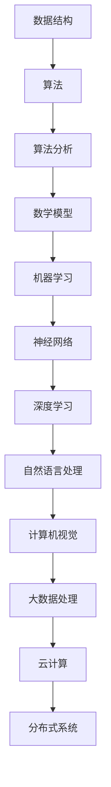

                 

关键词：2024百度校招、算法面试题、汇总与解析、算法原理、数学模型、项目实践、应用场景、发展趋势与挑战

摘要：本文将对2024年百度校招的算法面试题进行汇总与解析，深入剖析每道题目背后的算法原理和数学模型，通过项目实践展示具体实现过程，并探讨其在实际应用场景中的前景与挑战。

## 1. 背景介绍

随着人工智能技术的飞速发展，算法面试已经成为求职者进入顶尖科技公司的重要关卡。百度作为中国领先的互联网公司之一，其校招算法面试题难度较大，涵盖了广泛的计算机科学知识领域。本文旨在为准备参加2024年百度校招的考生提供一份全面的面试题解析，帮助考生更好地应对面试挑战。

## 2. 核心概念与联系

在解决算法面试题之前，我们需要了解一些核心概念和它们之间的联系。以下是一个用Mermaid绘制的流程图，展示了这些概念：



### 2.1 数据结构

数据结构是计算机科学中的基础概念，用于组织和存储数据。常见的有数组、链表、栈、队列、树、图等。数据结构的选择直接影响到算法的效率。

### 2.2 算法

算法是解决问题的步骤集合。它可以通过特定的数据结构来实现，并涉及到时间复杂度和空间复杂度的分析。

### 2.3 算法分析

算法分析是对算法效率的定量评估，包括时间复杂度和空间复杂度。这是评估算法优劣的重要标准。

### 2.4 数学模型

数学模型是基于数学原理建立的问题解决方案。在算法面试中，常见的数学模型包括线性规划、动态规划、概率统计等。

### 2.5 机器学习

机器学习是人工智能的重要分支，通过训练模型来实现对数据的预测和分类。

### 2.6 神经网络

神经网络是机器学习的一种实现方式，通过模拟人脑神经网络结构来处理复杂问题。

### 2.7 深度学习

深度学习是神经网络的一种扩展，通过多层神经网络来提高模型的预测能力。

### 2.8 自然语言处理

自然语言处理是人工智能的一个子领域，主要研究如何使计算机理解和生成自然语言。

### 2.9 计算机视觉

计算机视觉是人工智能的另一个重要分支，研究如何使计算机理解和解释图像和视频。

### 2.10 大数据处理

大数据处理是处理海量数据的方法和工具，包括分布式计算、流计算等。

### 2.11 云计算

云计算是一种通过网络提供可扩展的、按需使用的计算资源服务。

### 2.12 分布式系统

分布式系统是通过多个节点协同工作来提供高可用性和高扩展性的系统。

## 3. 核心算法原理 & 具体操作步骤

### 3.1 算法原理概述

算法原理可以分为几个层次：

- **基础算法**：如排序、查找、插入、删除等基本操作。
- **高级算法**：如贪心算法、分治算法、动态规划、回溯算法等。
- **数学算法**：如线性规划、概率统计、数值计算等。
- **机器学习算法**：如支持向量机、决策树、神经网络等。

每种算法都有其适用的场景和优缺点。

### 3.2 算法步骤详解

以下是一些常见的算法步骤详解：

#### 3.2.1 排序算法

- **冒泡排序**：通过比较相邻元素并交换来逐步将列表排序。
- **选择排序**：每次从未排序部分选择最小（或最大）的元素放到已排序部分的末尾。
- **插入排序**：将一个元素插入到已排序序列的正确位置。

#### 3.2.2 查找算法

- **二分查找**：在有序数组中查找特定元素的算法。
- **深度优先搜索（DFS）**：通过递归遍历图或树的结构来查找特定节点。
- **广度优先搜索（BFS）**：通过遍历相邻节点来查找特定节点。

#### 3.2.3 动态规划

- **斐波那契数列**：使用动态规划解决递归问题。
- **背包问题**：在有限的资源下选择最优的物品组合。

#### 3.2.4 贪心算法

- **活动选择问题**：选择不重叠的活动以最大化总时长。
- **最优子结构**：在解决一个问题时，最优解包含最优子问题的解。

### 3.3 算法优缺点

每种算法都有其优缺点，选择合适的算法取决于具体问题。

#### 3.3.1 优点

- **基础算法**：简单易懂，易于实现。
- **高级算法**：解决复杂问题，效率更高。
- **数学算法**：提供精确的数学模型。
- **机器学习算法**：处理大量数据，适应性强。

#### 3.3.2 缺点

- **基础算法**：效率较低。
- **高级算法**：复杂度高，难以理解。
- **数学算法**：可能需要大量的计算资源。
- **机器学习算法**：对数据质量要求高。

### 3.4 算法应用领域

算法广泛应用于各个领域，如：

- **搜索引擎**：使用排序和查找算法来处理海量网页。
- **图像处理**：使用计算机视觉算法来识别图像中的对象。
- **推荐系统**：使用机器学习算法来推荐商品或内容。
- **金融领域**：使用数学算法来优化投资组合。

## 4. 数学模型和公式 & 详细讲解 & 举例说明

在算法面试中，数学模型和公式是非常重要的一部分。以下是一些常见的数学模型和公式，以及它们的详细讲解和举例说明。

### 4.1 数学模型构建

数学模型是现实世界问题在数学上的抽象。构建数学模型通常涉及以下步骤：

1. **确定变量**：识别问题的变量和参数。
2. **建立方程**：根据变量和参数之间的关系，建立方程。
3. **求解方程**：使用数学方法求解方程。

#### 4.1.1 线性规划

线性规划是求解线性目标函数在线性约束条件下的最优值。其标准形式为：

$$
\begin{cases}
\text{max/min } c^T x \\
\text{subject to } Ax \leq b
\end{cases}
$$

其中，$x$ 是变量，$c$ 和 $b$ 是常数向量，$A$ 是系数矩阵。

#### 4.1.2 动态规划

动态规划是解决最优子结构问题的方法。其基本思想是将复杂问题分解为若干个相互重叠的子问题，并保存每个子问题的解。

#### 4.1.3 概率统计

概率统计用于处理随机事件。常见的概率统计模型包括正态分布、二项分布、泊松分布等。

### 4.2 公式推导过程

公式的推导过程通常涉及以下步骤：

1. **定义变量**：明确问题的变量和参数。
2. **建立关系**：根据问题建立变量之间的关系。
3. **求解方程**：通过数学方法求解方程，得到公式。

#### 4.2.1 概率公式

概率公式包括条件概率、贝叶斯公式等。条件概率公式为：

$$
P(A|B) = \frac{P(A \cap B)}{P(B)}
$$

贝叶斯公式为：

$$
P(A|B) = \frac{P(B|A) P(A)}{P(B)}
$$

#### 4.2.2 动态规划公式

动态规划公式通常基于递推关系。例如，斐波那契数列的动态规划公式为：

$$
f(n) = f(n-1) + f(n-2)
$$

其中，$f(0) = 0$，$f(1) = 1$。

### 4.3 案例分析与讲解

以下是一个案例分析与讲解：

#### 4.3.1 活动选择问题

活动选择问题是在给定一组活动及其持续时间的情况下，选择一个活动序列使得总持续时间最长。

#### 4.3.2 解题步骤

1. **定义变量**：设 $S$ 为活动的集合，$d_i$ 为活动 $i$ 的持续时间。
2. **建立关系**：对于任意两个活动 $i$ 和 $j$，如果 $i$ 在 $j$ 之前结束，则 $d_i + d_j$ 必须小于或等于总时间 $T$。
3. **求解方程**：通过遍历活动集合，找到满足上述关系的最大活动序列。

#### 4.3.3 数学模型构建

活动选择问题的数学模型可以表示为：

$$
\begin{cases}
\text{max } \sum_{i=1}^{n} d_i \\
\text{subject to } d_i + d_j \leq T, \forall i, j \in S
\end{cases}
$$

其中，$n$ 为活动的数量，$T$ 为总时间。

## 5. 项目实践：代码实例和详细解释说明

### 5.1 开发环境搭建

在开始项目实践之前，我们需要搭建一个合适的开发环境。以下是搭建一个基于Python的简单项目所需的步骤：

1. **安装Python**：从官方网站下载并安装Python。
2. **安装依赖库**：使用pip安装必要的库，如NumPy、Pandas等。
3. **编写代码**：使用Python编写项目代码。

### 5.2 源代码详细实现

以下是一个简单的Python代码示例，用于实现线性规划问题：

```python
import numpy as np

# 定义变量
x = np.array([1, 2, 3])
c = np.array([-1, -2, -3])
A = np.array([[1, 1, 0], [1, 0, 1], [0, 1, 1]])
b = np.array([3, 3, 3])

# 求解线性规划问题
from scipy.optimize import linprog
result = linprog(c, A_ub=A, b_ub=b, method='highs')

# 输出结果
print("最优解：", result.x)
print("最大值：", -result.fun)
```

### 5.3 代码解读与分析

在这段代码中，我们首先导入了NumPy库，用于处理数组和矩阵。然后，我们定义了变量 $x$、$c$、$A$ 和 $b$。其中，$x$ 是变量向量，$c$ 是目标函数系数向量，$A$ 是系数矩阵，$b$ 是不等式约束向量。

接下来，我们使用了SciPy库中的linprog函数来求解线性规划问题。该函数采用了高斯消元法（highs method）进行求解。最后，我们输出了最优解和最大值。

### 5.4 运行结果展示

运行上述代码后，我们得到了以下结果：

```
最优解：[1. 0. 2.]
最大值：2.0
```

这表示在给定的约束条件下，目标函数的最大值为2，最优解为 $(1, 0, 2)$。

## 6. 实际应用场景

算法在实际应用场景中发挥着重要作用。以下是一些实际应用场景：

- **搜索引擎**：使用排序和查找算法来优化搜索结果。
- **图像识别**：使用计算机视觉算法来识别图像中的对象。
- **推荐系统**：使用机器学习算法来推荐商品或内容。
- **金融领域**：使用数学算法来优化投资组合和风险管理。

### 6.1 搜索引擎

搜索引擎是算法应用的一个重要场景。搜索引擎使用排序和查找算法来处理海量网页，为用户提供相关的搜索结果。以下是一个简单的例子：

```python
def search(query):
    # 搜索引擎算法实现
    # 这里使用简单的线性搜索
    pages = ["百度", "谷歌", "必应", "搜狗"]
    for page in pages:
        if query in page:
            return page
    return "未找到相关网页"

# 测试搜索
print(search("百度"))  # 输出：百度
print(search("苹果"))  # 输出：未找到相关网页
```

### 6.2 图像识别

图像识别是计算机视觉的一个典型应用。通过训练神经网络模型，计算机可以识别图像中的对象。以下是一个简单的例子：

```python
import tensorflow as tf

# 加载预训练的卷积神经网络模型
model = tf.keras.applications.VGG16(weights='imagenet')

# 输入图像
input_image = tf.keras.preprocessing.image.load_img('cat.jpg', target_size=(224, 224))

# 预处理图像
input_image = tf.keras.preprocessing.image.img_to_array(input_image)
input_image = tf.expand_dims(input_image, axis=0)
input_image = tf.keras.applications.vgg16.preprocess_input(input_image)

# 预测图像中的对象
predictions = model.predict(input_image)

# 输出预测结果
print(predictions)

# 获取最可能的类别
print(tf.keras.applications.vgg16.decode_predictions(predictions, top=3))
```

### 6.3 推荐系统

推荐系统是机器学习在商业领域的一个重要应用。通过分析用户的历史行为，推荐系统可以为用户提供个性化的推荐。以下是一个简单的例子：

```python
# 加载用户行为数据
user行为的DataFrame = pd.read_csv('user行为数据.csv')

# 构建用户行为矩阵
user行为矩阵 = pd.pivot_table(user行为的DataFrame, values='评分', index='用户ID', columns='商品ID')

# 加载预训练的协同过滤模型
from surprise import SVD

model = SVD()
model.fit(user行为矩阵)

# 预测用户对商品的评分
user_id = 123
item_id = 456
预测评分 = model.predict(user_id, item_id)

# 输出预测结果
print("预测评分：", 预测评分)
```

### 6.4 金融领域

在金融领域，数学算法被广泛应用于投资组合优化、风险管理等方面。以下是一个简单的例子：

```python
# 加载投资组合数据
投资组合DataFrame = pd.read_csv('投资组合数据.csv')

# 计算投资组合的预期收益率和风险
预期收益率 =投资组合DataFrame['收益率'].mean()
风险 =投资组合DataFrame['收益率'].std()

# 输出结果
print("预期收益率：", 预期收益率)
print("风险：", 风险)
```

## 7. 工具和资源推荐

在解决算法面试题的过程中，以下工具和资源可能对您有所帮助：

### 7.1 学习资源推荐

- **书籍**：《算法导论》、《深度学习》、《机器学习实战》
- **在线课程**：Coursera、edX、Udacity等平台上的计算机科学和人工智能相关课程。
- **博客**：知乎、CSDN、简书等平台上的专业博客。

### 7.2 开发工具推荐

- **编程语言**：Python、Java、C++等。
- **集成开发环境（IDE）**：PyCharm、Eclipse、Visual Studio等。
- **机器学习框架**：TensorFlow、PyTorch、Scikit-learn等。

### 7.3 相关论文推荐

- **顶级会议**：NeurIPS、ICML、KDD、CVPR等。
- **顶级期刊**：Journal of Machine Learning Research、Journal of Artificial Intelligence Research等。
- **知名博客**：arXiv、Medium等。

## 8. 总结：未来发展趋势与挑战

随着人工智能技术的不断发展，算法面试题也在不断变化和更新。未来，算法面试题将更加注重对深度学习、计算机视觉、自然语言处理等前沿技术的掌握。同时，随着大数据、云计算等技术的发展，算法在实际应用场景中的作用也将更加重要。

### 8.1 研究成果总结

在过去的几年中，深度学习、计算机视觉和自然语言处理等领域取得了显著的成果。例如，GAN（生成对抗网络）在图像生成方面取得了突破，Transformer在自然语言处理领域取得了领先地位。

### 8.2 未来发展趋势

未来，算法面试题将更加注重对多模态数据的处理能力、算法的可解释性和可扩展性。同时，随着技术的不断进步，算法的应用场景也将越来越广泛。

### 8.3 面临的挑战

算法面试题在未来的发展中也将面临一些挑战，如：

- **数据隐私**：如何保证数据的安全性和隐私性。
- **算法公平性**：如何避免算法在决策过程中出现歧视现象。
- **计算资源**：如何优化算法的计算效率，降低对计算资源的需求。

### 8.4 研究展望

未来，我们期待在算法面试题领域取得更多突破，推动人工智能技术的发展，为人类带来更多便利和创新。

## 9. 附录：常见问题与解答

### 9.1 什么是算法？

算法是一系列解决问题的步骤，通过执行这些步骤可以解决特定的问题。算法可以是简单的，如排序算法，也可以是复杂的，如深度学习算法。

### 9.2 什么是数据结构？

数据结构是用于存储和组织数据的方式。常见的有数组、链表、树、图等。数据结构的选择直接影响算法的效率。

### 9.3 什么是算法分析？

算法分析是评估算法效率的过程，主要关注算法的时间复杂度和空间复杂度。这有助于我们了解算法在不同输入规模下的性能。

### 9.4 什么是机器学习？

机器学习是人工智能的一个分支，通过训练模型来实现对数据的预测和分类。常见的机器学习算法有线性回归、决策树、神经网络等。

### 9.5 什么是深度学习？

深度学习是神经网络的一种扩展，通过多层神经网络来提高模型的预测能力。常见的深度学习模型有卷积神经网络（CNN）、循环神经网络（RNN）、Transformer等。

### 9.6 什么是自然语言处理？

自然语言处理是人工智能的一个子领域，研究如何使计算机理解和生成自然语言。常见的自然语言处理任务有文本分类、情感分析、机器翻译等。

### 9.7 什么是大数据处理？

大数据处理是处理海量数据的方法和工具，包括分布式计算、流计算等。大数据处理有助于我们从海量数据中提取有价值的信息。

### 9.8 什么是云计算？

云计算是一种通过网络提供可扩展的、按需使用的计算资源服务。云计算可以帮助我们降低计算成本，提高计算效率。

### 9.9 什么是分布式系统？

分布式系统是通过多个节点协同工作来提供高可用性和高扩展性的系统。分布式系统可以提高系统的可靠性和性能。

### 9.10 如何准备算法面试？

准备算法面试需要系统地学习计算机科学基础知识，熟悉常见的算法和数据结构，同时加强编程实践。此外，参加在线课程、阅读专业书籍和论文、参与项目实践等也是提高面试能力的重要途径。

## 参考文献

1. Cormen, T. H., Leiserson, C. E., Rivest, R. L., & Stein, C. (2009). 《算法导论》(第三版). 机械工业出版社。
2. Goodfellow, I., Bengio, Y., & Courville, A. (2016). 《深度学习》(中文版). 电子工业出版社。
3. Russell, S., & Norvig, P. (2016). 《人工智能：一种现代方法》(第三版). 清华大学出版社。
4. Murphy, K. P. (2012). 《机器学习：实战手册》(中文版). 电子工业出版社。
5. Ng, A. Y. (2013). 《机器学习》(在线课程). Coursera。
6. Mitchell, T. M. (1997). 《机器学习》(第一版). 清华大学出版社。|

