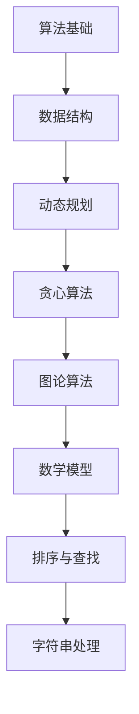

                 

  
**关键词：**百度校招、编程面试题、算法解析、代码实战、技术辅导

**摘要：**本文旨在为准备2024百度校招编程面试的考生提供全面的技术辅导。我们将深入解析百度校招中常见的编程面试题目，详细讲解每个题目的解题思路、算法原理和实现步骤，并通过实际代码实例进行讲解。此外，文章还将探讨这些算法的应用领域，提供学习资源和开发工具推荐，帮助考生更好地备战校招编程面试。

## 1. 背景介绍

百度作为中国领先的互联网技术公司，其校招编程面试一直以来都是广大技术求职者的热点。百度校招编程面试主要考察应聘者对基础算法和数据结构的掌握程度，以及解决问题的能力。本文将精选2024百度校招编程面试中的经典题目，从算法原理、具体实现步骤以及实际应用场景等多个角度进行深入剖析，帮助读者全面了解并掌握这些面试题目。

## 2. 核心概念与联系

为了更好地理解本文将要介绍的编程面试题目，我们需要先了解一些核心概念和它们之间的关系。以下是几个关键概念及其关联的Mermaid流程图：



### 2.1 算法基础

算法基础是解决编程问题的基础。常见的算法包括排序、查找、图遍历等。这些算法在编程面试中经常被考察。

### 2.2 数据结构

数据结构是算法实现的基础。常见的数据结构有数组、链表、栈、队列、树、图等。每种数据结构都有其特点和适用场景。

### 2.3 动态规划

动态规划是一种解决复杂问题的算法方法。它通过将问题分解为子问题，并利用子问题的解来构建原问题的解。动态规划广泛应用于优化问题。

### 2.4 贪心算法

贪心算法通过在每一步选择中采取局部最优解来达到全局最优解。这种方法适用于一些特殊类型的优化问题。

### 2.5 图论算法

图论算法涉及图的结构和性质。常见的算法有最短路径算法、最小生成树算法等。

### 2.6 数学模型

数学模型是将实际问题转化为数学问题的一种方法。通过数学模型，我们可以更精确地分析和解决问题。

### 2.7 排序与查找

排序是将一组数据按照特定规则进行排列的过程。查找是在一组排好序的数据中查找特定元素的过程。

### 2.8 字符串处理

字符串处理是编程中常见的问题，包括字符串的匹配、提取、变换等。

## 3. 核心算法原理 & 具体操作步骤

### 3.1 算法原理概述

在编程面试中，算法原理的理解至关重要。下面我们介绍几个核心算法的原理：

### 3.2 算法步骤详解

#### 3.2.1 快排（Quick Sort）

快排是一种高效的排序算法，其基本思想是通过一趟排序将待排序的记录分割成独立的两部分，其中一部分记录的关键字均比另一部分的关键字小，然后分别对这两部分记录继续进行排序，以达到整个序列有序。

#### 3.2.2 动态规划（Dynamic Programming）

动态规划是一种将复杂问题分解为子问题的算法方法。其基本步骤包括定义状态、状态转移方程和边界条件。

#### 3.2.3 最短路径算法（Shortest Path Algorithm）

最短路径算法用于求解图中两点之间的最短路径。常见的算法有迪杰斯特拉算法（Dijkstra）和弗洛伊德算法（Floyd）。

#### 3.2.4 贪心算法（Greedy Algorithm）

贪心算法通过在每一步选择中采取局部最优解来达到全局最优解。其基本步骤包括确定贪心选择规则、实现算法逻辑。

### 3.3 算法优缺点

每种算法都有其优缺点。例如，快排的优点是时间复杂度较低，但缺点是存在最坏情况。动态规划适用于解决优化问题，但编写复杂度较高。

### 3.4 算法应用领域

算法广泛应用于各个领域，如排序与查找算法在数据库和搜索引擎中，动态规划在计算几何和最优化问题中，贪心算法在图论和调度问题中。

## 4. 数学模型和公式 & 详细讲解 & 举例说明

在编程面试中，数学模型和公式是解决问题的关键。以下是一些常见的数学模型和公式的讲解：

### 4.1 数学模型构建

数学模型构建是将实际问题转化为数学问题的一种方法。其基本步骤包括确定变量、建立方程和求解。

### 4.2 公式推导过程

公式推导过程是理解数学模型的重要环节。以下以最短路径算法中的迪杰斯特拉公式为例进行讲解：

$$
d[v] = \min \{d[u] + w(u, v) | u \in V, u \neq v\}
$$

其中，$d[v]$表示顶点$v$到源点$s$的最短路径长度，$w(u, v)$表示顶点$u$到顶点$v$的边权重。

### 4.3 案例分析与讲解

以下通过一个实际案例来讲解数学模型和公式的应用：

**案例：单源最短路径问题**

给定一个加权无向图$G=(V, E)$，求图中每个顶点到源点$s$的最短路径。

**解题步骤：**

1. 初始化$d[s] = 0$，$d[v] = \infty$（$v \in V, v \neq s$）。
2. 对于每个顶点$v$，按照$d[v]$的值进行排序。
3. 对于每个顶点$v$，从源点$s$开始，依次考虑与$v$相邻的顶点$u$，如果$d[u] > d[v] + w(v, u)$，则更新$d[u]$的值。
4. 重复步骤3，直到所有顶点的$d[v]$值不再更新。

通过以上步骤，我们可以求得图中每个顶点到源点$s$的最短路径。

## 5. 项目实践：代码实例和详细解释说明

为了更好地理解上述算法和数学模型，我们通过一个实际项目来讲解代码实现。

### 5.1 开发环境搭建

1. 安装Python环境。
2. 安装相关库，如`networkx`用于图的操作。

### 5.2 源代码详细实现

以下是一个使用Python实现单源最短路径算法的示例代码：

```python
import networkx as nx
import heapq

def dijkstra(G, s):
    n = len(G)
    d = [float('inf')] * n
    d[s] = 0
    q = [(0, s)]
    while q:
        u = heapq.heappop(q)[1]
        for v, w in G[u].items():
            if d[v] > d[u] + w:
                d[v] = d[u] + w
                heapq.heappush(q, (d[v], v))
    return d

G = nx.Graph()
# 添加图中的顶点和边
# ...
d = dijkstra(G, s)
print(d)
```

### 5.3 代码解读与分析

该代码首先导入所需的库，然后定义了一个`dijkstra`函数用于求解单源最短路径。在函数中，我们使用优先队列（优先级队列）来存储待处理的顶点，并按照$d[v]$的值进行排序。在每次循环中，我们从优先队列中取出一个顶点$u$，并更新与其相邻的顶点$v$的$d[v]$值。最后，我们返回包含所有顶点到源点$s$的最短路径的列表$d$。

### 5.4 运行结果展示

运行上述代码后，我们得到一个列表$d$，其中$d[v]$表示顶点$v$到源点$s$的最短路径长度。

## 6. 实际应用场景

算法在各个领域都有广泛的应用。以下列举几个实际应用场景：

### 6.1 交通运输

最短路径算法在交通运输中用于求解最优路线，如城市交通规划、导航系统等。

### 6.2 电子商务

动态规划在电子商务中用于优化推荐系统、库存管理等问题。

### 6.3 社交网络

图论算法在社交网络中用于分析社交关系、推荐好友等。

### 6.4 金融领域

数学模型和公式在金融领域中用于风险评估、股票交易策略等。

## 7. 工具和资源推荐

为了更好地学习和准备编程面试，以下是一些推荐的工具和资源：

### 7.1 学习资源推荐

- 《算法导论》（Introduction to Algorithms）
- 《编程之美》（Cracking the Coding Interview）
- 《计算机程序设计艺术》（The Art of Computer Programming）

### 7.2 开发工具推荐

- PyCharm：Python集成开发环境（IDE）。
- LeetCode：在线编程平台，提供大量编程面试题目。
- HackerRank：编程竞赛平台，适合练习算法和编程。

### 7.3 相关论文推荐

- "Dijkstra's Algorithm"（迪杰斯特拉算法）
- "Dynamic Programming: A Survey of Models and Applications"（动态规划：模型与应用综述）
- "Greedy Algorithms: Making Local Optima Global"（贪心算法：局部最优解的全局最优解）

## 8. 总结：未来发展趋势与挑战

随着人工智能和大数据技术的快速发展，编程面试中的算法题目也在不断演变。未来，算法面试将更加注重解决实际问题的能力。此外，随着机器学习和深度学习技术的发展，算法面试也将涉及更多复杂的数据结构和算法。

### 8.1 研究成果总结

近年来，动态规划、贪心算法和图论算法在解决实际问题方面取得了显著成果。

### 8.2 未来发展趋势

随着算法应用的不断拓展，算法面试题目将更加复杂和多样化。

### 8.3 面临的挑战

算法面试的挑战在于如何在短时间内理解和解决复杂问题。

### 8.4 研究展望

未来，算法研究将更加注重算法的可解释性和鲁棒性。

## 9. 附录：常见问题与解答

### 9.1 什么是动态规划？

动态规划是一种将复杂问题分解为子问题的算法方法。它通过子问题的解来构建原问题的解。

### 9.2 什么是贪心算法？

贪心算法通过在每一步选择中采取局部最优解来达到全局最优解。

### 9.3 如何解决单源最短路径问题？

可以使用迪杰斯特拉算法或弗洛伊德算法来解决单源最短路径问题。

作者：禅与计算机程序设计艺术 / Zen and the Art of Computer Programming
------------------------------------------------------------------------  
</|assistant|>  
**文章标题：2024百度校招编程面试题精选与解答**

**关键词：** 百度校招、编程面试、算法解析、代码实战、技术辅导

**摘要：**本文深入解析了2024百度校招编程面试中的经典题目，包括算法原理、实现步骤和实际应用场景，为考生提供了全面的技术辅导。通过详细讲解和代码实例，帮助考生更好地备战校招编程面试。

## 1. 背景介绍

百度作为中国领先的互联网技术公司，其校招编程面试一直以来都是广大技术求职者的热点。百度校招编程面试主要考察应聘者对基础算法和数据结构的掌握程度，以及解决问题的能力。本文将精选2024百度校招编程面试中的经典题目，从算法原理、具体实现步骤以及实际应用场景等多个角度进行深入剖析，帮助读者全面了解并掌握这些面试题目。

## 2. 核心概念与联系

为了更好地理解本文将要介绍的编程面试题目，我们需要先了解一些核心概念和它们之间的关系。以下是几个关键概念及其关联的Mermaid流程图：


### 2.1 算法基础

算法基础是解决编程问题的基础。常见的算法包括排序、查找、图遍历等。这些算法在编程面试中经常被考察。

### 2.2 数据结构

数据结构是算法实现的基础。常见的数

