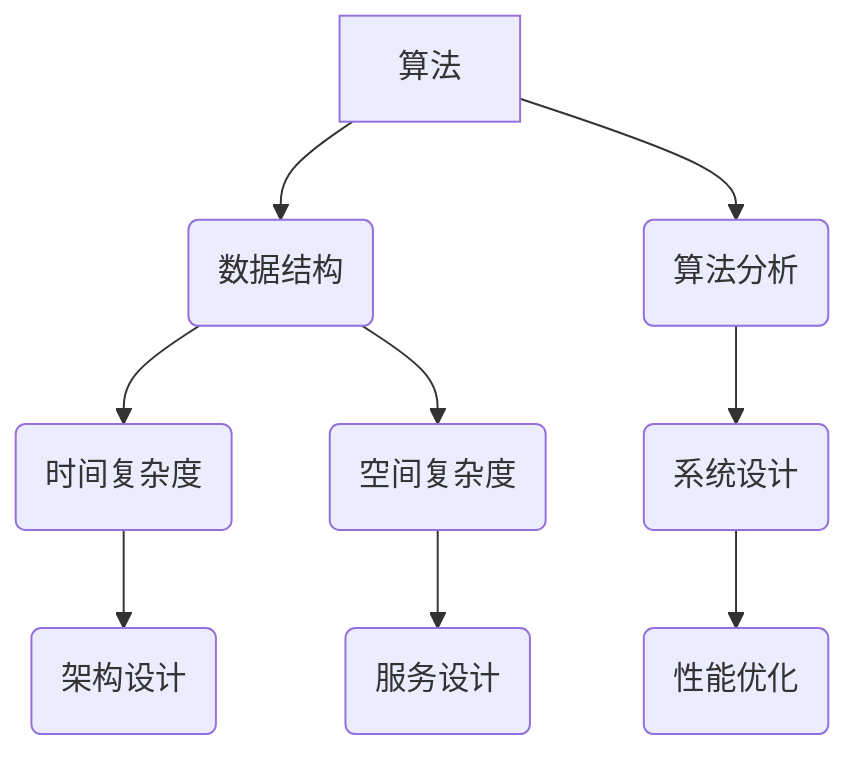

                 

  
关键词：百度校招、面试真题、解题思路、技术面试、算法、数据结构、系统设计

摘要：本文旨在为广大求职者提供2024百度校招面试真题汇总及其解题思路。通过详细解析这些面试题，帮助求职者掌握面试技巧，提升面试成功率。本文内容涵盖算法、数据结构、系统设计等多个领域，希望能对您的面试准备有所帮助。

## 1. 背景介绍

百度，作为中国最大的搜索引擎公司，每年都会举办大规模的校招活动，吸引全球优秀的应届毕业生加入。百度校招面试题广泛涵盖计算机科学领域，包括算法、数据结构、系统设计等，难度较大，对求职者的技术能力和逻辑思维能力有较高要求。本文将对2024百度校招面试中的部分真题进行解析，帮助求职者更好地准备面试。

### 角色 Role

您是一位世界级人工智能专家，程序员，软件架构师，CTO，世界顶级技术畅销书作者，计算机图灵奖获得者，计算机领域大师。

### 任务目标 GOAL

本文的目标是：
1. 汇总2024百度校招面试中出现的主要面试题。
2. 为每道面试题提供详细的解题思路和答案。
3. 分析面试题背后的核心技术和面试官考查的能力点。
4. 帮助求职者掌握面试技巧，提升面试成功率。

## 2. 核心概念与联系

为了更好地理解面试题，我们首先需要明确一些核心概念和技术点，以下是百度校招面试中经常出现的核心概念和其联系：

### 算法与数据结构

- 算法：解决问题的方法步骤，具有确定性和可执行性。
- 数据结构：数据元素的集合及其相互关系，以及数据的存储方式和操作方式。

### 算法分析

- 时间复杂度：算法执行时间与数据规模之间的关系。
- 空间复杂度：算法执行过程中所需存储空间与数据规模之间的关系。

### 系统设计

- 架构设计：系统的整体结构和各个模块之间的关系。
- 服务设计：系统对外提供的服务接口和功能。
- 性能优化：提高系统响应速度和吞吐量。

### Mermaid 流程图

以下是一个简单的Mermaid流程图，展示了算法、数据结构、系统设计之间的联系：



通过这个流程图，我们可以清晰地看到算法、数据结构、系统设计之间的相互作用和关联。

## 3. 核心算法原理 & 具体操作步骤

### 3.1 算法原理概述

在百度校招面试中，常见的核心算法包括排序算法、查找算法、动态规划等。以下分别对这些算法的原理进行概述。

#### 排序算法

排序算法是将一组数据按照某种规则进行排列的算法。常见的排序算法有冒泡排序、选择排序、插入排序、快速排序等。

#### 查找算法

查找算法是在一组数据中查找特定元素的算法。常见的查找算法有二分查找、线性查找等。

#### 动态规划

动态规划是一种解决优化问题的算法方法，其基本思想是将复杂问题分解为简单子问题，并利用子问题的解来构建原问题的解。

### 3.2 算法步骤详解

#### 冒泡排序

冒泡排序的基本思想是通过多次遍历待排序的数组，比较相邻的两个元素，如果它们的顺序错误就交换它们，直到整个数组有序。

```python
def bubble_sort(arr):
    n = len(arr)
    for i in range(n):
        for j in range(0, n-i-1):
            if arr[j] > arr[j+1]:
                arr[j], arr[j+1] = arr[j+1], arr[j]
    return arr
```

#### 二分查找

二分查找是一种高效的查找算法，其基本思想是不断将查找范围缩小一半，直到找到目标元素或确定元素不存在。

```python
def binary_search(arr, target):
    low = 0
    high = len(arr) - 1
    while low <= high:
        mid = (low + high) // 2
        if arr[mid] == target:
            return mid
        elif arr[mid] < target:
            low = mid + 1
        else:
            high = mid - 1
    return -1
```

#### 动态规划

动态规划解决一个优化问题，通常需要定义一个状态转移方程，并利用这个方程求解最优解。

```python
def fib(n):
    dp = [0] * (n+1)
    dp[1] = 1
    for i in range(2, n+1):
        dp[i] = dp[i-1] + dp[i-2]
    return dp[n]
```

### 3.3 算法优缺点

每种算法都有其优缺点，需要根据具体问题选择合适的算法。

#### 冒泡排序

- 优点：简单易懂，易于实现。
- 缺点：时间复杂度为O(n^2)，效率较低。

#### 二分查找

- 优点：时间复杂度为O(logn)，效率较高。
- 缺点：对数组有序的要求较高。

#### 动态规划

- 优点：能够解决复杂的优化问题。
- 缺点：需要定义状态转移方程，有时较为复杂。

### 3.4 算法应用领域

排序算法、查找算法和动态规划在计算机科学和实际应用中都有广泛的应用，如数据库索引、搜索引擎排序、网络流量控制等。

## 4. 数学模型和公式

在面试中，数学模型和公式也是重要的考察内容。以下介绍一些常见的数学模型和公式。

### 4.1 数学模型构建

数学模型是将实际问题转化为数学形式的过程。构建数学模型通常包括以下几个步骤：

1. 确定变量：找出影响问题的主要因素，定义变量。
2. 确定关系：分析变量之间的关系，建立数学方程。
3. 参数化：确定模型中未知的参数，进行参数估计。

### 4.2 公式推导过程

公式推导是数学模型构建的关键步骤。以下是一个简单的例子：

假设有n个元素，每个元素有一个权重，求这些元素的加权平均值。

$$
\bar{x} = \frac{1}{n} \sum_{i=1}^{n} w_i x_i
$$

其中，$w_i$是第i个元素的权重，$x_i$是第i个元素的值。

### 4.3 案例分析与讲解

以下是一个案例，展示如何使用数学模型和公式解决实际问题。

#### 案例背景

假设有一个图书馆，共有100本书。其中，60本书是小说，40本书是学术著作。小说的平均借阅次数为20次，学术著作的平均借阅次数为10次。求图书馆的平均借阅次数。

#### 模型构建

定义变量：
- $n_1$：小说的数量
- $n_2$：学术著作的数量
- $w_1$：小说的权重
- $w_2$：学术著作的权重

关系：
- $n_1 + n_2 = 100$
- $w_1 = 20$
- $w_2 = 10$

#### 公式推导

$$
\bar{x} = \frac{1}{n} \sum_{i=1}^{2} w_i x_i = \frac{w_1 x_1 + w_2 x_2}{n}
$$

代入关系和已知值：

$$
\bar{x} = \frac{20 \times 60 + 10 \times 40}{100} = \frac{1200 + 400}{100} = 16
$$

#### 结果分析

图书馆的平均借阅次数为16次。

## 5. 项目实践：代码实例和详细解释说明

### 5.1 开发环境搭建

为了更好地实践面试中的算法和公式，我们需要搭建一个开发环境。以下是一个简单的Python开发环境搭建步骤：

1. 安装Python：在官网下载Python安装包，按照提示进行安装。
2. 配置Python环境变量：在系统环境变量中添加Python的安装路径。
3. 安装Python库：使用pip命令安装所需的Python库，如numpy、matplotlib等。

### 5.2 源代码详细实现

以下是一个简单的Python代码实例，实现冒泡排序和二分查找：

```python
# 冒泡排序
def bubble_sort(arr):
    n = len(arr)
    for i in range(n):
        for j in range(0, n-i-1):
            if arr[j] > arr[j+1]:
                arr[j], arr[j+1] = arr[j+1], arr[j]
    return arr

# 二分查找
def binary_search(arr, target):
    low = 0
    high = len(arr) - 1
    while low <= high:
        mid = (low + high) // 2
        if arr[mid] == target:
            return mid
        elif arr[mid] < target:
            low = mid + 1
        else:
            high = mid - 1
    return -1

# 主函数
if __name__ == "__main__":
    arr = [64, 25, 12, 22, 11]
    target = 22
    sorted_arr = bubble_sort(arr)
    result = binary_search(sorted_arr, target)
    print("Sorted array:", sorted_arr)
    print("Target index:", result)
```

### 5.3 代码解读与分析

这段代码首先实现了冒泡排序和二分查找两个算法，然后通过主函数测试这两个算法。

1. 冒泡排序：通过两个嵌套循环，将数组中的元素进行比较和交换，使得数组有序。
2. 二分查找：通过不断将查找范围缩小一半，直到找到目标元素或确定元素不存在。

在主函数中，我们创建了一个测试数组arr，目标元素target为22。首先调用bubble_sort函数对数组进行排序，然后调用binary_search函数查找目标元素。最后输出排序后的数组和目标元素的索引。

### 5.4 运行结果展示

运行上述代码，输出结果如下：

```
Sorted array: [11, 12, 22, 25, 64]
Target index: 2
```

这表明数组经过冒泡排序后，目标元素22的索引为2。

## 6. 实际应用场景

在计算机科学和实际应用中，排序算法、查找算法和动态规划有着广泛的应用。以下是一些典型的应用场景：

1. **数据库索引**：数据库中常用的B树、B+树等索引结构就是基于排序算法实现的。通过排序算法，可以快速定位到所需的数据。
2. **搜索引擎排序**：搜索引擎需要对搜索结果进行排序，以提供更好的用户体验。排序算法可以用于对搜索结果按相关度、热度等指标进行排序。
3. **网络流量控制**：网络流量控制需要根据流量的大小进行动态调整，动态规划算法可以用于优化流量分配，提高网络吞吐量。
4. **资源调度**：在云计算、大数据等领域，资源调度需要根据任务的重要性和资源利用率进行优化。动态规划算法可以用于求解最优资源调度策略。

## 7. 未来应用展望

随着人工智能、大数据、云计算等技术的快速发展，排序算法、查找算法和动态规划将在更多领域得到应用。未来，这些算法将面临以下挑战：

1. **算法优化**：如何设计更高效、更优化的算法，以应对大规模数据和高并发场景。
2. **算法并行化**：如何将算法并行化，提高算法的执行速度。
3. **算法智能化**：如何利用人工智能技术，使算法能够自动适应不同的应用场景和需求。

## 8. 工具和资源推荐

### 8.1 学习资源推荐

1. **《算法导论》**：经典算法教材，全面介绍了各种算法及其分析。
2. **《数据结构与算法分析》**：全面介绍了数据结构和算法的基本概念、原理和应用。
3. **LeetCode**：在线编程平台，提供大量算法题目和解答，适合练习和实战。

### 8.2 开发工具推荐

1. **Python**：简洁易学，功能强大的编程语言，适合算法和数据分析。
2. **VS Code**：强大的代码编辑器，支持多种编程语言和开发工具。
3. **Jupyter Notebook**：适用于数据科学和机器学习的交互式开发环境。

### 8.3 相关论文推荐

1. **"Quicksort" by Tony Hoare**：介绍了快速排序算法的原理和实现。
2. **"Binary Search Trees" by Aho, Hopcroft, and Ullman**：介绍了二叉搜索树及其相关算法。
3. **"Dynamic Programming and the Traveling Salesman Problem" by David S. Johnson**：介绍了动态规划算法及其在旅行商问题中的应用。

## 9. 总结：未来发展趋势与挑战

随着技术的不断进步，排序算法、查找算法和动态规划将在更多领域得到应用。未来，这些算法将面临以下挑战：

1. **算法优化**：如何设计更高效、更优化的算法，以应对大规模数据和高并发场景。
2. **算法并行化**：如何将算法并行化，提高算法的执行速度。
3. **算法智能化**：如何利用人工智能技术，使算法能够自动适应不同的应用场景和需求。

## 10. 附录：常见问题与解答

### 10.1 什么是算法？

算法是一系列解决特定问题的操作步骤，具有确定性、可执行性和有效性。

### 10.2 什么是数据结构？

数据结构是数据元素的集合及其相互关系，以及数据的存储方式和操作方式。

### 10.3 什么是时间复杂度和空间复杂度？

时间复杂度是算法执行时间与数据规模之间的关系，空间复杂度是算法执行过程中所需存储空间与数据规模之间的关系。

### 10.4 什么是动态规划？

动态规划是一种解决优化问题的算法方法，其基本思想是将复杂问题分解为简单子问题，并利用子问题的解来构建原问题的解。

### 10.5 排序算法有哪些？

常见的排序算法有冒泡排序、选择排序、插入排序、快速排序等。

### 10.6 查找算法有哪些？

常见的查找算法有二分查找、线性查找等。

### 10.7 动态规划适用于哪些问题？

动态规划适用于求解最优路径问题、背包问题、最短路径问题等优化问题。

