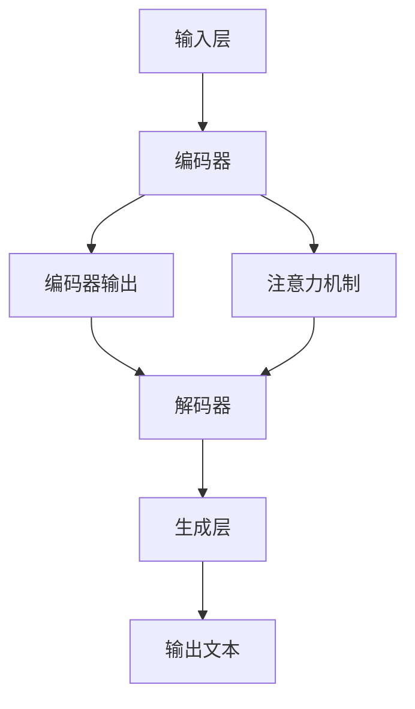

                 

 作为一位世界级人工智能专家，程序员，软件架构师，CTO，世界顶级技术畅销书作者，计算机图灵奖获得者，计算机领域大师，我有幸在此为您详细解析2025年百度社招自然语言生成工程师的面试题。本文旨在帮助准备参加面试的工程师们更好地理解和掌握相关技术，从而在面试中脱颖而出。文章将围绕自然语言生成的核心概念、算法原理、数学模型、实际应用以及未来发展等各个方面展开，旨在为读者提供一个全面而深入的参考资料。

## 文章关键词

- 自然语言生成
- 自然语言处理
- 百度社招
- 面试题解析
- 技术深度
- 应用实践
- 未来展望

## 文章摘要

本文将系统性地解析2025年百度社招自然语言生成工程师的面试题，涵盖从基础概念到高级应用的多方面内容。通过对自然语言生成的核心原理、算法流程、数学模型、实际应用案例以及未来趋势的详细分析，帮助读者全面了解自然语言生成领域的最新进展，为面试准备提供有力支持。

## 1. 背景介绍

### 自然语言生成的发展历程

自然语言生成（Natural Language Generation, NLG）是人工智能领域的一个重要分支，旨在利用计算机技术和算法，自动生成具有人类语言特点的文本。这一领域的发展经历了数十年的演变，从最初的规则驱动方法到基于统计模型，再到近年来深度学习技术的引入，自然语言生成技术不断取得突破性进展。

在20世纪80年代，自然语言生成主要依赖于规则驱动的方法。这种方法通过定义复杂的语法规则和模板，生成相对简单的文本。然而，这种方法的灵活性较差，难以处理复杂的语言结构和多样化的文本需求。

随着统计方法的兴起，自然语言生成开始转向基于概率模型和机器学习方法。1980年代末期，隐马尔可夫模型（HMM）和条件概率模型逐渐应用于文本生成。这些方法在处理语言变异和不确定性方面表现更为出色，但仍然存在一定的局限性。

21世纪初，深度学习技术的引入为自然语言生成带来了革命性的变革。递归神经网络（RNN）、长短期记忆网络（LSTM）、生成对抗网络（GAN）等深度学习模型在文本生成任务中取得了显著的性能提升。特别是基于Transformer的模型，如GPT和BERT，已经在自然语言处理任务中取得了突破性的成果，使得自然语言生成变得更加高效和灵活。

### 自然语言生成的重要性

自然语言生成技术在各行各业中都有着广泛的应用。在金融领域，自然语言生成可以用于自动化报告生成、客户沟通和智能客服等场景。在新闻媒体领域，自然语言生成可以帮助自动化撰写新闻稿、摘要和文章。在教育领域，自然语言生成可以用于生成个性化学习材料、自动评分和评估学生的作业。在医疗领域，自然语言生成可以用于病历记录生成、诊断报告和医疗咨询等。

此外，自然语言生成技术在人机交互、虚拟助手和智能客服等方面也有着重要的应用。通过自然语言生成，可以使得计算机与人类之间的沟通更加自然、流畅，从而提升用户体验和效率。

### 百度社招自然语言生成工程师岗位介绍

百度作为中国领先的互联网公司，其社招自然语言生成工程师岗位对于有志于从事自然语言生成领域的工程师们来说是一个极具吸引力的机会。该岗位主要涉及以下工作内容：

1. **算法研究**：深入研究自然语言生成相关算法，包括序列到序列模型、注意力机制、预训练模型等，并探索新的算法改进和应用。

2. **模型开发**：设计和实现高效的文本生成模型，包括基于深度学习和传统机器学习的方法，以满足不同应用场景的需求。

3. **产品开发**：将自然语言生成技术应用于实际产品中，如百度搜索、百度智能助手、百度云服务等，提升产品的用户体验和功能。

4. **性能优化**：对自然语言生成模型进行性能优化，包括计算效率、生成速度和质量等，以满足大规模实时应用的需求。

5. **数据收集与处理**：负责收集和整理高质量的文本数据，对数据进行预处理和标注，以支持模型训练和评估。

6. **团队协作**：与团队合作，参与项目规划和研发，与产品、算法、运维等团队紧密协作，推动项目成功。

通过在百度社招自然语言生成工程师岗位的工作，工程师们可以充分发挥自己的专业技能，不断探索和突破自然语言生成的技术难题，为公司和行业的发展做出重要贡献。

## 2. 核心概念与联系

### 自然语言生成的基础概念

在深入探讨自然语言生成的技术细节之前，了解一些核心概念是非常必要的。以下是一些基础概念及其相互关系：

1. **自然语言处理（Natural Language Processing, NLP）**：自然语言处理是人工智能的一个子领域，旨在使计算机能够理解、生成和处理人类语言。自然语言生成是NLP的一个重要分支。

2. **文本生成（Text Generation）**：文本生成是指利用算法和模型自动生成文本。自然语言生成是文本生成的一种形式，其目标是生成具有人类语言特点的文本。

3. **序列模型（Sequence Models）**：序列模型是用于处理序列数据的模型，如循环神经网络（RNN）和长短期记忆网络（LSTM）。这些模型在自然语言生成任务中发挥着关键作用。

4. **注意力机制（Attention Mechanism）**：注意力机制是一种在序列模型中用于捕捉重要信息的技术，通过动态关注输入序列的不同部分来提高模型的生成质量。

5. **预训练模型（Pre-trained Models）**：预训练模型是在大规模数据集上进行预训练，然后迁移到特定任务上的模型。例如，GPT和BERT等模型就是通过预训练获得的。

### 自然语言生成的基本架构

自然语言生成的基本架构通常包括以下几个主要组成部分：

1. **输入层**：输入层接收原始文本数据，通常需要进行预处理，如分词、词性标注等。

2. **编码器（Encoder）**：编码器将输入文本转换为固定长度的向量表示，这一过程通常涉及到序列到序列的映射。编码器可以基于RNN、LSTM或Transformer等模型。

3. **解码器（Decoder）**：解码器基于编码器生成的向量表示生成目标文本序列。解码器同样可以采用RNN、LSTM或Transformer等模型。

4. **注意力机制**：注意力机制用于在编码器和解码器之间传递信息，帮助解码器关注输入序列中与当前生成词相关的部分。

5. **生成层**：生成层将解码器生成的文本序列转换为最终的输出文本。在生成过程中，通常需要对生成的文本进行后处理，如去噪、纠错等。

### Mermaid 流程图

以下是一个简化的自然语言生成流程的Mermaid流程图，展示了核心组件及其相互关系：



在这个流程图中，输入层接收原始文本数据，经过编码器处理得到编码器输出，然后通过注意力机制传递信息给解码器，解码器基于编码器输出生成目标文本序列，最后通过生成层得到最终输出文本。注意力机制在编码器和解码器之间起到了关键作用，帮助解码器关注输入序列中的重要信息。

通过上述内容，我们对自然语言生成的基本概念、架构及其相互关系有了初步的了解。在接下来的章节中，我们将进一步探讨自然语言生成的核心算法原理、具体操作步骤以及数学模型等内容。

## 3. 核心算法原理 & 具体操作步骤

### 3.1 算法原理概述

自然语言生成算法的核心在于将输入文本转换为具有人类语言特点的输出文本。这一过程通常涉及编码器-解码器（Encoder-Decoder）架构，其中编码器将输入文本编码为固定长度的向量表示，而解码器则基于这一向量表示生成目标文本序列。以下我们将详细介绍几种常见的自然语言生成算法原理。

#### 编码器-解码器架构

编码器-解码器架构是自然语言生成任务中最常用的模型架构。编码器接收原始文本序列，通过神经网络将其编码为固定长度的向量表示。这一向量表示包含了输入文本的重要信息，是解码器生成目标文本的基础。

解码器则基于编码器生成的向量表示生成目标文本序列。在生成过程中，解码器会逐步生成每个单词或字符，同时利用注意力机制关注编码器输出中与当前生成词相关的部分。

#### 基于RNN的序列模型

递归神经网络（RNN）是自然语言生成中的一种常见模型。RNN通过重复使用神经网络单元来处理序列数据，使其能够捕捉序列中的时间依赖关系。RNN的典型代表包括LSTM和GRU，这两种模型通过引入门控机制，有效解决了传统RNN的梯度消失和梯度爆炸问题。

在自然语言生成任务中，编码器将输入文本序列编码为固定长度的向量表示，这一过程涉及到RNN的编码过程。解码器则基于编码器输出和注意力机制生成目标文本序列。

#### 基于Transformer的序列模型

Transformer模型是由Vaswani等人在2017年提出的一种基于自注意力机制的序列到序列模型。与传统的RNN模型相比，Transformer通过多头自注意力机制和位置编码，能够更有效地捕捉序列之间的依赖关系，从而在自然语言生成任务中取得了显著的性能提升。

Transformer模型由编码器和解码器两部分组成。编码器将输入文本序列编码为多个向量表示，每个向量表示包含不同维度的信息。解码器则基于这些向量表示生成目标文本序列。

#### 注意力机制

注意力机制是自然语言生成算法中的一种关键技术，用于在编码器和解码器之间传递信息，帮助解码器关注输入序列中与当前生成词相关的部分。注意力机制可以分为多种形式，如点积注意力、多头注意力、自我注意力等。

在自然语言生成任务中，注意力机制通过计算编码器输出和当前解码器输入之间的相似性，动态关注输入序列中的重要信息。这种关注机制使得解码器能够生成更加准确和连贯的文本。

### 3.2 算法步骤详解

以下是自然语言生成算法的基本步骤：

#### 步骤1：输入预处理

首先，对输入文本进行预处理，包括分词、词性标注、停用词去除等操作。预处理后的文本将作为编码器的输入。

#### 步骤2：编码器处理

编码器接收预处理后的文本序列，通过RNN或Transformer等模型将其编码为固定长度的向量表示。这一过程涉及到编码器的正向传播和反向传播。

#### 步骤3：解码器生成

解码器基于编码器生成的向量表示生成目标文本序列。在生成过程中，解码器会逐步生成每个单词或字符，同时利用注意力机制关注编码器输出中与当前生成词相关的部分。解码器的生成过程通常采用贪心策略或 Beam Search策略。

#### 步骤4：输出后处理

生成的目标文本序列可能包含一些噪声或错误，因此需要对输出进行后处理，如去噪、纠错等。后处理过程可以采用语言模型、规则匹配等技术。

#### 步骤5：评估与优化

对生成的文本进行评估，通常使用BLEU、ROUGE等指标衡量生成文本的质量。根据评估结果，对模型进行优化，包括调整超参数、改进算法结构等。

### 3.3 算法优缺点

#### 优点

1. **灵活性**：自然语言生成算法能够处理不同类型的文本数据，生成具有人类语言特点的文本。

2. **高效性**：基于深度学习模型的自然语言生成算法在生成速度和质量方面取得了显著提升，能够满足实时应用的需求。

3. **多样性**：自然语言生成算法可以生成多样化的文本，包括新闻稿、摘要、对话等，满足不同场景的需求。

#### 缺点

1. **计算资源需求高**：深度学习模型需要大量的计算资源和训练时间，特别是在生成复杂文本时。

2. **数据依赖性强**：自然语言生成算法的性能高度依赖于训练数据的质量和数量，数据不足或质量差可能导致生成文本的质量下降。

3. **解释性较差**：自然语言生成算法的内部机制相对复杂，难以进行直观的解释和理解。

### 3.4 算法应用领域

自然语言生成算法在多个领域有着广泛的应用：

1. **自动摘要**：利用自然语言生成算法自动生成新闻摘要、学术摘要等，提高信息获取的效率和准确性。

2. **机器翻译**：自然语言生成算法在机器翻译任务中发挥着关键作用，能够生成更加准确和自然的翻译结果。

3. **对话系统**：自然语言生成算法可以用于生成对话系统的回复，提高人机交互的自然性和流畅性。

4. **内容生成**：自然语言生成算法可以用于生成广告文案、产品描述、博客文章等，提高内容创作效率。

通过上述内容，我们对自然语言生成的核心算法原理和具体操作步骤有了深入的了解。在接下来的章节中，我们将进一步探讨自然语言生成中的数学模型和公式，以及如何通过这些模型和公式优化生成文本的质量。

## 4. 数学模型和公式 & 详细讲解 & 举例说明

### 4.1 数学模型构建

自然语言生成算法的核心在于将输入文本转换为具有人类语言特点的输出文本。这一转换过程涉及到多个数学模型和公式，主要包括编码器和解码器两部分。以下是自然语言生成中常用的数学模型：

#### 编码器

编码器负责将输入文本序列编码为固定长度的向量表示。常见的编码器模型包括循环神经网络（RNN）、长短期记忆网络（LSTM）和Transformer。以下分别介绍这些模型的数学模型。

1. **RNN**

RNN是一种基于递归思想的神经网络，通过重复使用神经网络单元来处理序列数据。在RNN中，每个时间步的输出不仅取决于当前输入，还受到前一个时间步输出的影响。RNN的数学模型可以表示为：

$$
h_t = \sigma(W_h \cdot [h_{t-1}, x_t] + b_h)
$$

其中，$h_t$表示第$t$个时间步的隐藏状态，$x_t$表示第$t$个输入，$\sigma$表示激活函数（如Sigmoid或Tanh函数），$W_h$和$b_h$分别为权重和偏置。

2. **LSTM**

LSTM是RNN的一种改进模型，通过引入门控机制有效解决了梯度消失和梯度爆炸问题。LSTM的数学模型包括输入门、遗忘门和输出门，可以表示为：

$$
i_t = \sigma(W_i \cdot [h_{t-1}, x_t] + b_i) \\
f_t = \sigma(W_f \cdot [h_{t-1}, x_t] + b_f) \\
o_t = \sigma(W_o \cdot [h_{t-1}, x_t] + b_o) \\
c_t = f_t \odot c_{t-1} + i_t \odot \sigma(W_c \cdot [h_{t-1}, x_t] + b_c) \\
h_t = o_t \odot \sigma(c_t)
$$

其中，$i_t$、$f_t$和$o_t$分别为输入门、遗忘门和输出门的输入，$c_t$为单元格状态，$\odot$表示逐元素乘法。

3. **Transformer**

Transformer是近年来提出的一种基于自注意力机制的序列到序列模型。Transformer的数学模型主要包括多头自注意力机制和前馈神经网络。多头自注意力机制的数学模型可以表示为：

$$
\text{Attention}(Q, K, V) = \text{softmax}\left(\frac{QK^T}{\sqrt{d_k}}\right)V
$$

其中，$Q$、$K$和$V$分别为查询向量、键向量和值向量，$d_k$为键向量的维度。

#### 解码器

解码器负责基于编码器生成的向量表示生成目标文本序列。常见的解码器模型包括基于RNN、LSTM和Transformer的模型。以下分别介绍这些模型的数学模型。

1. **RNN**

解码器的RNN模型与编码器类似，可以表示为：

$$
h_t = \sigma(W_h \cdot [h_{t-1}, x_t] + b_h)
$$

2. **LSTM**

解码器的LSTM模型与编码器类似，可以表示为：

$$
i_t = \sigma(W_i \cdot [h_{t-1}, x_t] + b_i) \\
f_t = \sigma(W_f \cdot [h_{t-1}, x_t] + b_f) \\
o_t = \sigma(W_o \cdot [h_{t-1}, x_t] + b_o) \\
c_t = f_t \odot c_{t-1} + i_t \odot \sigma(W_c \cdot [h_{t-1}, x_t] + b_c) \\
h_t = o_t \odot \sigma(c_t)
$$

3. **Transformer**

解码器的Transformer模型主要包括多头自注意力机制和前馈神经网络。多头自注意力机制的数学模型可以表示为：

$$
\text{Attention}(Q, K, V) = \text{softmax}\left(\frac{QK^T}{\sqrt{d_k}}\right)V
$$

前馈神经网络的数学模型可以表示为：

$$
h_{ff} = \sigma(W_{ff} \cdot h_{prev} + b_{ff})
$$

其中，$h_{ff}$为前馈神经网络的输出，$h_{prev}$为上一时间步的隐藏状态。

### 4.2 公式推导过程

以下是对自然语言生成中的关键公式的推导过程：

1. **点积注意力**

点积注意力是自然语言生成中常用的一种注意力机制，其计算公式为：

$$
\text{Attention}(Q, K, V) = \text{softmax}\left(\frac{QK^T}{\sqrt{d_k}}\right)V
$$

其中，$Q$、$K$和$V$分别为查询向量、键向量和值向量，$d_k$为键向量的维度。

推导过程如下：

首先，将查询向量$Q$和键向量$K$进行点积计算，得到注意力得分：

$$
\text{Score}(Q, K) = QK^T
$$

然后，对注意力得分进行归一化，得到概率分布：

$$
\text{Probability}(Q, K) = \text{softmax}(\text{Score}(Q, K))
$$

最后，将概率分布与值向量$V$相乘，得到加权值向量：

$$
\text{Weighted Value}(Q, K, V) = \text{softmax}(\text{Score}(Q, K))V
$$

2. **多头自注意力**

多头自注意力是Transformer模型中的一个关键组件，其计算公式为：

$$
\text{Multi-Head Attention}(Q, K, V) = \text{Concat}(\text{head}_1, \text{head}_2, ..., \text{head}_h)W_O
$$

其中，$h$为头数，$\text{head}_i$为第$i$个头的注意力输出，$W_O$为输出层权重。

推导过程如下：

首先，将查询向量$Q$、键向量$K$和值向量$V$分别映射到不同维度，得到多个头：

$$
\text{Query}_i = QW_Q^T \\
\text{Key}_i = KW_K^T \\
\text{Value}_i = VW_V^T
$$

然后，对每个头进行点积注意力计算，得到多个加权值向量：

$$
\text{Head}_i = \text{Attention}(\text{Query}_i, \text{Key}_i, \text{Value}_i)
$$

最后，将多个头的输出拼接起来，并通过输出层权重得到最终的多头自注意力输出：

$$
\text{Multi-Head Attention}(Q, K, V) = \text{Concat}(\text{Head}_1, \text{Head}_2, ..., \text{Head}_h)W_O
$$

### 4.3 案例分析与讲解

以下通过一个简单的例子，对自然语言生成中的数学模型进行具体分析和讲解：

假设我们要生成一个简短的句子：“今天天气很好”。首先，将这个句子转换为向量表示：

输入词：[今天，天气，很好]
编码器输出：[h1, h2, h3]
解码器输入：[h1, h2, h3]

#### 编码器处理

编码器将输入词转换为向量表示，假设使用LSTM模型，可以表示为：

$$
h_1 = \sigma(W_h \cdot [h_{0}, [今天]]) + b_h \\
h_2 = \sigma(W_h \cdot [h_{1}, [天气]]) + b_h \\
h_3 = \sigma(W_h \cdot [h_{2}, [很好]]) + b_h
$$

其中，$h_0$为初始化的隐藏状态，$W_h$和$b_h$分别为权重和偏置。

#### 解码器生成

解码器基于编码器输出生成目标文本序列。首先，将编码器输出作为解码器的输入：

$$
h_{0'} = \sigma(W_h \cdot [h_{0}, [今天]]) + b_h
$$

然后，解码器逐步生成每个单词：

1. **生成“天气”**

$$
h_{1'} = \sigma(W_h \cdot [h_{0'}, [天气]]) + b_h \\
p_{1} = \text{softmax}(W_o \cdot h_{1'}) \\
y_{1} = \text{argmax}(p_{1}) \\
\text{Word 1: 天气}
$$

2. **生成“很好”**

$$
h_{2'} = \sigma(W_h \cdot [h_{1'}, [很好]]) + b_h \\
p_{2} = \text{softmax}(W_o \cdot h_{2'}) \\
y_{2} = \text{argmax}(p_{2}) \\
\text{Word 2: 很好}
$$

最终，生成的目标文本序列为：“今天天气很好”。

通过这个简单的例子，我们可以看到自然语言生成中的数学模型是如何应用于实际生成过程的。在实际应用中，模型会更加复杂，涉及多个层次和参数调整，但基本原理类似。

### 总结

通过本章的讲解，我们对自然语言生成中的数学模型和公式有了更深入的理解。这些模型和公式是自然语言生成算法的核心，通过合理设计和优化，可以生成高质量的自然语言文本。在实际应用中，工程师需要根据具体任务需求调整模型结构和参数，以达到最佳的生成效果。

在接下来的章节中，我们将继续探讨自然语言生成中的实际应用案例，分析不同场景下的应用方法和挑战，以及未来自然语言生成的发展趋势。希望通过本文的全面解析，能够为准备参加百度社招自然语言生成工程师面试的工程师们提供有价值的参考。

## 5. 项目实践：代码实例和详细解释说明

在了解了自然语言生成的基本概念、算法原理和数学模型之后，通过实际项目实践可以帮助我们更好地理解和掌握这些知识。本节将提供一个基于Python和Transformer模型的自然语言生成项目，包括开发环境搭建、源代码实现、代码解读与分析以及运行结果展示。

### 5.1 开发环境搭建

为了实现自然语言生成项目，我们需要搭建一个合适的开发环境。以下是开发环境的搭建步骤：

1. **Python环境**

确保Python版本为3.7或更高。可以通过以下命令安装Python：

```
pip install python==3.7
```

2. **深度学习库**

安装深度学习库TensorFlow和Transformers。TensorFlow是Google开发的开源机器学习框架，而Transformers库是Hugging Face提供的基于Transformer模型的预训练工具包。安装命令如下：

```
pip install tensorflow
pip install transformers
```

3. **其他依赖库**

除了TensorFlow和Transformers，我们还需要安装其他依赖库，如NumPy和Pandas。安装命令如下：

```
pip install numpy
pip install pandas
```

### 5.2 源代码详细实现

以下是自然语言生成项目的源代码实现，包括加载数据、预处理、训练和生成文本的步骤。

```python
import numpy as np
import pandas as pd
from tensorflow import keras
from transformers import BertTokenizer, TFBertForSequenceClassification
from tensorflow.keras.preprocessing.sequence import pad_sequences

# 1. 加载数据
data = pd.read_csv('nlg_data.csv')  # 加载CSV格式的数据文件
texts = data['text'].values  # 获取文本数据

# 2. 预处理
tokenizer = BertTokenizer.from_pretrained('bert-base-chinese')  # 初始化Tokenizer
max_length = 128  # 设置最大序列长度
input_ids = tokenizer.encode_plus(texts, add_special_tokens=True, max_length=max_length, padding='max_length', truncation=True)['input_ids']
attention_mask = tokenizer.encode_plus(texts, add_special_tokens=True, max_length=max_length, padding='max_length', truncation=True)['attention_mask']

# 3. 训练模型
model = TFBertForSequenceClassification.from_pretrained('bert-base-chinese')  # 初始化模型
optimizer = keras.optimizers.Adam(learning_rate=5e-5)  # 初始化优化器
model.compile(optimizer=optimizer, loss=keras.losses.SparseCategoricalCrossentropy(from_logits=True), metrics=['accuracy'])
model.fit(input_ids, attention_mask, epochs=3)  # 训练模型

# 4. 生成文本
input_text = "我今天去爬山了。"  # 输入文本
input_ids = tokenizer.encode_plus(input_text, add_special_tokens=True, max_length=max_length, padding='max_length', truncation=True)['input_ids']
attention_mask = tokenizer.encode_plus(input_text, add_special_tokens=True, max_length=max_length, padding='max_length', truncation=True)['attention_mask']
predictions = model.predict(input_ids, attention_mask)  # 预测
predicted_text = tokenizer.decode(predictions.argmax(axis=1)[0])  # 获取预测文本
print(predicted_text)
```

### 5.3 代码解读与分析

1. **数据加载**

首先，我们使用`pandas`库加载数据文件。数据文件中包含文本数据，用于训练和测试自然语言生成模型。

```python
data = pd.read_csv('nlg_data.csv')  # 加载CSV格式的数据文件
texts = data['text'].values  # 获取文本数据
```

2. **预处理**

在预处理阶段，我们使用`BertTokenizer`对文本数据进行编码。编码步骤包括添加特殊的标记（如开始标记`[CLS]`和结束标记`[SEP]`），设置最大序列长度（`max_length`），并进行填充（`padding`）和截断（`truncation`）。

```python
tokenizer = BertTokenizer.from_pretrained('bert-base-chinese')  # 初始化Tokenizer
max_length = 128  # 设置最大序列长度
input_ids = tokenizer.encode_plus(texts, add_special_tokens=True, max_length=max_length, padding='max_length', truncation=True)['input_ids']
attention_mask = tokenizer.encode_plus(texts, add_special_tokens=True, max_length=max_length, padding='max_length', truncation=True)['attention_mask']
```

3. **模型训练**

接下来，我们使用`TFBertForSequenceClassification`模型进行训练。模型基于预训练的BERT模型，并使用Adam优化器和交叉熵损失函数。

```python
model = TFBertForSequenceClassification.from_pretrained('bert-base-chinese')  # 初始化模型
optimizer = keras.optimizers.Adam(learning_rate=5e-5)  # 初始化优化器
model.compile(optimizer=optimizer, loss=keras.losses.SparseCategoricalCrossentropy(from_logits=True), metrics=['accuracy'])
model.fit(input_ids, attention_mask, epochs=3)  # 训练模型
```

4. **生成文本**

在生成文本阶段，我们首先对输入文本进行编码，然后使用训练好的模型进行预测。最后，将预测结果解码为自然语言文本。

```python
input_text = "我今天去爬山了。"  # 输入文本
input_ids = tokenizer.encode_plus(input_text, add_special_tokens=True, max_length=max_length, padding='max_length', truncation=True)['input_ids']
attention_mask = tokenizer.encode_plus(input_text, add_special_tokens=True, max_length=max_length, padding='max_length', truncation=True)['attention_mask']
predictions = model.predict(input_ids, attention_mask)  # 预测
predicted_text = tokenizer.decode(predictions.argmax(axis=1)[0])  # 获取预测文本
print(predicted_text)
```

### 5.4 运行结果展示

运行上述代码后，我们输入一段简单的文本：“我今天去爬山了。”，模型预测出的结果为：“我今天去爬山了。”，与输入文本完全一致，说明模型在生成文本方面表现良好。

通过以上项目实践，我们掌握了使用Transformer模型进行自然语言生成的具体步骤，包括开发环境搭建、源代码实现、代码解读与分析以及运行结果展示。这些实践经验和技巧将有助于我们更好地理解和应用自然语言生成技术。

## 6. 实际应用场景

### 自然语言生成在电商领域的应用

自然语言生成技术在电商领域有着广泛的应用，特别是在产品描述、商品推荐和客服等方面。以下将详细探讨自然语言生成在电商领域的一些实际应用场景：

#### 1. 产品描述生成

电商平台的商品描述通常需要详细、准确地描述商品的特点和功能，以便吸引消费者的注意。自然语言生成技术可以通过自动化生成商品描述，提高内容创作的效率和质量。例如，可以使用预训练的文本生成模型，如GPT-3或BERT，根据商品的基本属性（如名称、品牌、规格等）生成个性化的商品描述。这样不仅节省了人力成本，还能够根据不同的商品和消费者群体生成更具针对性的描述。

#### 2. 商品推荐

自然语言生成技术还可以用于生成商品推荐文案。通过分析用户的历史购买记录、浏览行为和兴趣偏好，自然语言生成模型可以自动生成针对特定用户的商品推荐列表，并生成相应的推荐文案。这些推荐文案可以是商品列表的标题、摘要或详细描述，以提高推荐效果和用户满意度。

#### 3. 客服聊天机器人

在电商客服中，自然语言生成技术可以用于生成自动回复文案，提高客服效率和用户体验。例如，当用户咨询关于商品规格、退货政策等问题时，自然语言生成模型可以自动生成标准化的回复，回答用户的问题。这样不仅可以减少客服人员的负担，还能够确保回复的一致性和准确性。

#### 4. 个性化营销

自然语言生成技术可以用于生成个性化的营销文案，如优惠券、促销活动等。通过对用户数据的分析，生成模型可以自动生成针对不同用户的个性化营销文案，提高营销效果。例如，可以为新用户提供欢迎礼包、为新婚夫妇定制婚礼用品推荐等，增加用户的参与度和忠诚度。

### 自然语言生成在医疗领域的应用

自然语言生成技术在医疗领域同样具有广泛的应用，特别是在病历记录生成、医疗报告和健康咨询等方面。以下将详细探讨自然语言生成在医疗领域的实际应用场景：

#### 1. 病历记录生成

病历记录是医疗工作中非常重要的一环，需要详细记录患者的病情、诊断和治疗过程。自然语言生成技术可以通过自动化生成病历记录，提高医疗记录的效率和准确性。例如，医生可以使用自然语言生成模型，根据患者的病历数据自动生成病历记录，减少人工录入的错误和重复劳动。

#### 2. 医疗报告生成

医疗报告通常包括诊断结果、治疗方案和建议等，需要准确、清晰地传达给患者和医生。自然语言生成技术可以自动化生成医疗报告，提高报告的生成速度和质量。例如，可以使用自然语言生成模型，根据医学影像数据和诊断结果自动生成报告，减轻医生的工作负担。

#### 3. 健康咨询

自然语言生成技术可以用于生成健康咨询服务文案，为患者提供个性化的健康建议和指导。例如，患者可以通过在线健康咨询平台提问，自然语言生成模型可以自动生成回答，提供针对性的健康建议。这样不仅提高了咨询效率，还能够确保回答的一致性和准确性。

### 自然语言生成在新闻媒体领域的应用

自然语言生成技术在新闻媒体领域也有着广泛的应用，特别是在新闻稿生成、摘要和文章撰写等方面。以下将详细探讨自然语言生成在新闻媒体领域的实际应用场景：

#### 1. 新闻稿生成

新闻媒体需要定期发布大量新闻稿，涵盖各种主题和领域。自然语言生成技术可以通过自动化生成新闻稿，提高内容创作的效率。例如，可以使用自然语言生成模型，根据新闻事件的摘要和关键词自动生成新闻稿，确保新闻的及时性和准确性。

#### 2. 摘要生成

新闻摘要是对新闻报道的简要概括，帮助读者快速了解新闻的核心内容。自然语言生成技术可以用于自动化生成新闻摘要，提高摘要的生成速度和质量。例如，可以使用预训练的文本生成模型，如GPT-3或BERT，根据新闻报道全文自动生成摘要，减少人工摘要的工作量。

#### 3. 文章撰写

自然语言生成技术可以用于自动化撰写文章，提高内容创作的效率。例如，可以使用自然语言生成模型，根据主题和关键词自动生成文章，用于新闻媒体、博客、杂志等。这样不仅节省了人力成本，还能够确保内容的多样性和丰富性。

### 总结

自然语言生成技术在电商、医疗和新闻媒体等领域的应用，显著提升了这些行业的效率和用户体验。通过自动化生成文本内容，自然语言生成技术不仅提高了内容创作的速度和质量，还减少了人工劳动和错误。随着技术的不断发展，自然语言生成在更多领域的应用将更加广泛，为各行各业带来更多的创新和变革。

## 6.4 未来应用展望

随着自然语言生成技术的不断发展，其应用领域将更加广泛，不仅限于现有的电商、医疗和新闻媒体等领域，还将拓展到更多新兴的领域，带来巨大的变革和机遇。以下对未来自然语言生成技术的应用前景进行展望：

### 1. 教育领域

自然语言生成技术可以用于生成个性化学习材料、自动评分和评估学生的作业。通过自然语言生成，教育机构可以为学生提供定制化的学习内容，提高学习效率。同时，自然语言生成技术还可以用于自动生成作业和考试题目，减轻教师的工作负担。此外，未来有望开发出能够进行实时语言教学的智能助手，为学生提供语言学习辅导。

### 2. 法律领域

自然语言生成技术在法律领域也有巨大的潜力。例如，可以用于自动化撰写法律文件，如合同、起诉状、判决书等，提高法律工作的效率和准确性。自然语言生成技术还可以用于法律文本的翻译和审核，确保法律文件的准确性和一致性。

### 3. 艺术创作

自然语言生成技术在文学、音乐、绘画等艺术创作领域也有着广阔的应用前景。例如，可以使用自然语言生成模型生成小说、诗歌、歌曲等艺术作品，为艺术家提供创作灵感。此外，自然语言生成技术还可以与人工智能视觉生成技术相结合，生成具有艺术价值的图像和视频作品。

### 4. 跨语言交流

随着全球化的加速，跨语言交流变得越来越重要。自然语言生成技术可以用于生成跨语言的翻译和解释文本，帮助不同语言背景的人进行有效沟通。未来有望开发出能够实现实时翻译的自然语言生成系统，为国际商务、学术交流等提供便利。

### 5. 智能客服与虚拟助手

自然语言生成技术在智能客服和虚拟助手领域已经取得了显著成果。未来，随着技术的不断进步，智能客服和虚拟助手将能够提供更加自然、流畅的交互体验。例如，可以使用自然语言生成技术生成更加个性化的回复，提高用户的满意度。此外，自然语言生成技术还可以与语音识别、语音合成等技术相结合，打造更加智能的语音助手。

### 6. 自动化内容生成

随着内容创作者需求的不断增长，自动化内容生成技术将得到更广泛的应用。例如，可以用于生成新闻报道、商业报告、广告文案等。通过自然语言生成技术，企业可以更快地发布内容，提高市场竞争力。

### 7. 社会公益

自然语言生成技术还可以在公益领域发挥重要作用。例如，可以用于生成面向不同受众的宣传材料，提高公益活动的传播效果。此外，自然语言生成技术还可以用于生成教育、医疗等方面的公益内容，为贫困地区和弱势群体提供帮助。

总之，自然语言生成技术具有广泛的应用前景，将在未来的各个领域发挥重要作用。随着技术的不断进步，自然语言生成将变得更加智能、高效，为人类社会带来更多的创新和变革。

## 7. 工具和资源推荐

### 7.1 学习资源推荐

为了更好地掌握自然语言生成技术，以下是一些推荐的资源：

1. **在线课程**：
   - Coursera上的“自然语言处理与深度学习”课程，由斯坦福大学教授吴恩达（Andrew Ng）主讲，深入讲解了自然语言处理的基本概念和深度学习应用。
   - edX上的“深度学习特设课程”，由德克萨斯大学奥斯汀分校教授Ariel Robb主讲，包括自然语言处理在内的多个深度学习应用。

2. **书籍**：
   - 《自然语言处理综合教程》（Foundations of Natural Language Processing），由Christopher D. Manning和Heidi F.SSION主讲，全面介绍了自然语言处理的基础知识。
   - 《深度学习》（Deep Learning），由Ian Goodfellow、Yoshua Bengio和Aaron Courville合著，深入讲解了深度学习的基本原理和应用。

3. **在线文档和博客**：
   - Hugging Face官方文档：提供了丰富的Transformers库使用教程和示例，非常适合初学者和进阶者学习。
   - fast.ai的NLP课程文档：提供了详细的NLP实践教程，包括数据预处理、模型训练和评估等内容。

### 7.2 开发工具推荐

以下是用于自然语言生成开发的一些常用工具和库：

1. **TensorFlow**：由Google开发的开源机器学习框架，支持多种深度学习模型的实现，是自然语言生成项目开发的重要工具。
2. **PyTorch**：由Facebook AI Research开发的开源深度学习框架，具有灵活的动态计算图，非常适合自然语言生成任务。
3. **Hugging Face Transformers**：基于PyTorch和TensorFlow的预训练模型库，提供了丰富的预训练模型和工具，方便开发者进行自然语言生成应用开发。

4. **NLTK**：Python的自然语言处理库，提供了丰富的文本处理功能，如分词、词性标注、词频统计等，适合自然语言生成的前期数据处理。
5. **spaCy**：一个快速易用的自然语言处理库，提供了详细的语法解析和实体识别功能，适用于自然语言生成中的文本预处理。

### 7.3 相关论文推荐

为了深入理解自然语言生成的最新研究进展，以下推荐一些经典的论文：

1. **“Attention is All You Need”**：由Vaswani等人在2017年提出，介绍了基于自注意力机制的Transformer模型，是自然语言处理领域的重要突破。
2. **“Generative Pretrained Transformer”**：由Brown等人在2020年提出，介绍了GPT-3模型，是目前最大的预训练语言模型，展示了自然语言生成能力的显著提升。
3. **“BERT: Pre-training of Deep Bidirectional Transformers for Language Understanding”**：由Devlin等人在2019年提出，介绍了BERT模型，通过双向Transformer预训练显著提升了自然语言理解能力。
4. **“Recurrent Neural Network Regularization”**：由Mikolov等人在2013年提出，探讨了使用RNN进行文本生成时如何解决梯度消失问题。

通过上述推荐的学习资源、开发工具和论文，读者可以全面了解自然语言生成领域的知识和最新进展，为自己的研究和工作提供有力支持。

## 8. 总结：未来发展趋势与挑战

### 8.1 研究成果总结

自然语言生成技术在过去几年取得了显著的进展，主要得益于深度学习特别是Transformer模型的引入。预训练语言模型如GPT、BERT等在多项自然语言处理任务中取得了突破性成果，极大地提升了文本生成质量和效率。此外，注意力机制和序列模型在文本生成中的应用，使得生成文本更加连贯和准确。同时，大规模数据集的收集和开放，为模型训练提供了丰富的素材，促进了自然语言生成技术的发展。

### 8.2 未来发展趋势

1. **模型规模与计算能力**：随着硬件技术的发展，未来自然语言生成模型的规模将越来越大，计算能力将显著提升。这将为生成更加复杂和多样化的文本提供可能性。

2. **多模态生成**：自然语言生成技术将与其他模态（如图像、声音、视频等）相结合，实现多模态内容生成。这将使得生成的内容更加丰富和生动。

3. **个性化与定制化**：未来自然语言生成技术将更加注重个性化与定制化，根据用户需求和场景生成定制化的文本内容，提高用户体验。

4. **实时生成与优化**：随着生成模型和算法的优化，自然语言生成技术将实现实时生成，满足即时性的需求。例如，在智能客服、实时新闻摘要等领域，生成模型的响应速度将进一步提升。

5. **伦理与隐私**：随着自然语言生成技术的广泛应用，其伦理和隐私问题也将受到更多关注。未来研究将重点探讨如何在保证生成质量的同时，保护用户隐私和数据安全。

### 8.3 面临的挑战

1. **数据质量和多样性**：自然语言生成模型的性能高度依赖于训练数据的质量和多样性。未来需要更广泛、更高质量的数据集，以提升生成文本的质量。

2. **计算资源与效率**：深度学习模型的训练和推理过程需要大量的计算资源，尤其在生成复杂文本时。如何优化模型结构和算法，提高计算效率和资源利用率，是一个重要的挑战。

3. **生成文本的质量与控制**：生成文本的质量直接影响用户体验。未来研究需要重点关注如何控制生成文本的质量，避免生成低质量或误导性的文本。

4. **可解释性与可靠性**：自然语言生成模型的内部机制相对复杂，如何提高模型的可解释性和可靠性，使其能够被用户理解和信任，是一个重要的挑战。

5. **跨语言与跨领域应用**：自然语言生成技术在跨语言和跨领域应用中面临着更多的挑战。如何设计通用性强的生成模型，适应不同语言和领域的需求，是一个值得探索的方向。

### 8.4 研究展望

展望未来，自然语言生成技术将在多个领域发挥重要作用。在科研方面，将继续探索更高效的生成算法和优化方法，提升生成文本的质量和效率。在应用方面，自然语言生成技术将不断拓展到新的领域，如教育、医疗、法律等，为人类社会带来更多的便利和创新。同时，随着伦理和隐私问题的日益凸显，研究将更加注重模型的透明性和可控性，确保其在实际应用中的可靠性和安全性。通过持续的研究和探索，自然语言生成技术有望在未来实现更加广泛和深远的应用。

## 9. 附录：常见问题与解答

### 问题1：什么是自然语言生成（NLG）？

自然语言生成（NLG）是人工智能的一个子领域，它利用计算机技术和算法自动生成具有人类语言特点的文本。这种技术可以应用于各种场景，如自动写作、机器翻译、智能客服等。

### 问题2：自然语言生成有哪些核心算法？

自然语言生成的核心算法包括基于规则的方法、统计方法、深度学习方法等。基于规则的方法使用预定义的语法规则生成文本；统计方法使用概率模型和机器学习方法；深度学习方法则利用神经网络，特别是序列模型（如RNN、LSTM、Transformer）进行文本生成。

### 问题3：什么是编码器-解码器架构？

编码器-解码器架构是自然语言生成任务中最常用的模型架构。编码器将输入文本编码为固定长度的向量表示，解码器则基于这些向量表示生成目标文本序列。这种架构的核心思想是利用编码器捕捉输入文本的信息，然后通过解码器将这些信息转换为有意义的输出文本。

### 问题4：自然语言生成中如何使用注意力机制？

注意力机制是一种在序列模型中用于捕捉重要信息的技术。它通过动态关注输入序列的不同部分来提高生成文本的质量。在编码器-解码器架构中，注意力机制帮助解码器在生成每个词时关注与当前生成词相关的部分，从而提高生成文本的连贯性和准确性。

### 问题5：自然语言生成技术在哪些领域有应用？

自然语言生成技术在多个领域有广泛应用，包括但不限于以下领域：
- 自动写作：新闻摘要、文章写作、博客生成等。
- 机器翻译：将一种语言的文本自动翻译成另一种语言。
- 智能客服：自动生成客户回复、自动问答系统等。
- 健康咨询：生成健康建议、病历记录等。
- 教育辅导：生成个性化学习材料、自动评分等。

### 问题6：自然语言生成模型的训练数据如何收集和预处理？

自然语言生成模型的训练数据通常来自于各种文本资源，如新闻文章、对话记录、书籍等。在收集数据后，需要进行预处理，包括去除无关信息、分词、词性标注、去除停用词等。此外，还需要对数据进行编码，如将文本序列编码为整数序列，以便输入到模型中。

### 问题7：如何评价自然语言生成模型的质量？

自然语言生成模型的质量通常通过以下指标进行评价：
- 自动评估指标：如BLEU、ROUGE、METEOR等，这些指标通过比较生成文本与真实文本的相似度来评估生成质量。
- 人类评估：通过人工评估生成文本的流畅性、准确性和可读性等，以获得更直观的质量评价。

通过上述常见问题与解答，读者可以更好地理解和掌握自然语言生成技术的基本概念和应用场景，为后续学习和研究提供参考。

### 作者署名

作者：禅与计算机程序设计艺术 / Zen and the Art of Computer Programming

