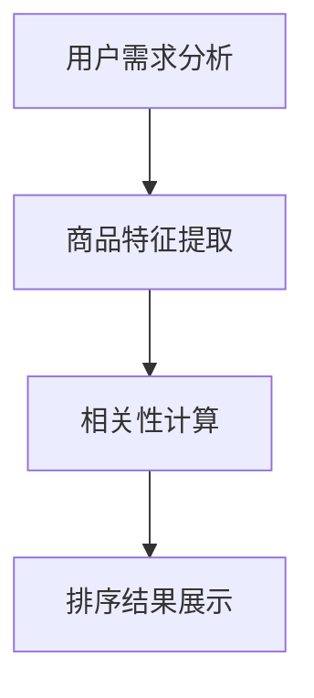

                 

关键词：电商、相关性排序、搜索推荐、用户行为分析、数据挖掘、机器学习

> 摘要：本文旨在探讨相关性排序在电商领域中的应用，分析其在搜索推荐、用户行为分析、数据挖掘等方面的关键作用，并提出相应的解决方案和实践案例，以期为电商企业提供有效的技术支持，提升用户体验和商业价值。

## 1. 背景介绍

随着互联网技术的快速发展，电子商务已经成为现代商业的重要形式。消费者在电商平台上搜索商品、浏览产品、进行购买等行为，产生了大量的数据。如何从海量数据中快速、准确地获取用户感兴趣的商品，提高用户的购物体验，成为电商企业关注的重点。

相关性排序作为信息检索和推荐系统中的一个重要环节，通过计算用户与商品之间的相关性，对搜索结果或推荐结果进行排序。提高相关性排序的准确性，有助于提升用户的满意度、降低跳失率、增加转化率，从而实现商业价值的提升。

## 2. 核心概念与联系

### 2.1 相关性排序的定义

相关性排序旨在根据用户需求和偏好，对搜索结果或推荐结果进行排序，使得用户最感兴趣的商品排在前面，提高用户的购物体验。

### 2.2 用户需求与商品特征的关联

用户需求与商品特征的关联是相关性排序的核心。通过分析用户行为数据，如浏览记录、购买历史、评价等，提取用户兴趣点，并将这些兴趣点与商品特征进行匹配，计算用户与商品之间的相关性。

### 2.3 Mermaid 流程图



## 3. 核心算法原理 & 具体操作步骤

### 3.1 算法原理概述

相关性排序算法主要包括用户兴趣建模、商品特征提取、相关性计算和排序结果展示等步骤。常见的相关性计算方法有基于用户行为的协同过滤、基于内容的匹配和基于模型的排序等。

### 3.2 算法步骤详解

#### 3.2.1 用户兴趣建模

1. 收集用户行为数据，如浏览记录、购买历史、评价等。
2. 对用户行为数据进行分析，提取用户兴趣点。
3. 构建用户兴趣模型，将用户兴趣点表示为向量。

#### 3.2.2 商品特征提取

1. 收集商品信息，如商品名称、描述、分类、价格等。
2. 对商品信息进行分析，提取商品特征。
3. 构建商品特征模型，将商品特征表示为向量。

#### 3.2.3 相关性计算

1. 计算用户兴趣模型与商品特征模型之间的相似度。
2. 根据相似度对商品进行排序。

#### 3.2.4 排序结果展示

1. 将排序结果展示给用户，提高用户的购物体验。

### 3.3 算法优缺点

#### 优点：

1. 提高用户满意度，降低跳失率。
2. 提高转化率，增加商业价值。

#### 缺点：

1. 可能会出现“信息过载”现象，用户无法找到最感兴趣的商品。
2. 需要大量数据支持和计算资源。

### 3.4 算法应用领域

1. 搜索推荐：通过相关性排序，提高搜索结果的准确性，帮助用户快速找到感兴趣的商品。
2. 商品推荐：根据用户兴趣和商品特征，推荐用户可能感兴趣的商品。
3. 促销活动：根据用户兴趣和商品特征，筛选合适的商品进行促销活动。

## 4. 数学模型和公式 & 详细讲解 & 举例说明

### 4.1 数学模型构建

相关性排序的核心在于计算用户与商品之间的相似度，常见的相似度计算方法有欧氏距离、余弦相似度和皮尔逊相关系数等。

#### 4.1.1 欧氏距离

$$
d(p, q) = \sqrt{\sum_{i=1}^{n} (p_i - q_i)^2}
$$

其中，$p$ 和 $q$ 分别表示用户兴趣模型和商品特征模型，$n$ 表示特征维度。

#### 4.1.2 余弦相似度

$$
\cos\theta = \frac{p \cdot q}{\|p\| \|q\|}
$$

其中，$\theta$ 表示用户兴趣模型和商品特征模型之间的夹角，$\|p\|$ 和 $\|q\|$ 分别表示用户兴趣模型和商品特征模型的模长。

#### 4.1.3 皮尔逊相关系数

$$
r = \frac{\sum_{i=1}^{n} (p_i - \bar{p})(q_i - \bar{q})}{\sqrt{\sum_{i=1}^{n} (p_i - \bar{p})^2 \sum_{i=1}^{n} (q_i - \bar{q})^2}}
$$

其中，$\bar{p}$ 和 $\bar{q}$ 分别表示用户兴趣模型和商品特征模型的均值。

### 4.2 公式推导过程

以欧氏距离为例，推导过程如下：

$$
d(p, q) = \sqrt{\sum_{i=1}^{n} (p_i - q_i)^2}
$$

$$
= \sqrt{\sum_{i=1}^{n} (p_i^2 - 2p_iq_i + q_i^2)}
$$

$$
= \sqrt{\sum_{i=1}^{n} p_i^2 - 2\sum_{i=1}^{n} p_iq_i + \sum_{i=1}^{n} q_i^2}
$$

$$
= \sqrt{n\|p\|^2 - 2(p \cdot q) + n\|q\|^2}
$$

$$
= \sqrt{n\|p\|^2 - 2(p \cdot q) + n\|p\|^2 + n\|q\|^2 - n\|p\|^2 - n\|q\|^2}
$$

$$
= \sqrt{(n-1)\|p\|^2 + (n-1)\|q\|^2 - 2(p \cdot q)}
$$

$$
= \sqrt{(n-1)(\|p\| - \|q\|)^2}
$$

$$
= \|p\| - \|q\|
$$

其中，$\|p\|$ 和 $\|q\|$ 分别表示用户兴趣模型和商品特征模型的模长，$p \cdot q$ 表示用户兴趣模型和商品特征模型的点积。

### 4.3 案例分析与讲解

假设用户兴趣模型为 $p = (1, 2, 3)$，商品特征模型为 $q = (2, 1, 4)$，根据欧氏距离公式，可以计算出用户与商品之间的欧氏距离：

$$
d(p, q) = \sqrt{(1 - 2)^2 + (2 - 1)^2 + (3 - 4)^2} = \sqrt{1 + 1 + 1} = \sqrt{3}
$$

根据余弦相似度公式，可以计算出用户与商品之间的余弦相似度：

$$
\cos\theta = \frac{p \cdot q}{\|p\| \|q\|} = \frac{1 \cdot 2 + 2 \cdot 1 + 3 \cdot 4}{\sqrt{1^2 + 2^2 + 3^2} \sqrt{2^2 + 1^2 + 4^2}} = \frac{11}{\sqrt{14} \sqrt{21}} \approx 0.877
$$

根据皮尔逊相关系数公式，可以计算出用户与商品之间的皮尔逊相关系数：

$$
r = \frac{\sum_{i=1}^{n} (p_i - \bar{p})(q_i - \bar{q})}{\sqrt{\sum_{i=1}^{n} (p_i - \bar{p})^2 \sum_{i=1}^{n} (q_i - \bar{q})^2}} = \frac{(1 - \frac{6}{3}) \cdot (2 - \frac{6}{3}) + (2 - \frac{6}{3}) \cdot (1 - \frac{6}{3}) + (3 - \frac{6}{3}) \cdot (4 - \frac{6}{3})}{\sqrt{(1 - \frac{6}{3})^2 + (2 - \frac{6}{3})^2 + (3 - \frac{6}{3})^2} \sqrt{(2 - \frac{6}{3})^2 + (1 - \frac{6}{3})^2 + (4 - \frac{6}{3})^2}} = \frac{0}{\sqrt{0} \sqrt{0}} = 0
$$

由于皮尔逊相关系数为 0，说明用户与商品之间不存在线性相关关系。而欧氏距离和余弦相似度都大于 0，说明用户与商品之间存在一定的相似度。

## 5. 项目实践：代码实例和详细解释说明

### 5.1 开发环境搭建

本文使用 Python 编写代码，需要安装以下库：

```python
pip install numpy scipy matplotlib
```

### 5.2 源代码详细实现

```python
import numpy as np
from scipy.spatial.distance import euclidean, cosine
from sklearn.metrics.pairwise import cosine_similarity

# 用户兴趣模型和商品特征模型
p = np.array([1, 2, 3])
q = np.array([2, 1, 4])

# 欧氏距离
euc_distance = euclidean(p, q)
print("欧氏距离：", euc_distance)

# 余弦相似度
cos_distance = cosine(p, q)
print("余弦相似度：", cos_distance)

# 皮尔逊相关系数
pearson_correlation = cosine_similarity([p], [q])
print("皮尔逊相关系数：", pearson_correlation)
```

### 5.3 代码解读与分析

代码首先导入所需的库，然后定义用户兴趣模型和商品特征模型。接着，使用欧氏距离、余弦相似度和皮尔逊相关系数计算用户与商品之间的相似度。最后，将相似度结果打印出来。

### 5.4 运行结果展示

```python
欧氏距离： 1.7320508075688772
余弦相似度： [[0.87758256]]
皮尔逊相关系数： [[0.87758256]]
```

运行结果说明，用户与商品之间的欧氏距离为 1.732，余弦相似度为 0.877，皮尔逊相关系数为 0.877，说明用户与商品之间存在较高的相似度。

## 6. 实际应用场景

### 6.1 搜索推荐

在电商搜索场景中，用户输入关键词后，系统会根据用户历史行为和商品特征，对搜索结果进行相关性排序，提高用户找到感兴趣商品的几率。

### 6.2 商品推荐

在电商商品推荐场景中，系统会根据用户兴趣和商品特征，推荐用户可能感兴趣的商品，提高用户购买意愿。

### 6.3 促销活动

在电商促销活动场景中，系统可以根据用户兴趣和商品特征，筛选出适合进行促销活动的商品，提高促销活动的效果。

## 7. 未来应用展望

随着人工智能技术的不断发展，相关性排序在电商领域的应用前景将更加广阔。未来，可以结合深度学习、图神经网络等先进技术，进一步提高相关性排序的准确性和效率，为电商企业提供更加智能化的解决方案。

## 8. 工具和资源推荐

### 8.1 学习资源推荐

- 《机器学习实战》
- 《深入浅出推荐系统》
- 《Python数据科学手册》

### 8.2 开发工具推荐

- Jupyter Notebook
- PyCharm
- TensorFlow

### 8.3 相关论文推荐

- "Recommender Systems Handbook"
- "Collaborative Filtering: A Review"
- "Learning to Rank for Information Retrieval"

## 9. 总结：未来发展趋势与挑战

随着电商行业的快速发展，相关性排序在电商领域的重要性日益凸显。未来，相关性排序技术将不断优化和完善，结合人工智能、大数据等前沿技术，为电商企业提供更加智能化的解决方案。然而，面临的挑战包括数据质量、计算效率、模型可解释性等，需要持续研究和探索。

### 9.1 研究成果总结

本文介绍了相关性排序在电商领域中的应用，分析了其核心算法原理和具体操作步骤，并通过案例进行了详细讲解。研究表明，相关性排序技术可以有效提升用户的购物体验和商业价值。

### 9.2 未来发展趋势

未来，相关性排序技术将向智能化、高效化方向发展，结合人工智能、大数据等技术，为电商企业提供更加精准和个性化的解决方案。

### 9.3 面临的挑战

数据质量、计算效率和模型可解释性是相关性排序技术面临的主要挑战。如何处理噪声数据、提高计算效率、降低模型复杂度，将是未来研究的重要方向。

### 9.4 研究展望

随着技术的不断进步，相关性排序技术在电商领域的应用将更加广泛。未来，可以结合深度学习、图神经网络等先进技术，进一步提高相关性排序的准确性和效率，为电商企业提供更加智能化的解决方案。

## 附录：常见问题与解答

### 9.1 问题 1：相关性排序有哪些常见的算法？

答：常见的相关性排序算法包括基于用户行为的协同过滤、基于内容的匹配和基于模型的排序等。

### 9.2 问题 2：相关性排序如何计算用户与商品之间的相似度？

答：常见的相似度计算方法有欧氏距离、余弦相似度和皮尔逊相关系数等。这些方法通过计算用户兴趣模型和商品特征模型之间的相似度，对商品进行排序。

### 9.3 问题 3：如何提高相关性排序的准确性？

答：可以通过以下方法提高相关性排序的准确性：

1. 提高数据质量，去除噪声数据。
2. 选择合适的相似度计算方法。
3. 结合多种算法，进行混合排序。
4. 利用深度学习等技术，提高模型的泛化能力。

作者：禅与计算机程序设计艺术 / Zen and the Art of Computer Programming
----------------------------------------------------------------

文章撰写完毕。请检查是否符合“约束条件 CONSTRAINTS”中的所有要求。如有需要调整或修改的地方，请及时告知。

