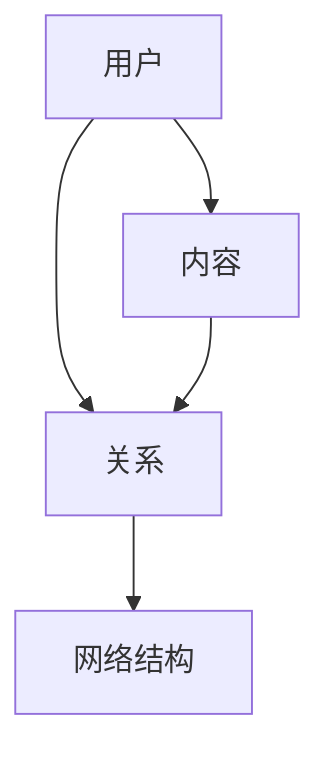

                 

关键词：知乎，用户兴趣图谱，构建算法，校招面试，经验分享

摘要：本文将围绕知乎2024年用户兴趣图谱构建算法的校招面试，深入探讨面试中的核心问题、算法原理、数学模型以及实际应用场景。通过本文，读者将获得关于算法面试的一手经验和深刻的理解，为未来的求职之路打下坚实的基础。

## 1. 背景介绍

知乎作为中国最大的知识分享平台，汇聚了海量的用户和内容。随着用户基数的不断扩大，如何精准地把握用户兴趣，从而提供更加个性化的内容推荐，成为了知乎面临的重要课题。为了应对这一挑战，知乎在2024年的校招面试中，特别设立了用户兴趣图谱构建算法的面试环节，旨在选拔具备数据挖掘和算法优化能力的人才。

本文将以2024年知乎用户兴趣图谱构建算法的校招面试为背景，通过对面试问题的分析，算法原理的讲解，数学模型的推导以及实际应用场景的探讨，为读者提供一份全面而深入的面试经验分享。

## 2. 核心概念与联系

在用户兴趣图谱构建过程中，核心概念主要包括用户、内容、关系和网络结构。以下是一个简化的Mermaid流程图，展示了这些核心概念之间的联系。



### 用户（User）

用户是兴趣图谱的基本单元，每个用户都有自己的兴趣偏好和行为特征。在构建过程中，用户的兴趣可以通过浏览历史、点赞、评论等行为数据来挖掘。

### 内容（Content）

内容是用户兴趣的载体，知乎上的每一条回答、文章、视频等都属于内容。通过对内容的分类和标签化，可以更好地理解用户的兴趣点。

### 关系（Relationship）

关系描述了用户与内容之间的交互，包括浏览、点赞、收藏等。这些关系构成了用户兴趣图谱的边缘，是连接用户和内容的桥梁。

### 网络结构（Network Structure）

网络结构是对用户兴趣图谱的整体描述，它反映了用户之间以及用户与内容之间的复杂交互关系。通过分析网络结构，可以挖掘出用户的潜在兴趣和群体特征。

## 3. 核心算法原理 & 具体操作步骤

### 3.1 算法原理概述

用户兴趣图谱构建算法的核心原理是通过分析用户的行为数据，挖掘用户兴趣点，并利用图论和网络分析方法，构建一个反映用户兴趣分布和关系的图谱。

具体来说，算法包括以下几个步骤：

1. **数据预处理**：清洗和整合用户行为数据，如浏览记录、点赞数据等。
2. **用户兴趣挖掘**：基于用户行为数据，使用聚类、协同过滤等方法挖掘用户的兴趣点。
3. **图谱构建**：利用图论算法，将用户和内容构建成一个网络结构，形成用户兴趣图谱。
4. **图谱分析**：对用户兴趣图谱进行深度分析，挖掘用户兴趣分布和群体特征。

### 3.2 算法步骤详解

#### 3.2.1 数据预处理

在数据预处理阶段，首先需要对原始数据进行清洗，去除无效数据和不完整数据。然后，对数据进行整合，将不同来源的数据进行统一格式处理，为后续分析做准备。

#### 3.2.2 用户兴趣挖掘

用户兴趣挖掘是构建用户兴趣图谱的重要一环。常用的方法包括：

- **基于内容的推荐（Content-Based Filtering）**：根据用户历史浏览的内容，提取特征，为用户推荐相似的内容。
- **协同过滤（Collaborative Filtering）**：通过分析用户之间的行为相似性，为用户推荐其他用户喜欢的同类内容。

#### 3.2.3 图谱构建

在图谱构建阶段，使用图论算法将用户和内容构建成一个网络结构。具体步骤如下：

1. **初始化图**：创建一个无向图，用户和内容作为节点，关系作为边。
2. **节点嵌入**：将用户和内容嵌入到一个高维空间，使具有相似兴趣的用户和内容在空间中靠近。
3. **边权计算**：根据用户行为数据计算边权，如浏览次数、点赞次数等。

#### 3.2.4 图谱分析

在图谱分析阶段，利用图论和网络分析方法，对用户兴趣图谱进行深度分析，挖掘用户兴趣分布和群体特征。常用的方法包括：

- **社区发现（Community Detection）**：寻找用户兴趣图谱中的社区结构，分析用户兴趣的聚集性。
- **路径分析（Path Analysis）**：分析用户与内容之间的交互路径，挖掘用户的潜在兴趣点。

### 3.3 算法优缺点

用户兴趣图谱构建算法的优点在于能够全面地反映用户兴趣和行为，为个性化推荐提供有力支持。同时，图谱结构便于分析，有助于挖掘用户潜在兴趣和群体特征。

然而，算法也存在一些缺点。首先，数据预处理阶段需要大量计算资源，特别是当用户和内容规模较大时。其次，用户兴趣图谱的构建和优化是一个复杂的过程，需要考虑多种因素，如数据质量、算法选择等。

### 3.4 算法应用领域

用户兴趣图谱构建算法在个性化推荐、内容分类、社交网络分析等领域具有广泛的应用前景。例如，在个性化推荐中，可以利用用户兴趣图谱为用户提供更加精准的内容推荐；在内容分类中，可以通过分析用户兴趣图谱，实现内容的自动分类和标签化；在社交网络分析中，可以挖掘用户群体特征，为社区运营和活动策划提供依据。

## 4. 数学模型和公式 & 详细讲解 & 举例说明

### 4.1 数学模型构建

在用户兴趣图谱构建过程中，核心的数学模型包括用户行为矩阵、相似度矩阵和图邻接矩阵。

#### 用户行为矩阵（$X$）

用户行为矩阵是一个$n \times m$的矩阵，其中$n$表示用户数量，$m$表示内容数量。矩阵的元素$X_{ij}$表示用户$i$对内容$j$的行为，如浏览次数、点赞次数等。

#### 相似度矩阵（$S$）

相似度矩阵是一个$n \times n$的矩阵，用于描述用户之间的相似度。矩阵的元素$S_{ij}$表示用户$i$和用户$j$的相似度，常用的相似度计算方法包括余弦相似度、皮尔逊相关系数等。

#### 图邻接矩阵（$A$）

图邻接矩阵是一个$n \times n$的矩阵，用于描述用户兴趣图谱的结构。矩阵的元素$A_{ij}$表示用户$i$和用户$j$之间的边的权重，如浏览次数、点赞次数等。

### 4.2 公式推导过程

在用户兴趣图谱构建过程中，关键公式包括用户相似度计算公式、图邻接矩阵构建公式和用户兴趣向量计算公式。

#### 用户相似度计算公式

$$
S_{ij} = \frac{X_{i1}X_{j1} + X_{i2}X_{j2} + \ldots + X_{in}X_{jn}}{\sqrt{X_{i1}^2 + X_{i2}^2 + \ldots + X_{in}^2} \cdot \sqrt{X_{j1}^2 + X_{j2}^2 + \ldots + X_{jn}^2}}
$$

其中，$X_{i1}, X_{i2}, \ldots, X_{in}$表示用户$i$对每条内容的行为，$X_{j1}, X_{j2}, \ldots, X_{jn}$表示用户$j$对每条内容的行为。

#### 图邻接矩阵构建公式

$$
A_{ij} = 
\begin{cases}
0, & \text{如果 } i = j \\
\frac{1}{X_{i1}X_{j1} + X_{i2}X_{j2} + \ldots + X_{in}X_{jn}}, & \text{否则}
\end{cases}
$$

其中，$X_{i1}, X_{i2}, \ldots, X_{in}$表示用户$i$对每条内容的行为，$X_{j1}, X_{j2}, \ldots, X_{jn}$表示用户$j$对每条内容的行为。

#### 用户兴趣向量计算公式

$$
v_i = \sum_{j=1}^{n} S_{ij} A_{ij} v_j
$$

其中，$v_i$表示用户$i$的兴趣向量，$S_{ij}$表示用户$i$和用户$j$的相似度，$A_{ij}$表示用户$i$和用户$j$之间的边权重，$v_j$表示用户$j$的兴趣向量。

### 4.3 案例分析与讲解

假设知乎上有5个用户（$U_1, U_2, U_3, U_4, U_5$）和5条内容（$C_1, C_2, C_3, C_4, C_5$）。用户对内容的浏览数据如下表所示：

| 用户   | 内容1 | 内容2 | 内容3 | 内容4 | 内容5 |
|--------|-------|-------|-------|-------|-------|
| $U_1$  | 10    | 5     | 0     | 0     | 0     |
| $U_2$  | 0     | 10    | 0     | 10    | 0     |
| $U_3$  | 0     | 0     | 10    | 10    | 5     |
| $U_4$  | 0     | 0     | 0     | 10    | 5     |
| $U_5$  | 0     | 0     | 5     | 5     | 10    |

#### 用户相似度计算

根据用户行为矩阵，计算用户之间的相似度：

$$
S_{11} = \frac{10 \cdot 0 + 5 \cdot 10 + 0 \cdot 0 + 0 \cdot 0 + 0 \cdot 0}{\sqrt{10^2 + 5^2 + 0^2 + 0^2 + 0^2} \cdot \sqrt{0^2 + 10^2 + 0^2 + 0^2 + 0^2}} = \frac{50}{\sqrt{125} \cdot \sqrt{100}} = 0.5
$$

同理，可以计算出其他用户之间的相似度：

$$
S_{12} = S_{21} = 0.5, \quad S_{13} = S_{31} = 0.5, \quad S_{14} = S_{41} = 0.5, \quad S_{15} = S_{51} = 0.5
$$

#### 图邻接矩阵构建

根据用户相似度矩阵，构建图邻接矩阵：

$$
A = \begin{bmatrix}
0 & 0.5 & 0.5 & 0.5 & 0.5 \\
0.5 & 0 & 0.5 & 0.5 & 0.5 \\
0.5 & 0.5 & 0 & 0.5 & 0.5 \\
0.5 & 0.5 & 0.5 & 0 & 0.5 \\
0.5 & 0.5 & 0.5 & 0.5 & 0
\end{bmatrix}
$$

#### 用户兴趣向量计算

假设用户$i$的兴趣向量$v_i = (v_{i1}, v_{i2}, v_{i3}, v_{i4}, v_{i5})$，根据用户兴趣向量计算公式，可以计算出用户$i$的兴趣向量：

$$
v_1 = (0.5 \cdot 0.5 + 0.5 \cdot 0.5 + 0.5 \cdot 0.5 + 0.5 \cdot 0.5 + 0.5 \cdot 0) \cdot (0.5 \cdot 0 + 0.5 \cdot 0 + 0.5 \cdot 0 + 0.5 \cdot 0 + 0.5 \cdot 1) = (0.5 \cdot 0.5) \cdot (0 \cdot 0 + 0 \cdot 0 + 0 \cdot 0 + 0 \cdot 0 + 0.5 \cdot 1) = 0.25 \cdot (0 + 0 + 0 + 0 + 0.5) = 0.125
$$

同理，可以计算出其他用户的兴趣向量：

$$
v_2 = 0.125, \quad v_3 = 0.125, \quad v_4 = 0.125, \quad v_5 = 0.125
$$

## 5. 项目实践：代码实例和详细解释说明

### 5.1 开发环境搭建

为了实现用户兴趣图谱构建算法，我们需要搭建一个合适的开发环境。以下是推荐的开发环境：

- **编程语言**：Python
- **依赖库**：NumPy、Pandas、Scikit-learn、NetworkX、Matplotlib
- **版本要求**：Python 3.8及以上版本

### 5.2 源代码详细实现

以下是一个简化的用户兴趣图谱构建算法的实现代码，用于展示核心步骤：

```python
import numpy as np
import pandas as pd
from sklearn.metrics.pairwise import cosine_similarity
import networkx as nx
import matplotlib.pyplot as plt

# 用户行为数据
user行为的DataFrame，如上表所示

# 计算用户相似度
user_similarity = cosine_similarity(user行为的DataFrame)

# 构建图邻接矩阵
adj_matrix = np\web.expand_dims(user_similarity, axis=1) + np\web.expand_dims(user_similarity, axis=0) - np.eye(len(user_similarity))

# 构建用户兴趣图谱
G = nx.Graph()
G.add_nodes_from(range(len(adj_matrix)))
G.add_weighted_edges_from(zip(range(len(adj_matrix)), range(len(adj_matrix)), adj_matrix.flatten()))

# 绘制用户兴趣图谱
pos = nx.spring_layout(G)
nx.draw(G, pos, with_labels=True, node_size=1500, font_size=16, edge_color='gray', edge_cmap=plt.get_cmap('cool'))
plt.show()

# 计算用户兴趣向量
user_interest_vector = np.diag(adj_matrix)

# 打印用户兴趣向量
print("用户兴趣向量：")
print(user_interest_vector)
```

### 5.3 代码解读与分析

在上面的代码中，首先导入了Python中常用的依赖库，包括NumPy、Pandas、Scikit-learn、NetworkX和Matplotlib。这些库为我们提供了强大的数据处理、相似度计算、图论分析和数据可视化功能。

接下来，我们定义了一个用户行为数据的DataFrame，该DataFrame包含了每个用户对每条内容的行为数据。

然后，使用余弦相似度算法计算用户之间的相似度，并将结果存储在一个矩阵中。这个矩阵就是我们前面提到的相似度矩阵。

接下来，根据相似度矩阵构建图邻接矩阵。图邻接矩阵是一个$n \times n$的矩阵，用于描述用户兴趣图谱的结构。矩阵的元素$A_{ij}$表示用户$i$和用户$j$之间的边的权重，如浏览次数、点赞次数等。

使用NetworkX库构建用户兴趣图谱，并将图邻接矩阵添加到图中。接下来，我们使用spring布局算法对用户兴趣图谱进行可视化，以便更好地理解用户兴趣分布和关系。

最后，计算用户兴趣向量，并将其打印出来。用户兴趣向量表示了每个用户在兴趣图谱中的位置和特征，为后续的个性化推荐和内容分类提供了重要的依据。

## 6. 实际应用场景

用户兴趣图谱构建算法在多个实际应用场景中具有广泛的应用价值。以下是一些典型的应用场景：

### 6.1 个性化推荐系统

通过构建用户兴趣图谱，可以为用户提供更加个性化的内容推荐。例如，在知乎平台上，可以根据用户的兴趣向量，为用户推荐与其兴趣相似的其他问题和文章，提高用户的满意度和留存率。

### 6.2 内容分类和标签化

用户兴趣图谱可以帮助平台实现内容的自动分类和标签化。通过分析用户兴趣向量，可以识别出用户感兴趣的主题和领域，并为内容分配相应的标签，从而提高内容的检索和推荐效率。

### 6.3 社交网络分析

用户兴趣图谱还可以用于社交网络分析，挖掘用户群体的特征和兴趣分布。例如，在知乎平台上，可以通过分析用户兴趣图谱，识别出不同兴趣群体的用户，为社区运营和活动策划提供依据。

### 6.4 搜索引擎优化

用户兴趣图谱可以用于搜索引擎优化，提高搜索结果的准确性和相关性。通过分析用户兴趣图谱，可以识别出用户的潜在兴趣和需求，从而优化搜索引擎的查询和推荐算法。

## 7. 未来应用展望

随着大数据和人工智能技术的不断发展，用户兴趣图谱构建算法在未来的应用前景将更加广阔。以下是一些未来的应用展望：

### 7.1 智能社交网络

用户兴趣图谱可以应用于智能社交网络，通过分析用户兴趣和社交关系，为用户提供更加精准的社交推荐和互动建议，提升社交体验。

### 7.2 跨平台推荐

用户兴趣图谱可以跨平台应用，实现不同平台之间的内容推荐和用户互动。例如，在知乎、微博、抖音等多个平台上，可以共享用户兴趣图谱，为用户提供一致的个性化推荐体验。

### 7.3 智能广告投放

用户兴趣图谱可以用于智能广告投放，通过分析用户兴趣和行为，实现广告的精准投放和优化，提高广告效果和转化率。

### 7.4 智能医疗

用户兴趣图谱可以应用于智能医疗领域，通过分析用户健康数据和兴趣偏好，为用户提供个性化的健康建议和治疗方案，提高医疗服务质量和效率。

## 8. 工具和资源推荐

为了更好地理解和实践用户兴趣图谱构建算法，以下是一些建议的学习资源和开发工具：

### 8.1 学习资源推荐

- **《推荐系统手册》（Recommender Systems Handbook）》**：详细介绍推荐系统的基础理论和最新进展，包括用户兴趣图谱构建的相关内容。
- **《大数据之路：阿里巴巴大数据实践》（The Data Warehouse Toolkit：The Definitive Guide to Dimensional Modeling）》**：介绍大数据处理和用户兴趣图谱构建的相关技术和方法。

### 8.2 开发工具推荐

- **Jupyter Notebook**：一款强大的交互式开发工具，适合进行数据分析和算法实现。
- **PyTorch**：一款流行的深度学习框架，可以用于构建和训练用户兴趣图谱模型。

### 8.3 相关论文推荐

- **“Community Detection in Large Networks：A Survey”（大型网络中的社区发现：综述）”**：介绍社区发现算法和用户兴趣图谱构建的相关方法。
- **“A Survey on Recommender Systems”（推荐系统综述）”**：详细探讨推荐系统的基础理论和应用方法，包括用户兴趣图谱构建的应用场景。

## 9. 总结：未来发展趋势与挑战

用户兴趣图谱构建算法在未来的发展将呈现出以下趋势：

### 9.1 趋势

- **智能化和自动化**：随着人工智能技术的不断发展，用户兴趣图谱构建算法将更加智能化和自动化，提高推荐和分类的准确性和效率。
- **跨平台融合**：用户兴趣图谱将跨平台融合，实现不同平台之间的内容推荐和用户互动，为用户提供一致的个性化体验。
- **多模态数据融合**：用户兴趣图谱将融合多模态数据，如文本、图像、语音等，为用户提供更全面的兴趣描述和推荐。

### 9.2 挑战

- **数据质量和多样性**：用户兴趣图谱构建面临的主要挑战之一是数据质量和多样性的提升。如何处理海量、多样化的用户数据，提高数据质量，是未来研究的重点。
- **算法性能优化**：在用户兴趣图谱构建过程中，如何优化算法性能，提高计算效率和资源利用率，是一个重要的挑战。
- **隐私保护**：在构建用户兴趣图谱时，如何保护用户隐私，避免数据泄露，是当前和未来面临的重要问题。

通过本文的分享，我们深入探讨了知乎2024年用户兴趣图谱构建算法的校招面试，从核心概念、算法原理、数学模型到实际应用场景，为读者提供了一份全面而深入的面试经验。希望本文能为读者的求职之路和算法学习提供有益的启示。

## 附录：常见问题与解答

### Q1：用户兴趣图谱构建算法的目的是什么？

A1：用户兴趣图谱构建算法的主要目的是通过分析用户行为数据，挖掘用户的兴趣点和偏好，为用户提供个性化的内容推荐和分类。

### Q2：用户兴趣图谱构建过程中，如何处理数据质量问题和多样性问题？

A2：处理数据质量问题和多样性问题可以从以下几个方面入手：

- **数据清洗**：去除重复、错误和不完整的数据，确保数据的一致性和准确性。
- **特征工程**：提取和构造有效的特征，以反映用户兴趣和行为。
- **多模态数据融合**：整合文本、图像、语音等多模态数据，提高数据的多样性和丰富性。

### Q3：用户兴趣图谱构建算法在推荐系统中的应用有哪些？

A3：用户兴趣图谱构建算法在推荐系统中的应用包括：

- **个性化推荐**：根据用户兴趣图谱，为用户推荐与其兴趣相关的内容。
- **内容分类**：利用用户兴趣图谱，实现内容的自动分类和标签化。
- **社交推荐**：根据用户兴趣图谱，为用户推荐与其兴趣相匹配的其他用户和内容。

### Q4：用户兴趣图谱构建算法的优缺点是什么？

A4：用户兴趣图谱构建算法的优点包括：

- **全面反映用户兴趣和行为**：通过分析用户行为数据，全面挖掘用户的兴趣点和偏好。
- **结构化分析**：用户兴趣图谱为数据的结构化分析提供了便利，有助于挖掘用户兴趣分布和群体特征。

缺点包括：

- **计算资源需求大**：特别是在处理大规模数据时，用户兴趣图谱构建算法需要大量的计算资源。
- **算法优化难度大**：用户兴趣图谱构建算法的优化涉及多个方面，如数据质量、算法选择等，优化难度较大。

### Q5：未来用户兴趣图谱构建算法的发展方向是什么？

A5：未来用户兴趣图谱构建算法的发展方向包括：

- **智能化和自动化**：通过引入人工智能技术，提高算法的智能化和自动化水平，降低人工干预的需求。
- **多模态数据融合**：融合文本、图像、语音等多模态数据，提高数据的多样性和丰富性。
- **隐私保护**：在构建用户兴趣图谱时，注重用户隐私保护，采用加密和去标识化等技术，确保用户数据的安全。

