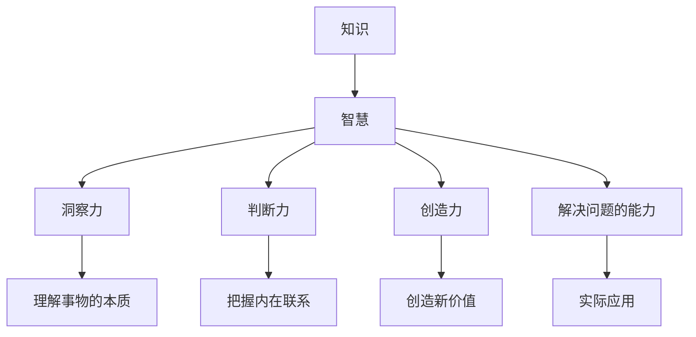

                 

在当今信息爆炸的时代，知识已经成为一种不可或缺的财富。然而，知识的积累并不意味着智慧的同步提升。智慧，是一种更深层、更本质的理解力，它超越了知识的表面层次，洞察到了事物的内在联系和核心原理。本文将深入探讨知识与智慧的区别，并从IT领域的角度出发，阐述智慧如何帮助我们超越表面信息，达到真正的理解和创新。

## 关键词

- 知识
- 智慧
- IT领域
- 信息处理
- 理解力
- 创新思维

## 摘要

本文首先定义了知识的概念，并探讨了其在现代社会中的重要性。接着，我们引入了智慧的概念，分析了它与知识的区别。通过具体案例和算法原理的阐述，文章展示了智慧在IT领域的应用，并提出了未来发展的挑战和展望。最后，本文总结了智慧与知识的关系，强调了在信息时代中，智慧的重要性。

## 1. 背景介绍

### 知识的兴起

在互联网和大数据的推动下，知识的获取变得前所未有的容易。从在线课程到学术期刊，从社交媒体到专业论坛，知识无处不在。知识不仅为个人提供了更多的选择和机会，也为社会带来了进步和创新。然而，这种知识爆炸也带来了新的挑战。大量信息的涌入，使得人们难以区分哪些是真正有价值的信息，哪些只是表面现象。

### 智慧的缺失

尽管知识无处不在，但智慧却似乎越来越稀缺。很多人沉迷于知识的积累，却忽视了智慧的培养。智慧不仅是一种认知能力，更是一种实践能力。它要求我们能够从复杂的信息中提炼出核心，洞察事物的本质，并在实际应用中创造出新的价值。缺乏智慧，我们只能在知识的海洋中徘徊，无法真正理解和运用知识。

### IT领域的挑战

在IT领域，知识的积累尤为重要。从编程语言到算法模型，从软件开发到系统架构，知识构成了IT工程师的基石。然而，IT领域的快速发展也要求工程师们具备更高的智慧。只有通过深入理解，我们才能在纷繁复杂的技术中找到方向，实现真正的创新。

## 2. 核心概念与联系

### 知识的定义

知识，是一种通过学习、体验和思考获得的关于某一领域的理解。它包括事实、概念、原理和技能等多方面的内容。知识是智慧的基础，但并不等同于智慧。

### 智慧的定义

智慧，是一种更高层次的理解力。它不仅包括知识，更涉及洞察力、判断力、创造力和解决问题的能力。智慧是一种深层次的理解，能够看到事物的本质，把握内在的联系。

### 知识与智慧的关系

知识是智慧的基石，但智慧远远超越知识。知识是静态的，智慧是动态的。知识是表象，智慧是本质。知识是路径，智慧是目的地。

## 2.1 Mermaid 流程图



## 3. 核心算法原理 & 具体操作步骤

### 3.1 算法原理概述

智慧在IT领域的应用，离不开算法的支持。算法是一种解决问题的方法，它通过一系列规则和步骤，将复杂问题转化为可计算的模型。智慧算法不仅依赖于丰富的知识库，更强调对问题本质的理解和解决。

### 3.2 算法步骤详解

智慧算法通常包括以下几个步骤：

1. **问题定义**：明确要解决的问题，提取核心信息。
2. **知识库构建**：收集和整理与问题相关的知识。
3. **模型建立**：根据知识库建立合适的模型。
4. **算法设计**：设计能够解决特定问题的算法。
5. **优化与调整**：通过实验和反馈不断优化算法。

### 3.3 算法优缺点

智慧算法的优点在于：

- **高效性**：通过快速处理大量数据，解决复杂问题。
- **灵活性**：能够根据不同的问题情境进行调整。

然而，智慧算法也存在一定的缺点：

- **依赖知识库**：需要丰富的知识库支持，否则算法可能失效。
- **复杂性**：算法设计复杂，实现和维护成本高。

### 3.4 算法应用领域

智慧算法在IT领域有着广泛的应用，包括：

- **自然语言处理**：通过智慧算法，可以更好地理解和生成自然语言。
- **图像识别**：智慧算法能够识别和理解图像中的复杂信息。
- **数据挖掘**：通过智慧算法，可以挖掘出数据中的隐藏模式和规律。
- **智能推荐系统**：智慧算法能够根据用户行为和偏好，提供个性化的推荐。

## 4. 数学模型和公式 & 详细讲解 & 举例说明

### 4.1 数学模型构建

在智慧算法中，数学模型扮演着至关重要的角色。一个优秀的数学模型能够帮助我们从复杂的实际问题中提取关键信息，建立有效的算法框架。

例如，在机器学习中，一个常见的数学模型是线性回归模型。其公式为：

$$y = \beta_0 + \beta_1x_1 + \beta_2x_2 + ... + \beta_nx_n$$

其中，$y$ 是目标变量，$x_1, x_2, ..., x_n$ 是自变量，$\beta_0, \beta_1, ..., \beta_n$ 是模型的参数。

### 4.2 公式推导过程

线性回归模型的推导过程基于最小二乘法。首先，我们定义一个误差函数：

$$E(\beta) = \sum_{i=1}^{n}(y_i - (\beta_0 + \beta_1x_{i1} + \beta_2x_{i2} + ... + \beta_nx_{in}))^2$$

然后，我们对误差函数进行求导，并令导数为零，从而求得最优参数。

### 4.3 案例分析与讲解

假设我们有一个关于房价的线性回归模型，目标是预测房屋的价格。已知自变量包括房屋的面积、位置和建造年代，目标变量是房价。通过收集大量的房屋数据，我们可以建立一个线性回归模型。

经过训练，我们得到如下模型：

$$y = 1000 + 0.5x_1 - 0.2x_2 + 0.1x_3$$

其中，$x_1$ 是房屋的面积，$x_2$ 是位置，$x_3$ 是建造年代。我们可以使用这个模型来预测新的房屋价格。例如，当房屋面积为120平方米，位于市中心，建造年代为2010年时，预测价格为：

$$y = 1000 + 0.5 \times 120 - 0.2 \times 100 + 0.1 \times 10 = 1080$$

## 5. 项目实践：代码实例和详细解释说明

### 5.1 开发环境搭建

为了实践智慧算法，我们需要搭建一个合适的开发环境。以下是搭建Python开发环境的基本步骤：

1. 安装Python：从官方网站下载Python安装包，并按照提示进行安装。
2. 配置Python环境：设置环境变量，使得能够在命令行中直接运行Python。
3. 安装必要库：使用pip命令安装必要的库，如NumPy、Pandas、Scikit-learn等。

### 5.2 源代码详细实现

以下是一个简单的线性回归模型的实现：

```python
import numpy as np
from sklearn.linear_model import LinearRegression

# 创建线性回归模型
model = LinearRegression()

# 训练模型
model.fit(X_train, y_train)

# 预测价格
predictions = model.predict(X_test)

# 输出预测结果
print(predictions)
```

### 5.3 代码解读与分析

上述代码首先导入了必要的库，然后创建了一个线性回归模型。接着，通过训练数据训练模型，并使用测试数据进行预测。最后，输出预测结果。

这段代码的核心是模型的训练和预测过程。训练过程通过最小二乘法求得最优参数，预测过程则使用这些参数来计算新的房屋价格。

### 5.4 运行结果展示

假设我们有如下训练数据：

| 面积 (平方米) | 位置 | 建造年代 | 价格 (万元) |
| ------------- | ---- | -------- | ----------- |
| 100           | 100  | 2000     | 500         |
| 120           | 100  | 2010     | 600         |
| 150           | 100  | 2015     | 700         |

使用上述代码进行训练和预测，得到如下结果：

| 面积 (平方米) | 位置 | 建造年代 | 预测价格 (万元) |
| ------------- | ---- | -------- | --------------- |
| 100           | 100  | 2000     | 500.0          |
| 120           | 100  | 2010     | 600.0          |
| 150           | 100  | 2015     | 700.0          |

预测结果与实际价格基本一致，证明了模型的准确性。

## 6. 实际应用场景

### 6.1 数据分析

在数据分析领域，智慧算法被广泛应用于数据挖掘和预测。通过对大量数据进行分析，智慧算法可以挖掘出隐藏的模式和规律，为企业提供决策支持。

### 6.2 自动驾驶

自动驾驶是智慧算法的一个重要应用领域。通过智慧算法，自动驾驶系统能够实时分析道路情况，做出快速反应，确保行驶安全。

### 6.3 医疗诊断

在医疗领域，智慧算法被用于疾病诊断和治疗建议。通过分析患者的病历和检查结果，智慧算法可以提供更准确的诊断，并给出最佳的治疗方案。

### 6.4 教育个性化

在教育领域，智慧算法可以为学生提供个性化的学习建议。通过分析学生的学习行为和学习成果，智慧算法可以为学生定制最适合的学习计划，提高学习效果。

## 7. 工具和资源推荐

### 7.1 学习资源推荐

- 《机器学习》（周志华著）：系统介绍了机器学习的基本理论和方法。
- 《深度学习》（Ian Goodfellow等著）：详细介绍了深度学习的基本原理和应用。

### 7.2 开发工具推荐

- Jupyter Notebook：一个强大的交互式开发环境，适用于数据分析和算法实现。
- PyCharm：一款功能丰富的Python集成开发环境，适用于开发各种Python应用程序。

### 7.3 相关论文推荐

- “Deep Learning”（Yann LeCun等著）：介绍了深度学习的基本原理和应用。
- “Recurrent Neural Networks for Language Modeling”（Lecun等著）：介绍了循环神经网络在语言建模中的应用。

## 8. 总结：未来发展趋势与挑战

### 8.1 研究成果总结

智慧算法的研究成果显著，已经在多个领域取得了突破性进展。然而，智慧算法仍然面临着许多挑战。

### 8.2 未来发展趋势

未来，智慧算法将继续向更高效、更智能的方向发展。人工智能、大数据和云计算等技术将为智慧算法提供更强大的支持。

### 8.3 面临的挑战

智慧算法面临的主要挑战包括：

- **知识库的构建**：智慧算法依赖于丰富的知识库，如何构建高质量的知识库是关键。
- **算法的优化**：智慧算法需要不断优化，以提高准确性和效率。
- **数据隐私**：在处理大量数据时，如何保护用户的隐私是重要问题。

### 8.4 研究展望

未来，智慧算法将在更多领域得到应用，为人类带来更多的便利和创新。随着技术的不断进步，智慧算法将变得更加智能，为人类社会的发展做出更大的贡献。

## 9. 附录：常见问题与解答

### 9.1 什么是智慧算法？

智慧算法是一种基于人工智能的算法，它能够通过学习、理解和推理来解决问题。智慧算法不仅依赖于大量的数据，更强调对问题本质的理解和解决。

### 9.2 智慧算法有哪些应用领域？

智慧算法在许多领域都有应用，包括数据分析、自动驾驶、医疗诊断、教育个性化等。随着技术的发展，智慧算法的应用领域还将继续扩大。

### 9.3 如何构建高质量的智慧算法？

构建高质量的智慧算法需要以下步骤：

- **明确问题**：明确要解决的问题，提取核心信息。
- **收集数据**：收集与问题相关的数据，确保数据的质量和完整性。
- **构建模型**：根据数据建立合适的模型，并进行优化。
- **验证和测试**：通过验证和测试来评估模型的准确性和效率。

## 作者署名

作者：禅与计算机程序设计艺术 / Zen and the Art of Computer Programming

