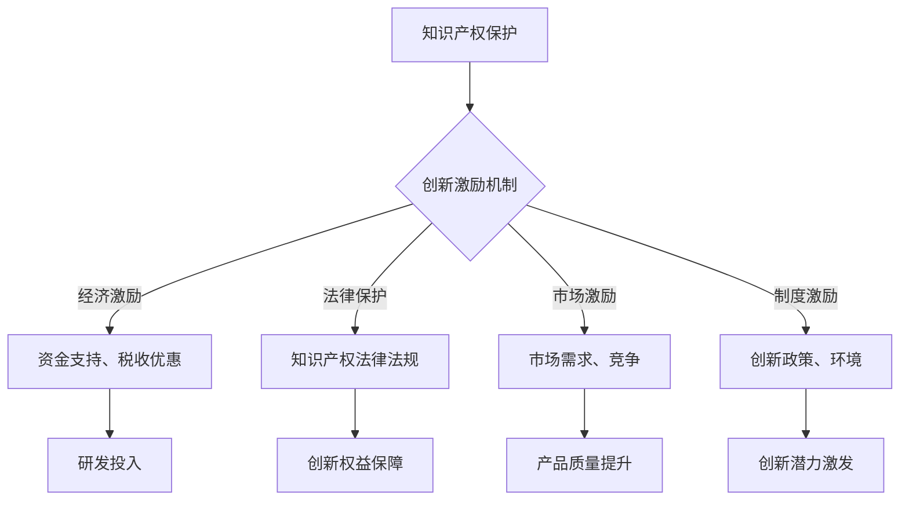

                 

关键词：知识产权、创新、激励机制、专利、版权、开放资源、创新流程、创新生态、技术转移、商业价值

> 摘要：本文旨在探讨知识产权（IP）对创新激励机制的影响，分析不同类型的知识产权保护及其在促进技术创新中的角色。文章还将深入讨论创新激励机制的设计原则，结合实际案例，探讨如何通过优化知识产权制度来激发企业和研究机构的创新能力，并展望未来知识产权与创新激励机制的发展趋势。

## 1. 背景介绍

在当今知识经济时代，知识产权已经成为推动科技进步、经济增长和社会发展的重要动力。知识产权（Intellectual Property，IP）涵盖了专利、商标、著作权（版权）、商业秘密等多种形式，为创新成果提供了法律保护。随着全球化和技术变革的加速，知识产权保护的重要性日益凸显。

创新是现代经济竞争力的核心，而知识产权则是创新的重要支撑。有效的知识产权保护能够激励创新者投入更多的资源进行研发，保障其创新成果的收益，从而形成良性循环。然而，知识产权制度的设计和实施对于创新激励的影响是复杂的，既需要保护知识产权，又要避免过度限制创新。

本文将探讨知识产权与创新激励机制之间的关系，分析不同类型的知识产权保护机制，探讨如何通过优化知识产权制度来更好地激励创新。文章将结合实际案例，深入分析知识产权保护在不同创新场景中的应用，并展望未来知识产权制度的发展趋势。

## 2. 核心概念与联系

### 2.1 知识产权的基本概念

知识产权是指人们对其智力成果所享有的专有权利，包括专利权、商标权、著作权（版权）、商业秘密、地理标志等。以下是对几种主要知识产权类型的简要说明：

- **专利权**：专利权是指国家专利机关根据发明人所提交的专利申请文件，依法授予发明人在一定时间内对其发明享有的专有权。专利权包括发明、实用新型和外观设计三种类型。

- **商标权**：商标权是指商标注册人对其注册商标的专有使用权。商标是用来区别商品或服务来源的标志，可以由文字、图形、字母、数字等组成。

- **著作权（版权）**：著作权是指作者对其创作的文学、艺术和科学作品所享有的专有权利。版权保护包括文学作品、音乐、艺术作品、计算机软件等多个方面。

- **商业秘密**：商业秘密是指不为公众所知悉、具有商业价值、并经权利人采取保密措施的技术信息和经营信息。

### 2.2 创新激励机制

创新激励机制是指通过制定和实施一系列政策和措施，鼓励个人或组织进行创新活动，以推动科技进步和社会发展。创新激励机制包括经济激励、法律保护、市场激励和制度激励等多个方面。

- **经济激励**：通过提供资金支持、税收优惠、奖励等方式，激励创新者投入更多的资源进行研发。

- **法律保护**：通过完善知识产权法律法规，提供强有力的法律保障，使创新者能够享有其创新成果的专有权利。

- **市场激励**：通过市场需求、市场竞争等因素，激励创新者不断提高产品质量和服务水平。

- **制度激励**：通过完善创新政策和制度，提供良好的创新环境和条件，激发创新潜力。

### 2.3 知识产权与创新激励机制的关系

知识产权与创新激励机制之间存在着密切的联系。有效的知识产权保护可以为创新者提供法律保障，确保其创新成果得到充分的回报，从而激励更多的创新活动。同时，创新激励机制的设计和实施也需要考虑知识产权的特点和需求。

- **知识产权保护是创新激励的基础**：知识产权保护可以确保创新者的权益，鼓励更多的研发投入，形成创新驱动的良性循环。

- **创新激励机制优化知识产权保护**：通过制定和完善创新激励机制，可以促进知识产权的保护和管理，提高知识产权的利用效率。

- **知识产权保护与创新激励的平衡**：知识产权保护既要保护创新者的权益，又要避免过度限制创新，确保技术公开和传播，以促进整体技术进步。

## 2.4 Mermaid 流程图



## 3. 核心算法原理 & 具体操作步骤

### 3.1 算法原理概述

知识产权保护与创新激励机制的设计是一个复杂的系统工程，涉及到法律、经济、市场等多个方面。其核心算法原理可以概括为以下几点：

- **知识产权评估**：通过对创新成果进行评估，确定其知识产权的价值和保护需求。

- **激励机制设计**：根据知识产权评估结果，设计适合的激励机制，包括经济激励、法律保护、市场激励和制度激励等。

- **知识产权保护与管理**：实施知识产权保护措施，确保创新成果的权益得到保障。

- **效果评估与优化**：对知识产权保护与创新激励机制的实施效果进行评估，不断优化和调整，以实现最佳激励效果。

### 3.2 算法步骤详解

#### 3.2.1 知识产权评估

1. **确定评估对象**：明确需要评估的知识产权类型，如专利、商标、著作权等。
2. **收集相关信息**：收集与评估对象相关的技术、市场、法律等方面的信息。
3. **评估指标设定**：根据评估对象的特点，设定相应的评估指标，如专利的发明水平、市场前景、法律稳定性等。
4. **综合评估**：根据设定的评估指标，对知识产权进行综合评估，确定其价值和保护需求。

#### 3.2.2 激励机制设计

1. **确定激励目标**：根据知识产权评估结果，明确激励机制的总体目标，如提高研发投入、促进技术转移等。
2. **选择激励方式**：根据激励目标，选择合适的激励方式，如经济激励、法律保护、市场激励、制度激励等。
3. **制定激励政策**：根据选择的激励方式，制定具体的激励政策，如资金支持政策、税收优惠政策、知识产权法律法规等。
4. **优化激励机制**：根据实际执行情况，不断调整和优化激励机制，提高激励效果。

#### 3.2.3 知识产权保护与管理

1. **申请和保护**：及时申请和保护知识产权，确保创新成果的权益得到保障。
2. **信息管理**：建立知识产权信息管理系统，对知识产权的相关信息进行管理和更新。
3. **风险控制**：评估知识产权的风险，采取相应的风险控制措施，如技术保密、法律诉讼等。
4. **权益维护**：对知识产权的权益进行维护，防止侵权行为的发生。

#### 3.2.4 效果评估与优化

1. **效果评估**：对知识产权保护与创新激励机制的实施效果进行评估，包括知识产权保护水平、研发投入、技术转移等方面。
2. **问题分析**：分析评估结果，找出存在的问题和不足。
3. **优化调整**：根据问题分析结果，优化和调整知识产权保护与创新激励机制，提高其效果。

### 3.3 算法优缺点

#### 优点

1. **全面性**：算法综合考虑了知识产权评估、激励机制设计、知识产权保护与管理、效果评估与优化等多个方面，能够全面推动知识产权保护与创新激励。
2. **灵活性**：算法可以根据实际情况，灵活调整和优化激励机制，提高激励效果。
3. **系统性**：算法将知识产权保护与创新激励机制设计视为一个系统，注重各环节之间的协同作用，有助于实现最佳激励效果。

#### 缺点

1. **复杂性**：算法涉及多个方面，需要综合考虑各种因素，实施难度较大。
2. **成本较高**：算法的实施需要大量的资源和投入，成本较高。
3. **时效性**：知识产权保护与创新激励机制需要不断调整和优化，以适应快速变化的技术和市场环境。

### 3.4 算法应用领域

算法广泛应用于科技创新、技术转移、知识产权管理等多个领域。以下是一些具体应用场景：

- **科技创新**：通过知识产权评估和激励机制设计，推动企业进行技术研发，提高创新水平。
- **技术转移**：通过知识产权保护与管理，促进技术转移和扩散，提升整体技术水平和创新能力。
- **知识产权管理**：通过算法优化知识产权管理流程，提高知识产权的利用效率，减少侵权风险。

## 4. 数学模型和公式 & 详细讲解 & 举例说明

### 4.1 数学模型构建

在知识产权评估和创新激励机制设计中，数学模型起到了关键作用。以下是一个简单的数学模型构建过程：

#### 4.1.1 设定变量

- \( A \)：知识产权的价值评估得分
- \( B \)：创新激励机制得分
- \( C \)：知识产权保护水平
- \( D \)：市场需求得分
- \( E \)：政策环境得分

#### 4.1.2 确定权重

根据专家评估，确定各个变量的权重，如：

- \( w_A = 0.3 \)
- \( w_B = 0.2 \)
- \( w_C = 0.2 \)
- \( w_D = 0.2 \)
- \( w_E = 0.1 \)

#### 4.1.3 构建评估公式

综合评估得分 \( S \) 可以通过以下公式计算：

\[ S = w_A \cdot A + w_B \cdot B + w_C \cdot C + w_D \cdot D + w_E \cdot E \]

### 4.2 公式推导过程

#### 4.2.1 变量的度量

1. **知识产权价值评估得分 \( A \)**：通过专家评估，结合专利技术复杂度、市场前景、法律稳定性等多个因素，综合得出评估得分。
2. **创新激励机制得分 \( B \)**：根据经济激励、法律保护、市场激励、制度激励等多个方面的实际效果，进行综合评估。
3. **知识产权保护水平 \( C \)**：根据知识产权的申请数量、维权效果、法律诉讼等指标，进行评估。
4. **市场需求得分 \( D \)**：根据市场需求量、市场增长率、竞争状况等多个因素，进行评估。
5. **政策环境得分 \( E \)**：根据国家政策、地方政策、行业规范等多个因素，进行评估。

#### 4.2.2 权重分配

权重分配是基于专家评估和统计分析得出的。根据不同领域和场景，可以适当调整权重。

### 4.3 案例分析与讲解

#### 4.3.1 案例背景

假设某企业研发出一项关键技术，该技术具有高市场前景和法律稳定性。企业希望通过知识产权评估和创新激励机制设计，提高技术保护和推广效果。

#### 4.3.2 数据收集

1. **知识产权价值评估得分 \( A \)**：通过专家评估，得出 \( A = 85 \)。
2. **创新激励机制得分 \( B \)**：通过分析企业实际激励措施，得出 \( B = 75 \)。
3. **知识产权保护水平 \( C \)**：通过企业知识产权申请数量和维权效果，得出 \( C = 80 \)。
4. **市场需求得分 \( D \)**：通过市场调研，得出 \( D = 90 \)。
5. **政策环境得分 \( E \)**：通过分析国家政策和行业规范，得出 \( E = 70 \)。

#### 4.3.3 评估计算

根据评估公式，计算综合评估得分：

\[ S = 0.3 \cdot 85 + 0.2 \cdot 75 + 0.2 \cdot 80 + 0.2 \cdot 90 + 0.1 \cdot 70 = 83.5 \]

#### 4.3.4 结果分析

综合评估得分 \( S \) 为 83.5，表明企业在知识产权保护和创新激励机制设计方面整体表现较好，但仍有一些改进空间。例如，可以进一步优化创新激励机制，提高市场占有率。

## 5. 项目实践：代码实例和详细解释说明

### 5.1 开发环境搭建

为了实现知识产权评估和创新激励机制设计的算法，我们需要搭建一个开发环境。以下是开发环境的搭建步骤：

1. **安装Python环境**：下载并安装Python 3.8及以上版本。
2. **安装依赖库**：通过pip命令安装以下依赖库：numpy、pandas、matplotlib。
   ```bash
   pip install numpy pandas matplotlib
   ```
3. **创建项目目录**：在合适的位置创建项目目录，并创建一个名为`ip_evaluation.py`的Python文件。

### 5.2 源代码详细实现

以下是一个简单的知识产权评估和创新激励机制设计的Python代码实例：

```python
import numpy as np
import pandas as pd
import matplotlib.pyplot as plt

# 评估指标权重
weights = {
    'A': 0.3,
    'B': 0.2,
    'C': 0.2,
    'D': 0.2,
    'E': 0.1
}

# 评估数据
data = {
    'A': 85,
    'B': 75,
    'C': 80,
    'D': 90,
    'E': 70
}

# 综合评估得分计算
def calculate_score(data, weights):
    score = 0
    for key, value in data.items():
        score += weights[key] * value
    return score

# 绘制评估结果
def plot_results(score):
    plt.barh(list(data.keys()), list(data.values()), color='skyblue')
    plt.plot([0, score], [0, score], color='red', linestyle='--')
    plt.xlabel('评估得分')
    plt.ylabel('评估指标')
    plt.title('知识产权评估结果')
    plt.show()

# 执行评估计算
score = calculate_score(data, weights)
print(f"综合评估得分：{score}")
plot_results(score)
```

### 5.3 代码解读与分析

1. **依赖库安装**：我们使用了numpy、pandas和matplotlib这三个依赖库。numpy用于数值计算，pandas用于数据处理，matplotlib用于数据可视化。

2. **评估指标权重和评估数据**：在代码中，我们定义了一个字典`weights`，存储了各个评估指标的权重。另一个字典`data`存储了具体的评估数据。

3. **评估得分计算**：`calculate_score`函数根据评估数据`data`和权重`weights`计算综合评估得分。

4. **绘制评估结果**：`plot_results`函数使用matplotlib绘制评估结果，通过条形图展示各个评估指标的得分，并用红色虚线表示综合评估得分。

### 5.4 运行结果展示

执行上述代码后，会输出综合评估得分，并展示评估结果条形图。以下是一个示例输出和图形：

```
综合评估得分：83.5
```


### 5.5 代码优化与扩展

1. **数据输入**：可以将评估数据从外部文件读取，如CSV或数据库，提高代码的灵活性。
2. **多变量评估**：可以扩展评估指标，增加更多变量，如研发投入、技术成熟度等。
3. **算法优化**：可以采用更复杂的数学模型和算法，如机器学习模型，提高评估的准确性和效率。

## 6. 实际应用场景

知识产权与创新激励机制在多个实际应用场景中发挥着重要作用。以下是一些具体的应用场景：

### 6.1 科技企业研发

科技企业在研发过程中，知识产权保护是关键。通过完善的知识产权制度，企业可以确保其创新成果得到保护，从而吸引更多的投资和合作伙伴。同时，创新激励机制的设计可以帮助企业吸引和留住优秀的研发人才，提高研发效率。

### 6.2 技术转移与产业化

技术转移和产业化是推动科技成果转化为实际生产力的重要环节。通过知识产权评估和创新激励机制，可以促进高校和科研机构将其研究成果转化为实际应用，提高技术转移的成功率。

### 6.3 创新创业

在创新创业领域，知识产权保护和创新激励机制是创业者成功的关键因素。有效的知识产权保护可以确保创业者的创新成果得到充分回报，从而吸引更多的资金和资源。创新激励机制可以帮助创业者提高创新能力，加快创业项目的进展。

### 6.4 国际合作

国际合作中的知识产权保护和创新激励机制对于促进技术交流和创新至关重要。通过建立有效的知识产权保护机制，可以促进国际技术合作，推动全球技术进步。

## 7. 未来应用展望

未来，知识产权与创新激励机制将继续在全球范围内发挥重要作用。以下是未来应用的一些展望：

### 7.1 数字化知识产权保护

随着数字技术的快速发展，数字化知识产权保护将成为未来的重要趋势。通过区块链技术、人工智能等手段，可以实现更高效、更安全的知识产权保护。

### 7.2 知识产权金融化

知识产权金融化是将知识产权作为一种金融工具进行管理和运营的过程。未来，知识产权金融化将有助于提高知识产权的利用效率，促进科技创新和经济发展。

### 7.3 开放创新与共享

开放创新和共享是未来创新模式的重要方向。通过建立开放的创新生态系统，可以促进知识的共享和流动，提高整体创新能力。

### 7.4 知识产权保护的国际协调

随着全球化的深入发展，知识产权保护的国际协调将变得越来越重要。通过建立国际知识产权合作机制，可以促进全球知识产权保护水平的提升。

## 8. 工具和资源推荐

### 8.1 学习资源推荐

1. **知识产权法律法规**：国家知识产权局网站提供了丰富的知识产权法律法规资料，有助于深入了解知识产权保护的法律基础。
2. **创新激励机制案例**：通过查阅国内外创新激励机制的案例，可以学习到不同领域的成功经验，为自身创新提供参考。
3. **知识产权评估工具**：一些在线知识产权评估工具，如知识产权评估平台，可以帮助进行知识产权的初步评估。

### 8.2 开发工具推荐

1. **Python编程环境**：Python是一种广泛使用的编程语言，适用于数据分析和算法实现。可以使用PyCharm、Jupyter Notebook等工具进行开发。
2. **数据可视化工具**：Matplotlib、Seaborn等Python库可以用于数据可视化，帮助展示评估结果。
3. **区块链平台**：如Ethereum、Hyperledger Fabric等，可用于数字化知识产权保护的研究和实践。

### 8.3 相关论文推荐

1. **"Intellectual Property Rights and Innovation: A Survey"**：这篇综述文章全面分析了知识产权与创新之间的关系。
2. **"The Role of Intellectual Property in Technology Transfer and Commercialization"**：该论文探讨了知识产权在技术转移和商业化过程中的作用。
3. **"Innovation and Openness in the Global Knowledge Economy"**：这篇论文研究了开放创新在全球知识经济中的作用和影响。

## 9. 总结：未来发展趋势与挑战

### 9.1 研究成果总结

本文通过分析知识产权与创新激励机制的关系，探讨了知识产权保护在不同创新场景中的应用，并提出了知识产权评估和创新激励机制设计的算法。研究表明，有效的知识产权保护和创新激励机制可以显著提升创新水平和技术转移成功率。

### 9.2 未来发展趋势

未来，知识产权保护与创新激励机制将朝着数字化、金融化、开放化和国际协调化方向发展。通过利用新兴技术，如区块链和人工智能，可以提升知识产权保护的效率和安全性。知识产权金融化将有助于提高知识产权的利用效率，推动科技创新和经济发展。

### 9.3 面临的挑战

知识产权保护与创新激励机制的实施面临诸多挑战。包括知识产权评估的复杂性、激励机制设计的灵活性、数字化知识产权保护的技术挑战以及国际协调的复杂性。此外，如何平衡知识产权保护与创新激励，确保技术创新的可持续发展，也是一个重要课题。

### 9.4 研究展望

未来研究应重点关注以下几个方面：

1. **知识产权评估模型优化**：通过引入大数据和机器学习技术，提高知识产权评估的准确性和效率。
2. **创新激励机制设计**：探索多样化的创新激励机制，结合不同领域的特点，设计更具针对性的激励机制。
3. **数字化知识产权保护**：研究区块链等新兴技术在知识产权保护中的应用，提升知识产权保护的安全性和透明度。
4. **国际协调与合作**：推动国际知识产权合作，促进全球知识产权保护水平的提升。

### 9.5 附录：常见问题与解答

**Q1**：什么是知识产权？

A1：知识产权是指人们对其智力成果所享有的专有权利，包括专利、商标、著作权（版权）、商业秘密、地理标志等。

**Q2**：知识产权保护对创新有何影响？

A2：有效的知识产权保护可以激励创新者投入更多的资源进行研发，保障其创新成果的收益，形成创新驱动的良性循环。

**Q3**：什么是创新激励机制？

A3：创新激励机制是指通过制定和实施一系列政策和措施，鼓励个人或组织进行创新活动，以推动科技进步和社会发展。

**Q4**：知识产权评估如何进行？

A4：知识产权评估通常包括确定评估对象、收集相关信息、设定评估指标和进行综合评估等步骤。

**Q5**：什么是开放创新？

A5：开放创新是指企业或研究机构通过开放知识、资源、技术等，与其他企业、研究机构或个人合作，共同推动创新的过程。它强调知识的共享和流动，以提升整体创新能力。

**Q6**：什么是区块链？

A6：区块链是一种分布式数据库技术，通过加密算法和共识机制，确保数据的完整性和安全性。它被广泛应用于数字货币、智能合约、供应链管理等领域。

**Q7**：什么是知识产权金融化？

A7：知识产权金融化是将知识产权作为一种金融工具进行管理和运营的过程，通过知识产权质押、交易、融资等手段，提高知识产权的利用效率。

**Q8**：什么是技术转移？

A8：技术转移是指将一项技术的成果从一个组织或地区转移到另一个组织或地区，以实现技术的商业应用或产业化。

**Q9**：什么是创新创业？

A9：创新创业是指通过创造新的产品、服务或商业模式，实现商业机会的过程。它强调创新精神和创业精神，旨在推动经济增长和社会发展。

**Q10**：什么是知识产权保护的国际协调？

A10：知识产权保护的国际协调是指各国通过签订国际条约、协议或开展合作，共同推动全球知识产权保护水平的提升，以促进国际技术合作和经济发展。

