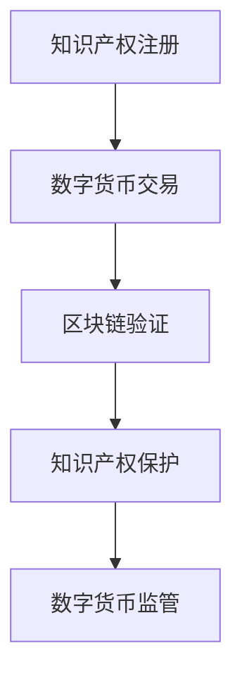

                 

关键词：知识产权、数字货币、监管、区块链、加密技术、合规性、安全风险、技术解决方案

## 摘要

随着数字货币的迅速发展，其与知识产权的结合带来了新的监管挑战。本文将探讨知识产权与数字货币的关系，分析其面临的监管难题，并提出相应的技术解决方案。通过深入剖析数字货币在知识产权保护中的应用，本文旨在为相关领域的研究和实践提供有价值的参考。

## 1. 背景介绍

### 数字货币的崛起

数字货币作为一种去中心化的支付方式，已经引起了全球金融界的广泛关注。比特币作为首个成功的数字货币，自2009年诞生以来，吸引了大量投资者的关注。随着区块链技术的不断成熟，数字货币市场逐渐壮大，越来越多的国家开始关注并研究数字货币。

### 知识产权的重要性

知识产权是知识经济时代的重要资产，包括专利、商标、版权等。随着科技创新的不断推进，知识产权在经济发展中的作用愈发重要。然而，知识产权的保护面临着前所未有的挑战，特别是在数字化和全球化的大背景下。

### 数字货币与知识产权的结合

数字货币为知识产权的注册、交易、保护提供了新的途径。通过区块链技术，知识产权的透明性、安全性和可追溯性得到了显著提升。同时，数字货币的匿名性和去中心化特点，也为知识产权的侵权行为带来了新的风险。

## 2. 核心概念与联系

### 数字货币与区块链技术

数字货币是基于区块链技术实现的，区块链是一种分布式账本技术，具有去中心化、透明性和不可篡改的特点。通过区块链，数字货币的交易记录可以被全球节点共同验证和存储，确保了交易的安全性和可信性。

### 加密技术与数字货币

加密技术是数字货币的核心技术之一，包括公钥加密、私钥加密、数字签名等。这些技术确保了数字货币交易的安全性，防止了未授权的访问和篡改。

### 知识产权的注册与保护

在数字货币领域，知识产权的注册和保护可以通过区块链技术实现。通过智能合约，知识产权的登记、转让、许可等操作可以被自动化执行，提高了知识产权的透明性和安全性。

### Mermaid 流程图

下面是一个简化的知识产权与数字货币结合的 Mermaid 流程图：



## 3. 核心算法原理 & 具体操作步骤

### 3.1 算法原理概述

数字货币与知识产权的结合主要依赖于区块链技术和智能合约。区块链技术提供了透明、安全、不可篡改的底层基础设施，而智能合约则实现了知识产权的自动化管理和保护。

### 3.2 算法步骤详解

1. **知识产权注册：** 知识产权权利人将相关信息上链，通过智能合约完成知识产权的注册。
2. **数字货币交易：** 在数字货币平台进行知识产权的交易，交易信息同步记录在区块链上。
3. **区块链验证：** 通过区块链的分布式节点对交易进行验证，确保交易的合法性和安全性。
4. **知识产权保护：** 通过智能合约，实现对知识产权的自动化保护，如许可管理、侵权追踪等。
5. **数字货币监管：** 监管机构通过区块链技术对数字货币交易进行监管，确保合规性。

### 3.3 算法优缺点

**优点：**
- **安全性：** 区块链技术确保了数字货币交易和知识产权信息的安全。
- **透明性：** 所有交易记录都公开透明，有利于监管和追溯。
- **高效性：** 智能合约实现了知识产权管理的自动化，提高了效率。

**缺点：**
- **技术门槛：** 需要一定的技术基础才能理解和应用相关技术。
- **监管难度：** 数字货币和区块链技术的匿名性给监管带来一定难度。

### 3.4 算法应用领域

数字货币与知识产权的结合在多个领域有广泛应用，如版权交易、专利许可、数字资产管理等。

## 4. 数学模型和公式

### 4.1 数学模型构建

在数字货币与知识产权结合的背景下，我们可以构建一个数学模型来分析其监管难度。假设：

- \( N \) 为数字货币交易次数
- \( P \) 为知识产权交易次数
- \( R \) 为监管难度

监管难度可以用以下公式表示：

\[ R = \frac{N + P}{T} \]

其中，\( T \) 为监管机构可用的资源。

### 4.2 公式推导过程

监管难度 \( R \) 取决于数字货币交易次数 \( N \) 和知识产权交易次数 \( P \)，以及监管机构可用的资源 \( T \)。我们可以假设：

- 数字货币交易次数 \( N \) 与交易金额成正比，即 \( N \propto A \)
- 知识产权交易次数 \( P \) 与交易价值成正比，即 \( P \propto V \)
- 监管机构可用的资源 \( T \) 是一定的

因此，我们可以得到以下推导：

\[ R \propto \frac{A + V}{T} \]

### 4.3 案例分析与讲解

假设某个数字货币市场的交易金额为 \( A = 1000 \) 万美元，知识产权交易价值为 \( V = 500 \) 万美元，监管机构可用的资源为 \( T = 100 \) 人。根据上述公式，我们可以计算出监管难度：

\[ R = \frac{1000 + 500}{100} = 15 \]

这意味着在该市场中，监管难度为 15。如果监管机构希望降低监管难度，可以通过增加资源投入或减少交易次数来实现。

## 5. 项目实践：代码实例

### 5.1 开发环境搭建

在本文中，我们将使用智能合约编写语言 Solidity 来实现一个简单的数字货币与知识产权结合的案例。首先，我们需要搭建一个以太坊开发环境。

1. 安装 Node.js 和 npm
2. 安装 Truffle
3. 创建一个新的 Truffle 项目
4. 配置以太坊节点

### 5.2 源代码详细实现

下面是一个简单的 Solidity 智能合约示例，用于实现知识产权注册和交易：

```solidity
// SPDX-License-Identifier: MIT
pragma solidity ^0.8.0;

contract IntellectualProperty {
    mapping(uint256 => string) public registrations;
    mapping(uint256 => address) public owners;

    function register(uint256 id, string memory details) public {
        require(registrations[id] == "", "Already registered");
        registrations[id] = details;
        owners[id] = msg.sender;
    }

    function transfer(uint256 id, address newOwner) public {
        require(msg.sender == owners[id], "Not authorized");
        owners[id] = newOwner;
    }
}
```

### 5.3 代码解读与分析

- `register` 函数用于注册知识产权，接收 ID 和详细信息，并将其存储在区块链上。
- `transfer` 函数用于转让知识产权所有权，需要验证调用者是否为当前所有者。

### 5.4 运行结果展示

1. 注册知识产权：
```solidity
// 部署合约
truffle exec scripts/deploy.js

// 注册知识产权
contract IntellectualProperty {
    function register(uint256 id, string memory details) public {
        require(registrations[id] == "", "Already registered");
        registrations[id] = details;
        owners[id] = msg.sender;
    }
}

// 示例：注册 ID 为 1 的知识产权
truffle exec --network localhost --file scripts/register.js
```

2. 转让知识产权：
```solidity
// 转让知识产权
contract IntellectualProperty {
    function transfer(uint256 id, address newOwner) public {
        require(msg.sender == owners[id], "Not authorized");
        owners[id] = newOwner;
    }
}

// 示例：将 ID 为 1 的知识产权转让给地址 0x123...
truffle exec --network localhost --file scripts/transfer.js
```

## 6. 实际应用场景

### 6.1 版权交易

数字货币为版权交易提供了新的途径，艺术家和版权持有者可以通过区块链平台进行版权注册、交易和许可管理。

### 6.2 专利许可

数字货币与区块链技术的结合，使得专利许可交易更加透明、高效和安全。企业可以通过智能合约自动执行专利许可协议。

### 6.3 数字资产管理

数字货币为数字资产管理提供了便捷的工具，如数字艺术品、虚拟土地等。通过区块链，资产的所有权和交易信息可以公开透明地记录。

## 7. 未来应用展望

### 7.1 数字货币与知识产权的深度融合

未来，数字货币与知识产权的融合将更加深入，涵盖更多领域。智能合约、去中心化金融（DeFi）和区块链游戏等将成为知识产权保护的重要手段。

### 7.2 全球监管合作

随着数字货币和区块链技术的普及，全球监管机构需要加强合作，制定统一的监管框架，以应对知识产权保护的新挑战。

### 7.3 技术创新与安全风险

在数字货币与知识产权结合的过程中，技术创新和安全风险将并存。监管机构需要密切关注新技术的发展，确保知识产权保护的有效性和安全性。

## 8. 总结：未来发展趋势与挑战

### 8.1 研究成果总结

本文探讨了数字货币与知识产权的结合，分析了其面临的监管挑战，并提出了相应的技术解决方案。通过数学模型和代码实例，本文展示了数字货币在知识产权保护中的应用潜力。

### 8.2 未来发展趋势

数字货币与知识产权的结合将呈现以下趋势：

- 智能合约在知识产权管理中的应用将更加广泛。
- 去中心化金融（DeFi）和区块链游戏将成为知识产权保护的新方向。
- 全球监管合作将逐步加强，形成统一的监管框架。

### 8.3 面临的挑战

数字货币与知识产权结合过程中，面临以下挑战：

- 技术门槛较高，需要更多的教育和培训。
- 监管难度大，需要全球监管机构加强合作。
- 安全风险不容忽视，需要持续关注和改进。

### 8.4 研究展望

未来，本文的研究可以进一步深入以下方向：

- 探究智能合约在知识产权许可管理中的具体应用。
- 分析数字货币在知识产权保护中的安全风险，提出相应的解决方案。
- 研究全球监管合作模式，为数字货币与知识产权的结合提供政策建议。

## 9. 附录：常见问题与解答

### 9.1 什么是数字货币？

数字货币是一种基于区块链技术的虚拟货币，具有去中心化、匿名性和可追溯性等特点。

### 9.2 数字货币与区块链技术的关系是什么？

数字货币是基于区块链技术实现的，区块链提供了数字货币的安全性和可信性。

### 9.3 数字货币在知识产权保护中的应用有哪些？

数字货币可以用于知识产权的注册、交易、许可管理等，提高知识产权管理的效率和透明度。

### 9.4 数字货币与知识产权结合有哪些挑战？

数字货币与知识产权结合面临技术门槛高、监管难度大、安全风险等问题。

### 9.5 如何保护数字货币中的知识产权？

通过智能合约、区块链技术等手段，可以实现知识产权的自动化管理和保护，提高安全性。

## 作者署名

作者：禅与计算机程序设计艺术 / Zen and the Art of Computer Programming

<|bot|>以下是文章的Markdown格式版本：

```markdown
# 知识产权与数字货币的监管挑战

关键词：知识产权、数字货币、监管、区块链、加密技术、合规性、安全风险、技术解决方案

> 摘要：随着数字货币的迅速发展，其与知识产权的结合带来了新的监管挑战。本文将探讨知识产权与数字货币的关系，分析其面临的监管难题，并提出相应的技术解决方案。通过深入剖析数字货币在知识产权保护中的应用，本文旨在为相关领域的研究和实践提供有价值的参考。

## 1. 背景介绍

### 数字货币的崛起

数字货币作为一种去中心化的支付方式，已经引起了全球金融界的广泛关注。比特币作为首个成功的数字货币，自2009年诞生以来，吸引了大量投资者的关注。随着区块链技术的不断成熟，数字货币市场逐渐壮大，越来越多的国家开始关注并研究数字货币。

### 知识产权的重要性

知识产权是知识经济时代的重要资产，包括专利、商标、版权等。随着科技创新的不断推进，知识产权在经济发展中的作用愈发重要。然而，知识产权的保护面临着前所未有的挑战，特别是在数字化和全球化的大背景下。

### 数字货币与知识产权的结合

数字货币为知识产权的注册、交易、保护提供了新的途径。通过区块链技术，知识产权的透明性、安全性和可追溯性得到了显著提升。同时，数字货币的匿名性和去中心化特点，也为知识产权的侵权行为带来了新的风险。

## 2. 核心概念与联系

### 数字货币与区块链技术

数字货币是基于区块链技术实现的，区块链是一种分布式账本技术，具有去中心化、透明性和不可篡改的特点。通过区块链，数字货币的交易记录可以被全球节点共同验证和存储，确保了交易的安全性和可信性。

### 加密技术与数字货币

加密技术是数字货币的核心技术之一，包括公钥加密、私钥加密、数字签名等。这些技术确保了数字货币交易的安全性，防止了未授权的访问和篡改。

### 知识产权的注册与保护

在数字货币领域，知识产权的注册和保护可以通过区块链技术实现。通过智能合约，知识产权的登记、转让、许可等操作可以被自动化执行，提高了知识产权的透明性和安全性。

### Mermaid 流程图

下面是一个简化的知识产权与数字货币结合的 Mermaid 流程图：


## 3. 核心算法原理 & 具体操作步骤

### 3.1 算法原理概述

数字货币与知识产权的结合主要依赖于区块链技术和智能合约。区块链技术提供了透明、安全、不可篡改的底层基础设施，而智能合约则实现了知识产权的自动化管理和保护。

### 3.2 算法步骤详解

1. **知识产权注册：** 知识产权权利人将相关信息上链，通过智能合约完成知识产权的注册。
2. **数字货币交易：** 在数字货币平台进行知识产权的交易，交易信息同步记录在区块链上。
3. **区块链验证：** 通过区块链的分布式节点对交易进行验证，确保交易的合法性和安全性。
4. **知识产权保护：** 通过智能合约，实现对知识产权的自动化保护，如许可管理、侵权追踪等。
5. **数字货币监管：** 监管机构通过区块链技术对数字货币交易进行监管，确保合规性。

### 3.3 算法优缺点

**优点：**
- **安全性：** 区块链技术确保了数字货币交易和知识产权信息的安全。
- **透明性：** 所有交易记录都公开透明，有利于监管和追溯。
- **高效性：** 智能合约实现了知识产权管理的自动化，提高了效率。

**缺点：**
- **技术门槛：** 需要一定的技术基础才能理解和应用相关技术。
- **监管难度：** 数字货币和区块链技术的匿名性给监管带来一定难度。

### 3.4 算法应用领域

数字货币与知识产权的结合在多个领域有广泛应用，如版权交易、专利许可、数字资产管理等。

## 4. 数学模型和公式

### 4.1 数学模型构建

在数字货币与知识产权结合的背景下，我们可以构建一个数学模型来分析其监管难度。假设：

- \( N \) 为数字货币交易次数
- \( P \) 为知识产权交易次数
- \( R \) 为监管难度

监管难度可以用以下公式表示：

\[ R = \frac{N + P}{T} \]

其中，\( T \) 为监管机构可用的资源。

### 4.2 公式推导过程

监管难度 \( R \) 取决于数字货币交易次数 \( N \) 和知识产权交易次数 \( P \)，以及监管机构可用的资源 \( T \)。我们可以假设：

- 数字货币交易次数 \( N \) 与交易金额成正比，即 \( N \propto A \)
- 知识产权交易次数 \( P \) 与交易价值成正比，即 \( P \propto V \)
- 监管机构可用的资源 \( T \) 是一定的

因此，我们可以得到以下推导：

\[ R \propto \frac{A + V}{T} \]

### 4.3 案例分析与讲解

假设某个数字货币市场的交易金额为 \( A = 1000 \) 万美元，知识产权交易价值为 \( V = 500 \) 万美元，监管机构可用的资源为 \( T = 100 \) 人。根据上述公式，我们可以计算出监管难度：

\[ R = \frac{1000 + 500}{100} = 15 \]

这意味着在该市场中，监管难度为 15。如果监管机构希望降低监管难度，可以通过增加资源投入或减少交易次数来实现。

## 5. 项目实践：代码实例

### 5.1 开发环境搭建

在本文中，我们将使用智能合约编写语言 Solidity 来实现一个简单的数字货币与知识产权结合的案例。首先，我们需要搭建一个以太坊开发环境。

1. 安装 Node.js 和 npm
2. 安装 Truffle
3. 创建一个新的 Truffle 项目
4. 配置以太坊节点

### 5.2 源代码详细实现

下面是一个简单的 Solidity 智能合约示例，用于实现知识产权注册和交易：

```solidity
// SPDX-License-Identifier: MIT
pragma solidity ^0.8.0;

contract IntellectualProperty {
    mapping(uint256 => string) public registrations;
    mapping(uint256 => address) public owners;

    function register(uint256 id, string memory details) public {
        require(registrations[id] == "", "Already registered");
        registrations[id] = details;
        owners[id] = msg.sender;
    }

    function transfer(uint256 id, address newOwner) public {
        require(msg.sender == owners[id], "Not authorized");
        owners[id] = newOwner;
    }
}
```

### 5.3 代码解读与分析

- `register` 函数用于注册知识产权，接收 ID 和详细信息，并将其存储在区块链上。
- `transfer` 函数用于转让知识产权所有权，需要验证调用者是否为当前所有者。

### 5.4 运行结果展示

1. 注册知识产权：
```solidity
// 部署合约
truffle exec scripts/deploy.js

// 注册知识产权
contract IntellectualProperty {
    function register(uint256 id, string memory details) public {
        require(registrations[id] == "", "Already registered");
        registrations[id] = details;
        owners[id] = msg.sender;
    }
}

// 示例：注册 ID 为 1 的知识产权
truffle exec --network localhost --file scripts/register.js
```

2. 转让知识产权：
```solidity
// 转让知识产权
contract IntellectualProperty {
    function transfer(uint256 id, address newOwner) public {
        require(msg.sender == owners[id], "Not authorized");
        owners[id] = newOwner;
    }
}

// 示例：将 ID 为 1 的知识产权转让给地址 0x123...
truffle exec --network localhost --file scripts/transfer.js
```

## 6. 实际应用场景

### 6.1 版权交易

数字货币为版权交易提供了新的途径，艺术家和版权持有者可以通过区块链平台进行版权注册、交易和许可管理。

### 6.2 专利许可

数字货币与区块链技术的结合，使得专利许可交易更加透明、高效和安全。企业可以通过智能合约自动执行专利许可协议。

### 6.3 数字资产管理

数字货币为数字资产管理提供了便捷的工具，如数字艺术品、虚拟土地等。通过区块链，资产的所有权和交易信息可以公开透明地记录。

## 7. 未来应用展望

### 7.1 数字货币与知识产权的深度融合

未来，数字货币与知识产权的融合将更加深入，涵盖更多领域。智能合约、去中心化金融（DeFi）和区块链游戏等将成为知识产权保护的重要手段。

### 7.2 全球监管合作

随着数字货币和区块链技术的普及，全球监管机构需要加强合作，制定统一的监管框架，以应对知识产权保护的新挑战。

### 7.3 技术创新与安全风险

在数字货币与知识产权结合的过程中，技术创新和安全风险将并存。监管机构需要密切关注新技术的发展，确保知识产权保护的有效性和安全性。

## 8. 总结：未来发展趋势与挑战

### 8.1 研究成果总结

本文探讨了数字货币与知识产权的结合，分析了其面临的监管挑战，并提出了相应的技术解决方案。通过数学模型和代码实例，本文展示了数字货币在知识产权保护中的应用潜力。

### 8.2 未来发展趋势

数字货币与知识产权的结合将呈现以下趋势：

- 智能合约在知识产权管理中的应用将更加广泛。
- 去中心化金融（DeFi）和区块链游戏将成为知识产权保护的新方向。
- 全球监管合作将逐步加强，形成统一的监管框架。

### 8.3 面临的挑战

数字货币与知识产权结合过程中，面临以下挑战：

- 技术门槛较高，需要更多的教育和培训。
- 监管难度大，需要全球监管机构加强合作。
- 安全风险不容忽视，需要持续关注和改进。

### 8.4 研究展望

未来，本文的研究可以进一步深入以下方向：

- 探究智能合约在知识产权许可管理中的具体应用。
- 分析数字货币在知识产权保护中的安全风险，提出相应的解决方案。
- 研究全球监管合作模式，为数字货币与知识产权的结合提供政策建议。

## 9. 附录：常见问题与解答

### 9.1 什么是数字货币？

数字货币是一种基于区块链技术的虚拟货币，具有去中心化、匿名性和可追溯性等特点。

### 9.2 数字货币与区块链技术的关系是什么？

数字货币是基于区块链技术实现的，区块链提供了数字货币的安全性和可信性。

### 9.3 数字货币在知识产权保护中的应用有哪些？

数字货币可以用于知识产权的注册、交易、许可管理等，提高知识产权管理的效率和透明度。

### 9.4 数字货币与知识产权结合有哪些挑战？

数字货币与知识产权结合面临技术门槛高、监管难度大、安全风险等问题。

### 9.5 如何保护数字货币中的知识产权？

通过智能合约、区块链技术等手段，可以实现知识产权的自动化管理和保护，提高安全性。

## 作者署名

作者：禅与计算机程序设计艺术 / Zen and the Art of Computer Programming
```<|vq_14026|>```

