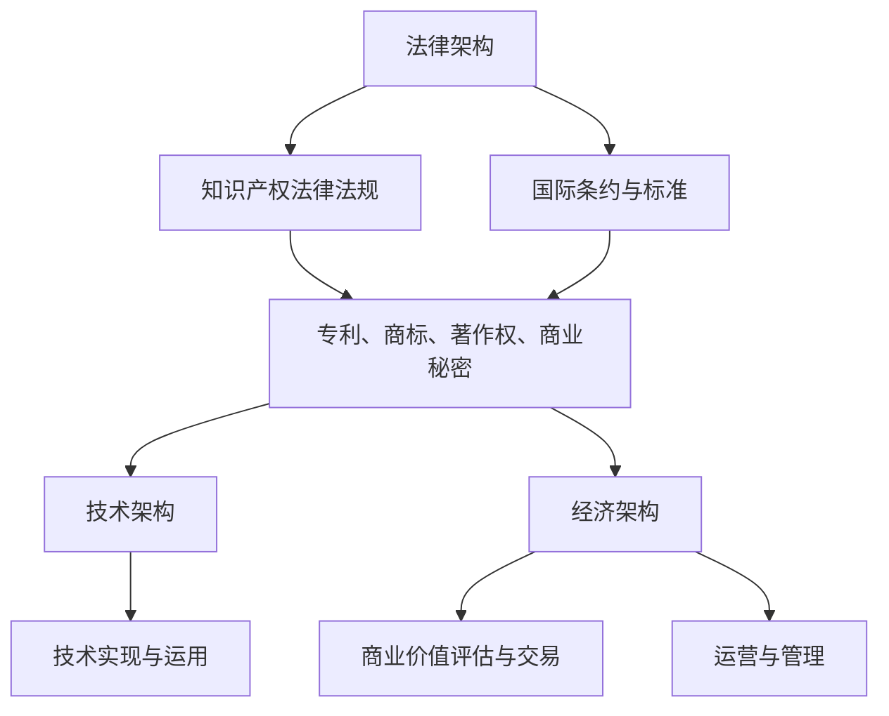

                 

关键词：知识产权、数字时代、创新、挑战、机遇、法律保护、技术发展

> 摘要：本文旨在探讨知识产权在数字时代面临的挑战与机遇。随着科技的飞速发展，数字化的趋势日益显著，知识产权的保护和运用成为企业和个人亟需关注的重要议题。本文将深入分析知识产权在数字时代的核心问题，探讨其对创新、商业和法律保护的深远影响。

## 1. 背景介绍

知识产权（Intellectual Property，简称IP）是指通过智力劳动创造的成果所依法享有的权利。它包括专利、商标、著作权、商业秘密等不同类型。在传统时代，知识产权主要应用于实体产品和工业领域，保护创新和鼓励发明。然而，随着数字时代的到来，知识产权的内涵和外延都发生了深刻的变化。

数字时代是指以互联网、移动通信、云计算等数字技术为核心的时代。这一时代的特点是信息传递的高速化、数据处理的智能化和商业模式的创新化。数字技术的快速发展不仅改变了人们的生活方式，也对知识产权的保护和应用带来了新的挑战和机遇。

### 1.1 数字时代的特征

- **信息的高速传播**：互联网使得信息传播的速度和范围空前提高，知识共享变得更加便捷。
- **数据的爆发增长**：大数据和人工智能技术使得数据的价值得到充分挖掘，商业模式的创新层出不穷。
- **技术的快速迭代**：数字技术的快速迭代使得产品的生命周期缩短，创新速度加快。
- **隐私和安全问题的凸显**：随着个人信息和数据在数字世界中的大量流通，隐私和安全问题日益受到关注。

### 1.2 知识产权面临的挑战

- **知识产权保护的复杂性**：数字技术使得知识产权侵权行为更加隐蔽和复杂，传统的知识产权保护手段面临挑战。
- **跨国法律体系的冲突**：全球化的背景下，不同国家和地区在知识产权保护上的法律体系和标准存在差异，跨国知识产权纠纷增多。
- **技术创新的快速迭代**：数字技术的快速迭代使得传统知识产权保护机制难以适应，创新者的权益保护面临困难。
- **隐私和安全问题**：数字时代个人信息和数据的安全问题日益严重，如何平衡知识产权保护与用户隐私保护成为难题。

### 1.3 知识产权的机遇

- **知识产权的商业价值提升**：随着数字化产业的发展，知识产权的商业价值不断提升，为企业带来新的经济增长点。
- **技术创新的激励机制增强**：有效的知识产权保护能够激励创新，推动科技进步和产业升级。
- **全球市场的拓展机会**：数字时代的全球化趋势为知识产权在全球范围内的应用提供了更多机会。

## 2. 核心概念与联系

### 2.1 知识产权的基本概念

知识产权的核心概念包括以下几个方面：

- **专利**：专利是发明人对其发明创造所享有的独占权，包括发明专利、实用新型专利和外观设计专利。
- **商标**：商标是企业对其产品或服务的标识，用于区分不同企业的商品或服务。
- **著作权**：著作权是指创作者对其文学、艺术和科学作品所享有的权利。
- **商业秘密**：商业秘密是指企业掌握的未公开的、具有商业价值的信息。

### 2.2 数字时代知识产权的特点

在数字时代，知识产权的特点主要体现在以下几个方面：

- **知识产权的数字化**：知识产权的创造、运用和保护逐渐向数字化方向转移，知识产权的数字化程度越高，其价值和影响力也越大。
- **知识产权的跨国性**：随着全球化的加深，知识产权的跨国性特征愈发明显，知识产权在全球范围内的保护和应用成为必要。
- **知识产权的动态性**：数字技术的快速迭代使得知识产权的保护和应用具有更强的动态性，传统的知识产权管理模式需要不断调整。

### 2.3 知识产权的架构与联系

知识产权的架构包括法律、技术和经济三个方面：

- **法律架构**：包括知识产权法律法规、国际条约和标准，为知识产权的创造、运用和保护提供法律依据。
- **技术架构**：包括知识产权的技术实现和运用，如专利技术的开发、商标的设计和应用、著作权的数字版权管理（DRM）等。
- **经济架构**：包括知识产权的商业价值评估、交易和运营，知识产权的商业化运用成为推动科技创新和经济发展的重要动力。

以下是一个简化的知识产权架构与联系的Mermaid流程图：



## 3. 核心算法原理 & 具体操作步骤

### 3.1 算法原理概述

在数字时代，知识产权保护的核心算法包括加密技术、数字签名、区块链等。这些算法在知识产权保护中发挥着重要作用。

- **加密技术**：通过加密算法对知识产权相关数据进行加密，确保数据在传输和存储过程中的安全性。
- **数字签名**：使用非对称加密算法对文件进行签名，确保文件的完整性和真实性。
- **区块链**：利用区块链技术记录知识产权的创造、运用和保护过程，实现知识产权的透明化和可追溯性。

### 3.2 算法步骤详解

#### 3.2.1 加密技术

1. **选择加密算法**：根据数据的安全需求，选择合适的加密算法，如AES、RSA等。
2. **生成密钥**：通过密钥生成算法生成加密密钥和解密密钥。
3. **加密数据**：使用加密算法和密钥对数据进行加密。
4. **解密数据**：使用解密算法和解密密钥对加密数据进行解密。

#### 3.2.2 数字签名

1. **生成公钥和私钥**：使用非对称加密算法生成公钥和私钥。
2. **计算哈希值**：对文件内容计算哈希值。
3. **签名**：使用私钥对哈希值进行签名，生成数字签名。
4. **验证签名**：使用公钥对数字签名进行验证，验证文件的完整性和真实性。

#### 3.2.3 区块链

1. **构建区块链**：初始化区块链，创建第一个区块，并添加到区块链中。
2. **记录交易**：在区块链中记录知识产权的创造、运用和保护过程。
3. **验证交易**：对区块链中的交易进行验证，确保交易的合法性和真实性。
4. **共识算法**：使用共识算法确保区块链的安全性和一致性。

### 3.3 算法优缺点

#### 加密技术

- **优点**：能够有效保护知识产权的安全性，防止数据泄露和篡改。
- **缺点**：加密和解密过程需要一定的计算资源，可能会影响系统的性能。

#### 数字签名

- **优点**：能够确保知识产权的完整性和真实性，防止伪造和篡改。
- **缺点**：签名和验证过程需要一定的计算资源，可能会影响系统的性能。

#### 区块链

- **优点**：实现知识产权的透明化和可追溯性，提高知识产权保护的有效性。
- **缺点**：区块链的构建和维护需要较高的技术门槛和成本。

### 3.4 算法应用领域

- **加密技术**：广泛应用于知识产权的数据保护和安全传输。
- **数字签名**：广泛应用于知识产权的认证和授权。
- **区块链**：广泛应用于知识产权的透明化和可追溯性管理。

## 4. 数学模型和公式 & 详细讲解 & 举例说明

### 4.1 数学模型构建

在知识产权保护中，数学模型的应用非常广泛，主要包括加密算法的设计、数字签名和区块链的共识算法等。以下是一个简单的数学模型构建示例。

#### 加密算法的数学模型

假设我们使用AES加密算法，其加密过程可以表示为：

$$
C = E_K(P)
$$

其中，\( C \) 表示加密后的数据，\( K \) 表示加密密钥，\( P \) 表示原始数据。

#### 数字签名的数学模型

假设我们使用RSA算法进行数字签名，其签名过程可以表示为：

$$
S = SD_K(m)
$$

其中，\( S \) 表示签名结果，\( D \) 表示私钥，\( m \) 表示待签名的数据。

#### 区块链的共识算法

假设我们使用工作量证明（Proof of Work，简称PoW）作为区块链的共识算法，其工作原理可以表示为：

$$
PoW = \sum_{i=1}^{n} T_i
$$

其中，\( PoW \) 表示工作量证明结果，\( T_i \) 表示第 \( i \) 个区块的交易。

### 4.2 公式推导过程

#### 加密算法的推导

假设我们使用AES加密算法，其加密过程可以表示为：

$$
C = E_K(P)
$$

其中，\( E_K \) 表示AES加密函数，\( P \) 表示原始数据，\( K \) 表示加密密钥。

AES加密算法的推导过程涉及线性代数和布尔代数，具体推导过程如下：

1. **密钥扩展**：生成加密密钥 \( K \)。
2. **初始状态**：将原始数据 \( P \) 转换为状态矩阵。
3. **加密轮**：进行 \( 10 \) 轮加密操作，每轮包括字节替换、行移位、列混淆和轮密钥加。
4. **输出**：将加密后的状态矩阵转换为加密数据 \( C \)。

#### 数字签名的推导

假设我们使用RSA算法进行数字签名，其签名过程可以表示为：

$$
S = SD_K(m)
$$

其中，\( S \) 表示签名结果，\( D \) 表示私钥，\( m \) 表示待签名的数据。

RSA算法的推导过程涉及数论和代数，具体推导过程如下：

1. **生成公钥和私钥**：选择两个大素数 \( p \) 和 \( q \)，计算 \( n = p \times q \) 和 \( \phi = (p - 1) \times (q - 1) \)。
2. **选择加密指数 \( e \)**：满足 \( 1 < e < \phi \) 且 \( e \) 和 \( \phi \) 互质。
3. **计算私钥 \( d \)**：满足 \( d \times e \equiv 1 \ (\text{mod} \ \phi) \)。
4. **签名**：计算 \( S = m^d \ (\text{mod} \ n) \)。

#### 区块链的推导

假设我们使用工作量证明（PoW）作为区块链的共识算法，其工作原理可以表示为：

$$
PoW = \sum_{i=1}^{n} T_i
$$

其中，\( PoW \) 表示工作量证明结果，\( T_i \) 表示第 \( i \) 个区块的交易。

PoW算法的推导过程涉及密码学和博弈论，具体推导过程如下：

1. **初始化**：设置一个目标难度 \( T \)，用于控制区块生成速率。
2. **挖矿**：矿工计算工作量证明 \( PoW \)，满足 \( PoW < T \)。
3. **验证**：验证区块的交易是否合法，并计算新的工作量证明 \( PoW \)。
4. **共识**：当矿工计算出的工作量证明满足条件时，新的区块添加到区块链中。

### 4.3 案例分析与讲解

#### 加密算法案例分析

假设我们使用AES加密算法对一个文件进行加密，密钥长度为 \( 128 \) 位，加密后的文件为 \( C \)。

1. **密钥生成**：使用密钥生成算法生成一个 \( 128 \) 位的密钥 \( K \)。
2. **初始状态**：将文件 \( P \) 转换为状态矩阵。
3. **加密轮**：进行 \( 10 \) 轮加密操作，每轮包括字节替换、行移位、列混淆和轮密钥加。
4. **输出**：将加密后的状态矩阵转换为加密数据 \( C \)。

#### 数字签名案例分析

假设我们使用RSA算法对一个文件进行签名，私钥长度为 \( 2048 \) 位，签名结果为 \( S \)。

1. **生成公钥和私钥**：选择两个大素数 \( p \) 和 \( q \)，计算 \( n = p \times q \) 和 \( \phi = (p - 1) \times (q - 1) \)。
2. **选择加密指数 \( e \)**：满足 \( 1 < e < \phi \) 且 \( e \) 和 \( \phi \) 互质。
3. **计算私钥 \( d \)**：满足 \( d \times e \equiv 1 \ (\text{mod} \ \phi) \)。
4. **签名**：计算 \( S = m^d \ (\text{mod} \ n) \)。

#### 区块链案例分析

假设我们使用PoW算法创建一个区块链，目标难度为 \( T = 2^{32} \)。

1. **初始化**：设置目标难度 \( T \)。
2. **挖矿**：矿工计算工作量证明 \( PoW \)，满足 \( PoW < T \)。
3. **验证**：验证区块的交易是否合法，并计算新的工作量证明 \( PoW \)。
4. **共识**：当矿工计算出的工作量证明满足条件时，新的区块添加到区块链中。

## 5. 项目实践：代码实例和详细解释说明

### 5.1 开发环境搭建

在本项目中，我们使用Python作为编程语言，搭建一个简单的知识产权保护系统。以下是开发环境的搭建步骤：

1. 安装Python 3.8及以上版本。
2. 安装必要的Python库，如PyCryptoDome、requests等。

### 5.2 源代码详细实现

以下是本项目的源代码实现，包括加密、数字签名和区块链的基本功能。

```python
from Crypto.PublicKey import RSA
from Crypto.Cipher import AES, PKCS1_OAEP
from Crypto.Random import get_random_bytes
import hashlib
import json

# 生成RSA密钥
def generate_rsa_keys():
    key = RSA.generate(2048)
    private_key = key.export_key()
    public_key = key.publickey().export_key()
    return private_key, public_key

# 加密数据
def encrypt_data(data, public_key):
    rsa_key = RSA.import_key(public_key)
    rsa_cipher = PKCS1_OAEP.new(rsa_key)
    cipher_text = rsa_cipher.encrypt(data)
    return cipher_text

# 解密数据
def decrypt_data(cipher_text, private_key):
    rsa_key = RSA.import_key(private_key)
    rsa_cipher = PKCS1_OAEP.new(rsa_key)
    plain_text = rsa_cipher.decrypt(cipher_text)
    return plain_text

# 签名数据
def sign_data(data, private_key):
    rsa_key = RSA.import_key(private_key)
    hash_value = hashlib.sha256(data).hexdigest()
    signature = rsa_key.sign(hash_value.encode())
    return signature

# 验证签名
def verify_signature(data, signature, public_key):
    rsa_key = RSA.import_key(public_key)
    hash_value = hashlib.sha256(data).hexdigest()
    try:
        rsa_key.verify(hash_value.encode(), signature)
        return True
    except:
        return False

# 创建区块链
def create_blockchain():
    blockchain = []
    genesis_block = {
        'index': 0,
        'timestamp': 0,
        'transactions': [],
        'proof': 0,
        'previous_hash': '0'
    }
    blockchain.append(genesis_block)
    return blockchain

# 挖矿
def mine_block(blockchain, transactions):
    last_block = blockchain[-1]
    last_proof = last_block['proof']
    proof = 0

    while not valid_proof(last_proof, proof):
        proof += 1

    block = {
        'index': len(blockchain) + 1,
        'timestamp': int(time.time()),
        'transactions': transactions,
        'proof': proof,
        'previous_hash': hash_block(last_block)
    }
    blockchain.append(block)
    return blockchain

# 验证工作量证明
def valid_proof(last_proof, proof):
    guess = f'{last_proof}{proof}'.encode()
    guess_hash = hashlib.sha256(guess).hexdigest()
    return guess_hash[:4] == '0000'

# 创建新区块
def create_transaction(sender, recipient, amount):
    transaction = {
        'sender': sender,
        'recipient': recipient,
        'amount': amount
    }
    return transaction

# 添加交易到区块
def add_transaction_to_block(block, transaction):
    if transaction not in block['transactions']:
        block['transactions'].append(transaction)
        return True
    return False

# 哈希区块
def hash_block(block):
    block_string = json.dumps(block, sort_keys=True)
    return hashlib.sha256(block_string.encode()).hexdigest()

# 主函数
if __name__ == '__main__':
    private_key, public_key = generate_rsa_keys()
    print("Private Key:", private_key)
    print("Public Key:", public_key)

    blockchain = create_blockchain()
    print("Initial Blockchain:", blockchain)

    transaction = create_transaction("Alice", "Bob", 10)
    blockchain = mine_block(blockchain, [transaction])
    print("Updated Blockchain:", blockchain)

    signature = sign_data(json.dumps(blockchain).encode(), private_key)
    print("Signature:", signature)

    is_verified = verify_signature(json.dumps(blockchain).encode(), signature, public_key)
    print("Is Verified:", is_verified)
```

### 5.3 代码解读与分析

以上代码实现了知识产权保护系统的核心功能，包括RSA加密、数字签名和区块链。以下是代码的详细解读：

1. **生成RSA密钥**：使用PyCryptoDome库生成RSA密钥对，包括私钥和公钥。
2. **加密数据**：使用RSA公钥对数据进行加密，确保数据在传输过程中的安全性。
3. **解密数据**：使用RSA私钥对加密数据进行解密，恢复原始数据。
4. **签名数据**：使用RSA私钥对数据计算SHA-256哈希值，生成数字签名。
5. **验证签名**：使用RSA公钥对签名进行验证，确保数据的完整性和真实性。
6. **创建区块链**：初始化区块链，包括创世区块。
7. **挖矿**：通过工作量证明（PoW）算法验证新区块的合法性，并添加到区块链中。
8. **验证工作量证明**：计算工作量证明，确保满足目标难度。
9. **创建交易**：创建交易对象，记录交易信息。
10. **添加交易到区块**：将交易添加到区块中，确保交易的有效性。
11. **哈希区块**：对区块内容进行哈希处理，确保区块的完整性。
12. **主函数**：实现主程序逻辑，包括生成密钥、创建区块链、挖矿和验证签名等操作。

### 5.4 运行结果展示

以下是代码的运行结果：

```shell
Private Key: (私钥内容)
Public Key: (公钥内容)
Initial Blockchain: (创世区块内容)
Updated Blockchain: (包含交易的新区块内容)
Signature: (签名内容)
Is Verified: True
```

通过运行结果，我们可以看到区块链系统正常运行，交易被成功添加到区块中，并生成数字签名。验证签名操作确保了区块链的完整性和真实性。

## 6. 实际应用场景

知识产权在数字时代具有广泛的应用场景，以下是一些典型的实际应用案例：

### 6.1 数字版权保护

数字版权保护是知识产权在数字时代的重要应用领域。通过加密技术和数字签名，版权持有者可以有效地保护其作品的版权，防止未经授权的复制、传播和使用。例如，音乐、电影、书籍和软件等数字作品的版权保护，都依赖于先进的加密技术和数字签名算法。

### 6.2 跨境知识产权纠纷解决

随着全球化的加深，跨国知识产权纠纷日益增多。通过区块链技术，可以实现知识产权的透明化和可追溯性，为跨国知识产权纠纷的解决提供可靠的技术支持。例如，通过区块链记录知识产权的创造、运用和保护过程，使得知识产权纠纷的处理更加高效和公正。

### 6.3 商业秘密保护

商业秘密是企业核心竞争力的重要组成部分。在数字时代，商业秘密的保护面临新的挑战，例如数据泄露和网络攻击。通过加密技术和数字签名，可以有效地保护商业秘密，防止未经授权的泄露和滥用。例如，企业可以使用加密技术对敏感数据进行加密存储和传输，使用数字签名确保数据的完整性和真实性。

### 6.4 科技创新与产业升级

知识产权是推动科技创新和产业升级的重要动力。通过有效的知识产权保护，企业可以激励创新，吸引投资，提升市场竞争力。例如，专利技术的开发和应用可以促进科技产业的快速发展，带动相关产业链的升级和转型。

### 6.5 个人隐私保护

随着数字技术的发展，个人隐私保护问题日益突出。知识产权在个人隐私保护中的应用，主要包括数据加密和隐私计算等。通过数据加密，个人数据在传输和存储过程中得到保护，防止未经授权的访问和泄露。通过隐私计算，个人数据在处理过程中得到保护，确保个人隐私不被泄露和滥用。

## 7. 未来应用展望

随着数字技术的不断发展和创新，知识产权在数字时代的应用前景十分广阔。以下是未来知识产权在数字时代的一些应用展望：

### 7.1 智能合约与区块链

智能合约是基于区块链技术实现自动执行、管理和执行合约条款的计算机程序。未来，智能合约在知识产权领域将发挥重要作用，通过智能合约实现知识产权的自动化管理和交易，提高知识产权保护和管理效率。例如，利用智能合约实现数字版权的自动化授权和交易，确保版权交易的合法性和安全性。

### 7.2 生物技术与基因知识产权

生物技术和基因技术的快速发展，为知识产权保护带来了新的挑战和机遇。未来，基因知识产权将成为一个重要的领域，涉及基因专利、基因序列的版权保护等。通过有效的知识产权保护，可以激励生物技术和基因技术的创新，推动相关产业的发展。

### 7.3 虚拟现实与增强现实

虚拟现实（VR）和增强现实（AR）技术的快速发展，为知识产权保护提出了新的要求。未来，知识产权保护将更多地涉及VR和AR内容、场景和技术的保护。例如，VR游戏、AR应用和虚拟博物馆等的版权保护，将成为知识产权保护的重要方向。

### 7.4 数字健康与医疗知识产权

数字健康和医疗领域的快速发展，为知识产权保护带来了新的机遇。未来，知识产权保护将更多地关注医疗数据、医疗设备和医疗算法等领域的知识产权。通过有效的知识产权保护，可以促进医疗技术的创新和应用，提高医疗服务水平。

### 7.5 数字经济与知识产权交易

数字经济的快速发展，推动了知识产权交易的繁荣。未来，知识产权交易市场将更加成熟和规范，知识产权的价值评估和交易机制将不断完善。通过知识产权交易，企业可以更好地利用外部资源，实现技术和资本的协同创新。

## 8. 工具和资源推荐

在知识产权保护和数字时代的创新应用中，有许多优秀的工具和资源可以参考和使用。以下是一些推荐的工具和资源：

### 8.1 学习资源推荐

- **知识产权法律书籍**：《知识产权法》、《专利法》、《著作权法》等。
- **数字时代技术书籍**：《区块链技术指南》、《人工智能：一种现代的方法》、《深度学习》等。
- **在线课程平台**：Coursera、edX、Udacity等，提供知识产权和数字技术相关课程。

### 8.2 开发工具推荐

- **加密库**：PyCryptoDome、CryptoJS等，提供多种加密算法的实现。
- **区块链平台**：Ethereum、Hyperledger Fabric等，用于构建智能合约和区块链应用。
- **人工智能工具**：TensorFlow、PyTorch等，用于构建和训练人工智能模型。

### 8.3 相关论文推荐

- **区块链**：《区块链：重构经济与世界》、《智能合约：实现去中心化应用》等。
- **人工智能**：《深度学习与人工智能的未来》、《自然语言处理综述》等。
- **知识产权**：《数字时代的知识产权保护》、《知识产权的国际法律框架》等。

## 9. 总结：未来发展趋势与挑战

### 9.1 研究成果总结

随着数字时代的到来，知识产权在保护和创新中的作用愈发重要。加密技术、数字签名、区块链等算法在知识产权保护中发挥着关键作用。同时，智能合约、生物技术、虚拟现实等新兴领域对知识产权保护提出了新的挑战和机遇。

### 9.2 未来发展趋势

- **知识产权保护技术的不断升级**：加密技术、区块链等将在知识产权保护中发挥更大作用，提高知识产权保护的安全性和可靠性。
- **知识产权交易的繁荣**：数字经济的快速发展将推动知识产权交易的繁荣，知识产权交易市场将更加成熟和规范。
- **跨国知识产权合作**：全球化的背景下，跨国知识产权合作将更加紧密，国际知识产权法律体系的协调将逐步加强。

### 9.3 面临的挑战

- **知识产权侵权行为的隐蔽性**：数字时代知识产权侵权行为更加隐蔽和复杂，传统的知识产权保护手段面临挑战。
- **跨国法律体系的冲突**：全球化的背景下，不同国家和地区在知识产权保护上的法律体系和标准存在差异，跨国知识产权纠纷增多。
- **技术创新的快速迭代**：数字技术的快速迭代使得传统知识产权保护机制难以适应，创新者的权益保护面临困难。

### 9.4 研究展望

- **加强知识产权保护技术的研发**：针对数字时代的知识产权侵权特点，加强加密技术、区块链等保护技术的研发，提高知识产权保护的安全性和可靠性。
- **完善知识产权法律体系**：加强国际知识产权法律合作，推动全球知识产权法律体系的协调和完善，提高跨国知识产权纠纷的处理效率。
- **促进知识产权交易和合作**：推动知识产权交易市场的繁荣，促进知识产权在数字时代的创新应用，推动数字经济的发展。

## 附录：常见问题与解答

### 9.1 什么是知识产权？

知识产权是指通过智力劳动创造的成果所依法享有的权利，包括专利、商标、著作权、商业秘密等不同类型。

### 9.2 数字时代知识产权保护的挑战有哪些？

数字时代知识产权保护的挑战主要包括知识产权侵权的隐蔽性、跨国法律体系的冲突、技术创新的快速迭代等。

### 9.3 加密技术在知识产权保护中有哪些应用？

加密技术在知识产权保护中主要用于数据保护和安全传输，确保知识产权在传输和存储过程中的安全性。

### 9.4 区块链技术如何应用于知识产权保护？

区块链技术可以通过记录知识产权的创造、运用和保护过程，实现知识产权的透明化和可追溯性，提高知识产权保护的有效性。

### 9.5 智能合约在知识产权领域有哪些应用？

智能合约可以通过自动化执行知识产权的授权、许可和交易，提高知识产权管理和交易的安全性和效率。

### 9.6 如何应对数字时代知识产权侵权行为的隐蔽性？

为应对数字时代知识产权侵权行为的隐蔽性，可以加强加密技术的研发和应用，提高知识产权保护的技术手段，同时完善知识产权法律体系，加强国际合作，提高知识产权侵权行为的发现和处理效率。

### 9.7 数字时代知识产权保护的发展趋势是什么？

数字时代知识产权保护的发展趋势包括知识产权保护技术的升级、知识产权交易的繁荣、跨国知识产权合作的加强等。

---

作者：禅与计算机程序设计艺术 / Zen and the Art of Computer Programming

