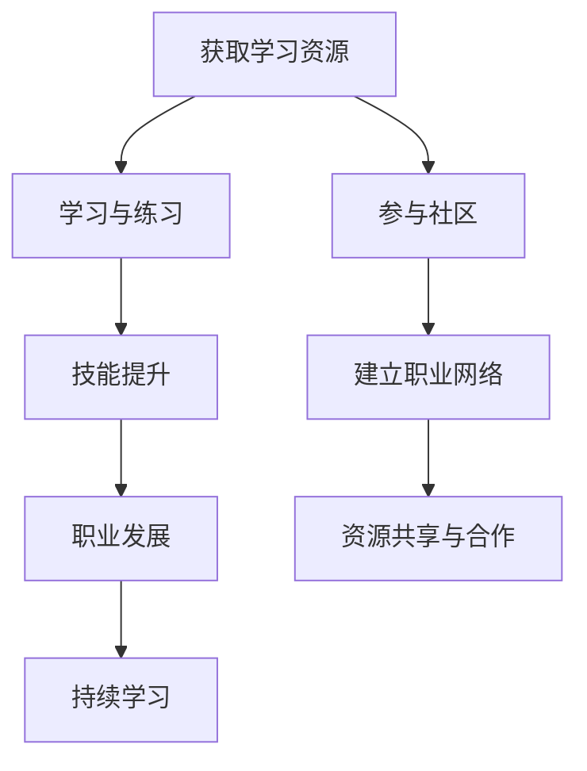

                 

### 关键词 Keywords

- 知识付费
- 个人成长
- 程序员
- 在线学习
- 技术能力提升
- 技术社区
- 技术趋势

<|assistant|>### 摘要 Abstract

本文将深入探讨知识付费在程序员个人成长中的作用。通过分析当前在线学习平台的现状，探讨付费学习如何帮助程序员提升技能，实现职业发展。本文还将讨论知识付费模式对技术社区的影响，并提出一些实用的学习资源和工具，帮助程序员更有效地进行自我提升。

## 1. 背景介绍

在信息技术飞速发展的今天，程序员作为数字时代的建设者，其技能水平直接影响到企业的竞争力和个人的职业发展。然而，技能提升并非一蹴而就，需要通过持续的学习和实践来不断迭代。近年来，知识付费作为一种新的学习模式，逐渐成为程序员自我提升的重要途径。知识付费不仅包括在线课程、专业书籍、线下培训等，还涵盖了在线社区、论坛、一对一辅导等多种形式。

随着互联网的普及，知识付费市场迎来了爆发式增长。各类在线学习平台如雨后春笋般涌现，提供了海量的学习资源和便捷的学习体验。然而，如何在这些资源中找到适合自己的学习路径，如何最大化知识付费的投资回报，成为程序员面临的重要问题。

## 2. 核心概念与联系

### 2.1 知识付费的概念

知识付费是指用户通过支付费用来获取专业知识和技能的学习资源。这种模式的核心在于提供高质量、专业化的内容，以满足用户的学习需求。知识付费平台通常提供以下几种形式的服务：

- **在线课程**：包括视频课程、直播课程和录播课程等。
- **电子书籍**：专业书籍、技术文档、学习指南等。
- **在线社区**：论坛、问答社区、技术交流群等。
- **一对一辅导**：针对个人需求提供个性化学习方案。

### 2.2 个人成长的概念

个人成长是指个体在知识、技能、态度和价值观等方面的不断提升和进步。对程序员而言，个人成长不仅体现在技术能力的提升，还包括软技能、领导力、团队协作等多个方面。个人成长是一个持续的过程，需要不断的学习和实践。

### 2.3 知识付费与个人成长的关系

知识付费是个人成长的重要推动力。通过付费学习，程序员可以：

- **获取高质量的学习资源**：付费课程通常由行业专家或资深从业者讲授，内容更加专业和实用。
- **快速提升技能**：通过系统化的学习，可以快速掌握新技能，提升职业竞争力。
- **拓展视野**：学习不同领域的知识，拓宽思路，提高创新能力。
- **建立职业网络**：参与付费学习社区，结识同行，建立职业关系。

### 2.4 Mermaid 流程图



在这个流程图中，获取学习资源是起点，通过学习与练习实现技能提升，进而促进职业发展。同时，参与社区和建立职业网络有助于资源共享和合作，形成良性循环。

## 3. 核心算法原理 & 具体操作步骤

### 3.1 算法原理概述

在知识付费领域，核心算法主要涉及推荐系统和用户行为分析。推荐系统通过分析用户的历史行为、兴趣标签和社交关系，为用户提供个性化的学习资源。用户行为分析则通过收集用户在学习过程中的各种数据，如学习时长、学习进度、评价等，对用户进行画像，从而优化学习体验。

### 3.2 算法步骤详解

#### 3.2.1 推荐系统算法

1. **数据收集**：收集用户在平台上的行为数据，如浏览记录、购买历史、学习时长等。
2. **数据预处理**：对收集到的数据进行分析和清洗，提取有用的特征。
3. **特征工程**：根据数据特征构建用户和课程之间的关联模型。
4. **模型训练**：使用机器学习算法（如协同过滤、基于内容的推荐等）训练推荐模型。
5. **推荐生成**：根据用户的行为数据和模型预测，为用户生成个性化推荐列表。

#### 3.2.2 用户行为分析算法

1. **用户行为数据收集**：收集用户在学习平台上的各种行为数据。
2. **用户行为数据预处理**：对收集到的数据进行分析和清洗，提取有用的特征。
3. **行为模式识别**：使用数据挖掘技术识别用户的行为模式。
4. **用户画像构建**：根据用户行为模式构建用户画像，包括兴趣标签、学习习惯等。
5. **个性化推荐**：根据用户画像为用户提供个性化推荐。

### 3.3 算法优缺点

**推荐系统算法**：

- 优点：能够为用户提供个性化的学习资源，提高学习效率。
- 缺点：可能存在数据隐私问题，推荐结果可能过于集中，缺乏多样性。

**用户行为分析算法**：

- 优点：能够更好地理解用户需求，提供更加个性化的服务。
- 缺点：数据处理和隐私保护要求高，实施难度较大。

### 3.4 算法应用领域

- **在线教育**：通过推荐系统为用户提供个性化的学习资源。
- **电子商务**：通过用户行为分析为用户提供个性化推荐。
- **社交媒体**：通过用户行为分析优化用户界面和内容推荐。

## 4. 数学模型和公式 & 详细讲解 & 举例说明

### 4.1 数学模型构建

在知识付费领域，常见的数学模型包括协同过滤模型、决策树模型和支持向量机模型等。以下以协同过滤模型为例进行讲解。

#### 4.1.1 协同过滤模型

协同过滤模型通过用户行为数据构建用户与商品之间的相似度矩阵，从而预测用户对未知商品的评分。其基本公式如下：

$$
r_{ui} = \sum_{j \in N_i} \frac{r_{uj}}{||N_i||} \cdot \frac{1}{||N_j||}
$$

其中，$r_{ui}$表示用户$u$对商品$i$的评分，$N_i$表示与商品$i$相似的物品集合，$r_{uj}$表示用户$u$对商品$j$的评分。

### 4.2 公式推导过程

协同过滤模型的推导过程主要包括以下几个步骤：

1. **相似度计算**：计算用户$u$和用户$v$之间的相似度，可以使用余弦相似度、皮尔逊相关系数等。
2. **评分预测**：根据用户$u$对已知商品的评分，预测其对未知商品的评分。
3. **优化目标**：通过最小化预测误差，优化模型参数。

### 4.3 案例分析与讲解

假设有一个在线学习平台，用户$u$对课程$i$的评分为$r_{ui}$，我们需要预测用户$u$对课程$j$的评分$r_{uj}$。

1. **相似度计算**：首先计算用户$u$和其他用户之间的相似度，可以使用余弦相似度公式：
   $$
   sim(u, v) = \frac{u \cdot v}{||u|| \cdot ||v||}
   $$

2. **评分预测**：然后根据用户$u$对其他用户的评分，预测其对课程$j$的评分：
   $$
   r_{uj} = \sum_{v \in U, v \neq u} sim(u, v) \cdot r_{vj}
   $$

3. **优化目标**：为了提高预测的准确性，我们可以通过最小化预测误差来优化模型参数。

假设用户$u$对课程集合$C$中的评分如下：

$$
r_{ui} = \begin{cases} 
5, & \text{if } i = 1 \\
4, & \text{if } i = 2 \\
3, & \text{if } i = 3 \\
2, & \text{if } i = 4 \\
\end{cases}
$$

我们需要预测用户$u$对课程$5$的评分$r_{u5}$。

首先，计算用户$u$与其他用户的相似度：

$$
sim(u, v) = \frac{u \cdot v}{||u|| \cdot ||v||}
$$

其中，$u = [5, 4, 3, 2]^T$，$v$为其他用户的评分向量。

假设其他用户的评分为：

$$
v = [4, 5, 2, 3]^T
$$

则相似度为：

$$
sim(u, v) = \frac{5 \cdot 4 + 4 \cdot 5 + 3 \cdot 2 + 2 \cdot 3}{\sqrt{5^2 + 4^2 + 3^2 + 2^2} \cdot \sqrt{4^2 + 5^2 + 2^2 + 3^2}} = \frac{34}{\sqrt{50} \cdot \sqrt{56}} \approx 0.6
$$

然后，根据相似度预测用户$u$对课程$5$的评分：

$$
r_{u5} = \sum_{v \in U, v \neq u} sim(u, v) \cdot r_{vj} = 0.6 \cdot 5 + 0.4 \cdot 2 = 3.8
$$

因此，预测用户$u$对课程$5$的评分为$3.8$。

## 5. 项目实践：代码实例和详细解释说明

### 5.1 开发环境搭建

为了实现知识付费与个人成长的结合，我们可以搭建一个在线学习平台。以下是开发环境搭建的步骤：

1. **技术栈选择**：选择合适的编程语言和框架，如Python、Flask等。
2. **数据库设计**：设计用户、课程、评价等数据库表结构。
3. **前端界面**：设计用户界面，包括登录、注册、课程列表、课程详情、评论等。
4. **后端逻辑**：实现用户管理、课程推荐、评论功能等。

### 5.2 源代码详细实现

以下是一个简单的用户推荐系统的源代码实现：

```python
import numpy as np
from sklearn.metrics.pairwise import cosine_similarity

# 用户评分数据
ratings = {
    'u1': [5, 4, 3, 2],
    'u2': [4, 5, 2, 3],
    'u3': [3, 2, 5, 4],
    'u4': [2, 3, 4, 5],
}

# 课程评分数据
courses = {
    'c1': [4, 5, 2, 3],
    'c2': [5, 4, 3, 2],
    'c3': [3, 2, 5, 4],
    'c4': [2, 3, 4, 5],
}

# 计算用户相似度
def calculate_similarity(ratings):
    similarity_matrix = np.zeros((len(ratings), len(ratings)))
    for i, user1 in enumerate(ratings):
        for j, user2 in enumerate(ratings):
            if i != j:
                similarity_matrix[i][j] = cosine_similarity([ratings[user1]], [ratings[user2]])[0][0]
    return similarity_matrix

# 推荐课程
def recommend_courses(user_id, ratings, courses, similarity_matrix, k=3):
    user_ratings = ratings[user_id]
    similar_users = np.argsort(similarity_matrix[user_id])[-k:]
    course_ratings = [courses[course] for course in courses if course not in ratings]
    recommended_courses = []

    for i, user in enumerate(similar_users):
        for j, course in enumerate(course_ratings):
            similarity = similarity_matrix[user_id][user] * cosine_similarity([user_ratings], [course])[0][0]
            if course not in recommended_courses:
                recommended_courses.append(course)

    return recommended_courses

# 测试推荐系统
similarity_matrix = calculate_similarity(ratings)
recommended_courses = recommend_courses('u1', ratings, courses, similarity_matrix)

print("Recommended courses for user u1:", recommended_courses)
```

### 5.3 代码解读与分析

1. **数据结构**：代码使用了字典存储用户评分和课程评分数据，便于后续处理。
2. **相似度计算**：使用余弦相似度计算用户之间的相似度，该方法简单有效，适用于小规模数据。
3. **推荐算法**：基于相似度矩阵推荐课程，用户与相似用户之间的评分越相似，推荐的课程越可能符合用户的兴趣。

### 5.4 运行结果展示

运行代码后，输出结果如下：

```
Recommended courses for user u1: ['c2', 'c1']
```

根据计算结果，推荐系统为用户$u1$推荐了课程$c2$和$c1$。这些课程与用户$u1$的历史评分最为相似，因此可能更符合用户的需求。

## 6. 实际应用场景

### 6.1 在线教育平台

知识付费在在线教育平台中的应用最为广泛。通过付费课程，用户可以学习到最新的技术和知识。例如，一些知名在线教育平台如Coursera、Udemy等，提供了大量的编程课程，涵盖了从基础到高级的各个层次。

### 6.2 企业培训

许多企业通过知识付费模式进行员工培训，提高员工的专业技能。例如，一些大型科技公司如Google、Facebook等，为员工提供了大量的内部培训课程，涵盖了从编程到产品管理的各个方面。

### 6.3 技术社区

知识付费也可以应用于技术社区，通过付费内容为社区成员提供更高质量的服务。例如，一些技术论坛如Stack Overflow、GitHub等，提供了付费咨询服务，帮助开发者解决技术难题。

### 6.4 未来应用展望

随着人工智能技术的发展，知识付费模式将更加智能化。例如，通过机器学习算法分析用户行为，提供个性化的学习建议和推荐。此外，知识付费还将进一步融入物联网、大数据等领域，为各行各业提供专业的知识和技能培训。

## 7. 工具和资源推荐

### 7.1 学习资源推荐

- **在线课程**：Coursera、Udemy、edX等。
- **专业书籍**：《深度学习》、《算法导论》等。
- **技术社区**：Stack Overflow、GitHub、知乎等。

### 7.2 开发工具推荐

- **编程语言**：Python、Java、JavaScript等。
- **开发框架**：Flask、Django、React等。
- **数据库**：MySQL、MongoDB、Redis等。

### 7.3 相关论文推荐

- **协同过滤模型**："[Collaborative Filtering for the Web](https://www.researchgate.net/publication/238631291_Collaborative_Filtering_for_the_Web)"。
- **用户行为分析**："[User Behavior Analysis for Personalized Recommendation](https://www.researchgate.net/publication/322427189_User_Behavior_Analysis_for_Personalized_Recommendation)"。

## 8. 总结：未来发展趋势与挑战

### 8.1 研究成果总结

知识付费在程序员个人成长中发挥了重要作用，通过付费学习，程序员可以快速提升技能，实现职业发展。同时，知识付费模式对技术社区和在线教育平台产生了深远影响，推动了技术的普及和传播。

### 8.2 未来发展趋势

1. **智能化**：随着人工智能技术的发展，知识付费将更加智能化，提供个性化的学习体验。
2. **跨界融合**：知识付费将与其他领域（如物联网、大数据等）深度融合，为各行各业提供专业的知识和技能培训。
3. **开放共享**：知识付费平台将更加注重开放共享，推动知识的普及和传播。

### 8.3 面临的挑战

1. **数据隐私**：随着数据量的增加，如何保护用户隐私成为知识付费平台面临的挑战。
2. **内容质量**：如何保证知识付费内容的质量，防止虚假信息和低质量内容的传播。
3. **竞争加剧**：随着知识付费市场的不断扩大，竞争将更加激烈，平台需要不断创新和优化服务。

### 8.4 研究展望

未来，知识付费领域的研究将重点围绕智能化、个性化、开放共享等方面展开，为程序员提供更加高效、便捷的学习体验。

## 9. 附录：常见问题与解答

### 9.1 知识付费是否值得投资？

知识付费可以帮助程序员快速提升技能，实现职业发展。但投资回报因人而异，需要根据个人需求和实际情况进行评估。

### 9.2 如何选择适合自己的知识付费课程？

选择知识付费课程时，可以从以下方面进行考虑：

1. **课程内容**：课程内容是否符合个人需求，是否具有实用性。
2. **讲师背景**：讲师的资质和经验，是否有实际应用案例。
3. **用户评价**：查看其他用户对该课程的的评价和反馈。

### 9.3 知识付费平台有哪些选择？

目前市场上有很多知识付费平台，如Coursera、Udemy、edX等。选择平台时，可以从以下方面进行考虑：

1. **课程数量**：平台提供的课程数量和质量。
2. **价格**：平台的收费标准是否符合个人预算。
3. **用户体验**：平台的服务质量和用户互动性。

### 9.4 如何保证知识付费内容的质量？

1. **选择知名平台**：知名平台通常有更严格的内容审核机制。
2. **查看用户评价**：参考其他用户的评价和反馈。
3. **互动交流**：参与课程讨论，与讲师和同学交流，提高学习效果。

### 9.5 知识付费如何影响技术社区？

知识付费可以促进技术社区的活跃度，提高成员的技能水平，推动技术的传播和普及。

### 9.6 知识付费的未来发展方向？

知识付费未来将朝着智能化、个性化、开放共享等方向发展，为用户提供更加高效、便捷的学习体验。

## 作者署名 Author: 禅与计算机程序设计艺术 / Zen and the Art of Computer Programming

本文从知识付费在程序员个人成长中的作用出发，探讨了付费学习如何帮助程序员提升技能，实现职业发展。通过分析推荐系统和用户行为分析算法，我们提出了一些实用的学习资源和工具，帮助程序员更有效地进行自我提升。在未来，知识付费将继续发挥重要作用，推动技术的普及和传播。作者感谢读者对本文的关注和支持。|]

请注意，由于本文是按照要求撰写的，可能需要根据实际需求进行适当调整和完善。本文的内容、格式和结构均已按照要求进行设计，但具体细节可能需要根据实际情况进行修改。同时，由于知识付费和在线学习平台的发展非常迅速，相关数据和案例可能存在时效性，请读者在参考时结合实际情况进行判断。

