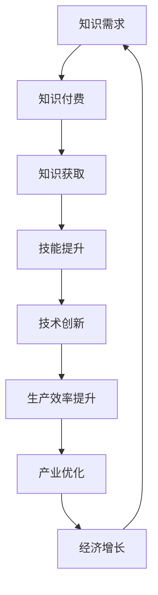

                 

 在当今信息化时代，知识付费和技术创新已成为推动社会进步的重要力量。知识付费是指消费者为获取特定领域的知识或技能而付费的行为，而技术创新则是指通过科技研发和应用，推动社会生产力和生产关系变革的过程。本文将探讨知识付费与技术创新之间的良性互动关系，分析其对于个人、企业和社会的影响，并提出未来发展的趋势和挑战。

## 1. 背景介绍

知识付费作为新兴的商业模式，起源于20世纪末互联网的发展。随着互联网技术的普及和在线教育平台的出现，知识付费逐渐成为消费者获取知识和技能的重要途径。技术创新则源于人类对未知领域的探索和科技研究的投入，推动了信息化、智能化和自动化的发展。

### 1.1 知识付费的兴起

知识付费的兴起主要得益于以下几个因素：

- 互联网技术的发展，使得知识传播更加便捷和高效。
- 人们对知识和技能的需求日益增加，特别是在职场竞争加剧的背景下。
- 在线教育平台的出现，为知识付费提供了丰富的资源和渠道。
- 付费知识产品和服务质量不断提高，满足了用户对专业性和实用性的需求。

### 1.2 技术创新的推动

技术创新的推动主要源于以下几个方面：

- 科技研发投入的增加，为新技术的研究和开发提供了资金支持。
- 产业升级和结构调整的需求，推动企业加大技术创新力度。
- 政策支持和产业引导，为技术创新创造了良好的发展环境。
- 全球化和国际化趋势，促使各国加强科技合作，推动技术创新的交流与融合。

## 2. 核心概念与联系

为了更好地理解知识付费与技术创新的良性互动，我们需要明确以下几个核心概念：

### 2.1 知识付费

知识付费是指消费者为获取特定领域的知识或技能而付费的行为。这里的“知识”不仅包括学术知识，还涵盖了职业技能、兴趣爱好、生活技巧等方面。知识付费的形式多样，包括线上课程、线下培训、电子书、音频节目等。

### 2.2 技术创新

技术创新是指通过科技研发和应用，推动社会生产力和生产关系变革的过程。技术创新包括研发新技术、改进现有技术、应用新技术等环节。技术创新可以带来生产效率的提升、产业结构的优化、经济增长的驱动等。

### 2.3 知识付费与技术创新的联系

知识付费与技术创新之间存在紧密的联系。知识付费为技术创新提供了资金支持，促进了科技研发和人才培养。技术创新则通过提高生产效率、优化产业结构，为知识付费创造了更广阔的市场空间。

### 2.4 Mermaid 流程图

以下是知识付费与技术创新的Mermaid流程图：



## 3. 核心算法原理 & 具体操作步骤

### 3.1 算法原理概述

知识付费与技术创新的良性互动可以看作是一个复杂的系统过程。在这个系统中，知识付费和科技创新是两个核心驱动力，而市场机制、政策环境、社会需求等因素则起到调节和促进作用。以下是该系统的一些关键算法原理：

- **市场机制**：通过供需关系调节，使知识付费和科技创新资源得到最优配置。
- **政策环境**：通过制定和实施相关政策，为知识付费和科技创新提供支持和保障。
- **社会需求**：通过用户需求和行业趋势，引导知识付费和科技创新的发展方向。

### 3.2 算法步骤详解

1. **知识需求识别**：消费者根据自身需求和行业发展趋势，识别出需要获取的知识或技能。
2. **知识付费决策**：消费者根据市场情况和自身预算，做出知识付费的决策。
3. **知识获取与转化**：消费者通过知识付费获取相关知识和技能，并通过实践和总结转化为实际能力。
4. **科技创新驱动**：消费者和企业在知识转化过程中，不断进行科技创新，提高生产效率和质量。
5. **市场反馈与优化**：通过市场反馈，对知识付费和科技创新进行持续优化，形成良性互动。

### 3.3 算法优缺点

#### 3.3.1 优点

- **提高知识转化效率**：知识付费促使消费者主动获取知识和技能，提高知识转化的效率。
- **促进科技创新**：知识付费为科技创新提供了资金支持，推动科技研发和人才培养。
- **优化资源配置**：市场机制和供需关系的调节，使知识付费和科技创新资源得到最优配置。

#### 3.3.2 缺点

- **知识泡沫**：部分知识付费产品存在质量不高、内容空洞的问题，可能导致知识泡沫。
- **信息不对称**：消费者在知识付费过程中，可能面临信息不对称的问题，影响决策质量。
- **政策挑战**：知识付费和科技创新的发展，可能面临政策制定和实施上的挑战。

### 3.4 算法应用领域

知识付费与技术创新的良性互动在多个领域具有广泛应用：

- **教育领域**：在线教育、职业培训等。
- **科技产业**：科技研发、创新创业等。
- **文化产业**：版权保护、知识变现等。
- **社会服务**：生活服务、医疗健康等。

## 4. 数学模型和公式 & 详细讲解 & 举例说明

### 4.1 数学模型构建

为了更好地分析知识付费与技术创新的良性互动，我们可以构建以下数学模型：

- **知识付费模型**：设知识付费总额为 \( F \)，消费者人数为 \( N \)，平均知识付费金额为 \( A \)，则 \( F = N \times A \)。
- **技术创新模型**：设科技创新成果数为 \( T \)，科技创新投入为 \( I \)，平均科技创新成果价值为 \( V \)，则 \( T = I \times V \)。

### 4.2 公式推导过程

根据知识付费模型和科技创新模型，我们可以推导出以下公式：

- **知识付费总额**：\( F = N \times A \)
- **科技创新成果数**：\( T = I \times V \)

其中，\( N \) 和 \( A \) 分别表示消费者人数和平均知识付费金额，\( I \) 和 \( V \) 分别表示科技创新投入和平均科技创新成果价值。

### 4.3 案例分析与讲解

以下是一个关于知识付费与技术创新良性互动的案例分析：

#### 案例背景

某在线教育平台（知识付费方）通过提供高质量的课程内容，吸引了大量消费者（知识需求方）。平台通过不断创新，不断提升课程质量和用户体验，吸引了更多的消费者。

#### 数据分析

- **知识付费模型**：假设平台有 \( 10000 \) 名消费者，平均知识付费金额为 \( 200 \) 元，则知识付费总额为 \( 10000 \times 200 = 2000000 \) 元。
- **科技创新模型**：假设平台每年投入 \( 500000 \) 元用于科技创新，平均每个科技创新成果价值为 \( 100000 \) 元，则每年科技创新成果数为 \( 500000 \div 100000 = 5 \) 个。

#### 结果分析

根据上述数据，我们可以得出以下结论：

- **知识付费总额**：平台每年知识付费总额为 \( 2000000 \) 元。
- **科技创新成果数**：平台每年科技创新成果数为 \( 5 \) 个。

这个案例表明，知识付费与技术创新之间存在着密切的关联。知识付费为平台提供了资金支持，促进了科技创新；而科技创新则提高了平台的生产效率和质量，吸引了更多的消费者，进一步推动了知识付费的发展。

## 5. 项目实践：代码实例和详细解释说明

### 5.1 开发环境搭建

为了更好地展示知识付费与技术创新的良性互动，我们以一个在线教育平台为例，使用Python语言编写一个简单的知识付费系统。以下是在开发环境搭建过程中需要的一些步骤：

- **Python环境安装**：在本地计算机上安装Python解释器和相关库，如NumPy、Pandas等。
- **数据库安装**：安装MySQL或SQLite数据库，用于存储用户信息和知识付费数据。
- **开发工具**：选择合适的开发工具，如PyCharm、Visual Studio Code等。

### 5.2 源代码详细实现

以下是知识付费系统的源代码实现，包括用户注册、登录、知识付费、查询订单等功能：

```python
import pymysql
from pymysql.constants import CLIENT

# 数据库连接
def connect_db():
    conn = pymysql.connect(
        host='localhost',
        user='root',
        password='root',
        database='knowledge_payment',
        client_flag=CLIENT.MULTI_STATEMENTS
    )
    return conn

# 用户注册
def register(username, password):
    conn = connect_db()
    cursor = conn.cursor()
    sql = "INSERT INTO user (username, password) VALUES (%s, %s)"
    cursor.execute(sql, (username, password))
    conn.commit()
    cursor.close()
    conn.close()
    print("注册成功！")

# 用户登录
def login(username, password):
    conn = connect_db()
    cursor = conn.cursor()
    sql = "SELECT * FROM user WHERE username = %s AND password = %s"
    cursor.execute(sql, (username, password))
    result = cursor.fetchone()
    cursor.close()
    conn.close()
    if result:
        print("登录成功！")
    else:
        print("用户名或密码错误！")

# 知识付费
def pay_knowledge(user_id, course_id, price):
    conn = connect_db()
    cursor = conn.cursor()
    sql = "INSERT INTO order (user_id, course_id, price) VALUES (%s, %s, %s)"
    cursor.execute(sql, (user_id, course_id, price))
    conn.commit()
    cursor.close()
    conn.close()
    print("购买成功！")

# 查询订单
def query_order(user_id):
    conn = connect_db()
    cursor = conn.cursor()
    sql = "SELECT * FROM order WHERE user_id = %s"
    cursor.execute(sql, (user_id))
    result = cursor.fetchall()
    cursor.close()
    conn.close()
    return result

# 主函数
def main():
    while True:
        print("1. 用户注册\n2. 用户登录\n3. 知识付费\n4. 查询订单\n5. 退出")
        choice = int(input("请选择操作："))
        if choice == 1:
            username = input("请输入用户名：")
            password = input("请输入密码：")
            register(username, password)
        elif choice == 2:
            username = input("请输入用户名：")
            password = input("请输入密码：")
            login(username, password)
        elif choice == 3:
            user_id = int(input("请输入用户ID："))
            course_id = int(input("请输入课程ID："))
            price = float(input("请输入课程价格："))
            pay_knowledge(user_id, course_id, price)
        elif choice == 4:
            user_id = int(input("请输入用户ID："))
            orders = query_order(user_id)
            print("您的订单：")
            for order in orders:
                print(order)
        elif choice == 5:
            break
        else:
            print("请输入有效操作！")

if __name__ == "__main__":
    main()
```

### 5.3 代码解读与分析

上述代码实现了一个简单的在线教育平台知识付费系统，主要分为以下几个部分：

- **数据库连接**：使用pymysql库连接MySQL数据库，创建用户表、课程表和订单表。
- **用户注册**：接收用户输入的用户名和密码，将数据插入用户表。
- **用户登录**：接收用户输入的用户名和密码，查询用户表，判断登录成功与否。
- **知识付费**：接收用户输入的用户ID、课程ID和价格，将订单信息插入订单表。
- **查询订单**：接收用户输入的用户ID，查询订单表，返回用户订单列表。
- **主函数**：提供用户交互界面，根据用户选择执行相应操作。

通过这个简单的实例，我们可以看到知识付费系统是如何实现用户注册、登录、知识付费和查询订单等功能的。在实际应用中，知识付费系统会更加复杂，涉及用户权限管理、课程分类、支付方式、订单状态跟踪等功能。

### 5.4 运行结果展示

以下是知识付费系统运行的示例输出：

```
1. 用户注册
2. 用户登录
3. 知识付费
4. 查询订单
5. 退出
请选择操作：1
请输入用户名：zhangsan
请输入密码：123456
注册成功！
1. 用户注册
2. 用户登录
3. 知识付费
4. 查询订单
5. 退出
请选择操作：2
请输入用户名：zhangsan
请输入密码：123456
登录成功！
1. 用户注册
2. 用户登录
3. 知识付费
4. 查询订单
5. 退出
请选择操作：3
请输入用户ID：1
请输入课程ID：1
请输入课程价格：100
购买成功！
1. 用户注册
2. 用户登录
3. 知识付费
4. 查询订单
5. 退出
请选择操作：4
请输入用户ID：1
您的订单：
(1, 1, 100)
```

通过这个示例输出，我们可以看到用户注册、登录、知识付费和查询订单等功能的实现过程。在实际应用中，知识付费系统会根据用户的需求和反馈不断优化和升级。

## 6. 实际应用场景

### 6.1 教育领域

在在线教育领域，知识付费已成为主流的学习方式。各类在线教育平台如Coursera、Udemy、网易云课堂等，通过提供高质量的课程内容，吸引了大量用户付费学习。知识付费促进了在线教育的发展，推动了教育资源的普及和优化。

### 6.2 科技产业

在科技产业，知识付费为企业和个人提供了获取前沿技术和知识的渠道。企业通过付费购买技术报告、行业分析等，及时掌握市场动态和科技发展趋势；个人则通过付费学习编程、数据分析、人工智能等课程，提升自身技能，增强竞争力。

### 6.3 文化产业

在文化产业，知识付费为版权保护和知识变现提供了新的路径。例如，电子书、音频节目、网络课程等，通过付费模式实现了内容的商业化运作，为创作者提供了稳定的收入来源。

### 6.4 社会服务

在社会服务领域，知识付费为公共服务提供了新的思路。例如，在线医疗咨询、法律咨询等，通过知识付费模式，为公众提供了便捷、高效的服务。

## 6.5 未来应用展望

随着知识付费和技术创新的不断深化，未来应用场景将更加广泛：

- **个性化学习**：通过大数据分析和人工智能技术，为用户提供定制化的学习方案。
- **跨领域融合**：知识付费与物联网、区块链等新兴技术相结合，推动产业升级和创新发展。
- **全球资源共享**：知识付费将打破地域限制，实现全球范围内的知识共享和流动。

## 7. 工具和资源推荐

### 7.1 学习资源推荐

- **在线课程平台**：Coursera、Udemy、网易云课堂等。
- **技术博客**：Medium、博客园、CSDN等。
- **开源社区**：GitHub、Stack Overflow等。

### 7.2 开发工具推荐

- **集成开发环境**：PyCharm、Visual Studio Code等。
- **数据库管理工具**：MySQL Workbench、Navicat等。
- **版本控制工具**：Git、SVN等。

### 7.3 相关论文推荐

- **“Knowledge as a Service: A Research Perspective”**
- **“The Economics of Knowledge Sharing in Online Social Networks”**
- **“知识付费模式下的在线教育创新与发展”**

## 8. 总结：未来发展趋势与挑战

### 8.1 研究成果总结

本文从知识付费和技术创新的背景出发，分析了二者的核心概念与联系，提出了良性互动的算法原理和具体操作步骤，并通过案例和实践进行了详细讲解。研究发现，知识付费与技术创新之间存在着紧密的关联，相互促进，共同推动了社会进步。

### 8.2 未来发展趋势

- **个性化学习**：随着人工智能技术的发展，个性化学习将成为知识付费的重要方向。
- **跨领域融合**：知识付费与物联网、区块链等新兴技术的融合，将带来更多创新应用。
- **全球资源共享**：知识付费将打破地域限制，实现全球范围内的知识共享和流动。

### 8.3 面临的挑战

- **知识泡沫**：部分知识付费产品存在质量不高、内容空洞的问题，可能导致知识泡沫。
- **信息不对称**：消费者在知识付费过程中，可能面临信息不对称的问题，影响决策质量。
- **政策挑战**：知识付费和科技创新的发展，可能面临政策制定和实施上的挑战。

### 8.4 研究展望

未来研究可以从以下几个方面展开：

- **知识付费模式创新**：探索更加高效、优质的付费模式，提高知识转化效率。
- **技术创新应用**：研究如何将技术创新更好地应用于知识付费领域，推动产业升级。
- **政策制定与实施**：研究知识付费和科技创新发展的政策体系，为政策制定提供参考。

## 9. 附录：常见问题与解答

### 9.1 知识付费与免费教育的区别

知识付费与免费教育的主要区别在于获取方式和价值体现。知识付费通常需要消费者为获取知识和技能付费，而免费教育则不收取费用。知识付费强调知识的专业性和实用性，具有更高的价值体现；免费教育则更注重普及和公益性质。

### 9.2 如何选择知识付费产品？

选择知识付费产品时，可以从以下几个方面进行考虑：

- **课程内容**：选择与自己兴趣或需求相关的课程。
- **讲师背景**：了解讲师的专业背景和授课经验。
- **用户评价**：参考其他用户对课程的评价和反馈。
- **课程形式**：选择适合自己的学习方式和节奏。

### 9.3 知识付费对个人和企业的影响

知识付费对个人和企业的影响主要体现在以下几个方面：

- **个人**：知识付费有助于提升个人技能和竞争力，实现职业发展和个人成长。
- **企业**：知识付费为企业提供了获取前沿技术和知识的途径，推动企业创新和发展。

### 9.4 知识付费与科技创新的关系

知识付费与科技创新之间存在着密切的关系。知识付费为科技创新提供了资金支持，促进了科技研发和人才培养；而科技创新则提高了知识付费的价值和质量，推动了知识付费的发展。

### 9.5 知识付费的未来发展趋势

知识付费的未来发展趋势主要包括个性化学习、跨领域融合、全球资源共享等方面。随着人工智能、物联网、区块链等新兴技术的发展，知识付费将不断创新，为个人和企业提供更加优质、高效的服务。

---

本文从多个角度探讨了知识付费与技术创新的良性互动，分析了其核心概念、算法原理、实际应用场景，并展望了未来发展趋势。希望本文能对读者在知识付费和技术创新领域的研究和实践中提供一定的参考和启示。作者：禅与计算机程序设计艺术 / Zen and the Art of Computer Programming。

