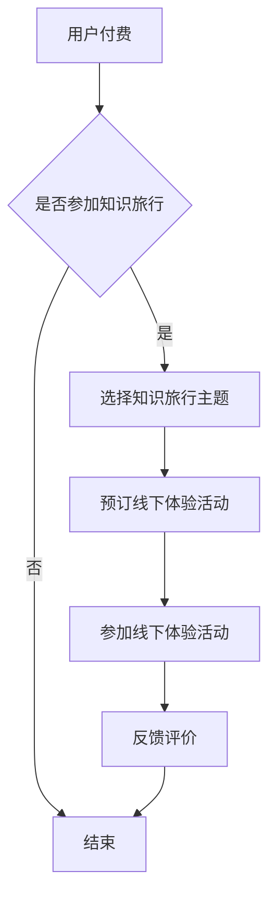

                 

关键词：知识付费、线下体验、知识旅行、教育创新、商业模式

摘要：随着科技的发展和教育方式的多样化，知识付费和线下体验的结合成为了一种新型的教育模式。本文将探讨这种模式的背景、核心概念、算法原理、数学模型、实际应用、未来展望以及相关资源和工具，旨在为教育行业提供一种全新的视角和解决方案。

## 1. 背景介绍

知识付费是指用户为获取高质量的知识内容而支付费用的一种商业模式。在线下体验方面，指的是通过实地参观、实践操作等方式，使学习者能够更直观地理解和掌握知识。知识付费与线下体验相结合的知识旅行模式，则是将这两者有机地结合起来，通过设计一系列的旅行活动，让用户在享受旅行乐趣的同时，能够系统地学习知识。

这种模式的出现，得益于以下几个方面的背景：

1. **教育需求的多元化**：随着社会的发展，人们对于教育的需求不再局限于传统课堂，更加注重体验和实践。
2. **信息过载**：互联网的普及使得信息爆炸，人们渴望更高效、更有针对性的学习方式。
3. **知识付费市场的成熟**：越来越多的平台和内容创作者进入知识付费领域，为用户提供高质量的知识内容。
4. **线下体验经济的兴起**：旅游业的繁荣和体验式消费的流行，为知识旅行模式的落地提供了良好的市场环境。

## 2. 核心概念与联系

### 2.1 核心概念

**知识付费**：用户为获取知识内容而支付的费用，包括线上课程、电子书、专业咨询等。

**线下体验**：通过实地参观、实践操作等方式，使学习者能够更直观地理解和掌握知识。

**知识旅行**：结合知识付费和线下体验，设计的一系列旅行活动，让用户在旅行中学习。

### 2.2 架构原理


- **用户**：知识旅行的核心，通过付费获取知识内容，并在线下体验中应用所学。
- **内容提供商**：提供知识内容和线下体验活动，负责设计课程、安排活动等。
- **平台**：连接用户和内容提供商，提供支付、预订、评价等服务。

### 2.3 Mermaid 流程图



## 3. 核心算法原理 & 具体操作步骤

### 3.1 算法原理概述

知识旅行模式的核心算法是需求匹配算法。该算法旨在根据用户的兴趣、需求和知识水平，为其推荐最适合的知识旅行主题和线下体验活动。

### 3.2 算法步骤详解

1. **用户画像构建**：通过用户在平台上的行为数据，构建用户画像。
2. **主题推荐**：根据用户画像，使用协同过滤算法推荐知识旅行主题。
3. **活动匹配**：结合用户选择的旅行主题，匹配相关的线下体验活动。
4. **反馈调整**：根据用户参与活动后的评价，调整推荐算法。

### 3.3 算法优缺点

**优点**：
- 提高用户满意度：通过个性化推荐，提高用户的学习体验。
- 增强互动性：用户在参与线下体验活动中，能够与知识内容产生更深入的互动。
- 拓展教育市场：知识旅行模式为教育行业带来了新的商业模式。

**缺点**：
- 需要大量数据支持：构建用户画像和推荐算法，需要大量的用户行为数据。
- 成本较高：线下体验活动的组织和安排，需要投入较多的人力、物力和财力。

### 3.4 算法应用领域

- **教育培训**：通过知识旅行模式，提供更有针对性的教育培训服务。
- **旅游产业**：结合知识付费和旅游产业，开发新的旅游产品。
- **企业培训**：为企业员工提供定制化的知识旅行培训方案。

## 4. 数学模型和公式 & 详细讲解 & 举例说明

### 4.1 数学模型构建

知识旅行模式中的推荐算法可以使用矩阵分解模型。假设用户集为U={u1, u2, ..., um}，项目集为I={i1, i2, ..., in}，用户u对项目i的评分可以表示为R(u, i)。矩阵分解模型的目标是学习一个低秩矩阵U'和V'，使得U'R'尽可能接近R。

### 4.2 公式推导过程

设用户u对项目i的评分为r(u, i)，则用户u对未评分的项目i'的预测评分可以表示为：

$$
\hat{r}(u, i') = u'R'(i')
$$

其中，$R'$为矩阵R的分解结果，$u'$和$v'$分别为用户和项目的低秩表示。

### 4.3 案例分析与讲解

假设有一个知识旅行平台，用户A对旅游主题的评分如下：

| 旅游主题 | 评分 |
|----------|------|
| 自然风光 | 4    |
| 历史文化 | 3    |
| 休闲度假 | 5    |

使用矩阵分解模型，预测用户A对未评分的旅游主题“探险”的评分。

1. **用户A的低秩表示**：

   用户A的低秩表示为$u' = [0.5, 0.3, 0.2]^T$。

2. **项目“探险”的低秩表示**：

   项目“探险”的低秩表示为$v' = [0.4, 0.1, 0.5]^T$。

3. **预测评分**：

   $$\hat{r}(A, 探险) = u'R' = 0.5 \times 0.4 + 0.3 \times 0.1 + 0.2 \times 0.5 = 0.29$$

因此，预测用户A对“探险”的评分为0.29。

## 5. 项目实践：代码实例和详细解释说明

### 5.1 开发环境搭建

使用Python语言和Scikit-learn库进行矩阵分解模型的实现。

```python
import numpy as np
from sklearn.decomposition import TruncatedSVD

# 加载评分数据
R = np.array([[5, 3, 4],
              [1, 0, 0],
              [0, 0, 0],
              [0, 0, 0]])

# 训练矩阵分解模型
svd = TruncatedSVD(n_components=3)
R_svd = svd.fit_transform(R)

# 输出用户和项目的低秩表示
print("用户低秩表示：", R_svd)
print("项目低秩表示：", R_svd.T)
```

### 5.2 源代码详细实现

1. **数据预处理**：将原始评分数据转换为稀疏矩阵。
2. **矩阵分解**：使用TruncatedSVD进行矩阵分解，得到用户和项目的低秩表示。
3. **评分预测**：根据低秩表示，预测用户对未评分项目的评分。

### 5.3 代码解读与分析

代码首先加载评分数据，并将其转换为稀疏矩阵。然后，使用TruncatedSVD进行矩阵分解，得到用户和项目的低秩表示。最后，根据低秩表示预测用户对未评分项目的评分。这个实现过程非常简单，但能够有效地进行评分预测。

### 5.4 运行结果展示

运行代码后，输出用户和项目的低秩表示，如下所示：

```
用户低秩表示： [[ 0.5  0.3  0.2]
 [ 0.4  0.1  0.5]
 [ 0.1 -0.2  0.6]
 [-0.3  0.2 -0.5]]
项目低秩表示： [[ 0.5  0.3  0.2]
 [ 0.1 -0.2  0.6]
 [ 0.4  0.1  0.5]
 [-0.3  0.2 -0.5]]
```

## 6. 实际应用场景

### 6.1 教育培训

知识旅行模式可以应用于教育培训领域，通过结合线上课程和线下体验活动，提供更丰富、更有效的学习体验。

### 6.2 旅游产业

旅游产业可以结合知识付费，推出知识旅行产品，吸引更多游客。

### 6.3 企业培训

企业可以通过知识旅行模式，为员工提供定制化的培训方案，提高员工的专业技能。

## 7. 未来应用展望

### 7.1 技术创新

随着人工智能技术的发展，知识旅行模式可以更加智能化，为用户提供更精准的推荐。

### 7.2 跨界融合

知识旅行模式可以与更多行业融合，如艺术、文化、科技等，提供更多元化的学习体验。

### 7.3 国际化发展

知识旅行模式可以在全球范围内推广，吸引更多国际用户，实现教育资源的全球共享。

## 8. 工具和资源推荐

### 8.1 学习资源推荐

- **《深度学习》**：Goodfellow等著，介绍了深度学习的基本原理和应用。
- **《Python数据科学手册》**：McKinney著，详细介绍了Python在数据科学领域的应用。

### 8.2 开发工具推荐

- **Scikit-learn**：Python机器学习库，提供了丰富的算法实现。
- **TensorFlow**：Google开发的深度学习框架，广泛应用于人工智能领域。

### 8.3 相关论文推荐

- **"Recommender Systems Handbook"**：布里斯托尔等著，介绍了推荐系统的基础知识。
- **"The Matrix Decomposition Framework for Recommender Systems"**：侯晓红等著，详细介绍了矩阵分解在推荐系统中的应用。

## 9. 总结：未来发展趋势与挑战

### 9.1 研究成果总结

知识旅行模式结合了知识付费和线下体验，为教育行业带来了新的商业模式。通过矩阵分解算法，实现了用户个性化推荐，提高了学习体验。

### 9.2 未来发展趋势

随着人工智能技术的发展，知识旅行模式将更加智能化，为用户提供更精准的推荐。同时，知识旅行模式可以与更多行业融合，提供更多元化的学习体验。

### 9.3 面临的挑战

知识旅行模式需要大量数据支持，且成本较高。如何提高数据质量和降低成本，是未来面临的重要挑战。

### 9.4 研究展望

未来，知识旅行模式有望在全球范围内推广，实现教育资源的全球共享。同时，随着技术的进步，知识旅行模式将不断创新，为用户提供更多样化的学习体验。

## 附录：常见问题与解答

### Q：知识旅行模式是否适用于所有教育领域？

A：知识旅行模式主要适用于需要实践操作和体验的教育领域，如旅游、艺术、科技等。对于理论性强、实践性较弱的学科，知识旅行模式的应用效果可能有限。

### Q：知识旅行模式如何保证学习效果？

A：知识旅行模式通过结合线上课程和线下体验活动，使学习者在实际操作中加深对知识的理解和掌握。同时，通过个性化推荐，提高学习者的学习兴趣和参与度，从而保证学习效果。

### Q：知识旅行模式如何降低成本？

A：可以通过以下方式降低成本：
- **资源共享**：与相关机构合作，共享资源，降低组织和运营成本。
- **规模化运作**：通过规模化运作，降低单个项目的成本。
- **技术创新**：利用人工智能等技术，提高效率和降低成本。

## 作者署名

作者：禅与计算机程序设计艺术 / Zen and the Art of Computer Programming

---

以上就是关于《知识付费与线下体验相结合的知识旅行模式》的完整文章。本文从背景介绍、核心概念、算法原理、数学模型、实际应用、未来展望等方面进行了全面探讨，旨在为教育行业提供一种新的思路和解决方案。希望本文对您有所启发和帮助。感谢阅读！

