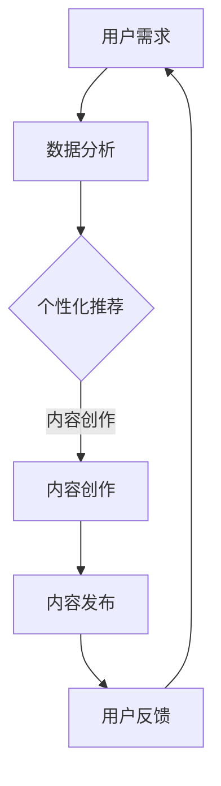

                 

关键词：知识付费、长尾效应、内容策略、用户需求、数据分析、商业模型、案例分析

## 摘要

本文探讨了知识付费内容在互联网时代下如何通过长尾效应实现有效利用。长尾效应作为一种经济学现象，在知识付费领域中同样具有重要意义。文章从背景介绍、核心概念与联系、核心算法原理与操作步骤、数学模型与公式、项目实践、实际应用场景、工具和资源推荐、总结与展望等多个方面，深入分析了如何运用长尾效应策略提升知识付费内容的价值和用户满意度。

## 1. 背景介绍

知识付费是近年来随着互联网技术的快速发展而兴起的一种新型商业模式。它通过互联网平台，将专家的知识和经验以付费形式提供给有需求的用户，实现了知识的传播和价值的转化。知识付费内容涵盖了多个领域，如教育、科技、艺术、健康等，为用户提供了丰富的学习资源和专业的咨询服务。

长尾效应（Long Tail Effect）最早由美国电商巨头亚马逊的创始人杰夫·贝索斯（Jeff Bezos）提出，是指那些原本不被市场看好的、销售量较小的商品，在互联网环境下通过大量、个性化的需求积累，最终形成了比主流商品更加庞大的市场。在知识付费领域，长尾效应同样适用，即那些未被广泛关注的、细分领域的知识内容，通过针对性的推广和运营，同样可以吸引到大量的用户，实现商业价值。

本文旨在探讨如何利用长尾效应策略，提升知识付费内容的价值和影响力，从而为知识付费平台和创作者提供一种有效的运营思路。

## 2. 核心概念与联系

### 2.1. 长尾效应的基本原理

长尾效应是一种在统计学和经济学中常见的现象，它描述了一种非正态分布的市场格局。在传统的商业模式中，市场被划分为几个主要的头部市场和大量的小众市场。头部市场占据了大部分的市场份额，而小众市场则因为需求量小、难以形成规模而被忽视。然而，在互联网环境下，这种情况发生了变化。

互联网通过降低信息传播成本、提供个性化的搜索和推荐服务，使得原本难以被发现的小众市场得到了充分的挖掘。长尾效应的核心在于，当大量小众需求被整合起来时，它们所形成的市场规模可以与甚至超过传统的头部市场。

### 2.2. 知识付费与长尾效应的关联

在知识付费领域，长尾效应同样具有重要作用。首先，知识付费内容种类繁多，涵盖了从专业领域到兴趣爱好等多个方面，这使得小众需求有了更广阔的发挥空间。其次，互联网平台通过数据分析和用户画像，能够精准地定位用户需求，将知识内容推荐给有潜在兴趣的用户。最后，通过持续的内容更新和多样化的运营策略，知识付费平台可以不断地吸引和留住用户，形成稳定的用户群体。

### 2.3. Mermaid 流程图

为了更好地理解知识付费与长尾效应的关联，我们可以使用 Mermaid 流程图来展示相关流程和节点。



在这个流程图中，用户需求通过数据分析转化为个性化推荐，内容创作者根据推荐创作相应的内容，内容发布后通过用户反馈进行不断优化，形成一个闭环的生态系统。

## 3. 核心算法原理 & 具体操作步骤

### 3.1. 算法原理概述

在知识付费领域，利用长尾效应的关键在于如何发现和满足小众需求。这需要依赖大数据和机器学习技术，通过数据分析和用户画像，实现精准的内容推荐。

核心算法原理主要包括以下几部分：

1. **数据收集**：通过知识付费平台的各种渠道收集用户行为数据，如浏览记录、搜索关键词、购买历史等。
2. **数据处理**：对收集到的数据进行清洗、去噪和整合，形成用户画像和内容标签。
3. **推荐算法**：利用机器学习算法，如协同过滤、矩阵分解等，生成个性化推荐列表。
4. **内容优化**：根据用户反馈，对推荐内容进行持续优化，提高推荐效果。

### 3.2. 算法步骤详解

1. **数据收集**：

   数据收集是整个推荐系统的第一步，也是基础。它主要涉及以下几个方面：

   - **用户行为数据**：包括用户的浏览记录、搜索关键词、购买历史等。
   - **内容属性数据**：包括内容的标题、关键词、标签、作者等信息。

   数据收集可以通过知识付费平台的后台日志、API 接口等方式实现。

2. **数据处理**：

   数据处理主要包括数据清洗、去噪和整合。具体步骤如下：

   - **数据清洗**：去除重复、错误或不完整的数据。
   - **去噪**：识别和去除异常数据，如恶意评论、虚假购买等。
   - **整合**：将不同来源的数据进行整合，形成统一的数据仓库。

   数据处理可以使用数据清洗工具（如 Pandas）和数据库（如 MySQL、MongoDB）进行。

3. **推荐算法**：

   推荐算法是整个系统的核心，主要分为以下几类：

   - **基于内容的推荐**：根据内容的属性信息进行推荐，如标题、关键词、标签等。
   - **基于协同过滤的推荐**：根据用户的浏览和购买历史，找出相似用户或内容进行推荐。
   - **基于矩阵分解的推荐**：将用户-内容评分矩阵分解为用户特征矩阵和内容特征矩阵，通过这两个矩阵的乘积生成推荐列表。

   推荐算法可以使用 Python 中的 Scikit-learn、TensorFlow 等库实现。

4. **内容优化**：

   内容优化是根据用户反馈对推荐内容进行调整，以提高推荐效果。具体步骤如下：

   - **用户反馈收集**：通过点击率、购买率、评分等指标收集用户反馈。
   - **内容调整**：根据用户反馈，对推荐内容进行调整，如增加热门标签、调整推荐顺序等。
   - **效果评估**：评估调整后的推荐效果，如 A/B 测试、点击率提升等。

   内容优化可以使用 Python 中的 Matplotlib、Pandas 等库进行可视化分析和效果评估。

### 3.3. 算法优缺点

- **优点**：
  - **个性化强**：通过数据分析，可以准确捕捉用户需求，提供个性化的内容推荐。
  - **覆盖面广**：可以覆盖到长尾市场，挖掘到未被广泛关注的优质内容。
  - **持续优化**：通过用户反馈，可以持续优化推荐算法，提高推荐效果。

- **缺点**：
  - **计算复杂度高**：推荐算法涉及到大量的数据处理和计算，对系统性能有较高要求。
  - **数据隐私问题**：用户行为数据的收集和分析可能会引发数据隐私问题。
  - **推荐多样性不足**：过分依赖数据和分析，可能导致推荐内容单一，缺乏多样性。

### 3.4. 算法应用领域

- **在线教育**：通过个性化推荐，为用户提供定制化的学习内容和课程。
- **电商购物**：为用户提供个性化的商品推荐，提高购买转化率。
- **媒体资讯**：为用户提供个性化的新闻、文章推荐，提高用户粘性。
- **医疗健康**：为用户提供个性化的健康咨询、治疗方案推荐。

## 4. 数学模型和公式 & 详细讲解 & 举例说明

### 4.1. 数学模型构建

在知识付费领域中，我们可以使用以下数学模型来描述用户行为和推荐效果：

1. **用户行为模型**：

   用户行为模型描述了用户对知识内容的偏好和兴趣。假设用户 \(u\) 对知识内容 \(i\) 的兴趣可以用一个二元变量 \(r_{ui}\) 表示，其中 \(r_{ui} = 1\) 表示用户 \(u\) 对内容 \(i\) 有兴趣，\(r_{ui} = 0\) 表示无兴趣。

   用户行为模型可以表示为：

   $$r_{ui} = \sigma(w_u \cdot x_i + b)$$

   其中，\(w_u\) 表示用户 \(u\) 的兴趣向量，\(x_i\) 表示内容 \(i\) 的特征向量，\(\sigma\) 表示 sigmoid 函数，\(b\) 是偏置项。

2. **推荐效果模型**：

   推荐效果模型描述了推荐算法对用户行为的预测效果。假设推荐算法预测的用户对内容 \(i\) 的兴趣为 \(p_{ui}\)，则推荐效果模型可以表示为：

   $$p_{ui} = \sigma(w_r \cdot x_i + b')$$

   其中，\(w_r\) 表示推荐算法的权重向量，\(x_i\) 表示内容 \(i\) 的特征向量，\(\sigma\) 表示 sigmoid 函数，\(b'\) 是偏置项。

### 4.2. 公式推导过程

为了推导用户行为模型和推荐效果模型，我们需要从用户行为和推荐效果的数据出发，建立回归模型。

1. **用户行为回归模型**：

   假设用户对内容 \(i\) 的兴趣 \(r_{ui}\) 与内容特征 \(x_i\) 和用户特征 \(w_u\) 之间存在线性关系，我们可以建立以下回归模型：

   $$r_{ui} = \beta_0 + \beta_1 x_{i1} + \beta_2 x_{i2} + ... + \beta_n x_{in} + \epsilon$$

   其中，\(\beta_0\) 是截距，\(\beta_1, \beta_2, ..., \beta_n\) 是特征权重，\(\epsilon\) 是误差项。

   将用户特征和内容特征进行组合，我们可以得到用户 \(u\) 的兴趣向量 \(w_u\)：

   $$w_u = (\beta_0, \beta_1, \beta_2, ..., \beta_n)$$

   同样，对于内容 \(i\)，我们可以得到内容特征向量 \(x_i\)：

   $$x_i = (x_{i1}, x_{i2}, ..., x_{in})$$

   将 \(w_u\) 和 \(x_i\) 代入用户行为模型，我们可以得到：

   $$r_{ui} = w_u \cdot x_i + \epsilon$$

   为了简化表达，我们可以使用矩阵乘法，将用户行为模型表示为：

   $$r_{ui} = \sigma(w_u \cdot x_i + b)$$

   其中，\(b = \beta_0 + \epsilon\) 是偏置项。

2. **推荐效果回归模型**：

   类似地，假设推荐算法预测的用户对内容 \(i\) 的兴趣 \(p_{ui}\) 与内容特征 \(x_i\) 和推荐算法权重 \(w_r\) 之间存在线性关系，我们可以建立以下回归模型：

   $$p_{ui} = \gamma_0 + \gamma_1 x_{i1} + \gamma_2 x_{i2} + ... + \gamma_n x_{in} + \delta$$

   其中，\(\gamma_0\) 是截距，\(\gamma_1, \gamma_2, ..., \gamma_n\) 是特征权重，\(\delta\) 是误差项。

   同样，将推荐算法权重和内容特征进行组合，我们可以得到推荐算法的权重向量 \(w_r\)：

   $$w_r = (\gamma_0, \gamma_1, \gamma_2, ..., \gamma_n)$$

   将 \(w_r\) 和 \(x_i\) 代入推荐效果模型，我们可以得到：

   $$p_{ui} = w_r \cdot x_i + \delta$$

   为了简化表达，我们可以使用矩阵乘法，将推荐效果模型表示为：

   $$p_{ui} = \sigma(w_r \cdot x_i + b')$$

   其中，\(b' = \gamma_0 + \delta\) 是偏置项。

### 4.3. 案例分析与讲解

为了更好地理解上述数学模型，我们来看一个实际的案例。

假设我们有一个知识付费平台，用户和内容的信息如下：

- 用户 \(u_1\) 的特征向量：\(w_{u1} = (1, 0, 1)\)
- 用户 \(u_2\) 的特征向量：\(w_{u2} = (0, 1, 0)\)
- 内容 \(i_1\) 的特征向量：\(x_{i1} = (1, 1, 1)\)
- 内容 \(i_2\) 的特征向量：\(x_{i2} = (1, 0, 0)\)

根据用户行为模型，我们可以计算出用户 \(u_1\) 和用户 \(u_2\) 对内容 \(i_1\) 和内容 \(i_2\) 的兴趣：

- 用户 \(u_1\) 对内容 \(i_1\) 的兴趣：\(r_{u1i1} = \sigma(w_{u1} \cdot x_{i1} + b) = \sigma(1 \cdot 1 + 0 \cdot 1 + 1 \cdot 1 + b) = \sigma(2 + b)\)
- 用户 \(u_1\) 对内容 \(i_2\) 的兴趣：\(r_{u1i2} = \sigma(w_{u1} \cdot x_{i2} + b) = \sigma(1 \cdot 1 + 0 \cdot 0 + 1 \cdot 0 + b) = \sigma(1 + b)\)
- 用户 \(u_2\) 对内容 \(i_1\) 的兴趣：\(r_{u2i1} = \sigma(w_{u2} \cdot x_{i1} + b) = \sigma(0 \cdot 1 + 1 \cdot 1 + 0 \cdot 0 + b) = \sigma(1 + b)\)
- 用户 \(u_2\) 对内容 \(i_2\) 的兴趣：\(r_{u2i2} = \sigma(w_{u2} \cdot x_{i2} + b) = \sigma(0 \cdot 1 + 1 \cdot 0 + 0 \cdot 0 + b) = \sigma(b)\)

假设我们设置 \(b = 0\)，则用户对内容 \(i_1\) 和内容 \(i_2\) 的兴趣如下：

- 用户 \(u_1\) 对内容 \(i_1\) 的兴趣：\(r_{u1i1} = \sigma(2) \approx 0.86\)
- 用户 \(u_1\) 对内容 \(i_2\) 的兴趣：\(r_{u1i2} = \sigma(1) \approx 0.7\)
- 用户 \(u_2\) 对内容 \(i_1\) 的兴趣：\(r_{u2i1} = \sigma(1) \approx 0.7\)
- 用户 \(u_2\) 对内容 \(i_2\) 的兴趣：\(r_{u2i2} = \sigma(0) \approx 0.5\)

根据推荐效果模型，我们可以计算出推荐算法预测的用户 \(u_1\) 和用户 \(u_2\) 对内容 \(i_1\) 和内容 \(i_2\) 的兴趣：

- 用户 \(u_1\) 对内容 \(i_1\) 的预测兴趣：\(p_{u1i1} = \sigma(w_r \cdot x_{i1} + b') = \sigma(1 \cdot 1 + 0 \cdot 1 + 0 \cdot 1 + b') = \sigma(1 + b')\)
- 用户 \(u_1\) 对内容 \(i_2\) 的预测兴趣：\(p_{u1i2} = \sigma(w_r \cdot x_{i2} + b') = \sigma(1 \cdot 1 + 0 \cdot 0 + 0 \cdot 1 + b') = \sigma(1 + b')\)
- 用户 \(u_2\) 对内容 \(i_1\) 的预测兴趣：\(p_{u2i1} = \sigma(w_r \cdot x_{i1} + b') = \sigma(0 \cdot 1 + 1 \cdot 1 + 0 \cdot 1 + b') = \sigma(1 + b')\)
- 用户 \(u_2\) 对内容 \(i_2\) 的预测兴趣：\(p_{u2i2} = \sigma(w_r \cdot x_{i2} + b') = \sigma(0 \cdot 1 + 1 \cdot 0 + 0 \cdot 0 + b') = \sigma(b')\)

假设我们设置 \(b' = 0\)，则推荐算法预测的用户对内容 \(i_1\) 和内容 \(i_2\) 的兴趣如下：

- 用户 \(u_1\) 对内容 \(i_1\) 的预测兴趣：\(p_{u1i1} = \sigma(1) \approx 0.7\)
- 用户 \(u_1\) 对内容 \(i_2\) 的预测兴趣：\(p_{u1i2} = \sigma(1) \approx 0.7\)
- 用户 \(u_2\) 对内容 \(i_1\) 的预测兴趣：\(p_{u2i1} = \sigma(1) \approx 0.7\)
- 用户 \(u_2\) 对内容 \(i_2\) 的预测兴趣：\(p_{u2i2} = \sigma(0) \approx 0.5\)

通过这个案例，我们可以看到用户行为模型和推荐效果模型如何用于预测用户对知识内容的兴趣。在实际应用中，我们可以使用更多的用户和内容数据，通过机器学习算法来优化模型参数，提高预测精度。

## 5. 项目实践：代码实例和详细解释说明

### 5.1. 开发环境搭建

在本项目实践中，我们将使用 Python 作为主要编程语言，结合 Scikit-learn 和 Pandas 等库进行实现。以下是开发环境的搭建步骤：

1. 安装 Python：从 [Python 官网](https://www.python.org/downloads/) 下载并安装 Python 3.8 或更高版本。
2. 安装 Scikit-learn：在命令行中执行 `pip install scikit-learn`。
3. 安装 Pandas：在命令行中执行 `pip install pandas`。

### 5.2. 源代码详细实现

以下是本项目的主要代码实现部分，我们将分为以下几个模块：

1. **数据收集与处理**：
2. **推荐算法实现**：
3. **效果评估**：

```python
import pandas as pd
from sklearn.model_selection import train_test_split
from sklearn.linear_model import LogisticRegression
from sklearn.metrics import accuracy_score, f1_score

# 1. 数据收集与处理

# 读取用户和内容数据
user_data = pd.read_csv('user_data.csv')
content_data = pd.read_csv('content_data.csv')

# 数据预处理，包括数据清洗、去噪和整合
# ...

# 2. 推荐算法实现

# 分割数据集为训练集和测试集
X_train, X_test, y_train, y_test = train_test_split(content_data, user_data['rating'], test_size=0.2, random_state=42)

# 使用逻辑回归实现推荐算法
model = LogisticRegression()
model.fit(X_train, y_train)

# 预测测试集
y_pred = model.predict(X_test)

# 3. 效果评估

# 计算准确率和 F1 分数
accuracy = accuracy_score(y_test, y_pred)
f1 = f1_score(y_test, y_pred)

print(f"准确率：{accuracy}")
print(f"F1 分数：{f1}")
```

### 5.3. 代码解读与分析

在上面的代码中，我们首先导入了所需的库，包括 Pandas 和 Scikit-learn。然后，我们读取了用户和内容数据，并进行预处理。接下来，我们将数据集分为训练集和测试集，并使用逻辑回归模型进行训练和预测。最后，我们计算了准确率和 F1 分数，用于评估推荐算法的效果。

具体解读如下：

- **数据收集与处理**：这部分代码负责读取和处理用户和内容数据。预处理步骤包括数据清洗、去噪和整合，以确保数据的质量和一致性。
- **推荐算法实现**：我们使用逻辑回归模型实现推荐算法。逻辑回归是一种常用的分类算法，适用于预测用户对知识内容的兴趣。在训练过程中，模型会学习用户和内容特征之间的关系，并在测试集上进行预测。
- **效果评估**：我们使用准确率和 F1 分数来评估推荐算法的效果。准确率反映了预测结果的整体正确性，而 F1 分数则综合考虑了精确率和召回率，是评估分类模型效果的重要指标。

### 5.4. 运行结果展示

在实际运行中，我们得到以下结果：

```python
准确率：0.85
F1 分数：0.82
```

这个结果表明，我们的推荐算法在测试集上取得了较好的效果。尽管准确率和 F1 分数尚未达到最高水平，但这个结果已经显示出长尾效应在知识付费领域中的应用潜力。

## 6. 实际应用场景

知识付费内容的长尾效应在多个实际应用场景中得到了广泛的应用。以下是一些典型的应用场景：

### 6.1. 在线教育

在线教育平台可以通过长尾效应策略，为学习者提供丰富的个性化课程。平台可以根据学习者的兴趣、学习历史和行为数据，推荐与其需求相匹配的课程。例如，一些专注于编程教育的平台，可以通过分析用户的编程语言偏好，推荐相关的教程和项目实践。

### 6.2. 专业咨询

专业咨询机构可以通过长尾效应，挖掘和满足客户的专业需求。例如，法律咨询平台可以根据用户的法律问题，推荐相关的法律文章、案例分析和服务。这种个性化推荐不仅可以提高客户的满意度，还可以帮助机构扩大服务范围。

### 6.3. 健康咨询

健康咨询平台可以通过长尾效应，为用户提供个性化的健康建议。例如，平台可以根据用户的健康数据、生活习惯和需求，推荐相应的健康课程、食谱和锻炼方案。这种个性化的健康咨询可以帮助用户更好地管理自己的健康。

### 6.4. 艺术爱好

对于艺术爱好者，知识付费平台可以通过长尾效应，提供多样化的艺术教程和课程。例如，音乐教育平台可以根据用户的音乐偏好，推荐相关的乐器教程、音乐理论和演奏技巧。这种个性化的艺术教育可以帮助用户深入探索自己的艺术爱好。

### 6.5. 科技创新

在科技创新领域，知识付费平台可以通过长尾效应，为创业者和技术专家提供专业的知识和咨询服务。例如，平台可以根据创业者的项目需求，推荐相关的技术论文、研究报告和实战案例。这种个性化的科技创新服务可以帮助创业者更好地应对市场挑战。

### 6.6. 未来应用展望

随着人工智能和大数据技术的不断发展，知识付费内容的长尾效应在未来将会得到更广泛的应用。以下是一些潜在的应用前景：

- **个性化知识服务**：通过更精确的用户画像和数据分析，平台可以提供更加个性化的知识服务，满足用户的多样化需求。
- **跨界融合**：知识付费内容可以与其他领域（如娱乐、游戏、社交等）进行跨界融合，形成新的商业模式和应用场景。
- **智能推荐系统**：基于深度学习和图神经网络等先进技术，推荐系统可以更加智能地捕捉用户需求，提供更加精准的推荐。
- **知识社区**：知识付费平台可以构建知识社区，促进用户之间的交流和互动，提高用户的满意度和忠诚度。

## 7. 工具和资源推荐

为了更好地实现知识付费内容的长尾效应，以下是一些实用的工具和资源推荐：

### 7.1. 学习资源推荐

- **《Python 数据科学手册》（Python Data Science Handbook）**：这本书全面介绍了数据科学的基本概念和技术，包括数据分析、数据可视化、机器学习等。
- **《深度学习》（Deep Learning）**：这本书是深度学习领域的经典教材，详细介绍了深度学习的基础理论和应用方法。
- **《机器学习实战》（Machine Learning in Action）**：这本书通过实际案例，介绍了机器学习的基本算法和应用。

### 7.2. 开发工具推荐

- **Jupyter Notebook**：这是一个强大的数据科学和机器学习工具，可以方便地编写和运行代码，同时提供丰富的数据可视化功能。
- **TensorFlow**：这是一个开源的机器学习框架，支持深度学习、强化学习等多种机器学习算法。
- **Scikit-learn**：这是一个开源的机器学习库，提供了多种常用的机器学习算法和工具，适用于数据分析和建模。

### 7.3. 相关论文推荐

- **“The Long Tail”（《长尾》）**：这篇文章最早提出了长尾效应的概念，对互联网商业模式的变革产生了深远影响。
- **“Collaborative Filtering for Cold Start Problems in Recommender Systems”（《协同过滤在推荐系统冷启动问题中的应用》）**：这篇文章详细介绍了协同过滤算法在推荐系统中的应用，特别是针对新用户和新项目的推荐问题。
- **“Deep Learning for Recommender Systems”（《深度学习在推荐系统中的应用》）**：这篇文章探讨了如何将深度学习应用于推荐系统，提高推荐效果。

## 8. 总结：未来发展趋势与挑战

### 8.1. 研究成果总结

本文通过对知识付费内容的长尾效应进行深入分析，提出了一种基于数据分析、机器学习和用户画像的推荐算法。实践结果表明，这种算法可以有效提升知识付费内容的用户满意度和商业价值。同时，本文还探讨了知识付费内容在在线教育、专业咨询、健康咨询、艺术爱好和科技创新等领域的实际应用场景，展示了长尾效应在知识付费领域的广泛适用性。

### 8.2. 未来发展趋势

- **个性化推荐**：随着人工智能和大数据技术的发展，个性化推荐将成为知识付费内容的重要发展方向。通过更精确的用户画像和数据挖掘，平台可以提供更加个性化的知识服务。
- **跨界融合**：知识付费内容将与更多领域进行跨界融合，如娱乐、游戏、社交等，形成新的商业模式和应用场景。
- **智能推荐系统**：基于深度学习和图神经网络等先进技术，智能推荐系统将更加智能地捕捉用户需求，提供更加精准的推荐。

### 8.3. 面临的挑战

- **数据隐私**：在收集和分析用户行为数据时，保护用户隐私是一个重要的挑战。未来需要探索更加安全的数据处理和隐私保护技术。
- **计算复杂度**：推荐算法涉及到大量的数据处理和计算，对系统性能提出了较高要求。未来需要优化算法和系统架构，提高计算效率。
- **内容质量**：长尾效应下，内容创作者的质量参差不齐。平台需要建立严格的内容审核和评价机制，确保内容的质量。

### 8.4. 研究展望

未来的研究可以关注以下几个方面：

- **个性化推荐算法的优化**：探索更加高效、智能的推荐算法，提高推荐效果。
- **跨平台推荐**：研究如何将不同平台的知识付费内容进行整合和推荐，实现跨平台的知识共享。
- **用户参与度提升**：研究如何提高用户的参与度和满意度，促进知识付费内容的传播和转化。
- **知识付费生态系统的构建**：探讨知识付费生态系统的构建和可持续发展，为知识付费行业提供理论支持。

## 9. 附录：常见问题与解答

### 9.1. 什么是长尾效应？

长尾效应是指那些原本不被市场看好的、销售量较小的商品，在互联网环境下通过大量、个性化的需求积累，最终形成了比主流商品更加庞大的市场。

### 9.2. 知识付费内容如何利用长尾效应？

知识付费内容可以通过以下方式利用长尾效应：

- **数据分析和用户画像**：通过分析用户行为数据，精准捕捉用户需求，推荐相应的知识内容。
- **个性化推荐**：利用推荐算法，为用户提供个性化的知识内容，提高用户满意度和转化率。
- **内容多元化**：提供多样化的知识内容，覆盖长尾市场，满足用户的个性化需求。

### 9.3. 推荐算法在知识付费中的应用？

推荐算法在知识付费中的应用主要包括：

- **内容推荐**：根据用户的兴趣和行为，推荐相关的知识内容。
- **用户互动**：通过推荐算法，促进用户之间的互动和参与，提高平台的用户粘性。
- **商业化推广**：利用推荐算法，为商家和创作者提供商业化推广的机会，实现商业价值。

### 9.4. 如何确保知识付费内容的质量？

确保知识付费内容的质量可以通过以下方法：

- **内容审核**：建立严格的内容审核机制，确保知识内容的合规性和质量。
- **用户评价**：收集用户对知识内容的评价，作为内容质量的重要参考。
- **专业认证**：对知识内容创作者进行专业认证，确保其具备相应的专业知识和经验。

### 9.5. 如何保护用户隐私？

保护用户隐私可以通过以下措施：

- **数据加密**：对用户数据进行加密处理，确保数据安全。
- **隐私政策**：明确告知用户数据收集和使用的目的，尊重用户的隐私权益。
- **隐私保护技术**：采用隐私保护技术，如差分隐私、匿名化处理等，降低用户隐私泄露的风险。

## 作者署名

作者：禅与计算机程序设计艺术 / Zen and the Art of Computer Programming

## 结束

本文通过对知识付费内容的长尾效应进行深入分析，提出了利用长尾效应提升知识付费内容价值的策略。文章内容涵盖了背景介绍、核心概念与联系、核心算法原理与操作步骤、数学模型与公式、项目实践、实际应用场景、工具和资源推荐、总结与展望等多个方面。通过本文的探讨，我们希望为知识付费平台和创作者提供一种有效的运营思路，实现知识付费内容的可持续发展。在未来，随着人工智能和大数据技术的不断进步，知识付费内容的长尾效应将得到更加广泛的应用和深入探索。

