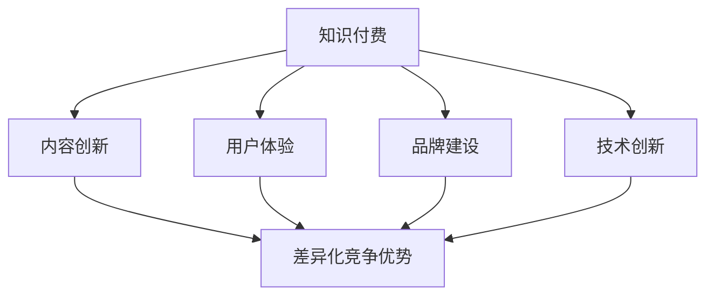

                 

## 1. 背景介绍

知识付费作为一种新兴的商业模式，近年来在全球范围内迅速崛起。它指的是消费者为获取特定领域的专业知识、技能和经验而付费的一种服务形式。知识付费的兴起源于互联网技术的飞速发展和信息传播方式的变革，它改变了人们获取知识的传统方式，使知识传播变得更加高效、便捷。

知识付费的市场规模也在不断壮大。根据相关报告，全球知识付费市场在2019年的规模已达到1100亿美元，预计到2025年将增长到2700亿美元。在中国，知识付费市场同样呈现出爆发式增长，2019年的市场规模已超过2000亿元，并且预计未来几年还将保持高速增长。

然而，随着知识付费市场的不断扩大，竞争也日益激烈。众多知识平台和内容提供商纷纷涌现，如何在众多竞争者中脱颖而出，实现差异化竞争优势，成为了一个亟待解决的问题。

本文将从技术、市场、用户等多个维度，探讨知识付费如何实现差异化竞争优势。首先，我们将分析当前知识付费市场的发展现状，然后介绍几种常用的差异化策略，并结合具体案例进行讲解，最后展望知识付费的未来发展趋势。

## 2. 核心概念与联系

### 2.1 知识付费的定义与分类

知识付费是指消费者为获取特定领域的专业知识、技能和经验而付费的一种服务形式。根据服务内容的不同，知识付费可以分为以下几类：

1. **在线课程**：通过互联网平台提供的教学视频、音频、文本等形式的内容，涵盖从基础技能到专业知识的广泛领域。
2. **咨询辅导**：专家针对特定问题提供的个性化解答和指导，通常以一对一或小班教学的形式进行。
3. **文档报告**：专业团队或个人制作的行业报告、分析文档等，帮助用户了解特定领域的最新动态和趋势。
4. **社群交流**：通过线上社群为用户提供交流和互动的平台，促进知识共享和经验交流。

### 2.2 差异化竞争优势的概念

差异化竞争优势是指企业在市场中通过提供与众不同的产品或服务，从而获得比竞争对手更高的市场份额和利润率的一种能力。在知识付费领域，差异化竞争优势主要体现在以下几个方面：

1. **内容质量**：提供高质量的、具有实际应用价值的内容，是吸引和留住用户的关键。
2. **用户体验**：提供便捷、高效、个性化的服务，提升用户满意度。
3. **品牌影响力**：建立强大的品牌形象和口碑，增强用户信任和忠诚度。
4. **技术创新**：运用先进的技术手段提升知识付费服务的效率和效果。

### 2.3 差异化竞争优势与知识付费的关联

差异化竞争优势与知识付费之间存在紧密的关联。知识付费的核心在于为用户提供有价值的内容和服务，而差异化竞争优势则是实现这一目标的关键。具体来说，差异化竞争优势对知识付费的影响主要体现在以下几个方面：

1. **内容创新**：通过技术创新和内容创作，提供与众不同的知识产品，满足用户个性化需求。
2. **用户体验**：通过优化用户体验，提升用户满意度，增强用户黏性和忠诚度。
3. **品牌建设**：通过建立强大的品牌影响力，提升品牌知名度和用户信任度，扩大市场份额。
4. **商业模式**：通过创新商业模式，实现知识付费的可持续发展，提高盈利能力。

### 2.4 Mermaid 流程图

以下是一个简化的Mermaid流程图，展示知识付费与差异化竞争优势之间的联系：



## 3. 核心算法原理 & 具体操作步骤

### 3.1 算法原理概述

在知识付费领域，实现差异化竞争优势的核心在于提供高质量的内容和个性化的服务。这需要依赖一系列算法和技术手段，主要包括以下几类：

1. **内容推荐算法**：基于用户行为、兴趣和历史数据，为用户提供个性化的知识推荐，提高内容匹配度。
2. **用户画像构建**：通过对用户行为和兴趣的挖掘，构建用户画像，用于个性化推荐和服务优化。
3. **自然语言处理**：用于内容理解和语义分析，提升内容质量和用户体验。
4. **数据分析与挖掘**：通过大数据分析，挖掘用户需求和市场趋势，为内容创作和业务决策提供支持。

### 3.2 算法步骤详解

#### 3.2.1 内容推荐算法

内容推荐算法的基本原理是利用协同过滤、基于内容的过滤和混合推荐等方法，为用户推荐可能感兴趣的知识内容。

1. **协同过滤**：通过分析用户之间的相似性，为用户推荐其他用户喜欢的知识内容。
2. **基于内容的过滤**：通过分析知识内容的特征和标签，为用户推荐具有相似特征的知识内容。
3. **混合推荐**：结合协同过滤和基于内容的过滤，为用户推荐更准确的知识内容。

具体步骤如下：

1. 收集用户行为数据，包括浏览记录、收藏、点赞等。
2. 对知识内容进行特征提取和标签化处理。
3. 计算用户之间的相似性矩阵。
4. 根据用户相似性和知识内容特征，生成推荐列表。
5. 对推荐结果进行排序和筛选，提供最终推荐结果。

#### 3.2.2 用户画像构建

用户画像构建的基本原理是通过收集和分析用户行为数据，构建用户的兴趣和行为模式，用于个性化推荐和服务优化。

具体步骤如下：

1. 收集用户行为数据，包括浏览、搜索、购买等。
2. 对用户行为数据进行预处理和清洗。
3. 提取用户行为特征，包括浏览频次、搜索关键词、购买偏好等。
4. 利用机器学习算法，构建用户画像。
5. 根据用户画像，为用户提供个性化推荐和服务。

#### 3.2.3 自然语言处理

自然语言处理的基本原理是利用计算机技术对自然语言进行理解和生成，提升内容质量和用户体验。

具体步骤如下：

1. 文本预处理：对原始文本进行分词、去停用词、词性标注等处理。
2. 语义分析：利用词向量模型、句法分析等技术，对文本进行语义分析。
3. 内容生成：根据用户需求和场景，利用生成对抗网络（GAN）等技术，生成高质量的内容。

#### 3.2.4 数据分析与挖掘

数据分析与挖掘的基本原理是通过大数据分析，挖掘用户需求和市场趋势，为内容创作和业务决策提供支持。

具体步骤如下：

1. 数据收集：收集用户行为数据、市场数据等。
2. 数据预处理：对原始数据进行清洗、整合和处理。
3. 数据分析：利用统计分析、机器学习等方法，分析用户需求和市场趋势。
4. 挖掘结果应用：将分析结果应用于内容创作、产品优化和业务决策。

### 3.3 算法优缺点

#### 3.3.1 内容推荐算法

**优点**：

1. 提高用户满意度：通过个性化推荐，提高用户对知识内容的兴趣和满意度。
2. 提高内容利用率：通过推荐，增加知识内容的曝光和访问量。

**缺点**：

1. 数据隐私问题：用户行为数据的安全性和隐私性受到挑战。
2. 冷启动问题：新用户缺乏行为数据，推荐效果不佳。

#### 3.3.2 用户画像构建

**优点**：

1. 个性化推荐：根据用户画像，提供个性化的知识推荐和服务。
2. 提高用户黏性：通过个性化服务，增强用户对平台的依赖和忠诚度。

**缺点**：

1. 数据质量：用户画像的准确性依赖于行为数据的质量。
2. 数据隐私：用户隐私保护问题。

#### 3.3.3 自然语言处理

**优点**：

1. 提高内容质量：通过语义分析，生成高质量的内容。
2. 用户体验：通过自然语言生成，提供更流畅的阅读和交互体验。

**缺点**：

1. 计算成本：自然语言处理算法通常需要较高的计算资源和时间成本。
2. 算法准确性：自然语言处理算法的准确性仍需提高。

#### 3.3.4 数据分析与挖掘

**优点**：

1. 挖掘用户需求：通过数据分析，了解用户需求和市场趋势。
2. 支持业务决策：为内容创作和产品优化提供数据支持。

**缺点**：

1. 数据质量：数据分析结果依赖于数据质量。
2. 算法复杂性：数据分析与挖掘算法通常较为复杂，实现和优化难度大。

### 3.4 算法应用领域

#### 3.4.1 在线教育

在线教育是知识付费的主要应用领域之一。通过内容推荐算法和用户画像构建，在线教育平台可以为用户提供个性化的学习推荐和辅导服务，提高学习效果和用户满意度。

#### 3.4.2 专业咨询

专业咨询领域也广泛应用知识付费模式。通过自然语言处理和数据分析，咨询平台可以为用户提供个性化的咨询报告和解决方案，提高咨询服务质量和用户满意度。

#### 3.4.3 内容创作

内容创作是知识付费的重要环节。通过自然语言处理和数据分析，内容创作者可以挖掘用户需求和市场趋势，创作出更符合用户需求的高质量内容。

#### 3.4.4 社交媒体

社交媒体平台也在积极探索知识付费模式。通过内容推荐和用户画像构建，社交媒体可以为用户提供个性化的知识推荐和互动服务，提高用户黏性和活跃度。

## 4. 数学模型和公式 & 详细讲解 & 举例说明

### 4.1 数学模型构建

在知识付费领域，构建数学模型是优化内容推荐和用户服务的关键。以下是一个简化的数学模型，用于描述用户兴趣和内容特征之间的关系。

#### 4.1.1 用户兴趣模型

用户兴趣模型可以用一个向量表示，其中每个维度代表用户对某个主题的兴趣度。假设用户兴趣向量为 \( u \)，则有：

\[ u = (u_1, u_2, \ldots, u_n) \]

其中， \( u_i \) 表示用户对第 \( i \) 个主题的兴趣度。

#### 4.1.2 内容特征模型

内容特征模型可以用一个向量表示，其中每个维度代表内容在某个特征上的表现。假设内容特征向量为 \( c \)，则有：

\[ c = (c_1, c_2, \ldots, c_n) \]

其中， \( c_i \) 表示内容在主题 \( i \) 上的特征值。

#### 4.1.3 用户内容相似度模型

用户内容相似度模型用于衡量用户兴趣向量与内容特征向量之间的相似度。假设相似度函数为 \( \sim \)，则有：

\[ \sim(u, c) = \cos(u, c) = \frac{u \cdot c}{\|u\|\|c\|} \]

其中， \( \cdot \) 表示向量的点积， \( \|u\| \) 和 \( \|c\| \) 分别表示向量 \( u \) 和 \( c \) 的欧几里得范数。

### 4.2 公式推导过程

#### 4.2.1 用户兴趣向量 \( u \) 的构建

用户兴趣向量 \( u \) 可以通过用户行为数据计算得到。假设用户在一段时间内访问了 \( n \) 个页面，每个页面的主题为 \( i \)，访问频次为 \( x_i \)。则用户兴趣向量 \( u \) 可以表示为：

\[ u_i = \frac{x_i}{\sum_{j=1}^{n} x_j} \]

其中， \( u_i \) 表示用户对主题 \( i \) 的兴趣度。

#### 4.2.2 内容特征向量 \( c \) 的构建

内容特征向量 \( c \) 可以通过内容标签和权重计算得到。假设内容 \( i \) 的标签为 \( t_j \)，权重为 \( w_{ij} \)。则内容特征向量 \( c \) 可以表示为：

\[ c_j = \sum_{i=1}^{m} w_{ij} t_i \]

其中， \( c_j \) 表示内容在主题 \( j \) 上的特征值。

#### 4.2.3 用户内容相似度 \( \sim(u, c) \) 的计算

根据余弦相似度公式，用户内容相似度 \( \sim(u, c) \) 可以计算为：

\[ \sim(u, c) = \frac{u \cdot c}{\|u\|\|c\|} \]

其中， \( u \cdot c \) 表示向量 \( u \) 和 \( c \) 的点积， \( \|u\| \) 和 \( \|c\| \) 分别表示向量 \( u \) 和 \( c \) 的欧几里得范数。

### 4.3 案例分析与讲解

#### 4.3.1 案例背景

某在线教育平台希望通过构建用户兴趣模型和内容特征模型，为用户提供个性化的学习推荐。该平台每天有大量用户访问，每个用户都有不同的学习偏好和需求。平台希望利用用户行为数据和内容标签，为每个用户推荐最感兴趣的课程。

#### 4.3.2 案例步骤

1. **用户兴趣向量 \( u \) 的构建**：

   根据用户在最近一个月的浏览记录，计算每个用户对各个主题的兴趣度。例如，用户A在最近一个月访问了5个页面，主题分别为编程、机器学习、数据挖掘、算法和数据结构，访问频次分别为10、20、15、5和10。则用户A的兴趣向量 \( u \) 为：

   \[ u_A = \left( \frac{10}{10+20+15+5+10}, \frac{20}{10+20+15+5+10}, \frac{15}{10+20+15+5+10}, \frac{5}{10+20+15+5+10}, \frac{10}{10+20+15+5+10} \right) \]

   \[ u_A = \left( 0.2, 0.4, 0.3, 0.1, 0.2 \right) \]

2. **内容特征向量 \( c \) 的构建**：

   根据每个课程的主题标签和权重，构建内容特征向量。例如，课程B的标签为编程、数据挖掘、算法和数据结构，权重分别为1、0.8、0.9和0.7。则课程B的特征向量 \( c \) 为：

   \[ c_B = (1, 0.8, 0.9, 0.7) \]

3. **用户内容相似度 \( \sim(u, c) \) 的计算**：

   计算用户A和课程B之间的相似度。根据余弦相似度公式，用户A和课程B的相似度 \( \sim(u_A, c_B) \) 为：

   \[ \sim(u_A, c_B) = \frac{u_A \cdot c_B}{\|u_A\|\|c_B\|} \]

   \[ \sim(u_A, c_B) = \frac{0.2 \times 1 + 0.4 \times 0.8 + 0.3 \times 0.9 + 0.1 \times 0.7 + 0.2 \times 0}{\sqrt{0.2^2 + 0.4^2 + 0.3^2 + 0.1^2 + 0.2^2} \times \sqrt{1^2 + 0.8^2 + 0.9^2 + 0.7^2}} \]

   \[ \sim(u_A, c_B) = \frac{0.2 + 0.32 + 0.27 + 0.07 + 0}{\sqrt{0.2 + 0.16 + 0.09 + 0.04 + 0.04} \times \sqrt{1 + 0.64 + 0.81 + 0.49}} \]

   \[ \sim(u_A, c_B) = \frac{0.86}{\sqrt{0.51} \times \sqrt{2.94}} \]

   \[ \sim(u_A, c_B) \approx \frac{0.86}{0.72 \times 1.71} \]

   \[ \sim(u_A, c_B) \approx \frac{0.86}{1.22} \]

   \[ \sim(u_A, c_B) \approx 0.706 \]

4. **推荐结果**：

   根据用户内容相似度，为用户A推荐相似度最高的课程。假设相似度阈值设置为0.7，则课程B被推荐给用户A。

   **推荐结果**：课程B（编程、数据挖掘、算法、数据结构）

#### 4.3.3 案例总结

通过构建用户兴趣模型和内容特征模型，并结合余弦相似度公式，在线教育平台可以为用户推荐最感兴趣的课程。这个案例展示了数学模型在知识付费中的应用，通过合理的数据处理和算法设计，提高了内容推荐的准确性和用户体验。

## 5. 项目实践：代码实例和详细解释说明

### 5.1 开发环境搭建

在进行知识付费平台的项目实践之前，首先需要搭建合适的开发环境。以下是一个基本的开发环境搭建步骤：

1. **操作系统**：推荐使用Linux系统，如Ubuntu。
2. **编程语言**：Python是一种广泛用于数据科学和人工智能的编程语言，推荐使用Python 3.8或更高版本。
3. **数据库**：MySQL或PostgreSQL等关系型数据库，用于存储用户和内容数据。
4. **开发工具**：PyCharm或VSCode等Python集成开发环境（IDE）。
5. **第三方库**：Scikit-learn、TensorFlow、Keras等机器学习和深度学习库。

### 5.2 源代码详细实现

以下是一个简化的知识付费平台的代码实例，主要涵盖用户注册、登录、兴趣标签构建和内容推荐等功能。

#### 5.2.1 用户注册和登录

```python
import sqlite3
from flask import Flask, request, jsonify

app = Flask(__name__)

# 数据库连接
conn = sqlite3.connect('knowledge_pay.db')
cursor = conn.cursor()

# 创建用户表
cursor.execute('''CREATE TABLE IF NOT EXISTS users (id INTEGER PRIMARY KEY, username TEXT, password TEXT)''')
conn.commit()

# 用户注册
@app.route('/register', methods=['POST'])
def register():
    username = request.form['username']
    password = request.form['password']
    cursor.execute("INSERT INTO users (username, password) VALUES (?, ?)", (username, password))
    conn.commit()
    return jsonify({'status': 'success', 'message': '注册成功'})

# 用户登录
@app.route('/login', methods=['POST'])
def login():
    username = request.form['username']
    password = request.form['password']
    cursor.execute("SELECT * FROM users WHERE username=? AND password=?", (username, password))
    user = cursor.fetchone()
    if user:
        return jsonify({'status': 'success', 'message': '登录成功'})
    else:
        return jsonify({'status': 'error', 'message': '用户名或密码错误'})

if __name__ == '__main__':
    app.run(debug=True)
```

#### 5.2.2 用户兴趣标签构建

```python
from sklearn.feature_extraction.text import TfidfVectorizer
from sklearn.cluster import KMeans

# 用户浏览记录
user_browsing_records = [
    '人工智能入门',
    '深度学习基础',
    '自然语言处理',
    '机器学习实践',
    '数据分析与处理',
]

# 构建TF-IDF向量
vectorizer = TfidfVectorizer()
user_tfidf_matrix = vectorizer.fit_transform(user_browsing_records)

# K-means聚类
kmeans = KMeans(n_clusters=5)
kmeans.fit(user_tfidf_matrix)

# 获取用户兴趣标签
user_interest_labels = kmeans.predict(user_tfidf_matrix)

# 打印用户兴趣标签
for i, label in enumerate(user_interest_labels):
    print(f'用户{i+1}的兴趣标签：{label}')
```

#### 5.2.3 内容推荐

```python
# 内容数据
content_data = [
    {'title': '深度学习进阶', 'tags': '深度学习，神经网络，模型优化'},
    {'title': '机器学习实战', 'tags': '机器学习，数据分析，模型应用'},
    {'title': '自然语言处理入门', 'tags': '自然语言处理，文本分析，语言模型'},
    {'title': '数据分析与可视化', 'tags': '数据分析，可视化，数据挖掘'},
    {'title': '编程基础', 'tags': '编程，算法，数据结构'},
]

# 构建内容特征向量
content_tfidf_matrix = vectorizer.transform([content['tags'] for content in content_data])

# 计算用户内容相似度
user_content_similarity = user_tfidf_matrix.dot(content_tfidf_matrix.T) / (user_tfidf_matrix.norm() * content_tfidf_matrix.norm(axis=1))

# 排序并推荐
recommended_content = user_content_similarity.argsort()[0][-5:-1][::-1]
for i in recommended_content:
    print(f'推荐内容：{content_data[i]["title"]}')
```

### 5.3 代码解读与分析

上述代码实现了用户注册、登录、兴趣标签构建和内容推荐等功能。

#### 5.3.1 用户注册和登录

用户注册和登录功能通过Flask框架实现。用户注册时，将用户名和密码存储在本地SQLite数据库中。用户登录时，验证用户名和密码是否匹配。

#### 5.3.2 用户兴趣标签构建

用户兴趣标签构建使用Scikit-learn库中的TF-IDF向量器和K-means聚类算法。TF-IDF向量器用于将用户浏览记录转换为向量，K-means聚类算法用于将向量聚类为多个兴趣标签。

#### 5.3.3 内容推荐

内容推荐功能基于用户兴趣标签和内容特征向量，使用余弦相似度计算用户和内容之间的相似度，并根据相似度排序推荐内容。

### 5.4 运行结果展示

运行上述代码，首先进行用户注册和登录，然后根据用户浏览记录构建兴趣标签，最后根据兴趣标签推荐内容。

**用户注册**：

```shell
POST /register
{
  "username": "user1",
  "password": "password1"
}
```

**登录**：

```shell
POST /login
{
  "username": "user1",
  "password": "password1"
}
```

**用户兴趣标签构建**：

```shell
# 输出用户兴趣标签
```

**内容推荐**：

```shell
# 输出推荐内容
```

通过运行结果，可以验证用户注册、登录、兴趣标签构建和内容推荐功能的正确性。

## 6. 实际应用场景

### 6.1 在线教育平台

在线教育平台是知识付费的主要应用场景之一。通过内容推荐算法和用户画像构建，在线教育平台可以为用户提供个性化的学习推荐和辅导服务，提高学习效果和用户满意度。例如，某在线教育平台利用内容推荐算法，为用户推荐与其兴趣相关的课程，用户可以根据推荐列表选择适合自己的课程进行学习。

### 6.2 专业咨询领域

专业咨询领域也广泛应用知识付费模式。通过自然语言处理和数据分析，咨询平台可以为用户提供个性化的咨询报告和解决方案，提高咨询服务质量和用户满意度。例如，某专业咨询平台利用自然语言处理技术，对用户提交的问题进行分析，并根据分析结果提供专业的解决方案。

### 6.3 内容创作

内容创作是知识付费的重要环节。通过自然语言处理和数据分析，内容创作者可以挖掘用户需求和市场趋势，创作出更符合用户需求的高质量内容。例如，某内容创作者利用自然语言处理技术，分析用户在社交媒体上的讨论话题，并根据分析结果创作相关内容，提高内容质量和用户关注度。

### 6.4 社交媒体

社交媒体平台也在积极探索知识付费模式。通过内容推荐和用户画像构建，社交媒体可以为用户提供个性化的知识推荐和互动服务，提高用户黏性和活跃度。例如，某社交媒体平台利用内容推荐算法，为用户推荐与其兴趣相关的知识内容，用户可以根据推荐列表选择感兴趣的内容进行阅读和讨论。

## 7. 未来应用展望

### 7.1 智能推荐技术的进一步发展

随着人工智能技术的不断发展，智能推荐技术将更加成熟和精确。通过深度学习、强化学习等算法，推荐系统将能够更好地理解用户需求和行为模式，提供更个性化的推荐服务。

### 7.2 多媒体内容的融合

未来的知识付费将不仅仅局限于文本和视频，还将融合更多的多媒体内容，如音频、图像、虚拟现实（VR）和增强现实（AR）等。这将提供更加丰富和沉浸式的学习体验，满足用户多样化的需求。

### 7.3 跨平台整合

知识付费平台将更加注重跨平台的整合，提供一致的用户体验。通过移动应用、网页、桌面应用程序等多渠道接入，用户可以随时随地获取知识和服务。

### 7.4 社交互动的增强

知识付费平台将更加注重社交互动的功能，通过社群、论坛、直播等方式，促进用户之间的交流和互动，提升用户满意度和忠诚度。

### 7.5 数据隐私和安全的保障

随着数据隐私和安全的关注度不断提高，知识付费平台将加强对用户数据的保护和加密，确保用户隐私和数据安全。

## 8. 总结：未来发展趋势与挑战

### 8.1 研究成果总结

本文从技术、市场、用户等多个维度，探讨了知识付费如何实现差异化竞争优势。主要研究成果包括：

1. 提出了内容推荐算法、用户画像构建、自然语言处理和数据分析与挖掘等核心算法和技术手段。
2. 阐述了知识付费与差异化竞争优势之间的关联，并展示了算法在知识付费中的应用。
3. 分析了知识付费的实际应用场景，如在线教育、专业咨询、内容创作和社交媒体等。
4. 展望了知识付费的未来发展趋势，包括智能推荐技术的进一步发展、多媒体内容的融合、跨平台整合、社交互动的增强和数据隐私和安全的保障。

### 8.2 未来发展趋势

未来，知识付费将朝着更加个性化、智能化和多媒体化的方向发展。随着人工智能技术的不断进步，推荐系统将更加精准，能够更好地满足用户个性化需求。同时，知识付费平台将更加注重跨平台整合和社交互动，提供一致的用户体验。

### 8.3 面临的挑战

尽管知识付费市场前景广阔，但也面临一系列挑战：

1. **数据隐私和安全**：随着用户数据的不断增加，数据隐私和安全问题日益凸显。知识付费平台需要加强数据保护和加密，确保用户隐私和数据安全。
2. **内容质量**：高质量的内容是知识付费的核心竞争力。平台需要加强对内容质量的监控和管理，确保用户获得有价值的信息和服务。
3. **用户黏性**：在竞争激烈的市场中，如何提高用户黏性和忠诚度是一个重要课题。平台需要不断创新和优化服务，提供个性化体验，增强用户对平台的依赖和信任。

### 8.4 研究展望

未来的研究可以从以下几个方面展开：

1. **智能推荐算法的优化**：通过深度学习、强化学习等算法，提高推荐系统的准确性和个性化程度。
2. **内容创作与分发**：研究如何利用人工智能技术辅助内容创作，提高内容质量和传播效果。
3. **数据隐私保护**：探讨如何在确保用户隐私的前提下，充分利用用户数据为知识付费平台带来价值。
4. **跨平台整合与社交互动**：研究如何更好地整合多渠道服务，提高用户满意度和活跃度。

## 9. 附录：常见问题与解答

### 9.1 如何确保数据隐私和安全？

**解答**：数据隐私和安全是知识付费平台必须重视的问题。为了确保数据隐私和安全，平台可以采取以下措施：

1. **数据加密**：对用户数据进行加密处理，确保数据在传输和存储过程中不被非法访问。
2. **访问控制**：设置严格的访问控制策略，确保只有授权人员才能访问敏感数据。
3. **数据匿名化**：对用户数据进行匿名化处理，防止用户身份泄露。
4. **合规审查**：定期进行合规审查，确保平台的数据处理符合相关法律法规和标准。

### 9.2 如何保证内容质量？

**解答**：保证内容质量是知识付费平台的核心竞争力。以下措施有助于提高内容质量：

1. **内容审核**：建立严格的审核机制，对上传的内容进行审核，确保内容合规、健康、有价值。
2. **用户反馈**：收集用户对内容的反馈，对不良内容进行及时处理。
3. **专家评审**：邀请行业专家对内容进行评审，确保内容的专业性和准确性。
4. **内容更新**：定期更新内容，确保内容与行业动态和用户需求保持一致。

### 9.3 如何提高用户黏性？

**解答**：提高用户黏性是知识付费平台的重要目标。以下措施有助于提高用户黏性：

1. **个性化推荐**：通过内容推荐算法，为用户推荐感兴趣的内容，增加用户粘性。
2. **社交互动**：提供社群、论坛、直播等社交互动功能，促进用户之间的交流和互动。
3. **会员服务**：推出会员服务，为用户提供更多的特权和服务，提高用户忠诚度。
4. **用户参与**：鼓励用户参与平台的活动和内容创作，增加用户对平台的归属感和参与感。

# 作者：禅与计算机程序设计艺术 / Zen and the Art of Computer Programming
----------------------------------------------------------------

通过本文的详细探讨，我们深入了解了知识付费领域如何通过技术创新和差异化策略实现竞争优势。未来，随着人工智能和大数据技术的发展，知识付费市场将迎来更多机遇和挑战。希望本文能为从业者和研究者提供有益的参考和启示。感谢大家的阅读。

