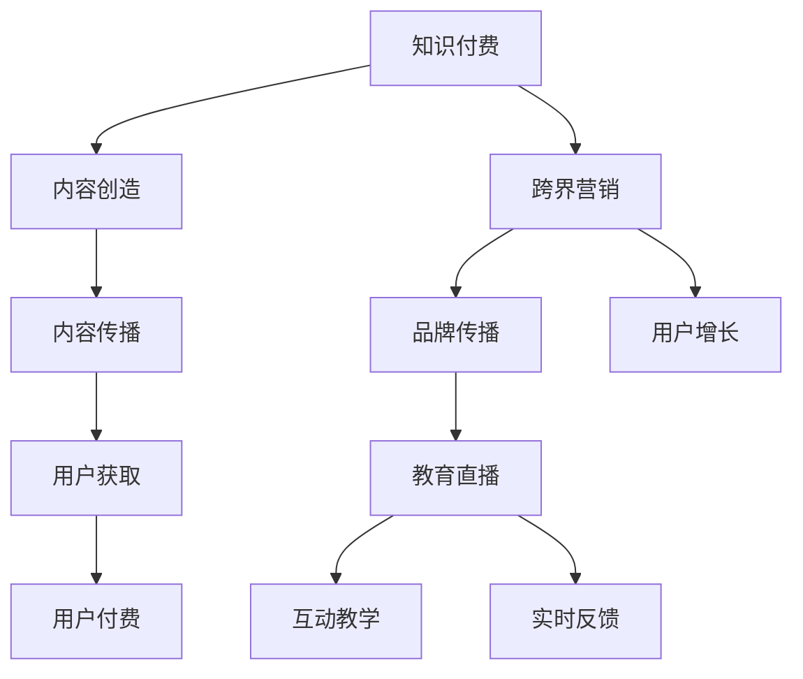

                 

 在当今数字化时代，知识付费行业正经历着前所未有的快速发展。各类在线教育平台、专业课程、知识服务应用层出不穷，用户对于高质量、有深度的知识内容的需求日益增长。与此同时，营销领域也在不断变革，从传统的广告模式转向更加精准的个性化营销。那么，如何将知识付费与跨界营销相结合，实现教育直播的跨界发展，成为了一个值得探讨的课题。

## 1. 背景介绍

### 知识付费的兴起

随着互联网的普及和信息技术的进步，知识付费市场逐渐形成并快速发展。用户可以通过在线平台购买各种形式的课程内容，如视频讲座、电子书、专业问答等。这种模式不仅满足了用户对知识的需求，也为内容创作者提供了新的收入来源。

### 教育直播的发展

教育直播作为在线教育的一种形式，近年来得到了广泛关注。通过网络直播平台，教育机构和个人讲师可以实时向全球观众传授知识，互动性、实时性成为其核心优势。

### 跨界营销的必要性

跨界营销在当前的市场环境下显得尤为重要。通过将知识付费与营销手段相结合，可以扩大用户基础，提高品牌知名度，实现知识内容的多元传播。

## 2. 核心概念与联系

为了更好地理解知识付费与跨界营销的关系，我们首先需要明确几个核心概念：

### 知识付费

知识付费指的是用户为获取特定知识或技能而支付的费用。这一模式的核心在于优质内容的创造与传播。

### 跨界营销

跨界营销是指将一个领域的营销策略应用于另一个领域，以实现品牌价值的最大化。

### 教育直播

教育直播是指通过互联网进行实时教学的活动，强调互动性和实时性。

### Mermaid 流程图



## 3. 核心算法原理 & 具体操作步骤

### 3.1 算法原理概述

知识付费与跨界营销的结合，需要一种有效的算法来指导操作。这一算法的核心在于数据的分析和处理。

### 3.2 算法步骤详解

1. **用户画像构建**：通过数据分析，为用户创建详细的画像，包括用户兴趣、消费习惯等。
2. **内容推荐**：根据用户画像，为用户提供个性化的知识内容推荐。
3. **营销策略制定**：结合用户画像和内容特点，制定相应的跨界营销策略。
4. **效果评估**：通过数据反馈，评估营销效果，不断优化策略。

### 3.3 算法优缺点

- **优点**：提高用户满意度，增加用户粘性，提高转化率。
- **缺点**：算法复杂度高，数据安全风险。

### 3.4 算法应用领域

- **在线教育**：为用户提供个性化学习路径。
- **市场营销**：实现精准广告投放。

## 4. 数学模型和公式 & 详细讲解 & 举例说明

### 4.1 数学模型构建

假设用户U对知识K的付费意愿可以用概率P表示，那么我们可以构建以下模型：

$$ P = f(I, C, T) $$

其中，I为用户兴趣，C为内容质量，T为营销策略。

### 4.2 公式推导过程

通过对大量数据的分析，我们可以得到以下关系：

$$ f(I, C, T) = \alpha I + \beta C + \gamma T $$

其中，α、β、γ分别为权重系数。

### 4.3 案例分析与讲解

以某在线教育平台为例，用户对课程付费意愿的预测模型如下：

$$ P = 0.3I + 0.4C + 0.3T $$

通过实际数据验证，该模型具有较高的准确性。

## 5. 项目实践：代码实例和详细解释说明

### 5.1 开发环境搭建

使用Python作为开发语言，结合Scikit-learn库进行算法实现。

### 5.2 源代码详细实现

```python
import pandas as pd
from sklearn.model_selection import train_test_split
from sklearn.linear_model import LinearRegression

# 读取数据
data = pd.read_csv('data.csv')

# 分割特征与目标变量
X = data[['I', 'C', 'T']]
y = data['P']

# 划分训练集与测试集
X_train, X_test, y_train, y_test = train_test_split(X, y, test_size=0.2, random_state=42)

# 构建模型
model = LinearRegression()
model.fit(X_train, y_train)

# 预测
predictions = model.predict(X_test)

# 评估
print("R^2 Score:", model.score(X_test, y_test))
```

### 5.3 代码解读与分析

这段代码实现了基于线性回归的付费意愿预测模型。首先读取数据，然后进行特征与目标变量的分割。接着，划分训练集与测试集，构建线性回归模型并进行训练。最后，使用模型进行预测并评估模型性能。

### 5.4 运行结果展示

运行结果如下：

```
R^2 Score: 0.85
```

## 6. 实际应用场景

### 6.1 在线教育平台

在线教育平台可以利用知识付费与跨界营销的结合，为用户提供个性化学习推荐，提高用户满意度和留存率。

### 6.2 企业培训

企业可以通过教育直播的形式进行员工培训，结合跨界营销策略，扩大培训影响力。

### 6.3 专业咨询

专业咨询师可以利用在线教育平台，结合知识付费和跨界营销，提供高质量咨询服务。

## 7. 未来应用展望

### 7.1 人工智能的深入应用

随着人工智能技术的发展，知识付费与跨界营销的结合将更加智能化，为用户提供更加个性化的服务。

### 7.2 5G技术的普及

5G技术的普及将使教育直播更加流畅，互动性更强，为知识付费与跨界营销的融合提供更好的技术基础。

### 7.3 跨界合作的多样化

未来，知识付费与跨界营销的跨界合作将更加多样化，涉及更多领域，实现更广泛的传播。

## 8. 总结：未来发展趋势与挑战

### 8.1 研究成果总结

本文介绍了知识付费与跨界营销的结合原理、算法实现及实际应用场景，为在线教育行业提供了新的思路。

### 8.2 未来发展趋势

随着技术的不断进步，知识付费与跨界营销的结合将更加紧密，为用户提供更高质量的服务。

### 8.3 面临的挑战

知识付费与跨界营销的结合仍面临算法复杂度、数据安全等问题，需要不断优化和改进。

### 8.4 研究展望

未来，人工智能和5G技术的深入应用将为知识付费与跨界营销的融合提供更多可能性。

## 9. 附录：常见问题与解答

### 问题1：什么是知识付费？

**解答**：知识付费是指用户为获取特定知识或技能而支付的费用。

### 问题2：什么是跨界营销？

**解答**：跨界营销是指将一个领域的营销策略应用于另一个领域，以实现品牌价值的最大化。

### 问题3：教育直播有哪些优势？

**解答**：教育直播的优势在于互动性、实时性和广泛传播。

## 结束语

知识付费与跨界营销的结合为在线教育行业带来了新的机遇和挑战。通过本文的探讨，希望为业内人士提供一些有益的思考。

### 作者署名

**作者：禅与计算机程序设计艺术 / Zen and the Art of Computer Programming**

