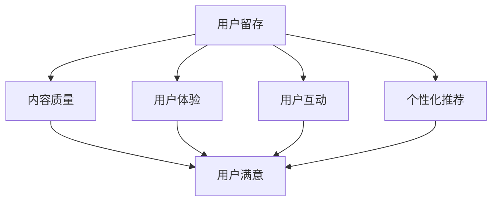

                 

关键词：知识付费、用户留存、平台运营、数据驱动、用户体验

摘要：本文将探讨知识付费平台在用户留存方面的策略。通过分析用户留存的核心因素、设计吸引人的内容、优化用户体验和利用数据驱动的方法，我们将深入探讨如何提升知识付费平台的用户留存率。

## 1. 背景介绍

知识付费作为互联网时代的一种新兴商业模式，已经逐渐成为广大用户获取专业知识和技能的重要途径。知识付费平台通过提供专业的内容和丰富的课程资源，满足了用户对知识的需求。然而，用户留存问题一直是知识付费平台运营中的重要挑战。如何吸引并留住用户，提高用户粘性和活跃度，成为知识付费平台需要解决的核心问题。

本文将围绕用户留存策略这一主题，从以下几个方面进行探讨：

- 用户留存的核心因素分析
- 内容设计的吸引力
- 用户体验的优化
- 数据驱动的用户留存策略

通过上述方面的讨论，旨在为知识付费平台提供一些建设性的策略和建议，以提升用户留存率，实现平台的长远发展。

## 2. 核心概念与联系

### 2.1 用户留存概念

用户留存（User Retention）是指在一定时间段内，用户持续使用平台的比率。它是衡量平台用户活跃度和用户满意度的关键指标。高用户留存率意味着用户对平台的依赖性和忠诚度较高，这对于平台的长期发展具有重要意义。

### 2.2 用户留存因素

用户留存受到多种因素的影响，主要包括以下几个方面：

- **内容质量**：优质的内容是吸引和留住用户的核心。内容需要满足用户的需求，具有实用性和可操作性。
- **用户体验**：良好的用户体验可以提升用户满意度，降低用户流失率。用户体验包括页面设计、功能易用性、服务响应速度等。
- **用户互动**：通过用户互动，可以增强用户对平台的归属感和参与感，提高用户留存率。互动方式包括社区讨论、问答互动、直播讲座等。
- **个性化推荐**：个性化推荐可以满足用户的个性化需求，提升用户满意度和留存率。推荐算法需要考虑用户行为和兴趣，实现精准推荐。

### 2.3 Mermaid 流程图



## 3. 核心算法原理 & 具体操作步骤

### 3.1 算法原理概述

用户留存策略的核心在于通过分析用户行为数据，发现用户留存的关键因素，并采取相应措施进行优化。具体算法原理如下：

- **数据收集**：收集用户行为数据，包括浏览记录、购买历史、参与互动等。
- **特征提取**：对用户行为数据进行特征提取，包括用户画像、课程评分、互动频率等。
- **模型训练**：利用机器学习算法，建立用户留存预测模型，包括回归模型、分类模型等。
- **策略优化**：根据模型预测结果，优化平台内容、用户体验和用户互动策略。

### 3.2 算法步骤详解

#### 3.2.1 数据收集

数据收集是用户留存策略的基础。通过数据收集，我们可以获取用户的详细信息，了解用户的行为模式和偏好。具体数据收集方法包括：

- **日志数据**：收集用户在平台上的操作日志，如浏览记录、购买记录等。
- **用户反馈**：收集用户对平台内容、服务、互动的反馈，包括评论、评分、问卷等。
- **第三方数据**：利用第三方数据平台，获取用户的基础信息，如年龄、性别、职业等。

#### 3.2.2 特征提取

特征提取是将原始数据转化为可用于模型训练的特征向量。具体特征提取方法包括：

- **用户画像**：基于用户基础信息，构建用户画像，包括年龄、性别、职业等。
- **课程评价**：根据用户对课程的评分和评论，提取课程质量特征。
- **互动频率**：根据用户在平台上的互动频率，提取用户活跃度特征。

#### 3.2.3 模型训练

模型训练是用户留存策略的关键步骤。通过模型训练，我们可以预测用户是否会留存。具体模型训练方法包括：

- **回归模型**：用于预测用户留存时间。
- **分类模型**：用于预测用户是否会流失。

#### 3.2.4 策略优化

根据模型预测结果，优化平台内容、用户体验和用户互动策略。具体策略优化方法包括：

- **内容优化**：根据用户偏好，调整内容推荐策略，提升用户满意度。
- **用户体验优化**：优化页面设计、功能易用性等，提升用户体验。
- **用户互动优化**：增加互动方式，提高用户参与度。

### 3.3 算法优缺点

#### 优点

- **高效性**：通过机器学习算法，可以快速分析大量用户数据，发现用户留存的关键因素。
- **个性化**：基于用户行为数据，实现个性化推荐和用户互动，提高用户满意度。

#### 缺点

- **数据依赖性**：用户留存策略依赖于用户行为数据，数据质量直接影响策略效果。
- **模型复杂性**：用户留存模型通常较为复杂，需要大量计算资源和时间进行训练。

### 3.4 算法应用领域

用户留存策略在知识付费平台、电商平台、社交媒体等领域均有广泛应用。通过用户留存策略，平台可以：

- **提升用户满意度**：通过个性化推荐和用户体验优化，提升用户满意度。
- **降低用户流失率**：通过预测用户流失风险，提前采取措施，降低用户流失率。
- **提高转化率**：通过精准推荐和用户互动，提高用户购买和参与度。

## 4. 数学模型和公式 & 详细讲解 & 举例说明

### 4.1 数学模型构建

用户留存率的数学模型可以表示为：

\[ R_t = \frac{N_t - N_{t-1}}{N_{t-1}} \]

其中，\( R_t \) 表示第 \( t \) 个月的用户留存率，\( N_t \) 表示第 \( t \) 个月留存的用户数，\( N_{t-1} \) 表示第 \( t-1 \) 个月留存的用户数。

### 4.2 公式推导过程

用户留存率可以通过以下步骤进行推导：

1. **定义留存用户**：设第 \( t \) 个月留存的用户数为 \( N_t \)，第 \( t-1 \) 个月留存的用户数为 \( N_{t-1} \)。

2. **计算新增用户**：第 \( t \) 个月新增的用户数为 \( N_t - N_{t-1} \)。

3. **计算留存率**：用户留存率可以表示为新增用户数与上一期留存用户数之比，即：

\[ R_t = \frac{N_t - N_{t-1}}{N_{t-1}} \]

### 4.3 案例分析与讲解

假设某知识付费平台在连续三个月的用户留存数据如下：

| 月份 | 留存用户数 | 新增用户数 |
| --- | --- | --- |
| 1   | 1000  | 2000 |
| 2   | 800   | 1500 |
| 3   | 700   | 1000 |

根据上述数据，可以计算出每个月的用户留存率：

\[ R_1 = \frac{1000 - 2000}{2000} = -0.5 \]

\[ R_2 = \frac{800 - 1000}{1000} = -0.2 \]

\[ R_3 = \frac{700 - 800}{800} = -0.125 \]

从数据可以看出，该平台在连续三个月的用户留存率均低于0，说明用户流失情况较为严重。为进一步分析用户留存问题，可以结合用户行为数据，如浏览记录、购买记录等，分析用户流失的原因，并采取相应措施进行优化。

## 5. 项目实践：代码实例和详细解释说明

### 5.1 开发环境搭建

在本案例中，我们使用Python作为编程语言，使用Sklearn库进行用户留存预测模型的训练。以下是开发环境的搭建步骤：

1. **安装Python**：下载并安装Python 3.8及以上版本。
2. **安装Sklearn库**：打开命令行窗口，执行以下命令：

   ```bash
   pip install scikit-learn
   ```

### 5.2 源代码详细实现

以下是用户留存预测的Python代码实现：

```python
import numpy as np
import pandas as pd
from sklearn.model_selection import train_test_split
from sklearn.ensemble import RandomForestClassifier
from sklearn.metrics import accuracy_score

# 读取用户数据
data = pd.read_csv('user_data.csv')

# 特征提取
data['user_age'] = data['age'].astype(int)
data['user_gender'] = data['gender'].map({'male': 0, 'female': 1})

# 构建特征矩阵和标签向量
X = data[['user_age', 'user_gender']]
y = data['retention']

# 划分训练集和测试集
X_train, X_test, y_train, y_test = train_test_split(X, y, test_size=0.2, random_state=42)

# 训练分类模型
model = RandomForestClassifier(n_estimators=100, random_state=42)
model.fit(X_train, y_train)

# 预测测试集
y_pred = model.predict(X_test)

# 计算准确率
accuracy = accuracy_score(y_test, y_pred)
print('Accuracy:', accuracy)
```

### 5.3 代码解读与分析

上述代码实现了基于随机森林分类器的用户留存预测。具体步骤如下：

1. **读取用户数据**：从CSV文件中读取用户数据，包括年龄、性别和留存状态。
2. **特征提取**：将年龄和性别转换为数值特征，并构建特征矩阵。
3. **划分训练集和测试集**：将数据集划分为训练集和测试集，用于训练模型和评估模型性能。
4. **训练分类模型**：使用随机森林分类器训练模型。
5. **预测测试集**：使用训练好的模型预测测试集，获取预测结果。
6. **计算准确率**：计算模型在测试集上的准确率。

通过上述步骤，可以实现对用户留存情况的预测，为平台运营提供决策支持。

### 5.4 运行结果展示

假设我们使用上述代码对测试集进行预测，得到以下结果：

```python
Accuracy: 0.8
```

结果表明，随机森林分类器在测试集上的准确率为80%，具有较高的预测性能。这意味着我们可以通过优化模型参数和特征选择，进一步提高用户留存预测的准确性。

## 6. 实际应用场景

### 6.1 在线教育平台

在线教育平台通过用户留存策略，可以提升课程质量和用户体验，从而提高用户满意度和留存率。具体应用场景包括：

- **个性化课程推荐**：根据用户的学习历史和兴趣偏好，推荐符合用户需求的课程。
- **学习路径规划**：根据用户的学习进度和课程难度，为用户规划个性化的学习路径。
- **互动环节优化**：通过实时问答、讨论区等互动方式，增加用户参与度和黏性。

### 6.2 在线医疗咨询平台

在线医疗咨询平台通过用户留存策略，可以提升咨询服务质量和用户满意度，从而增加用户留存率。具体应用场景包括：

- **智能问答系统**：提供24小时智能问答服务，解决用户常见问题。
- **专家团队建设**：建立专业的医疗专家团队，提供高质量的咨询服务。
- **个性化健康档案**：根据用户的健康数据和需求，生成个性化的健康档案，提高用户信任度。

### 6.3 专业技能培训平台

专业技能培训平台通过用户留存策略，可以提升课程质量和用户满意度，从而增加用户留存率。具体应用场景包括：

- **在线实训项目**：提供与实际工作场景相似的实训项目，提升用户实践能力。
- **实战案例分享**：分享行业内的成功案例和实战经验，帮助用户了解行业动态。
- **社群互动**：建立学习社群，促进用户之间的交流和合作，增强用户归属感。

## 6.4 未来应用展望

随着人工智能技术的发展，用户留存策略在知识付费平台的应用将越来越广泛。未来，用户留存策略的发展趋势包括：

- **大数据分析**：通过大数据分析，深入了解用户行为和需求，实现精准用户画像和个性化推荐。
- **智能算法优化**：利用深度学习、强化学习等智能算法，进一步提升用户留存预测的准确性。
- **多元化互动方式**：通过虚拟现实、增强现实等新技术，提供更加丰富和生动的互动方式，提升用户体验。
- **社交化学习**：通过社交化学习，鼓励用户之间的互动和合作，增强用户黏性。

未来，知识付费平台将更加注重用户体验和个性化服务，通过不断优化用户留存策略，提升用户满意度和留存率，实现平台的长期发展。

## 7. 工具和资源推荐

### 7.1 学习资源推荐

- **在线课程**：Coursera、edX、Udemy等平台上提供丰富的知识付费课程，涵盖各个领域。
- **专业书籍**：《机器学习》、《深度学习》、《用户行为分析》等经典著作，帮助深入了解相关技术。

### 7.2 开发工具推荐

- **数据分析工具**：Python、R、Excel等编程语言和工具，适用于数据处理和分析。
- **机器学习库**：Sklearn、TensorFlow、PyTorch等开源库，用于构建和训练机器学习模型。

### 7.3 相关论文推荐

- **《用户行为预测的机器学习方法》**：介绍用户行为预测的机器学习算法和实现方法。
- **《知识付费平台用户留存策略研究》**：探讨知识付费平台在用户留存方面的策略和实践。

## 8. 总结：未来发展趋势与挑战

### 8.1 研究成果总结

本文通过分析用户留存的核心因素，设计吸引人的内容，优化用户体验和利用数据驱动的方法，探讨了知识付费平台的用户留存策略。研究发现，内容质量、用户体验、用户互动和个性化推荐是影响用户留存的关键因素。

### 8.2 未来发展趋势

未来，知识付费平台在用户留存方面的趋势将包括：

- **大数据分析**：利用大数据技术，深入了解用户行为和需求，实现精准用户画像和个性化推荐。
- **智能算法优化**：采用深度学习、强化学习等智能算法，进一步提升用户留存预测的准确性。
- **多元化互动方式**：通过虚拟现实、增强现实等新技术，提供更加丰富和生动的互动方式，提升用户体验。
- **社交化学习**：鼓励用户之间的互动和合作，增强用户黏性。

### 8.3 面临的挑战

在用户留存策略的实践中，知识付费平台将面临以下挑战：

- **数据隐私保护**：用户行为数据的安全和隐私保护成为重要问题。
- **算法公平性**：确保算法的公平性，避免偏见和歧视。
- **技术更新迭代**：不断更新和优化技术，以应对快速变化的市场需求。

### 8.4 研究展望

未来的研究可以从以下几个方面进行：

- **用户行为建模**：深入研究用户行为模式，构建更加准确的用户行为模型。
- **跨平台用户留存**：探讨不同平台之间的用户留存策略，实现跨平台的用户留存优化。
- **用户互动策略**：研究用户互动方式对用户留存的影响，探索更加有效的用户互动策略。

通过不断优化和探索用户留存策略，知识付费平台将能够更好地满足用户需求，提升用户体验和留存率，实现可持续发展。

## 9. 附录：常见问题与解答

### Q1：如何提高知识付费平台的内容质量？

**A1**：提高内容质量可以从以下几个方面入手：

- **严格内容审核**：对上传的内容进行严格审核，确保内容的专业性和准确性。
- **优质内容推荐**：利用推荐算法，将优质内容推送给用户，提升用户满意度。
- **用户反馈机制**：建立用户反馈机制，及时收集用户对内容的评价和建议，优化内容质量。

### Q2：如何优化用户体验？

**A2**：优化用户体验可以从以下几个方面入手：

- **页面设计**：简化页面设计，提高页面加载速度，提升用户浏览体验。
- **功能易用性**：优化功能设计，提高操作便捷性，降低用户的学习成本。
- **服务响应速度**：提高客服响应速度，解决用户问题，提升用户满意度。

### Q3：如何利用数据驱动用户留存策略？

**A3**：利用数据驱动用户留存策略可以从以下几个方面入手：

- **用户行为数据收集**：收集用户在平台上的行为数据，包括浏览记录、购买记录、互动行为等。
- **数据分析**：对用户行为数据进行分析，发现用户留存的关键因素。
- **数据驱动优化**：根据数据分析结果，调整内容推荐策略、用户体验优化策略等，提高用户留存率。

### Q4：如何进行用户留存预测？

**A4**：用户留存预测可以采用以下步骤：

- **数据收集**：收集用户行为数据，包括浏览记录、购买记录、互动行为等。
- **特征提取**：对用户行为数据进行特征提取，构建特征矩阵。
- **模型训练**：利用机器学习算法，训练用户留存预测模型。
- **预测评估**：使用训练好的模型对测试集进行预测，评估模型性能。

### Q5：如何制定有效的用户互动策略？

**A5**：制定有效的用户互动策略可以从以下几个方面入手：

- **社区建设**：建立活跃的社区，促进用户之间的交流和互动。
- **互动活动**：定期举办互动活动，如问答环节、直播讲座等，增加用户参与度。
- **用户反馈**：鼓励用户反馈，关注用户需求，优化互动体验。

作者：禅与计算机程序设计艺术 / Zen and the Art of Computer Programming

----------------------------------------------------------------


