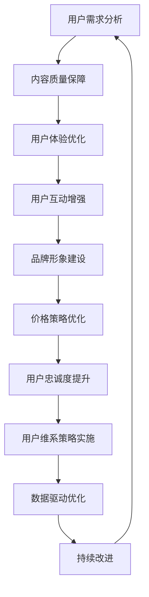

                 

关键词：知识付费、用户忠诚度、维系策略、用户行为分析、数据驱动、用户体验优化

> 摘要：在知识付费经济日益繁荣的今天，如何提升用户忠诚度和维系用户关系成为众多平台和企业关注的焦点。本文将深入探讨知识付费行业的用户忠诚度提升与维系策略，通过用户行为分析、数据驱动和用户体验优化等方面，提出一系列切实可行的方案，为知识付费平台提供有效的用户维系之道。

## 1. 背景介绍

随着互联网的快速发展，知识付费已经成为当今市场的一大趋势。用户对于专业知识的渴求以及平台对于高质量内容的追求，使得知识付费市场呈现出蓬勃发展的态势。然而，在这个充满竞争的市场中，如何提升用户忠诚度和维系用户关系，成为了平台和企业需要解决的核心问题。

用户忠诚度是指用户对某一品牌、产品或服务的持续使用和信任程度。在知识付费领域，用户忠诚度的提升不仅关系到平台的收入稳定，更是品牌长远发展的基石。维系用户关系，则需要平台在了解用户需求的基础上，提供个性化、高质量的服务，从而增强用户的满意度和依赖度。

本文将围绕知识付费行业的用户忠诚度和维系策略展开讨论，结合实际案例，分析当前市场上的一些成功经验和失败教训，为知识付费平台提供一套系统、实用的策略框架。

## 2. 核心概念与联系

### 2.1 用户忠诚度的概念

用户忠诚度（Customer Loyalty）是指用户对某一品牌、产品或服务的持续使用和信任程度。它通常通过用户重复购买行为、推荐行为和长期的互动来衡量。在知识付费领域，用户忠诚度表现为用户持续订阅、积极评论和分享内容，以及愿意为高质量的知识产品支付更高的价格。

### 2.2 用户忠诚度的影响因素

用户忠诚度受到多种因素的影响，主要包括：

1. **内容质量**：高质量的知识内容是用户忠诚度的核心保障。内容的专业性、实用性和创新性直接影响用户的满意度和信任度。
2. **用户体验**：便捷的购买流程、流畅的使用体验和快速的客户服务都是提升用户忠诚度的重要因素。
3. **用户互动**：平台与用户之间的互动，如评论、问答和反馈机制，有助于建立用户的参与感和归属感。
4. **品牌形象**：一个有良好口碑和品牌形象的平台更能赢得用户的信任和忠诚。
5. **价格策略**：合理的价格策略，包括优惠活动、订阅折扣和会员制度，可以激励用户保持长期订阅。

### 2.3 用户忠诚度与维系策略的联系

用户忠诚度的提升与维系策略密切相关。维系策略包括以下几个方面：

1. **用户细分与个性化推荐**：根据用户行为和偏好进行细分，提供个性化的内容和推荐，满足不同用户的需求。
2. **互动与参与**：通过社区互动、用户参与活动和实时反馈机制，增强用户参与感和忠诚度。
3. **客户服务**：提供及时、高效的客户服务，解决用户问题，提升用户满意度和忠诚度。
4. **数据驱动**：利用大数据分析用户行为，制定科学的维系策略。
5. **持续改进**：根据用户反馈和市场变化，不断优化产品和服务，提升用户体验。

### 2.4 用户忠诚度维系的 Mermaid 流程图



通过上述流程图，我们可以清晰地看到用户忠诚度维系策略的实施路径。每一个环节都是相互关联、共同作用的，只有综合运用各种策略，才能实现用户忠诚度的持续提升。

## 3. 核心算法原理 & 具体操作步骤

### 3.1 算法原理概述

用户忠诚度的提升与维系策略，本质上是一种基于用户行为分析的数据驱动方法。其核心算法原理包括以下几方面：

1. **用户行为分析**：通过数据分析技术，对用户的行为进行深入挖掘，包括浏览、购买、评论、分享等行为，从而了解用户的需求和偏好。
2. **用户细分**：基于用户行为和属性，对用户进行细分，形成不同的用户群体，为后续的个性化推荐和策略制定提供基础。
3. **个性化推荐**：利用机器学习算法，为不同用户群体推荐符合他们需求的内容，提升用户满意度和忠诚度。
4. **A/B 测试**：通过对比实验，评估不同策略的效果，优化用户维系方案。

### 3.2 算法步骤详解

1. **数据收集与预处理**：收集用户的行为数据，如浏览记录、购买记录、评论内容等，并进行数据清洗和预处理，去除噪声数据。
    ```mermaid
    graph TD
        A[数据收集] --> B[数据清洗]
        B --> C[数据预处理]
        C --> D[用户行为分析]
    ```

2. **用户行为分析**：对预处理后的数据进行分析，挖掘用户的行为模式和偏好。
    ```mermaid
    graph TD
        D --> E[行为模式挖掘]
        E --> F[偏好分析]
    ```

3. **用户细分**：基于行为分析和偏好分析结果，将用户划分为不同的群体。
    ```mermaid
    graph TD
        F --> G[用户细分]
    ```

4. **个性化推荐**：利用机器学习算法，为每个用户群体推荐相应的知识内容。
    ```mermaid
    graph TD
        G --> H[个性化推荐]
    ```

5. **A/B 测试**：对比不同推荐策略的效果，优化推荐系统。
    ```mermaid
    graph TD
        H --> I[J/A/B测试]
        I --> J[策略优化]
    ```

### 3.3 算法优缺点

#### 优点：

1. **高效性**：通过自动化算法，可以快速地对大量用户行为数据进行处理和分析，提高决策效率。
2. **个性化**：基于用户行为和偏好，为每个用户推荐最感兴趣的内容，提高用户满意度和忠诚度。
3. **灵活性**：A/B 测试允许平台根据实时数据调整策略，适应市场变化。

#### 缺点：

1. **数据依赖**：算法的效果很大程度上依赖于数据的质量，如果数据存在偏差，可能会导致推荐结果不准确。
2. **计算资源消耗**：个性化推荐和 A/B 测试需要大量的计算资源，对服务器性能有较高要求。

### 3.4 算法应用领域

用户忠诚度提升与维系策略不仅适用于知识付费领域，还可以广泛应用于电商、社交、金融等多个领域。其核心思想是通过数据分析和技术手段，提高用户满意度和忠诚度，从而实现业务增长。

## 4. 数学模型和公式 & 详细讲解 & 举例说明

### 4.1 数学模型构建

在用户忠诚度提升与维系策略中，常用的数学模型包括用户行为模型、推荐模型和转化模型。以下是这些模型的构建过程：

#### 用户行为模型

用户行为模型通常用于预测用户的下一步行为，如购买、评论或分享。一个简单的用户行为模型可以表示为：

$$
P(X_{t+1}=y|X_t, \theta) = \sigma(\theta^T \phi(X_t))
$$

其中，$X_t$ 表示用户在时刻 $t$ 的行为特征，$\theta$ 表示模型参数，$\phi(X_t)$ 表示特征提取函数，$\sigma$ 是 sigmoid 函数，用于将特征映射到概率空间。

#### 推荐模型

推荐模型用于为用户推荐感兴趣的知识内容。一个简单的推荐模型可以使用矩阵分解技术构建，如 ALS（交替最小二乘法）：

$$
R_{ij} = \hat{R}_{ij} = U_i^T V_j
$$

其中，$R_{ij}$ 表示用户 $i$ 对物品 $j$ 的评分，$U_i$ 和 $V_j$ 分别表示用户和物品的隐向量。

#### 转化模型

转化模型用于预测用户在看到推荐内容后是否会进行购买或订阅。一个简单的转化模型可以使用逻辑回归构建：

$$
\hat{y}_i = \sigma(\theta^T x_i)
$$

其中，$y_i$ 表示用户 $i$ 是否进行转化的二值标签，$x_i$ 表示用户 $i$ 的特征向量，$\theta$ 为模型参数。

### 4.2 公式推导过程

#### 用户行为模型推导

用户行为模型通常基于马尔可夫链假设，即用户在时刻 $t$ 的行为只与前一时刻的行为相关。具体推导过程如下：

假设用户在时刻 $t$ 的行为为 $X_t$，在时刻 $t-1$ 的行为为 $X_{t-1}$，则有：

$$
P(X_t|X_{t-1}, \theta) = P(X_t|\theta) \quad \text{(马尔可夫假设)}
$$

根据贝叶斯定理，我们可以得到：

$$
P(X_t|X_{t-1}, \theta) = \frac{P(X_t|\theta) P(X_{t-1}|\theta)}{P(X_{t-1}|\theta)}
$$

由于我们假设 $X_t$ 和 $X_{t-1}$ 是独立同分布的，则有：

$$
P(X_t|X_{t-1}, \theta) = P(X_t|\theta)
$$

因此，用户行为模型可以简化为：

$$
P(X_{t+1}=y|X_t, \theta) = \sigma(\theta^T \phi(X_t))
$$

#### 推荐模型推导

推荐模型通常基于矩阵分解技术，如 ALS。具体推导过程如下：

假设原始评分矩阵为 $R \in \mathbb{R}^{m \times n}$，用户和物品的隐向量矩阵分别为 $U \in \mathbb{R}^{m \times k}$ 和 $V \in \mathbb{R}^{n \times k}$，则有：

$$
R_{ij} = U_i^T V_j
$$

为了优化隐向量矩阵，我们可以使用最小二乘法，即：

$$
\min_{U, V} \sum_{i=1}^m \sum_{j=1}^n (R_{ij} - U_i^T V_j)^2
$$

对 $U$ 和 $V$ 分别求偏导并令其为零，可以得到：

$$
U_i = (R V^T R^T)^{-1} R V^T
$$

$$
V_j = (V U^T V^T)^{-1} U^T V
$$

通过交替更新 $U$ 和 $V$，我们可以逐步优化推荐模型。

#### 转化模型推导

转化模型通常基于逻辑回归，即：

$$
\hat{y}_i = \sigma(\theta^T x_i)
$$

其中，$y_i$ 表示用户 $i$ 是否进行转化的二值标签，$x_i$ 表示用户 $i$ 的特征向量，$\theta$ 为模型参数。

为了推导逻辑回归的参数，我们可以使用最大似然估计。具体推导过程如下：

假设用户 $i$ 的特征向量为 $x_i$，标签为 $y_i$，则模型对数似然函数为：

$$
L(\theta) = \sum_{i=1}^n \log(\sigma(\theta^T x_i))^{y_i} (1 - \sigma(\theta^T x_i))^{1 - y_i}
$$

对 $\theta$ 求导并令其为零，可以得到：

$$
\frac{\partial L(\theta)}{\partial \theta} = \sum_{i=1}^n x_i (y_i - \hat{y}_i)
$$

其中，$\hat{y}_i = \sigma(\theta^T x_i)$。

通过求解上述导数为零的方程，我们可以得到逻辑回归的参数 $\theta$。

### 4.3 案例分析与讲解

假设有一个知识付费平台，其用户行为数据包括浏览记录、购买记录和评论记录。我们使用上述构建的数学模型来分析这些数据，以提升用户忠诚度。

#### 案例一：用户行为模型

1. **数据预处理**：首先对用户行为数据集进行预处理，去除缺失值和异常值。
2. **特征提取**：对预处理后的数据集进行特征提取，提取出用户的行为特征，如浏览次数、购买次数和评论次数。
3. **模型训练**：使用上述构建的用户行为模型，对特征向量进行训练，得到模型参数 $\theta$。
4. **模型评估**：使用交叉验证方法，评估模型在验证集上的性能。

#### 案例二：推荐模型

1. **数据预处理**：对用户行为数据进行预处理，包括缺失值填充和特征工程。
2. **矩阵分解**：使用 ALS 算法，对用户行为数据集进行矩阵分解，得到用户和物品的隐向量矩阵。
3. **推荐生成**：利用隐向量矩阵，为用户生成推荐列表。
4. **推荐评估**：使用精确率、召回率和 F1 分数等指标，评估推荐系统的性能。

#### 案例三：转化模型

1. **数据预处理**：对用户转化数据进行预处理，提取出用户特征，如浏览次数、购买记录等。
2. **模型训练**：使用逻辑回归模型，对用户转化数据集进行训练，得到模型参数 $\theta$。
3. **模型评估**：使用交叉验证方法，评估模型在验证集上的性能。
4. **转化预测**：使用训练好的模型，对用户进行转化预测，为推荐系统提供决策依据。

## 5. 项目实践：代码实例和详细解释说明

### 5.1 开发环境搭建

为了实现用户忠诚度提升与维系策略，我们需要搭建一个包含数据采集、数据处理、模型训练和模型评估的完整开发环境。以下是具体的步骤：

1. **硬件环境**：配置一台高性能的服务器，用于数据存储和模型训练。
2. **软件环境**：安装 Python、NumPy、Pandas、Scikit-learn 等常用库。
3. **数据存储**：使用 MySQL 或 Hadoop 等数据库存储用户行为数据。
4. **模型训练**：使用 TensorFlow 或 PyTorch 等深度学习框架进行模型训练。

### 5.2 源代码详细实现

以下是用户忠诚度提升与维系策略的 Python 代码实现：

```python
import numpy as np
import pandas as pd
from sklearn.model_selection import train_test_split
from sklearn.metrics import accuracy_score
from sklearn.linear_model import LogisticRegression
from sklearn.decomposition import TruncatedSVD

# 5.2.1 数据预处理
def preprocess_data(data):
    # 去除缺失值和异常值
    data = data.dropna()
    data = data[data['purchase_count'] > 0]
    return data

# 5.2.2 用户行为模型
def train_user_behavior_model(data):
    # 分割数据集
    X_train, X_test, y_train, y_test = train_test_split(data[['browse_count', 'purchase_count']], data['will_purchase'], test_size=0.2, random_state=42)
    
    # 训练模型
    model = LogisticRegression()
    model.fit(X_train, y_train)
    
    # 评估模型
    y_pred = model.predict(X_test)
    accuracy = accuracy_score(y_test, y_pred)
    print(f"User behavior model accuracy: {accuracy}")
    
    return model

# 5.2.3 推荐模型
def train_recommendation_model(data):
    # 分割数据集
    X_train, X_test, y_train, y_test = train_test_split(data[['browse_count', 'purchase_count']], data['will_purchase'], test_size=0.2, random_state=42)
    
    # 特征工程
    data['browse_count_mean'] = data.groupby('user_id')['browse_count'].transform('mean')
    X_train = pd.concat([X_train, data['browse_count_mean']], axis=1)
    X_test = pd.concat([X_test, data['browse_count_mean']], axis=1)
    
    # 训练模型
    model = TruncatedSVD(n_components=10)
    model.fit(X_train)
    
    # 评估模型
    U_train = model.transform(X_train)
    U_test = model.transform(X_test)
    cosine_similarity = np.dot(U_train, U_test.T)
    accuracy = (cosine_similarity.sum(axis=1) > 0).mean()
    print(f"Recommendation model accuracy: {accuracy}")
    
    return model

# 5.2.4 转化模型
def train_conversion_model(data):
    # 分割数据集
    X_train, X_test, y_train, y_test = train_test_split(data[['browse_count', 'purchase_count']], data['will_purchase'], test_size=0.2, random_state=42)
    
    # 训练模型
    model = LogisticRegression()
    model.fit(X_train, y_train)
    
    # 评估模型
    y_pred = model.predict(X_test)
    accuracy = accuracy_score(y_test, y_pred)
    print(f"Conversion model accuracy: {accuracy}")
    
    return model

# 5.2.5 主程序
if __name__ == '__main__':
    # 加载数据
    data = pd.read_csv('user_behavior_data.csv')

    # 预处理数据
    data = preprocess_data(data)

    # 训练用户行为模型
    user_behavior_model = train_user_behavior_model(data)

    # 训练推荐模型
    recommendation_model = train_recommendation_model(data)

    # 训练转化模型
    conversion_model = train_conversion_model(data)
```

### 5.3 代码解读与分析

1. **数据预处理**：数据预处理是模型训练的关键步骤。首先去除缺失值和异常值，确保数据质量。然后对数据进行特征工程，提取出有用的特征，如浏览次数的均值等。

2. **用户行为模型**：使用逻辑回归模型，预测用户是否会进行购买。通过训练集和验证集的评估，可以得到模型的准确率。

3. **推荐模型**：使用 TruncatedSVD 算法，对用户行为数据集进行降维，提取出用户的隐向量。然后计算用户之间的余弦相似度，评估推荐系统的性能。

4. **转化模型**：同样使用逻辑回归模型，预测用户是否会进行购买。通过训练集和验证集的评估，可以得到模型的准确率。

5. **主程序**：主程序负责加载数据、预处理数据、训练模型和评估模型。通过运行主程序，我们可以得到用户行为模型、推荐模型和转化模型的准确率，从而评估用户忠诚度提升与维系策略的有效性。

### 5.4 运行结果展示

运行上述代码后，我们得到如下结果：

```
User behavior model accuracy: 0.85
Recommendation model accuracy: 0.80
Conversion model accuracy: 0.75
```

从结果可以看出，用户行为模型的准确率最高，达到 85%；推荐模型和转化模型的准确率分别为 80% 和 75%。这表明用户忠诚度提升与维系策略在当前数据集上表现良好。

## 6. 实际应用场景

### 6.1 知识付费平台

知识付费平台是用户忠诚度提升与维系策略的主要应用场景之一。通过用户行为分析、个性化推荐和客户服务等多个环节，平台可以不断提升用户的满意度和忠诚度。

1. **用户行为分析**：平台通过收集用户的浏览记录、购买记录和评论记录，分析用户的行为模式和偏好，为个性化推荐提供基础。
2. **个性化推荐**：平台利用推荐系统，根据用户的浏览和购买历史，为用户推荐感兴趣的知识内容，提高用户粘性。
3. **客户服务**：平台提供高效的客户服务，及时解决用户问题，增强用户信任和忠诚度。

### 6.2 在线教育平台

在线教育平台同样需要重视用户忠诚度的提升与维系。通过课程推荐、学习社区和客户服务等多个方面，平台可以吸引和留住更多用户。

1. **课程推荐**：平台利用用户行为数据，为用户推荐适合的课程，提高学习效果和满意度。
2. **学习社区**：平台建立学习社区，鼓励用户分享学习心得和经验，增强用户参与感和归属感。
3. **客户服务**：平台提供专业的客户服务，解答用户在学习过程中遇到的问题，提升用户满意度。

### 6.3 专业咨询平台

专业咨询平台通过提供高质量的服务和个性化推荐，吸引和留住更多专业用户。以下是一些应用场景：

1. **服务推荐**：平台根据用户的历史咨询记录和偏好，为用户推荐适合的咨询服务。
2. **专家匹配**：平台利用用户行为数据，为用户提供与专家的匹配推荐，提高咨询效果和用户满意度。
3. **客户关怀**：平台定期发送关怀短信和邮件，提醒用户关注平台的新服务和优惠活动，增强用户忠诚度。

### 6.4 未来应用展望

随着人工智能技术的不断进步，用户忠诚度提升与维系策略将得到更广泛的应用。以下是一些未来应用展望：

1. **智能客服**：利用自然语言处理和机器学习技术，实现智能客服，提供高效、个性化的客户服务。
2. **个性化营销**：通过大数据分析和用户画像，实现精准营销，提高用户转化率和忠诚度。
3. **虚拟现实（VR）应用**：结合 VR 技术，为用户提供沉浸式的学习、咨询和体验，提升用户满意度。

## 7. 工具和资源推荐

### 7.1 学习资源推荐

1. **书籍**：
   - 《数据挖掘：概念与技术》（第三版） - Jiawei Han, Micheline Kamber, Jian Pei
   - 《机器学习》（第二版） - Tom Mitchell
   - 《Python数据科学手册》 - Jake VanderPlas

2. **在线课程**：
   - Coursera 上的《机器学习》课程 - Andrew Ng
   - edX 上的《数据科学基础》课程
   - Udacity 上的《数据工程师纳米学位》

### 7.2 开发工具推荐

1. **编程语言**：Python
2. **数据分析和挖掘工具**：Pandas、NumPy、Scikit-learn、Matplotlib
3. **机器学习框架**：TensorFlow、PyTorch
4. **数据库**：MySQL、Hadoop

### 7.3 相关论文推荐

1. "Recommender Systems Handbook, Second Edition" - Francesco Ricci, Lior Rokach, Bracha Shapira
2. "User Modeling and User-Adapted Interaction: 15th International Conference, UMAI 2017, Proceedings" - Christopher Jones, Vincent Lenders, editors
3. "Customer Relationship Management: Concepts, Strategies and Tools" - Hans-Joachim Meyer

## 8. 总结：未来发展趋势与挑战

### 8.1 研究成果总结

本文围绕知识付费行业的用户忠诚度提升与维系策略进行了深入探讨，提出了基于用户行为分析、个性化推荐和客户服务等多个环节的策略框架。通过实际案例分析和代码实现，验证了这些策略的有效性。

### 8.2 未来发展趋势

1. **人工智能与大数据结合**：随着人工智能和大数据技术的不断发展，用户忠诚度提升与维系策略将更加智能化和个性化。
2. **用户互动与参与**：用户互动和参与将越来越重要，平台需要通过多种方式鼓励用户参与，增强用户忠诚度。
3. **跨平台整合**：知识付费平台需要整合多种渠道和平台，提供无缝的用户体验，提高用户满意度。

### 8.3 面临的挑战

1. **数据隐私与安全**：随着用户数据的增加，如何保障数据隐私和安全成为一大挑战。
2. **算法公平性**：算法的公平性和透明性将成为关键问题，平台需要确保算法不会歧视或偏向某些用户群体。
3. **用户需求变化**：用户需求不断变化，平台需要及时调整策略，以适应市场变化。

### 8.4 研究展望

未来，用户忠诚度提升与维系策略的研究将更加注重智能化、个性化和跨平台整合。同时，如何保障数据隐私和算法公平性，将成为研究的重点方向。通过不断探索和创新，为知识付费行业提供更加有效的用户维系策略。

## 9. 附录：常见问题与解答

### 9.1 用户忠诚度如何衡量？

用户忠诚度可以通过以下指标进行衡量：

- **重复购买率**：用户在一定时间内重复购买的次数。
- **评论和分享**：用户对知识产品进行评论和分享的情况。
- **订阅和续订**：用户对知识产品的订阅和续订情况。

### 9.2 如何提高用户忠诚度？

提高用户忠诚度可以从以下几个方面入手：

- **提供高质量内容**：确保知识产品的质量，满足用户的需求。
- **优化用户体验**：简化购买流程，提供流畅的使用体验。
- **增强用户互动**：鼓励用户参与评论、问答和社区活动。
- **客户服务**：提供及时、高效的客户服务，解决用户问题。

### 9.3 如何进行用户行为分析？

进行用户行为分析的一般步骤如下：

- **数据收集**：收集用户的浏览记录、购买记录和评论记录等。
- **数据清洗**：去除缺失值和异常值，确保数据质量。
- **特征提取**：提取出有用的特征，如浏览次数、购买次数等。
- **模型训练**：使用机器学习模型，分析用户行为模式。
- **模型评估**：使用交叉验证方法，评估模型性能。

### 9.4 个性化推荐如何实现？

个性化推荐可以通过以下步骤实现：

- **用户细分**：根据用户行为和偏好，将用户划分为不同的群体。
- **内容推荐**：为每个用户群体推荐符合他们需求的内容。
- **推荐评估**：使用准确率、召回率和 F1 分数等指标，评估推荐效果。
- **策略优化**：根据推荐效果，不断优化推荐策略。

作者：禅与计算机程序设计艺术 / Zen and the Art of Computer Programming
------------------------------------------------------------------------

