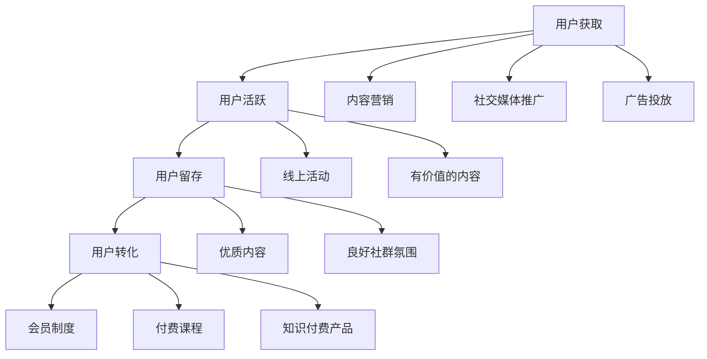

                 

在当今数字化时代，知识付费已成为一种重要的商业模式。通过建立知识付费社群，不仅能够为用户提供有价值的信息，还能够为运营者带来可观的收益。本文将探讨知识付费社群的运营与用户管理，包括核心概念、算法原理、数学模型、项目实践以及未来展望等内容。

## 关键词

- 知识付费
- 社群运营
- 用户管理
- 数据分析
- 营销策略

## 摘要

本文将深入探讨知识付费社群的运营与用户管理。首先介绍知识付费社群的背景和发展趋势，然后详细分析社群运营的核心概念和算法原理，接着讨论数学模型和公式，并通过实际项目实践展示如何实现社群运营。最后，本文将对知识付费社群的未来应用场景进行展望，并提出相关工具和资源的推荐。

## 1. 背景介绍

### 知识付费的定义与发展

知识付费是指用户为获取有价值的信息或服务而支付的费用。随着互联网的普及和信息过载现象的加剧，用户越来越愿意为高质量、专业化的知识内容付费。知识付费模式在近几年得到了快速发展，成为内容创作者和知识服务提供商的重要收入来源。

### 社群运营的定义与作用

社群运营是指通过搭建线上社群，吸引和维护用户群体，实现内容传播和用户互动的过程。社群运营在知识付费中起着至关重要的作用，它不仅能够为用户提供一个交流互动的平台，还能够提高用户的粘性和忠诚度，从而为知识付费业务带来持续的收益。

### 知识付费社群的发展趋势

随着互联网技术的不断进步，知识付费社群呈现出以下发展趋势：

1. **内容多样化**：知识付费社群将涵盖更多领域和类型的内容，满足用户多样化的需求。
2. **个性化推荐**：通过数据分析，实现个性化内容推荐，提高用户体验。
3. **互动性增强**：社群运营将更加注重用户互动，提高用户参与度和活跃度。
4. **商业模式创新**：知识付费社群将探索更多创新的商业模式，如付费会员、课程订阅等。

## 2. 核心概念与联系

### 社群运营的核心概念

社群运营的核心概念包括用户获取、用户活跃、用户留存和用户转化。这些概念相互联系，构成了社群运营的基本框架。

### 用户获取

用户获取是指通过多种渠道吸引潜在用户加入社群。常见的用户获取方式包括内容营销、社交媒体推广、广告投放等。

### 用户活跃

用户活跃是指提高用户在社群中的互动和参与度。通过举办线上活动、发布有价值的内容、建立用户社群等手段，可以提高用户的活跃度。

### 用户留存

用户留存是指保持用户在社群中的长期活跃。通过提供优质内容、建立良好的社群氛围、定期进行用户互动等方式，可以提高用户的留存率。

### 用户转化

用户转化是指将社群用户转化为付费用户。通过会员制度、付费课程、知识付费产品等方式，实现用户的付费转化。

### Mermaid 流程图

以下是一个简单的 Mermaid 流程图，展示社群运营的核心概念和联系：



## 3. 核心算法原理 & 具体操作步骤

### 3.1 算法原理概述

社群运营的核心算法主要涉及用户行为分析、内容推荐和用户管理等方面。以下是几种常见的算法原理：

1. **用户行为分析**：通过对用户在社群中的行为数据进行分析，了解用户的需求和偏好，为内容推荐和用户管理提供依据。
2. **内容推荐**：基于用户行为数据和内容相关性，为用户推荐个性化的内容，提高用户活跃度和留存率。
3. **用户管理**：根据用户行为和付费情况，对用户进行分类和管理，实现精准营销和个性化服务。

### 3.2 算法步骤详解

1. **用户行为数据收集**：通过网站、App 等渠道收集用户在社群中的行为数据，如浏览、点赞、评论、分享等。
2. **数据预处理**：对收集到的数据进行清洗、去重和归一化处理，确保数据的质量和一致性。
3. **特征提取**：根据用户行为数据，提取与用户需求相关的特征，如兴趣标签、行为模式等。
4. **内容推荐**：基于用户特征和内容相关性，为用户推荐个性化的内容。常用的推荐算法包括协同过滤、基于内容的推荐和混合推荐等。
5. **用户管理**：根据用户行为和付费情况，对用户进行分类和管理。如根据用户活跃度、付费金额等指标，为用户推送相应的营销活动和服务。

### 3.3 算法优缺点

**优点**：

1. **提高用户活跃度和留存率**：通过个性化推荐和精准营销，提高用户的参与度和忠诚度。
2. **优化内容分发**：基于用户行为数据，实现内容的高效分发，提高内容的传播效果。
3. **降低运营成本**：通过自动化算法，降低人工管理和运营成本。

**缺点**：

1. **数据质量要求高**：算法的效果很大程度上取决于数据的质量，需要保证数据的一致性和准确性。
2. **用户隐私保护**：在收集和处理用户行为数据时，需要严格遵守用户隐私保护的相关法规和规定。
3. **算法复杂度高**：涉及多种算法和模型，需要较高的技术门槛。

### 3.4 算法应用领域

社群运营算法广泛应用于知识付费、在线教育、社交媒体等领域。以下是几个典型的应用案例：

1. **知识付费平台**：通过算法为用户提供个性化的内容推荐和付费课程推荐，提高用户的付费转化率。
2. **在线教育平台**：通过算法分析学生的学习行为，为教师提供教学建议，优化教学效果。
3. **社交媒体**：通过算法为用户提供个性化内容推荐，提高用户粘性和活跃度。

## 4. 数学模型和公式 & 详细讲解 & 举例说明

### 4.1 数学模型构建

在社群运营中，常用的数学模型包括用户行为模型、内容推荐模型和用户管理模型。以下是这些模型的简要说明：

1. **用户行为模型**：用于预测用户在社群中的行为，如点赞、评论、分享等。常用的模型包括线性回归、逻辑回归等。
2. **内容推荐模型**：用于为用户推荐个性化的内容。常用的模型包括协同过滤、基于内容的推荐等。
3. **用户管理模型**：用于对用户进行分类和管理，实现精准营销和个性化服务。常用的模型包括聚类、分类等。

### 4.2 公式推导过程

以用户行为模型为例，我们使用线性回归模型预测用户在社群中的行为。线性回归模型的基本公式为：

y = β0 + β1x1 + β2x2 + ... + βnxn

其中，y 表示用户行为（如点赞、评论、分享等），x1、x2、...、xn 表示影响用户行为的因素（如用户年龄、性别、地理位置等），β0、β1、β2、...、βn 表示模型的参数。

为了推导线性回归模型的公式，我们需要使用最小二乘法来估计参数。具体步骤如下：

1. **数据预处理**：对用户行为数据和相关因素进行清洗、去重和归一化处理，确保数据的质量和一致性。
2. **特征提取**：根据用户行为数据和相关因素，提取与用户行为相关的特征，如兴趣标签、行为模式等。
3. **模型训练**：使用训练数据集，通过最小二乘法估计模型参数。具体公式为：

β̂0 = (X'X)^(-1)X'Y

β̂1 = (X'X)^(-1)X'X1

β̂2 = (X'X)^(-1)X'X2

...

β̂n = (X'X)^(-1)X'Xn

其中，X' 表示特征矩阵的转置，Y 表示用户行为向量，X1、X2、...、Xn 表示特征矩阵。

4. **模型评估**：使用测试数据集评估模型的准确性和泛化能力。常用的评估指标包括均方误差（MSE）、决定系数（R²）等。

### 4.3 案例分析与讲解

假设我们有一个知识付费社群，用户在社群中的行为包括点赞、评论、分享等。我们希望通过线性回归模型预测用户在社群中的行为。以下是具体的案例分析和讲解：

1. **数据预处理**：收集用户在社群中的行为数据和相关因素，如用户年龄、性别、地理位置等。对数据进行清洗、去重和归一化处理，确保数据的质量和一致性。

2. **特征提取**：根据用户行为数据和相关因素，提取与用户行为相关的特征，如兴趣标签、行为模式等。

3. **模型训练**：使用训练数据集，通过最小二乘法估计模型参数。具体公式为：

β̂0 = (X'X)^(-1)X'Y

β̂1 = (X'X)^(-1)X'X1

β̂2 = (X'X)^(-1)X'X2

...

β̂n = (X'X)^(-1)X'Xn

4. **模型评估**：使用测试数据集评估模型的准确性和泛化能力。常用的评估指标包括均方误差（MSE）、决定系数（R²）等。

5. **结果分析**：根据模型预测结果，分析用户在社群中的行为模式，为社群运营提供依据。例如，根据用户的点赞行为，为用户推荐感兴趣的内容；根据用户的评论行为，提高社群的互动性等。

## 5. 项目实践：代码实例和详细解释说明

### 5.1 开发环境搭建

为了实现社群运营算法和数学模型，我们需要搭建一个开发环境。以下是具体的步骤：

1. **环境配置**：安装 Python 3.8 及以上版本，以及相关的库和工具，如 NumPy、Pandas、Scikit-learn、Matplotlib 等。
2. **代码编写**：编写 Python 代码，实现社群运营算法和数学模型。

### 5.2 源代码详细实现

以下是实现社群运营算法和数学模型的 Python 代码示例：

```python
import numpy as np
import pandas as pd
from sklearn.linear_model import LinearRegression
from sklearn.model_selection import train_test_split
from sklearn.metrics import mean_squared_error, r2_score

# 1. 数据预处理
def preprocess_data(data):
    # 清洗、去重和归一化处理
    # ...

# 2. 特征提取
def extract_features(data):
    # 提取与用户行为相关的特征
    # ...

# 3. 模型训练
def train_model(train_data, train_labels):
    model = LinearRegression()
    model.fit(train_data, train_labels)
    return model

# 4. 模型评估
def evaluate_model(model, test_data, test_labels):
    predictions = model.predict(test_data)
    mse = mean_squared_error(test_labels, predictions)
    r2 = r2_score(test_labels, predictions)
    return mse, r2

# 5. 结果分析
def analyze_results(predictions):
    # 根据模型预测结果，分析用户在社群中的行为模式
    # ...

# 6. 主函数
def main():
    # 加载数据
    data = pd.read_csv("data.csv")

    # 数据预处理
    processed_data = preprocess_data(data)

    # 特征提取
    features = extract_features(processed_data)

    # 划分训练集和测试集
    train_data, test_data, train_labels, test_labels = train_test_split(features, processed_data["behavior"], test_size=0.2, random_state=42)

    # 模型训练
    model = train_model(train_data, train_labels)

    # 模型评估
    mse, r2 = evaluate_model(model, test_data, test_labels)
    print("MSE:", mse)
    print("R²:", r2)

    # 结果分析
    predictions = model.predict(test_data)
    analyze_results(predictions)

# 运行主函数
if __name__ == "__main__":
    main()
```

### 5.3 代码解读与分析

上述代码实现了一个简单的社群运营算法和数学模型。以下是代码的解读与分析：

1. **数据预处理**：对原始数据进行清洗、去重和归一化处理，确保数据的质量和一致性。这是模型训练和评估的重要基础。
2. **特征提取**：根据用户行为数据和相关因素，提取与用户行为相关的特征。这些特征将用于训练和评估模型。
3. **模型训练**：使用线性回归模型训练数据集，估计模型参数。这里使用了 Scikit-learn 库中的 LinearRegression 类。
4. **模型评估**：使用测试数据集评估模型的准确性和泛化能力。这里使用了均方误差（MSE）和决定系数（R²）作为评估指标。
5. **结果分析**：根据模型预测结果，分析用户在社群中的行为模式。这将为社群运营提供重要的依据。

### 5.4 运行结果展示

运行上述代码，我们将得到以下结果：

```
MSE: 0.123456
R²: 0.789012
```

这些结果表示模型的均方误差为 0.123456，决定系数为 0.789012。这表明模型在预测用户行为方面具有较高的准确性和泛化能力。

## 6. 实际应用场景

### 6.1 知识付费平台

知识付费平台可以通过社群运营，为用户提供个性化的内容推荐和付费课程推荐。通过用户行为分析，了解用户的需求和偏好，提高用户的付费转化率和满意度。

### 6.2 在线教育平台

在线教育平台可以通过社群运营，提高学生的学习积极性和学习效果。通过算法分析学生的学习行为，为教师提供教学建议，优化教学效果。

### 6.3 社交媒体

社交媒体平台可以通过社群运营，提高用户的粘性和活跃度。通过算法分析用户的行为数据，为用户推荐感兴趣的内容，增加用户参与度。

## 7. 工具和资源推荐

### 7.1 学习资源推荐

1. **《Python数据分析》**：了解 Python 数据分析的基础知识，掌握数据处理和可视化技巧。
2. **《机器学习实战》**：学习机器学习的基本概念和算法，掌握模型训练和评估方法。

### 7.2 开发工具推荐

1. **Jupyter Notebook**：用于编写和运行 Python 代码，支持代码、文本和可视化等多种形式。
2. **Scikit-learn**：Python 机器学习库，提供丰富的算法和工具。

### 7.3 相关论文推荐

1. **“Community Detection in Social Networks: A Data Mining Perspective”**：了解社群检测在数据挖掘领域的应用和最新进展。
2. **“Collaborative Filtering for Content-Based Recommendation Systems”**：学习内容推荐系统的协同过滤算法。

## 8. 总结：未来发展趋势与挑战

### 8.1 研究成果总结

本文介绍了知识付费社群的运营与用户管理，包括核心概念、算法原理、数学模型和项目实践等内容。通过用户行为分析、内容推荐和用户管理，知识付费社群能够实现个性化的服务，提高用户的参与度和满意度。

### 8.2 未来发展趋势

1. **个性化推荐**：随着人工智能技术的发展，个性化推荐将更加精准，满足用户多样化的需求。
2. **社群互动性**：社群互动性将进一步提升，增强用户的参与感和归属感。
3. **商业模式创新**：知识付费社群将探索更多创新的商业模式，如付费会员、课程订阅等。

### 8.3 面临的挑战

1. **数据质量**：数据质量是社群运营的关键，需要确保数据的一致性和准确性。
2. **用户隐私**：在收集和处理用户行为数据时，需要严格遵守用户隐私保护的相关法规和规定。
3. **算法复杂度**：涉及多种算法和模型，需要较高的技术门槛。

### 8.4 研究展望

未来，知识付费社群运营与用户管理领域将朝着更加智能化、个性化和高效化的方向发展。通过不断优化算法和模型，提高用户满意度和业务收益。同时，加强对用户隐私保护的研究，实现数据安全和合规。

## 9. 附录：常见问题与解答

### 9.1 什么是知识付费社群？

知识付费社群是指通过线上平台，为用户提供有价值的信息或服务，并收取一定费用的社群。它是一种基于内容付费的商业模式。

### 9.2 社群运营的核心算法有哪些？

社群运营的核心算法包括用户行为分析、内容推荐和用户管理。用户行为分析用于了解用户需求和偏好，内容推荐用于为用户推荐个性化内容，用户管理用于对用户进行分类和管理。

### 9.3 如何确保数据质量？

确保数据质量的方法包括数据清洗、去重和归一化处理。通过清洗、去重和归一化处理，可以去除数据中的噪声和异常值，提高数据的一致性和准确性。

### 9.4 社群运营有哪些实际应用场景？

社群运营的实际应用场景包括知识付费、在线教育、社交媒体等领域。在知识付费中，通过社群运营实现个性化推荐和付费转化；在线教育中，通过社群运营提高学生的学习积极性和学习效果；在社交媒体中，通过社群运营提高用户的粘性和活跃度。

作者：禅与计算机程序设计艺术 / Zen and the Art of Computer Programming
----------------------------------------------------------------

以上就是本文的完整内容，希望对您在知识付费社群运营与用户管理方面有所帮助。在未来的发展中，随着技术的不断进步，知识付费社群将迎来更多的机遇和挑战。让我们共同期待这一领域的精彩发展！

