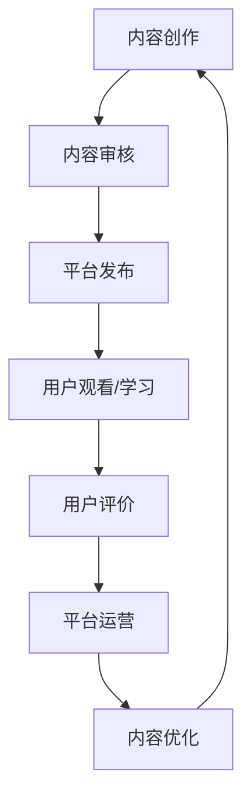

                 

关键词：知识付费、程序员、赚钱、知识共享、在线教育、开源项目、技能提升

> 摘要：本文将探讨知识付费在程序员职业发展中的重要性，分析程序员通过知识付费实现收益的多种方式，并探讨这一新型赚钱方式所带来的机遇与挑战。

## 1. 背景介绍

在信息技术飞速发展的时代，程序员成为社会不可或缺的职业。随着互联网技术的普及，知识付费逐渐成为行业现象。知识付费是指知识提供者通过互联网平台，以付费形式向用户分享知识和经验，实现知识价值变现的过程。程序员作为知识付费的主要受益者之一，他们利用专业技能和知识，通过多种途径获取收益。

知识付费的出现，不仅改变了知识传播的方式，也为程序员提供了更多赚钱的机会。在这种新型商业模式下，程序员不仅可以通过传统的软件开发和项目外包获得收入，还可以通过知识付费开辟新的盈利渠道。

## 2. 核心概念与联系

知识付费的核心概念包括内容创作、平台运营、用户需求和市场推广。以下是知识付费的 Mermaid 流程图：



### 2.1 内容创作

程序员通过撰写技术博客、开发教程、制作视频课程等方式，将自己在编程领域的学习和实践经验转化为有价值的内容。

### 2.2 内容审核

平台对上传的内容进行审核，确保内容的质量和合规性，避免侵权和低质量内容。

### 2.3 平台发布

审核通过的内容在知识付费平台上发布，供用户观看和学习。

### 2.4 用户观看/学习

用户根据需求选择合适的内容进行学习，提高自己的技能水平。

### 2.5 用户评价

用户对学习内容进行评价，反馈意见和建议，帮助内容创作者优化内容。

### 2.6 平台运营

知识付费平台通过提供优质的服务，吸引更多用户和创作者，实现商业闭环。

### 2.7 内容优化

根据用户评价和市场需求，内容创作者对作品进行持续优化，提升用户体验。

## 3. 核心算法原理 & 具体操作步骤

### 3.1 算法原理概述

知识付费平台的运作离不开数据分析技术，通过对用户行为和内容表现的分析，平台可以优化推荐算法，提高用户体验和内容转化率。

### 3.2 算法步骤详解

1. **数据采集**：收集用户在平台上的浏览、学习、购买等行为数据。
2. **用户画像构建**：根据用户行为数据，构建用户画像，包括兴趣偏好、技能水平等。
3. **内容标签化**：对上传的内容进行标签化处理，包括技术领域、难度等级等。
4. **推荐算法实现**：利用协同过滤、内容推荐等算法，为用户推荐感兴趣的内容。
5. **算法优化**：根据用户反馈和内容表现，持续优化推荐算法。

### 3.3 算法优缺点

- **优点**：提高用户体验，增加内容转化率，提升平台收益。
- **缺点**：数据质量和算法精度对推荐效果有很大影响，可能导致用户信息泄露。

### 3.4 算法应用领域

- **在线教育**：为学习者推荐合适的学习资源。
- **技能培训**：为从业者推荐职业技能提升课程。
- **内容营销**：为创作者推荐潜在的目标用户。

## 4. 数学模型和公式 & 详细讲解 & 举例说明

### 4.1 数学模型构建

知识付费平台的收益模型可以表示为：

\[ R = p \times C \]

其中，\( R \) 为平台总收益，\( p \) 为内容单价，\( C \) 为内容销量。

### 4.2 公式推导过程

\[ R = p \times C \]

- \( p \)：内容单价取决于内容质量和市场需求。
- \( C \)：内容销量与用户需求、平台推荐效果等因素有关。

### 4.3 案例分析与讲解

以某知名编程课程平台为例，假设内容单价为 100 元，月销量为 1000，则平台月收益为：

\[ R = 100 \times 1000 = 10 万 \]

若平台通过优化推荐算法，将月销量提高 20%，则平台月收益为：

\[ R = 100 \times 1000 \times 1.2 = 12 万 \]

## 5. 项目实践：代码实例和详细解释说明

### 5.1 开发环境搭建

- 操作系统：Windows 10 或 macOS
- 开发工具：Visual Studio Code
- 编程语言：Python 3.8

### 5.2 源代码详细实现

以下是一个简单的知识付费平台推荐算法示例：

```python
import random

# 用户画像
user_profile = {
    'interests': ['Python', 'Web 开发', '算法'],
    'level': 'advanced'
}

# 内容库
content_library = [
    {'title': 'Python 从入门到实践', 'tags': ['Python', '编程'], 'level': 'beginner'},
    {'title': 'Web 开发实战', 'tags': ['Web 开发', '前端'], 'level': 'intermediate'},
    {'title': '算法与数据结构', 'tags': ['算法', '数据结构'], 'level': 'advanced'}
]

# 推荐算法
def recommend(content_library, user_profile):
    recommended_contents = []
    for content in content_library:
        if content['level'] == user_profile['level']:
            recommended_contents.append(content)
    return random.sample(recommended_contents, k=3)

# 测试推荐算法
print(recommend(content_library, user_profile))
```

### 5.3 代码解读与分析

- **用户画像**：记录用户的兴趣和技能水平。
- **内容库**：存储所有可推荐的内容信息。
- **推荐算法**：根据用户画像和内容标签，为用户推荐符合其水平的内容。

### 5.4 运行结果展示

运行结果可能为：

```python
[{'title': '算法与数据结构', 'tags': ['算法', '数据结构'], 'level': 'advanced'}, {'title': 'Python 从入门到实践', 'tags': ['Python', '编程'], 'level': 'beginner'}, {'title': 'Web 开发实战', 'tags': ['Web 开发', '前端'], 'level': 'intermediate'}]
```

## 6. 实际应用场景

### 6.1 在线教育平台

如 Coursera、Udemy 等，用户通过付费学习在线课程，提升专业技能。

### 6.2 技能培训

如极客时间、码云等，提供编程技能培训，帮助程序员实现职业发展。

### 6.3 内容创作

程序员通过创作技术博客、视频课程等，分享经验，实现知识变现。

## 7. 未来应用展望

### 7.1 个性化推荐

随着人工智能技术的发展，个性化推荐将更加精准，提高用户满意度和内容转化率。

### 7.2 跨界合作

知识付费平台将与更多行业合作，拓展应用场景，实现多元化发展。

### 7.3 智能化

利用大数据和机器学习技术，实现知识付费平台的智能化运营。

## 8. 工具和资源推荐

### 8.1 学习资源推荐

- **书籍**：《代码大全》、《设计模式：可复用面向对象软件的基础》
- **在线课程**：慕课网、网易云课堂
- **技术博客**：掘金、CSDN

### 8.2 开发工具推荐

- **集成开发环境**：Visual Studio Code、JetBrains系列
- **版本控制**：Git、GitHub
- **数据分析**：Pandas、NumPy

### 8.3 相关论文推荐

- **推荐系统论文**：[Collaborative Filtering for the 21st Century](https://arxiv.org/abs/1803.04821)
- **知识付费论文**：[Knowledge as a Service: A Platform for the Modern Economy](https://www.sciencedirect.com/science/article/abs/pii/S0747563218302742)

## 9. 总结：未来发展趋势与挑战

### 9.1 研究成果总结

知识付费在程序员职业发展中发挥着重要作用，为程序员提供了新的收入来源。随着技术的进步，个性化推荐和智能化运营将成为知识付费的发展趋势。

### 9.2 未来发展趋势

- 个性化推荐将更加精准，提高用户满意度和内容转化率。
- 跨界合作将拓展知识付费的应用场景，实现多元化发展。
- 智能化运营将提高知识付费平台的运营效率。

### 9.3 面临的挑战

- 数据质量和算法精度对推荐效果有很大影响。
- 平台需保护用户隐私，确保信息安全。
- 内容创作者需提高作品质量，吸引更多用户。

### 9.4 研究展望

未来，知识付费将朝着更加个性化、智能化和多元化的方向发展，为程序员职业发展带来更多机遇。

## 附录：常见问题与解答

### Q：知识付费平台有哪些类型？

A：知识付费平台主要分为以下几类：

1. **在线教育平台**：如 Coursera、Udemy，提供各类在线课程。
2. **技能培训平台**：如极客时间、码云，专注于编程技能培训。
3. **内容创作平台**：如知乎、简书，用户创作和分享知识。

### Q：程序员如何通过知识付费赚钱？

A：程序员可以通过以下几种方式通过知识付费赚钱：

1. **创作技术博客**：分享编程经验和技巧，吸引读者付费阅读。
2. **开发在线课程**：制作高质量的视频课程，向用户收费。
3. **参与开源项目**：贡献代码，获得赞助和支持。

### Q：知识付费平台如何保障内容质量？

A：知识付费平台通过以下措施保障内容质量：

1. **内容审核**：对上传的内容进行审核，确保内容合规和质量。
2. **用户评价**：用户对内容进行评价，反馈意见和建议。
3. **内容优化**：根据用户反馈和市场需求，持续优化内容。

---

作者：禅与计算机程序设计艺术 / Zen and the Art of Computer Programming


