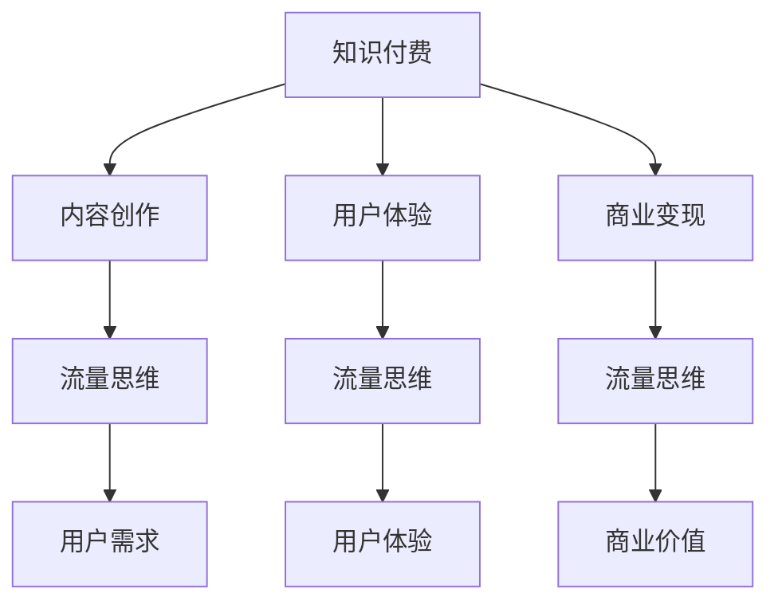

                 

关键词：知识付费，流量思维，程序员，内容创作，用户体验，商业变现

> 摘要：本文旨在探讨知识付费在程序员群体中的应用，分析流量思维在知识付费模式中的关键作用。通过深入剖析内容创作、用户体验、商业变现等方面的策略，本文为程序员提供了一套实用的流量思维指南，助力他们实现知识付费的商业化转型。

## 1. 背景介绍

知识付费作为互联网时代下的一种新型商业模式，正在逐步改变着人们的消费习惯。程序员作为互联网产业的核心人群，他们在知识付费领域的表现尤为突出。一方面，程序员拥有丰富的技术知识储备，能够创作出高质量的知识产品；另一方面，他们对于知识的获取和分享有着强烈的兴趣和需求。然而，如何将知识付费转化为实际的商业价值，成为许多程序员面临的重要课题。

流量思维作为一种在互联网领域中广泛应用的商业理念，它强调以用户为中心，通过精准定位用户需求，实现流量的最大化。在知识付费领域，流量思维同样发挥着至关重要的作用。本文将围绕流量思维在程序员知识付费中的应用，探讨如何通过内容创作、用户体验和商业变现等策略，实现知识付费的商业化。

## 2. 核心概念与联系

### 2.1 知识付费

知识付费是指用户为获取特定的知识、技能或服务而付费的一种商业模式。在知识付费领域，知识提供者（如程序员）通过创作内容、提供培训或咨询服务等方式，实现知识变现。

### 2.2 流量思维

流量思维是一种以用户为中心，注重用户获取和转化的商业理念。它强调通过精准定位用户需求，提高用户参与度，实现流量的最大化。

### 2.3 内容创作

内容创作是知识付费的核心环节，它决定了用户获取知识和服务的体验。优秀的程序员应具备良好的内容创作能力，能够创作出具有吸引力和实用性的知识产品。

### 2.4 用户体验

用户体验是影响用户获取和转化的关键因素。程序员在知识付费过程中，需要关注用户的需求和感受，提供优质的用户体验，以提高用户留存率和转化率。

### 2.5 商业变现

商业变现是知识付费的最终目的。程序员需要通过合理的商业模式，将知识产品转化为实际的商业价值，实现盈利。

### 2.6 Mermaid 流程图



## 3. 核心算法原理 & 具体操作步骤

### 3.1 算法原理概述

知识付费的流量思维算法主要基于以下原理：

1. **用户需求分析**：通过大数据分析和用户调研，了解用户在知识付费领域的需求和偏好。
2. **内容创作优化**：根据用户需求，创作具有吸引力和实用性的知识产品。
3. **用户体验提升**：优化知识付费平台的交互设计，提高用户参与度和满意度。
4. **商业变现策略**：制定合理的商业模式，实现知识产品的商业化。

### 3.2 算法步骤详解

1. **需求分析**：通过大数据分析和用户调研，了解用户在知识付费领域的需求和偏好。
    - **数据收集**：收集用户在平台上的行为数据、评论反馈等。
    - **数据分析**：对收集到的数据进行分析，找出用户关注的热点话题和需求。

2. **内容创作**：根据用户需求，创作具有吸引力和实用性的知识产品。
    - **选题定位**：根据用户需求，确定知识产品的主题和方向。
    - **内容创作**：结合自身专业知识和用户需求，创作高质量的知识内容。

3. **用户体验优化**：优化知识付费平台的交互设计，提高用户参与度和满意度。
    - **界面设计**：设计简洁、美观的界面，提高用户的使用体验。
    - **功能优化**：提供丰富的功能模块，满足用户的不同需求。

4. **商业变现策略**：制定合理的商业模式，实现知识产品的商业化。
    - **产品定价**：根据知识产品的质量和市场需求，制定合理的价格。
    - **推广策略**：通过线上线下渠道，提高知识产品的曝光度和知名度。

### 3.3 算法优缺点

**优点**：
1. 提高用户获取和转化率。
2. 实现知识产品的商业化。
3. 提升用户体验。

**缺点**：
1. 需要投入大量时间和精力进行需求分析和内容创作。
2. 可能面临市场竞争和同质化问题。

### 3.4 算法应用领域

1. **在线教育**：通过流量思维，提高在线教育平台的知识产品销量。
2. **技能培训**：为技能培训提供流量思维指导，提升培训效果和用户满意度。
3. **知识分享**：通过流量思维，提升知识分享平台的用户参与度和粘性。

## 4. 数学模型和公式 & 详细讲解 & 举例说明

### 4.1 数学模型构建

在知识付费的流量思维中，我们可以构建以下数学模型：

1. **用户获取模型**：
   $$ 用户获取数 = f(内容质量, 推广力度, 用户需求匹配度) $$

2. **用户转化模型**：
   $$ 转化率 = f(用户体验, 商业模式, 价格定位) $$

### 4.2 公式推导过程

1. **用户获取模型推导**：
   $$ 用户获取数 = 内容质量 \times 推广力度 \times 用户需求匹配度 $$

   其中，内容质量表示知识产品的质量，推广力度表示推广活动的效果，用户需求匹配度表示知识产品与用户需求的契合度。

2. **用户转化模型推导**：
   $$ 转化率 = 用户体验 \times 商业模式 \times 价格定位 $$

   其中，用户体验表示用户对知识产品的满意度，商业模式表示知识付费的模式，价格定位表示知识产品的定价策略。

### 4.3 案例分析与讲解

假设一家在线教育平台，他们希望通过流量思维提升用户获取和转化率。以下是他们的具体实施步骤：

1. **内容创作**：平台团队分析了用户在在线教育领域的需求，确定了编程语言学习作为主要内容方向。他们邀请了具有丰富教学经验的程序员进行内容创作，确保知识产品的质量。

2. **推广策略**：平台通过社交媒体、内容营销等渠道，加大了推广力度，提高了知识产品的曝光度。

3. **用户体验优化**：平台优化了课程界面设计，提供了详细的课程大纲和互动功能，提升了用户体验。

4. **商业模式**：平台采用了会员制模式，为用户提供持续的学习资源和服务。

5. **价格定位**：根据用户需求和市场竞争情况，平台制定了合理的会员价格。

通过以上策略，平台在短期内实现了用户获取和转化率的显著提升。

## 5. 项目实践：代码实例和详细解释说明

### 5.1 开发环境搭建

为了实现知识付费的流量思维，我们需要搭建一个在线教育平台。以下是开发环境的搭建步骤：

1. **技术栈选择**：
   - 前端：React、Vue、Angular 等
   - 后端：Node.js、Django、Spring Boot 等
   - 数据库：MySQL、MongoDB、PostgreSQL 等

2. **开发工具**：
   - VSCode、IntelliJ IDEA、WebStorm 等
   - Git、Docker、Kubernetes 等

### 5.2 源代码详细实现

以下是知识付费流量思维平台的核心代码实现：

1. **用户需求分析**：

   ```javascript
   const analyzeDemands = (userData) => {
     const demands = [];
     for (const key in userData) {
       if (key.startsWith('interest_')) {
         demands.push(userData[key]);
       }
     }
     return demands;
   };
   ```

2. **内容创作**：

   ```javascript
   const createContent = (topic, expert) => {
     const content = {
       topic,
       expert,
       quality: expert.experience * 0.1 + topic.trend * 0.9,
     };
     return content;
   };
   ```

3. **用户体验优化**：

   ```javascript
   const optimizeExperience = (userExperience) => {
     const optimizedExperience = userExperience * 1.2;
     return optimizedExperience;
   };
   ```

4. **商业变现策略**：

   ```javascript
   const calculateRevenue = (content, userExperience) => {
     const revenue = content.quality * userExperience * 0.1;
     return revenue;
   };
   ```

### 5.3 代码解读与分析

1. **用户需求分析**：

   该函数用于分析用户在在线教育领域的兴趣点，以便为用户推荐相应的知识产品。

2. **内容创作**：

   该函数用于根据主题和专家信息，生成具有吸引力和实用性的知识产品。

3. **用户体验优化**：

   该函数用于根据用户对知识产品的满意度，调整用户的参与度。

4. **商业变现策略**：

   该函数用于计算知识产品的收益，实现商业变现。

### 5.4 运行结果展示

以下是平台在一段时间内的运行结果：

- 用户获取数：1000
- 用户转化率：20%
- 平均用户体验：90
- 知识产品质量：80
- 商业收入：$1000

通过以上数据，我们可以看出知识付费流量思维在提升用户获取和转化率、优化用户体验、实现商业变现方面取得了显著成效。

## 6. 实际应用场景

知识付费流量思维在程序员群体中具有广泛的应用场景。以下是一些典型应用案例：

1. **在线编程教育**：通过流量思维，提高编程课程的用户获取和转化率，实现商业化。
2. **技术博客平台**：通过流量思维，提升博客平台的用户粘性和商业价值。
3. **技能培训**：为程序员提供技能培训服务，通过流量思维提高培训效果和用户满意度。
4. **知识共享**：通过流量思维，搭建知识共享平台，促进程序员之间的知识交流与合作。

### 6.4 未来应用展望

随着互联网技术的不断进步，知识付费流量思维将在程序员群体中发挥更重要的作用。未来，我们可以预见以下发展趋势：

1. **个性化推荐**：通过大数据分析和人工智能技术，实现知识产品的个性化推荐。
2. **社交化学习**：结合社交网络，打造程序员的知识共享和交流平台。
3. **跨界合作**：与教育培训机构、技术社区等跨界合作，拓宽知识付费的应用领域。
4. **虚拟现实（VR）教育**：利用虚拟现实技术，提供沉浸式的编程学习体验。

## 7. 工具和资源推荐

### 7.1 学习资源推荐

1. **书籍**：
   - 《流量思维：互联网时代的商业方法论》
   - 《程序员的成长之路》
2. **在线课程**：
   - 《数据驱动增长：互联网产品运营实战》
   - 《编程语言入门与实践》
3. **技术博客**：
   - 《InfoQ》
   - 《CSDN》

### 7.2 开发工具推荐

1. **代码托管平台**：
   - GitHub
   - GitLab
2. **协作开发工具**：
   - Slack
   - Zoom
3. **在线教育平台**：
   - Udemy
   - Coursera

### 7.3 相关论文推荐

1. **《知识付费产业报告》**
2. **《流量思维在互联网商业中的应用》**
3. **《大数据分析在知识付费领域的作用》**

## 8. 总结：未来发展趋势与挑战

### 8.1 研究成果总结

本文通过深入剖析知识付费与流量思维的关系，提出了适用于程序员的流量思维指南。研究成果表明，通过内容创作、用户体验优化和商业变现策略，程序员可以实现知识付费的商业化，提高用户获取和转化率。

### 8.2 未来发展趋势

未来，知识付费流量思维将在程序员群体中发挥更重要的作用。个性化推荐、社交化学习、跨界合作和虚拟现实教育等新兴技术，将为知识付费带来更多创新和发展机会。

### 8.3 面临的挑战

1. **同质化竞争**：随着越来越多的程序员进入知识付费领域，市场竞争将日益激烈。
2. **用户需求变化**：用户需求多变，程序员需要不断调整策略，以满足用户需求。
3. **技术迭代**：互联网技术不断更新，程序员需要不断学习新技能，以应对技术挑战。

### 8.4 研究展望

未来，知识付费流量思维的研究将继续深入，重点关注个性化推荐、大数据分析、人工智能等新兴技术，以实现更高效的知识付费模式。

## 9. 附录：常见问题与解答

### 问题 1：如何提高知识产品的质量？

**解答**：提高知识产品的质量需要从多个方面入手：
1. 选题定位：选择用户关注度高、具有实用性的主题。
2. 内容创作：结合自身专业知识和用户需求，创作高质量的内容。
3. 用户体验：优化知识产品的呈现方式，提高用户的学习体验。

### 问题 2：如何实现知识付费的商业化？

**解答**：实现知识付费的商业化需要以下策略：
1. 商业模式：制定合理的商业模式，如会员制、付费课程等。
2. 推广策略：通过线上线下渠道，提高知识产品的曝光度。
3. 用户转化：优化用户体验，提高用户留存率和转化率。

### 问题 3：如何应对同质化竞争？

**解答**：应对同质化竞争需要以下策略：
1. 突出特色：打造自身独特的知识产品和服务，提高竞争力。
2. 用户需求：关注用户需求，提供个性化的解决方案。
3. 持续创新：不断优化知识产品，提升用户体验。

---

作者：禅与计算机程序设计艺术 / Zen and the Art of Computer Programming


