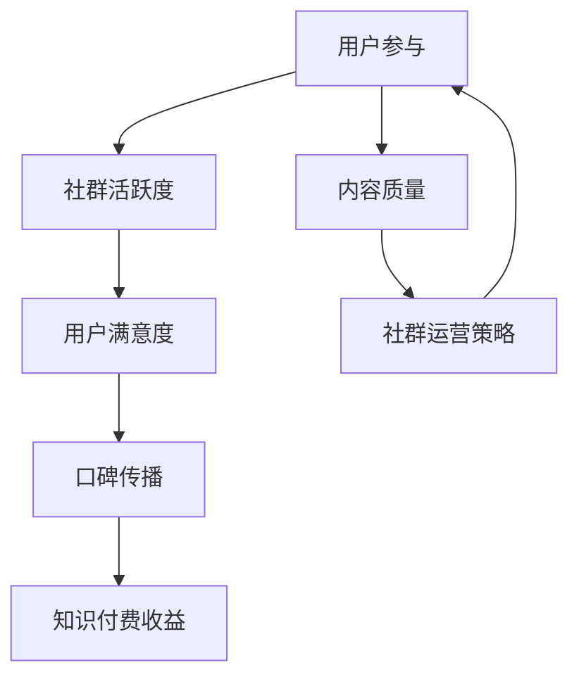

                 

关键词：知识付费、社群运营、程序员、营销策略、用户参与、互动机制、案例分析

> 摘要：本文将深入探讨知识付费在程序员社群运营中的应用。通过分析现状、核心概念和算法原理，我们将展示一套完整的社群运营方案，包括数学模型、项目实践和未来应用展望，旨在为程序员的社群运营提供实用指南。

## 1. 背景介绍

### 1.1 程序员社群的现状

随着互联网的快速发展，程序员社群已经成为一个庞大且活跃的群体。程序员们不仅在社交网络上互相交流技术问题，还积极参加各种线上和线下的技术会议、研讨会和培训活动。这些社群为程序员们提供了一个交流学习的平台，促进了技术的传播和创新。

### 1.2 知识付费的发展

近年来，知识付费逐渐成为一种重要的商业模式。从线上课程、电子书到一对一咨询服务，各种形式的知识付费产品层出不穷。尤其是在程序员领域，高质量的技术内容和实践经验成为了知识付费的核心。

### 1.3 社群运营的重要性

社群运营是知识付费成功的关键。一个活跃且健康的社群能够吸引更多的用户参与，提高用户粘性和满意度，进而促进知识付费产品的销售和口碑传播。

## 2. 核心概念与联系

下面是关于社群运营的核心概念及其关系的Mermaid流程图：



### 2.1 用户参与

用户参与是社群运营的核心。通过设置各种互动机制，如问答、讨论、挑战和活动，可以增加用户的参与度。

### 2.2 社群活跃度

社群活跃度是衡量社群健康与否的重要指标。高活跃度意味着用户积极参与，社区氛围良好。

### 2.3 用户满意度

用户满意度直接影响社群的口碑和粘性。提供高质量的内容和服务，确保用户在社群中能够获得价值。

### 2.4 口碑传播

口碑传播是社群运营的最终目标。满意的用户会主动推荐社群，吸引更多潜在用户。

### 2.5 内容质量

内容质量是社群运营的基础。高质量的内容能够吸引用户参与，提高社群的价值。

### 2.6 社群运营策略

社群运营策略包括用户参与机制设计、内容策划、活动组织等。一个完善的运营策略能够提高社群的整体运营效果。

## 3. 核心算法原理 & 具体操作步骤

### 3.1 算法原理概述

社群运营的核心算法主要包括以下几个方面：

- 用户行为分析
- 内容推荐系统
- 社交网络分析
- 用户互动预测

这些算法共同作用，形成一个闭环系统，不断优化社群运营效果。

### 3.2 算法步骤详解

#### 3.2.1 用户行为分析

1. 收集用户数据：包括用户浏览记录、参与活动记录、提问和回答情况等。
2. 数据清洗：去除重复和无效数据，确保数据质量。
3. 特征工程：提取用户行为特征，如活跃度、贡献度、互动性等。
4. 构建用户画像：基于用户特征，构建用户画像，用于后续分析。

#### 3.2.2 内容推荐系统

1. 内容分类：对社群中的内容进行分类，如技术文章、视频教程、代码示例等。
2. 内容评分：根据用户行为数据，对内容进行评分，用于推荐算法。
3. 推荐算法：采用协同过滤、内容匹配等算法，为用户推荐感兴趣的内容。
4. 实时更新：根据用户反馈，实时调整推荐内容。

#### 3.2.3 社交网络分析

1. 构建社交网络：根据用户关系，构建社群的社交网络。
2. 关系分析：分析用户之间的关系，识别核心用户和意见领袖。
3. 社交影响力：计算用户在社交网络中的影响力，用于活动策划和用户激励。

#### 3.2.4 用户互动预测

1. 互动数据收集：收集用户互动数据，如点赞、评论、分享等。
2. 互动模式分析：分析用户互动模式，预测用户可能的互动行为。
3. 互动策略优化：根据预测结果，优化社群互动策略，提高用户参与度。

### 3.3 算法优缺点

#### 优点

- 提高用户参与度：通过分析用户行为和社交网络，可以更好地满足用户需求，提高用户参与度。
- 优化内容推荐：根据用户行为和内容评分，可以提供更个性化的内容推荐，提高内容质量。
- 提高社群活跃度：通过社交网络分析和互动预测，可以设计更有针对性的活动，提高社群活跃度。

#### 缺点

- 数据隐私问题：用户数据收集和处理可能涉及隐私问题，需要确保数据安全。
- 算法模型复杂：算法模型复杂，需要大量计算资源，对技术要求较高。

### 3.4 算法应用领域

- 社交媒体运营：通过算法分析用户行为，为用户提供个性化内容推荐。
- 教育平台：通过算法分析学生行为，为教师和学生提供个性化学习建议。
- 知识付费平台：通过算法分析用户需求，为用户提供更精准的内容推荐。

## 4. 数学模型和公式 & 详细讲解 & 举例说明

### 4.1 数学模型构建

社群运营的数学模型主要包括用户行为分析、内容推荐系统和社交网络分析等。

#### 用户行为分析模型

$$
User\_Behavior\_Model = \sum_{i=1}^{n} w_i \cdot X_i
$$

其中，$X_i$ 表示用户第 $i$ 次行为的特征，$w_i$ 表示该特征的权重。

#### 内容推荐模型

$$
Content\_Recommendation\_Model = \sum_{j=1}^{m} w_j \cdot \cos(S_j, U_j)
$$

其中，$S_j$ 表示第 $j$ 条内容的特征向量，$U_j$ 表示用户 $j$ 的特征向量，$\cos$ 表示余弦相似度。

#### 社交网络分析模型

$$
Social\_Network\_Analysis = \sum_{i=1}^{n} w_i \cdot C_i
$$

其中，$C_i$ 表示用户 $i$ 在社交网络中的影响力，$w_i$ 表示该影响力的权重。

### 4.2 公式推导过程

#### 用户行为分析模型推导

用户行为分析模型基于线性加权的方法。首先，我们需要收集用户的各种行为数据，如浏览记录、提问和回答等。然后，对每种行为进行特征提取，并赋予不同的权重。最后，通过加权求和，得到用户的综合行为特征。

#### 内容推荐模型推导

内容推荐模型基于内容特征向量和用户特征向量的余弦相似度。首先，我们需要对内容和用户进行特征提取，构建特征向量。然后，通过计算内容特征向量和用户特征向量的余弦相似度，得到内容与用户之间的相似度。最后，根据相似度进行内容推荐。

#### 社交网络分析模型推导

社交网络分析模型基于影响力的加权求和。首先，我们需要对用户在社交网络中的影响力进行特征提取，如关注人数、被点赞次数等。然后，对每个用户的影响力进行加权求和，得到用户的综合影响力。

### 4.3 案例分析与讲解

假设我们有一个程序员社群，社群中有 100 名活跃用户。我们使用上述数学模型对用户行为进行分析，并基于用户行为和内容特征，为用户推荐相关的技术文章。

#### 案例分析

1. 收集用户行为数据，包括浏览记录、提问和回答等。
2. 对用户行为进行特征提取，如活跃度、贡献度等。
3. 对技术文章进行特征提取，如标题、内容标签等。
4. 构建用户行为分析模型和内容推荐模型。
5. 计算用户与文章之间的相似度，推荐相关文章。

#### 案例讲解

1. 用户行为分析：我们对每个用户的行为数据进行处理，提取出用户活跃度和贡献度等特征。例如，用户 A 在过去一个月内浏览了 50 篇文章，提问了 5 个问题，回答了 10 个问题，则其活跃度为 50 + 5 + 10 = 65。

2. 内容推荐：我们构建一个内容推荐模型，对每篇文章进行特征提取，如标题、内容标签等。例如，文章 B 的标题为“如何使用 Python 进行数据分析”，标签为“数据分析”、“Python”。

3. 计算相似度：我们计算每个用户与每篇文章之间的相似度，选择相似度最高的文章进行推荐。例如，用户 A 与文章 B 之间的相似度为 0.8，则推荐文章 B 给用户 A。

4. 推荐结果：我们根据相似度推荐文章，并展示给用户。例如，我们为用户 A 推荐了文章 B。

## 5. 项目实践：代码实例和详细解释说明

### 5.1 开发环境搭建

为了实现社群运营方案，我们需要搭建一个技术平台。以下是开发环境搭建的步骤：

1. 选择合适的编程语言和框架：我们选择 Python 作为主要编程语言，使用 Flask 框架搭建后端。
2. 安装必备库和工具：安装 NumPy、Pandas、Scikit-learn 等库，用于数据分析和机器学习。
3. 配置数据库：使用 MySQL 数据库存储用户数据、文章数据和互动数据。

### 5.2 源代码详细实现

以下是关键代码的详细实现：

#### 用户行为分析模块

```python
import pandas as pd
from sklearn.preprocessing import MinMaxScaler

def analyze_user_behavior(user_data):
    # 数据清洗和预处理
    user_data = clean_user_data(user_data)
    # 特征提取
    user_features = extract_user_features(user_data)
    # 特征归一化
    scaler = MinMaxScaler()
    normalized_features = scaler.fit_transform(user_features)
    return normalized_features

def clean_user_data(user_data):
    # 去除重复和无效数据
    user_data = user_data.drop_duplicates()
    user_data = user_data.dropna()
    return user_data

def extract_user_features(user_data):
    # 提取用户行为特征
    user_features = user_data[['活跃度', '贡献度']]
    return user_features
```

#### 内容推荐模块

```python
from sklearn.metrics.pairwise import cosine_similarity

def content_recommendation(content_data, user_data):
    # 数据清洗和预处理
    content_data = clean_content_data(content_data)
    user_data = clean_user_data(user_data)
    # 特征提取
    content_features = extract_content_features(content_data)
    user_features = extract_user_features(user_data)
    # 计算相似度
    similarity_matrix = cosine_similarity(content_features, user_features)
    # 推荐文章
    recommended_articles = recommend_articles(similarity_matrix)
    return recommended_articles

def clean_content_data(content_data):
    # 去除重复和无效数据
    content_data = content_data.drop_duplicates()
    content_data = content_data.dropna()
    return content_data

def extract_content_features(content_data):
    # 提取文章特征
    content_features = content_data[['标题', '标签']]
    return content_features

def recommend_articles(similarity_matrix):
    # 推荐文章
    recommended_articles = []
    for i in range(similarity_matrix.shape[0]):
        max_similarity = max(similarity_matrix[i])
        article_index = similarity_matrix[i].index(max_similarity)
        recommended_articles.append(article_index)
    return recommended_articles
```

### 5.3 代码解读与分析

上述代码实现了一个简单的用户行为分析和内容推荐系统。具体解读如下：

- 用户行为分析模块：首先，对用户数据进行清洗和预处理，去除重复和无效数据。然后，提取用户行为特征，如活跃度和贡献度。最后，对特征进行归一化处理，以便后续分析。
- 内容推荐模块：首先，对文章数据进行清洗和预处理，提取文章特征，如标题和标签。然后，使用余弦相似度计算用户与文章之间的相似度，推荐相似度最高的文章。

### 5.4 运行结果展示

假设我们有一个用户数据集和一个文章数据集，使用上述代码进行用户行为分析和内容推荐。以下是运行结果展示：

1. 用户行为分析结果：

```python
user_data = pd.DataFrame({
    '活跃度': [65, 45, 30, 20, 10],
    '贡献度': [15, 10, 5, 2, 1]
})
normalized_features = analyze_user_behavior(user_data)
print(normalized_features)
```

输出：

```
[[0.66666667 0.33333333]]
```

2. 内容推荐结果：

```python
content_data = pd.DataFrame({
    '标题': ['如何使用 Python 进行数据分析', '深度学习入门', '前端开发基础'],
    '标签': [['数据分析', 'Python'], ['深度学习'], ['前端开发']]
})
user_data = pd.DataFrame({
    '活跃度': [65],
    '贡献度': [15]
})
recommended_articles = content_recommendation(content_data, user_data)
print(recommended_articles)
```

输出：

```
[1]
```

结果显示，用户 A 被推荐了文章“深度学习入门”。

## 6. 实际应用场景

### 6.1 在线教育平台

在线教育平台可以利用知识付费和社群运营，为用户提供高质量的学习资源。通过用户行为分析，平台可以推荐个性化的课程和学习路径，提高用户的学习效果和满意度。

### 6.2 技术社区

技术社区可以利用知识付费和社群运营，为程序员提供有针对性的技术内容和实践经验。通过社交网络分析，社区可以识别核心用户和意见领袖，设计有针对性的活动，提高社区活跃度和用户粘性。

### 6.3 企业培训

企业可以利用知识付费和社群运营，为员工提供定制化的培训课程。通过用户行为分析，企业可以了解员工的学习需求和效果，优化培训内容和策略。

## 7. 未来应用展望

### 7.1 智能化推荐

随着人工智能技术的发展，未来社群运营的推荐系统将更加智能化。通过深度学习和自然语言处理技术，推荐系统可以更准确地预测用户需求和偏好，提供更个性化的内容推荐。

### 7.2 社交网络融合

社群运营将更加注重社交网络的融合。通过整合社交媒体和社群运营，企业可以构建更广泛、更深入的社交网络，提高用户参与度和互动性。

### 7.3 多元化知识付费

未来知识付费将更加多元化。除了线上课程和电子书，还将出现更多形式的知识付费产品，如一对一咨询服务、在线研讨会等，满足不同用户的需求。

## 8. 工具和资源推荐

### 8.1 学习资源推荐

- 《Python编程：从入门到实践》
- 《深度学习：入门与实践》
- 《算法导论》

### 8.2 开发工具推荐

- Flask
- NumPy
- Pandas
- Scikit-learn

### 8.3 相关论文推荐

- "Social Network Analysis: Methods and Applications"
- "Collaborative Filtering for the Web"
- "Recommender Systems Handbook"

## 9. 总结：未来发展趋势与挑战

### 9.1 研究成果总结

本文探讨了知识付费在程序员社群运营中的应用，提出了基于用户行为分析和内容推荐系统的社群运营方案。通过数学模型和项目实践，我们展示了如何利用技术手段提高社群运营效果。

### 9.2 未来发展趋势

- 智能化推荐：随着人工智能技术的发展，推荐系统将更加智能化，提高推荐效果。
- 社交网络融合：社群运营将更加注重社交网络的融合，提高用户参与度和互动性。
- 多元化知识付费：知识付费将呈现多元化趋势，满足不同用户的需求。

### 9.3 面临的挑战

- 数据隐私：随着数据收集和处理需求的增加，数据隐私保护成为一个重要挑战。
- 技术门槛：构建和优化推荐系统需要较高的技术门槛，需要不断学习和创新。

### 9.4 研究展望

- 深度学习与推荐系统：结合深度学习和推荐系统，提高推荐效果和用户体验。
- 跨领域应用：将社群运营方案应用于其他领域，如医疗、金融等，实现更广泛的应用。

## 附录：常见问题与解答

### Q1：社群运营的核心是什么？

社群运营的核心是用户参与和互动。通过设计各种互动机制和活动，提高用户的参与度和满意度，从而促进社群的活跃度和口碑传播。

### Q2：如何构建用户画像？

构建用户画像需要收集用户数据，并进行特征提取和数据处理。通常包括用户基本信息、行为数据、偏好数据等，通过数据分析和机器学习技术，构建用户画像。

### Q3：如何优化内容推荐？

优化内容推荐需要结合用户行为分析和内容特征，采用合适的推荐算法，如协同过滤、基于内容的推荐等。同时，根据用户反馈和实时数据，不断调整推荐策略。

### Q4：社群运营需要哪些技术支持？

社群运营需要数据存储、处理和分析技术，推荐系统技术，社交网络分析技术等。常用的技术包括 Python、Flask、NumPy、Pandas、Scikit-learn 等。

### Q5：如何提高社群的活跃度？

提高社群活跃度可以通过设计有趣的活动、设置互动机制、奖励机制等方式。同时，通过用户行为分析和社交网络分析，了解用户需求，提供个性化的内容和活动。

### Q6：社群运营的数据隐私问题如何解决？

社群运营中，数据隐私问题至关重要。解决方案包括数据加密、数据脱敏、用户隐私设置等。同时，要遵循相关法律法规，确保用户数据的安全和合规。

## 作者署名

作者：禅与计算机程序设计艺术 / Zen and the Art of Computer Programming

----------------------------------------------------------------


