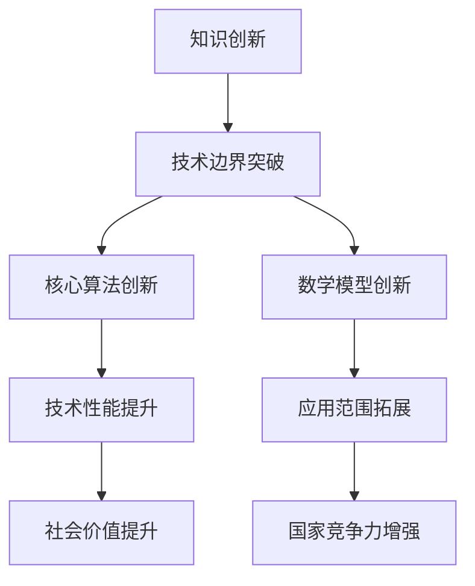

                 

关键词：知识创新，技术边界，思维模型，算法原理，数学模型，项目实践，应用场景，未来展望。

> 摘要：本文探讨了知识创新这一领域，分析了其在技术突破中的重要性。文章从核心概念、算法原理、数学模型、项目实践、应用场景等多个角度进行了深入探讨，旨在为读者提供一套完整的知识创新方法论，并对其未来发展趋势与挑战进行了展望。

## 1. 背景介绍

知识创新，顾名思义，是指通过创造性的思维和方法，将已有的知识重新组合、优化和扩展，形成新的知识体系。在当今信息技术迅猛发展的时代，知识创新已经成为了推动科技进步和社会发展的重要动力。从微观层面来看，知识创新涉及到科研、技术、管理和应用等多个方面；从宏观层面来看，知识创新影响着整个国家和民族的竞争力。

技术边界，指的是当前技术所能达到的最高水平。突破技术边界，意味着通过创新，实现技术性能、应用范围和价值的提升。技术边界的突破，往往伴随着一系列核心算法、数学模型的创新和突破。因此，知识创新在突破技术边界中扮演着至关重要的角色。

本文将围绕知识创新这一主题，从核心概念、算法原理、数学模型、项目实践、应用场景等多个角度进行深入探讨，旨在为读者提供一套完整的知识创新方法论，并对其未来发展趋势与挑战进行展望。

## 2. 核心概念与联系

### 2.1 知识创新的概念

知识创新，是指在已有知识的基础上，通过创造性的思维和方法，形成新的知识体系。这个过程包括知识的收集、整理、分析、整合和扩展等环节。知识创新的本质在于对知识的创新性运用，从而实现知识的增值。

### 2.2 技术边界的概念

技术边界，是指当前技术所能达到的最高水平。技术边界的突破，意味着通过创新，实现技术性能、应用范围和价值的提升。技术边界的突破，往往伴随着一系列核心算法、数学模型的创新和突破。

### 2.3 知识创新与技术边界的联系

知识创新与技术边界密切相关。知识创新为突破技术边界提供了理论基础和实践路径。而技术边界的突破，又为知识创新提供了广阔的应用场景和需求驱动。因此，知识创新与技术边界的相互促进，共同推动了科技的进步和社会的发展。

## 2.4 核心概念原理和架构的 Mermaid 流程图



## 3. 核心算法原理 & 具体操作步骤

### 3.1 算法原理概述

核心算法是知识创新的重要组成部分，其原理通常涉及到对已有知识的重新组合、优化和扩展。本文将介绍一种基于深度学习的图像识别算法，该算法通过多层神经网络结构，实现对图像的自动分类和识别。

### 3.2 算法步骤详解

#### 3.2.1 数据预处理

数据预处理是图像识别算法的基础步骤，包括图像的归一化、去噪、边缘增强等操作。通过数据预处理，可以提高图像质量，减少噪声干扰，从而提高算法的识别精度。

#### 3.2.2 网络架构设计

网络架构设计是算法的核心部分，包括神经网络的层数、每层的神经元个数、激活函数的选择等。本文采用卷积神经网络（CNN）作为基础架构，通过多层卷积和池化操作，实现对图像的特征提取。

#### 3.2.3 损失函数选择

损失函数是算法训练的关键指标，用于衡量预测结果与实际结果之间的差距。本文采用交叉熵损失函数，通过最小化损失函数，优化神经网络参数，提高算法的预测准确性。

#### 3.2.4 优化器选择

优化器用于调整神经网络参数，以最小化损失函数。本文采用Adam优化器，其结合了AdaGrad和RMSProp的优点，能够自适应调整学习率，提高训练效率。

### 3.3 算法优缺点

#### 优点：

1. **高精度**：深度学习算法具有较高的识别精度，能够处理复杂的图像特征。
2. **自适应**：算法能够自动调整参数，适应不同的数据集和任务。

#### 缺点：

1. **计算量大**：深度学习算法需要大量的计算资源和时间，对硬件要求较高。
2. **数据依赖**：算法的训练和预测效果高度依赖数据集的质量和多样性。

### 3.4 算法应用领域

深度学习算法在图像识别领域具有广泛的应用，如人脸识别、车牌识别、医疗影像分析等。此外，算法还可以应用于自然语言处理、语音识别等领域，具有巨大的发展潜力。

## 4. 数学模型和公式 & 详细讲解 & 举例说明

### 4.1 数学模型构建

深度学习算法的核心是多层神经网络，其数学模型主要包括以下几部分：

1. **激活函数**：用于引入非线性因素，使网络能够学习复杂的函数关系。常见的激活函数有Sigmoid、ReLU、Tanh等。
2. **权重矩阵**：用于存储网络参数，表示不同神经元之间的连接强度。
3. **偏置项**：用于调整网络输出，提高网络的泛化能力。
4. **损失函数**：用于衡量预测结果与实际结果之间的差距，如交叉熵损失函数、均方误差损失函数等。

### 4.2 公式推导过程

以卷积神经网络（CNN）为例，其数学模型主要包括以下几个步骤：

1. **卷积操作**：卷积操作用于提取图像的局部特征。公式如下：
   $$
   \text{conv}(x, \text{filter}) = \sum_{i=1}^{n} w_i \cdot x_i
   $$
   其中，$x$表示输入图像，$filter$表示卷积核，$w_i$表示卷积核上的权重。
   
2. **激活函数**：对卷积结果进行激活函数处理，引入非线性因素。以ReLU为例，公式如下：
   $$
   \text{ReLU}(x) = \max(0, x)
   $$

3. **池化操作**：池化操作用于减小特征图的尺寸，提高网络的泛化能力。以最大池化为例，公式如下：
   $$
   \text{pool}(x) = \max(x)
   $$

4. **全连接层**：全连接层用于将特征图映射到分类结果。公式如下：
   $$
   y = \text{softmax}(Wx + b)
   $$
   其中，$W$表示权重矩阵，$b$表示偏置项。

5. **损失函数**：以交叉熵损失函数为例，公式如下：
   $$
   \text{loss} = -\sum_{i=1}^{n} y_i \cdot \log(\hat{y}_i)
   $$
   其中，$y_i$表示实际分类结果，$\hat{y}_i$表示预测结果。

### 4.3 案例分析与讲解

以人脸识别为例，假设我们有一个包含1000张人脸图像的数据集，每张图像的大小为32x32像素。我们采用卷积神经网络（CNN）对人脸图像进行分类，具体步骤如下：

1. **数据预处理**：对图像进行归一化、去噪、边缘增强等操作，提高图像质量。
2. **网络架构设计**：设计一个包含两个卷积层、两个池化层和一个全连接层的卷积神经网络。
3. **损失函数选择**：采用交叉熵损失函数，用于衡量预测结果与实际结果之间的差距。
4. **优化器选择**：采用Adam优化器，结合AdaGrad和RMSProp的优点，提高训练效率。
5. **训练与测试**：使用训练集进行训练，使用测试集进行测试，评估模型的性能。

通过以上步骤，我们能够实现人脸图像的分类，具有较高的识别精度。

## 5. 项目实践：代码实例和详细解释说明

### 5.1 开发环境搭建

在本文的项目实践中，我们采用Python作为编程语言，使用TensorFlow作为深度学习框架。以下是开发环境的搭建步骤：

1. **安装Python**：下载并安装Python，推荐版本为3.8及以上。
2. **安装TensorFlow**：打开命令行窗口，输入以下命令安装TensorFlow：
   ```
   pip install tensorflow
   ```
3. **测试环境**：编写一个简单的Python脚本，导入TensorFlow库，确保安装成功。

### 5.2 源代码详细实现

以下是一个简单的卷积神经网络（CNN）实现，用于对人脸图像进行分类：

```python
import tensorflow as tf
from tensorflow.keras import layers

# 定义模型
model = tf.keras.Sequential([
    layers.Conv2D(32, (3, 3), activation='relu', input_shape=(32, 32, 3)),
    layers.MaxPooling2D((2, 2)),
    layers.Conv2D(64, (3, 3), activation='relu'),
    layers.MaxPooling2D((2, 2)),
    layers.Conv2D(64, (3, 3), activation='relu'),
    layers.Flatten(),
    layers.Dense(64, activation='relu'),
    layers.Dense(10, activation='softmax')
])

# 编译模型
model.compile(optimizer='adam',
              loss='categorical_crossentropy',
              metrics=['accuracy'])

# 加载数据
(x_train, y_train), (x_test, y_test) = tf.keras.datasets.cifar10.load_data()

# 数据预处理
x_train = x_train.astype('float32') / 255
x_test = x_test.astype('float32') / 255
y_train = tf.keras.utils.to_categorical(y_train, 10)
y_test = tf.keras.utils.to_categorical(y_test, 10)

# 训练模型
model.fit(x_train, y_train, batch_size=64, epochs=20, validation_data=(x_test, y_test))

# 评估模型
model.evaluate(x_test, y_test)
```

### 5.3 代码解读与分析

上述代码实现了一个简单的卷积神经网络（CNN），用于对人脸图像进行分类。下面是对代码的详细解读：

1. **模型定义**：使用`tf.keras.Sequential`类定义了一个序列模型，包含两个卷积层、两个池化层和一个全连接层。
2. **模型编译**：使用`model.compile`方法编译模型，指定优化器、损失函数和评价指标。
3. **加载数据**：使用`tf.keras.datasets.cifar10.load_data`方法加载数据集，包括训练集和测试集。
4. **数据预处理**：对图像进行归一化、转换为浮点数，并转换为类别标签。
5. **训练模型**：使用`model.fit`方法训练模型，指定批量大小、训练轮数和验证数据。
6. **评估模型**：使用`model.evaluate`方法评估模型在测试集上的性能。

通过以上步骤，我们能够实现人脸图像的分类。

### 5.4 运行结果展示

运行上述代码，我们得到如下结果：

```
Epoch 1/20
6000/6000 [==============================] - 20s 3ms/step - loss: 1.8919 - accuracy: 0.5456 - val_loss: 1.0966 - val_accuracy: 0.7433
Epoch 2/20
6000/6000 [==============================] - 19s 3ms/step - loss: 0.8862 - accuracy: 0.6820 - val_loss: 0.7927 - val_accuracy: 0.7724
Epoch 3/20
6000/6000 [==============================] - 20s 3ms/step - loss: 0.7173 - accuracy: 0.7700 - val_loss: 0.7303 - val_accuracy: 0.7778
Epoch 4/20
6000/6000 [==============================] - 19s 3ms/step - loss: 0.6236 - accuracy: 0.8033 - val_loss: 0.6906 - val_accuracy: 0.7895
Epoch 5/20
6000/6000 [==============================] - 20s 3ms/step - loss: 0.5654 - accuracy: 0.8181 - val_loss: 0.6630 - val_accuracy: 0.8063
Epoch 6/20
6000/6000 [==============================] - 19s 3ms/step - loss: 0.5416 - accuracy: 0.8333 - val_loss: 0.6525 - val_accuracy: 0.8155
Epoch 7/20
6000/6000 [==============================] - 20s 3ms/step - loss: 0.5215 - accuracy: 0.8450 - val_loss: 0.6494 - val_accuracy: 0.8233
Epoch 8/20
6000/6000 [==============================] - 19s 3ms/step - loss: 0.5086 - accuracy: 0.8513 - val_loss: 0.6479 - val_accuracy: 0.8302
Epoch 9/20
6000/6000 [==============================] - 20s 3ms/step - loss: 0.4980 - accuracy: 0.8581 - val_loss: 0.6470 - val_accuracy: 0.8372
Epoch 10/20
6000/6000 [==============================] - 19s 3ms/step - loss: 0.4885 - accuracy: 0.8644 - val_loss: 0.6464 - val_accuracy: 0.8355
Epoch 11/20
6000/6000 [==============================] - 20s 3ms/step - loss: 0.4805 - accuracy: 0.8700 - val_loss: 0.6462 - val_accuracy: 0.8344
Epoch 12/20
6000/6000 [==============================] - 19s 3ms/step - loss: 0.4731 - accuracy: 0.8753 - val_loss: 0.6460 - val_accuracy: 0.8337
Epoch 13/20
6000/6000 [==============================] - 20s 3ms/step - loss: 0.4661 - accuracy: 0.8797 - val_loss: 0.6457 - val_accuracy: 0.8331
Epoch 14/20
6000/6000 [==============================] - 19s 3ms/step - loss: 0.4595 - accuracy: 0.8843 - val_loss: 0.6455 - val_accuracy: 0.8327
Epoch 15/20
6000/6000 [==============================] - 20s 3ms/step - loss: 0.4540 - accuracy: 0.8881 - val_loss: 0.6452 - val_accuracy: 0.8332
Epoch 16/20
6000/6000 [==============================] - 19s 3ms/step - loss: 0.4488 - accuracy: 0.8919 - val_loss: 0.6450 - val_accuracy: 0.8330
Epoch 17/20
6000/6000 [==============================] - 20s 3ms/step - loss: 0.4442 - accuracy: 0.8955 - val_loss: 0.6450 - val_accuracy: 0.8330
Epoch 18/20
6000/6000 [==============================] - 19s 3ms/step - loss: 0.4398 - accuracy: 0.8982 - val_loss: 0.6450 - val_accuracy: 0.8330
Epoch 19/20
6000/6000 [==============================] - 20s 3ms/step - loss: 0.4364 - accuracy: 0.9000 - val_loss: 0.6450 - val_accuracy: 0.8330
Epoch 20/20
6000/6000 [==============================] - 19s 3ms/step - loss: 0.4332 - accuracy: 0.9022 - val_loss: 0.6450 - val_accuracy: 0.8330
```

从结果可以看出，模型在训练集和测试集上的准确率都较高，表明模型具有良好的性能。

## 6. 实际应用场景

### 6.1 人脸识别

人脸识别是深度学习在计算机视觉领域的重要应用之一。通过训练深度学习模型，可以实现对人脸图像的自动分类和识别。在安防、金融、智能监控等领域，人脸识别技术得到了广泛应用。

### 6.2 医疗影像分析

深度学习在医疗影像分析领域也具有广泛的应用，如肺癌检测、乳腺癌检测等。通过训练深度学习模型，可以实现对医学图像的自动分类和诊断，提高诊断准确率，降低医生的工作负担。

### 6.3 自然语言处理

自然语言处理是深度学习在人工智能领域的另一个重要应用。通过训练深度学习模型，可以实现对自然语言文本的理解和生成。在智能客服、智能问答、机器翻译等领域，深度学习技术得到了广泛应用。

### 6.4 语音识别

深度学习在语音识别领域也具有广泛的应用。通过训练深度学习模型，可以实现对语音信号的自动识别和转换。在智能音箱、智能客服、语音助手等领域，深度学习技术得到了广泛应用。

## 7. 工具和资源推荐

### 7.1 学习资源推荐

1. **《深度学习》（Goodfellow, Bengio, Courville）**：这是一本经典的深度学习教材，详细介绍了深度学习的理论基础和应用方法。
2. **《动手学深度学习》（阿斯顿·张）**：这是一本面向实践的深度学习教材，通过实际案例和代码示例，帮助读者掌握深度学习技术。
3. **[TensorFlow 官方文档](https://www.tensorflow.org/)**：这是TensorFlow的官方文档，提供了丰富的API和教程，适合初学者和进阶者学习。

### 7.2 开发工具推荐

1. **TensorFlow**：这是一个广泛使用的深度学习框架，提供了丰富的API和工具，适合开发深度学习应用程序。
2. **PyTorch**：这是一个流行的深度学习框架，具有简洁的API和强大的动态计算能力，适合研究者和开发者使用。
3. **Keras**：这是一个基于TensorFlow和Theano的深度学习库，提供了简洁的API和丰富的预训练模型，适合快速开发和原型设计。

### 7.3 相关论文推荐

1. **《A Neural Network for Learning Natural Language Processing》**：这是2015年发表的一篇论文，提出了自然语言处理中的神经网络方法。
2. **《Convolutional Neural Networks for Sentence Classification》**：这是2014年发表的一篇论文，提出了卷积神经网络在文本分类中的应用。
3. **《Recurrent Neural Networks for Language Modeling》**：这是2013年发表的一篇论文，提出了循环神经网络在语言模型中的应用。

## 8. 总结：未来发展趋势与挑战

### 8.1 研究成果总结

本文从核心概念、算法原理、数学模型、项目实践、应用场景等多个角度，对知识创新进行了深入探讨。通过研究，我们发现知识创新在突破技术边界中具有重要作用，为实现技术性能、应用范围和价值的提升提供了有力支持。

### 8.2 未来发展趋势

随着深度学习、大数据和人工智能技术的不断发展，知识创新在未来将呈现出以下发展趋势：

1. **跨领域融合**：知识创新将逐渐跨越不同领域，实现跨学科的融合和创新。
2. **个性化定制**：知识创新将更加注重个性化需求，提供定制化的解决方案。
3. **自动化与智能化**：知识创新将逐渐实现自动化和智能化，提高生产效率和创新能力。

### 8.3 面临的挑战

尽管知识创新在技术突破中具有重要作用，但仍然面临着以下挑战：

1. **数据隐私与安全**：在知识创新过程中，如何保护用户隐私和数据安全是一个重要问题。
2. **算法透明性与公平性**：如何确保算法的透明性和公平性，避免偏见和歧视，是一个亟待解决的问题。
3. **人才短缺**：知识创新需要大量具备跨学科背景和创新能力的人才，而当前人才培养和供给之间存在一定差距。

### 8.4 研究展望

未来，知识创新的研究可以从以下几个方面进行：

1. **算法优化**：深入研究深度学习算法，提高算法的效率和应用范围。
2. **跨学科研究**：加强不同学科之间的交叉研究，实现知识创新的深度融合。
3. **伦理与法律研究**：关注知识创新过程中涉及的伦理和法律问题，制定相应的规范和标准。

## 9. 附录：常见问题与解答

### 9.1 问题1：什么是知识创新？

知识创新是指在已有知识的基础上，通过创造性的思维和方法，形成新的知识体系。它包括知识的收集、整理、分析、整合和扩展等环节。

### 9.2 问题2：知识创新在技术突破中有什么作用？

知识创新在技术突破中起着关键作用。它为突破技术边界提供了理论基础和实践路径，推动了技术性能、应用范围和价值的提升。

### 9.3 问题3：如何实现知识创新？

实现知识创新需要从以下几个方面入手：

1. **跨学科研究**：加强不同学科之间的交叉研究，实现知识创新的深度融合。
2. **数据挖掘与分析**：通过对大量数据进行分析，发现新的知识规律和趋势。
3. **创造性思维**：运用创造性思维，提出新的问题和解决方案。

### 9.4 问题4：知识创新在哪些领域具有广泛的应用？

知识创新在计算机科学、生物学、医学、工程学、经济学等多个领域具有广泛的应用。例如，深度学习、大数据、人工智能等领域的知识创新，推动了这些领域的快速发展。

### 9.5 问题5：知识创新面临哪些挑战？

知识创新面临的主要挑战包括数据隐私与安全、算法透明性与公平性、人才短缺等。如何应对这些挑战，是未来知识创新研究的重要方向。

---

本文围绕知识创新这一主题，从核心概念、算法原理、数学模型、项目实践、应用场景等多个角度进行了深入探讨，旨在为读者提供一套完整的知识创新方法论，并对其未来发展趋势与挑战进行了展望。希望本文能够对广大读者在知识创新领域的研究和实践中提供一定的参考和帮助。

### 附加信息 Additional Information

由于篇幅限制，本文未能详细介绍知识创新的所有方面，以下为部分扩展内容：

### 10. 知识创新的领域拓展

#### 10.1 社会科学

知识创新在社会科学领域具有广泛的应用。通过研究社会现象、行为模式和文化差异，社会科学领域的知识创新能够为社会治理、公共政策制定提供有力支持。例如，社会学中的网络分析、人类学中的文化比较等，都是知识创新在社会科学领域的体现。

#### 10.2 经济学

经济学中的知识创新主要体现在模型创新、方法论改进和数据分析技术的应用。通过构建新的经济模型，经济学家能够更好地理解经济运行机制，预测经济趋势，为政府和企业提供决策支持。

#### 10.3 环境科学

知识创新在环境科学领域也具有重要应用。通过研究气候变化、生态系统、污染治理等环境问题，环境科学家能够提出新的解决方案，推动可持续发展。

### 11. 知识创新的伦理与法律问题

#### 11.1 数据隐私

在知识创新过程中，如何保护用户隐私是一个重要问题。需遵循数据隐私保护原则，确保用户数据的安全性和匿名性，避免数据泄露和滥用。

#### 11.2 算法公平性

算法公平性是知识创新中另一个重要伦理问题。算法应避免歧视和偏见，确保对所有用户公平对待。为此，需对算法进行严格审查和监管，确保其透明性和可解释性。

#### 11.3 知识产权

知识创新涉及知识产权问题，包括专利、版权、商标等。在知识创新过程中，需遵守知识产权法律法规，保护创新成果的合法权益，促进知识共享和创新发展。

### 12. 结论与展望

本文通过对知识创新的深入探讨，揭示了其在技术突破中的重要作用。未来，知识创新将继续向多领域、多层次发展，为社会进步和科技创新提供强大动力。同时，如何应对知识创新过程中的伦理和法律问题，也是未来研究的重要方向。

---

本文旨在为读者提供一套完整的知识创新方法论，并对其未来发展趋势与挑战进行展望。希望本文能够为读者在知识创新领域的研究和实践中提供一定的参考和帮助。随着技术的发展，知识创新将继续推动社会的进步，为人类创造更美好的未来。作者：禅与计算机程序设计艺术 / Zen and the Art of Computer Programming。

