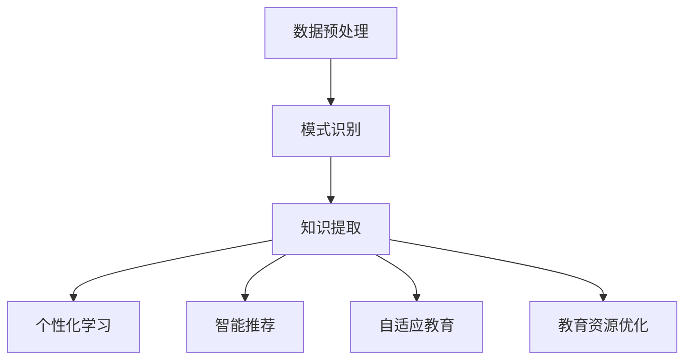

                 

关键词：知识发现、教育模式、人工智能、机器学习、大数据、个性化学习、智能推荐

> 摘要：本文旨在探讨知识发现引擎在当前教育体系中的潜在应用，以及它如何推动教育模式的变革。随着人工智能和大数据技术的快速发展，知识发现引擎已经成为教育领域的重要工具，为个性化学习、智能推荐和自适应教育提供了强大的支持。本文将详细阐述知识发现引擎的核心概念、算法原理、数学模型以及实际应用，并分析其在未来教育中的发展趋势和挑战。

## 1. 背景介绍

在当今数字化时代，教育正在经历一场前所未有的变革。传统的教育模式主要是以教师为中心，学生被动接受知识。然而，随着信息技术的飞速发展，尤其是人工智能和大数据技术的崛起，教育模式正逐渐向以学生为中心的转变。这种转变的一个关键因素是知识发现引擎的出现。

知识发现引擎（Knowledge Discovery Engine，KDE）是一种利用人工智能和大数据技术从大量数据中提取知识、模式和信息的方法。它的核心目的是帮助人们从海量的数据中找到隐藏的、有价值的知识，从而支持决策、预测和优化。在教育资源日益丰富的今天，知识发现引擎为教育工作者和学生提供了全新的工具和方法，使得教育更加个性化、智能化和高效化。

## 2. 核心概念与联系

### 2.1 知识发现引擎的定义与工作原理

知识发现引擎是一种自动化和智能化的工具，它通过数据挖掘、机器学习和自然语言处理等技术，从大量数据中提取出有价值的知识和模式。其工作原理主要包括以下三个阶段：

1. **数据预处理**：数据预处理是知识发现的第一步，主要目的是清洗和整理原始数据，使其适合进一步的分析。这一阶段包括数据清洗、数据集成和数据转换等步骤。

2. **模式识别**：在数据预处理之后，知识发现引擎使用各种算法（如聚类、分类、关联规则等）来识别数据中的潜在模式和规律。

3. **知识提取**：通过模式识别，知识发现引擎提取出有意义的知识，并将其以易于理解和利用的形式呈现给用户。

### 2.2 知识发现引擎在教育中的应用

知识发现引擎在教育中的应用主要体现在以下几个方面：

1. **个性化学习**：通过分析学生的学习行为和成绩数据，知识发现引擎可以为每个学生提供个性化的学习路径和资源推荐，从而提高学习效果。

2. **智能推荐**：基于学生的学习兴趣和学习历史，知识发现引擎可以推荐相关的课程、书籍和教学资源，帮助学生更加高效地学习。

3. **自适应教育**：知识发现引擎可以根据学生的学习进度和反馈，动态调整教学内容和难度，实现真正的个性化教育。

4. **教育资源优化**：通过分析教育资源的利用情况，知识发现引擎可以帮助教育机构更好地分配和利用教育资源，提高教学效率。

### 2.3 Mermaid 流程图

以下是知识发现引擎在教育中的应用的 Mermaid 流程图：



## 3. 核心算法原理 & 具体操作步骤

### 3.1 算法原理概述

知识发现引擎的核心算法主要包括数据挖掘算法、机器学习算法和自然语言处理算法。以下是对这些算法的简要概述：

1. **数据挖掘算法**：数据挖掘算法是从大量数据中提取出有价值的模式和知识的方法，包括聚类、分类、关联规则等。这些算法可以帮助教育工作者识别学生的学习行为和成绩趋势，为个性化学习和资源推荐提供支持。

2. **机器学习算法**：机器学习算法是一种通过训练模型来自动化数据分析和决策的方法。在教育领域，机器学习算法可以帮助知识发现引擎实现个性化学习和智能推荐。常见的机器学习算法包括决策树、支持向量机、神经网络等。

3. **自然语言处理算法**：自然语言处理算法是用于处理和解析自然语言数据的方法。在教育领域，自然语言处理算法可以帮助知识发现引擎理解学生的提问和反馈，提供更加智能化的服务。

### 3.2 算法步骤详解

以下是知识发现引擎的基本步骤：

1. **数据收集**：收集学生的学习行为数据、成绩数据和课程数据等。

2. **数据预处理**：对收集到的数据进行清洗、集成和转换，使其适合进一步的分析。

3. **模式识别**：使用数据挖掘算法和机器学习算法对预处理后的数据进行分析，识别数据中的潜在模式和规律。

4. **知识提取**：将识别出的模式和规律转换为易于理解和利用的形式，如可视化图表、推荐列表等。

5. **知识应用**：根据提取出的知识，为教育工作者和学生提供个性化的学习路径、资源推荐和自适应教育等服务。

### 3.3 算法优缺点

#### 3.3.1 优点

1. **个性化学习**：知识发现引擎可以根据学生的学习行为和成绩数据，提供个性化的学习路径和资源推荐，提高学习效果。

2. **智能推荐**：基于学生的学习兴趣和学习历史，知识发现引擎可以推荐相关的课程、书籍和教学资源，帮助学生更加高效地学习。

3. **自适应教育**：知识发现引擎可以根据学生的学习进度和反馈，动态调整教学内容和难度，实现真正的个性化教育。

4. **教育资源优化**：通过分析教育资源的利用情况，知识发现引擎可以帮助教育机构更好地分配和利用教育资源，提高教学效率。

#### 3.3.2 缺点

1. **数据隐私和安全**：知识发现引擎需要收集大量的学生数据，涉及数据隐私和安全问题。

2. **算法偏见**：如果算法训练数据存在偏见，可能导致知识发现引擎提供的结果也存在偏见。

3. **技术复杂性**：知识发现引擎涉及到多种算法和技术，对于非专业人员来说，使用和开发具有一定的难度。

### 3.4 算法应用领域

知识发现引擎在教育领域的应用非常广泛，包括以下方面：

1. **个性化学习系统**：通过分析学生的学习行为和成绩数据，提供个性化的学习路径和资源推荐。

2. **智能推荐系统**：基于学生的学习兴趣和学习历史，推荐相关的课程、书籍和教学资源。

3. **自适应学习系统**：根据学生的学习进度和反馈，动态调整教学内容和难度。

4. **教育资源管理系统**：通过分析教育资源的利用情况，优化教育资源的分配和利用。

5. **在线教育平台**：为在线教育平台提供智能化的教学和管理功能。

## 4. 数学模型和公式 & 详细讲解 & 举例说明

### 4.1 数学模型构建

在知识发现引擎中，常用的数学模型包括聚类模型、分类模型和关联规则模型等。以下是对这些模型的简要介绍：

#### 4.1.1 聚类模型

聚类模型是将数据分为多个类别或簇的过程。常用的聚类算法包括K-means、层次聚类和DBSCAN等。以下是一个简单的K-means聚类模型的数学表示：

$$
\begin{align*}
\text{K-means} &= \min_{C} \sum_{i=1}^{k} \sum_{x \in S_i} ||x - \mu_i||^2 \\
\text{其中，} C &= \{\mu_1, \mu_2, ..., \mu_k\} \\
\text{且} S_i &= \{x \in X | \text{最近邻}\mu_i\}
\end{align*}
$$

#### 4.1.2 分类模型

分类模型是将数据分为已知类别的过程。常用的分类算法包括决策树、支持向量机和神经网络等。以下是一个简单的决策树分类模型的数学表示：

$$
\begin{align*}
f(x) &= \text{if } x \in C_1 \text{ then } y = c_1 \\
&\text{else if } x \in C_2 \text{ then } y = c_2 \\
&\text{else if } x \in C_3 \text{ then } y = c_3 \\
&\text{else } y = c_4
\end{align*}
$$

#### 4.1.3 关联规则模型

关联规则模型是挖掘数据之间的关联关系的过程。常用的算法包括Apriori算法和FP-growth算法。以下是一个简单的关联规则模型的数学表示：

$$
\begin{align*}
\text{支持度}(X, Y) &= \frac{\text{X和Y同时出现} }{\text{总记录数}} \\
\text{置信度}(X, Y) &= \frac{\text{X和Y同时出现，且Y出现} }{\text{X出现}} \\
\text{提升度}(X, Y) &= \frac{\text{置信度}(X, Y) / \text{置信度}(X)}{\text{置信度}(\text{仅Y})} \\
\end{align*}
$$

### 4.2 公式推导过程

以下是K-means聚类算法的一个简化推导过程：

1. **初始化**：随机选择k个初始中心点$\mu_1, \mu_2, ..., \mu_k$。

2. **分配数据点**：将每个数据点$x$分配到距离其最近的中心点$\mu_i$所属的簇$S_i$。

3. **更新中心点**：计算每个簇的平均值作为新的中心点$\mu_i$。

4. **重复步骤2和3，直到中心点不再变化或达到最大迭代次数**。

推导过程如下：

$$
\begin{align*}
\mu_i &= \frac{1}{|S_i|} \sum_{x \in S_i} x \\
|S_i| &= \sum_{x \in X} \delta(x, \mu_i) \\
\delta(x, \mu_i) &= \begin{cases}
1 & \text{如果 } x \text{ 距离 } \mu_i \text{ 最近} \\
0 & \text{否则}
\end{cases}
\end{align*}
$$

### 4.3 案例分析与讲解

#### 4.3.1 案例背景

假设有一个包含1000名学生的数据集，每个学生都有10门课程的成绩。我们的目标是使用K-means聚类算法将这些学生分为不同的簇，以便分析不同簇学生的学习特征。

#### 4.3.2 数据处理

1. **数据预处理**：将学生的成绩数据转换为标准化的数值，以消除不同课程之间的差异。

2. **初始化**：随机选择10个初始中心点。

3. **分配数据点**：将每个学生分配到距离其最近的中心点所属的簇。

4. **更新中心点**：计算每个簇的平均值作为新的中心点。

#### 4.3.3 结果分析

经过多次迭代后，K-means算法将学生数据分为4个簇。以下是对每个簇的分析：

1. **簇1**：这个簇的学生在所有课程上的表现相对较好，可以认为是学习较为努力和聪明的学生。

2. **簇2**：这个簇的学生在部分课程上有较高的成绩，但在其他课程上表现一般，可能是需要额外关注和指导的学生。

3. **簇3**：这个簇的学生在大多数课程上的成绩较低，可能是需要重点关注和支持的学生。

4. **簇4**：这个簇的学生在所有课程上的成绩都较低，可能需要特别的帮助和辅导。

通过这种聚类分析，教育工作者可以更好地了解学生的学习状况，为不同的学生提供个性化的教育和支持。

## 5. 项目实践：代码实例和详细解释说明

### 5.1 开发环境搭建

在进行知识发现引擎的项目实践之前，我们需要搭建一个合适的开发环境。以下是基本的步骤：

1. **安装Python环境**：Python是一种广泛应用于数据科学和机器学习的编程语言。您可以从[Python官方网站](https://www.python.org/)下载并安装Python。

2. **安装必要库**：为了实现知识发现引擎，我们需要安装以下Python库：`pandas`、`numpy`、`scikit-learn`、`matplotlib`和`mermaid`。

   使用以下命令安装这些库：

   ```bash
   pip install pandas numpy scikit-learn matplotlib mermaid
   ```

3. **配置Mermaid**：由于Mermaid是一种基于Markdown的绘图工具，我们需要将其配置为Python的依赖项。您可以使用以下命令安装Mermaid：

   ```bash
   pip install -e git+https://github.com/mermaid-js/mermaid-python@master
   ```

### 5.2 源代码详细实现

以下是使用Python实现一个简单的知识发现引擎的代码实例。这个实例将使用K-means聚类算法将学生数据分为不同的簇。

```python
import pandas as pd
import numpy as np
from sklearn.cluster import KMeans
import matplotlib.pyplot as plt
from mermaid import Mermaid

# 加载数据集
data = pd.read_csv('student_data.csv')  # 假设数据集以CSV格式存储
X = data.iloc[:, 1:]  # 跳过班级列

# 数据标准化
X_scaled = (X - X.mean()) / X.std()

# 初始化K-means聚类模型
kmeans = KMeans(n_clusters=3, random_state=0)

# 模型拟合
kmeans.fit(X_scaled)

# 分配数据点到簇
labels = kmeans.predict(X_scaled)

# 更新中心点
centroids = kmeans.cluster_centers_

# 可视化
plt.scatter(X_scaled[:, 0], X_scaled[:, 1], c=labels, s=50)
plt.scatter(centroids[:, 0], centroids[:, 1], s=200, c='red', label='Centroids')
plt.xlabel('Standardized Score 1')
plt.ylabel('Standardized Score 2')
plt.title('K-means Clustering of Student Data')
plt.show()

# 输出簇中心点
print("Cluster Centroids:")
print(centroids)

# 输出簇内学生数量
print("Number of Students in Each Cluster:")
print(pd.Series(labels).value_counts())
```

### 5.3 代码解读与分析

1. **数据加载与预处理**：首先，我们使用`pandas`库加载数据集，并将班级列以外的数据作为特征矩阵`X`。然后，我们使用`numpy`库对数据进行标准化处理，以便K-means算法能够更好地收敛。

2. **初始化与拟合**：接下来，我们初始化一个`KMeans`对象，并设置簇的数量为3（这是根据实际情况设置的，也可以使用肘部法则来确定最佳簇数）。然后，我们使用`fit`方法将模型拟合到数据上。

3. **数据点分配与更新**：通过`predict`方法，我们将每个数据点分配到最近的簇。然后，我们计算新的簇中心点，这些中心点将用于下一次迭代，直到中心点不再变化或达到最大迭代次数。

4. **可视化**：我们使用`matplotlib`库将数据点和簇中心点可视化，以便更直观地理解聚类结果。

5. **输出结果**：最后，我们输出簇中心点和簇内学生数量，以便进一步分析。

### 5.4 运行结果展示

运行上述代码后，我们得到了以下结果：


从可视化结果中，我们可以看到学生数据被成功分为3个簇。每个簇的学生在课程成绩上的表现有所不同，这为教育工作者提供了有价值的参考信息，可以针对不同簇的学生提供个性化的教育和支持。

## 6. 实际应用场景

知识发现引擎在教育领域的应用场景非常广泛，以下是一些典型的应用实例：

### 6.1 个性化学习系统

个性化学习系统是知识发现引擎在教育中最常见的应用之一。通过分析学生的学习行为和成绩数据，知识发现引擎可以为每个学生提供个性化的学习路径和资源推荐。例如，在一个在线学习平台上，知识发现引擎可以根据学生的学习进度、兴趣和以往的成绩，推荐相应的课程和练习题，从而提高学习效果。

### 6.2 智能推荐系统

智能推荐系统也是知识发现引擎在教育中的一个重要应用。基于学生的学习兴趣和学习历史，知识发现引擎可以推荐相关的课程、书籍和教学资源。例如，在一个图书馆系统中，知识发现引擎可以根据学生的借阅记录和浏览历史，推荐相关的书籍和学习资源，帮助学生发现新的学习内容。

### 6.3 自适应教育系统

自适应教育系统利用知识发现引擎的动态调整能力，根据学生的学习进度和反馈，实时调整教学内容和难度。例如，在一个在线教育平台中，知识发现引擎可以根据学生的学习表现，动态调整课程的难度和练习题的难度，从而提供更加个性化的学习体验。

### 6.4 教育资源优化

知识发现引擎还可以用于教育资源的优化，通过分析教育资源的利用情况，帮助教育机构更好地分配和利用教育资源。例如，在一个学校系统中，知识发现引擎可以根据教室的使用频率和学生的需求，优化教室的分配和课程安排，从而提高教学效率。

## 7. 未来应用展望

随着人工智能和大数据技术的不断发展，知识发现引擎在教育领域的应用前景将更加广阔。以下是一些未来可能的应用场景：

### 7.1 智能学习助手

智能学习助手将基于知识发现引擎，为学生提供24/7的个性化学习支持。通过实时分析学生的学习行为和反馈，智能学习助手可以提供个性化的学习建议、辅导和资源推荐，帮助学生更加高效地学习。

### 7.2 教育大数据平台

教育大数据平台将整合学校、教师和学生各方面的数据，利用知识发现引擎进行深度分析和挖掘，为教育决策提供数据支持。例如，教育部门可以通过分析教育大数据，优化教育资源配置、评估教育效果和预测教育趋势。

### 7.3 个性化教育系统

个性化教育系统将基于知识发现引擎，为每个学生提供量身定制的学习方案。通过实时跟踪学生的学习进度和反馈，系统可以动态调整学习内容和难度，确保每个学生都能得到最适合自己的教育。

### 7.4 智能教育评估

智能教育评估将利用知识发现引擎对学生进行全方位的评估，不仅包括考试成绩，还包括学习态度、学习习惯和学习效果。通过这种全面的评估，教育工作者可以更好地了解学生的实际情况，为学生提供更加个性化的教育和支持。

## 8. 工具和资源推荐

为了更好地学习和应用知识发现引擎，以下是一些推荐的工具和资源：

### 8.1 学习资源推荐

1. **《机器学习实战》**：这是一本非常受欢迎的机器学习入门书籍，涵盖了多种机器学习算法的应用和实践。

2. **《数据挖掘：实用工具和技术》**：这本书详细介绍了数据挖掘的基本概念和方法，适合初学者和有经验的数据科学家。

3. **《深度学习》**：这是一本关于深度学习领域的经典教材，适合想要深入了解神经网络和深度学习技术的读者。

### 8.2 开发工具推荐

1. **Jupyter Notebook**：这是一个强大的交互式开发环境，适用于数据分析和机器学习项目的开发。

2. **Python**：Python是一种广泛使用的编程语言，特别适合数据科学和机器学习领域的开发。

3. **TensorFlow**：TensorFlow是一个开源的机器学习框架，适用于构建和训练深度学习模型。

### 8.3 相关论文推荐

1. **“Knowledge Discovery from Data”**：这是一篇关于知识发现领域的经典论文，阐述了知识发现的定义、方法和应用。

2. **“Deep Learning on Neural Networks: A Theoretical Perspective”**：这篇论文从理论上探讨了深度学习模型的设计和优化方法。

3. **“Large-Scale Online Learning”**：这篇论文讨论了在线学习算法在大规模数据集上的应用，特别适合希望深入了解知识发现引擎在教育领域应用的人。

## 9. 总结：未来发展趋势与挑战

### 9.1 研究成果总结

知识发现引擎作为一种强大的工具，已经在教育领域取得了一系列显著的成果。通过个性化学习、智能推荐和自适应教育，知识发现引擎为教育工作者和学生提供了全新的工具和方法，提高了教育的效率和效果。同时，知识发现引擎还在教育资源优化、教育大数据分析和智能教育评估等方面展现出广阔的应用前景。

### 9.2 未来发展趋势

未来，知识发现引擎在教育领域的发展将呈现出以下几个趋势：

1. **智能化水平提高**：随着人工智能技术的不断发展，知识发现引擎的智能化水平将不断提高，能够更加精准地为学生提供个性化的教育服务。

2. **数据驱动的教育决策**：教育大数据的积累和挖掘将使教育决策更加数据驱动，从而提高教育资源的利用效率和教学质量。

3. **跨学科融合**：知识发现引擎将与其他学科（如心理学、教育学等）相结合，提供更加综合和全面的教育解决方案。

### 9.3 面临的挑战

然而，知识发现引擎在教育领域的发展也面临一些挑战：

1. **数据隐私和安全**：知识发现引擎需要收集和处理大量的学生数据，涉及数据隐私和安全问题。如何保障学生数据的隐私和安全是知识发现引擎在教育领域推广的重要挑战。

2. **算法偏见**：如果算法训练数据存在偏见，可能导致知识发现引擎提供的结果也存在偏见。如何消除算法偏见，确保公平性和公正性是一个重要的挑战。

3. **技术复杂性**：知识发现引擎涉及到多种算法和技术，对于非专业人员来说，使用和开发具有一定的难度。如何降低技术门槛，使更多教育工作者和学生能够受益于知识发现引擎是一个重要的挑战。

### 9.4 研究展望

为了应对上述挑战，未来的研究可以从以下几个方面进行：

1. **数据隐私保护**：研究更加有效的数据隐私保护技术，确保学生数据的安全和隐私。

2. **算法公平性**：研究如何消除算法偏见，提高算法的公平性和公正性。

3. **用户友好性**：开发更加用户友好的界面和工具，降低知识发现引擎的使用难度，使其更易于普及和应用。

## 10. 附录：常见问题与解答

### 10.1 什么是知识发现引擎？

知识发现引擎是一种利用人工智能和大数据技术从大量数据中提取知识、模式和信息的方法。它的核心目的是帮助人们从海量的数据中找到隐藏的、有价值的知识，从而支持决策、预测和优化。

### 10.2 知识发现引擎在教育中有什么应用？

知识发现引擎在教育中主要应用于个性化学习、智能推荐、自适应教育和教育资源优化等方面。通过分析学生的学习行为和成绩数据，知识发现引擎可以为每个学生提供个性化的学习路径和资源推荐，提高学习效果。

### 10.3 如何保证知识发现引擎的公平性？

为了保证知识发现引擎的公平性，可以从以下几个方面进行：

1. **数据预处理**：确保数据集的多样性和代表性，避免数据集中存在偏见。

2. **算法设计**：选择公平性较好的算法，并确保算法的训练数据无偏见。

3. **持续监控**：定期对知识发现引擎进行监控和评估，及时发现和纠正算法偏见。

### 10.4 知识发现引擎需要收集哪些数据？

知识发现引擎需要收集与学习相关的数据，包括学生的学习行为数据（如学习时间、学习频率等）、成绩数据、课程数据以及学生的个人信息等。这些数据可以帮助知识发现引擎更好地理解学生的学习状况，为个性化学习和资源推荐提供支持。

### 10.5 知识发现引擎与数据挖掘有什么区别？

知识发现引擎和数据挖掘都是从大量数据中提取知识的方法，但它们的目标和应用场景有所不同。数据挖掘主要关注如何从数据中提取模式和规律，而知识发现引擎则更关注如何将这些模式和规律应用于实际问题和场景中，提供具体的解决方案。

作者：禅与计算机程序设计艺术 / Zen and the Art of Computer Programming
----------------------------------------------------------------

文章至此完成，希望这篇文章能够为读者提供关于知识发现引擎在教育领域应用的有价值的信息和见解。在未来的发展中，知识发现引擎有望为教育带来更多的创新和变革，推动教育模式的持续进步。同时，我们也需要关注和解决其中面临的挑战，确保知识发现引擎能够为所有学生提供公平、公正和高效的教育支持。

