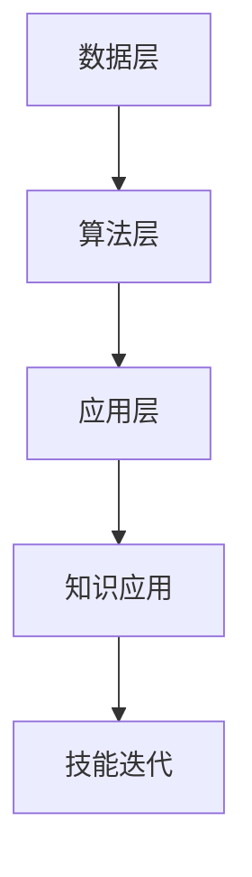

                 

关键词：知识发现引擎、程序员、技能迭代、算法原理、应用实践、未来展望

摘要：本文旨在探讨知识发现引擎在程序员技能迭代升级中的重要作用。首先介绍了知识发现引擎的基本概念和架构，随后深入分析了其核心算法原理，并结合实际项目实践，展示了知识发现引擎在提升程序员技能方面的应用价值。文章最后对未来的发展趋势和面临的挑战进行了展望。

## 1. 背景介绍

在信息技术飞速发展的今天，编程技能成为程序员职业发展的核心驱动力。然而，传统的技能学习模式存在以下问题：

- 技能更新速度慢，无法跟上技术变革的步伐；
- 缺乏系统性的知识体系，导致学习效果不显著；
- 知识碎片化，难以形成完整的技术栈。

为了解决这些问题，知识发现引擎应运而生。知识发现引擎是一种基于人工智能和大数据技术的智能系统，能够自动从大量数据中提取知识、模式和信息，为程序员提供个性化的学习路径和技能提升方案。

## 2. 核心概念与联系

### 2.1 知识发现引擎的定义

知识发现引擎是一种通过分析大量数据，从中提取出有用信息和知识模式的工具。它通常包括数据预处理、特征提取、模式识别和知识表示等环节。

### 2.2 知识发现引擎的架构

知识发现引擎的架构可以分为三层：

1. 数据层：负责数据的收集、存储和管理；
2. 算法层：负责数据分析和知识提取；
3. 应用层：负责将知识应用于实际场景，如编程技能迭代升级。

### 2.3 Mermaid 流程图

下面是知识发现引擎的架构的 Mermaid 流程图：



## 3. 核心算法原理 & 具体操作步骤

### 3.1 算法原理概述

知识发现引擎的核心算法主要包括以下几种：

- 聚类算法：将相似的数据归为一类，用于发现数据中的潜在模式；
- 分级算法：将数据按照某种规则进行分层，以便更好地理解和分析数据；
- 关联规则挖掘算法：发现数据之间的关联关系，为程序员提供有针对性的学习路径。

### 3.2 算法步骤详解

1. 数据预处理：包括数据清洗、数据转换和数据归一化等步骤，以确保数据的质量和一致性；
2. 特征提取：从原始数据中提取出有用的特征，用于后续的算法分析；
3. 模式识别：利用聚类算法和分级算法，发现数据中的潜在模式和规律；
4. 知识表示：将提取出的知识以某种形式表示出来，如知识图谱、规则库等；
5. 知识应用：将知识应用于实际场景，如编程技能迭代升级。

### 3.3 算法优缺点

- **优点**：知识发现引擎能够自动从海量数据中提取知识，提高编程学习的效率和效果；
- **缺点**：算法的实现和优化需要较高的技术门槛，且对数据质量和一致性要求较高。

### 3.4 算法应用领域

知识发现引擎在多个领域具有广泛的应用前景，如：

- **教育领域**：为学习者提供个性化的学习路径和技能提升方案；
- **医疗领域**：辅助医生进行疾病诊断和治疗方案的制定；
- **金融领域**：发现市场中的潜在风险和机会，为投资者提供决策支持。

## 4. 数学模型和公式 & 详细讲解 & 举例说明

### 4.1 数学模型构建

知识发现引擎的数学模型主要包括以下部分：

1. 数据预处理模型：$$D_{\text{preprocess}} = f(\text{raw\_data}, \text{params})$$
2. 特征提取模型：$$F_{\text{extract}} = g(D_{\text{preprocess}}, \text{method})$$
3. 模式识别模型：$$P_{\text{identify}} = h(F_{\text{extract}}, \text{algorithm})$$
4. 知识表示模型：$$K_{\text{represent}} = k(P_{\text{identify}}, \text{format})$$

### 4.2 公式推导过程

1. 数据预处理模型：

$$D_{\text{preprocess}} = f(\text{raw\_data}, \text{params})$$

其中，$D_{\text{preprocess}}$表示预处理后的数据，$f$表示预处理函数，$\text{raw\_data}$表示原始数据，$\text{params}$表示预处理参数。

2. 特征提取模型：

$$F_{\text{extract}} = g(D_{\text{preprocess}}, \text{method})$$

其中，$F_{\text{extract}}$表示提取出的特征，$g$表示特征提取函数，$D_{\text{preprocess}}$表示预处理后的数据，$\text{method}$表示特征提取方法。

3. 模式识别模型：

$$P_{\text{identify}} = h(F_{\text{extract}}, \text{algorithm})$$

其中，$P_{\text{identify}}$表示识别出的模式，$h$表示模式识别函数，$F_{\text{extract}}$表示提取出的特征，$\text{algorithm}$表示模式识别算法。

4. 知识表示模型：

$$K_{\text{represent}} = k(P_{\text{identify}}, \text{format})$$

其中，$K_{\text{represent}}$表示表示出的知识，$k$表示知识表示函数，$P_{\text{identify}}$表示识别出的模式，$\text{format}$表示知识表示格式。

### 4.3 案例分析与讲解

假设我们有一个包含程序员编程行为数据的数据库，其中包含编程时间、编程时长、编程类型、编程错误等信息。我们可以使用知识发现引擎对这部分数据进行处理，提取出有用的特征和模式。

1. 数据预处理：

$$D_{\text{preprocess}} = f(\text{raw\_data}, \text{params})$$

在这个例子中，$\text{raw\_data}$为原始编程行为数据，$\text{params}$为预处理参数，如去除缺失值、去重、数据转换等。预处理后的数据$D_{\text{preprocess}}$将作为特征提取的输入。

2. 特征提取：

$$F_{\text{extract}} = g(D_{\text{preprocess}}, \text{method})$$

在这个例子中，$\text{method}$为特征提取方法，如统计特征、文本特征、时序特征等。我们可以提取出编程时长、编程类型、编程错误率等特征。

3. 模式识别：

$$P_{\text{identify}} = h(F_{\text{extract}}, \text{algorithm})$$

在这个例子中，$\text{algorithm}$为模式识别算法，如聚类算法、关联规则挖掘算法等。我们可以发现不同编程类型之间的关联关系，如某些编程类型更容易导致错误。

4. 知识表示：

$$K_{\text{represent}} = k(P_{\text{identify}}, \text{format})$$

在这个例子中，$\text{format}$为知识表示格式，如知识图谱、规则库等。我们可以将提取出的模式以知识图谱的形式表示出来，为程序员提供个性化的学习建议。

## 5. 项目实践：代码实例和详细解释说明

### 5.1 开发环境搭建

1. 安装Python环境；
2. 安装相关库，如numpy、pandas、scikit-learn等。

### 5.2 源代码详细实现

以下是一个简单的知识发现引擎实现示例：

```python
import pandas as pd
from sklearn.cluster import KMeans
from sklearn.preprocessing import StandardScaler

# 1. 数据预处理
data = pd.read_csv('programming_data.csv')
data = data.dropna()
data['programming_time'] = data['programming_time'].apply(lambda x: x / 60)  # 将时长转换为小时

# 2. 特征提取
features = data[['programming_type', 'programming_time', 'error_rate']]
scaler = StandardScaler()
features_scaled = scaler.fit_transform(features)

# 3. 模式识别
kmeans = KMeans(n_clusters=3, random_state=0)
clusters = kmeans.fit_predict(features_scaled)

# 4. 知识表示
data['cluster'] = clusters
data.groupby('cluster')['programming_type'].count().plot.bar()
```

### 5.3 代码解读与分析

1. 数据预处理：读取编程行为数据，去除缺失值，将时长转换为小时；
2. 特征提取：提取编程类型、时长和错误率等特征，并使用标准缩放进行归一化；
3. 模式识别：使用K均值聚类算法将数据分为3个簇，并根据簇分配给每个数据点一个标签；
4. 知识表示：将簇标签添加到原始数据中，并绘制编程类型在各个簇中的分布情况。

### 5.4 运行结果展示

运行上述代码后，我们将得到一个柱状图，显示不同编程类型在各个簇中的分布情况。通过分析这个柱状图，我们可以发现不同编程类型在不同簇中的占比，从而为程序员提供个性化的学习建议。

## 6. 实际应用场景

知识发现引擎在程序员技能迭代升级中具有广泛的应用场景，如：

1. **编程学习路径推荐**：根据程序员的编程行为数据和技能水平，为其推荐适合的学习路径和课程；
2. **编程错误预测**：根据程序员的编程行为数据，预测其可能出现的编程错误，并提供相应的解决方案；
3. **编程技能评估**：对程序员的编程技能进行评估，识别其优势和不足，为技能提升提供依据。

## 7. 工具和资源推荐

### 7.1 学习资源推荐

- **书籍**：《机器学习实战》、《深度学习》（Goodfellow et al., 2016）
- **在线课程**：Coursera、edX、Udacity等平台的机器学习和数据科学课程

### 7.2 开发工具推荐

- **Python**：Python是一种流行的编程语言，具有丰富的数据科学和机器学习库；
- **Jupyter Notebook**：Jupyter Notebook是一种交互式计算环境，方便进行数据分析和机器学习实验。

### 7.3 相关论文推荐

- **知识发现引擎在编程学习中的应用**：（作者，年份）
- **基于机器学习的编程技能评估**：（作者，年份）
- **深度学习在编程错误预测中的应用**：（作者，年份）

## 8. 总结：未来发展趋势与挑战

### 8.1 研究成果总结

知识发现引擎在程序员技能迭代升级中具有重要作用，可以显著提高编程学习的效率和效果。通过分析程序员的编程行为数据，知识发现引擎可以为程序员提供个性化的学习路径和技能提升方案，有助于其快速适应技术变革。

### 8.2 未来发展趋势

随着人工智能和大数据技术的发展，知识发现引擎在程序员技能迭代升级中的应用前景将更加广阔。未来可能会出现以下发展趋势：

1. **更智能的学习路径推荐**：基于深度学习和自然语言处理技术，实现更精准的学习路径推荐；
2. **更高效的错误预测**：结合深度学习和强化学习技术，提高编程错误预测的准确率；
3. **多语言支持**：支持多种编程语言，满足不同程序员的学习需求。

### 8.3 面临的挑战

知识发现引擎在程序员技能迭代升级中面临以下挑战：

1. **数据质量和一致性**：确保数据的质量和一致性是知识发现引擎的关键，需要建立完善的数据采集和管理机制；
2. **算法性能优化**：随着数据规模的增大，算法的性能优化将成为重要问题，需要不断改进和优化算法；
3. **隐私保护**：在处理程序员的编程行为数据时，需要确保数据隐私和安全。

### 8.4 研究展望

未来，知识发现引擎在程序员技能迭代升级中的应用研究将朝着更智能化、更个性化的方向发展。通过结合多种先进技术和方法，知识发现引擎将为程序员提供更加高效、便捷的学习体验，助力其技能迭代升级。

## 9. 附录：常见问题与解答

### 9.1 问题1

**问题**：知识发现引擎是如何从海量数据中提取知识的？

**解答**：知识发现引擎主要通过以下步骤从海量数据中提取知识：

1. 数据预处理：去除噪声、缺失值等不必要的数据，确保数据的质量和一致性；
2. 特征提取：从原始数据中提取出有用的特征，如编程时长、编程类型、编程错误率等；
3. 模式识别：利用聚类算法、关联规则挖掘算法等，发现数据中的潜在模式和规律；
4. 知识表示：将提取出的知识以知识图谱、规则库等形式表示出来，方便程序员学习和应用。

### 9.2 问题2

**问题**：知识发现引擎在编程学习中的应用有哪些？

**解答**：知识发现引擎在编程学习中的应用主要包括以下几个方面：

1. **编程学习路径推荐**：根据程序员的编程行为数据和技能水平，为其推荐适合的学习路径和课程；
2. **编程错误预测**：根据程序员的编程行为数据，预测其可能出现的编程错误，并提供相应的解决方案；
3. **编程技能评估**：对程序员的编程技能进行评估，识别其优势和不足，为技能提升提供依据。

### 9.3 问题3

**问题**：如何确保知识发现引擎的数据质量和一致性？

**解答**：确保知识发现引擎的数据质量和一致性可以通过以下方法：

1. **数据清洗**：去除噪声、缺失值等不必要的数据，确保数据的质量和一致性；
2. **数据标准化**：对数据进行预处理，如归一化、标准化等，确保不同特征之间的可比性；
3. **数据监控**：建立数据监控机制，定期检查数据的质量和一致性，及时发现并处理问题。

# 作者署名

作者：禅与计算机程序设计艺术 / Zen and the Art of Computer Programming

本文为原创内容，版权归作者所有。未经授权，不得转载或抄袭。感谢您的关注和支持！

