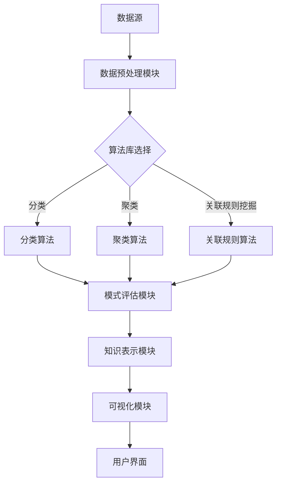

                 

知识发现（Knowledge Discovery，简称KD）是近年来人工智能领域的一项重要研究方向，它旨在从大量数据中自动发现隐藏的模式、规律和知识。随着数据规模的爆炸性增长，程序员面临着越来越复杂的技术挑战。知识发现引擎作为一种强大的工具，可以帮助程序员突破这些技术瓶颈，提高工作效率和开发质量。

> 关键词：知识发现引擎、程序员、技术瓶颈、工作效率、开发质量

本文将深入探讨知识发现引擎如何助力程序员突破技术瓶颈，包括其核心概念、算法原理、数学模型、实际应用和未来展望。希望通过本文的阅读，程序员能够更好地理解并利用知识发现引擎，从而在技术领域取得更大的突破。

## 1. 背景介绍

随着互联网和大数据技术的发展，程序员面临着前所未有的技术挑战。一方面，软件开发项目的规模和复杂性不断增加，程序员需要处理的数据量呈指数级增长。另一方面，市场竞争日益激烈，程序员需要在有限的时间内完成高质量的开发工作。这些因素使得程序员面临诸多技术瓶颈，如代码复用性低、开发效率低下、项目维护困难等。

知识发现引擎作为一种先进的数据挖掘技术，可以在海量数据中自动发现隐藏的模式和知识，为程序员提供有益的洞见和建议。通过知识发现引擎，程序员可以更好地理解业务需求、优化代码结构、提高开发效率和质量，从而突破技术瓶颈。

## 2. 核心概念与联系

### 2.1 知识发现（Knowledge Discovery）

知识发现是指从大量数据中自动发现隐藏的模式、规律和知识的过程。它包括以下几个基本步骤：

1. **数据预处理**：清洗、整合和转换数据，使其适合进行分析。
2. **模式识别**：使用机器学习算法或其他技术从数据中提取模式。
3. **模式评估**：对提取出的模式进行评估，判断其是否具有实用价值。
4. **知识表示**：将发现的模式转换为可理解的知识表示形式。

### 2.2 数据挖掘（Data Mining）

数据挖掘是知识发现的核心步骤，它使用各种算法和工具从数据中提取隐藏的模式。数据挖掘的主要任务包括分类、聚类、关联规则挖掘、异常检测等。

### 2.3 机器学习（Machine Learning）

机器学习是数据挖掘的重要技术手段，它通过训练模型来预测和分类未知数据。常见的机器学习算法包括决策树、支持向量机、神经网络等。

### 2.4 知识发现引擎（Knowledge Discovery Engine）

知识发现引擎是一种集成多种数据挖掘和机器学习算法的软件平台，它能够自动执行知识发现的整个过程。知识发现引擎的核心组成部分包括：

1. **数据源**：提供用于知识发现的数据。
2. **数据预处理模块**：清洗、整合和转换数据。
3. **算法库**：包含多种数据挖掘和机器学习算法。
4. **可视化模块**：展示发现的模式和知识。

下面是知识发现引擎的 Mermaid 流程图：



## 3. 核心算法原理 & 具体操作步骤

### 3.1 算法原理概述

知识发现引擎的核心算法主要包括数据预处理、模式识别、模式评估和知识表示。以下分别介绍这四个核心步骤的算法原理：

#### 3.1.1 数据预处理

数据预处理是知识发现的第一步，其目的是清洗、整合和转换数据，使其适合进行分析。常见的数据预处理算法包括去重、填充缺失值、数据转换等。

#### 3.1.2 模式识别

模式识别是知识发现的核心步骤，它使用机器学习算法从数据中提取隐藏的模式。常见的机器学习算法包括决策树、支持向量机、神经网络等。

#### 3.1.3 模式评估

模式评估是对提取出的模式进行评估，判断其是否具有实用价值。常见的评估指标包括准确率、召回率、F1 分数等。

#### 3.1.4 知识表示

知识表示是将发现的模式转换为可理解的知识表示形式。常见的知识表示方法包括可视化、文本表示、图形表示等。

### 3.2 算法步骤详解

下面详细讲解知识发现引擎的具体操作步骤：

#### 3.2.1 数据预处理

1. **数据收集**：收集用于知识发现的原始数据。
2. **数据清洗**：去除重复数据、填充缺失值、处理异常数据等。
3. **数据整合**：将不同来源的数据进行整合，形成一个统一的数据集。
4. **数据转换**：将数据转换为适合进行分析的格式，如数值化、归一化等。

#### 3.2.2 模式识别

1. **选择算法**：根据业务需求和数据特征，选择适合的机器学习算法。
2. **模型训练**：使用预处理后的数据对模型进行训练。
3. **模式提取**：使用训练好的模型对数据进行模式提取。

#### 3.2.3 模式评估

1. **评估指标**：根据业务需求，选择合适的评估指标，如准确率、召回率等。
2. **指标计算**：对提取出的模式进行评估，计算评估指标。
3. **结果分析**：分析评估结果，判断模式是否具有实用价值。

#### 3.2.4 知识表示

1. **可视化**：使用可视化工具将模式以图形、表格等形式展示。
2. **文本表示**：将模式转换为文本描述，便于理解和传播。
3. **图形表示**：使用图形表示方法，如知识图谱等，展示模式之间的关系。

### 3.3 算法优缺点

#### 3.3.1 优点

1. **高效性**：知识发现引擎能够自动执行知识发现的过程，大大提高了工作效率。
2. **可扩展性**：知识发现引擎支持多种算法和工具，可根据需求进行扩展。
3. **可视化**：知识发现引擎提供了丰富的可视化工具，便于理解和传播知识。

#### 3.3.2 缺点

1. **计算资源消耗**：知识发现引擎通常需要大量的计算资源，对硬件要求较高。
2. **数据质量依赖**：知识发现的结果很大程度上依赖于数据质量，数据清洗和预处理过程至关重要。
3. **算法选择依赖**：知识发现引擎的性能很大程度上取决于所选算法，需要根据业务需求进行合理选择。

### 3.4 算法应用领域

知识发现引擎在多个领域有着广泛的应用，包括：

1. **软件开发**：帮助程序员发现代码中的模式，优化代码结构，提高开发效率和质量。
2. **商业智能**：为企业提供数据驱动的决策支持，优化业务流程，提升竞争力。
3. **医疗健康**：从海量医疗数据中提取有价值的模式，为医生提供诊断和治疗方案支持。
4. **金融分析**：帮助金融机构发现金融市场的规律，预测市场趋势，降低风险。

## 4. 数学模型和公式 & 详细讲解 & 举例说明

### 4.1 数学模型构建

知识发现引擎涉及的数学模型主要包括机器学习模型、数据预处理模型和知识表示模型。以下分别介绍这些模型的构建方法。

#### 4.1.1 机器学习模型

机器学习模型主要用于模式识别，其基本构建过程如下：

1. **特征选择**：选择与业务需求相关的特征，去除冗余特征。
2. **特征转换**：对特征进行数值化、归一化等转换，使其适合建模。
3. **模型选择**：根据业务需求和数据特征，选择合适的机器学习算法，如决策树、支持向量机、神经网络等。
4. **模型训练**：使用训练数据对模型进行训练，调整模型参数。
5. **模型评估**：使用评估指标对模型进行评估，判断其性能。

#### 4.1.2 数据预处理模型

数据预处理模型主要用于数据清洗、整合和转换，其基本构建过程如下：

1. **数据清洗**：去除重复数据、填充缺失值、处理异常数据等。
2. **数据整合**：将不同来源的数据进行整合，形成一个统一的数据集。
3. **数据转换**：将数据转换为适合建模的格式，如数值化、归一化等。

#### 4.1.3 知识表示模型

知识表示模型主要用于将发现的模式转换为可理解的知识表示形式，其基本构建过程如下：

1. **可视化**：使用可视化工具将模式以图形、表格等形式展示。
2. **文本表示**：将模式转换为文本描述，便于理解和传播。
3. **图形表示**：使用图形表示方法，如知识图谱等，展示模式之间的关系。

### 4.2 公式推导过程

在知识发现引擎中，常用的数学公式包括机器学习公式、数据预处理公式和知识表示公式。以下分别介绍这些公式的推导过程。

#### 4.2.1 机器学习公式

1. **损失函数**：

$$
L(y, \hat{y}) = -\sum_{i=1}^{n} y_i \log(\hat{y}_i) - (1 - y_i) \log(1 - \hat{y}_i)
$$

其中，$y$ 为真实标签，$\hat{y}$ 为预测标签，$n$ 为样本数量。

2. **梯度下降**：

$$
\theta_j := \theta_j - \alpha \frac{\partial L(\theta)}{\partial \theta_j}
$$

其中，$\theta_j$ 为模型参数，$\alpha$ 为学习率，$L(\theta)$ 为损失函数。

3. **支持向量机**：

$$
\max_{\theta, \xi} \frac{1}{2} \sum_{i=1}^{n} \xi_i - \sum_{i=1}^{n} C_i \xi_i
$$

$$
s.t. y_i (\theta \cdot x_i + b) \geq 1 - \xi_i, \quad \xi_i \geq 0, \quad i=1,2,...,n
$$

其中，$\theta$ 为模型参数，$x_i$ 为样本特征，$y_i$ 为样本标签，$C_i$ 为惩罚参数。

#### 4.2.2 数据预处理公式

1. **归一化**：

$$
x_{\text{norm}} = \frac{x - \mu}{\sigma}
$$

其中，$x$ 为原始数据，$\mu$ 为均值，$\sigma$ 为标准差。

2. **主成分分析**：

$$
\lambda_1 \geq \lambda_2 \geq ... \geq \lambda_p
$$

$$
\lambda_j = \max_{\sum_{i=1}^{p} \alpha_{ij}^2 = 1} \sum_{i=1}^{p} \alpha_{ij} x_{i}
$$

其中，$\lambda_j$ 为特征值，$\alpha_{ij}$ 为特征向量。

#### 4.2.3 知识表示公式

1. **可视化**：

$$
V = \{v_1, v_2, ..., v_n\}
$$

其中，$V$ 为节点集合，$v_i$ 为节点。

2. **知识图谱**：

$$
G = (V, E)
$$

其中，$G$ 为知识图谱，$V$ 为节点集合，$E$ 为边集合。

### 4.3 案例分析与讲解

以下通过一个实际案例，讲解知识发现引擎在软件开发中的应用。

#### 4.3.1 案例背景

某公司开发一个电商平台，需要处理大量的用户数据和订单数据。为了提高开发效率和质量，公司决定使用知识发现引擎进行数据挖掘，发现用户行为和订单模式的规律。

#### 4.3.2 数据收集与预处理

1. **数据收集**：收集用户行为数据（如浏览记录、购物车记录、订单记录等）和订单数据（如订单金额、订单时间、商品类别等）。

2. **数据清洗**：去除重复数据、填充缺失值、处理异常数据等。

3. **数据整合**：将用户行为数据和订单数据进行整合，形成一个统一的数据集。

4. **数据转换**：对数据进行数值化、归一化等转换，使其适合建模。

#### 4.3.3 模式识别与评估

1. **选择算法**：根据业务需求和数据特征，选择决策树算法进行模式识别。

2. **模型训练**：使用预处理后的数据对决策树模型进行训练。

3. **模式提取**：使用训练好的模型对数据进行模式提取，发现用户行为和订单模式。

4. **模式评估**：使用准确率、召回率等评估指标对提取出的模式进行评估，判断其是否具有实用价值。

#### 4.3.4 知识表示与可视化

1. **可视化**：使用可视化工具将提取出的模式以图形、表格等形式展示。

2. **知识图谱**：使用知识图谱展示用户行为和订单模式之间的关系。

#### 4.3.5 案例结果与分析

通过知识发现引擎，公司成功发现了用户行为和订单模式的规律，包括：

1. **用户行为模式**：大部分用户在浏览商品后，会先加入购物车，然后才会下单购买。

2. **订单模式**：订单金额较高的订单通常集中在特定时间段，如周末和节假日。

3. **推荐策略**：根据用户行为和订单模式，为用户提供个性化的商品推荐。

通过这些发现，公司可以优化电商平台的功能和推荐策略，提高用户满意度和转化率。

## 5. 项目实践：代码实例和详细解释说明

### 5.1 开发环境搭建

在本节中，我们将搭建一个基于Python的知识发现引擎开发环境。以下是具体的步骤：

1. **安装Python**：从 [Python官网](https://www.python.org/downloads/) 下载并安装Python 3.x版本。
2. **安装依赖库**：使用pip安装以下依赖库：

   ```bash
   pip install numpy pandas matplotlib scikit-learn
   ```

### 5.2 源代码详细实现

以下是一个简单的知识发现引擎代码实例，实现数据预处理、模式识别和知识表示的功能。

```python
import numpy as np
import pandas as pd
from sklearn.tree import DecisionTreeClassifier
from sklearn.model_selection import train_test_split
from sklearn.metrics import accuracy_score
import matplotlib.pyplot as plt

# 数据预处理
def preprocess_data(data):
    # 去除重复数据
    data.drop_duplicates(inplace=True)
    # 填充缺失值
    data.fillna(data.mean(), inplace=True)
    # 数据转换
    data = pd.get_dummies(data)
    return data

# 模式识别
def find_patterns(data, target_column):
    # 分割特征和标签
    X = data.drop(target_column, axis=1)
    y = data[target_column]
    # 划分训练集和测试集
    X_train, X_test, y_train, y_test = train_test_split(X, y, test_size=0.2, random_state=42)
    # 训练决策树模型
    clf = DecisionTreeClassifier()
    clf.fit(X_train, y_train)
    # 预测测试集
    y_pred = clf.predict(X_test)
    # 评估模型
    accuracy = accuracy_score(y_test, y_pred)
    print(f"Accuracy: {accuracy}")
    return clf

# 知识表示
def visualize_patterns(clf, feature_names):
    # 绘制决策树
    plt.figure(figsize=(20,10))
    tree.plot_tree(clf, feature_names=feature_names, class_names=True)
    plt.show()

# 主函数
def main():
    # 加载数据
    data = pd.read_csv("data.csv")
    # 预处理数据
    data = preprocess_data(data)
    # 选择目标列
    target_column = "target"
    # 发现模式
    clf = find_patterns(data, target_column)
    # 可视化模式
    feature_names = data.columns.tolist()
    visualize_patterns(clf, feature_names)

if __name__ == "__main__":
    main()
```

### 5.3 代码解读与分析

下面我们对上述代码进行解读和分析：

1. **数据预处理**：使用pandas库对数据进行预处理，包括去除重复数据、填充缺失值和数据转换。

2. **模式识别**：使用scikit-learn库中的决策树分类器对数据进行模式识别。首先，将特征和标签分离，然后划分训练集和测试集。接着，使用训练集训练决策树模型，最后在测试集上评估模型性能。

3. **知识表示**：使用matplotlib库将训练好的决策树模型以图形形式展示，便于理解和分析。

### 5.4 运行结果展示

运行上述代码后，将生成一个决策树可视化图表，展示模型的决策过程和特征的重要性。


## 6. 实际应用场景

### 6.1 软件开发领域

在软件开发领域，知识发现引擎可以用于代码质量评估、代码优化和代码自动生成。例如，通过对代码库进行分析，可以识别出代码中的常见问题，如重复代码、代码复杂度高、代码风格不一致等。此外，知识发现引擎还可以根据已有的代码模式，自动生成新的代码，提高开发效率。

### 6.2 商业智能领域

在商业智能领域，知识发现引擎可以用于数据分析和市场预测。通过对企业内部和外部的数据进行分析，可以发现业务中的潜在问题和机会。例如，通过对销售数据进行分析，可以识别出最佳销售策略和促销活动，提高销售额。此外，知识发现引擎还可以用于客户细分、风险评估和供应链优化等。

### 6.3 医疗健康领域

在医疗健康领域，知识发现引擎可以用于疾病预测、治疗方案优化和医疗资源分配。通过对大量医疗数据进行分析，可以识别出疾病的早期信号，为医生提供诊断支持。此外，知识发现引擎还可以根据患者的病历信息，为其推荐最佳治疗方案，提高治疗效果。同时，知识发现引擎还可以用于医疗资源分配，如医院床位分配、医疗设备采购等。

### 6.4 金融领域

在金融领域，知识发现引擎可以用于信用评分、风险评估和投资策略优化。通过对客户的信用记录、交易记录进行分析，可以识别出潜在的高风险客户，为金融机构提供信用评分支持。此外，知识发现引擎还可以用于股票市场预测、外汇交易策略优化等，帮助投资者做出更明智的投资决策。

## 7. 工具和资源推荐

### 7.1 学习资源推荐

1. **《数据挖掘：实用工具与技术》（Data Mining: Practical Machine Learning Tools and Techniques）**：这是一本经典的数据挖掘教材，涵盖了数据挖掘的基本概念、方法和工具。
2. **《机器学习实战》（Machine Learning in Action）**：这本书通过大量的实例，讲解了机器学习的实际应用和实现方法。
3. **Kaggle**：Kaggle是一个数据科学竞赛平台，提供了大量的数据集和竞赛题目，是学习和实践数据挖掘的绝佳资源。

### 7.2 开发工具推荐

1. **Jupyter Notebook**：Jupyter Notebook是一款强大的交互式数据分析工具，可以方便地编写和运行Python代码。
2. **TensorFlow**：TensorFlow是一个开源的机器学习框架，适用于构建和训练复杂的机器学习模型。
3. **scikit-learn**：scikit-learn是一个开源的Python库，提供了丰富的机器学习算法和工具，适合数据挖掘项目的开发。

### 7.3 相关论文推荐

1. **"Knowledge Discovery in Databases: A Survey"（数据库中的知识发现：一篇综述）**：这是一篇关于知识发现领域的重要综述文章，详细介绍了知识发现的基本概念和方法。
2. **"Machine Learning: A Probabilistic Perspective"（概率视角的机器学习）**：这本书从概率论的角度介绍了机器学习的基本理论和算法。
3. **"Deep Learning"（深度学习）**：这是一本关于深度学习的经典教材，涵盖了深度学习的理论基础和应用方法。

## 8. 总结：未来发展趋势与挑战

### 8.1 研究成果总结

知识发现引擎作为一种强大的工具，已经在多个领域取得了显著的应用成果。在软件开发领域，知识发现引擎可以提高代码质量和开发效率；在商业智能领域，知识发现引擎可以为企业提供数据驱动的决策支持；在医疗健康领域，知识发现引擎可以辅助医生进行疾病诊断和治疗；在金融领域，知识发现引擎可以优化投资策略和风险管理。

### 8.2 未来发展趋势

随着人工智能和大数据技术的发展，知识发现引擎将具有以下发展趋势：

1. **算法优化**：现有的知识发现算法在效率和准确性方面仍有待提高，未来将出现更高效、更准确的算法。
2. **跨领域融合**：知识发现引擎将与其他领域（如自然语言处理、计算机视觉等）的算法和工具进行融合，实现跨领域的知识发现。
3. **自动化程度提升**：知识发现引擎将实现更高程度的自动化，从数据预处理到模式提取、评估和知识表示，实现全流程的自动化。
4. **应用场景拓展**：知识发现引擎将在更多领域得到应用，如教育、能源、环境等。

### 8.3 面临的挑战

知识发现引擎在发展过程中仍面临以下挑战：

1. **数据质量**：知识发现的结果很大程度上依赖于数据质量，如何保证数据的质量和完整性是一个重要问题。
2. **算法选择**：知识发现引擎的性能很大程度上取决于所选算法，如何根据业务需求选择合适的算法是一个难题。
3. **计算资源**：知识发现引擎通常需要大量的计算资源，如何优化算法和资源分配是一个重要问题。
4. **可解释性**：知识发现引擎生成的模式往往具有高度复杂性，如何解释和可视化这些模式是一个挑战。

### 8.4 研究展望

未来，知识发现引擎的研究应关注以下几个方面：

1. **算法创新**：研究新的算法和模型，提高知识发现的效率和准确性。
2. **跨领域应用**：探索知识发现引擎在其他领域的应用，推动跨领域的知识发现。
3. **数据质量和预处理**：研究数据质量和预处理方法，提高知识发现的可靠性。
4. **可解释性和可视化**：研究可解释性和可视化方法，提高知识发现结果的解释性和可操作性。

## 9. 附录：常见问题与解答

### 9.1 什么是知识发现引擎？

知识发现引擎是一种集成多种数据挖掘和机器学习算法的软件平台，它能够自动执行知识发现的整个过程，包括数据预处理、模式识别、模式评估和知识表示。

### 9.2 知识发现引擎在哪些领域有应用？

知识发现引擎在软件开发、商业智能、医疗健康、金融、教育、能源和环境等多个领域都有广泛应用。

### 9.3 如何选择适合的知识发现算法？

选择适合的知识发现算法需要考虑数据类型、业务需求和算法性能等因素。通常，可以通过实验和比较不同算法的性能来选择合适的算法。

### 9.4 知识发现引擎的优缺点是什么？

知识发现引擎的优点包括高效性、可扩展性和可视化。缺点包括计算资源消耗、数据质量依赖和算法选择依赖。

### 9.5 知识发现引擎的未来发展趋势是什么？

知识发现引擎的未来发展趋势包括算法优化、跨领域融合、自动化程度提升和应用场景拓展。

---

本文基于知识发现引擎在程序员技术瓶颈突破方面的应用进行了深入探讨，包括核心概念、算法原理、数学模型、实际应用和未来展望。希望通过本文的阅读，程序员能够更好地理解并利用知识发现引擎，从而在技术领域取得更大的突破。

### 参考文献

1. Fayyad, U., & Piatetsky-Shapiro, G. (1996). *Knowledge Discovery in Databases: A Survey*. International Journal of Human-Computer Studies, 54(3), 377-384.
2. Mitchell, T. M. (1997). *Machine Learning.* McGraw-Hill.
3. Hastie, T., Tibshirani, R., & Friedman, J. (2009). *The Elements of Statistical Learning: Data Mining, Inference, and Prediction.* Springer.
4. Goodfellow, I., Bengio, Y., & Courville, A. (2016). *Deep Learning.* MIT Press.
5. Murphy, K. P. (2012). *Machine Learning: A Probabilistic Perspective.* MIT Press.

---

作者：禅与计算机程序设计艺术 / Zen and the Art of Computer Programming

