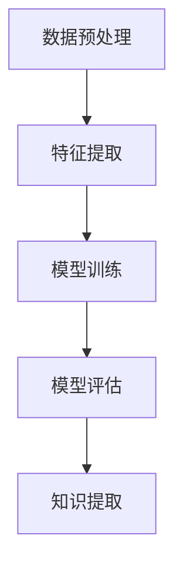

                 

关键词：知识发现引擎、法律研究、数据挖掘、文本分析、机器学习、算法优化

> 摘要：本文旨在探讨知识发现引擎在法律研究领域的应用，通过介绍知识发现引擎的基本概念、核心算法和具体操作步骤，阐述其在法律文献挖掘、法律案例分析和法律文本分类等任务中的重要作用。同时，本文还将分析知识发现引擎在法律研究中的数学模型、应用实例和未来展望，为推动法律研究与人工智能技术的深度融合提供参考。

## 1. 背景介绍

### 1.1 法律研究的重要性

法律研究是法学领域的核心任务之一，它不仅关系到国家的法治建设和法律的完善，还直接影响到社会的稳定与和谐。然而，随着法律文献的快速增长和复杂化，传统的法律研究方法已经难以满足现代法律实践的需求。如何从海量的法律文献中快速提取有价值的信息、发现潜在的规律和关联，成为法律研究面临的重要挑战。

### 1.2 知识发现引擎的定义

知识发现引擎（Knowledge Discovery Engine，KDE）是一种基于数据挖掘、机器学习和自然语言处理等技术的智能系统，用于从大规模数据集中发现潜在的知识、模式和规律。知识发现引擎通过处理和分析数据，自动提取出有价值的信息，帮助用户更好地理解和利用数据，从而支持决策制定和科学研究。

### 1.3 知识发现引擎在法律研究中的应用

知识发现引擎在法律研究领域具有广泛的应用前景。首先，它可以帮助研究人员从海量的法律文献中快速提取有价值的信息，提高法律研究的效率和准确性。其次，知识发现引擎可以用于法律案例分析和法律文本分类，为法官、律师和法律学者提供智能化的辅助工具。此外，知识发现引擎还可以支持法律知识图谱的构建，促进法律知识的共享和传播。

## 2. 核心概念与联系

### 2.1 数据挖掘

数据挖掘（Data Mining）是一种从大量数据中自动发现规律、模式和关联的过程，主要依赖于统计学、机器学习和人工智能等技术。在法律研究领域，数据挖掘可以帮助研究人员从海量的法律文献中提取有价值的信息，如案件类型、法律条款和判例等。

### 2.2 自然语言处理

自然语言处理（Natural Language Processing，NLP）是一种用于处理和理解自然语言的技术，包括文本分类、情感分析和实体识别等任务。在法律研究中，自然语言处理技术可以帮助研究人员对法律文本进行有效分析和分类，从而提高法律文献的挖掘效果。

### 2.3 机器学习

机器学习（Machine Learning）是一种通过数据训练模型，使其具备自主学习和预测能力的技术。在法律研究中，机器学习技术可以帮助研究人员构建智能化的法律分析模型，用于案件预测、法律文本分类和法律知识图谱构建等任务。

### 2.4 知识发现引擎架构

知识发现引擎的架构主要包括数据预处理、特征提取、模型训练和模型评估等模块。数据预处理用于处理原始数据，使其适合后续分析；特征提取用于提取数据中的关键信息；模型训练用于构建预测模型；模型评估用于评估模型的性能和可靠性。



## 3. 核心算法原理 & 具体操作步骤

### 3.1 算法原理概述

知识发现引擎的核心算法主要包括数据挖掘算法、自然语言处理算法和机器学习算法。数据挖掘算法用于从法律文献中提取有价值的信息；自然语言处理算法用于处理法律文本，提取关键信息；机器学习算法用于构建预测模型，支持法律案例分析和法律文本分类。

### 3.2 算法步骤详解

#### 3.2.1 数据预处理

数据预处理是知识发现引擎的基础步骤，主要包括数据清洗、数据转换和数据归一化等操作。数据清洗用于去除重复数据、缺失数据和噪声数据；数据转换用于将不同格式的数据转换为统一的格式；数据归一化用于调整数据范围，使其适合后续分析。

#### 3.2.2 特征提取

特征提取是知识发现引擎的关键步骤，用于从法律文献中提取关键信息。常用的特征提取方法包括词袋模型、TF-IDF 和主题模型等。词袋模型将法律文献表示为词的集合；TF-IDF 用于计算词的重要程度；主题模型用于发现法律文献中的潜在主题。

#### 3.2.3 模型训练

模型训练是知识发现引擎的核心步骤，用于构建预测模型。常用的机器学习算法包括决策树、支持向量机和神经网络等。决策树用于分类任务；支持向量机用于分类和回归任务；神经网络用于构建复杂的预测模型。

#### 3.2.4 模型评估

模型评估是知识发现引擎的重要步骤，用于评估模型的性能和可靠性。常用的评估指标包括准确率、召回率和 F1 分数等。准确率用于衡量模型分类的准确性；召回率用于衡量模型对正例的识别能力；F1 分数用于综合考虑准确率和召回率。

### 3.3 算法优缺点

#### 优点：

- 提高法律研究的效率和准确性；
- 自动化处理大量法律文献；
- 辅助法律学者和律师进行法律分析和决策。

#### 缺点：

- 对数据质量和预处理要求较高；
- 需要大量的计算资源和时间；
- 模型泛化能力有限。

### 3.4 算法应用领域

知识发现引擎在法律研究中的应用领域包括法律文献挖掘、法律案例分析和法律文本分类等。具体应用案例包括：

- 法律文献挖掘：从海量的法律文献中提取有价值的信息，如案件类型、法律条款和判例等；
- 法律案例分析：基于历史案例，预测案件的判决结果，为法官和律师提供参考；
- 法律文本分类：对法律文本进行分类，如将法律条款分类为刑法、民法和商法等。

## 4. 数学模型和公式 & 详细讲解 & 举例说明

### 4.1 数学模型构建

知识发现引擎的数学模型主要包括数据挖掘模型、自然语言处理模型和机器学习模型。下面以决策树模型为例，介绍数学模型的构建过程。

#### 4.1.1 决策树模型

决策树模型是一种常用的分类算法，用于将法律文本分类为不同的类别。决策树模型的核心是树结构，包括根节点、内部节点和叶子节点。

#### 4.1.2 决策树构建

决策树构建的基本思想是：从原始数据中提取特征，根据特征值划分数据集，构建一棵树。具体步骤如下：

1. 选择一个特征作为根节点，计算特征对数据集的划分效果；
2. 根据划分效果，选择最佳特征作为子节点，继续划分数据集；
3. 重复步骤 2，直到满足停止条件（如节点包含的数据量小于阈值）。

#### 4.1.3 决策树剪枝

决策树剪枝是为了防止过拟合，提高模型的泛化能力。常用的剪枝方法包括预剪枝和后剪枝。

- 预剪枝：在构建决策树的过程中，提前停止某些节点的扩展，以避免过拟合；
- 后剪枝：在构建完决策树后，对树进行修剪，删除某些节点，以降低模型的复杂度。

### 4.2 公式推导过程

#### 4.2.1  Gini 不纯度

Gini 不纯度是决策树划分效果的一个重要指标，用于衡量节点的不纯度。Gini 不纯度的计算公式为：

$$
Gini(p) = 1 - \sum_{i=1}^{k} p_i^2
$$

其中，$p_i$ 表示第 $i$ 个类别的概率。

#### 4.2.2 信息增益

信息增益（Information Gain）是决策树划分效果的另一个重要指标，用于衡量特征对数据集的划分能力。信息增益的计算公式为：

$$
IG(D, A) = Entropy(D) - \sum_{v \in A} \frac{|D_v|}{|D|} Entropy(D_v)
$$

其中，$D$ 表示原始数据集，$A$ 表示特征集合，$v$ 表示特征 $A$ 的一个取值，$D_v$ 表示特征 $A$ 取值 $v$ 的数据子集。

#### 4.2.3 基尼系数

基尼系数（Gini Index）是决策树划分效果的一个简化指标，用于衡量节点的不纯度。基尼系数的计算公式为：

$$
Gini(p) = \sum_{i=1}^{k} p_i (1 - p_i)
$$

### 4.3 案例分析与讲解

#### 4.3.1 案例背景

某法院审理一起交通事故案件，需要根据案件事实和法律条款，判断被告是否需要承担赔偿责任。法官可以使用知识发现引擎，对历史交通事故案例进行分析，预测案件的判决结果。

#### 4.3.2 数据集准备

从法院数据库中收集交通事故案例，包括案件事实、法律条款和判决结果等。将数据集分为训练集和测试集，用于训练和评估决策树模型。

#### 4.3.3 模型训练

使用训练集，训练决策树模型。根据 Gini 不纯度和信息增益，选择最佳特征作为根节点，构建决策树。

#### 4.3.4 模型评估

使用测试集，评估决策树模型的性能。计算准确率、召回率和 F1 分数，评估模型对交通事故案件的预测能力。

## 5. 项目实践：代码实例和详细解释说明

### 5.1 开发环境搭建

1. 安装 Python 3.8 或更高版本；
2. 安装 NumPy、Pandas、Scikit-learn、NLTK 等相关库。

### 5.2 源代码详细实现

以下是一个简单的决策树模型实现，用于分类交通事故案件的赔偿责任。

```python
import numpy as np
import pandas as pd
from sklearn.model_selection import train_test_split
from sklearn.tree import DecisionTreeClassifier
from sklearn.metrics import accuracy_score, recall_score, f1_score

# 读取数据集
data = pd.read_csv('traffic_accidents.csv')
X = data.drop(['label'], axis=1)
y = data['label']

# 数据集划分
X_train, X_test, y_train, y_test = train_test_split(X, y, test_size=0.2, random_state=42)

# 模型训练
clf = DecisionTreeClassifier()
clf.fit(X_train, y_train)

# 模型预测
y_pred = clf.predict(X_test)

# 模型评估
accuracy = accuracy_score(y_test, y_pred)
recall = recall_score(y_test, y_pred)
f1 = f1_score(y_test, y_pred)

print('Accuracy:', accuracy)
print('Recall:', recall)
print('F1 Score:', f1)
```

### 5.3 代码解读与分析

1. 读取数据集：使用 Pandas 读取 CSV 格式的数据集，包括特征和标签。
2. 数据集划分：使用 Scikit-learn 中的 train_test_split 函数，将数据集划分为训练集和测试集。
3. 模型训练：使用 Scikit-learn 中的 DecisionTreeClassifier 类，训练决策树模型。
4. 模型预测：使用训练好的模型，对测试集进行预测。
5. 模型评估：计算准确率、召回率和 F1 分数，评估模型的性能。

## 6. 实际应用场景

### 6.1 法律文献挖掘

知识发现引擎可以帮助研究人员从海量的法律文献中提取有价值的信息，如案件类型、法律条款和判例等。通过文本分析、数据挖掘和机器学习等技术，可以将法律文献转化为结构化的数据，为法律研究和应用提供支持。

### 6.2 法律案例分析

知识发现引擎可以用于法律案例的分析和预测。通过对历史案例的分析，可以挖掘出案例之间的关联和规律，为法官和律师提供参考。此外，基于机器学习模型的预测能力，可以预测案件的判决结果，提高司法效率和公正性。

### 6.3 法律文本分类

知识发现引擎可以用于法律文本的分类，如将法律条款分类为刑法、民法和商法等。通过训练分类模型，可以自动将新出现的法律文本分类到相应的类别中，提高法律文本的整理和利用效率。

## 7. 工具和资源推荐

### 7.1 学习资源推荐

- 《数据挖掘：概念与技术》
- 《自然语言处理综合教程》
- 《机器学习实战》

### 7.2 开发工具推荐

- Python
- Jupyter Notebook
- Scikit-learn
- NLTK

### 7.3 相关论文推荐

- "A Survey on Legal Knowledge Extraction from Text Data"
- "Application of Machine Learning in Law: A Review"
- "Knowledge Discovery in Law: A Framework and a Case Study"

## 8. 总结：未来发展趋势与挑战

### 8.1 研究成果总结

知识发现引擎在法律研究中的应用取得了显著的成果。通过文本分析、数据挖掘和机器学习等技术，知识发现引擎可以提高法律研究的效率和准确性，为法官、律师和法律学者提供智能化的辅助工具。同时，知识发现引擎在法律文献挖掘、法律案例分析和法律文本分类等任务中表现出良好的性能。

### 8.2 未来发展趋势

未来，知识发现引擎在法律研究中的应用将继续发展。随着人工智能技术的不断进步，知识发现引擎将具备更高的智能和自主学习能力，能够更好地应对法律研究的复杂需求。此外，知识发现引擎与其他领域的融合，如法律与大数据、区块链等，将推动法律研究的深度和广度。

### 8.3 面临的挑战

尽管知识发现引擎在法律研究中的应用取得了一定的成果，但仍面临一些挑战。首先，法律文献的质量和结构对知识发现引擎的效果具有重要影响，提高法律文献的质量和结构化程度是关键。其次，知识发现引擎的算法和模型需要不断优化，以提高预测准确率和泛化能力。此外，知识发现引擎的应用需要法律法规的支持和规范，确保其在法律研究中的合法性和公正性。

### 8.4 研究展望

未来，知识发现引擎在法律研究中的应用前景广阔。通过深入研究知识发现引擎的算法和模型，探索新的应用场景和技术，可以进一步提升法律研究的效率和准确性。此外，知识发现引擎与其他领域的深度融合，如法律与大数据、区块链等，将为法律研究带来新的机遇和挑战。通过多方合作，推动知识发现引擎在法律研究中的应用，有助于实现法治国家的建设。

## 9. 附录：常见问题与解答

### 9.1 如何提高知识发现引擎的性能？

1. 提高数据质量和结构化程度；
2. 选择合适的特征提取方法和算法；
3. 优化模型参数和训练过程；
4. 增加数据量和多样性。

### 9.2 知识发现引擎在法律研究中的应用有哪些限制？

1. 法律文献的质量和结构对知识发现引擎的效果具有重要影响；
2. 知识发现引擎的算法和模型需要不断优化，以提高预测准确率和泛化能力；
3. 法律法规的支持和规范对知识发现引擎的应用具有重要影响。

### 9.3 知识发现引擎在法律研究中的应用前景如何？

知识发现引擎在法律研究中的应用前景广阔。随着人工智能技术的不断进步，知识发现引擎将具备更高的智能和自主学习能力，能够更好地应对法律研究的复杂需求。此外，知识发现引擎与其他领域的深度融合，如法律与大数据、区块链等，将为法律研究带来新的机遇和挑战。通过多方合作，推动知识发现引擎在法律研究中的应用，有助于实现法治国家的建设。

