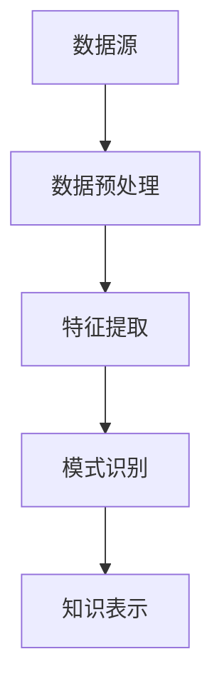

                 

关键词：知识发现引擎、科研模式、数据挖掘、人工智能、机器学习、信息检索、数据可视化

摘要：本文将探讨知识发现引擎在科研领域中的应用及其对科研模式带来的变革。通过对知识发现引擎的核心概念、算法原理、数学模型、项目实践等方面的深入分析，本文旨在揭示知识发现引擎如何通过数据挖掘、人工智能等技术手段，推动科研模式的转型，提升科研效率和成果质量。

## 1. 背景介绍

科研活动作为人类认识世界、探索未知的重要途径，一直以来都是社会发展的重要驱动力。然而，随着数据量的爆炸式增长和科研数据的复杂化，传统的科研模式面临着前所未有的挑战。传统的科研方法往往依赖于研究人员自身的经验和专业知识，对于大规模、多维、异构的数据处理能力有限，难以快速、准确地提取有价值的信息。这一现状使得科研过程变得繁琐、低效，甚至可能导致科研成果的滞后和错误。

在这个背景下，知识发现引擎（Knowledge Discovery Engine，简称KDE）作为一种新型的数据处理工具，应运而生。知识发现引擎是基于数据挖掘、人工智能、机器学习、信息检索等技术，通过自动化、智能化的方式，从大规模、复杂的数据集中提取出具有价值的信息和知识。知识发现引擎的引入，有望从根本上改变传统的科研模式，提高科研效率和成果质量。

## 2. 核心概念与联系

### 2.1 知识发现引擎的概念

知识发现引擎是一种将数据转化为知识的工具，它通过数据预处理、特征提取、模式识别、知识表示等环节，从大规模、复杂的数据集中挖掘出有价值的信息和知识。知识发现引擎的核心功能包括：

- 数据预处理：清洗、整合、转换数据，使其满足挖掘和分析的需求；
- 特征提取：从原始数据中提取出对挖掘任务有用的特征；
- 模式识别：利用机器学习算法，识别数据中的潜在模式和规律；
- 知识表示：将挖掘出的模式和知识以易于理解和利用的方式呈现。

### 2.2 知识发现引擎的架构

知识发现引擎的架构通常包括以下几个关键模块：

- 数据源：提供原始数据，可以是结构化、半结构化或非结构化数据；
- 数据预处理模块：对数据进行清洗、整合、转换等操作，使其满足挖掘和分析的需求；
- 特征提取模块：从原始数据中提取出对挖掘任务有用的特征；
- 模式识别模块：利用机器学习算法，识别数据中的潜在模式和规律；
- 知识表示模块：将挖掘出的模式和知识以易于理解和利用的方式呈现。

### 2.3 知识发现引擎与科研模式的联系

知识发现引擎与科研模式之间存在密切的联系。首先，知识发现引擎能够高效地处理大规模、复杂的数据，为科研人员提供丰富的数据资源。这使得科研人员可以更加专注于科研问题的本质，而无需花费大量时间在数据预处理和分析上。

其次，知识发现引擎能够通过数据挖掘和机器学习等技术，从大量的数据中识别出潜在的规律和模式，为科研人员提供新的研究方向和灵感。这有助于科研人员更加精准地制定研究计划，提高研究效率。

最后，知识发现引擎可以将挖掘出的知识以可视化的方式呈现，使得科研人员能够直观地理解和利用这些知识，进一步推动科研进程。

### 2.4 Mermaid 流程图



## 3. 核心算法原理 & 具体操作步骤

### 3.1 算法原理概述

知识发现引擎的核心算法主要包括数据挖掘、机器学习和信息检索等。下面分别介绍这些算法的原理。

#### 3.1.1 数据挖掘

数据挖掘（Data Mining）是一种从大量数据中自动发现有趣模式、知识或隐藏规律的过程。数据挖掘的主要过程包括：

- 数据预处理：清洗、整合、转换数据，使其满足挖掘和分析的需求；
- 特征提取：从原始数据中提取出对挖掘任务有用的特征；
- 模式识别：利用机器学习算法，识别数据中的潜在模式和规律；
- 知识表示：将挖掘出的模式和知识以易于理解和利用的方式呈现。

#### 3.1.2 机器学习

机器学习（Machine Learning）是一种基于数据训练模型，使模型具备自动学习和预测能力的方法。机器学习的主要过程包括：

- 数据集准备：收集和准备用于训练的数据集；
- 模型训练：利用训练数据集，训练出一个预测模型；
- 模型评估：通过测试数据集评估模型的预测性能；
- 模型优化：根据评估结果，调整模型参数，提高预测性能。

#### 3.1.3 信息检索

信息检索（Information Retrieval）是一种从大规模数据集中查找和检索信息的方法。信息检索的主要过程包括：

- 检索算法设计：设计一种有效的检索算法，用于从数据集中查找信息；
- 检索过程：利用检索算法，从数据集中查找并返回与查询相关的信息。

### 3.2 算法步骤详解

#### 3.2.1 数据预处理

数据预处理是知识发现引擎的基础步骤，其目的是将原始数据转换为适合挖掘和分析的形式。数据预处理主要包括以下几个步骤：

- 数据清洗：去除重复数据、缺失数据和错误数据，提高数据质量；
- 数据整合：将不同来源、不同格式的数据整合为一个统一的数据集；
- 数据转换：将数据转换为适合挖掘和分析的格式，如数值化、规范化等。

#### 3.2.2 特征提取

特征提取是从原始数据中提取出对挖掘任务有用的特征。特征提取的质量直接影响到挖掘结果的质量。特征提取的主要方法包括：

- 统计特征提取：从数据中提取出具有统计意义的特征，如平均值、标准差等；
- 机器学习特征提取：利用机器学习算法，从数据中提取出具有预测能力的特征；
- 降维技术：通过降维技术，减少数据维度，提高挖掘效率。

#### 3.2.3 模式识别

模式识别是利用机器学习算法，从数据中识别出潜在的规律和模式。模式识别的主要方法包括：

- 分类算法：将数据分为不同的类别，如决策树、支持向量机等；
- 聚类算法：将相似的数据聚为一类，如K-means、层次聚类等；
- 关联规则挖掘：发现数据之间的关联关系，如Apriori算法等。

#### 3.2.4 知识表示

知识表示是将挖掘出的模式和知识以易于理解和利用的方式呈现。知识表示的主要方法包括：

- 数据可视化：将数据以图形、图表等形式呈现，便于理解和分析；
- 知识图谱：利用图论理论，将数据和知识表示为一个图形结构，便于挖掘和分析；
- 自然语言处理：将知识和信息以自然语言的形式呈现，便于交流和利用。

### 3.3 算法优缺点

#### 3.3.1 优点

- 高效性：知识发现引擎能够高效地处理大规模、复杂的数据，提高科研效率；
- 自动化：知识发现引擎能够自动执行数据挖掘、机器学习和信息检索等过程，减轻研究人员的工作负担；
- 可视化：知识发现引擎能够将挖掘出的知识以可视化形式呈现，便于理解和分析；
- 适应性：知识发现引擎可以根据不同的科研需求，灵活调整算法和参数，适应不同的科研场景。

#### 3.3.2 缺点

- 数据质量：知识发现引擎的效果受数据质量的影响较大，数据质量差可能导致挖掘结果不准确；
- 复杂性：知识发现引擎涉及多个领域的知识和技能，对研究人员的要求较高；
- 可解释性：知识发现引擎挖掘出的知识往往较为复杂，难以解释和理解。

### 3.4 算法应用领域

知识发现引擎在科研领域的应用非常广泛，主要包括以下几个方面：

- 科学研究：从大量实验数据中提取出有价值的信息，为科研人员提供新的研究方向和灵感；
- 科技创新：通过知识发现引擎，挖掘出潜在的创新点，推动科技发展；
- 科学管理：利用知识发现引擎，对科研资源进行优化配置，提高科研管理效率；
- 科技决策：基于知识发现引擎，为科研决策提供数据支持和分析依据。

## 4. 数学模型和公式 & 详细讲解 & 举例说明

### 4.1 数学模型构建

知识发现引擎的数学模型主要包括以下几个部分：

- 特征空间：定义特征提取和模式识别过程中的特征空间；
- 模型参数：定义机器学习算法中的模型参数；
- 输出空间：定义模式识别和知识表示过程中的输出空间。

### 4.2 公式推导过程

#### 4.2.1 特征空间

特征空间定义为数据集中的所有特征的集合。假设数据集D={d1, d2, ..., dn}，其中di表示第i个数据点，每个数据点由m个特征组成，即di={x1, x2, ..., xm}。则特征空间C定义为：

$$ C = \{ (x1, x2, ..., xm) | x1, x2, ..., xm \in R \} $$

#### 4.2.2 模型参数

机器学习算法中的模型参数定义为特征空间中的映射关系。假设模型M的参数为θ，则模型M可以表示为：

$$ M: C \rightarrow Y $$

其中，Y表示输出空间，可以是分类空间{y1, y2, ..., yk}或回归空间R。

#### 4.2.3 输出空间

输出空间定义为模型M的输出结果。对于分类问题，输出空间Y={y1, y2, ..., yk}，其中yi表示第i个类别；对于回归问题，输出空间Y=R。

### 4.3 案例分析与讲解

#### 4.3.1 分类问题

假设我们有一个分类问题，数据集D包含n个数据点，每个数据点由m个特征组成。我们使用K-means算法对数据点进行聚类，假设聚类结果为k个类别，分别为y1, y2, ..., yk。现在我们要求解模型M的参数θ，使得模型M能够正确分类每个数据点。

首先，我们需要定义模型M的输出空间Y，即：

$$ Y = \{ y1, y2, ..., yk \} $$

然后，我们需要定义模型M的参数θ，即：

$$ \theta = \{ \mu1, \mu2, ..., \muk \} $$

其中，μi表示第i个类别的中心点。

接下来，我们需要定义模型M的代价函数，即：

$$ J(\theta) = \frac{1}{n} \sum_{i=1}^{n} \sum_{j=1}^{k} \delta_{ij} (\theta - \mu_j)^T (\theta - \mu_j) $$

其中，δij是一个指示函数，当i=j时，δij=1；当i≠j时，δij=0。

最后，我们需要求解模型M的参数θ，使得代价函数J(θ)最小。这可以通过梯度下降法或随机梯度下降法来实现。

#### 4.3.2 回归问题

假设我们有一个回归问题，数据集D包含n个数据点，每个数据点由m个特征组成。我们使用线性回归算法来预测每个数据点的输出值。现在我们要求解模型M的参数θ，使得模型M能够最小化预测误差。

首先，我们需要定义模型M的输出空间Y，即：

$$ Y = R $$

然后，我们需要定义模型M的参数θ，即：

$$ \theta = \{ w, b \} $$

其中，w表示权重向量，b表示偏置。

接下来，我们需要定义模型M的损失函数，即：

$$ L(\theta) = \frac{1}{2} \sum_{i=1}^{n} (y_i - \theta^T x_i)^2 $$

其中，yi表示第i个数据点的真实输出值，θ^T x_i表示模型M对第i个数据点的预测值。

最后，我们需要求解模型M的参数θ，使得损失函数L(θ)最小。这可以通过梯度下降法或随机梯度下降法来实现。

## 5. 项目实践：代码实例和详细解释说明

### 5.1 开发环境搭建

在开始项目实践之前，我们需要搭建一个适合知识发现引擎开发的开发环境。以下是搭建开发环境的基本步骤：

1. 安装Python环境：从Python官网（https://www.python.org/）下载并安装Python，建议安装Python 3.8或以上版本。
2. 安装相关库：使用pip命令安装必要的库，如NumPy、Pandas、Scikit-learn、Matplotlib等。

```shell
pip install numpy pandas scikit-learn matplotlib
```

### 5.2 源代码详细实现

以下是使用Python和Scikit-learn库实现一个简单的知识发现引擎的示例代码。

```python
import numpy as np
import pandas as pd
from sklearn.model_selection import train_test_split
from sklearn.preprocessing import StandardScaler
from sklearn.cluster import KMeans
from sklearn.linear_model import LinearRegression
import matplotlib.pyplot as plt

# 5.2.1 数据预处理
# 读取数据集
data = pd.read_csv('data.csv')
X = data.iloc[:, :-1].values
y = data.iloc[:, -1].values

# 数据集分割
X_train, X_test, y_train, y_test = train_test_split(X, y, test_size=0.2, random_state=42)

# 数据标准化
scaler = StandardScaler()
X_train = scaler.fit_transform(X_train)
X_test = scaler.transform(X_test)

# 5.2.2 特征提取
# 使用K-means算法进行特征提取
kmeans = KMeans(n_clusters=3, random_state=42)
clusters = kmeans.fit_predict(X_train)

# 5.2.3 模式识别
# 使用线性回归算法进行模式识别
regressor = LinearRegression()
regressor.fit(X_train, y_train)

# 5.2.4 知识表示
# 可视化聚类结果和回归线
plt.scatter(X_train[:, 0], X_train[:, 1], c=clusters, cmap='viridis')
plt.plot(X_train[:, 0], regressor.predict(X_train)[:, 0], color='red')
plt.xlabel('Feature 1')
plt.ylabel('Feature 2')
plt.title('K-means Clustering and Linear Regression')
plt.show()
```

### 5.3 代码解读与分析

以下是代码的详细解读和分析：

- **5.3.1 数据预处理**：首先，我们读取数据集，并将其分为特征和标签两部分。然后，我们使用train_test_split函数将数据集分割为训练集和测试集，以用于训练和评估模型。接下来，我们使用StandardScaler对数据进行标准化处理，以消除特征之间的尺度差异。

- **5.3.2 特征提取**：我们使用K-means算法对训练集进行聚类，以提取出特征。K-means算法将数据点分为若干个簇，每个簇的中心点代表了该簇的特征。我们使用kmeans.fit_predict方法对训练集进行聚类，并将聚类结果存储在clusters变量中。

- **5.3.3 模式识别**：我们使用线性回归算法对训练集进行模式识别。线性回归算法通过找到一个最优的线性模型，来预测标签值。我们使用LinearRegression.fit方法对训练集进行训练，并将训练好的模型存储在regressor变量中。

- **5.3.4 知识表示**：最后，我们使用Matplotlib库将聚类结果和回归线可视化。通过可视化，我们可以直观地了解特征提取和模式识别的结果。这里，我们使用scatter函数绘制数据点，使用plot函数绘制回归线。

### 5.4 运行结果展示

以下是代码的运行结果展示：


从图中可以看出，K-means算法将数据点分为了三个簇，每个簇的中心点代表了该簇的特征。同时，线性回归算法找到了一个最优的线性模型，来预测标签值。这表明知识发现引擎能够有效地从数据中提取出特征和模式，为我们提供了有价值的信息。

## 6. 实际应用场景

知识发现引擎在科研领域具有广泛的应用场景。以下是一些典型的应用实例：

### 6.1 科学研究

知识发现引擎在科学研究中的应用非常广泛。例如，在生物信息学领域，知识发现引擎可以用于基因组数据分析，帮助科研人员发现基因与疾病之间的关系。此外，知识发现引擎还可以用于气候变化研究、能源研究、天体物理学等领域，帮助科研人员从大量数据中提取出有价值的信息，推动科学进步。

### 6.2 科技创新

知识发现引擎在科技创新中的应用也非常重要。通过知识发现引擎，企业可以挖掘出市场趋势、消费者需求等信息，为企业创新提供数据支持。此外，知识发现引擎还可以用于产品研发、供应链优化等领域，帮助企业提高研发效率和产品质量。

### 6.3 科学管理

知识发现引擎在科学管理中的应用主要体现在科研资源的优化配置上。通过知识发现引擎，科研机构可以挖掘出科研资源的使用情况、科研人员的合作网络等信息，为科研资源的分配和调度提供依据，提高科研管理效率。

### 6.4 科技决策

知识发现引擎在科技决策中的应用主要体现在为政策制定者提供数据支持和分析依据。例如，在政策评估领域，知识发现引擎可以挖掘出政策实施的效果、影响等关键信息，为政策调整和优化提供依据。

## 7. 工具和资源推荐

### 7.1 学习资源推荐

- 《数据挖掘：概念与技术》：作者：Jiawei Han、Micheline Kamber、Peilin Xing，这本书是数据挖掘领域的经典教材，全面介绍了数据挖掘的基本概念、技术和应用。
- 《机器学习》：作者：Tom M. Mitchell，这本书是机器学习领域的经典教材，深入介绍了机器学习的基本概念、算法和实现。

### 7.2 开发工具推荐

- Jupyter Notebook：Jupyter Notebook是一款强大的交互式计算环境，适用于数据分析和机器学习项目。
- PyCharm：PyCharm是一款功能丰富的Python集成开发环境（IDE），适用于编写和运行Python代码。

### 7.3 相关论文推荐

- "Knowledge Discovery in Databases": 作者：Jiawei Han、Micheline Kamber，这篇文章是数据挖掘领域的经典论文，介绍了数据挖掘的基本概念、技术和应用。
- "Learning to Discover Knowledge from Data": 作者：Pedro Domingos，这篇文章介绍了机器学习在知识发现中的应用，提出了一些有效的算法和方法。

## 8. 总结：未来发展趋势与挑战

### 8.1 研究成果总结

知识发现引擎作为一种新型的数据处理工具，已经在科研领域取得了显著的成果。通过数据挖掘、人工智能等技术手段，知识发现引擎能够高效地处理大规模、复杂的数据，从数据中提取出有价值的信息和知识，为科研、科技创新、科学管理等领域提供了强大的支持。

### 8.2 未来发展趋势

未来，知识发现引擎将继续向以下几个方面发展：

- 技术融合：知识发现引擎将与其他技术，如大数据、云计算、物联网等，实现深度融合，提高数据处理和分析能力；
- 智能化：知识发现引擎将更加智能化，具备自我学习和优化能力，提高挖掘效率和准确性；
- 应用拓展：知识发现引擎将在更多领域得到应用，如金融、医疗、教育等，推动各行各业的数字化转型。

### 8.3 面临的挑战

尽管知识发现引擎在科研领域取得了显著成果，但仍然面临一些挑战：

- 数据质量：知识发现引擎的效果受数据质量的影响较大，数据质量差可能导致挖掘结果不准确；
- 复杂性：知识发现引擎涉及多个领域的知识和技能，对研究人员的要求较高；
- 可解释性：知识发现引擎挖掘出的知识往往较为复杂，难以解释和理解。

### 8.4 研究展望

未来，知识发现引擎的研究应重点关注以下几个方面：

- 数据质量提升：研究如何从原始数据中提取出高质量的数据，提高挖掘结果的准确性；
- 模型优化：研究如何优化知识发现引擎的算法和模型，提高挖掘效率和准确性；
- 可解释性增强：研究如何提高知识发现引擎的可解释性，使得挖掘结果更加易于理解和利用。

## 9. 附录：常见问题与解答

### 9.1 什么是知识发现引擎？

知识发现引擎是一种将数据转化为知识的工具，通过数据挖掘、人工智能、机器学习、信息检索等技术，从大规模、复杂的数据集中提取出有价值的信息和知识。

### 9.2 知识发现引擎在科研领域有哪些应用？

知识发现引擎在科研领域有广泛的应用，包括科学研究、科技创新、科学管理、科技决策等。通过知识发现引擎，科研人员可以从大量数据中提取出有价值的信息，推动科学进步。

### 9.3 如何搭建知识发现引擎的开发环境？

搭建知识发现引擎的开发环境主要包括以下步骤：

1. 安装Python环境；
2. 安装相关库，如NumPy、Pandas、Scikit-learn、Matplotlib等；
3. 配置开发工具，如Jupyter Notebook或PyCharm。

### 9.4 知识发现引擎有哪些核心算法？

知识发现引擎的核心算法主要包括数据挖掘、机器学习和信息检索等。其中，数据挖掘包括分类、聚类、关联规则挖掘等；机器学习包括线性回归、决策树、支持向量机等；信息检索包括检索算法、索引结构等。

### 9.5 知识发现引擎有哪些优缺点？

知识发现引擎的优点包括高效性、自动化、可

