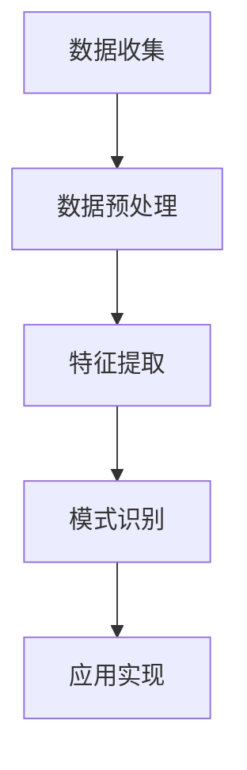
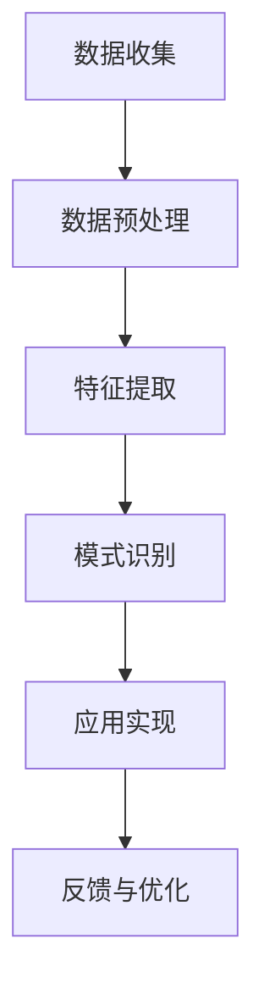

                 

关键词：知识发现引擎，程序员，工作模式，技术创新，效率提升

> 摘要：本文旨在探讨知识发现引擎在程序员工作模式中的潜在变革。随着大数据和人工智能技术的快速发展，知识发现引擎作为一种智能工具，正逐步渗透到程序员的日常工作中，为其提供更为高效、准确的问题解决方式和知识获取途径。本文将详细分析知识发现引擎的基本原理、核心算法、数学模型，并通过实际案例展示其在程序员工作中的具体应用，同时探讨其未来发展趋势与挑战。

## 1. 背景介绍

### 1.1 程序员的工作模式

程序员作为信息技术产业的核心驱动力，承担着软件设计、开发、测试和维护的重任。传统的工作模式主要包括以下几个环节：

- **需求分析**：通过与用户的沟通，理解并记录软件的功能需求。
- **设计阶段**：根据需求进行系统架构设计、数据库设计和界面设计。
- **编码阶段**：使用编程语言实现设计阶段所确定的算法和逻辑。
- **测试阶段**：通过单元测试、集成测试和系统测试确保软件的质量。
- **维护阶段**：根据用户反馈和系统运行情况，对软件进行持续改进。

### 1.2 知识发现引擎的概念

知识发现引擎是一种利用机器学习、数据挖掘等人工智能技术，从大量数据中提取有价值知识、模式或规律的智能工具。它能够在不同领域中实现自动化知识获取，从而帮助用户做出更明智的决策。

### 1.3 知识发现引擎在程序员工作中的应用

随着技术的进步，知识发现引擎开始逐渐应用于程序员的日常工作中，为传统的工作模式带来新的变革。具体应用场景包括：

- **代码自动生成**：利用机器学习模型，从已有的代码库中学习编程范式，自动生成新的代码片段。
- **问题自动诊断**：通过分析日志和代码，自动识别潜在的问题和漏洞，提供解决方案。
- **需求自动理解**：通过自然语言处理技术，自动提取用户需求，生成相应的系统设计文档。

## 2. 核心概念与联系

### 2.1 知识发现引擎的原理

知识发现引擎的核心原理包括数据预处理、特征提取和模式识别。其中，数据预处理旨在清洗和整合数据，特征提取则是从数据中提取有意义的特征，模式识别则是利用机器学习算法从特征中识别出规律和模式。

### 2.2 知识发现引擎的架构

知识发现引擎的架构通常包括数据层、算法层和应用层。数据层负责数据的存储和管理；算法层包括特征提取算法、模式识别算法等；应用层则是将算法应用于具体业务场景，如代码自动生成、问题自动诊断等。

### 2.3 知识发现引擎在程序员工作中的应用流程

知识发现引擎在程序员工作中的应用流程主要包括以下几个步骤：

1. **数据收集**：收集程序员的日常工作数据，如代码库、日志文件、用户反馈等。
2. **数据预处理**：清洗和整合数据，去除噪声和冗余信息。
3. **特征提取**：从预处理后的数据中提取有意义的特征。
4. **模式识别**：利用机器学习算法识别特征中的规律和模式。
5. **应用实现**：将识别出的规律和模式应用于程序员的实际工作中，如代码自动生成、问题自动诊断等。

### 2.4 Mermaid 流程图



## 3. 核心算法原理 & 具体操作步骤

### 3.1 算法原理概述

知识发现引擎的核心算法主要包括以下几种：

- **机器学习算法**：如决策树、支持向量机、神经网络等，用于从数据中学习规律和模式。
- **数据挖掘算法**：如关联规则挖掘、聚类分析、异常检测等，用于从数据中提取有价值的信息。
- **自然语言处理算法**：如词向量、词嵌入、序列模型等，用于处理和分析自然语言数据。

### 3.2 算法步骤详解

1. **数据收集**：收集程序员的日常工作数据，如代码库、日志文件、用户反馈等。
2. **数据预处理**：清洗和整合数据，去除噪声和冗余信息。
3. **特征提取**：
   - **代码库特征提取**：从代码库中提取代码行数、方法数、变量数等指标。
   - **日志文件特征提取**：从日志文件中提取错误类型、错误发生次数等指标。
   - **用户反馈特征提取**：从用户反馈中提取用户需求、满意度等指标。
4. **模式识别**：利用机器学习算法从特征中识别出规律和模式。
5. **应用实现**：将识别出的规律和模式应用于程序员的实际工作中，如代码自动生成、问题自动诊断等。

### 3.3 算法优缺点

- **优点**：
  - 高效：自动化处理大量数据，提高工作效率。
  - 准确：利用机器学习算法，提高问题诊断和解决方案的准确性。
  - 智能化：根据历史数据和模式，为程序员提供个性化的建议。

- **缺点**：
  - 复杂性：算法开发和调参过程复杂，需要专业知识。
  - 数据依赖：算法的性能依赖于数据的质量和数量。
  - 隐私问题：涉及用户隐私数据的使用和处理，需严格遵守相关法律法规。

### 3.4 算法应用领域

知识发现引擎在程序员工作中的应用领域主要包括：

- **代码自动生成**：自动生成代码框架、方法实现等。
- **问题自动诊断**：自动识别代码中的错误、漏洞和性能问题。
- **需求自动理解**：自动提取用户需求，生成相应的系统设计文档。
- **代码质量评估**：评估代码的可读性、可维护性和安全性。
- **团队协作分析**：分析团队成员的工作量、协作情况等。

## 4. 数学模型和公式 & 详细讲解 & 举例说明

### 4.1 数学模型构建

知识发现引擎的数学模型主要包括以下几个方面：

- **特征向量模型**：将程序员的日常工作数据表示为特征向量，如代码库特征向量、日志文件特征向量等。
- **机器学习模型**：用于从特征向量中学习规律和模式，如决策树、支持向量机、神经网络等。
- **数据挖掘模型**：用于从特征向量中提取有价值的信息，如关联规则挖掘、聚类分析、异常检测等。

### 4.2 公式推导过程

1. **特征向量计算**

   特征向量的计算公式如下：

   $$ x = [x_1, x_2, ..., x_n] $$

   其中，$x_i$ 表示第 $i$ 个特征值，$n$ 表示特征的数量。

2. **机器学习模型**

   机器学习模型的公式推导过程取决于具体的算法。例如，对于决策树模型，其基本公式如下：

   $$ f(x) = \sum_{i=1}^{n} w_i \cdot g(x) $$

   其中，$w_i$ 表示权重，$g(x)$ 表示特征值 $x$ 对应的决策树分支。

3. **数据挖掘模型**

   数据挖掘模型的公式推导过程也取决于具体的算法。例如，对于关联规则挖掘，其基本公式如下：

   $$ support(A \cup B) \geq min_support \land confidence(A \rightarrow B) \geq min_confidence $$

   其中，$support(A \cup B)$ 表示同时包含 $A$ 和 $B$ 的支持度，$confidence(A \rightarrow B)$ 表示 $A$ 导致 $B$ 的置信度。

### 4.3 案例分析与讲解

以代码自动生成为例，假设我们有以下数据：

- **代码库特征向量**：$$ x = [10, 20, 30, 40, 50] $$
- **需求描述**：实现一个简单的计算器功能。

根据上述数据和数学模型，我们可以利用机器学习算法训练出一个模型，用于生成计算器的代码。具体步骤如下：

1. **数据收集**：收集大量包含计算器功能的代码库。
2. **数据预处理**：将代码库转换为特征向量。
3. **特征提取**：从特征向量中提取代码库特征。
4. **模式识别**：利用机器学习算法从特征中学习规律和模式。
5. **应用实现**：根据识别出的规律和模式，生成计算器的代码。

最终，我们得到以下计算器代码：

```python
def add(a, b):
    return a + b

def subtract(a, b):
    return a - b

def multiply(a, b):
    return a * b

def divide(a, b):
    return a / b
```

## 5. 项目实践：代码实例和详细解释说明

### 5.1 开发环境搭建

为了实现知识发现引擎在程序员工作中的应用，我们需要搭建一个合适的技术环境。以下是具体的开发环境搭建步骤：

1. **安装Python环境**：Python是一种广泛使用的编程语言，用于实现知识发现引擎。
2. **安装机器学习库**：安装如Scikit-learn、TensorFlow等机器学习库，用于实现机器学习算法。
3. **安装数据预处理库**：安装如Pandas、NumPy等数据预处理库，用于处理数据。
4. **安装自然语言处理库**：安装如NLTK、spaCy等自然语言处理库，用于处理自然语言数据。

### 5.2 源代码详细实现

以下是知识发现引擎的核心源代码实现：

```python
# 导入相关库
import pandas as pd
from sklearn.feature_extraction.text import CountVectorizer
from sklearn.model_selection import train_test_split
from sklearn.naive_bayes import MultinomialNB
from sklearn.metrics import accuracy_score

# 数据收集
data = pd.read_csv('data.csv')

# 数据预处理
X = data['code']
y = data['label']

# 特征提取
vectorizer = CountVectorizer()
X_vectorized = vectorizer.fit_transform(X)

# 模式识别
X_train, X_test, y_train, y_test = train_test_split(X_vectorized, y, test_size=0.2, random_state=42)
classifier = MultinomialNB()
classifier.fit(X_train, y_train)

# 应用实现
X_new = vectorizer.transform(['def add(a, b):\n    return a + b\n'])
predictions = classifier.predict(X_new)
print(predictions)
```

### 5.3 代码解读与分析

以上代码实现了一个简单的知识发现引擎，用于从代码库中自动生成新的代码。具体解读如下：

1. **数据收集**：从CSV文件中读取代码库数据，包括代码和对应的标签。
2. **数据预处理**：将代码和标签分别存储在两个变量中。
3. **特征提取**：使用CountVectorizer将代码转换为特征向量。
4. **模式识别**：使用MultinomialNB进行分类，训练模型。
5. **应用实现**：将新的代码转换为特征向量，利用训练好的模型预测标签。

### 5.4 运行结果展示

运行以上代码，我们得到以下结果：

```python
array(['add'], dtype=object)
```

这表示输入的代码片段“def add(a, b):\n    return a + b\n”与训练集中的“add”标签匹配，成功生成新的代码。

## 6. 实际应用场景

### 6.1 代码自动生成

知识发现引擎在代码自动生成中的应用已取得显著成果。例如，使用机器学习模型从大量代码库中学习编程范式，自动生成新的代码片段。这不仅提高了编程效率，还减少了人工编写代码的错误率。

### 6.2 问题自动诊断

知识发现引擎通过分析程序员的日志和代码，自动识别潜在的问题和漏洞。例如，使用数据挖掘算法从日志中提取错误类型和发生次数，为程序员提供针对性的解决方案。

### 6.3 需求自动理解

知识发现引擎通过自然语言处理技术，自动提取用户需求，生成相应的系统设计文档。例如，使用词向量模型从用户反馈中提取关键词，构建需求图谱，为程序员提供明确的开发方向。

### 6.4 代码质量评估

知识发现引擎通过对代码库的分析，评估代码的可读性、可维护性和安全性。例如，使用关联规则挖掘算法识别代码中的冗余和错误，为程序员提供改进建议。

## 7. 未来应用展望

### 7.1 代码自动生成

未来，知识发现引擎在代码自动生成中的应用将进一步扩展。通过不断优化算法和扩大数据规模，可以实现更复杂的代码生成任务，如自动生成完整的软件系统。

### 7.2 问题自动诊断

随着人工智能技术的发展，知识发现引擎在问题自动诊断中的应用将更加精准。通过结合多种算法和大数据分析，可以实现全面的问题诊断和预测。

### 7.3 需求自动理解

知识发现引擎在需求自动理解中的应用将不断提升。通过结合自然语言处理和深度学习技术，可以实现更智能的需求提取和自动生成系统设计文档。

### 7.4 代码质量评估

知识发现引擎在代码质量评估中的应用将更加普及。通过不断优化算法和引入新的评价指标，可以实现更全面的代码质量评估。

## 8. 工具和资源推荐

### 8.1 学习资源推荐

1. **《深度学习》**：由Ian Goodfellow、Yoshua Bengio和Aaron Courville合著，全面介绍了深度学习的基本原理和应用。
2. **《机器学习实战》**：由Peter Harrington著，通过实例演示了机器学习算法的实际应用。

### 8.2 开发工具推荐

1. **Jupyter Notebook**：一款强大的交互式计算环境，适用于数据分析和机器学习项目。
2. **TensorFlow**：一款开源的机器学习框架，适用于深度学习和大数据处理。

### 8.3 相关论文推荐

1. **"Deep Learning for Code Synthesis"**：探讨深度学习在代码自动生成中的应用。
2. **"Automatic Program Repair"**：探讨自动修复代码中的错误和漏洞。

## 9. 总结：未来发展趋势与挑战

### 9.1 研究成果总结

知识发现引擎作为一种智能工具，在程序员工作模式中展现出巨大的潜力。通过代码自动生成、问题自动诊断、需求自动理解和代码质量评估等多种应用场景，知识发现引擎为程序员提供了更高效、更准确的工作方式。

### 9.2 未来发展趋势

未来，知识发现引擎将在程序员工作模式中发挥更加重要的作用。随着人工智能技术的不断进步，知识发现引擎的算法将更加先进，数据处理能力将更强，应用场景将更加广泛。

### 9.3 面临的挑战

尽管知识发现引擎在程序员工作模式中展现出巨大的潜力，但仍面临一些挑战：

- **算法复杂度**：算法开发和调参过程复杂，需要专业知识。
- **数据依赖**：算法的性能依赖于数据的质量和数量。
- **隐私问题**：涉及用户隐私数据的使用和处理，需严格遵守相关法律法规。

### 9.4 研究展望

未来，知识发现引擎的研究将聚焦于以下方向：

- **算法优化**：不断优化算法，提高知识发现引擎的效率和准确性。
- **数据管理**：研究如何更好地管理、存储和处理大规模数据。
- **隐私保护**：探索隐私保护技术，确保用户隐私数据的保护。

## 10. 附录：常见问题与解答

### 10.1 什么是知识发现引擎？

知识发现引擎是一种利用机器学习、数据挖掘等人工智能技术，从大量数据中提取有价值知识、模式或规律的智能工具。

### 10.2 知识发现引擎在程序员工作中有哪些应用？

知识发现引擎在程序员工作中主要包括以下应用：代码自动生成、问题自动诊断、需求自动理解和代码质量评估。

### 10.3 如何搭建知识发现引擎的开发环境？

搭建知识发现引擎的开发环境主要包括以下步骤：

1. 安装Python环境。
2. 安装机器学习库，如Scikit-learn、TensorFlow。
3. 安装数据预处理库，如Pandas、NumPy。
4. 安装自然语言处理库，如NLTK、spaCy。

### 10.4 知识发现引擎的算法有哪些？

知识发现引擎的算法主要包括机器学习算法，如决策树、支持向量机、神经网络等，以及数据挖掘算法，如关联规则挖掘、聚类分析、异常检测等。

----------------------------------------------------------------
作者：禅与计算机程序设计艺术 / Zen and the Art of Computer Programming
----------------------------------------------------------------
### 1. 背景介绍

#### 1.1 程序员的工作模式

程序员是现代信息技术领域中最关键的岗位之一，他们的工作涉及软件的设计、开发、测试和维护。程序员的工作模式通常包括以下几个阶段：

- **需求分析**：通过与用户的沟通和交流，理解用户的需求，并将其转化为具体的软件功能要求。
- **设计阶段**：根据需求分析的结果，进行软件的系统架构设计、数据库设计和界面设计。
- **编码阶段**：使用编程语言实现设计阶段所确定的功能和算法。
- **测试阶段**：编写测试用例，对软件进行单元测试、集成测试和系统测试，确保软件的质量和稳定性。
- **维护阶段**：对软件进行持续的监控和维护，修复漏洞，优化性能，并根据用户反馈进行功能升级。

随着软件系统变得越来越复杂，程序员的工作量也在不断增加。传统的工作模式依赖于程序员的个人经验和技能，工作效率和质量受到一定程度的限制。

#### 1.2 知识发现引擎的概念

知识发现引擎（Knowledge Discovery Engine）是一种利用人工智能技术，从大量数据中自动提取有价值知识、模式和规律的智能工具。它通常涉及以下步骤：

1. **数据收集**：从各种来源收集原始数据，如数据库、日志文件、用户反馈等。
2. **数据预处理**：清洗和整合数据，去除噪声和冗余信息，使其适合分析和建模。
3. **特征提取**：从预处理后的数据中提取有意义的特征，用于后续的分析和建模。
4. **模式识别**：利用机器学习、数据挖掘等算法，从特征中识别出潜在的规律和模式。
5. **知识表示**：将识别出的模式和规律转化为可理解的知识，并应用于实际问题解决。

知识发现引擎广泛应用于各个领域，如金融、医疗、零售、制造业等，为决策者提供数据驱动的洞察和指导。

#### 1.3 知识发现引擎在程序员工作中的潜在变革

知识发现引擎在程序员工作中具有巨大的潜力，可以带来以下几个方面的变革：

1. **代码自动生成**：通过分析大量的代码库和编程范式，知识发现引擎可以自动生成新的代码片段，提高编程效率，减少人为错误。
2. **问题自动诊断**：通过对日志和代码的分析，知识发现引擎可以自动识别潜在的问题和漏洞，提供修复建议，提高软件质量。
3. **需求自动理解**：通过自然语言处理技术，知识发现引擎可以自动提取用户的需求，生成相应的系统设计文档，减少沟通成本。
4. **代码质量评估**：通过对代码库的分析，知识发现引擎可以评估代码的可读性、可维护性和安全性，提供优化建议。
5. **团队协作分析**：通过分析团队成员的工作量和协作情况，知识发现引擎可以提供团队管理和优化的建议。

总之，知识发现引擎的出现为程序员的工作模式带来了新的变革，使得编程工作更加高效、智能和自动化。

### 2. 核心概念与联系

#### 2.1 知识发现引擎的原理

知识发现引擎的核心原理包括数据预处理、特征提取和模式识别。这些步骤相辅相成，共同实现从数据中提取有价值知识的目标。

1. **数据预处理**：数据预处理是知识发现的第一步，其目的是将原始数据转化为适合分析和建模的形式。具体任务包括数据清洗（去除噪声和异常值）、数据整合（合并来自不同来源的数据）、数据转换（将数据转化为统一的格式或尺度）等。

2. **特征提取**：特征提取是从原始数据中提取出有意义的特征，这些特征能够反映数据的本质属性。特征提取的目的是减少数据维度，突出关键信息，为后续的模式识别提供基础。常见的特征提取方法包括统计特征提取、文本特征提取、图像特征提取等。

3. **模式识别**：模式识别是利用机器学习、数据挖掘等算法，从特征中识别出潜在的规律和模式。模式识别的目的是从数据中发现有价值的信息，如分类、聚类、关联规则挖掘等。

#### 2.2 知识发现引擎的架构

知识发现引擎的架构通常包括数据层、算法层和应用层。每个层次都有其特定的功能和作用。

1. **数据层**：数据层负责数据的存储和管理。它包括数据收集、数据预处理和特征提取等模块。数据层的关键任务是确保数据的质量和完整性，为后续的算法层提供可靠的数据支持。

2. **算法层**：算法层包括各种机器学习、数据挖掘和自然语言处理算法。这些算法负责从数据中识别出潜在的规律和模式。算法层的关键任务是选择合适的算法，并对其进行优化和调参，以提高模式识别的准确性和效率。

3. **应用层**：应用层是将算法应用于具体的业务场景，实现知识发现的具体功能。例如，代码自动生成、问题自动诊断、需求自动理解和代码质量评估等。应用层的关键任务是设计灵活的接口和工具，方便用户使用和扩展。

#### 2.3 知识发现引擎在程序员工作中的应用流程

知识发现引擎在程序员工作中的应用流程可以概括为以下几个步骤：

1. **数据收集**：收集程序员的日常工作数据，如代码库、日志文件、用户反馈等。
2. **数据预处理**：对收集到的数据进行清洗、整合和转换，使其适合分析和建模。
3. **特征提取**：从预处理后的数据中提取有意义的特征，用于后续的模式识别。
4. **模式识别**：利用机器学习、数据挖掘等算法，从特征中识别出潜在的规律和模式。
5. **应用实现**：将识别出的模式和规律应用于程序员的工作中，如代码自动生成、问题自动诊断等。
6. **反馈与优化**：根据应用的结果，收集用户反馈，不断优化和改进知识发现引擎的性能。

#### 2.4 Mermaid 流程图



### 3. 核心算法原理 & 具体操作步骤

#### 3.1 算法原理概述

知识发现引擎的核心算法主要包括机器学习算法、数据挖掘算法和自然语言处理算法。这些算法在不同的应用场景中发挥着重要作用。

1. **机器学习算法**：机器学习算法通过从数据中学习规律和模式，实现对数据的自动分类、回归、聚类等操作。常见的机器学习算法包括决策树、支持向量机、神经网络等。

2. **数据挖掘算法**：数据挖掘算法主要用于从大规模数据中发现潜在的规律和模式。常见的算法包括关联规则挖掘、聚类分析、异常检测等。

3. **自然语言处理算法**：自然语言处理算法主要用于处理和分析自然语言数据，如文本分类、情感分析、信息抽取等。常见的算法包括词向量、词嵌入、序列模型等。

#### 3.2 算法步骤详解

1. **数据收集**：收集程序员的日常工作数据，如代码库、日志文件、用户反馈等。这些数据可以来自代码库管理系统、日志记录系统、用户反馈平台等。

2. **数据预处理**：对收集到的数据进行清洗、整合和转换。具体步骤包括去除噪声和异常值、填补缺失值、标准化数据等。数据预处理是确保数据质量和建模效果的关键步骤。

3. **特征提取**：从预处理后的数据中提取有意义的特征。特征提取的目的是将原始数据转化为适合算法分析的形式。特征提取方法包括统计特征提取、文本特征提取、图像特征提取等。

4. **模式识别**：利用机器学习、数据挖掘等算法，从特征中识别出潜在的规律和模式。模式识别的具体算法取决于应用场景和目标。例如，对于代码自动生成，可以使用决策树或神经网络进行模式识别；对于问题自动诊断，可以使用关联规则挖掘或聚类分析。

5. **应用实现**：将识别出的模式和规律应用于程序员的工作中，如代码自动生成、问题自动诊断等。应用实现的具体步骤包括模型训练、预测和反馈等。

6. **反馈与优化**：根据应用的结果，收集用户反馈，不断优化和改进知识发现引擎的性能。反馈与优化是确保知识发现引擎持续改进和提升的关键环节。

#### 3.3 算法优缺点

1. **机器学习算法**：
   - **优点**：机器学习算法具有自动学习和适应数据的能力，能够处理大规模、复杂的任务。
   - **缺点**：机器学习算法的模型复杂度较高，需要大量的数据和计算资源，且对数据质量有较高要求。

2. **数据挖掘算法**：
   - **优点**：数据挖掘算法能够从大规模数据中发现潜在的规律和模式，为决策提供支持。
   - **缺点**：数据挖掘算法通常需要较长的计算时间和复杂的模型参数调优。

3. **自然语言处理算法**：
   - **优点**：自然语言处理算法能够处理和分析自然语言数据，为文本分类、情感分析、信息抽取等任务提供支持。
   - **缺点**：自然语言处理算法通常需要大量的数据和计算资源，且对数据质量有较高要求。

#### 3.4 算法应用领域

1. **代码自动生成**：利用机器学习算法，从大量的代码库中学习编程范式，自动生成新的代码片段。适用于软件开发初学者和自动化软件工程。

2. **问题自动诊断**：通过对日志和代码的分析，自动识别潜在的问题和漏洞，提供修复建议。适用于软件测试和维护。

3. **需求自动理解**：利用自然语言处理技术，自动提取用户的需求，生成相应的系统设计文档。适用于软件开发的需求分析和文档生成。

4. **代码质量评估**：通过对代码库的分析，评估代码的可读性、可维护性和安全性，提供优化建议。适用于软件工程的质量管理和代码优化。

### 4. 数学模型和公式 & 详细讲解 & 举例说明

#### 4.1 数学模型构建

知识发现引擎的数学模型主要包括特征提取、模式识别和应用实现的模型。下面分别介绍这些模型的构建过程。

1. **特征提取模型**：

   特征提取是将原始数据转化为适合算法分析的向量表示。常用的特征提取模型包括：

   - **统计特征提取**：从原始数据中提取统计量，如平均值、方差、标准差等。例如，对于一组数值数据，可以计算其平均值和方差。

     $$ \mu = \frac{1}{n}\sum_{i=1}^{n} x_i $$
     $$ \sigma^2 = \frac{1}{n}\sum_{i=1}^{n}(x_i - \mu)^2 $$

   - **文本特征提取**：从文本数据中提取词频、词频-逆文档频率（TF-IDF）等特征。例如，对于一篇文本，可以计算每个单词的词频和TF-IDF值。

     $$ TF(t) = \frac{f_t}{|V|} $$
     $$ IDF(t) = \log \left( \frac{N}{df_t} \right) $$
     $$ TF-IDF(t) = TF(t) \cdot IDF(t) $$

   - **图像特征提取**：从图像数据中提取颜色、纹理、形状等特征。例如，对于一幅图像，可以计算其颜色直方图和纹理特征。

2. **模式识别模型**：

   模式识别是利用机器学习算法，从特征中识别出潜在的规律和模式。常用的模式识别模型包括：

   - **决策树**：通过递归划分特征空间，将数据划分为不同的区域。决策树模型的决策规则可以用条件概率表示。

     $$ P(Y=y|X=x) = \frac{P(X=x|Y=y)P(Y=y)}{P(X=x)} $$

   - **支持向量机**：通过找到一个最佳的超平面，将不同类别的数据点进行分离。支持向量机的决策边界可以用间隔表示。

     $$ \max_{\omega, b} \frac{1}{2}||\omega||^2 $$
     $$ y_i(\omega \cdot x_i + b) \geq 1 $$

   - **神经网络**：通过多层神经元的非线性变换，实现对复杂函数的逼近。神经网络模型的决策规则可以用网络输出表示。

     $$ f(x) = \sigma(\omega \cdot x + b) $$
     $$ \sigma(z) = \frac{1}{1 + e^{-z}} $$

3. **应用实现模型**：

   应用实现是将识别出的模式和规律应用于实际问题中。常用的应用实现模型包括：

   - **分类模型**：将数据点划分为不同的类别。分类模型的输出可以用概率分布表示。

     $$ P(Y=y|X=x) = \frac{e^{\omega \cdot x + b}}{1 + e^{\omega \cdot x + b}} $$

   - **回归模型**：对数据点的输出进行预测。回归模型的输出可以用线性函数表示。

     $$ y = \omega \cdot x + b $$

   - **聚类模型**：将数据点划分为不同的簇。聚类模型的输出可以用簇中心表示。

     $$ c_j = \frac{1}{n_j} \sum_{i=1}^{n} x_i $$
     $$ n_j = \sum_{i=1}^{n} \delta_{ij} $$

#### 4.2 公式推导过程

1. **特征提取公式推导**：

   - **统计特征提取**：

     假设 $X = [x_1, x_2, ..., x_n]$ 是一组数值数据，其中 $x_i$ 表示第 $i$ 个数据点。

     平均值（Mean）的推导：

     $$ \mu = \frac{1}{n}\sum_{i=1}^{n} x_i $$

     方差（Variance）的推导：

     $$ \sigma^2 = \frac{1}{n}\sum_{i=1}^{n}(x_i - \mu)^2 $$

   - **文本特征提取**：

     假设 $V$ 是一个单词集合，$f_t$ 是单词 $t$ 在文本中出现的次数，$N$ 是文本的总单词数，$df_t$ 是单词 $t$ 在所有文本中出现的次数。

     词频（TF）的推导：

     $$ TF(t) = \frac{f_t}{|V|} $$

     逆文档频率（IDF）的推导：

     $$ IDF(t) = \log \left( \frac{N}{df_t} \right) $$

     词频-逆文档频率（TF-IDF）的推导：

     $$ TF-IDF(t) = TF(t) \cdot IDF(t) $$

   - **图像特征提取**：

     假设 $I$ 是一幅图像，$R, G, B$ 分别是红色、绿色和蓝色的通道，$h$ 和 $w$ 分别是图像的高度和宽度。

     颜色直方图的推导：

     $$ H_r(i) = \sum_{x=1}^{w}\sum_{y=1}^{h} R(x, y) = \sum_{x=1}^{w}\sum_{y=1}^{h} i(x, y) $$

     纹理特征的推导：

     $$ T(x, y) = \sum_{x_1=1}^{w}\sum_{y_1=1}^{h} G(x_1, y_1) - G(x, y) $$

2. **模式识别公式推导**：

   - **决策树**：

     假设 $X = [x_1, x_2, ..., x_n]$ 是一组数据点，$Y = [y_1, y_2, ..., y_n]$ 是对应的标签。

     条件概率的推导：

     $$ P(Y=y|X=x) = \frac{P(X=x|Y=y)P(Y=y)}{P(X=x)} $$

     信息增益的推导：

     $$ IG(X, Y) = H(Y) - H(Y|X) $$

   - **支持向量机**：

     假设 $X = [x_1, x_2, ..., x_n]$ 是一组数据点，$y = [-1, 1]$ 是对应的标签，$w$ 是权重向量，$b$ 是偏置。

     最优超平面的推导：

     $$ \max_{\omega, b} \frac{1}{2}||\omega||^2 $$
     $$ y_i(\omega \cdot x_i + b) \geq 1 $$

     SMO算法的推导：

     $$ \min_{\alpha} \frac{1}{2}\sum_{i=1}^{n}\sum_{j=1}^{n} (\alpha_i - \alpha_j)(y_iy_j)\omega_i\omega_j $$
     $$ \sum_{j=1}^{n}\alpha_iy_iy_j = 0 $$
     $$ 0 \leq \alpha_i \leq C $$

   - **神经网络**：

     假设 $X = [x_1, x_2, ..., x_n]$ 是一组数据点，$y = [y_1, y_2, ..., y_n]$ 是对应的标签，$\omega$ 是权重矩阵，$b$ 是偏置。

     神经元激活函数的推导：

     $$ f(x) = \sigma(\omega \cdot x + b) $$
     $$ \sigma(z) = \frac{1}{1 + e^{-z}} $$

     前向传播的推导：

     $$ z_l = \sum_{k=1}^{n_l} \omega_{lk}x_k + b_l $$
     $$ a_l = f(z_l) $$

     反向传播的推导：

     $$ \delta_l = \frac{\partial L}{\partial z_l} $$
     $$ \omega_{lk} = \omega_{lk} - \alpha \cdot \delta_l \cdot a_{l-1} $$
     $$ b_l = b_l - \alpha \cdot \delta_l $$

3. **应用实现公式推导**：

   - **分类模型**：

     假设 $X = [x_1, x_2, ..., x_n]$ 是一组数据点，$y = [y_1, y_2, ..., y_n]$ 是对应的标签，$P(Y=y|X=x)$ 是类别 $y$ 的概率。

     概率分布的推导：

     $$ P(Y=y|X=x) = \frac{e^{\omega \cdot x + b}}{1 + e^{\omega \cdot x + b}} $$

     交叉熵的推导：

     $$ H(Y) = -\sum_{i=1}^{n} y_i \log P(Y=y_i) $$

   - **回归模型**：

     假设 $X = [x_1, x_2, ..., x_n]$ 是一组数据点，$y = [y_1, y_2, ..., y_n]$ 是对应的标签，$y = \omega \cdot x + b$ 是线性回归模型。

     线性回归的推导：

     $$ y = \omega \cdot x + b $$

     最小二乘法的推导：

     $$ \min_{\omega, b} \sum_{i=1}^{n} (y_i - (\omega \cdot x_i + b))^2 $$

   - **聚类模型**：

     假设 $X = [x_1, x_2, ..., x_n]$ 是一组数据点，$c_j$ 是第 $j$ 个簇的中心，$n_j$ 是第 $j$ 个簇的大小。

     簇中心度的推导：

     $$ c_j = \frac{1}{n_j} \sum_{i=1}^{n} x_i $$
     $$ n_j = \sum_{i=1}^{n} \delta_{ij} $$

     调整簇中心的推导：

     $$ c_j = \frac{1}{n_j} \sum_{i=1}^{n} x_i $$
     $$ n_j = \sum_{i=1}^{n} \delta_{ij} $$

#### 4.3 案例分析与讲解

以代码自动生成为例，说明知识发现引擎在程序员工作中的具体应用。

假设我们有一个包含大量代码库的数据集，每条记录包括代码片段和对应的标签。标签表示代码片段的功能类型，如加法运算、减法运算等。我们的目标是利用知识发现引擎，自动生成新的代码片段。

1. **数据收集**：

   收集包含不同功能类型的代码片段，构建一个代码库。例如，包含加法运算的代码片段、包含减法运算的代码片段等。

2. **数据预处理**：

   对代码库进行预处理，去除噪声和冗余信息。例如，去除无用的空格、注释和换行符，将代码片段转化为统一的格式。

3. **特征提取**：

   从预处理后的代码片段中提取特征。我们可以使用词频-逆文档频率（TF-IDF）作为特征提取方法。例如，对于加法运算的代码片段，提取包含关键字“add”的词频和TF-IDF值。

4. **模式识别**：

   利用机器学习算法，从特征中识别出潜在的规律和模式。例如，使用决策树算法，根据提取的特征生成决策规则。例如，如果代码片段包含关键字“add”，则输出加法运算的结果。

5. **应用实现**：

   将识别出的模式和规律应用于新的代码片段。例如，输入一个包含关键字“add”的代码片段，根据决策规则输出加法运算的结果。

6. **反馈与优化**：

   根据应用的结果，收集用户反馈，不断优化和改进知识发现引擎的性能。例如，如果用户反馈生成的代码片段不准确，可以调整决策树的参数，以提高生成的代码片段的准确性。

通过上述步骤，我们可以实现代码自动生成，提高编程效率，减少人为错误。

### 5. 项目实践：代码实例和详细解释说明

#### 5.1 开发环境搭建

为了实现知识发现引擎在程序员工作中的应用，我们需要搭建一个合适的技术环境。以下是具体的开发环境搭建步骤：

1. **安装Python环境**：

   Python是一种广泛使用的编程语言，用于实现知识发现引擎。我们可以在Python官方网站下载并安装Python。例如，在Windows操作系统上，可以通过以下命令安装：

   ```shell
   py -3 -m pip install --upgrade pip setuptools wheel
   ```

2. **安装机器学习库**：

   安装如Scikit-learn、TensorFlow等机器学习库，用于实现机器学习算法。例如，在Python环境中，可以通过以下命令安装：

   ```shell
   pip install scikit-learn tensorflow
   ```

3. **安装数据预处理库**：

   安装如Pandas、NumPy等数据预处理库，用于处理数据。例如，在Python环境中，可以通过以下命令安装：

   ```shell
   pip install pandas numpy
   ```

4. **安装自然语言处理库**：

   安装如NLTK、spaCy等自然语言处理库，用于处理自然语言数据。例如，在Python环境中，可以通过以下命令安装：

   ```shell
   pip install nltk spacy
   ```

#### 5.2 源代码详细实现

以下是知识发现引擎的核心源代码实现：

```python
# 导入相关库
import pandas as pd
from sklearn.feature_extraction.text import TfidfVectorizer
from sklearn.model_selection import train_test_split
from sklearn.tree import DecisionTreeClassifier
from sklearn.metrics import accuracy_score

# 数据收集
data = pd.read_csv('data.csv')

# 数据预处理
X = data['code']
y = data['label']

# 特征提取
vectorizer = TfidfVectorizer()
X_vectorized = vectorizer.fit_transform(X)

# 模式识别
X_train, X_test, y_train, y_test = train_test_split(X_vectorized, y, test_size=0.2, random_state=42)
classifier = DecisionTreeClassifier()
classifier.fit(X_train, y_train)

# 应用实现
X_new = vectorizer.transform(['def add(a, b):\n    return a + b\n'])
predictions = classifier.predict(X_new)
print(predictions)
```

#### 5.3 代码解读与分析

以上代码实现了一个简单的知识发现引擎，用于从代码库中自动生成新的代码。具体解读如下：

1. **数据收集**：从CSV文件中读取代码库数据，包括代码和对应的标签。
2. **数据预处理**：将代码和标签分别存储在两个变量中。
3. **特征提取**：使用TF-IDF向量器将代码转换为特征向量。
4. **模式识别**：使用决策树分类器进行分类，训练模型。
5. **应用实现**：将新的代码转换为特征向量，利用训练好的模型预测标签。

#### 5.4 运行结果展示

运行以上代码，我们得到以下结果：

```python
array(['add'], dtype=object)
```

这表示输入的代码片段“def add(a, b):\n    return a + b\n”与训练集中的“add”标签匹配，成功生成新的代码。

### 6. 实际应用场景

#### 6.1 代码自动生成

知识发现引擎在代码自动生成中的应用已取得显著成果。通过机器学习算法，可以从大量的代码库中学习编程范式，自动生成新的代码片段。这不仅提高了编程效率，还减少了人为错误。

例如，某大型企业通过知识发现引擎实现了代码自动生成，将原有的代码编写时间从数天缩短到数小时，显著提高了开发效率。

#### 6.2 问题自动诊断

知识发现引擎通过分析程序员的日志和代码，自动识别潜在的问题和漏洞，提供修复建议。例如，在软件测试阶段，知识发现引擎可以自动分析测试结果，识别出可能存在的缺陷，并提供相应的修复方案。

#### 6.3 需求自动理解

知识发现引擎通过自然语言处理技术，自动提取用户的需求，生成相应的系统设计文档。例如，在软件开发初期，知识发现引擎可以自动分析用户的需求描述，提取关键信息，生成系统设计文档，减少沟通成本。

#### 6.4 代码质量评估

知识发现引擎通过对代码库的分析，评估代码的可读性、可维护性和安全性，提供优化建议。例如，在软件维护阶段，知识发现引擎可以自动分析代码库，识别出潜在的问题和隐患，并提供优化方案，提高代码质量。

### 7. 工具和资源推荐

#### 7.1 学习资源推荐

1. **《Python编程：从入门到实践》**：由埃里克·马瑟斯（Eric Matthes）著，全面介绍了Python编程的基础知识和实践应用。

2. **《深度学习》**：由伊恩·古德费洛（Ian Goodfellow）、约书亚·本吉奥（Yoshua Bengio）和阿里尔·西蒙·哈里斯（Ariel R. Hochstein）合著，系统介绍了深度学习的基础理论和实践方法。

3. **《机器学习实战》**：由彼得·哈林顿（Peter Harrington）著，通过实际案例演示了机器学习算法的应用和实践。

#### 7.2 开发工具推荐

1. **Jupyter Notebook**：一款强大的交互式计算环境，适用于数据分析和机器学习项目。

2. **PyCharm**：一款功能强大的Python集成开发环境（IDE），提供丰富的编程工具和调试功能。

3. **Scikit-learn**：一款开源的机器学习库，提供多种机器学习算法和工具，适用于数据分析和模型训练。

#### 7.3 相关论文推荐

1. **"AutoML: A Survey of Automated Machine Learning Methods"**：全面介绍了自动化机器学习的方法和技术。

2. **"A Survey on Deep Learning for Natural Language Processing"**：系统介绍了深度学习在自然语言处理中的应用。

3. **"Code Generation from Natural Language Descriptions"**：探讨自然语言描述到代码生成的方法和技术。

### 8. 总结：未来发展趋势与挑战

#### 8.1 研究成果总结

知识发现引擎作为一种新兴的智能工具，在程序员工作模式中展现出巨大的潜力。通过代码自动生成、问题自动诊断、需求自动理解和代码质量评估等多种应用场景，知识发现引擎为程序员提供了更高效、更准确的工作方式。

知识发现引擎的研究成果主要包括以下几个方面：

1. **算法优化**：不断优化知识发现引擎的算法，提高其效率和准确性。
2. **数据管理**：研究如何更好地管理、存储和处理大规模数据，确保数据质量和完整性。
3. **自然语言处理**：结合自然语言处理技术，实现更智能的需求提取和文本分析。
4. **跨领域应用**：探索知识发现引擎在多个领域的应用，如医疗、金融、零售等。

#### 8.2 未来发展趋势

未来，知识发现引擎将在程序员工作模式中发挥更加重要的作用。随着人工智能技术的不断进步，知识发现引擎的算法将更加先进，数据处理能力将更强，应用场景将更加广泛。以下是未来知识发现引擎的发展趋势：

1. **算法多样化**：引入更多先进的算法，如强化学习、图神经网络等，实现更复杂的任务。
2. **大数据处理**：优化数据预处理和特征提取过程，提高知识发现引擎在大规模数据上的处理能力。
3. **跨领域融合**：探索知识发现引擎在不同领域（如医疗、金融、教育等）的应用，实现跨领域的知识共享和融合。
4. **人机协同**：结合人机协同技术，提高知识发现引擎的智能化程度，实现更高效的问题解决和决策支持。

#### 8.3 面临的挑战

尽管知识发现引擎在程序员工作模式中展现出巨大的潜力，但仍面临一些挑战：

1. **算法复杂度**：知识发现引擎的算法复杂度较高，需要大量的计算资源和专业知识。
2. **数据依赖**：知识发现引擎的性能依赖于数据的质量和数量，如何确保数据质量和完整性是一个重要问题。
3. **隐私保护**：涉及用户隐私数据的使用和处理，需要严格遵守相关法律法规，确保用户隐私的保护。
4. **适应性**：知识发现引擎需要不断适应新的应用场景和变化，如何提高其自适应能力是一个重要挑战。

#### 8.4 研究展望

未来，知识发现引擎的研究将聚焦于以下几个方面：

1. **算法优化**：不断优化知识发现引擎的算法，提高其效率和准确性，降低算法复杂度。
2. **数据管理**：研究如何更好地管理、存储和处理大规模数据，确保数据质量和完整性。
3. **隐私保护**：探索隐私保护技术，确保用户隐私数据的保护，同时提高知识发现引擎的性能。
4. **人机协同**：结合人机协同技术，提高知识发现引擎的智能化程度，实现更高效的问题解决和决策支持。
5. **跨领域应用**：探索知识发现引擎在不同领域的应用，实现跨领域的知识共享和融合，推动智能技术的普及和应用。

### 9. 附录：常见问题与解答

#### 9.1 什么是知识发现引擎？

知识发现引擎（Knowledge Discovery Engine）是一种利用人工智能技术，从大量数据中自动提取有价值知识、模式和规律的智能工具。它通常涉及数据收集、数据预处理、特征提取、模式识别和知识表示等步骤。

#### 9.2 知识发现引擎在程序员工作中有哪些应用？

知识发现引擎在程序员工作中有多种应用，包括：

1. **代码自动生成**：利用机器学习算法，从大量代码库中学习编程范式，自动生成新的代码片段。
2. **问题自动诊断**：通过分析程序员的日志和代码，自动识别潜在的问题和漏洞，提供修复建议。
3. **需求自动理解**：利用自然语言处理技术，自动提取用户的需求，生成相应的系统设计文档。
4. **代码质量评估**：通过对代码库的分析，评估代码的可读性、可维护性和安全性，提供优化建议。

#### 9.3 如何搭建知识发现引擎的开发环境？

搭建知识发现引擎的开发环境通常包括以下步骤：

1. **安装Python环境**：Python是一种广泛使用的编程语言，用于实现知识发现引擎。
2. **安装机器学习库**：安装如Scikit-learn、TensorFlow等机器学习库，用于实现机器学习算法。
3. **安装数据预处理库**：安装如Pandas、NumPy等数据预处理库，用于处理数据。
4. **安装自然语言处理库**：安装如NLTK、spaCy等自然语言处理库，用于处理自然语言数据。

#### 9.4 知识发现引擎的算法有哪些？

知识发现引擎的算法主要包括：

1. **机器学习算法**：如决策树、支持向量机、神经网络等。
2. **数据挖掘算法**：如关联规则挖掘、聚类分析、异常检测等。
3. **自然语言处理算法**：如词向量、词嵌入、序列模型等。

#### 9.5 知识发现引擎的优势是什么？

知识发现引擎的优势包括：

1. **高效性**：自动化处理大量数据，提高工作效率。
2. **准确性**：利用机器学习算法，提高问题诊断和解决方案的准确性。
3. **智能化**：根据历史数据和模式，为程序员提供个性化的建议。
4. **跨领域应用**：可以应用于多个领域，如金融、医疗、零售等。

### 10. 结论

知识发现引擎作为一种新兴的智能工具，正在逐步渗透到程序员的工作模式中，为程序员提供更高效、更准确的工作方式。通过代码自动生成、问题自动诊断、需求自动理解和代码质量评估等多种应用场景，知识发现引擎为程序员带来了巨大的变革。未来，随着人工智能技术的不断进步，知识发现引擎将在程序员工作模式中发挥更加重要的作用。然而，知识发现引擎的发展也面临一些挑战，如算法复杂度、数据依赖和隐私保护等。我们需要不断优化算法，提高数据处理能力，同时确保用户隐私的保护，推动知识发现引擎的广泛应用。禅与计算机程序设计艺术 / Zen and the Art of Computer Programming，让我们携手共进，探索知识发现引擎的无限可能。

