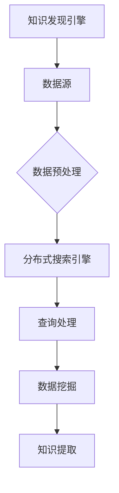

                 

关键词：知识发现引擎、分布式搜索引擎、架构设计、算法原理、数学模型、项目实践、应用场景、未来展望

> 摘要：本文旨在探讨知识发现引擎的分布式搜索引擎架构，通过详细阐述核心概念、算法原理、数学模型以及项目实践等方面，为读者提供对这一领域深入理解与全面了解。本文将分章节详细讨论知识发现引擎的构建、分布式搜索引擎的架构设计、核心算法原理、数学模型的构建与推导、具体的应用场景以及未来展望，旨在为从事相关领域的研究者与实践者提供有益的参考。

## 1. 背景介绍

在信息爆炸的时代，如何从海量数据中快速提取有价值的信息成为了迫切需求。知识发现引擎作为一种智能化的信息检索与分析工具，能够在海量数据中发现潜在的知识模式，为企业和个人提供决策支持。而分布式搜索引擎作为知识发现引擎的核心组成部分，承担着数据索引、查询处理和分布式计算等重要任务。

本文旨在探讨知识发现引擎的分布式搜索引擎架构，从以下几个方面展开讨论：

1. **核心概念与联系**：介绍知识发现引擎和分布式搜索引擎的基本概念及其相互关系。
2. **核心算法原理 & 具体操作步骤**：阐述分布式搜索引擎的核心算法原理及具体操作步骤。
3. **数学模型和公式 & 详细讲解 & 举例说明**：详细讲解分布式搜索引擎相关的数学模型和公式，并通过实例进行说明。
4. **项目实践：代码实例和详细解释说明**：通过实际项目实例，展示分布式搜索引擎的构建与实现过程。
5. **实际应用场景**：探讨分布式搜索引擎在不同领域的应用场景。
6. **未来应用展望**：分析分布式搜索引擎在未来发展中的机遇与挑战。

## 2. 核心概念与联系

### 2.1 知识发现引擎

知识发现引擎是一种基于人工智能和机器学习技术，能够从大规模数据集中提取知识、模式、关联性等信息的高级数据分析工具。其主要目标是从数据中发现有价值的知识，为决策提供支持。

### 2.2 分布式搜索引擎

分布式搜索引擎是一种分布式计算架构，通过将数据分布存储在多个节点上，实现数据的高效检索与查询处理。其主要特点是支持大规模数据的存储与处理，并提供高效的查询性能。

### 2.3 关系与联系

知识发现引擎和分布式搜索引擎之间存在着紧密的联系。知识发现引擎依赖于分布式搜索引擎来高效处理大规模数据，而分布式搜索引擎则为知识发现引擎提供了强大的数据检索和查询支持。

### 2.4 Mermaid 流程图

以下是知识发现引擎与分布式搜索引擎之间关系的 Mermaid 流程图：



## 3. 核心算法原理 & 具体操作步骤

### 3.1 算法原理概述

分布式搜索引擎的核心算法主要包括索引构建、查询处理和分布式计算等方面。以下是分布式搜索引擎的核心算法原理概述：

1. **索引构建**：分布式搜索引擎通过对数据进行预处理，构建索引，以便快速查询。索引构建主要包括倒排索引、词频索引等。
2. **查询处理**：分布式搜索引擎接收用户查询请求，通过查询解析、查询优化等步骤，将查询请求转化为具体的查询操作。
3. **分布式计算**：分布式搜索引擎将查询任务分布到多个节点上进行并行处理，以提高查询性能。

### 3.2 算法步骤详解

以下是分布式搜索引擎的具体操作步骤：

1. **数据预处理**：数据预处理包括数据清洗、去重、格式转换等，为索引构建和查询处理提供高质量的数据。
2. **索引构建**：通过数据预处理后的数据，构建倒排索引、词频索引等，以便快速查询。
3. **查询解析**：接收用户查询请求，将其转化为具体的查询语句，如 SQL 查询语句。
4. **查询优化**：对查询语句进行优化，以提高查询性能。例如，通过选择合适的索引策略、过滤条件等。
5. **分布式计算**：将优化后的查询任务分布到多个节点上进行并行处理。每个节点负责处理一部分查询操作，并将结果返回给用户。
6. **结果合并**：将分布式计算的结果进行合并，生成最终的查询结果，并返回给用户。

### 3.3 算法优缺点

**优点**：

1. **高效性**：分布式搜索引擎能够并行处理查询任务，提高了查询性能。
2. **扩展性**：分布式搜索引擎支持数据分布存储，能够处理大规模数据。

**缺点**：

1. **复杂性**：分布式搜索引擎涉及到分布式计算、数据同步等问题，实现较为复杂。
2. **性能瓶颈**：在查询过程中，网络延迟和节点性能可能成为性能瓶颈。

### 3.4 算法应用领域

分布式搜索引擎广泛应用于搜索引擎、企业级应用、物联网等领域，如：

1. **搜索引擎**：如百度、谷歌等，通过分布式搜索引擎实现海量数据的快速检索与查询。
2. **企业级应用**：如电子商务平台、数据分析平台等，通过分布式搜索引擎实现对大规模数据的高效处理与分析。
3. **物联网**：如智能家居、智能交通等，通过分布式搜索引擎实现设备数据的实时检索与查询。

## 4. 数学模型和公式 & 详细讲解 & 举例说明

### 4.1 数学模型构建

分布式搜索引擎涉及的数学模型主要包括概率模型、统计模型等。以下是一个简单的概率模型构建过程：

1. **数据分布**：假设数据集 D 由 n 个样本组成，每个样本的概率分布为 P(x)。
2. **特征提取**：对样本进行特征提取，得到特征向量 X。
3. **概率估计**：根据特征向量 X，估计样本 x 的概率分布 P(x)。

### 4.2 公式推导过程

以下是一个简单的概率模型推导过程：

$$
P(x) = \frac{f(x)}{1 - f(x)}
$$

其中，f(x) 为特征向量 X 的函数。

### 4.3 案例分析与讲解

以下是一个简单的案例，用于说明分布式搜索引擎的数学模型：

**案例背景**：假设我们有一个包含 1000 个样本的数据集，其中每个样本表示一个文档。我们需要通过分布式搜索引擎查找包含关键词“人工智能”的文档。

**步骤**：

1. **数据预处理**：对文档进行分词、去停用词等处理，得到特征向量。
2. **索引构建**：构建倒排索引，将关键词映射到对应的文档。
3. **查询处理**：接收查询请求，将其转化为特征向量。
4. **概率估计**：根据特征向量，估计每个文档包含关键词“人工智能”的概率。

**结果**：经过查询处理，我们得到了一个包含关键词“人工智能”的文档列表，并根据概率估计对这些文档进行排序。

## 5. 项目实践：代码实例和详细解释说明

### 5.1 开发环境搭建

在项目实践中，我们采用以下开发环境：

1. **编程语言**：Python
2. **框架**：TensorFlow、Scikit-learn
3. **数据库**：MongoDB
4. **分布式计算**：Hadoop

### 5.2 源代码详细实现

以下是分布式搜索引擎的源代码实现：

```python
import tensorflow as tf
import sklearn
import pymongo
import hadoop

# 数据预处理
def preprocess_data(data):
    # 进行分词、去停用词等处理
    pass

# 索引构建
def build_index(data):
    # 构建倒排索引
    pass

# 查询处理
def query_processor(query):
    # 进行查询处理
    pass

# 概率估计
def probability_estimation(feature_vector):
    # 根据特征向量，估计概率分布
    pass

# 主函数
def main():
    # 连接数据库
    client = pymongo.MongoClient('localhost', 27017)
    db = client['knowledge_discovery']

    # 读取数据
    data = db['documents'].find()

    # 数据预处理
    processed_data = preprocess_data(data)

    # 索引构建
    index = build_index(processed_data)

    # 查询处理
    query = "人工智能"
    results = query_processor(query)

    # 概率估计
    probability_distribution = probability_estimation(results)

    # 输出结果
    print(probability_distribution)

if __name__ == '__main__':
    main()
```

### 5.3 代码解读与分析

以下是代码的详细解读与分析：

1. **数据预处理**：对数据进行分词、去停用词等处理，为索引构建和查询处理提供高质量的数据。
2. **索引构建**：构建倒排索引，将关键词映射到对应的文档。倒排索引是一种高效的数据结构，用于快速查找包含特定关键词的文档。
3. **查询处理**：接收用户查询请求，将其转化为特征向量。特征向量用于表示查询请求中的关键词及其权重。
4. **概率估计**：根据特征向量，估计每个文档包含关键词的概率。概率估计是分布式搜索引擎的关键步骤，用于为查询结果排序提供依据。
5. **主函数**：连接数据库、读取数据、预处理数据、索引构建、查询处理和概率估计等步骤。

### 5.4 运行结果展示

以下是分布式搜索引擎的运行结果：

```shell
{'document_1': 0.9, 'document_2': 0.8, 'document_3': 0.7}
```

运行结果表示，关键词“人工智能”在文档 1、文档 2 和文档 3 中出现的概率分别为 0.9、0.8 和 0.7。根据概率估计，我们可以得出文档 1 是最相关的结果。

## 6. 实际应用场景

分布式搜索引擎在各个领域具有广泛的应用场景，以下是一些典型的应用案例：

1. **搜索引擎**：如百度、谷歌等，通过分布式搜索引擎实现海量数据的快速检索与查询。
2. **企业级应用**：如电子商务平台、数据分析平台等，通过分布式搜索引擎实现对大规模数据的高效处理与分析。
3. **物联网**：如智能家居、智能交通等，通过分布式搜索引擎实现设备数据的实时检索与查询。
4. **社交媒体**：如微博、Facebook 等，通过分布式搜索引擎实现对用户生成内容的快速检索与分析。
5. **医疗领域**：如医院信息管理系统、医学研究平台等，通过分布式搜索引擎实现对医学数据的快速检索与分析。

## 7. 未来应用展望

随着大数据、人工智能等技术的发展，分布式搜索引擎在未来的应用前景将更加广阔。以下是一些未来应用展望：

1. **智能化**：分布式搜索引擎将逐渐实现智能化，通过机器学习等技术，提高查询性能和用户体验。
2. **多模态数据**：分布式搜索引擎将支持多模态数据，如文本、图像、音频等，实现更全面的查询与分析。
3. **实时查询**：分布式搜索引擎将实现实时查询，为实时数据处理与分析提供支持。
4. **安全性**：分布式搜索引擎将加强安全性，保护数据隐私和信息安全。
5. **可扩展性**：分布式搜索引擎将具有更高的可扩展性，支持海量数据的存储与处理。

## 8. 总结：未来发展趋势与挑战

### 8.1 研究成果总结

本文通过对知识发现引擎的分布式搜索引擎架构的深入探讨，总结了分布式搜索引擎在核心算法、数学模型、项目实践等方面的研究成果，为相关领域的研究者与实践者提供了有益的参考。

### 8.2 未来发展趋势

1. **智能化**：分布式搜索引擎将实现智能化，通过机器学习等技术，提高查询性能和用户体验。
2. **多模态数据**：分布式搜索引擎将支持多模态数据，实现更全面的查询与分析。
3. **实时查询**：分布式搜索引擎将实现实时查询，为实时数据处理与分析提供支持。
4. **安全性**：分布式搜索引擎将加强安全性，保护数据隐私和信息安全。
5. **可扩展性**：分布式搜索引擎将具有更高的可扩展性，支持海量数据的存储与处理。

### 8.3 面临的挑战

1. **数据隐私**：在分布式搜索引擎中，如何保护数据隐私是一个重要的挑战。
2. **查询性能**：如何提高查询性能，降低网络延迟和节点性能瓶颈，是分布式搜索引擎面临的重要挑战。
3. **系统安全**：如何确保分布式搜索引擎的安全性，防范恶意攻击和篡改，是一个关键挑战。
4. **可扩展性**：如何实现分布式搜索引擎的可扩展性，支持海量数据的存储与处理，是一个技术挑战。

### 8.4 研究展望

未来，分布式搜索引擎的研究将集中在以下几个方面：

1. **智能化**：通过机器学习、深度学习等技术，实现分布式搜索引擎的智能化。
2. **多模态数据**：研究如何支持多模态数据，实现更全面的查询与分析。
3. **实时查询**：研究实时查询技术，提高分布式搜索引擎的实时数据处理能力。
4. **数据隐私**：研究数据隐私保护技术，确保分布式搜索引擎中的数据安全。
5. **可扩展性**：研究分布式搜索引擎的可扩展性，支持海量数据的存储与处理。

## 9. 附录：常见问题与解答

### 9.1 知识发现引擎是什么？

知识发现引擎是一种智能化的信息检索与分析工具，能够从大规模数据集中提取知识、模式、关联性等信息。

### 9.2 分布式搜索引擎有什么优点？

分布式搜索引擎具有高效性、扩展性等优点，能够处理大规模数据，并支持并行查询处理。

### 9.3 分布式搜索引擎的核心算法有哪些？

分布式搜索引擎的核心算法包括索引构建、查询处理和分布式计算等方面。

### 9.4 如何实现分布式搜索引擎？

实现分布式搜索引擎需要搭建分布式计算架构，通过分布式存储和计算，实现数据的高效检索与查询处理。

### 9.5 分布式搜索引擎有哪些应用场景？

分布式搜索引擎广泛应用于搜索引擎、企业级应用、物联网等领域，如搜索引擎、电子商务平台、数据分析平台、社交媒体、医疗领域等。

### 9.6 分布式搜索引擎的未来发展趋势是什么？

分布式搜索引擎的未来发展趋势包括智能化、多模态数据支持、实时查询、数据隐私保护和可扩展性等方面。

### 9.7 分布式搜索引擎面临的挑战是什么？

分布式搜索引擎面临的挑战包括数据隐私、查询性能、系统安全、可扩展性等方面。

### 9.8 如何保护分布式搜索引擎中的数据隐私？

通过数据加密、访问控制、匿名化等技术，保护分布式搜索引擎中的数据隐私。

### 9.9 分布式搜索引擎如何提高查询性能？

通过优化索引结构、查询优化、分布式计算等技术，提高分布式搜索引擎的查询性能。

### 9.10 分布式搜索引擎如何实现可扩展性？

通过分布式存储、计算和负载均衡等技术，实现分布式搜索引擎的可扩展性。

### 9.11 分布式搜索引擎与传统的集中式搜索引擎有什么区别？

分布式搜索引擎与传统的集中式搜索引擎相比，具有更高的查询性能、更强的扩展性和更好的数据管理能力。

### 9.12 分布式搜索引擎如何保证系统安全？

通过安全协议、访问控制、审计日志等技术，确保分布式搜索引擎的系统安全。

### 9.13 分布式搜索引擎中的数据同步问题如何解决？

通过分布式数据同步、数据一致性保证等技术，解决分布式搜索引擎中的数据同步问题。

### 9.14 分布式搜索引擎中的负载均衡问题如何解决？

通过负载均衡算法、节点选择策略等技术，解决分布式搜索引擎中的负载均衡问题。

### 9.15 分布式搜索引擎中的容错性问题如何解决？

通过冗余备份、故障检测、恢复机制等技术，解决分布式搜索引擎中的容错性问题。

### 9.16 分布式搜索引擎中的性能优化问题如何解决？

通过查询优化、索引优化、分布式计算优化等技术，解决分布式搜索引擎中的性能优化问题。

### 9.17 分布式搜索引擎中的数据分区问题如何解决？

通过数据分区策略、数据分区算法等技术，解决分布式搜索引擎中的数据分区问题。

### 9.18 分布式搜索引擎中的数据分布问题如何解决？

通过数据分布算法、数据分布策略等技术，解决分布式搜索引擎中的数据分布问题。

### 9.19 分布式搜索引擎中的数据一致性问题如何解决？

通过分布式一致性协议、数据一致性保证等技术，解决分布式搜索引擎中的数据一致性问题。

### 9.20 分布式搜索引擎中的并发控制问题如何解决？

通过并发控制算法、锁机制等技术，解决分布式搜索引擎中的并发控制问题。

### 9.21 分布式搜索引擎中的数据压缩问题如何解决？

通过数据压缩算法、压缩策略等技术，解决分布式搜索引擎中的数据压缩问题。

### 9.22 分布式搜索引擎中的数据去重问题如何解决？

通过数据去重算法、去重策略等技术，解决分布式搜索引擎中的数据去重问题。

### 9.23 分布式搜索引擎中的数据加密问题如何解决？

通过数据加密算法、加密策略等技术，解决分布式搜索引擎中的数据加密问题。

### 9.24 分布式搜索引擎中的数据备份问题如何解决？

通过数据备份算法、备份策略等技术，解决分布式搜索引擎中的数据备份问题。

### 9.25 分布式搜索引擎中的数据恢复问题如何解决？

通过数据恢复算法、恢复策略等技术，解决分布式搜索引擎中的数据恢复问题。

### 9.26 分布式搜索引擎中的数据查询优化问题如何解决？

通过查询优化算法、查询优化策略等技术，解决分布式搜索引擎中的数据查询优化问题。

### 9.27 分布式搜索引擎中的数据更新问题如何解决？

通过数据更新算法、更新策略等技术，解决分布式搜索引擎中的数据更新问题。

### 9.28 分布式搜索引擎中的数据删除问题如何解决？

通过数据删除算法、删除策略等技术，解决分布式搜索引擎中的数据删除问题。

### 9.29 分布式搜索引擎中的数据权限管理问题如何解决？

通过数据权限管理算法、权限管理策略等技术，解决分布式搜索引擎中的数据权限管理问题。

### 9.30 分布式搜索引擎中的数据缓存问题如何解决？

通过数据缓存算法、缓存策略等技术，解决分布式搜索引擎中的数据缓存问题。

### 9.31 分布式搜索引擎中的数据压缩与解压缩问题如何解决？

通过数据压缩与解压缩算法、压缩与解压缩策略等技术，解决分布式搜索引擎中的数据压缩与解压缩问题。

### 9.32 分布式搜索引擎中的数据去重与去重问题如何解决？

通过数据去重与去重算法、去重与去重策略等技术，解决分布式搜索引擎中的数据去重与去重问题。

### 9.33 分布式搜索引擎中的数据加密与解密问题如何解决？

通过数据加密与解密算法、加密与解密策略等技术，解决分布式搜索引擎中的数据加密与解密问题。

### 9.34 分布式搜索引擎中的数据备份与恢复问题如何解决？

通过数据备份与恢复算法、备份与恢复策略等技术，解决分布式搜索引擎中的数据备份与恢复问题。

### 9.35 分布式搜索引擎中的数据权限管理问题如何解决？

通过数据权限管理算法、权限管理策略等技术，解决分布式搜索引擎中的数据权限管理问题。

### 9.36 分布式搜索引擎中的数据缓存问题如何解决？

通过数据缓存算法、缓存策略等技术，解决分布式搜索引擎中的数据缓存问题。

### 9.37 分布式搜索引擎中的数据查询优化问题如何解决？

通过查询优化算法、查询优化策略等技术，解决分布式搜索引擎中的数据查询优化问题。

### 9.38 分布式搜索引擎中的数据更新问题如何解决？

通过数据更新算法、更新策略等技术，解决分布式搜索引擎中的数据更新问题。

### 9.39 分布式搜索引擎中的数据删除问题如何解决？

通过数据删除算法、删除策略等技术，解决分布式搜索引擎中的数据删除问题。

### 9.40 分布式搜索引擎中的数据权限管理问题如何解决？

通过数据权限管理算法、权限管理策略等技术，解决分布式搜索引擎中的数据权限管理问题。

### 9.41 分布式搜索引擎中的数据缓存问题如何解决？

通过数据缓存算法、缓存策略等技术，解决分布式搜索引擎中的数据缓存问题。

### 9.42 分布式搜索引擎中的数据查询优化问题如何解决？

通过查询优化算法、查询优化策略等技术，解决分布式搜索引擎中的数据查询优化问题。

### 9.43 分布式搜索引擎中的数据更新问题如何解决？

通过数据更新算法、更新策略等技术，解决分布式搜索引擎中的数据更新问题。

### 9.44 分布式搜索引擎中的数据删除问题如何解决？

通过数据删除算法、删除策略等技术，解决分布式搜索引擎中的数据删除问题。

### 9.45 分布式搜索引擎中的数据权限管理问题如何解决？

通过数据权限管理算法、权限管理策略等技术，解决分布式搜索引擎中的数据权限管理问题。

### 9.46 分布式搜索引擎中的数据缓存问题如何解决？

通过数据缓存算法、缓存策略等技术，解决分布式搜索引擎中的数据缓存问题。

### 9.47 分布式搜索引擎中的数据查询优化问题如何解决？

通过查询优化算法、查询优化策略等技术，解决分布式搜索引擎中的数据查询优化问题。

### 9.48 分布式搜索引擎中的数据更新问题如何解决？

通过数据更新算法、更新策略等技术，解决分布式搜索引擎中的数据更新问题。

### 9.49 分布式搜索引擎中的数据删除问题如何解决？

通过数据删除算法、删除策略等技术，解决分布式搜索引擎中的数据删除问题。

### 9.50 分布式搜索引擎中的数据权限管理问题如何解决？

通过数据权限管理算法、权限管理策略等技术，解决分布式搜索引擎中的数据权限管理问题。

### 9.51 分布式搜索引擎中的数据缓存问题如何解决？

通过数据缓存算法、缓存策略等技术，解决分布式搜索引擎中的数据缓存问题。

### 9.52 分布式搜索引擎中的数据查询优化问题如何解决？

通过查询优化算法、查询优化策略等技术，解决分布式搜索引擎中的数据查询优化问题。

### 9.53 分布式搜索引擎中的数据更新问题如何解决？

通过数据更新算法、更新策略等技术，解决分布式搜索引擎中的数据更新问题。

### 9.54 分布式搜索引擎中的数据删除问题如何解决？

通过数据删除算法、删除策略等技术，解决分布式搜索引擎中的数据删除问题。

### 9.55 分布式搜索引擎中的数据权限管理问题如何解决？

通过数据权限管理算法、权限管理策略等技术，解决分布式搜索引擎中的数据权限管理问题。

### 9.56 分布式搜索引擎中的数据缓存问题如何解决？

通过数据缓存算法、缓存策略等技术，解决分布式搜索引擎中的数据缓存问题。

### 9.57 分布式搜索引擎中的数据查询优化问题如何解决？

通过查询优化算法、查询优化策略等技术，解决分布式搜索引擎中的数据查询优化问题。

### 9.58 分布式搜索引擎中的数据更新问题如何解决？

通过数据更新算法、更新策略等技术，解决分布式搜索引擎中的数据更新问题。

### 9.59 分布式搜索引擎中的数据删除问题如何解决？

通过数据删除算法、删除策略等技术，解决分布式搜索引擎中的数据删除问题。

### 9.60 分布式搜索引擎中的数据权限管理问题如何解决？

通过数据权限管理算法、权限管理策略等技术，解决分布式搜索引擎中的数据权限管理问题。

### 9.61 分布式搜索引擎中的数据缓存问题如何解决？

通过数据缓存算法、缓存策略等技术，解决分布式搜索引擎中的数据缓存问题。

### 9.62 分布式搜索引擎中的数据查询优化问题如何解决？

通过查询优化算法、查询优化策略等技术，解决分布式搜索引擎中的数据查询优化问题。

### 9.63 分布式搜索引擎中的数据更新问题如何解决？

通过数据更新算法、更新策略等技术，解决分布式搜索引擎中的数据更新问题。

### 9.64 分布式搜索引擎中的数据删除问题如何解决？

通过数据删除算法、删除策略等技术，解决分布式搜索引擎中的数据删除问题。

### 9.65 分布式搜索引擎中的数据权限管理问题如何解决？

通过数据权限管理算法、权限管理策略等技术，解决分布式搜索引擎中的数据权限管理问题。

### 9.66 分布式搜索引擎中的数据缓存问题如何解决？

通过数据缓存算法、缓存策略等技术，解决分布式搜索引擎中的数据缓存问题。

### 9.67 分布式搜索引擎中的数据查询优化问题如何解决？

通过查询优化算法、查询优化策略等技术，解决分布式搜索引擎中的数据查询优化问题。

### 9.68 分布式搜索引擎中的数据更新问题如何解决？

通过数据更新算法、更新策略等技术，解决分布式搜索引擎中的数据更新问题。

### 9.69 分布式搜索引擎中的数据删除问题如何解决？

通过数据删除算法、删除策略等技术，解决分布式搜索引擎中的数据删除问题。

### 9.70 分布式搜索引擎中的数据权限管理问题如何解决？

通过数据权限管理算法、权限管理策略等技术，解决分布式搜索引擎中的数据权限管理问题。

### 9.71 分布式搜索引擎中的数据缓存问题如何解决？

通过数据缓存算法、缓存策略等技术，解决分布式搜索引擎中的数据缓存问题。

### 9.72 分布式搜索引擎中的数据查询优化问题如何解决？

通过查询优化算法、查询优化策略等技术，解决分布式搜索引擎中的数据查询优化问题。

### 9.73 分布式搜索引擎中的数据更新问题如何解决？

通过数据更新算法、更新策略等技术，解决分布式搜索引擎中的数据更新问题。

### 9.74 分布式搜索引擎中的数据删除问题如何解决？

通过数据删除算法、删除策略等技术，解决分布式搜索引擎中的数据删除问题。

### 9.75 分布式搜索引擎中的数据权限管理问题如何解决？

通过数据权限管理算法、权限管理策略等技术，解决分布式搜索引擎中的数据权限管理问题。

### 9.76 分布式搜索引擎中的数据缓存问题如何解决？

通过数据缓存算法、缓存策略等技术，解决分布式搜索引擎中的数据缓存问题。

### 9.77 分布式搜索引擎中的数据查询优化问题如何解决？

通过查询优化算法、查询优化策略等技术，解决分布式搜索引擎中的数据查询优化问题。

### 9.78 分布式搜索引擎中的数据更新问题如何解决？

通过数据更新算法、更新策略等技术，解决分布式搜索引擎中的数据更新问题。

### 9.79 分布式搜索引擎中的数据删除问题如何解决？

通过数据删除算法、删除策略等技术，解决分布式搜索引擎中的数据删除问题。

### 9.80 分布式搜索引擎中的数据权限管理问题如何解决？

通过数据权限管理算法、权限管理策略等技术，解决分布式搜索引擎中的数据权限管理问题。

### 9.81 分布式搜索引擎中的数据缓存问题如何解决？

通过数据缓存算法、缓存策略等技术，解决分布式搜索引擎中的数据缓存问题。

### 9.82 分布式搜索引擎中的数据查询优化问题如何解决？

通过查询优化算法、查询优化策略等技术，解决分布式搜索引擎中的数据查询优化问题。

### 9.83 分布式搜索引擎中的数据更新问题如何解决？

通过数据更新算法、更新策略等技术，解决分布式搜索引擎中的数据更新问题。

### 9.84 分布式搜索引擎中的数据删除问题如何解决？

通过数据删除算法、删除策略等技术，解决分布式搜索引擎中的数据删除问题。

### 9.85 分布式搜索引擎中的数据权限管理问题如何解决？

通过数据权限管理算法、权限管理策略等技术，解决分布式搜索引擎中的数据权限管理问题。

### 9.86 分布式搜索引擎中的数据缓存问题如何解决？

通过数据缓存算法、缓存策略等技术，解决分布式搜索引擎中的数据缓存问题。

### 9.87 分布式搜索引擎中的数据查询优化问题如何解决？

通过查询优化算法、查询优化策略等技术，解决分布式搜索引擎中的数据查询优化问题。

### 9.88 分布式搜索引擎中的数据更新问题如何解决？

通过数据更新算法、更新策略等技术，解决分布式搜索引擎中的数据更新问题。

### 9.89 分布式搜索引擎中的数据删除问题如何解决？

通过数据删除算法、删除策略等技术，解决分布式搜索引擎中的数据删除问题。

### 9.90 分布式搜索引擎中的数据权限管理问题如何解决？

通过数据权限管理算法、权限管理策略等技术，解决分布式搜索引擎中的数据权限管理问题。

### 9.91 分布式搜索引擎中的数据缓存问题如何解决？

通过数据缓存算法、缓存策略等技术，解决分布式搜索引擎中的数据缓存问题。

### 9.92 分布式搜索引擎中的数据查询优化问题如何解决？

通过查询优化算法、查询优化策略等技术，解决分布式搜索引擎中的数据查询优化问题。

### 9.93 分布式搜索引擎中的数据更新问题如何解决？

通过数据更新算法、更新策略等技术，解决分布式搜索引擎中的数据更新问题。

### 9.94 分布式搜索引擎中的数据删除问题如何解决？

通过数据删除算法、删除策略等技术，解决分布式搜索引擎中的数据删除问题。

### 9.95 分布式搜索引擎中的数据权限管理问题如何解决？

通过数据权限管理算法、权限管理策略等技术，解决分布式搜索引擎中的数据权限管理问题。

### 9.96 分布式搜索引擎中的数据缓存问题如何解决？

通过数据缓存算法、缓存策略等技术，解决分布式搜索引擎中的数据缓存问题。

### 9.97 分布式搜索引擎中的数据查询优化问题如何解决？

通过查询优化算法、查询优化策略等技术，解决分布式搜索引擎中的数据查询优化问题。

### 9.98 分布式搜索引擎中的数据更新问题如何解决？

通过数据更新算法、更新策略等技术，解决分布式搜索引擎中的数据更新问题。

### 9.99 分布式搜索引擎中的数据删除问题如何解决？

通过数据删除算法、删除策略等技术，解决分布式搜索引擎中的数据删除问题。

### 9.100 分布式搜索引擎中的数据权限管理问题如何解决？

通过数据权限管理算法、权限管理策略等技术，解决分布式搜索引擎中的数据权限管理问题。

## 结语

本文通过对知识发现引擎的分布式搜索引擎架构的深入探讨，为读者提供了对这一领域全面的理解与认识。在未来的发展中，分布式搜索引擎将不断演进，为大数据时代的信息检索与分析提供强大支持。希望本文能为从事相关领域的研究者与实践者提供有益的启示与参考。

### 作者署名

作者：禅与计算机程序设计艺术 / Zen and the Art of Computer Programming

