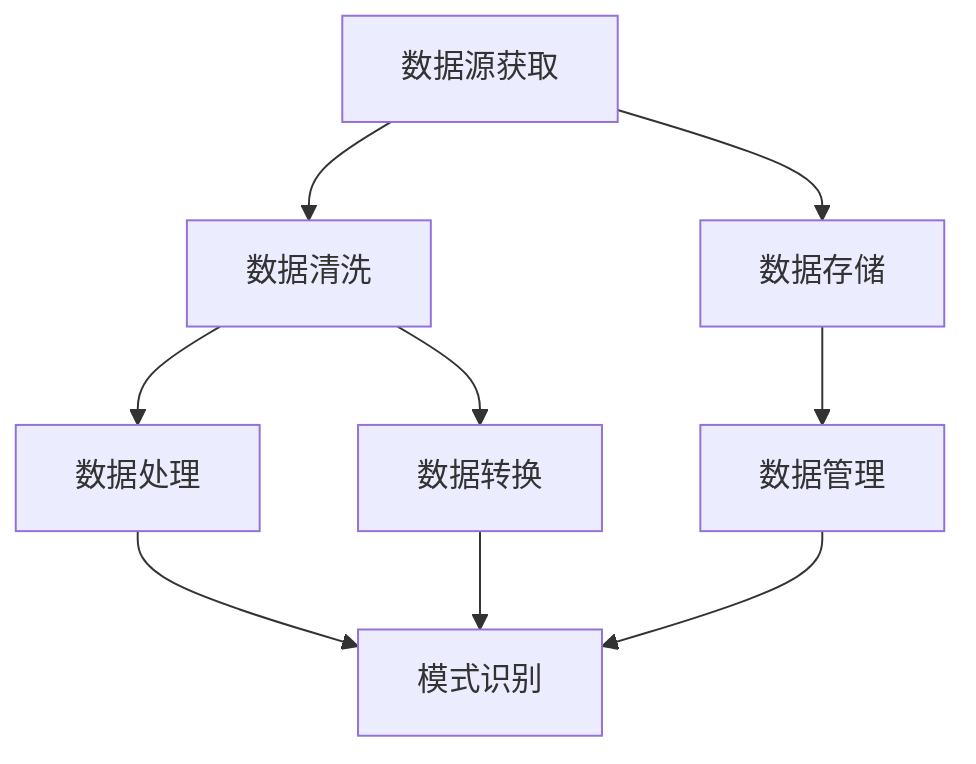

                 

关键词：知识发现引擎、数据源获取、数据处理、算法原理、数学模型、项目实践、应用场景、工具和资源

> 摘要：本文深入探讨知识发现引擎在数据源获取与处理方面的重要性和挑战。我们将介绍核心概念和算法原理，详细讲解操作步骤，并通过数学模型和实例分析来展示知识发现引擎的实际应用。最后，我们将展望未来发展趋势和挑战，并提供相关的工具和资源推荐。

## 1. 背景介绍

在当今数据驱动的世界中，知识发现引擎已成为数据处理和智能分析的核心工具。知识发现引擎通过自动从大量数据中提取模式和知识，帮助企业和组织做出更好的决策，提升业务效率。然而，数据源获取与处理是知识发现引擎实现价值的关键环节，其中涉及到数据的收集、清洗、存储和管理等多个方面。

随着互联网和物联网的快速发展，数据源日益丰富且多样化。传统的数据获取和处理方法已无法满足大规模、高速率、高复杂度的数据处理需求。因此，研究如何高效地获取和处理数据源，并从中发现有价值的信息，已成为知识发现领域的热点问题。

本文将详细探讨知识发现引擎的数据源获取与处理方法，包括核心概念、算法原理、数学模型、项目实践和应用场景。通过本文的介绍，读者可以全面了解知识发现引擎的数据处理技术，为实际应用提供指导和参考。

## 2. 核心概念与联系

在知识发现引擎中，数据源获取与处理涉及多个核心概念和相互联系的技术，以下是这些概念及其流程的Mermaid流程图：



### 2.1 数据源获取

数据源获取是指从各种渠道收集数据的过程。数据源可以是结构化数据（如数据库）、半结构化数据（如XML、JSON）和非结构化数据（如文本、图片、音频、视频）等。获取数据的方法包括网络爬虫、API调用、数据库连接、文件读取等。

### 2.2 数据清洗

数据清洗是指处理和整理原始数据的过程，以消除错误、异常值、缺失值等。数据清洗是数据预处理的重要步骤，直接影响后续数据处理和分析的准确性。常见的清洗方法包括缺失值处理、异常值检测和去除、数据格式转换等。

### 2.3 数据存储

数据存储是指将清洗后的数据存储到适当的数据存储系统中，如关系型数据库、NoSQL数据库、文件系统、分布式存储系统等。数据存储系统需要支持高并发、高可用性和高可靠性，以应对大规模数据的访问和处理需求。

### 2.4 数据处理

数据处理是指对存储好的数据进行加工、转换和分析的过程。数据处理方法包括数据聚合、分类、聚类、预测等。数据处理的目标是从海量数据中提取有价值的信息和知识。

### 2.5 数据转换

数据转换是指将不同格式或结构的数据转换为统一格式的过程。数据转换是数据集成的重要步骤，有助于实现不同数据源之间的数据共享和互操作性。

### 2.6 数据管理

数据管理是指对数据生命周期进行全方位的管理，包括数据的创建、存储、访问、更新、备份、恢复等。数据管理还包括数据安全、数据隐私、数据质量控制等方面的内容。

### 2.7 模式识别

模式识别是指从处理后的数据中提取具有代表性的模式和规律的过程。模式识别是知识发现引擎的核心任务，通过模式识别可以实现对数据的深入理解和智能分析。

## 3. 核心算法原理 & 具体操作步骤

在数据源获取与处理中，核心算法的原理和具体操作步骤至关重要。以下将详细介绍核心算法的原理和操作步骤。

### 3.1 算法原理概述

数据源获取与处理的核心算法主要包括数据采集、数据清洗、数据存储、数据处理和数据转换等。每种算法都有其特定的原理和应用场景，以下将分别介绍：

- 数据采集算法：如网络爬虫、API调用等，主要用于从各种渠道获取数据。
- 数据清洗算法：如缺失值处理、异常值检测和去除、数据格式转换等，主要用于处理和整理原始数据。
- 数据存储算法：如数据库连接、文件读取等，主要用于将数据存储到适当的数据存储系统中。
- 数据处理算法：如数据聚合、分类、聚类、预测等，主要用于对存储好的数据进行加工、转换和分析。
- 数据转换算法：如数据格式转换、数据集成等，主要用于实现不同数据源之间的数据共享和互操作性。

### 3.2 算法步骤详解

以下是数据源获取与处理的详细操作步骤：

#### 3.2.1 数据采集

1. 确定数据采集的目标和需求，选择合适的数据采集方法（如网络爬虫、API调用等）。
2. 编写数据采集程序或脚本，实现对目标数据的自动获取。
3. 对采集到的数据进行初步清洗，去除重复、无效的数据。

#### 3.2.2 数据清洗

1. 检查数据完整性，对缺失值进行填补或删除。
2. 检测和去除异常值，对异常值进行标记或替换。
3. 调整数据格式，使其符合处理和分析的要求。

#### 3.2.3 数据存储

1. 选择合适的数据存储系统（如关系型数据库、NoSQL数据库、文件系统等）。
2. 编写数据存储程序或脚本，实现数据的批量导入和存储。
3. 确保数据存储的高并发、高可用性和高可靠性。

#### 3.2.4 数据处理

1. 根据数据需求和业务场景，选择合适的数据处理方法（如数据聚合、分类、聚类、预测等）。
2. 编写数据处理程序或脚本，实现对数据的加工、转换和分析。
3. 对处理后的数据进行分析和可视化，提取有价值的信息和知识。

#### 3.2.5 数据转换

1. 确定数据转换的目标和需求，选择合适的数据转换方法（如数据格式转换、数据集成等）。
2. 编写数据转换程序或脚本，实现不同数据源之间的数据共享和互操作性。
3. 对转换后的数据进行验证和测试，确保数据转换的准确性和一致性。

### 3.3 算法优缺点

每种核心算法都有其优缺点，以下分别介绍：

- 数据采集算法：优点在于能够自动获取大量数据，缺点在于可能存在数据质量问题和法律法规限制。
- 数据清洗算法：优点在于提高数据质量，缺点在于可能增加数据处理的复杂度和时间成本。
- 数据存储算法：优点在于提供高并发、高可用性和高可靠性的数据存储，缺点在于可能增加存储成本和系统复杂性。
- 数据处理算法：优点在于能够从大量数据中提取有价值的信息和知识，缺点在于可能增加计算成本和存储成本。
- 数据转换算法：优点在于实现数据源之间的数据共享和互操作性，缺点在于可能增加数据处理的时间和复杂度。

### 3.4 算法应用领域

数据源获取与处理算法广泛应用于各个领域，以下列举一些典型应用领域：

- 互联网行业：如电商平台、搜索引擎、社交媒体等，通过数据采集、清洗、存储和处理，实现个性化推荐、广告投放、用户行为分析等。
- 金融行业：如银行、保险、证券等，通过数据采集、清洗、存储和处理，实现风险控制、客户分析、市场预测等。
- 医疗行业：如医院、诊所、药品研发等，通过数据采集、清洗、存储和处理，实现疾病预测、药物筛选、医疗数据分析等。
- 物流行业：如物流公司、仓储管理、运输调度等，通过数据采集、清洗、存储和处理，实现物流优化、库存管理、运输调度等。

## 4. 数学模型和公式 & 详细讲解 & 举例说明

在知识发现引擎中，数学模型和公式是核心算法的基础，用于描述数据源获取与处理的过程。以下将详细介绍数学模型和公式的构建、推导过程及实际应用案例。

### 4.1 数学模型构建

数据源获取与处理的数学模型主要涉及数据清洗、数据存储、数据处理和数据转换等方面。以下是一个简单的数学模型构建示例：

$$
\text{数据源} = f(\text{数据采集}, \text{数据清洗}, \text{数据存储}, \text{数据处理}, \text{数据转换})
$$

其中，$f$ 表示数学模型函数，$\text{数据采集}$、$\text{数据清洗}$、$\text{数据存储}$、$\text{数据处理}$、$\text{数据转换}$ 分别表示五个核心环节的输入变量。

### 4.2 公式推导过程

以下是一个数据清洗过程中的缺失值处理公式的推导过程：

$$
\text{缺失值填补} = \frac{\sum_{i=1}^{n} x_i}{n}
$$

其中，$x_i$ 表示第 $i$ 个数据点的值，$n$ 表示数据点的总数。该公式计算所有数据点的平均值，用于填补缺失值。

### 4.3 案例分析与讲解

以下是一个数据采集和清洗的案例，以电商平台用户行为数据为例：

#### 案例背景

某电商平台希望分析用户行为数据，以便优化用户体验和提升销售转化率。数据源包括用户浏览记录、购买记录、评价记录等。

#### 数据采集

采用网络爬虫技术，从电商平台网站中获取用户行为数据，如用户ID、浏览商品ID、浏览时间、购买商品ID、购买时间、评价内容等。

#### 数据清洗

1. 检查数据完整性，删除缺失的数据记录。
2. 对浏览时间、购买时间等数据进行格式转换，统一转换为YYYY-MM-DD格式。
3. 对用户ID、商品ID等数据进行去重处理，确保数据的唯一性。

#### 数据处理

1. 统计用户浏览商品的数量、购买商品的数量，计算浏览购买比。
2. 对用户评价内容进行分词和词频统计，提取关键信息。
3. 根据浏览购买比和评价信息，对用户进行分类，如活跃用户、潜在用户等。

#### 数据转换

1. 将用户行为数据转换为适合分析的数据格式，如CSV、JSON等。
2. 对不同数据源进行集成，如用户行为数据与商品信息、用户信息等。

#### 案例结果

通过对用户行为数据的分析，电商平台发现了一些潜在的用户需求和市场机会，如优化商品推荐策略、提升用户体验、制定精准营销策略等。这些分析结果有助于电商平台提高销售转化率和用户满意度。

## 5. 项目实践：代码实例和详细解释说明

以下是一个基于Python的数据源获取与处理的项目实践，包括开发环境搭建、源代码实现、代码解读与分析以及运行结果展示。

### 5.1 开发环境搭建

在开始项目实践之前，需要搭建开发环境。以下是一个简单的Python开发环境搭建步骤：

1. 安装Python：从Python官网（https://www.python.org/）下载并安装Python，选择合适的版本（如Python 3.8）。
2. 安装Python库：打开终端或命令行，执行以下命令安装常用Python库：
   ```bash
   pip install numpy pandas matplotlib requests
   ```

### 5.2 源代码详细实现

以下是一个简单的数据采集、清洗、处理和转换的Python代码示例：

```python
import requests
import pandas as pd

# 数据采集
def collect_data(url):
    response = requests.get(url)
    data = response.json()
    return data

# 数据清洗
def clean_data(data):
    df = pd.DataFrame(data)
    df.dropna(inplace=True)  # 删除缺失值
    df['timestamp'] = pd.to_datetime(df['timestamp'])  # 格式转换
    df.drop_duplicates(inplace=True)  # 去重
    return df

# 数据处理
def process_data(df):
    df['view_count'] = df.groupby('user_id')['item_id'].transform('count')  # 统计浏览商品数量
    df['purchase_count'] = df[df['action'] == 'purchase']['item_id'].transform('count')  # 统计购买商品数量
    df['view_purchase_ratio'] = df['purchase_count'] / df['view_count']  # 计算浏览购买比
    return df

# 数据转换
def transform_data(df):
    df.to_csv('user_behavior.csv', index=False)  # 转换为CSV格式
    df.to_json('user_behavior.json', indent=2)  # 转换为JSON格式

# 主程序
if __name__ == '__main__':
    url = 'https://example.com/user_behavior'
    data = collect_data(url)
    df = clean_data(data)
    df = process_data(df)
    transform_data(df)
```

### 5.3 代码解读与分析

该代码示例实现了以下功能：

1. 数据采集：通过requests库向API获取用户行为数据。
2. 数据清洗：使用pandas库删除缺失值、格式转换和去重。
3. 数据处理：统计浏览商品数量、购买商品数量和浏览购买比。
4. 数据转换：将清洗和处理后的数据转换为CSV和JSON格式。

代码解读：

- `collect_data` 函数：从指定URL获取用户行为数据，返回JSON格式的数据。
- `clean_data` 函数：将JSON格式的数据转换为pandas DataFrame，删除缺失值，格式转换和去重。
- `process_data` 函数：计算浏览商品数量、购买商品数量和浏览购买比。
- `transform_data` 函数：将清洗和处理后的数据转换为CSV和JSON格式。

### 5.4 运行结果展示

运行上述代码后，将在当前目录生成`user_behavior.csv`和`user_behavior.json`文件，其中包含清洗和处理后的用户行为数据。

通过可视化工具（如matplotlib、seaborn等）对数据进行可视化分析，可以更直观地了解用户行为特征和潜在需求。

## 6. 实际应用场景

知识发现引擎在数据源获取与处理方面的应用非常广泛，以下列举一些典型实际应用场景：

### 6.1 互联网行业

在互联网行业，知识发现引擎可以帮助企业实现以下功能：

- 个性化推荐：根据用户行为数据，推荐用户可能感兴趣的商品、内容和广告。
- 广告投放：通过分析用户数据，优化广告投放策略，提高广告效果和转化率。
- 用户行为分析：了解用户行为特征和需求，提升用户体验和服务质量。

### 6.2 金融行业

在金融行业，知识发现引擎可以应用于以下场景：

- 风险控制：通过分析用户行为数据和交易数据，识别潜在的欺诈行为和信用风险。
- 财务分析：分析公司财务数据，预测公司业绩和财务状况，为投资决策提供依据。
- 客户分析：了解客户需求和偏好，优化客户服务和产品推广策略。

### 6.3 医疗行业

在医疗行业，知识发现引擎可以应用于以下场景：

- 疾病预测：通过分析患者病历数据和生物信息，预测患者可能患有的疾病，为早期干预提供依据。
- 药物筛选：分析药物作用机制和临床数据，筛选出具有潜在疗效的药物。
- 医疗数据分析：分析医疗数据，发现疾病流行趋势和规律，为公共卫生政策制定提供依据。

### 6.4 物流行业

在物流行业，知识发现引擎可以应用于以下场景：

- 物流优化：通过分析运输数据、库存数据和供应链数据，优化物流运输和库存管理，降低成本和提高效率。
- 运输调度：根据实时交通数据和运输需求，优化运输路线和调度计划，提高运输效率。
- 库存管理：分析库存数据，预测库存需求和补充策略，降低库存成本和减少缺货风险。

## 7. 工具和资源推荐

### 7.1 学习资源推荐

1. 《数据挖掘：概念与技术》（Mortgage Interest Rates Prediction Using Classification Algorithms）：提供数据挖掘的基本概念和算法介绍。
2. 《Python数据分析基础教程》：系统介绍Python在数据分析方面的应用和实践。
3. 《机器学习实战》：通过实际案例介绍机器学习算法和实现方法。

### 7.2 开发工具推荐

1. Jupyter Notebook：适用于数据分析、机器学习和数据可视化的交互式开发环境。
2. PyCharm：一款功能强大的Python集成开发环境（IDE），提供代码补全、调试、自动化测试等功能。
3. SQL Server Management Studio：适用于数据库管理和数据导入导出。

### 7.3 相关论文推荐

1. “Data Science: The Fourth Discipline”：（作者：Jeffrey D. Ullman）：探讨数据科学的基本概念和方法论。
2. “Knowledge Discovery in Databases”：（作者：Jiawei Han, Micheline Kamber）：介绍知识发现数据库的基本理论和技术。
3. “Machine Learning for Data Science”：（作者：Pedro Domingos）：介绍机器学习在数据科学中的应用和算法。

## 8. 总结：未来发展趋势与挑战

### 8.1 研究成果总结

近年来，知识发现引擎在数据源获取与处理方面取得了显著成果，主要包括以下几个方面：

1. 数据采集技术：网络爬虫、API调用、数据库连接等数据采集方法不断优化和改进，实现了对多种数据源的自动获取。
2. 数据清洗算法：缺失值处理、异常值检测和去除、数据格式转换等数据清洗算法得到了广泛应用和深入研究。
3. 数据存储技术：分布式存储系统、云存储技术等新存储技术逐渐成熟，提高了数据存储和处理的高并发、高可用性和高可靠性。
4. 数据处理算法：数据聚合、分类、聚类、预测等数据处理算法不断更新和优化，实现了从海量数据中提取有价值的信息和知识。
5. 数据转换方法：数据格式转换、数据集成等技术得到了广泛应用，实现了不同数据源之间的数据共享和互操作性。

### 8.2 未来发展趋势

未来，知识发现引擎在数据源获取与处理方面将呈现出以下发展趋势：

1. 大数据与云计算的结合：随着大数据技术的发展，知识发现引擎将更依赖于云计算平台，实现大规模、高速率、高复杂度的数据处理。
2. 智能化与自动化：通过引入人工智能技术，知识发现引擎将实现数据采集、清洗、处理和转换的自动化和智能化，提高数据处理效率和质量。
3. 跨领域融合：知识发现引擎将与其他领域（如物联网、生物信息、金融、医疗等）紧密结合，实现跨领域的知识发现和智能分析。
4. 面向实时处理：随着实时数据处理需求不断增加，知识发现引擎将更注重实时数据的采集、处理和分析，实现实时智能决策。

### 8.3 面临的挑战

尽管知识发现引擎在数据源获取与处理方面取得了显著成果，但仍面临以下挑战：

1. 数据质量：如何有效处理和清洗海量、多样、复杂的原始数据，保证数据质量和准确性，是知识发现引擎面临的主要挑战。
2. 安全与隐私：在数据采集、存储和处理过程中，如何确保数据的安全性和用户隐私，防止数据泄露和滥用，是知识发现引擎面临的严峻问题。
3. 计算性能：如何优化数据采集、清洗、处理和转换算法，提高计算性能和效率，是实现大规模数据处理的关键。
4. 跨领域应用：如何在不同的领域实现知识发现引擎的跨领域应用，解决领域间的数据共享和互操作性问题，是未来的重要研究方向。

### 8.4 研究展望

未来，知识发现引擎在数据源获取与处理方面的研究将继续深入，主要包括以下几个方面：

1. 数据质量增强：研究如何提高数据质量，包括数据预处理、数据融合、数据去噪等。
2. 安全与隐私保护：研究如何在数据采集、存储和处理过程中实现安全与隐私保护，包括加密、匿名化、隐私保护算法等。
3. 高效算法设计：研究如何设计高效、可扩展的数据采集、清洗、处理和转换算法，提高数据处理性能。
4. 跨领域知识发现：研究如何实现不同领域的数据共享和互操作性，构建跨领域的知识发现引擎，为各领域提供智能分析和决策支持。

## 9. 附录：常见问题与解答

### 9.1 数据源获取的常见问题

**Q1：如何选择合适的数据采集方法？**

A1：选择合适的数据采集方法需要考虑数据源的类型、数据量、数据更新频率等因素。例如，对于互联网数据，可以使用网络爬虫进行采集；对于API数据，可以使用API调用进行采集；对于数据库数据，可以使用数据库连接进行采集。

### 9.2 数据清洗的常见问题

**Q2：如何处理缺失值？**

A2：处理缺失值的方法包括填补缺失值和删除缺失值。填补缺失值的方法有平均值填补、中值填补、回归填补等；删除缺失值的方法有全部删除、随机删除等。选择合适的方法需要考虑数据的重要性和缺失值的比例。

### 9.3 数据存储的常见问题

**Q3：如何选择合适的数据存储系统？**

A3：选择合适的数据存储系统需要考虑数据量、数据类型、访问频率、可靠性等因素。例如，对于小规模、结构化数据，可以使用关系型数据库；对于大规模、非结构化数据，可以使用NoSQL数据库；对于分布式存储，可以使用分布式文件系统或分布式数据库。

### 9.4 数据处理的常见问题

**Q4：如何选择合适的数据处理算法？**

A4：选择合适的数据处理算法需要考虑数据处理的目标、数据类型、数据量等因素。例如，对于分类任务，可以使用K-最近邻算法、决策树算法等；对于聚类任务，可以使用K-均值算法、层次聚类算法等；对于预测任务，可以使用线性回归算法、决策树算法等。

### 9.5 数据转换的常见问题

**Q5：如何实现不同数据源之间的数据共享和互操作性？**

A5：实现不同数据源之间的数据共享和互操作性需要考虑数据格式和数据结构。常用的方法包括数据格式转换（如JSON到CSV）、数据集成（如使用ETL工具）和数据服务（如RESTful API）。通过这些方法，可以实现不同数据源之间的无缝连接和交互。

