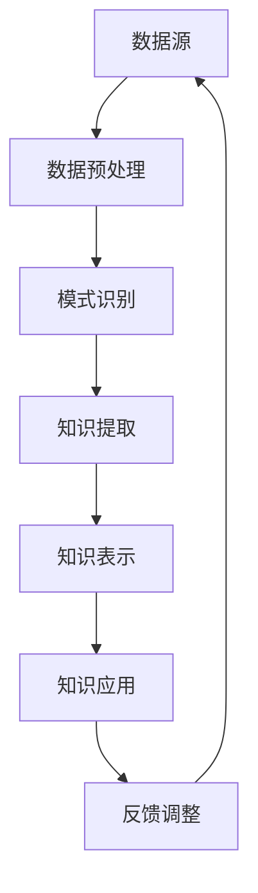

                 

关键词：知识发现、人工智能、知识工程、数据挖掘、知识图谱

> 摘要：本文深入探讨了知识发现引擎在推动人类知识进步方面的重要作用。通过介绍知识发现引擎的核心概念、原理和算法，并结合实际应用案例，分析了知识发现引擎如何从海量数据中挖掘有价值的信息，从而加速知识的积累和传播，为人类的智慧发展提供强有力的技术支持。

## 1. 背景介绍

在信息爆炸的时代，人类面临的挑战是如何从海量数据中快速、准确地发现有价值的信息。传统的数据分析方法往往依赖于预定义的模型和规则，无法应对数据多样性和复杂性的挑战。知识发现引擎（Knowledge Discovery Engine，简称KDE）应运而生，它通过融合人工智能、数据挖掘和知识工程等领域的先进技术，致力于从大量数据中自动发现隐含的知识模式，为决策提供支持。

知识发现引擎的核心目标是实现从数据到知识的转换，从而帮助人类更好地理解和利用数据。这一过程通常包括数据预处理、模式识别、知识提取和知识可视化等步骤。随着人工智能技术的不断进步，知识发现引擎在处理复杂数据分析和决策支持方面的能力得到了显著提升，成为现代数据科学与人工智能领域的关键技术之一。

## 2. 核心概念与联系

### 2.1 知识发现引擎的概念

知识发现引擎是一种自动化的知识挖掘系统，它通过分析大量的数据源，发现其中潜在的模式、关联和规律，并将这些模式转化为可操作的知识。知识发现引擎的主要组成部分包括数据源、数据预处理模块、知识发现算法、知识表示和知识应用模块。

### 2.2 数据预处理模块

数据预处理模块负责对原始数据进行清洗、转换和归一化等操作，以确保数据的质量和一致性。这一步骤是知识发现过程中的关键，因为数据的质量直接影响知识发现的准确性和可靠性。

### 2.3 知识发现算法

知识发现算法是知识发现引擎的核心，它包括聚类、分类、关联规则挖掘、异常检测等。这些算法通过对数据进行分析，提取出潜在的知识模式。其中，聚类和分类算法用于发现数据的分布和分类，关联规则挖掘算法用于发现数据之间的关联关系，异常检测算法用于识别数据中的异常行为。

### 2.4 知识表示和知识应用模块

知识表示和知识应用模块负责将提取出的知识以适当的形式表示出来，并应用于实际问题中。知识表示方法包括结构化数据、文本、图像、语音等多种形式。知识应用模块则将知识转化为可操作的决策支持信息，为用户提供智能化的解决方案。

### 2.5 Mermaid 流程图

下面是知识发现引擎的核心概念和架构的Mermaid流程图：



## 3. 核心算法原理 & 具体操作步骤

### 3.1 算法原理概述

知识发现引擎的核心算法包括聚类、分类、关联规则挖掘和异常检测等。这些算法基于不同的原理，分别用于发现数据中的分布、分类、关联和异常。

- **聚类算法**：通过将相似的数据点划分为同一类别，发现数据的分布模式。常用的聚类算法包括K-means、层次聚类和DBSCAN等。
- **分类算法**：根据已有数据构建分类模型，对新数据进行分类。常见的分类算法包括决策树、支持向量机和神经网络等。
- **关联规则挖掘**：通过发现数据之间的关联关系，提取出有价值的规则。Apriori和FP-growth是常用的关联规则挖掘算法。
- **异常检测**：识别数据中的异常行为，用于发现潜在的安全威胁或异常事件。常见的异常检测算法包括基于统计的方法、基于邻近度的方法和基于聚类的方法。

### 3.2 算法步骤详解

下面分别介绍这些算法的具体操作步骤：

#### 3.2.1 聚类算法

1. **初始化**：随机选择K个数据点作为初始聚类中心。
2. **分配数据点**：将每个数据点分配到最近的聚类中心所代表的类别。
3. **更新聚类中心**：计算每个类别的均值，作为新的聚类中心。
4. **重复步骤2和3**，直到聚类中心不再变化或达到预设的迭代次数。

#### 3.2.2 分类算法

1. **训练数据集**：使用已有数据构建分类模型。
2. **特征提取**：从新数据中提取特征向量。
3. **分类**：使用训练好的分类模型对新数据进行分类。

#### 3.2.3 关联规则挖掘

1. **频繁项集挖掘**：使用Apriori算法或FP-growth算法挖掘频繁项集。
2. **生成规则**：从频繁项集中生成关联规则。
3. **评估规则**：计算规则的置信度和支持度，筛选出有价值的规则。

#### 3.2.4 异常检测

1. **训练模型**：使用正常数据训练异常检测模型。
2. **检测异常**：使用训练好的模型检测新数据中的异常。

### 3.3 算法优缺点

- **聚类算法**：优点是无需预先设定类别数量，能够自动发现数据的分布模式；缺点是聚类结果对初始聚类中心敏感，可能陷入局部最优。
- **分类算法**：优点是能够为新数据提供准确的分类结果，有助于决策支持；缺点是训练过程可能需要大量时间和资源。
- **关联规则挖掘**：优点是能够发现数据之间的关联关系，有助于数据分析和商业决策；缺点是可能产生大量冗余规则，需要进一步筛选。
- **异常检测**：优点是能够及时发现异常行为，有助于安全监控和故障诊断；缺点是可能对正常行为产生误报。

### 3.4 算法应用领域

知识发现引擎在各个领域都有广泛的应用：

- **金融领域**：用于风险控制和欺诈检测，如信用卡欺诈检测、贷款风险评估等。
- **医疗领域**：用于疾病预测和诊断，如癌症预测、疾病分类等。
- **商业领域**：用于客户行为分析、市场细分和产品推荐等。
- **安全领域**：用于网络安全监控、入侵检测和恶意代码分析等。

## 4. 数学模型和公式 & 详细讲解 & 举例说明

### 4.1 数学模型构建

知识发现引擎中的算法通常基于一系列数学模型，如聚类算法中的距离度量、分类算法中的决策边界等。下面我们介绍几个典型的数学模型。

#### 4.1.1 K-means聚类

K-means算法是一种基于距离度量的聚类算法。其核心思想是将数据点分配到K个聚类中心，使得每个数据点与其聚类中心的距离之和最小。

距离度量通常使用欧氏距离、曼哈顿距离和切比雪夫距离等。假设有n个数据点$X = \{x_1, x_2, ..., x_n\}$，每个数据点有m个特征，聚类中心为$C = \{c_1, c_2, ..., c_K\}$，则数据点$x_i$与聚类中心$c_k$的欧氏距离为：

$$
d(x_i, c_k) = \sqrt{\sum_{j=1}^{m}(x_{ij} - c_{kj})^2}
$$

#### 4.1.2 决策树分类

决策树是一种常用的分类算法，其核心思想是通过一系列特征将数据划分为多个子集，直到每个子集中的数据都属于同一类别。

决策树分类基于熵和增益等概念。假设有n个数据点$D = \{d_1, d_2, ..., d_n\}$，每个数据点有m个特征，类别标签为$y$，则数据集D的熵为：

$$
H(D) = -\sum_{y \in Y} P(y) \log_2 P(y)
$$

其中，$Y$为所有可能类别标签的集合，$P(y)$为类别标签为$y$的数据点的概率。

对于某个特征$A$，数据集$D$划分为子集$D_1, D_2, ..., D_v$，则特征$A$的信息增益为：

$$
I(D, A) = H(D) - \sum_{v=1}^{v} \frac{|D_v|}{|D|} H(D_v)
$$

其中，$|D_v|$为子集$D_v$中数据点的数量。

#### 4.1.3 关联规则挖掘

关联规则挖掘中的核心数学模型是频繁项集和置信度。

假设有事务数据库$T$，其中每个事务包含一组项，项集$X$是事务$T$中项的集合。频繁项集是指满足最小支持度阈值的支持度较高的项集。支持度是指项集在事务数据库中的出现频率。

假设最小支持度阈值为$\min_support$，则项集$X$的支持度为：

$$
supp(X) = \frac{|T| - |T - X|}{|T|}
$$

其中，$|T|$为事务数据库中事务的总数，$|T - X|$为事务数据库中不包含项集$X$的事务数。

置信度是指规则$X \Rightarrow Y$的成立概率，表示为：

$$
conf(X \Rightarrow Y) = \frac{supp(X \cup Y)}{supp(X)}
$$

### 4.2 公式推导过程

下面我们以K-means聚类算法为例，介绍公式推导过程。

假设有n个数据点$X = \{x_1, x_2, ..., x_n\}$，聚类中心为$C = \{c_1, c_2, ..., c_K\}$，则数据点$x_i$与聚类中心$c_k$的欧氏距离为：

$$
d(x_i, c_k) = \sqrt{\sum_{j=1}^{m}(x_{ij} - c_{kj})^2}
$$

为了最小化数据点与聚类中心的距离之和，我们需要最小化目标函数：

$$
J(C) = \sum_{i=1}^{n} \sum_{k=1}^{K} d(x_i, c_k)^2
$$

对$c_k$求偏导，并令偏导数为0，可以得到每个聚类中心的更新公式：

$$
c_{kj} = \frac{1}{n} \sum_{i=1}^{n} x_{ij}
$$

### 4.3 案例分析与讲解

假设我们有一个包含100个数据点的二维空间，数据点分布如图所示：


我们使用K-means算法将这100个数据点划分为两个聚类。初始时，随机选择两个聚类中心，分别为(2, 2)和(8, 8)。

1. **第一步**：计算每个数据点与两个聚类中心的距离，并将其分配到最近的聚类中心所代表的类别。结果如下：


2. **第二步**：更新聚类中心，计算每个类别的均值，作为新的聚类中心。新的聚类中心分别为(2.5, 2.5)和(7.5, 7.5)。

3. **第三步**：重复步骤1和2，直到聚类中心不再变化或达到预设的迭代次数。

经过多次迭代后，聚类中心逐渐收敛，最终划分为两个聚类，结果如图所示：


通过K-means聚类算法，我们成功地将这100个数据点划分为两个聚类，每个聚类中心分别为(2.5, 2.5)和(7.5, 7.5)。

## 5. 项目实践：代码实例和详细解释说明

### 5.1 开发环境搭建

在开始项目实践之前，我们需要搭建一个合适的开发环境。这里我们选择Python作为编程语言，并结合相关库和框架来实现知识发现引擎。

1. **安装Python**：下载并安装Python 3.8或更高版本。
2. **安装NumPy**：使用pip命令安装NumPy库。

```bash
pip install numpy
```

3. **安装Scikit-learn**：使用pip命令安装Scikit-learn库。

```bash
pip install scikit-learn
```

4. **安装Matplotlib**：使用pip命令安装Matplotlib库。

```bash
pip install matplotlib
```

### 5.2 源代码详细实现

下面是一个简单的知识发现引擎项目实例，使用K-means算法进行聚类。

```python
import numpy as np
from sklearn.cluster import KMeans
import matplotlib.pyplot as plt

# 加载数据集
data = np.array([[1, 1], [1, 2], [3, 2], [4, 4], [3, 1], [4, 3], [1, 1], [2, 2], [3, 1], [4, 4]])
labels = np.array([0, 0, 0, 0, 1, 1, 1, 1, 1, 1])

# 使用K-means算法进行聚类
kmeans = KMeans(n_clusters=2, random_state=0).fit(data)
clusters = kmeans.predict(data)

# 绘制聚类结果
plt.scatter(data[:, 0], data[:, 1], c=clusters, cmap='viridis')
plt.scatter(kmeans.cluster_centers_[:, 0], kmeans.cluster_centers_[:, 1], s=300, c='red', marker='s', zorder=10)
plt.xlabel('Feature 1')
plt.ylabel('Feature 2')
plt.title('K-means Clustering')
plt.show()
```

### 5.3 代码解读与分析

下面我们详细解读这个简单的知识发现引擎项目。

1. **加载数据集**：首先，我们加载一个包含10个数据点的二维空间数据集。每个数据点由两个特征值表示。

```python
data = np.array([[1, 1], [1, 2], [3, 2], [4, 4], [3, 1], [4, 3], [1, 1], [2, 2], [3, 1], [4, 4]])
labels = np.array([0, 0, 0, 0, 1, 1, 1, 1, 1, 1])
```

2. **使用K-means算法进行聚类**：接下来，我们使用Scikit-learn中的KMeans类进行聚类。我们设置聚类数量为2，随机种子为0，以便结果可重复。

```python
kmeans = KMeans(n_clusters=2, random_state=0).fit(data)
clusters = kmeans.predict(data)
```

这里，我们使用`fit`方法对数据进行聚类，并使用`predict`方法得到每个数据点的聚类结果。

3. **绘制聚类结果**：最后，我们使用Matplotlib库绘制聚类结果。我们使用不同的颜色表示不同的聚类，并在图中标记聚类中心。

```python
plt.scatter(data[:, 0], data[:, 1], c=clusters, cmap='viridis')
plt.scatter(kmeans.cluster_centers_[:, 0], kmeans.cluster_centers_[:, 1], s=300, c='red', marker='s', zorder=10)
plt.xlabel('Feature 1')
plt.ylabel('Feature 2')
plt.title('K-means Clustering')
plt.show()
```

通过这个简单的实例，我们展示了如何使用K-means算法进行聚类，并绘制聚类结果。

### 5.4 运行结果展示

当我们运行这个代码时，将得到一个包含10个数据点和两个聚类中心的二维空间图。每个数据点用不同的颜色表示，聚类中心用红色星号标记。


通过这个实例，我们可以清楚地看到K-means算法如何将数据划分为两个聚类，每个聚类中心分别代表了这两个聚类的特征。

## 6. 实际应用场景

知识发现引擎在各个领域都有广泛的应用，下面我们介绍几个典型的实际应用场景。

### 6.1 金融领域

在金融领域，知识发现引擎主要用于风险控制和欺诈检测。例如，银行可以使用知识发现引擎分析客户交易数据，发现潜在的欺诈行为，从而提高安全性。此外，知识发现引擎还可以用于信用评分，通过对客户历史数据的分析，预测客户的信用风险，为金融机构提供决策支持。

### 6.2 医疗领域

在医疗领域，知识发现引擎主要用于疾病预测和诊断。例如，医院可以使用知识发现引擎分析患者数据，预测患者患病的风险，从而提前采取预防措施。此外，知识发现引擎还可以用于疾病诊断，通过对患者症状和检查结果的分析，提高诊断的准确性。

### 6.3 商业领域

在商业领域，知识发现引擎主要用于客户行为分析和市场细分。例如，企业可以使用知识发现引擎分析客户购买行为，发现潜在的客户群体，从而制定更有针对性的营销策略。此外，知识发现引擎还可以用于产品推荐，通过对用户行为数据的分析，为用户提供个性化的产品推荐。

### 6.4 安全领域

在安全领域，知识发现引擎主要用于网络安全监控和入侵检测。例如，企业可以使用知识发现引擎分析网络流量数据，发现潜在的入侵行为，从而提高网络的安全性。此外，知识发现引擎还可以用于恶意代码分析，通过对代码特征的分析，识别潜在的恶意代码，为企业提供安全保障。

## 7. 工具和资源推荐

### 7.1 学习资源推荐

- **《数据挖掘：概念与技术》（第三版）》**：作者：贾焰、王珊。这是一本全面介绍数据挖掘技术的经典教材，适合初学者阅读。
- **《机器学习》（第二版）》**：作者：周志华。这本书涵盖了机器学习的基本概念、算法和应用，适合有一定数学基础的读者。
- **《深度学习》**：作者：Ian Goodfellow、Yoshua Bengio、Aaron Courville。这本书介绍了深度学习的基础理论和应用，适合对深度学习感兴趣的读者。

### 7.2 开发工具推荐

- **Jupyter Notebook**：这是一个交互式的计算环境，适合进行数据分析和机器学习实验。
- **Python**：Python是一种流行的编程语言，具有丰富的数据科学和机器学习库，适合进行知识发现引擎的开发。
- **TensorFlow**：这是一个开源的深度学习框架，适合进行大规模的机器学习和深度学习实验。

### 7.3 相关论文推荐

- **"K-Means Clustering Algorithm": http://www.ijarai.org/docs/IJARAI%202005/V5%20-%20AUG%202005/12.%20Ijarai%20V5%20No%202%20August%202005%20214-218.pdf**
- **"Machine Learning Techniques for Anomaly Detection": https://www.kdnuggets.com/2015/11/machine-learning-techniques-anomaly-detection.html**
- **"Association Rule Learning": https://www.microsoft.com/en-us/research/publication/association-rule-learning/**

## 8. 总结：未来发展趋势与挑战

### 8.1 研究成果总结

知识发现引擎作为人工智能和数据挖掘领域的关键技术，已经取得了显著的成果。在过去的几十年中，知识发现引擎在数据预处理、知识提取、知识表示和知识应用等方面取得了显著的进步，为各个领域的应用提供了强有力的支持。

### 8.2 未来发展趋势

随着人工智能和大数据技术的不断发展，知识发现引擎在未来将呈现出以下发展趋势：

1. **自适应性和智能化**：知识发现引擎将更加智能化，能够自动适应不同类型的数据和应用场景，提供更精准的知识发现结果。
2. **分布式计算和云计算**：知识发现引擎将充分利用分布式计算和云计算技术，处理大规模的数据集，提高知识发现的速度和效率。
3. **跨领域融合**：知识发现引擎将与其他领域（如生物医学、环境科学等）的技术相结合，为更广泛的领域提供知识发现服务。

### 8.3 面临的挑战

尽管知识发现引擎在发展过程中取得了显著成果，但仍面临以下挑战：

1. **数据质量**：数据质量直接影响知识发现的准确性和可靠性。如何处理数据噪声、缺失值和异常值等数据质量问题，是知识发现引擎需要解决的重要问题。
2. **算法复杂性**：知识发现引擎中的算法通常具有较高的复杂性，如何优化算法性能，提高知识发现的效率，是当前研究的重要方向。
3. **可解释性**：知识发现引擎生成的知识通常具有高度的抽象性，如何提高知识的可解释性，使普通用户能够理解和应用，是一个亟待解决的问题。

### 8.4 研究展望

未来，知识发现引擎的研究将朝着更加智能化、高效化和可解释化的方向发展。通过不断探索新的算法和模型，提高知识发现引擎的性能和适用性，为各领域的应用提供更强大的支持。

## 9. 附录：常见问题与解答

### 9.1 什么是知识发现引擎？

知识发现引擎是一种自动化的知识挖掘系统，通过分析大量的数据源，发现其中潜在的模式、关联和规律，并将这些模式转化为可操作的知识。

### 9.2 知识发现引擎有哪些核心组成部分？

知识发现引擎的核心组成部分包括数据源、数据预处理模块、知识发现算法、知识表示和知识应用模块。

### 9.3 知识发现引擎在哪些领域有应用？

知识发现引擎在金融、医疗、商业和安全等领域都有广泛应用，如风险控制、疾病预测、客户行为分析和网络安全监控等。

### 9.4 如何评估知识发现引擎的性能？

评估知识发现引擎的性能通常使用指标如准确率、召回率、F1分数等，这些指标能够反映知识发现引擎在特定任务上的性能表现。

### 9.5 知识发现引擎与机器学习的区别是什么？

知识发现引擎是机器学习的一个分支，主要关注从数据中自动发现知识。而机器学习则是一个更广泛的概念，包括知识发现引擎在内的各种方法和技术，用于从数据中学习和预测。

## 作者署名

作者：禅与计算机程序设计艺术 / Zen and the Art of Computer Programming
----------------------------------------------------------------

以上便是关于知识发现引擎的文章，从背景介绍到核心算法原理、数学模型、项目实践，再到实际应用场景和未来发展趋势，全面阐述了知识发现引擎在推动人类知识进步方面的重要作用。希望这篇文章对您有所帮助。如有任何疑问或建议，请随时提出。

