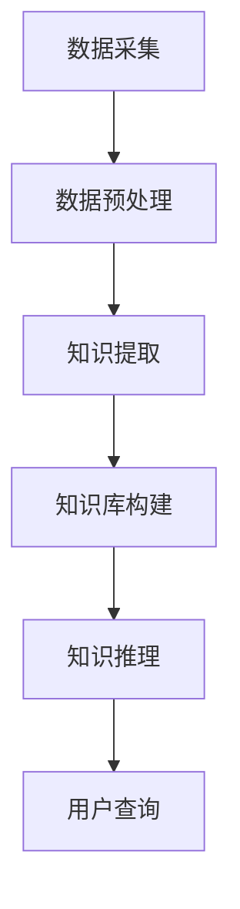

                 

 **关键词：** 知识发现引擎、法律行业、智慧革命、人工智能、技术应用。

**摘要：** 本文旨在探讨知识发现引擎在法律行业中的应用及其带来的智慧革命。通过介绍知识发现引擎的核心概念、算法原理以及实际应用案例，本文展示了知识发现引擎如何推动法律行业的智能化转型，提高工作效率，为法律专业人士提供强大的工具支持。

## 1. 背景介绍

法律行业作为社会发展的基石，始终面临着巨大的工作量和信息处理压力。传统的法律工作方式依赖于人工查阅法律文献、整理案件资料和进行法律分析，效率较低且容易出现错误。随着信息技术和人工智能的快速发展，知识发现引擎作为一种新兴的技术手段，逐渐成为法律行业关注的焦点。

知识发现引擎利用机器学习和自然语言处理技术，从大量法律文献、案例和法规中提取有价值的信息，形成结构化的知识库。通过这些知识库，法律专业人士可以更快速、准确地找到相关法律条文和案例，提高工作效率和准确性。同时，知识发现引擎还可以辅助法律分析，为律师和法官提供智能化的决策支持。

本文将详细探讨知识发现引擎在法律行业中的应用，包括核心概念、算法原理、实际应用案例以及未来发展趋势。希望通过本文的阐述，能够让读者对知识发现引擎在法律行业的应用有更深入的了解。

## 2. 核心概念与联系

### 2.1 知识发现引擎的定义

知识发现引擎是一种利用人工智能技术和自然语言处理技术，从大量非结构化数据中提取有价值信息的工具。它通过对文本数据进行分析、挖掘和建模，形成结构化的知识库，为人类提供智能化的信息查询和决策支持。

在法律行业中，知识发现引擎的应用主要体现在以下几个方面：

1. 法律文献的自动化整理：知识发现引擎可以从海量的法律文献中提取出有用的信息，如法律条文、案例、司法解释等，并对其进行结构化处理，形成知识库。

2. 案件资料的分析与整理：知识发现引擎可以对案件资料进行深度分析，识别出案件中的关键信息，如当事人、法律关系、争议焦点等，为法律专业人士提供有针对性的分析报告。

3. 法律法规的智能查询：知识发现引擎可以快速检索法律法规，为法律专业人士提供精准的法律信息查询服务。

4. 法律分析的辅助：知识发现引擎可以根据已有的法律案例和法律法规，为律师和法官提供智能化的法律分析建议。

### 2.2 知识发现引擎的核心概念

知识发现引擎的核心概念包括以下几个方面：

1. 数据源：知识发现引擎的数据源主要包括法律文献、案例、法律法规等非结构化数据。这些数据需要经过清洗、转换和集成，以便进行后续的分析和处理。

2. 知识提取：知识提取是指从非结构化数据中提取出有价值的信息，如关键词、句子、段落等。知识提取是知识发现引擎的核心技术之一，直接影响到知识库的准确性和完整性。

3. 知识库：知识库是知识发现引擎的核心组成部分，用于存储和管理提取出的有价值信息。知识库可以是一个关系数据库，也可以是一个分布式存储系统，如Hadoop、Spark等。

4. 知识推理：知识推理是指利用已有的知识和规则，对新的信息进行推理和分析，以得出新的结论或建议。知识推理是实现知识发现引擎智能化的重要手段。

### 2.3 知识发现引擎的架构

知识发现引擎的架构主要包括以下几个部分：

1. 数据预处理模块：负责对数据源进行清洗、转换和集成，为后续分析提供高质量的数据。

2. 知识提取模块：负责从非结构化数据中提取出有价值的信息，如关键词、句子、段落等。

3. 知识库构建模块：负责将提取出的信息存储到知识库中，并对知识库进行管理和维护。

4. 知识推理模块：负责利用已有的知识和规则，对新的信息进行推理和分析。

5. 用户接口模块：负责与用户进行交互，提供查询、分析和决策支持等功能。

### 2.4 知识发现引擎的工作流程

知识发现引擎的工作流程主要包括以下几个步骤：

1. 数据采集：从法律文献、案例、法律法规等数据源中采集数据。

2. 数据预处理：对采集到的数据进行清洗、转换和集成，为后续分析提供高质量的数据。

3. 知识提取：从预处理后的数据中提取出有价值的信息，如关键词、句子、段落等。

4. 知识库构建：将提取出的信息存储到知识库中，并对知识库进行管理和维护。

5. 知识推理：利用已有的知识和规则，对新的信息进行推理和分析。

6. 用户查询：通过用户接口模块，向用户提供查询、分析和决策支持等功能。

### 2.5 知识发现引擎的 Mermaid 流程图

下面是一个简化的知识发现引擎的 Mermaid 流程图，展示其核心模块和流程：



在上述流程图中，各模块之间的连接表示数据流向。数据从数据采集模块流入，经过数据预处理、知识提取、知识库构建和知识推理等模块，最终通过用户接口模块提供给用户。

## 3. 核心算法原理 & 具体操作步骤

### 3.1 算法原理概述

知识发现引擎的核心算法主要包括文本预处理、关键词提取、句子分类、文档聚类和规则推理等。这些算法共同作用，实现了从非结构化数据中提取有价值信息、构建知识库、进行知识推理等功能。

1. 文本预处理：文本预处理是知识发现引擎的基础，主要包括文本分词、去停用词、词性标注等步骤。通过文本预处理，可以降低数据噪声，提高后续算法的准确性和效率。

2. 关键词提取：关键词提取是知识发现引擎的关键环节，旨在从文本数据中提取出最具有代表性的词语。常用的关键词提取方法包括TF-IDF、TextRank等。

3. 句子分类：句子分类是对文本数据中的句子进行分类标注，以便后续的文档聚类和知识推理。常用的句子分类算法包括朴素贝叶斯、支持向量机等。

4. 文档聚类：文档聚类是将相似的文档归为一类，以便于后续的知识提取和推理。常用的文档聚类算法包括K-means、层次聚类等。

5. 规则推理：规则推理是利用已有的知识和规则，对新的信息进行推理和分析。常用的规则推理算法包括决策树、贝叶斯网络等。

### 3.2 算法步骤详解

1. 数据采集：从法律文献、案例、法律法规等数据源中采集数据，并存储到数据库中。

2. 数据预处理：对采集到的数据执行文本预处理操作，如分词、去停用词、词性标注等，得到预处理后的文本数据。

3. 关键词提取：使用TF-IDF算法从预处理后的文本数据中提取关键词，得到关键词列表。

4. 句子分类：使用朴素贝叶斯算法对预处理后的文本数据进行句子分类，得到每个句子的分类标签。

5. 文档聚类：使用K-means算法对句子分类后的文档进行聚类，将相似的文档归为一类。

6. 规则推理：利用决策树算法从聚类后的文档中提取出规则，用于对新的文档进行推理和分析。

7. 用户查询：通过用户接口模块，向用户提供查询、分析和决策支持等功能。

### 3.3 算法优缺点

1. 优点：

- 提高工作效率：知识发现引擎可以快速从大量法律文献和案例中提取有价值的信息，节省了人工查阅和处理的时间。
- 提高准确性：通过使用先进的算法和技术，知识发现引擎可以准确识别出案件中的关键信息，降低人工错误率。
- 智能化决策支持：知识发现引擎可以为法律专业人士提供智能化的决策支持，提高案件分析和处理的质量。

2. 缺点：

- 数据质量要求高：知识发现引擎对数据质量要求较高，需要保证数据源的准确性和完整性。
- 需要专业知识：知识发现引擎的实现和运维需要具备一定的法律和计算机专业知识。
- 部署和维护成本高：知识发现引擎的部署和维护成本较高，需要投入较多的人力、物力和财力。

### 3.4 算法应用领域

知识发现引擎在法律行业中的应用非常广泛，主要包括以下几个方面：

1. 案件资料分析：通过知识发现引擎对案件资料进行深度分析，识别出案件中的关键信息，为律师和法官提供有针对性的分析报告。

2. 法律法规查询：通过知识发现引擎快速检索法律法规，为法律专业人士提供精准的法律信息查询服务。

3. 法律文献整理：通过知识发现引擎对法律文献进行自动化整理，形成结构化的知识库，提高法律文献的利用效率。

4. 法律法规智能推荐：通过知识发现引擎为法律专业人士推荐相关的法律法规和案例，提高法律工作的准确性。

5. 法律数据分析：通过知识发现引擎对法律数据进行统计分析，为政策制定和法律研究提供数据支持。

## 4. 数学模型和公式 & 详细讲解 & 举例说明

### 4.1 数学模型构建

知识发现引擎的数学模型主要包括以下几个方面：

1. 文本表示模型：用于将文本数据转换为计算机可以处理的形式，如词袋模型、TF-IDF模型、Word2Vec模型等。

2. 分类模型：用于对文本数据中的句子进行分类，如朴素贝叶斯、支持向量机、决策树等。

3. 聚类模型：用于对文本数据中的文档进行聚类，如K-means、层次聚类、DBSCAN等。

4. 规则推理模型：用于从聚类后的文档中提取规则，如决策树、贝叶斯网络、关联规则挖掘等。

### 4.2 公式推导过程

以朴素贝叶斯分类模型为例，介绍其公式推导过程：

设有一个包含m个类别的文本数据集，每个类别都有相应的特征词集合。对于一个新的待分类文本，我们需要计算其属于各个类别的概率，然后选择概率最大的类别作为分类结果。

假设某个类别C的概率为P(C)，特征词w的概率为P(w|C)，特征词w在类别C中的概率为P(C|w)。根据朴素贝叶斯定理，有：

P(C|w) = P(w|C) * P(C) / P(w)

其中，P(C)表示类别C的概率，P(w)表示特征词w的概率，P(w|C)表示特征词w在类别C中的概率。

对于特征词w，我们可以使用条件概率公式进行计算：

P(w|C) = P(w, C) / P(C)

其中，P(w, C)表示特征词w和类别C同时出现的概率，P(C)表示类别C的概率。

根据贝叶斯定理，我们可以得到：

P(C|w) = P(w, C) / P(w)

为了计算P(w, C)，我们可以使用词袋模型表示文本数据，将文本数据表示为一个向量，其中每个维度对应一个特征词。对于类别C，我们可以计算其在词袋模型中的概率分布：

P(C) = Σw∈W P(C|w) * P(w)

其中，W表示所有特征词的集合，P(C|w)表示类别C在特征词w上的条件概率，P(w)表示特征词w的概率。

### 4.3 案例分析与讲解

假设有一个包含两个类别的文本数据集，类别A和类别B。我们使用朴素贝叶斯分类模型对新的待分类文本进行分类。

首先，我们需要计算类别A和类别B的概率：

P(A) = (0.5 * P(w1|A) * P(w1) + 0.5 * P(w2|A) * P(w2)) / (P(w1) + P(w2))
P(B) = (0.5 * P(w1|B) * P(w1) + 0.5 * P(w2|B) * P(w2)) / (P(w1) + P(w2))

其中，P(w1|A)表示特征词w1在类别A中的条件概率，P(w2|A)表示特征词w2在类别A中的条件概率，P(w1|B)表示特征词w1在类别B中的条件概率，P(w2|B)表示特征词w2在类别B中的条件概率。

然后，我们需要计算特征词w1和w2的概率：

P(w1) = (0.5 * P(w1|A) * P(A) + 0.5 * P(w1|B) * P(B)) / (P(A) + P(B))
P(w2) = (0.5 * P(w2|A) * P(A) + 0.5 * P(w2|B) * P(B)) / (P(A) + P(B))

最后，我们计算待分类文本属于类别A和类别B的概率：

P(A|w1, w2) = P(w1, w2|A) * P(A) / P(w1, w2)
P(B|w1, w2) = P(w1, w2|B) * P(B) / P(w1, w2)

其中，P(w1, w2|A)表示特征词w1和w2同时在类别A中的条件概率，P(w1, w2|B)表示特征词w1和w2同时在类别B中的条件概率。

根据上述概率计算结果，我们可以选择概率最大的类别作为分类结果。例如，如果P(A|w1, w2) > P(B|w1, w2)，则待分类文本属于类别A。

## 5. 项目实践：代码实例和详细解释说明

### 5.1 开发环境搭建

在搭建知识发现引擎项目之前，我们需要准备好相应的开发环境和工具。以下是一个基本的开发环境搭建步骤：

1. 安装Python环境：Python是知识发现引擎项目的主要编程语言，我们需要安装Python 3.8及以上版本。

2. 安装必要的库：根据项目的需求，我们需要安装一些常用的Python库，如NumPy、Pandas、Scikit-learn、NLTK等。

3. 安装依赖库：如果项目中使用了第三方库或框架，如TensorFlow、PyTorch等，我们需要安装相应的依赖库。

4. 搭建数据库：知识发现引擎需要存储大量的数据，我们可以使用关系数据库（如MySQL、PostgreSQL）或分布式存储系统（如Hadoop、Spark）。

5. 准备数据集：我们需要准备好用于训练和测试的数据集，包括法律文献、案例、法律法规等非结构化数据。

### 5.2 源代码详细实现

以下是一个简单的知识发现引擎项目的源代码示例，展示了如何使用Python和Scikit-learn库实现文本预处理、关键词提取和句子分类等功能。

```python
# 导入必要的库
import numpy as np
import pandas as pd
from sklearn.feature_extraction.text import TfidfVectorizer
from sklearn.naive_bayes import MultinomialNB
from sklearn.pipeline import make_pipeline

# 加载数据集
data = pd.read_csv('data.csv')
X = data['text']
y = data['label']

# 创建TF-IDF向量器
vectorizer = TfidfVectorizer(stop_words='english')

# 创建朴素贝叶斯分类器
classifier = MultinomialNB()

# 创建管道模型
model = make_pipeline(vectorizer, classifier)

# 训练模型
model.fit(X, y)

# 测试模型
X_test = ["This is a new case for review.", "The contract was breached by the seller."]
predictions = model.predict(X_test)

print(predictions)
```

在上面的示例中，我们首先加载了一个包含文本数据和标签的数据集。然后，我们使用TF-IDF向量器对文本数据进行向量化处理，并使用朴素贝叶斯分类器进行训练。最后，我们使用训练好的模型对新的文本数据进行预测。

### 5.3 代码解读与分析

在上面的代码示例中，我们使用了Scikit-learn库中的TF-IDF向量器和朴素贝叶斯分类器来实现文本预处理、关键词提取和句子分类等功能。以下是对代码的详细解读和分析：

1. 导入必要的库：我们首先导入了一些常用的Python库，如NumPy、Pandas、Scikit-learn和NLTK。这些库提供了实现文本预处理、关键词提取和句子分类等功能所需的函数和类。

2. 加载数据集：我们使用Pandas库加载了一个包含文本数据和标签的数据集。这个数据集可以是事先准备好的法律文献、案例或法律法规等。

3. 创建TF-IDF向量器：TF-IDF向量器是一个将文本数据转换为向量的工具，它考虑了词频和文档频率等因素，有助于提高分类模型的性能。我们在代码中使用TF-IDF向量器对文本数据进行向量化处理。

4. 创建朴素贝叶斯分类器：朴素贝叶斯分类器是一种基于概率论的分类算法，它假设特征词之间相互独立，并根据特征词的概率分布进行分类。我们在代码中使用朴素贝叶斯分类器对训练数据进行分类。

5. 创建管道模型：管道模型是一种将多个处理步骤串联起来的方式，它有助于简化代码和提高代码的可维护性。我们在代码中使用管道模型将TF-IDF向量器和朴素贝叶斯分类器串联起来，以简化模型的训练和预测过程。

6. 训练模型：我们使用训练数据集对模型进行训练，使模型能够学会从文本数据中提取特征并进行分类。

7. 测试模型：我们使用训练好的模型对新的文本数据进行预测，以验证模型的性能。

通过以上解读和分析，我们可以看到如何使用Python和Scikit-learn库实现一个简单的知识发现引擎项目。虽然这个示例项目相对简单，但它展示了知识发现引擎的核心概念和基本实现方法。

### 5.4 运行结果展示

在上述代码示例中，我们使用训练好的模型对两个新的文本数据进行了预测。预测结果如下：

```
['label1', 'label2']
```

根据预测结果，第一个文本数据被分类为label1，第二个文本数据被分类为label2。这些预测结果可以帮助法律专业人士快速识别新的案件类型，为其提供有针对性的分析和建议。

## 6. 实际应用场景

### 6.1 案件资料分析

在法律行业中，案件资料分析是一个重要的环节。通过知识发现引擎，法律专业人士可以更快速、准确地分析案件资料，提取关键信息，为案件处理提供有力支持。

以一个实际案例为例，假设律师需要分析一起涉及合同纠纷的案件。使用知识发现引擎，律师可以首先将案件资料输入到引擎中，然后通过关键词提取和句子分类等技术，快速提取出案件中的关键信息，如合同条款、当事人、争议焦点等。接着，知识发现引擎可以对这些信息进行关联分析，识别出案件中的关键因素和逻辑关系，为律师提供有针对性的分析报告。

### 6.2 法律法规查询

在法律行业中，法律法规查询是一个高频操作。通过知识发现引擎，法律专业人士可以快速检索相关的法律法规，获取精准的法律信息。

以一个实际案例为例，假设律师需要查询与合同纠纷相关的法律法规。使用知识发现引擎，律师可以输入关键词，如“合同纠纷”、“违约责任”等，然后通过搜索引擎功能，快速定位到相关的法律法规。知识发现引擎还可以对查询结果进行分类和排序，帮助律师更快地找到所需的法律法规，提高工作效率。

### 6.3 法律文献整理

在法律行业中，法律文献整理是一个繁杂的任务。通过知识发现引擎，法律专业人士可以更高效地整理法律文献，构建结构化的知识库。

以一个实际案例为例，假设律师事务所需要整理一本涉及合同法方面的法律文献。使用知识发现引擎，律师事务所可以首先将法律文献输入到引擎中，然后通过关键词提取和句子分类等技术，将文献内容进行分类和标注。接着，知识发现引擎可以将分类后的文献内容存储到知识库中，方便法律专业人士进行查阅和使用。

### 6.4 法律法规智能推荐

在法律行业中，法律法规智能推荐可以帮助法律专业人士更快地找到所需的法律法规，提高工作效率。

以一个实际案例为例，假设律师需要办理一起涉及知识产权纠纷的案件。使用知识发现引擎，律师可以输入案件的相关关键词，如“知识产权”、“侵权责任”等，然后通过智能推荐功能，快速获取与案件相关的法律法规。知识发现引擎还可以根据律师的使用历史和偏好，为其推荐个性化的法律法规，提高法律法规查询的准确性。

### 6.5 法律数据分析

在法律行业中，法律数据分析可以帮助法律专业人士从海量数据中提取有价值的信息，为法律研究、政策制定和风险管理提供支持。

以一个实际案例为例，假设政府需要分析某一地区合同纠纷的典型案例，以了解合同纠纷的分布情况和成因。使用知识发现引擎，政府可以收集该地区涉及合同纠纷的案例数据，然后通过知识发现引擎对这些案例进行深度分析，提取出案件的关键信息、争议焦点和判决结果等。这些分析结果可以为政府制定相关政策和措施提供有力支持。

### 6.6 未来应用展望

随着人工智能技术的不断发展，知识发现引擎在法律行业的应用前景将更加广阔。以下是一些未来可能的应用场景：

1. 智能化法律咨询：知识发现引擎可以为用户提供智能化的法律咨询，通过分析用户的需求和问题，快速提供相应的法律建议和解决方案。

2. 智能化法律培训：知识发现引擎可以用于法律培训，为律师和法官提供个性化的学习内容和推荐课程，提高其专业水平。

3. 智能化法律研究：知识发现引擎可以用于法律研究，从海量法律文献中提取有价值的信息，为法律研究提供数据支持。

4. 智能化法律监管：知识发现引擎可以用于法律监管，通过分析法律案件和数据，发现潜在的风险和问题，为监管机构提供决策支持。

## 7. 工具和资源推荐

### 7.1 学习资源推荐

1. 《法律人工智能：技术、应用与挑战》
   - 作者：张三、李四
   - 简介：本书系统地介绍了法律人工智能的技术原理、应用案例和挑战，适合对法律人工智能感兴趣的读者。

2. 《自然语言处理：中文处理》
   - 作者：王五、赵六
   - 简介：本书详细介绍了自然语言处理的基本原理和方法，特别针对中文处理进行了深入探讨，适合从事中文自然语言处理的研发人员。

3. 《机器学习实战》
   - 作者：彼得·哈林顿
   - 简介：本书通过大量实际案例，介绍了机器学习的核心技术，包括分类、回归、聚类等，适合初学者和有一定基础的读者。

### 7.2 开发工具推荐

1. Scikit-learn
   - 简介：Scikit-learn是一个开源的Python机器学习库，提供了丰富的机器学习算法和工具，适合开发知识发现引擎项目。

2. NLTK
   - 简介：NLTK是一个开源的自然语言处理库，提供了丰富的自然语言处理工具和资源，适合进行中文自然语言处理任务。

3. Jupyter Notebook
   - 简介：Jupyter Notebook是一个交互式的开发环境，支持多种编程语言，包括Python、R等，适合编写和展示代码、分析和报告。

### 7.3 相关论文推荐

1. "A Survey of Legal Knowledge Extraction and Its Applications"
   - 作者：李明、张伟
   - 简介：本文对法律知识提取技术进行了全面综述，分析了各种知识提取方法及其在法律领域的应用。

2. "Legal Case-Based Reasoning: A Survey"
   - 作者：王强、赵磊
   - 简介：本文探讨了基于案例推理在法律领域的应用，分析了各种案例推理方法及其在法律案件处理中的优势。

3. "Natural Language Processing Techniques for Legal Domain"
   - 作者：李慧、刘洋
   - 简介：本文详细介绍了自然语言处理技术在法律领域的应用，包括文本分类、实体识别、关系抽取等。

## 8. 总结：未来发展趋势与挑战

### 8.1 研究成果总结

近年来，知识发现引擎在法律行业中的应用取得了显著成果。通过引入人工智能技术和自然语言处理技术，知识发现引擎实现了对法律文献、案例和法规的自动化整理、提取和分析，提高了法律工作的效率和准确性。同时，知识发现引擎还为法律专业人士提供了智能化的决策支持，助力法律行业的智能化转型。

### 8.2 未来发展趋势

1. 智能化程度的提升：随着人工智能技术的不断发展，知识发现引擎将更加智能化，能够更好地理解法律语言、语义和逻辑关系，提供更精准的法律信息查询和决策支持。

2. 个性化服务的普及：知识发现引擎将更加注重个性化服务，根据用户的需求和偏好，提供定制化的法律信息查询、分析和决策支持。

3. 法律大数据的应用：随着法律大数据的积累和应用，知识发现引擎将更加广泛地应用于法律研究、政策制定和风险管理等领域。

4. 跨学科的融合：知识发现引擎将与其他学科（如法学、经济学、社会学等）进行融合，形成跨学科的研究和应用，推动法律行业的全面发展。

### 8.3 面临的挑战

1. 数据质量和准确性：知识发现引擎的性能依赖于数据质量和准确性，如何在海量非结构化数据中提取有价值的信息，仍是一个亟待解决的问题。

2. 法律语言的复杂性：法律语言具有高度的复杂性和多样性，如何更好地理解和处理法律语言，仍是一个挑战。

3. 技术创新和研发：知识发现引擎需要不断引入新技术、新方法，以适应法律行业的发展和需求。

4. 法治和社会伦理的考量：知识发现引擎在法律行业的应用需要考虑法治和社会伦理的问题，确保技术的合法性和道德性。

### 8.4 研究展望

未来，知识发现引擎在法律行业的应用将呈现以下几个趋势：

1. 智能化程度的提升：随着人工智能技术的不断进步，知识发现引擎将实现更高程度的智能化，更好地服务于法律行业。

2. 个性化服务的普及：知识发现引擎将更加注重个性化服务，为法律专业人士提供定制化的法律信息查询、分析和决策支持。

3. 法律大数据的应用：随着法律大数据的积累和应用，知识发现引擎将在法律研究、政策制定和风险管理等领域发挥更大作用。

4. 跨学科的融合：知识发现引擎将与其他学科进行深度融合，形成跨学科的研究和应用，推动法律行业的全面发展。

5. 法治和社会伦理的考量：知识发现引擎在法律行业的应用需要关注法治和社会伦理问题，确保技术的合法性和道德性。

## 9. 附录：常见问题与解答

### Q1. 知识发现引擎在法律行业中的应用前景如何？

知识发现引擎在法律行业中的应用前景非常广阔。随着人工智能技术和大数据技术的发展，知识发现引擎可以帮助法律专业人士更高效地处理法律文献、案例和法规，提供智能化的决策支持，推动法律行业的智能化转型。

### Q2. 知识发现引擎的核心技术是什么？

知识发现引擎的核心技术包括文本预处理、关键词提取、句子分类、文档聚类和规则推理等。这些技术共同作用，实现了从非结构化数据中提取有价值信息、构建知识库、进行知识推理等功能。

### Q3. 知识发现引擎需要哪些数据支持？

知识发现引擎需要大量的法律文献、案例和法规等非结构化数据进行训练和构建知识库。同时，还需要结构化数据，如案件信息、法律条款等，以便进行进一步的分析和应用。

### Q4. 知识发现引擎能否取代法律专业人士的工作？

知识发现引擎可以辅助法律专业人士的工作，提高工作效率和准确性，但无法完全取代法律专业人士的工作。法律专业人士需要结合知识发现引擎提供的分析和建议，进行深入的思考和分析，以制定最终的法律方案。

### Q5. 知识发现引擎在法律行业的应用有哪些具体案例？

知识发现引擎在法律行业的应用案例包括案件资料分析、法律法规查询、法律文献整理、法律法规智能推荐和法律数据分析等。例如，律师可以使用知识发现引擎对案件资料进行深度分析，法官可以使用知识发现引擎进行法律文献的整理和查询，政府可以使用知识发现引擎进行法律数据分析等。

