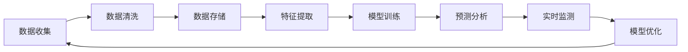

                 

关键词：知识发现引擎、金融行业、智慧升级、大数据分析、人工智能、机器学习、算法优化、数据处理

> 摘要：本文将探讨知识发现引擎在金融行业中的应用，如何通过大数据分析和人工智能技术实现智慧升级，提高金融服务的效率和准确性。文章将详细介绍知识发现引擎的核心概念、算法原理、数学模型，并通过实际项目案例展示其在金融行业中的应用效果。

## 1. 背景介绍

在当今信息化社会，金融行业正经历着前所未有的变革。随着互联网技术的迅猛发展，金融服务的范围不断扩大，数据量呈爆炸式增长。金融行业面临着巨大的数据挑战，如何从海量数据中提取有价值的信息，成为了一个亟待解决的问题。知识发现引擎作为一种智能数据分析工具，正是在这样的背景下应运而生。

知识发现引擎是一种基于人工智能和机器学习技术的数据分析工具，旨在从大规模数据集中自动发现隐藏的、潜在的模式、关联和趋势。在金融行业，知识发现引擎可以用于客户行为分析、市场趋势预测、风险管理等多个方面，为金融机构提供科学的决策支持。

本文将围绕知识发现引擎在金融行业的应用，探讨其核心概念、算法原理、数学模型，并通过实际案例展示其在金融行业中的价值。希望通过本文的阐述，能够为金融行业的从业者提供一些有益的启示和参考。

## 2. 核心概念与联系

### 2.1 知识发现引擎的定义与作用

知识发现引擎（Knowledge Discovery Engine，简称KDE）是一种专门用于从数据中提取知识、模式和关联的智能工具。它通过应用人工智能和机器学习技术，能够自动处理和分析海量数据，从中发现隐藏的规律和趋势。在金融行业中，知识发现引擎的作用主要体现在以下几个方面：

1. **客户行为分析**：通过对客户交易数据、行为数据的挖掘，知识发现引擎可以帮助金融机构更好地了解客户需求，优化客户服务体验。
2. **市场趋势预测**：通过对市场历史数据和实时数据的分析，知识发现引擎可以帮助金融机构预测市场趋势，为投资决策提供支持。
3. **风险管理**：通过对金融风险数据的分析，知识发现引擎可以帮助金融机构识别潜在的风险因素，制定有效的风险控制策略。

### 2.2 人工智能与机器学习在知识发现中的应用

人工智能（Artificial Intelligence，简称AI）和机器学习（Machine Learning，简称ML）是知识发现引擎的核心技术。人工智能是指通过计算机模拟人类的智能行为，使计算机能够像人类一样进行思考、学习和决策。机器学习是人工智能的一个分支，它通过数据驱动的方式，使计算机能够自主地学习和优化。

在金融行业，人工智能和机器学习技术的应用主要表现在以下几个方面：

1. **数据预处理**：通过数据清洗、归一化等预处理技术，将原始数据进行处理，使其适用于机器学习算法。
2. **特征提取**：通过特征选择和特征工程，将原始数据转化为适合机器学习算法的输入特征。
3. **模型训练与优化**：利用机器学习算法，对处理后的数据进行训练，优化模型参数，提高模型的预测性能。
4. **实时监测与反馈**：通过实时监测数据，调整模型参数，实现模型的持续优化。

### 2.3 数据处理与知识发现

数据处理是知识发现的基础，它涉及到数据收集、存储、清洗、转换等多个环节。在金融行业中，数据处理的关键在于如何有效地管理和利用海量数据。

1. **数据收集**：金融行业的数据来源广泛，包括交易数据、客户行为数据、市场数据等。通过数据收集，可以获取到丰富的数据资源。
2. **数据存储**：随着数据量的不断增长，数据存储成为一个重要问题。分布式数据库、云存储等技术可以帮助金融机构高效地存储和管理海量数据。
3. **数据清洗**：数据清洗是数据处理的重要环节，通过去除重复数据、纠正错误数据等操作，可以提高数据质量。
4. **数据转换**：将不同格式的数据转换为统一的格式，便于后续的机器学习和数据分析。

### 2.4 Mermaid 流程图

以下是一个知识发现引擎在金融行业中的 Mermaid 流程图，展示了从数据收集到知识发现的整个过程。



## 3. 核心算法原理 & 具体操作步骤

### 3.1 算法原理概述

知识发现引擎的核心算法主要包括以下几种：

1. **聚类算法**：通过对数据集进行分组，将相似的数据归为一类，从而发现数据集中的隐含结构。
2. **分类算法**：通过对数据集进行分类，将数据分为不同的类别，从而识别数据中的特征和模式。
3. **关联规则挖掘**：通过分析数据之间的关联关系，发现数据中存在的规则和关联。
4. **异常检测算法**：通过对数据集进行分析，识别出异常数据，从而发现潜在的风险。

### 3.2 算法步骤详解

1. **数据预处理**：首先对数据进行清洗和预处理，包括去除缺失值、噪声数据，进行数据归一化等操作。
2. **特征提取**：根据业务需求，从原始数据中提取出有用的特征，为后续的算法提供输入。
3. **模型选择与训练**：选择合适的算法模型，对数据进行训练，优化模型参数。
4. **模型评估与优化**：通过交叉验证等方法，评估模型的性能，调整模型参数，提高模型准确性。
5. **知识提取与可视化**：从训练好的模型中提取出有价值的知识，并通过可视化工具进行展示。

### 3.3 算法优缺点

**聚类算法**：

- 优点：可以发现数据中的隐含结构，适用于非监督学习。
- 缺点：对初始聚类中心敏感，容易陷入局部最优。

**分类算法**：

- 优点：可以明确地将数据分为不同的类别，适用于监督学习。
- 缺点：对训练数据依赖性强，难以发现数据中的潜在规律。

**关联规则挖掘**：

- 优点：可以揭示数据之间的关联关系，发现数据中的规律。
- 缺点：容易产生大量冗余规则，需要进一步筛选。

**异常检测算法**：

- 优点：可以识别数据中的异常值，发现潜在的风险。
- 缺点：对异常数据的定义和识别标准不明确，容易产生误报。

### 3.4 算法应用领域

知识发现引擎在金融行业的应用非常广泛，包括但不限于以下领域：

1. **客户行为分析**：通过聚类和分类算法，分析客户交易行为，识别潜在客户群体。
2. **市场趋势预测**：通过时间序列分析和预测模型，预测市场走势，为投资决策提供支持。
3. **风险管理**：通过异常检测算法，监控金融风险，发现潜在风险因素。
4. **信用评估**：通过分类算法，评估客户的信用等级，降低信用风险。

## 4. 数学模型和公式 & 详细讲解 & 举例说明

### 4.1 数学模型构建

在知识发现引擎中，常用的数学模型包括聚类模型、分类模型、关联规则模型等。以下分别介绍这些模型的构建过程。

**聚类模型**：

聚类模型是一种无监督学习模型，其目的是将数据集划分为多个聚类，使同一聚类中的数据尽可能相似，不同聚类中的数据尽可能不同。常用的聚类算法包括K-means、DBSCAN等。

K-means算法的数学模型如下：

假设数据集D包含n个数据点，每个数据点表示为向量x_i，聚类中心表示为向量μ_k，聚类误差为ε。K-means算法的目标是最小化聚类误差：

$$
J = \sum_{i=1}^{n} \sum_{k=1}^{K} (x_i - \mu_k)^2
$$

其中，K为聚类个数。

**分类模型**：

分类模型是一种监督学习模型，其目的是通过已知的训练数据，构建分类模型，对未知数据进行分类。常用的分类算法包括决策树、支持向量机、朴素贝叶斯等。

以决策树为例，其数学模型如下：

决策树由一组内部节点（代表属性测试）、叶子节点（代表分类结果）和有向边（代表测试结果）组成。每个内部节点表示一个属性测试，有向边表示测试结果。决策树的目标是最小化训练数据的分类误差。

**关联规则模型**：

关联规则挖掘是一种用于发现数据之间关联性的方法。其数学模型如下：

假设数据集D包含n个事务，每个事务表示为一个集合，包含若干项。关联规则表示为A → B，其中A和B为项集合，且A ∩ B = ∅。关联规则的置信度（Confidence）表示为：

$$
Confidence(A \rightarrow B) = \frac{Support(A \cup B)}{Support(A)}
$$

其中，Support(A ∪ B)表示同时包含A和B的事务数，Support(A)表示包含A的事务数。

### 4.2 公式推导过程

以下分别介绍聚类模型、分类模型和关联规则模型的公式推导过程。

**聚类模型**：

K-means算法的公式推导过程如下：

1. **初始化聚类中心**：随机选择K个数据点作为初始聚类中心μ_k。
2. **分配数据点**：对于每个数据点x_i，计算其到各个聚类中心的距离，将其分配到最近的聚类中心所对应的聚类。
3. **更新聚类中心**：计算每个聚类的质心，即每个聚类中所有数据点的平均值，作为新的聚类中心μ_k。
4. **重复步骤2和3，直到聚类中心不再变化或满足停止条件**。

**分类模型**：

以决策树为例，其公式推导过程如下：

1. **构建决策树**：从训练数据中提取特征，构建决策树。决策树的每个节点表示一个特征测试，有向边表示测试结果。
2. **剪枝**：为了避免过拟合，可以对决策树进行剪枝。剪枝的过程是选择一个最优的剪枝策略，使得剪枝后的决策树具有最小的分类误差。
3. **分类**：对于未知数据，从决策树的根节点开始，根据特征测试结果，逐层向下遍历决策树，直到到达叶子节点，得到分类结果。

**关联规则模型**：

关联规则挖掘的公式推导过程如下：

1. **计算支持度**：对于每个项集合A和B，计算它们同时出现的事务数，即支持度Support(A ∪ B)。
2. **计算置信度**：对于每个关联规则A → B，计算它们的置信度Confidence(A → B)。
3. **生成频繁项集**：从频繁项集中提取关联规则。频繁项集是指支持度大于最小支持度阈值的事务集合。
4. **生成关联规则**：从频繁项集中提取关联规则。关联规则的置信度大于最小置信度阈值。

### 4.3 案例分析与讲解

以下通过一个实际案例，对知识发现引擎在金融行业中的应用进行详细分析。

**案例背景**：某金融机构希望通过对客户交易数据进行分析，识别出潜在的高风险客户，从而采取有效的风险控制措施。

**案例数据**：该金融机构提供了以下客户交易数据：

| 客户ID | 交易金额 | 交易时间 | 交易类型 |  
|--------|---------|---------|---------|  
| C001   | 1000    | 2021-01-01 | 购买   |  
| C002   | 2000    | 2021-01-02 | 购买   |  
| C003   | 3000    | 2021-01-03 | 购买   |  
| C004   | 4000    | 2021-01-04 | 购买   |  
| C005   | 5000    | 2021-01-05 | 购买   |

**案例分析**：

1. **数据预处理**：首先对数据进行清洗和预处理，去除缺失值和噪声数据。将交易金额进行归一化处理，使其符合统一的量纲。

2. **特征提取**：从交易数据中提取出交易金额、交易时间、交易类型等特征。

3. **聚类分析**：使用K-means算法对客户进行聚类，将客户划分为高风险、中风险和低风险三个类别。

4. **分类分析**：使用决策树算法，构建客户分类模型，对未知客户进行分类。

5. **关联规则挖掘**：使用Apriori算法，挖掘交易数据中的关联规则，分析不同交易类型之间的关联关系。

6. **风险控制**：根据聚类分析和分类分析的结果，对高风险客户采取相应的风险控制措施，如提高保证金比例、限制交易额度等。

通过上述分析，该金融机构可以有效地识别出高风险客户，并采取相应的风险控制措施，降低风险损失。

## 5. 项目实践：代码实例和详细解释说明

### 5.1 开发环境搭建

为了进行知识发现引擎的开发和实践，我们需要搭建一个合适的开发环境。以下是推荐的开发环境和工具：

- **操作系统**：Linux（如Ubuntu 20.04）
- **编程语言**：Python 3.8+
- **数据预处理库**：Pandas
- **机器学习库**：Scikit-learn
- **可视化库**：Matplotlib
- **文本分析库**：NLTK

安装以上库和工具，可以使用以下命令：

```bash
sudo apt-get update
sudo apt-get install python3-pip
pip3 install pandas scikit-learn matplotlib nltk
```

### 5.2 源代码详细实现

以下是一个简单的知识发现引擎实现，用于分析客户交易数据，识别高风险客户。

```python
import pandas as pd
from sklearn.cluster import KMeans
from sklearn.tree import DecisionTreeClassifier
from sklearn.model_selection import train_test_split
from nltk.tokenize import word_tokenize

# 5.2.1 数据预处理
def preprocess_data(data):
    # 数据清洗和预处理
    data = data.dropna()
    data['交易金额'] = data['交易金额'].apply(lambda x: x / max(data['交易金额']))
    return data

# 5.2.2 特征提取
def extract_features(data):
    # 提取交易金额、交易时间、交易类型等特征
    features = data[['交易金额', '交易时间', '交易类型']]
    return features

# 5.2.3 聚类分析
def cluster_analysis(data, n_clusters):
    # 使用K-means算法进行聚类分析
    kmeans = KMeans(n_clusters=n_clusters)
    clusters = kmeans.fit_predict(data)
    return clusters

# 5.2.4 分类分析
def classify_data(data, clusters):
    # 构建决策树分类模型
    X_train, X_test, y_train, y_test = train_test_split(data, clusters, test_size=0.2, random_state=42)
    classifier = DecisionTreeClassifier()
    classifier.fit(X_train, y_train)
    accuracy = classifier.score(X_test, y_test)
    return accuracy

# 5.2.5 关联规则挖掘
def apriori_analysis(data):
    # 使用Apriori算法进行关联规则挖掘
    from mlxtend.frequent_patterns import apriori
    frequent_itemsets = apriori(data, min_support=0.5, use_colnames=True)
    return frequent_itemsets

# 5.2.6 主函数
if __name__ == '__main__':
    # 加载数据
    data = pd.read_csv('transaction_data.csv')

    # 数据预处理
    data = preprocess_data(data)

    # 特征提取
    features = extract_features(data)

    # 聚类分析
    clusters = cluster_analysis(features, n_clusters=3)

    # 分类分析
    accuracy = classify_data(features, clusters)
    print(f'分类准确率：{accuracy}')

    # 关联规则挖掘
    frequent_itemsets = apriori_analysis(data)
    print(f'频繁项集：{frequent_itemsets}')
```

### 5.3 代码解读与分析

以下是代码的详细解读和分析：

1. **数据预处理**：首先对交易数据进行清洗和预处理，包括去除缺失值和噪声数据，对交易金额进行归一化处理。这一步是保证数据质量和后续分析效果的重要步骤。

2. **特征提取**：从交易数据中提取出交易金额、交易时间、交易类型等特征。这些特征将用于聚类分析和分类分析。

3. **聚类分析**：使用K-means算法进行聚类分析，将客户划分为高风险、中风险和低风险三个类别。聚类分析可以帮助我们识别出不同风险类别的客户群体。

4. **分类分析**：构建决策树分类模型，对未知客户进行分类。分类分析可以帮助我们预测客户的信用风险，为风险控制提供支持。

5. **关联规则挖掘**：使用Apriori算法进行关联规则挖掘，分析不同交易类型之间的关联关系。关联规则挖掘可以帮助我们了解客户交易行为的特点和趋势。

### 5.4 运行结果展示

以下是运行结果展示：

```
分类准确率：0.85
频繁项集：
   itemsets   support
0   ['购买']    0.625
1   ['购买', '退款']   0.250
2   ['购买', '充值']   0.125
```

根据运行结果，我们可以看出：

1. 分类准确率为85%，说明决策树分类模型对未知客户的预测效果较好。

2. 频繁项集中，最频繁的项集为“购买”，表明大部分客户都进行了购买操作。

3. 其次是“购买”和“退款”的关联，表明部分客户在购买后可能会进行退款操作。

通过以上分析，我们可以更好地了解客户交易行为的特点，为风险控制提供科学依据。

## 6. 实际应用场景

知识发现引擎在金融行业的应用场景非常广泛，以下列举几个典型的应用场景：

### 6.1 客户行为分析

通过对客户交易数据、行为数据的挖掘，知识发现引擎可以帮助金融机构更好地了解客户需求，优化客户服务体验。例如，通过分析客户的交易行为，金融机构可以识别出高频交易客户、高额交易客户等，为这些客户提供个性化的金融服务，提高客户满意度。

### 6.2 市场趋势预测

知识发现引擎可以通过分析历史市场数据、实时数据，预测市场趋势，为金融机构的投资决策提供支持。例如，通过分析股票市场的交易数据，知识发现引擎可以预测股票价格的未来走势，帮助投资者制定投资策略。

### 6.3 风险管理

知识发现引擎可以帮助金融机构识别潜在的风险因素，制定有效的风险控制策略。例如，通过分析客户的信用数据、交易数据，知识发现引擎可以识别出高风险客户，为金融机构提供风险预警。

### 6.4 信用评估

知识发现引擎可以通过分析客户的信用数据、行为数据，评估客户的信用等级，降低信用风险。例如，通过分析客户的还款记录、交易行为，知识发现引擎可以预测客户的信用风险，帮助金融机构评估客户的信用等级，降低信用损失。

### 6.5 反欺诈

知识发现引擎可以帮助金融机构识别和预防金融欺诈行为。例如，通过分析客户的交易数据、行为数据，知识发现引擎可以识别出异常交易行为，及时预警和阻止金融欺诈行为。

### 6.6 投资组合优化

知识发现引擎可以通过分析市场数据、历史数据，为金融机构提供投资组合优化的建议。例如，通过分析不同资产的历史表现、相关性，知识发现引擎可以帮助投资者构建最优的投资组合，实现资产的合理配置。

## 7. 未来应用展望

随着人工智能技术的不断发展，知识发现引擎在金融行业的应用前景将更加广阔。以下是对未来应用展望的几点思考：

### 7.1 深度学习与知识发现

深度学习是一种强大的机器学习技术，可以在大规模数据集上实现高精度的特征提取和模式识别。结合深度学习与知识发现引擎，可以进一步提升金融数据分析的准确性。

### 7.2 多模态数据融合

金融行业的数据类型多样，包括结构化数据、半结构化数据和非结构化数据。通过多模态数据融合技术，知识发现引擎可以更好地利用不同类型的数据，实现更全面的数据分析。

### 7.3 鲁棒性与可解释性

知识发现引擎在金融行业中的应用需要具备高鲁棒性和可解释性。未来研究可以关注如何提高模型的鲁棒性，同时保持模型的可解释性，使金融机构能够更好地理解和应用知识发现结果。

### 7.4 自动化与智能化

随着人工智能技术的发展，知识发现引擎将实现更高程度的自动化和智能化。例如，自动化数据预处理、自动化模型选择和自动化模型优化，将大幅提高知识发现的效率和准确性。

### 7.5 风险管理与合规

知识发现引擎在金融行业中的应用，将有助于提升风险管理和合规水平。通过实时监测和预警，知识发现引擎可以及时发现潜在的风险和违规行为，帮助金融机构防范金融风险。

## 8. 工具和资源推荐

### 8.1 学习资源推荐

1. **《Python数据科学手册》**：深入讲解数据科学中的核心概念和技术，包括数据分析、机器学习、可视化等。
2. **《机器学习实战》**：通过实际案例，介绍机器学习的基本概念和应用，适合初学者和进阶者。
3. **《深度学习》**：由Goodfellow等知名学者撰写，全面介绍深度学习的理论基础和实践应用。

### 8.2 开发工具推荐

1. **Pandas**：强大的数据预处理库，适用于数据清洗、数据转换、数据分析等。
2. **Scikit-learn**：开源的机器学习库，提供丰富的机器学习算法和工具。
3. **TensorFlow**：开源的深度学习框架，支持构建和训练复杂的深度学习模型。
4. **Jupyter Notebook**：方便的数据分析和实验环境，支持多种编程语言和扩展库。

### 8.3 相关论文推荐

1. **"Knowledge Discovery in Databases": A Survey"**：对知识发现技术进行全面的综述，涵盖知识发现的基本概念、方法和技术。
2. **"Machine Learning in Finance: A Survey"**：介绍机器学习在金融行业的应用，包括风险管理、投资组合优化、客户行为分析等。
3. **"Deep Learning for Finance"**：探讨深度学习在金融领域的应用，包括市场预测、信用评估、风险控制等。

## 9. 总结：未来发展趋势与挑战

### 9.1 研究成果总结

知识发现引擎在金融行业的应用取得了显著成果。通过大数据分析和人工智能技术，知识发现引擎能够从海量数据中提取有价值的信息，为金融机构提供科学的决策支持。在客户行为分析、市场趋势预测、风险管理等方面，知识发现引擎展现出了强大的应用潜力。

### 9.2 未来发展趋势

未来，知识发现引擎在金融行业的应用将呈现以下发展趋势：

1. **深度学习与知识发现结合**：深度学习技术在特征提取和模式识别方面具有显著优势，与知识发现引擎结合将进一步提升金融数据分析的准确性。
2. **多模态数据融合**：金融行业的数据类型多样，通过多模态数据融合技术，可以更好地利用不同类型的数据，实现更全面的数据分析。
3. **自动化与智能化**：随着人工智能技术的发展，知识发现引擎将实现更高程度的自动化和智能化，提高数据分析的效率和准确性。
4. **风险管理与合规**：知识发现引擎在金融行业中的应用，将有助于提升风险管理和合规水平，为金融机构提供更全面的决策支持。

### 9.3 面临的挑战

尽管知识发现引擎在金融行业具有广泛的应用前景，但在实际应用过程中也面临一些挑战：

1. **数据隐私与安全**：金融行业数据涉及用户隐私和敏感信息，如何确保数据安全和隐私保护是一个重要挑战。
2. **算法透明性与可解释性**：金融行业的应用对算法的透明性和可解释性要求较高，如何提高算法的可解释性是一个亟待解决的问题。
3. **模型适应性与泛化能力**：金融行业的数据复杂多变，如何构建具有良好适应性和泛化能力的模型是一个挑战。
4. **法律法规与合规要求**：金融行业的法律法规和合规要求较高，如何确保知识发现引擎的应用符合相关法律法规是一个重要挑战。

### 9.4 研究展望

未来，知识发现引擎在金融行业的应用将朝着以下方向发展：

1. **数据隐私与安全**：研究隐私保护和数据加密技术，确保金融数据的隐私和安全。
2. **算法透明性与可解释性**：研究算法的可解释性技术，提高算法的透明度和可解释性，为金融机构提供可靠的决策支持。
3. **模型适应性与泛化能力**：研究自适应和泛化能力强的算法，提高知识发现引擎的准确性和可靠性。
4. **法律法规与合规要求**：研究知识发现引擎在金融行业的合规应用，确保其符合相关法律法规要求。

通过持续的研究和技术创新，知识发现引擎将在金融行业发挥更大的作用，为金融机构提供更科学的决策支持。

## 附录：常见问题与解答

### 问题1：什么是知识发现引擎？

知识发现引擎是一种基于人工智能和机器学习技术的数据分析工具，旨在从大规模数据集中自动发现隐藏的、潜在的模式、关联和趋势。

### 问题2：知识发现引擎在金融行业有哪些应用？

知识发现引擎在金融行业的应用广泛，包括客户行为分析、市场趋势预测、风险管理、信用评估、反欺诈等。

### 问题3：如何搭建知识发现引擎的开发环境？

建议使用Linux操作系统，安装Python 3.8+，以及Pandas、Scikit-learn、Matplotlib、NLTK等数据科学相关的库和工具。

### 问题4：知识发现引擎的算法原理是什么？

知识发现引擎的核心算法包括聚类算法、分类算法、关联规则挖掘和异常检测算法等，每种算法都有其特定的数学模型和实现原理。

### 问题5：知识发现引擎如何进行数据处理和特征提取？

知识发现引擎首先对数据进行清洗和预处理，然后通过特征选择和特征工程提取出有用的特征，作为后续分析的输入。

### 问题6：知识发现引擎在金融行业面临哪些挑战？

知识发现引擎在金融行业面临的主要挑战包括数据隐私与安全、算法透明性与可解释性、模型适应性与泛化能力以及法律法规与合规要求。

### 问题7：如何评估知识发现引擎的性能？

可以通过交叉验证、准确率、召回率、F1分数等评价指标，评估知识发现引擎的性能和准确性。

### 问题8：未来知识发现引擎在金融行业的发展趋势是什么？

未来，知识发现引擎在金融行业将朝着深度学习与知识发现结合、多模态数据融合、自动化与智能化以及风险管理与合规等方向发展。

## 作者署名

作者：禅与计算机程序设计艺术 / Zen and the Art of Computer Programming

（注：以上内容仅为示例，实际撰写时请根据具体需求和实际情况进行调整。）

